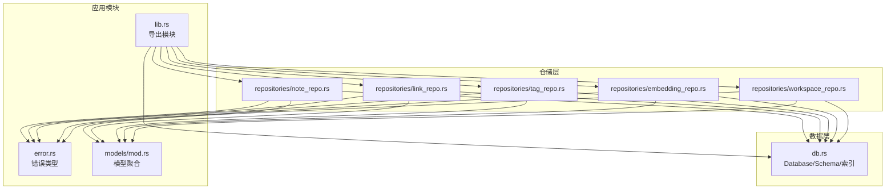
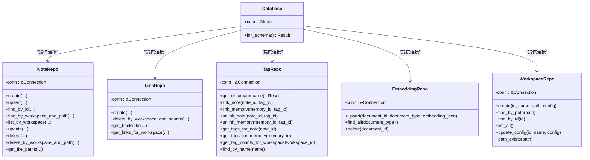
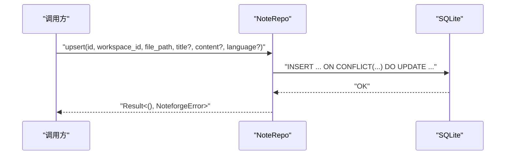
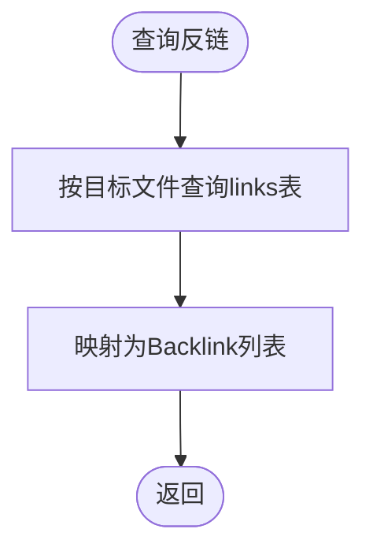
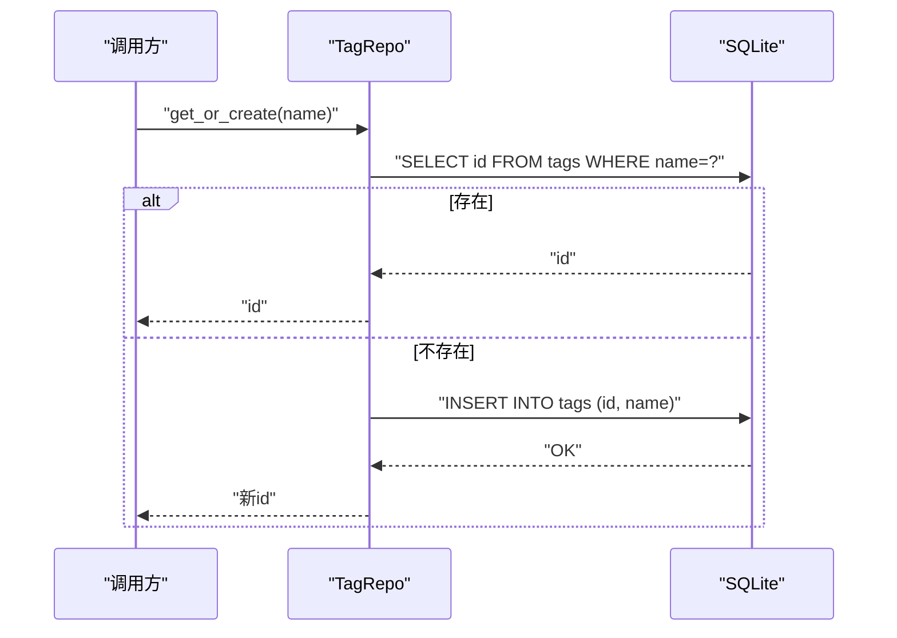
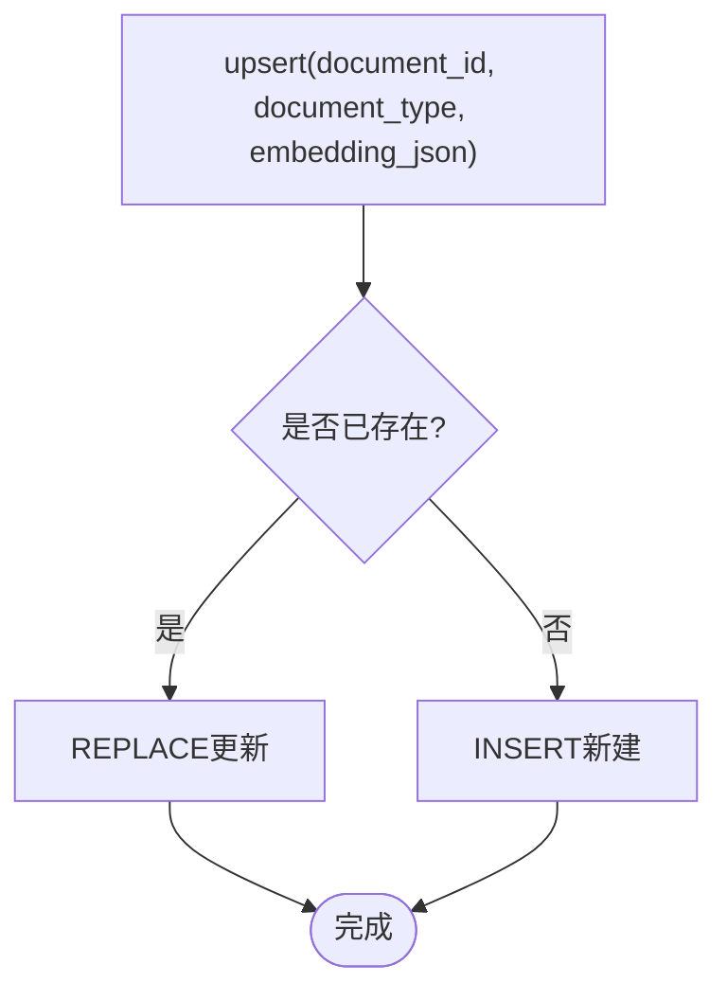
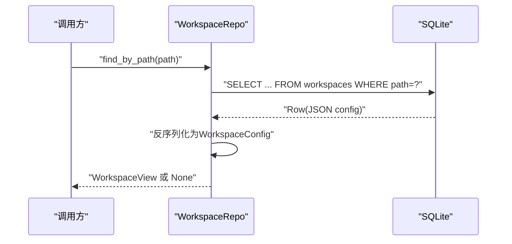
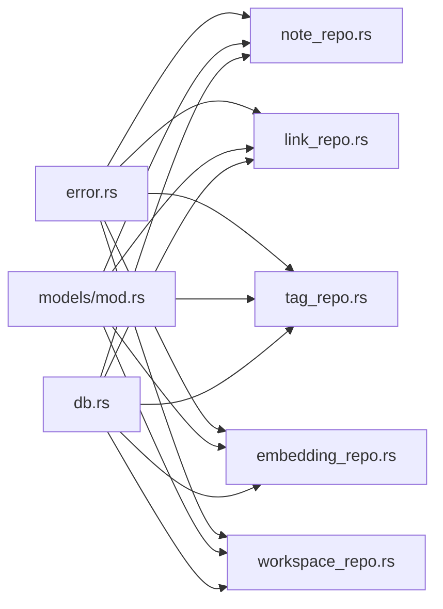

# 仓储层

<cite>
**本文引用的文件**
- [note_repo.rs](file://src-tauri/src/repositories/note_repo.rs)
- [link_repo.rs](file://src-tauri/src/repositories/link_repo.rs)
- [tag_repo.rs](file://src-tauri/src/repositories/tag_repo.rs)
- [embedding_repo.rs](file://src-tauri/src/repositories/embedding_repo.rs)
- [workspace_repo.rs](file://src-tauri/src/repositories/workspace_repo.rs)
- [db.rs](file://src-tauri/src/db.rs)
- [lib.rs](file://src-tauri/src/lib.rs)
- [error.rs](file://src-tauri/src/error.rs)
- [note.rs](file://src-tauri/src/models/note.rs)
- [link.rs](file://src-tauri/src/models/link.rs)
- [tag.rs](file://src-tauri/src/models/tag.rs)
- [workspace.rs](file://src-tauri/src/models/workspace.rs)
- [mod.rs](file://src-tauri/src/models/mod.rs)
- [dataflow_tests.rs](file://src-tauri/tests/dataflow_tests.rs)
- [integration_test.rs](file://src-tauri/tests/integration_test.rs)
- [ipc_contract_tests.rs](file://src-tauri/tests/ipc_contract_tests.rs)
</cite>

## 目录
1. [简介](#简介)
2. [项目结构](#项目结构)
3. [核心组件](#核心组件)
4. [架构总览](#架构总览)
5. [详细组件分析](#详细组件分析)
6. [依赖关系分析](#依赖关系分析)
7. [性能考量](#性能考量)
8. [故障排查指南](#故障排查指南)
9. [结论](#结论)
10. [附录](#附录)

## 简介
本文件系统性梳理NoteForge后端的仓储层（Repository Layer）实现，覆盖以下核心仓储类：笔记仓储（note_repo）、链接仓储（link_repo）、标签仓储（tag_repo）、嵌入仓储（embedding_repo）、工作区仓储（workspace_repo）。文档从设计原则、SQL查询构建、参数绑定与结果映射、事务与连接管理、查询优化与索引、批量操作、单元与集成测试策略、以及数据一致性与并发控制等方面进行深入解析，并提供可操作的优化建议与排障指引。

## 项目结构
仓储层位于Tauri后端模块中，采用按实体分层的组织方式：
- 仓储类集中于 src-tauri/src/repositories 下，每个实体一个文件
- 数据库初始化与Schema在 src-tauri/src/db.rs 中完成
- 模型定义位于 src-tauri/src/models 下，与仓储返回类型一一对应
- 错误类型统一在 src-tauri/src/error.rs 定义
- 应用入口模块导出仓储与数据库能力

图表来源
- [lib.rs:1-16](file://src-tauri/src/lib.rs#L1-L16)
- [db.rs:1-184](file://src-tauri/src/db.rs#L1-L184)
- [note_repo.rs:1-170](file://src-tauri/src/repositories/note_repo.rs#L1-L170)
- [link_repo.rs:1-86](file://src-tauri/src/repositories/link_repo.rs#L1-L86)
- [tag_repo.rs:1-121](file://src-tauri/src/repositories/tag_repo.rs#L1-L121)
- [embedding_repo.rs:1-72](file://src-tauri/src/repositories/embedding_repo.rs#L1-L72)
- [workspace_repo.rs:1-122](file://src-tauri/src/repositories/workspace_repo.rs#L1-L122)
- [mod.rs:1-28](file://src-tauri/src/models/mod.rs#L1-L28)

章节来源
- [lib.rs:1-16](file://src-tauri/src/lib.rs#L1-L16)
- [db.rs:171-184](file://src-tauri/src/db.rs#L171-L184)

## 核心组件
- 笔记仓储（NoteRepo）
  - 职责：创建、去重插入（upsert）、按主键/路径查询、按工作区列表、更新标题/内容、删除、按工作区+路径删除、获取文件路径集合
  - 关键点：支持按工作区+文件路径唯一约束的冲突更新；按更新时间倒序列出；条件性字段更新（仅当提供值时才执行对应UPDATE）
- 链接仓储（LinkRepo）
  - 职责：创建链接、按工作区+源文件删除、查询反链（backlinks）、查询工作区全部链接
  - 关键点：反链查询仅返回源文件与上下文；支持按工作区过滤
- 标签仓储（TagRepo）
  - 职责：获取或创建标签、为笔记/记忆体建立/解除标签关联、查询笔记/记忆体的标签名列表、统计工作区内标签计数
  - 关键点：标签名唯一；多对多关联表使用复合主键；LEFT JOIN统计避免遗漏无标签项
- 嵌入仓储（EmbeddingRepo）
  - 职责：插入或替换文档向量、按类型筛选查询、按文档ID删除
  - 关键点：INSERT OR REPLACE替代UPSERT语义；支持按类型过滤或全量扫描
- 工作区仓储（WorkspaceRepo）
  - 职责：创建工作区、按路径/ID查询、列出全部、更新配置、检测路径是否存在
  - 关键点：配置序列化为JSON存储；查询时反序列化为WorkspaceConfig对象；存在性检查使用exists

章节来源
- [note_repo.rs:9-170](file://src-tauri/src/repositories/note_repo.rs#L9-L170)
- [link_repo.rs:9-86](file://src-tauri/src/repositories/link_repo.rs#L9-L86)
- [tag_repo.rs:9-121](file://src-tauri/src/repositories/tag_repo.rs#L9-L121)
- [embedding_repo.rs:8-72](file://src-tauri/src/repositories/embedding_repo.rs#L8-L72)
- [workspace_repo.rs:9-122](file://src-tauri/src/repositories/workspace_repo.rs#L9-L122)

## 架构总览
仓储层围绕rusqlite连接与事务展开，通过单例数据库句柄提供线程安全的访问。Schema在应用启动时初始化，包含工作区、笔记、记忆体、标签、链接、图节点/边、文件监听器、搜索历史、AI日志、应用配置等表，并建立必要的索引以支撑高频查询。

图表来源
- [db.rs:7-168](file://src-tauri/src/db.rs#L7-L168)
- [note_repo.rs:5-170](file://src-tauri/src/repositories/note_repo.rs#L5-L170)
- [link_repo.rs:5-86](file://src-tauri/src/repositories/link_repo.rs#L5-L86)
- [tag_repo.rs:5-121](file://src-tauri/src/repositories/tag_repo.rs#L5-L121)
- [embedding_repo.rs:4-72](file://src-tauri/src/repositories/embedding_repo.rs#L4-L72)
- [workspace_repo.rs:5-122](file://src-tauri/src/repositories/workspace_repo.rs#L5-L122)

## 详细组件分析

### 笔记仓储（NoteRepo）
- 设计要点
  - 使用按工作区+文件路径的唯一约束，upsert通过ON CONFLICT实现“存在则更新”的幂等写入
  - 列表查询按updated_at降序，便于前端展示最新修改
  - 条件更新：仅当传入title/content非空时才执行对应UPDATE，避免不必要的写放大
- SQL与参数
  - 创建/去重插入：参数绑定为(id, workspace_id, file_path, title?, content?, language?)
  - 查询：按id、(workspace_id, file_path)、workspace_id
  - 更新：分别对title/content执行UPDATE，均设置updated_at=CURRENT_TIMESTAMP
  - 删除：按id或按(工作区+路径)二选一
- 结果映射
  - 返回NoteView结构，包含基础元信息与时间戳
- 并发与事务
  - 仓储方法直接在当前连接上执行，未显式开启事务；若需要跨多个写操作的原子性，应在调用方封装事务

图表来源
- [note_repo.rs:30-50](file://src-tauri/src/repositories/note_repo.rs#L30-L50)

章节来源
- [note_repo.rs:14-170](file://src-tauri/src/repositories/note_repo.rs#L14-L170)
- [note.rs:3-32](file://src-tauri/src/models/note.rs#L3-L32)

### 链接仓储（LinkRepo）
- 设计要点
  - 支持按源文件删除该源文件产生的全部链接，便于文件重命名/移动后的清理
  - 反链查询仅返回源文件与上下文，避免冗余字段传输
- SQL与参数
  - 创建：参数绑定(id, workspace_id, source_file, target_file, link_type, context?)
  - 删除：按(工作区, 源文件)
  - 查询反链：按(工作区, 目标文件)
  - 查询工作区全部链接：按工作区过滤
- 结果映射
  - Link与Backlink结构，Backlink仅含必要字段

图表来源
- [link_repo.rs:42-60](file://src-tauri/src/repositories/link_repo.rs#L42-L60)

章节来源
- [link_repo.rs:14-86](file://src-tauri/src/repositories/link_repo.rs#L14-L86)
- [link.rs:3-34](file://src-tauri/src/models/link.rs#L3-L34)

### 标签仓储（TagRepo）
- 设计要点
  - 标签名唯一，先查后插，避免重复
  - 多对多关联表note_tags/memoery_tags使用复合主键，确保同一记录不重复
  - 统计使用LEFT JOIN，保证无标签项也被计入（count=0）
- SQL与参数
  - 获取或创建：按name查询，不存在则生成UUID并插入
  - 关联/解关联：INSERT OR IGNORE与DELETE
  - 查询标签名：INNER JOIN关联表
  - 统计：LEFT JOIN并GROUP BY，ORDER BY count DESC
- 结果映射
  - TagCount结构，包含标签名与计数

图表来源
- [tag_repo.rs:14-32](file://src-tauri/src/repositories/tag_repo.rs#L14-L32)

章节来源
- [tag_repo.rs:14-121](file://src-tauri/src/repositories/tag_repo.rs#L14-L121)
- [tag.rs:3-17](file://src-tauri/src/models/tag.rs#L3-L17)

### 嵌入仓储（EmbeddingRepo）
- 设计要点
  - INSERT OR REPLACE用于文档向量的幂等写入
  - 支持按文档类型筛选，便于按任务域隔离检索
- SQL与参数
  - upsert：(document_id, document_type, embedding_json)
  - find_all：可选document_type过滤
  - delete：按document_id删除

图表来源
- [embedding_repo.rs:13-24](file://src-tauri/src/repositories/embedding_repo.rs#L13-L24)

章节来源
- [embedding_repo.rs:13-72](file://src-tauri/src/repositories/embedding_repo.rs#L13-L72)

### 工作区仓储（WorkspaceRepo）
- 设计要点
  - 配置以JSON形式持久化，读取时反序列化为WorkspaceConfig
  - 提供按路径/ID查询、列表、更新配置、路径存在性检查
- SQL与参数
  - 创建：(id, name, path, config_json)
  - 查询：按path/id
  - 列表：ORDER BY updated_at DESC
  - 更新：更新name、config_json与updated_at=CURRENT_TIMESTAMP
  - 存在性：SELECT id WHERE path=?

图表来源
- [workspace_repo.rs:29-51](file://src-tauri/src/repositories/workspace_repo.rs#L29-L51)

章节来源
- [workspace_repo.rs:14-122](file://src-tauri/src/repositories/workspace_repo.rs#L14-L122)
- [workspace.rs:3-42](file://src-tauri/src/models/workspace.rs#L3-L42)

## 依赖关系分析
- 仓储类均持有rusqlite::Connection的借用，通过Database单例提供的连接访问数据库
- 所有仓储方法返回统一的NoteforgeError，便于上层统一处理
- 模型定义位于models子模块，仓储返回类型与模型一一对应
- Schema在应用启动时初始化，包含各表的主键、外键、唯一约束与索引

图表来源
- [error.rs:4-41](file://src-tauri/src/error.rs#L4-L41)
- [mod.rs:1-28](file://src-tauri/src/models/mod.rs#L1-L28)
- [db.rs:18-168](file://src-tauri/src/db.rs#L18-L168)
- [note_repo.rs:1-7](file://src-tauri/src/repositories/note_repo.rs#L1-L7)
- [link_repo.rs:1-7](file://src-tauri/src/repositories/link_repo.rs#L1-L7)
- [tag_repo.rs:1-7](file://src-tauri/src/repositories/tag_repo.rs#L1-L7)
- [embedding_repo.rs:1-7](file://src-tauri/src/repositories/embedding_repo.rs#L1-L7)
- [workspace_repo.rs:1-7](file://src-tauri/src/repositories/workspace_repo.rs#L1-L7)

章节来源
- [error.rs:4-41](file://src-tauri/src/error.rs#L4-L41)
- [mod.rs:1-28](file://src-tauri/src/models/mod.rs#L1-L28)
- [db.rs:18-168](file://src-tauri/src/db.rs#L18-L168)

## 性能考量
- 索引与查询优化
  - 笔记表：idx_notes_workspace、idx_notes_file_path，支持按工作区查询与按(工作区, 文件路径)唯一约束
  - 记忆体表：idx_memories_workspace、idx_memories_agent、idx_memories_type、idx_memories_importance，支持多维过滤与重要度排序
  - 链接表：idx_links_source、idx_links_target，支持源/目标文件快速定位
  - 图边表：idx_graph_edges_source、idx_graph_edges_target，支撑图遍历
- 批量操作
  - 当前仓储未提供原生批量插入/更新接口；可通过调用方在事务内循环执行，或在后续扩展中引入批处理语句
- 连接与事务
  - 数据库以Mutex包裹Connection，适合单线程串行访问；若需并发写入，建议在调用方引入事务块或考虑连接池方案
- 参数绑定与结果映射
  - 统一使用rusqlite::params!进行参数绑定，减少SQL注入风险
  - query_row/query_map配合闭包映射，避免重复样板代码

[本节为通用性能指导，不直接分析具体文件]

## 故障排查指南
- 错误类型
  - 数据库错误、IO错误、JSON序列化/反序列化错误、通知与网络错误、加密/AI/向量搜索错误等均有明确枚举
  - 错误序列化为包含code与message的对象，便于IPC传递与前端展示
- 常见问题定位
  - 笔记upsert失败：检查工作区+文件路径唯一约束是否冲突
  - 标签创建重复：确认标签名唯一约束是否被违反
  - 反链为空：确认链接表中是否存在匹配的目标文件
  - 工作区配置异常：检查JSON序列化/反序列化逻辑与默认回退
- 排障步骤
  - 在调用方捕获NoteforgeError并打印错误码与消息
  - 对关键SQL执行EXPLAIN QUERY PLAN验证索引使用情况
  - 对批量写入场景，确认是否在事务中执行以提升稳定性

章节来源
- [error.rs:4-80](file://src-tauri/src/error.rs#L4-L80)
- [note_repo.rs:30-50](file://src-tauri/src/repositories/note_repo.rs#L30-L50)
- [tag_repo.rs:14-32](file://src-tauri/src/repositories/tag_repo.rs#L14-L32)
- [link_repo.rs:42-60](file://src-tauri/src/repositories/link_repo.rs#L42-L60)
- [workspace_repo.rs:29-51](file://src-tauri/src/repositories/workspace_repo.rs#L29-L51)

## 结论
NoteForge的仓储层以简洁清晰的CRUD接口为核心，结合rusqlite与SQLite的轻量特性，实现了对工作区、笔记、链接、标签、嵌入等领域的高效数据访问。通过合理的Schema设计与索引策略，满足了常见查询场景的性能需求。未来可在事务封装、批量操作、连接池与并发控制方面进一步增强，以支撑更高负载与更复杂的业务流程。

[本节为总结性内容，不直接分析具体文件]

## 附录

### 测试策略概览
- 单元测试
  - 建议针对每个仓储方法编写独立测试，覆盖正常路径、边界条件与错误分支
  - 使用内存数据库或临时文件数据库隔离测试环境
- 集成测试
  - 覆盖仓储与数据库初始化、Schema迁移、事务一致性与并发场景
- IPC契约测试
  - 验证命令层与前端交互的数据结构与错误码一致性

章节来源
- [dataflow_tests.rs](file://src-tauri/tests/dataflow_tests.rs)
- [integration_test.rs](file://src-tauri/tests/integration_test.rs)
- [ipc_contract_tests.rs](file://src-tauri/tests/ipc_contract_tests.rs)