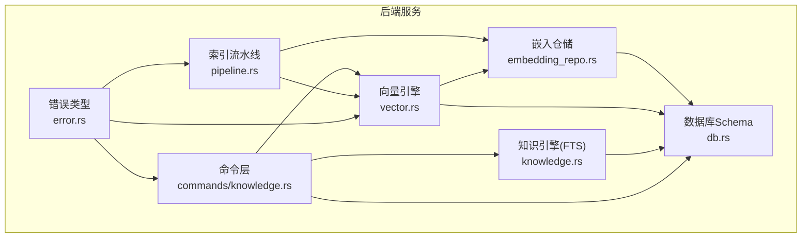
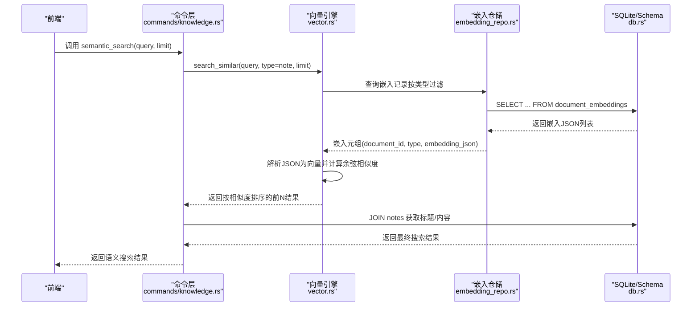
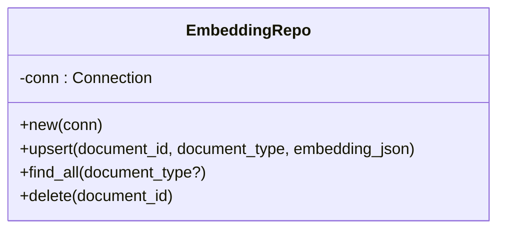
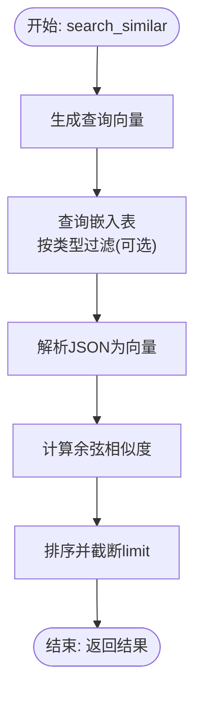
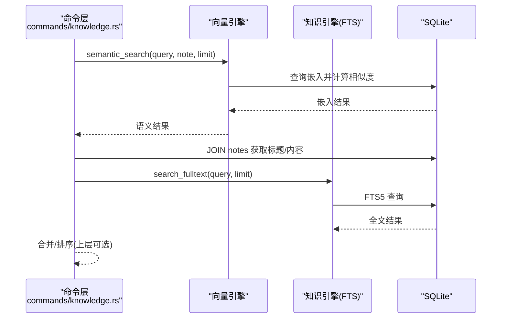
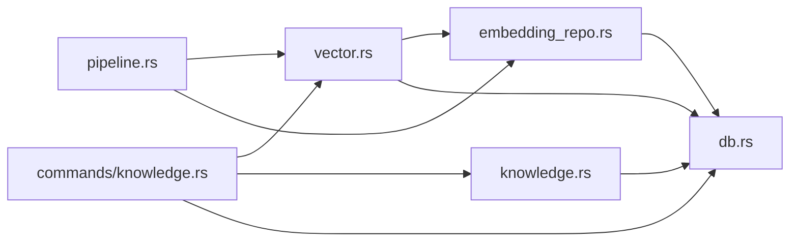

# 嵌入仓储

<cite>
**本文引用的文件**
- [embedding_repo.rs](file://src-tauri/src/repositories/embedding_repo.rs)
- [vector.rs](file://src-tauri/src/vector.rs)
- [db.rs](file://src-tauri/src/db.rs)
- [knowledge.rs](file://src-tauri/src/knowledge.rs)
- [commands/knowledge.rs](file://src-tauri/src/commands/knowledge.rs)
- [pipeline.rs](file://src-tauri/src/pipeline.rs)
- [error.rs](file://src-tauri/src/error.rs)
- [Cargo.toml](file://src-tauri/Cargo.toml)
- [TECHNICAL_VERIFICATION.md](file://TECHNICAL_VERIFICATION.md)
</cite>

## 目录
1. [简介](#简介)
2. [项目结构](#项目结构)
3. [核心组件](#核心组件)
4. [架构总览](#架构总览)
5. [组件详解](#组件详解)
6. [依赖关系分析](#依赖关系分析)
7. [性能考量](#性能考量)
8. [故障排查指南](#故障排查指南)
9. [结论](#结论)
10. [附录](#附录)

## 简介
本文件聚焦“嵌入仓储”在后端中的实现与使用，围绕向量嵌入数据的创建、更新、查询与删除，以及相似度计算、索引与近似最近邻搜索的实现原理展开。同时覆盖嵌入数据的压缩存储（JSON）、内存管理、批量处理优化策略，并解释语义搜索、多维向量查询与混合搜索（全文+语义）的集成方式。最后提供实际操作示例与备份恢复、性能监控、容量规划建议。

## 项目结构
与嵌入仓储相关的核心文件分布如下：
- 向量引擎与相似度计算：vector.rs
- 嵌入表结构与 CRUD：embedding_repo.rs、db.rs
- 知识引擎（全文搜索）：knowledge.rs
- 命令层（对外 API）：commands/knowledge.rs
- 文档索引流水线（批量处理）：pipeline.rs
- 错误类型与序列化：error.rs
- 依赖与版本：Cargo.toml
- 技术验证与降级方案：TECHNICAL_VERIFICATION.md



图表来源
- [commands/knowledge.rs:232-269](file://src-tauri/src/commands/knowledge.rs#L232-L269)
- [pipeline.rs:18-90](file://src-tauri/src/pipeline.rs#L18-L90)
- [vector.rs:7-128](file://src-tauri/src/vector.rs#L7-L128)
- [embedding_repo.rs:4-71](file://src-tauri/src/repositories/embedding_repo.rs#L4-L71)
- [knowledge.rs:5-23](file://src-tauri/src/knowledge.rs#L5-L23)
- [db.rs:18-168](file://src-tauri/src/db.rs#L18-L168)
- [error.rs:4-41](file://src-tauri/src/error.rs#L4-L41)

章节来源
- [embedding_repo.rs:1-72](file://src-tauri/src/repositories/embedding_repo.rs#L1-L72)
- [vector.rs:1-151](file://src-tauri/src/vector.rs#L1-L151)
- [db.rs:1-184](file://src-tauri/src/db.rs#L1-L184)
- [knowledge.rs:1-75](file://src-tauri/src/knowledge.rs#L1-L75)
- [commands/knowledge.rs:1-305](file://src-tauri/src/commands/knowledge.rs#L1-L305)
- [pipeline.rs:1-290](file://src-tauri/src/pipeline.rs#L1-L290)
- [error.rs:1-80](file://src-tauri/src/error.rs#L1-L80)
- [Cargo.toml:1-40](file://src-tauri/Cargo.toml#L1-L40)
- [TECHNICAL_VERIFICATION.md:65-141](file://TECHNICAL_VERIFICATION.md#L65-L141)

## 核心组件
- 嵌入仓储 EmbeddingRepo：提供 upsert、find_all、delete 三类基础操作，直接映射到 document_embeddings 表。
- 向量引擎 VectorEngine：负责创建/删除嵌入、执行语义搜索、计算余弦相似度；嵌入以 JSON 形式存储。
- 索引流水线 IndexPipeline：原子化地完成笔记入库、FTS 索引、向量嵌入、标签链接、图节点/边维护。
- 知识引擎 KnowledgeEngine：基于 SQLite FTS5 的全文搜索。
- 命令层：对外暴露 semantic_search 等命令，串联向量引擎与知识引擎，实现混合搜索。
- 数据库 Schema：统一初始化各表（含 document_embeddings），并提供索引与约束。

章节来源
- [embedding_repo.rs:8-71](file://src-tauri/src/repositories/embedding_repo.rs#L8-L71)
- [vector.rs:12-128](file://src-tauri/src/vector.rs#L12-L128)
- [pipeline.rs:12-90](file://src-tauri/src/pipeline.rs#L12-L90)
- [knowledge.rs:9-23](file://src-tauri/src/knowledge.rs#L9-L23)
- [commands/knowledge.rs:232-269](file://src-tauri/src/commands/knowledge.rs#L232-L269)
- [db.rs:18-168](file://src-tauri/src/db.rs#L18-L168)

## 架构总览
下图展示从命令层到向量引擎、嵌入仓储与数据库的整体交互流程，以及与知识引擎的混合搜索路径。



图表来源
- [commands/knowledge.rs:232-269](file://src-tauri/src/commands/knowledge.rs#L232-L269)
- [vector.rs:57-128](file://src-tauri/src/vector.rs#L57-L128)
- [embedding_repo.rs:26-62](file://src-tauri/src/repositories/embedding_repo.rs#L26-L62)
- [db.rs:18-168](file://src-tauri/src/db.rs#L18-L168)

## 组件详解

### 嵌入仓储（EmbeddingRepo）
- 职责
  - upsert：插入或替换某文档的嵌入记录（document_id 主键）。
  - find_all：按可选的文档类型筛选，返回所有嵌入记录。
  - delete：按文档 ID 删除嵌入记录。
- 存储结构
  - 表名：document_embeddings
  - 字段：document_id（主键）、document_type、embedding（JSON）、created_at
- 事务与一致性
  - 该仓储本身不显式开启事务，但可在上层（如索引流水线）通过 BEGIN/COMMIT/ROLLBACK 控制原子性。



图表来源
- [embedding_repo.rs:4-71](file://src-tauri/src/repositories/embedding_repo.rs#L4-L71)

章节来源
- [embedding_repo.rs:8-71](file://src-tauri/src/repositories/embedding_repo.rs#L8-L71)
- [db.rs:18-22](file://src-tauri/src/db.rs#L18-L22)

### 向量引擎（VectorEngine）
- 职责
  - 初始化表结构（首次使用时自动创建）。
  - store_embedding：生成向量并以 JSON 存储到嵌入表。
  - search_similar：对查询词生成向量，遍历嵌入表计算余弦相似度并排序取前 N。
  - delete_embedding：删除指定文档的嵌入。
- 相似度计算
  - 余弦相似度：点积 / (||a|| * ||b||)，归一化后范围 [-1, 1]，此处返回 f64。
- 索引与近似最近邻
  - 当前实现为“全表扫描 + 内存计算”，非专用向量索引（sqlite-vec 在技术验证中列为降级方案）。
- 数据压缩与存储
  - 向量以 JSON 数组形式存储，便于跨平台持久化与迁移。
- 错误处理
  - 统一包装为 VectorSearch 类型的错误。



图表来源
- [vector.rs:57-128](file://src-tauri/src/vector.rs#L57-L128)
- [vector.rs:130-144](file://src-tauri/src/vector.rs#L130-L144)

章节来源
- [vector.rs:12-128](file://src-tauri/src/vector.rs#L12-L128)
- [vector.rs:130-144](file://src-tauri/src/vector.rs#L130-L144)
- [TECHNICAL_VERIFICATION.md:65-141](file://TECHNICAL_VERIFICATION.md#L65-L141)

### 索引流水线（IndexPipeline）
- 职责
  - 单文档原子化索引：写入笔记、更新 FTS、存储嵌入、提取并关联标签、建立链接、更新图节点/边。
  - 单文档原子化移除：删除笔记、FTS、嵌入、链接与图节点。
- 批量处理优化
  - 使用事务包裹，保证多步操作的 ACID。
  - 并行化程度取决于外部调用（例如批量扫描目录后逐个调用 index_document）。
- 与向量引擎协作
  - 在索引步骤中调用 store_embedding，确保嵌入与文档同步。

```mermaid
sequenceDiagram
participant FS as "文件系统"
participant PIPE as "索引流水线<br/>pipeline.rs"
participant NOTE as "笔记仓储"
participant FTS as "知识引擎(FTS)"
participant VE as "向量引擎"
participant TAG as "标签仓储"
participant LINK as "链接仓储"
participant GRAPH as "图节点/边"
FS->>PIPE : 提交单文档(路径, 标题, 内容)
PIPE->>NOTE : upsert 笔记
PIPE->>FTS : index_document
PIPE->>VE : store_embedding
PIPE->>TAG : 提取并关联标签
PIPE->>LINK : 提取并创建链接
PIPE->>GRAPH : 更新节点/边
PIPE-->>FS : 成功(commit)/失败(rollback)
```

图表来源
- [pipeline.rs:18-90](file://src-tauri/src/pipeline.rs#L18-L90)
- [pipeline.rs:92-134](file://src-tauri/src/pipeline.rs#L92-L134)

章节来源
- [pipeline.rs:12-90](file://src-tauri/src/pipeline.rs#L12-L90)
- [pipeline.rs:92-134](file://src-tauri/src/pipeline.rs#L92-L134)

### 混合搜索（语义 + 全文）
- 语义搜索
  - 命令层调用 VectorEngine.search_similar，按 note 类型过滤，再 JOIN notes 获取标题/内容。
- 全文搜索
  - 命令层调用 KnowledgeEngine.search，基于 FTS5 匹配。
- 集成策略
  - 可在上层将两类结果按权重融合排序（当前命令层以语义为主）。



图表来源
- [commands/knowledge.rs:232-269](file://src-tauri/src/commands/knowledge.rs#L232-L269)
- [knowledge.rs:25-46](file://src-tauri/src/knowledge.rs#L25-L46)

章节来源
- [commands/knowledge.rs:70-92](file://src-tauri/src/commands/knowledge.rs#L70-L92)
- [commands/knowledge.rs:232-269](file://src-tauri/src/commands/knowledge.rs#L232-L269)
- [knowledge.rs:9-23](file://src-tauri/src/knowledge.rs#L9-L23)

## 依赖关系分析
- 外部依赖
  - fastembed：本地生成向量嵌入。
  - rusqlite：SQLite 访问与事务控制。
  - serde_json：向量数组的 JSON 序列化/反序列化。
- 内部依赖
  - 命令层依赖向量引擎与知识引擎。
  - 索引流水线依赖嵌入仓储、知识引擎、标签/链接仓储。
  - 向量引擎依赖嵌入仓储与数据库连接。



图表来源
- [commands/knowledge.rs:1-12](file://src-tauri/src/commands/knowledge.rs#L1-L12)
- [pipeline.rs:1-6](file://src-tauri/src/pipeline.rs#L1-L6)
- [vector.rs:1-10](file://src-tauri/src/vector.rs#L1-L10)
- [embedding_repo.rs:1-6](file://src-tauri/src/repositories/embedding_repo.rs#L1-L6)
- [db.rs:1-9](file://src-tauri/src/db.rs#L1-L9)

章节来源
- [Cargo.toml:7-32](file://src-tauri/Cargo.toml#L7-L32)
- [vector.rs:4-5](file://src-tauri/src/vector.rs#L4-L5)
- [embedding_repo.rs:1-2](file://src-tauri/src/repositories/embedding_repo.rs#L1-L2)
- [db.rs:1-9](file://src-tauri/src/db.rs#L1-L9)

## 性能考量
- 当前实现特征
  - 向量存储：JSON；查询：全表扫描 + 内存计算余弦相似度。
  - 技术验证表明：小规模（<1万条）内存计算延迟可接受；大规模建议后续集成 sqlite-vec 或专用向量数据库。
- 内存与 I/O
  - JSON 序列化/反序列化成本低，但会占用内存；向量维度越高，单条记录越大。
- 批量处理
  - 索引流水线使用事务，减少多次提交开销；批量导入时建议分批处理并复用连接。
- 索引与过滤
  - 嵌入表未设置额外索引；若按 document_type 高频过滤，可考虑增加索引以加速子集查询。
- 优化建议
  - 采样/分页：对大规模数据采用分页加载嵌入，避免一次性解析全部 JSON。
  - 向量压缩：在 fastembed 输出层面评估是否可降低维度（需权衡精度）。
  - 异步/并发：在上层批量导入时并发调用 store_embedding，注意 SQLite 的并发写入限制。

章节来源
- [TECHNICAL_VERIFICATION.md:65-141](file://TECHNICAL_VERIFICATION.md#L65-L141)
- [vector.rs:130-144](file://src-tauri/src/vector.rs#L130-L144)
- [pipeline.rs:18-90](file://src-tauri/src/pipeline.rs#L18-L90)

## 故障排查指南
- 常见错误类型
  - VectorSearch：向量生成/序列化/相似度计算异常。
  - Database/JSON/Reqwest：数据库访问、JSON 解析、网络请求错误。
- 排查步骤
  - 确认嵌入表存在且结构正确（document_embeddings）。
  - 检查嵌入 JSON 是否有效，向量维度是否匹配。
  - 核对查询词是否成功生成向量，维度一致。
  - 观察事务是否正常提交/回滚（索引流水线）。
- 错误序列化
  - 所有错误类型会被序列化为统一的错误响应对象，便于前端展示。

章节来源
- [error.rs:4-41](file://src-tauri/src/error.rs#L4-L41)
- [error.rs:43-74](file://src-tauri/src/error.rs#L43-L74)
- [vector.rs:35-55](file://src-tauri/src/vector.rs#L35-L55)
- [embedding_repo.rs:18-24](file://src-tauri/src/repositories/embedding_repo.rs#L18-L24)

## 结论
嵌入仓储通过 JSON 存储与内存相似度计算实现了简洁高效的语义搜索能力，适合中小规模场景。索引流水线确保了嵌入与全文索引、标签、链接、图结构的一致性。对于更大规模与更高性能需求，建议在保持接口不变的前提下，平滑引入专用向量索引与异步批量处理策略。

## 附录

### 实际操作示例（步骤说明）
- 文本嵌入生成
  - 在索引流水线中调用 store_embedding，传入文档路径、类型与内容，自动完成向量化与存储。
- 向量相似度比较
  - 调用 search_similar，传入查询词、可选类型与限制数，得到按相似度排序的结果列表。
- 搜索结果排序
  - 语义搜索结果已按相似度排序；如需与全文结果合并，可在上层按权重融合后再排序。
- 删除嵌入
  - 使用 delete_embedding 或 delete 方法，按文档 ID 清理嵌入与相关索引。

章节来源
- [pipeline.rs:30-70](file://src-tauri/src/pipeline.rs#L30-L70)
- [vector.rs:30-55](file://src-tauri/src/vector.rs#L30-L55)
- [vector.rs:57-128](file://src-tauri/src/vector.rs#L57-L128)
- [commands/knowledge.rs:232-269](file://src-tauri/src/commands/knowledge.rs#L232-L269)

### 备份与恢复
- 备份
  - 直接备份 SQLite 数据库文件（包含 document_embeddings 表）。
- 恢复
  - 将备份文件替换到应用数据目录对应位置，重启应用后即可恢复嵌入与其它数据。
- 注意
  - 若迁移至不同架构或系统，建议先验证 SQLite 版本与 rusqlite 配置。

章节来源
- [db.rs:171-184](file://src-tauri/src/db.rs#L171-L184)

### 性能监控与容量规划
- 监控指标
  - 向量生成耗时、相似度计算耗时、数据库读写延迟、JSON 序列化/反序列化耗时。
- 容量规划
  - 估算每条记录的 JSON 字节大小（向量维度 × float32 字节数），结合预期文档总数预估磁盘与内存占用。
  - 小规模（<1万）可满足实时查询；大规模建议引入专用向量索引与分页/采样策略。

章节来源
- [TECHNICAL_VERIFICATION.md:65-141](file://TECHNICAL_VERIFICATION.md#L65-L141)