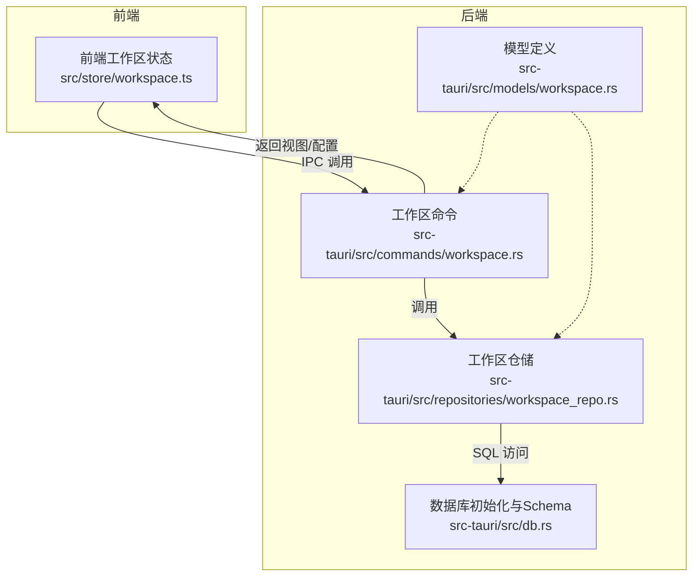
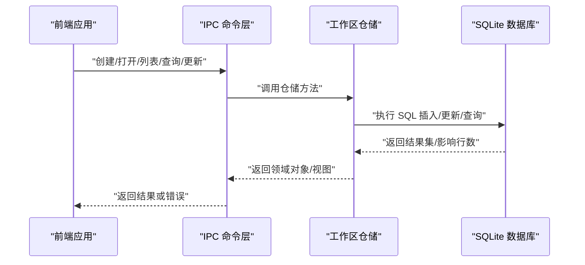
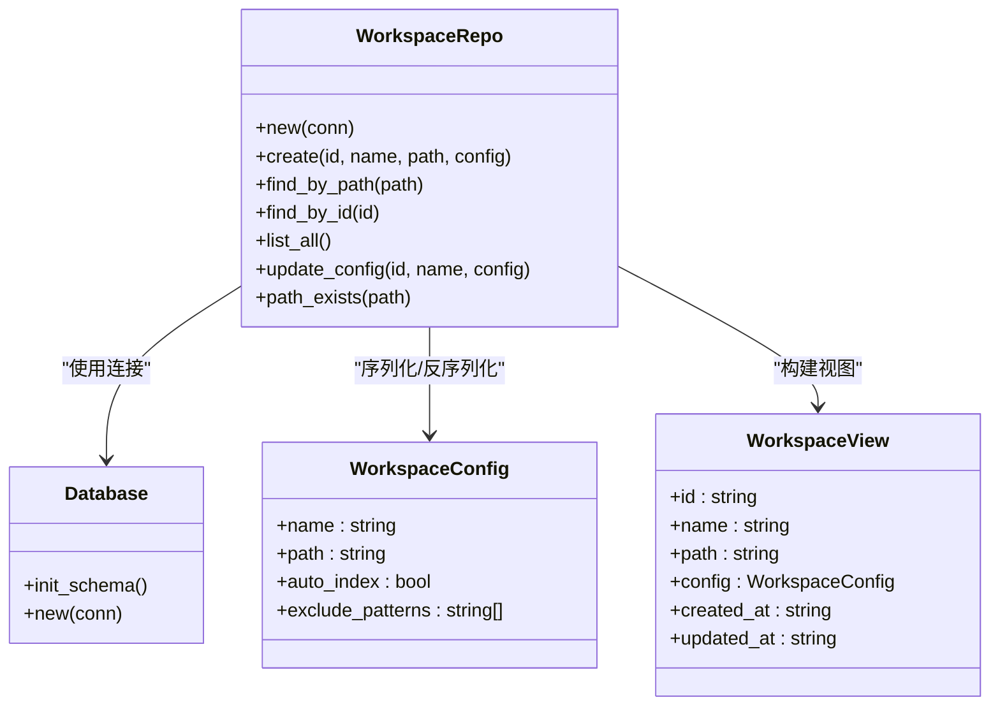
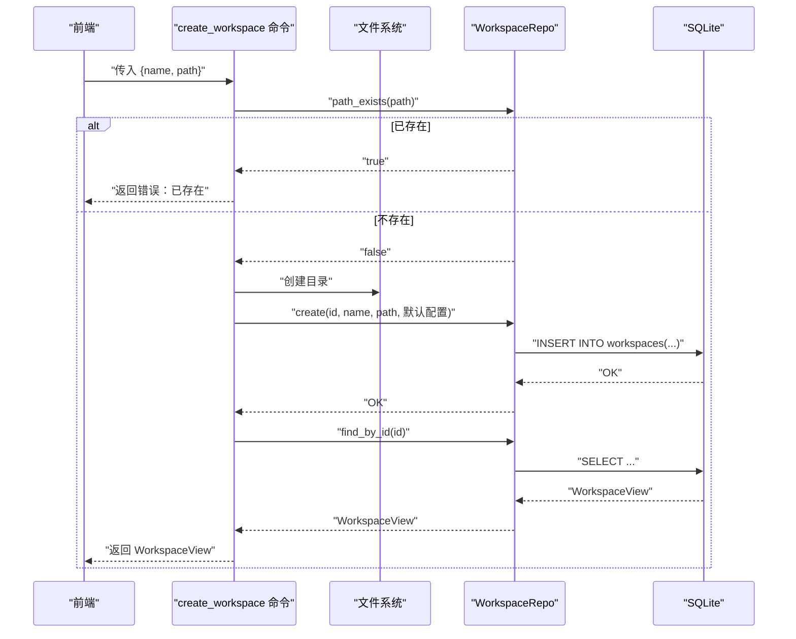
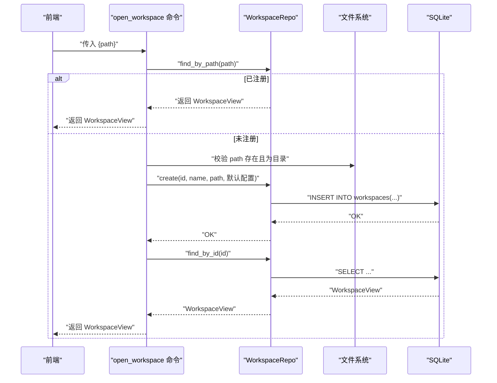
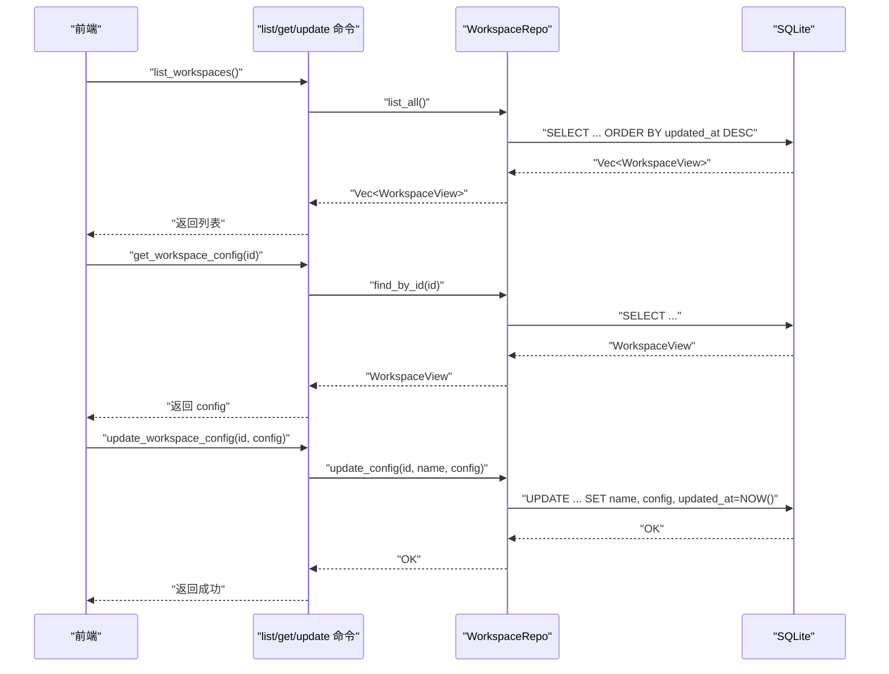
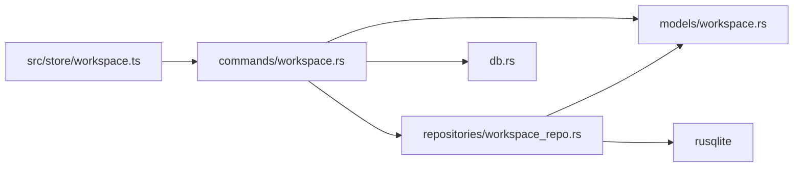

# 工作区仓储

<cite>
**本文引用的文件**
- [workspace_repo.rs](file://src-tauri/src/repositories/workspace_repo.rs)
- [workspace.rs（模型）](file://src-tauri/src/models/workspace.rs)
- [workspace.rs（命令）](file://src-tauri/src/commands/workspace.rs)
- [db.rs](file://src-tauri/src/db.rs)
- [lib.rs](file://src-tauri/src/lib.rs)
- [workspace.ts（前端状态）](file://src/store/workspace.ts)
- [ipc_contract_tests.rs](file://src-tauri/tests/ipc_contract_tests.rs)
- [default.json（能力配置）](file://src-tauri/capabilities/default.json)
</cite>

## 目录
1. [简介](#简介)
2. [项目结构](#项目结构)
3. [核心组件](#核心组件)
4. [架构总览](#架构总览)
5. [详细组件分析](#详细组件分析)
6. [依赖关系分析](#依赖关系分析)
7. [性能考量](#性能考量)
8. [故障排查指南](#故障排查指南)
9. [结论](#结论)
10. [附录：工作区管理完整示例](#附录工作区管理完整示例)

## 简介
本文件系统化梳理并深入解析工作区仓储在后端与前端的实现与协作方式，重点覆盖以下方面：
- 工作区配置与状态的数据管理：创建、打开、列表、配置更新、查询与存在性校验
- 元数据存储与配置参数管理：SQLite 表结构、JSON 字段序列化、时间戳维护
- 权限控制与安全边界：Tauri 能力配置与 IPC 命令边界
- 多工作区支持与隔离：以工作区 ID 为键的独立命名空间
- 数据同步与索引联动：自动索引开关与知识库索引触发
- 迁移、备份与恢复策略：基于 SQLite 的持久化与可移植性建议
- 健康检查、性能监控与故障诊断：日志与错误码体系

## 项目结构
工作区仓储位于 Tauri 后端模块树中，采用“命令层 → 仓储层 → 模型/数据库”的分层组织：
- 命令层：对外暴露 IPC 命令，负责输入校验、调用仓储与返回结果
- 仓储层：封装 SQL 访问，提供工作区 CRUD 与查询能力
- 模型层：定义 WorkspaceConfig、WorkspaceView 等数据结构
- 数据库层：初始化表结构与索引，提供连接管理
- 前端状态：Zustand Store 管理当前工作区、树形结构与索引触发

图表来源
- [workspace.ts（前端状态）:38-157](file://src/store/workspace.ts#L38-L157)
- [workspace.rs（命令）:1-113](file://src-tauri/src/commands/workspace.rs#L1-L113)
- [workspace_repo.rs:1-122](file://src-tauri/src/repositories/workspace_repo.rs#L1-L122)
- [db.rs:18-168](file://src-tauri/src/db.rs#L18-L168)

章节来源
- [workspace_repo.rs:1-122](file://src-tauri/src/repositories/workspace_repo.rs#L1-L122)
- [workspace.rs（命令）:1-113](file://src-tauri/src/commands/workspace.rs#L1-L113)
- [workspace.rs（模型）:1-42](file://src-tauri/src/models/workspace.rs#L1-L42)
- [db.rs:18-168](file://src-tauri/src/db.rs#L18-L168)
- [workspace.ts（前端状态）:38-157](file://src/store/workspace.ts#L38-L157)

## 核心组件
- 工作区仓储（WorkspaceRepo）
  - 提供创建、按路径/ID 查询、列出全部、更新配置、路径存在性检查等方法
  - 使用 JSON 字段存储配置，统一通过 serde_json 序列化/反序列化
- 工作区命令（workspace.rs）
  - 对外暴露 create_workspace、open_workspace、list_workspaces、get_workspace_config、update_workspace_config 等 IPC 命令
  - 在命令层进行输入校验与默认配置生成，并调用仓储完成持久化
- 模型（workspace.rs）
  - 定义 WorkspaceConfig、WorkspaceView、请求体等数据结构
- 数据库（db.rs）
  - 初始化 workspaces 表，含主键 id、名称、路径、JSON 配置、时间戳字段
  - 提供数据库连接管理与 Schema 初始化
- 前端状态（workspace.ts）
  - 维护当前工作区、树形结构、展开目录集合与最近工作区列表
  - 打开工作区时触发知识库索引（当 auto_index 为真）

章节来源
- [workspace_repo.rs:9-121](file://src-tauri/src/repositories/workspace_repo.rs#L9-L121)
- [workspace.rs（命令）:7-112](file://src-tauri/src/commands/workspace.rs#L7-L112)
- [workspace.rs（模型）:3-41](file://src-tauri/src/models/workspace.rs#L3-L41)
- [db.rs:18-168](file://src-tauri/src/db.rs#L18-L168)
- [workspace.ts（前端状态）:38-157](file://src/store/workspace.ts#L38-L157)

## 架构总览
工作区生命周期的关键交互如下：

图表来源
- [workspace.rs（命令）:8-112](file://src-tauri/src/commands/workspace.rs#L8-L112)
- [workspace_repo.rs:14-120](file://src-tauri/src/repositories/workspace_repo.rs#L14-L120)
- [db.rs:18-168](file://src-tauri/src/db.rs#L18-L168)

## 详细组件分析

### 工作区仓储类图

图表来源
- [workspace_repo.rs:5-121](file://src-tauri/src/repositories/workspace_repo.rs#L5-L121)
- [db.rs:7-16](file://src-tauri/src/db.rs#L7-L16)
- [workspace.rs（模型）:3-21](file://src-tauri/src/models/workspace.rs#L3-L21)

章节来源
- [workspace_repo.rs:9-121](file://src-tauri/src/repositories/workspace_repo.rs#L9-L121)
- [workspace.rs（模型）:3-21](file://src-tauri/src/models/workspace.rs#L3-L21)
- [db.rs:18-168](file://src-tauri/src/db.rs#L18-L168)

### 创建工作区流程（命令到仓储）

图表来源
- [workspace.rs（命令）:8-35](file://src-tauri/src/commands/workspace.rs#L8-L35)
- [workspace_repo.rs:14-27](file://src-tauri/src/repositories/workspace_repo.rs#L14-L27)

章节来源
- [workspace.rs（命令）:8-35](file://src-tauri/src/commands/workspace.rs#L8-L35)
- [workspace_repo.rs:14-27](file://src-tauri/src/repositories/workspace_repo.rs#L14-L27)

### 打开工作区流程（命令到仓储）

图表来源
- [workspace.rs（命令）:38-79](file://src-tauri/src/commands/workspace.rs#L38-L79)
- [workspace_repo.rs:29-75](file://src-tauri/src/repositories/workspace_repo.rs#L29-L75)

章节来源
- [workspace.rs（命令）:38-79](file://src-tauri/src/commands/workspace.rs#L38-L79)
- [workspace_repo.rs:29-75](file://src-tauri/src/repositories/workspace_repo.rs#L29-L75)

### 列表与配置查询/更新流程

图表来源
- [workspace.rs（命令）:82-112](file://src-tauri/src/commands/workspace.rs#L82-L112)
- [workspace_repo.rs:77-114](file://src-tauri/src/repositories/workspace_repo.rs#L77-L114)

章节来源
- [workspace.rs（命令）:82-112](file://src-tauri/src/commands/workspace.rs#L82-L112)
- [workspace_repo.rs:77-114](file://src-tauri/src/repositories/workspace_repo.rs#L77-L114)

### 工作区配置参数管理与默认值
- 默认配置项
  - auto_index：默认启用，用于触发知识库索引
  - exclude_patterns：默认包含版本控制与包管理目录
- 更新策略
  - 通过 update_workspace_config 将新配置整体写回 JSON 字段
  - 更新同时刷新 updated_at 时间戳
- 前端联动
  - 当 auto_index 为真时，打开工作区后触发知识库索引

章节来源
- [workspace.rs（命令）:24-29](file://src-tauri/src/commands/workspace.rs#L24-L29)
- [workspace.rs（命令）:68-73](file://src-tauri/src/commands/workspace.rs#L68-L73)
- [workspace.rs（命令）:104-112](file://src-tauri/src/commands/workspace.rs#L104-L112)
- [workspace.ts（前端状态）:78-80](file://src/store/workspace.ts#L78-L80)

### 权限控制机制
- Tauri 能力配置
  - 主窗口默认能力包含核心插件、路径访问、窗口操作与对话框等
  - 工作区相关操作需具备路径读写与文件系统访问权限
- 建议
  - 在开发阶段确保 capabilities/default.json 中包含必要的 path/dialog/shell 权限
  - 生产环境按最小权限原则裁剪能力集

章节来源
- [default.json（能力配置）:1-14](file://src-tauri/capabilities/default.json#L1-L14)

### 多工作区支持与隔离
- 隔离策略
  - 每个工作区以唯一 id 作为主键，配置与元数据独立存储
  - 查询接口按 id 或 path 精确匹配，避免跨工作区污染
- 前端状态
  - 使用 current 字段保存当前工作区视图，recent 保存最近工作区列表
  - 树形结构与展开状态与当前工作区绑定

章节来源
- [workspace_repo.rs:53-75](file://src-tauri/src/repositories/workspace_repo.rs#L53-L75)
- [workspace.ts（前端状态）:38-85](file://src/store/workspace.ts#L38-L85)

### 数据同步与索引联动
- 自动索引
  - 打开工作区时，若 auto_index 为真，则触发知识库索引
- 手动索引
  - 可通过命令层调用知识库服务进行重建或增量索引
- 注意
  - 索引过程可能受文件数量与大小影响，建议在后台异步执行

章节来源
- [workspace.ts（前端状态）:78-80](file://src/store/workspace.ts#L78-L80)

### 迁移、备份与恢复策略
- 迁移
  - 通过导出 SQLite 数据库文件实现工作区元数据迁移
  - 导入时需确保目标环境 Schema 一致（init_schema）
- 备份
  - 建议定期备份 noteforge.db（由 init_database 决定路径）
  - 可结合加密工具对备份文件进行保护
- 恢复
  - 停止应用后替换数据库文件，启动后自动加载
  - 如遇版本升级，先执行 Schema 升级脚本再恢复

章节来源
- [db.rs:171-184](file://src-tauri/src/db.rs#L171-L184)
- [db.rs:18-168](file://src-tauri/src/db.rs#L18-L168)

## 依赖关系分析
- 模块依赖
  - commands/workspace.rs 依赖 models 与 repositories
  - repositories/workspace_repo.rs 依赖 models 与 rusqlite
  - db.rs 提供数据库连接与 Schema 初始化
  - 前端 workspace.ts 依赖 IPC 接口与知识库索引服务
- 外部依赖
  - rusqlite：SQLite 访问
  - serde_json：配置 JSON 序列化
  - uuid：工作区 ID 生成
  - tauri：命令注解与状态注入

图表来源
- [workspace.rs（命令）:1-113](file://src-tauri/src/commands/workspace.rs#L1-L113)
- [workspace_repo.rs:1-122](file://src-tauri/src/repositories/workspace_repo.rs#L1-L122)
- [workspace.rs（模型）:1-42](file://src-tauri/src/models/workspace.rs#L1-L42)
- [db.rs:1-184](file://src-tauri/src/db.rs#L1-L184)
- [workspace.ts（前端状态）:1-158](file://src/store/workspace.ts#L1-L158)

章节来源
- [lib.rs:1-16](file://src-tauri/src/lib.rs#L1-L16)
- [workspace.rs（命令）:1-113](file://src-tauri/src/commands/workspace.rs#L1-L113)
- [workspace_repo.rs:1-122](file://src-tauri/src/repositories/workspace_repo.rs#L1-L122)
- [workspace.rs（模型）:1-42](file://src-tauri/src/models/workspace.rs#L1-L42)
- [db.rs:1-184](file://src-tauri/src/db.rs#L1-L184)
- [workspace.ts（前端状态）:1-158](file://src/store/workspace.ts#L1-L158)

## 性能考量
- 查询优化
  - list_all 按 updated_at 降序排序，适合“最近使用”展示
  - 建议在高频场景下缓存最近工作区列表
- 写入优化
  - update_config 同步更新 name、config 与 updated_at，减少多次往返
- I/O 优化
  - 打开工作区时优先从数据库命中，避免重复创建
  - auto_index 开关控制索引频率，避免频繁全量扫描
- 前端渲染
  - 树形结构按需懒加载子节点，减少初始渲染压力

## 故障排查指南
- 常见错误与定位
  - 工作区已存在：创建前调用 path_exists 校验
  - 路径无效/非目录：open_workspace 命令中进行存在性与类型校验
  - 未找到工作区：get_workspace_config/find_by_id 返回 None 时抛出 NotFound
  - IO 错误：创建目录失败或文件系统异常
- 建议排查步骤
  - 检查 capabilities 是否包含必要权限
  - 确认数据库 Schema 初始化是否成功
  - 查看前端错误提示与后端日志
  - 验证工作区路径可访问且无权限问题
- 单元测试参考
  - 合约测试覆盖 create/list/find_by_path 等关键路径

章节来源
- [workspace.rs（命令）:15-19](file://src-tauri/src/commands/workspace.rs#L15-L19)
- [workspace.rs（命令）:51-60](file://src-tauri/src/commands/workspace.rs#L51-L60)
- [workspace.rs（命令）:96-98](file://src-tauri/src/commands/workspace.rs#L96-L98)
- [ipc_contract_tests.rs:34-76](file://src-tauri/tests/ipc_contract_tests.rs#L34-L76)

## 结论
工作区仓储以清晰的分层设计实现了工作区的全生命周期管理：从创建、打开、列表、查询到配置更新，均通过仓储与命令层协同完成。SQLite 的 JSON 字段承载配置，配合时间戳与索引联动，满足多工作区隔离与高效检索的需求。建议在生产环境中完善权限配置、定期备份数据库，并根据业务规模优化索引策略与前端渲染。

## 附录：工作区管理完整示例
以下示例描述了典型的工作流，便于集成与二次开发：
- 初始化
  - 创建工作区：传入 name 与 path，仓储生成默认配置并写入数据库
  - 打开工作区：若路径未注册则自动生成工作区记录并返回视图
- 配置修改
  - 获取配置：通过 get_workspace_config 获取当前配置
  - 更新配置：通过 update_workspace_config 写回新配置并刷新时间戳
- 状态查询
  - 列出最近工作区：通过 list_workspaces 获取按更新时间排序的列表
- 前端联动
  - 打开工作区后，若 auto_index 为真则触发知识库索引

章节来源
- [workspace.rs（命令）:8-35](file://src-tauri/src/commands/workspace.rs#L8-L35)
- [workspace.rs（命令）:38-79](file://src-tauri/src/commands/workspace.rs#L38-L79)
- [workspace.rs（命令）:82-112](file://src-tauri/src/commands/workspace.rs#L82-L112)
- [workspace.ts（前端状态）:46-85](file://src/store/workspace.ts#L46-L85)