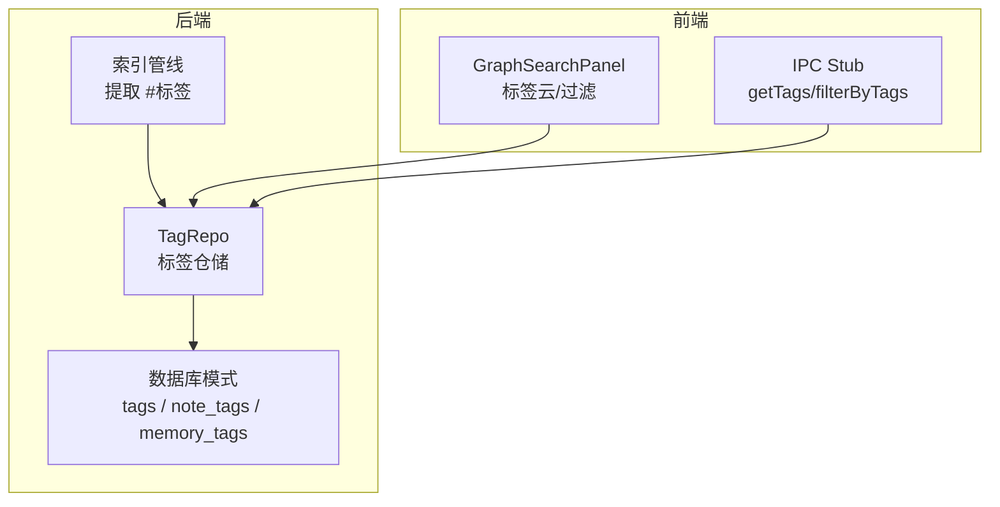
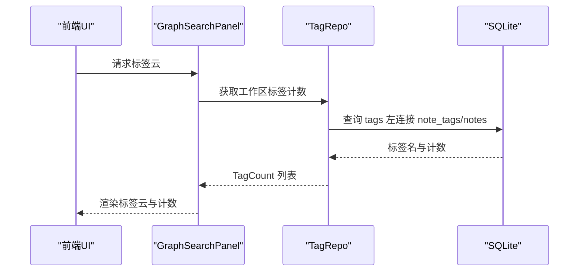
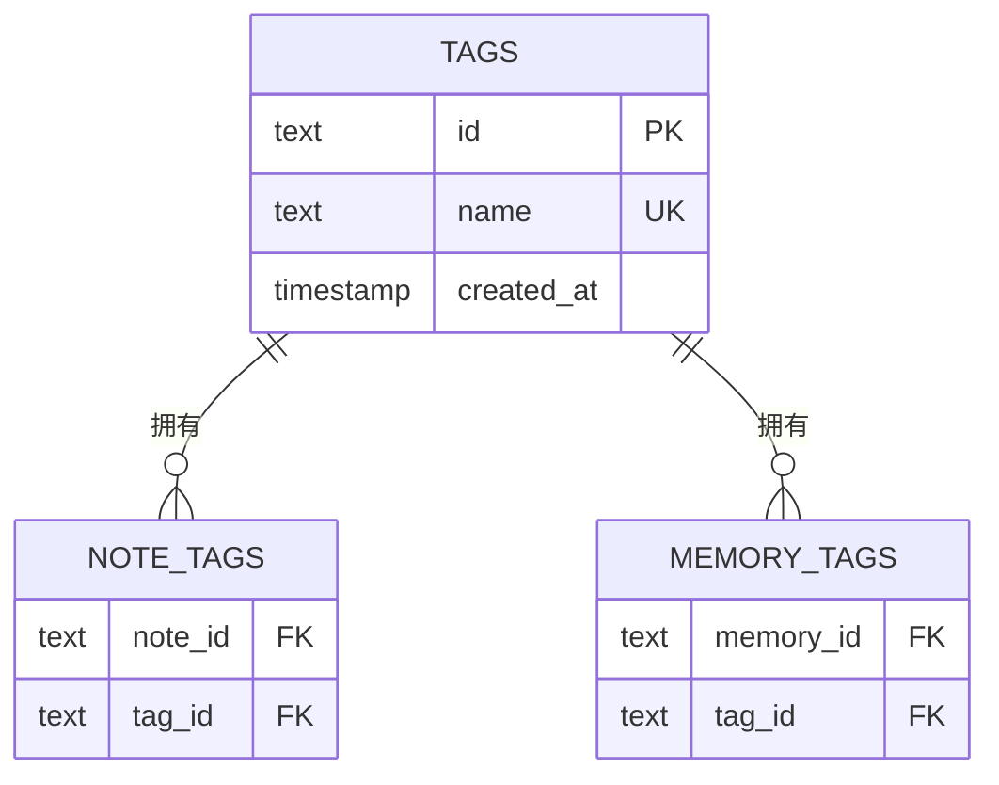
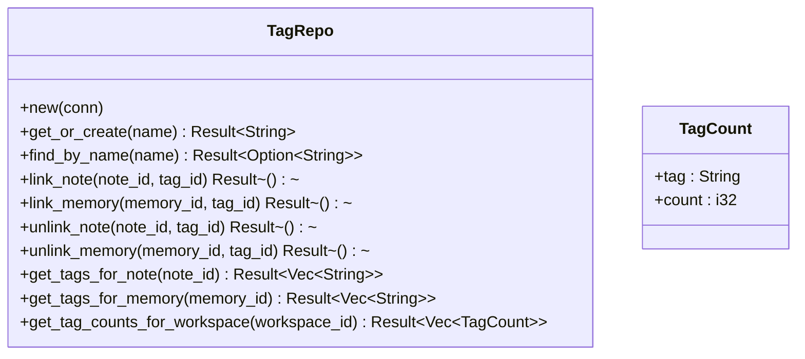
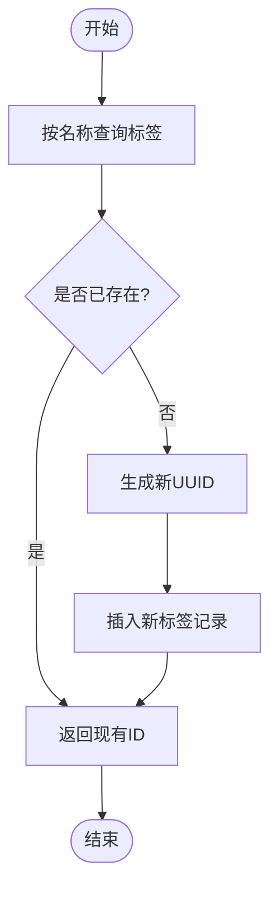
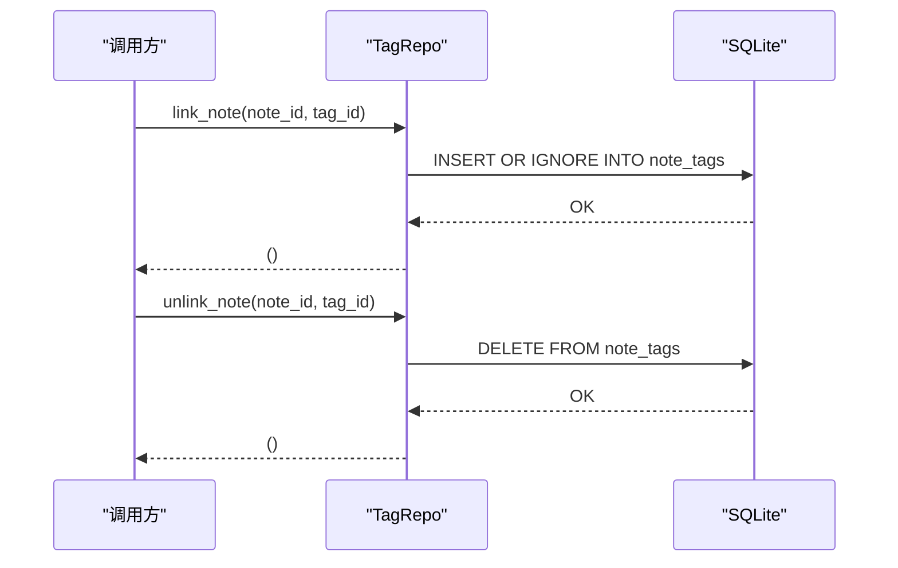
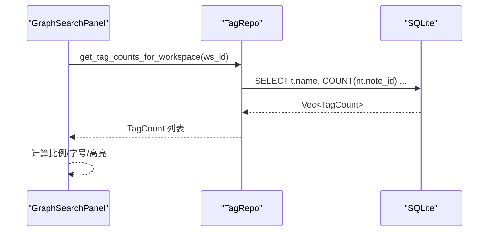
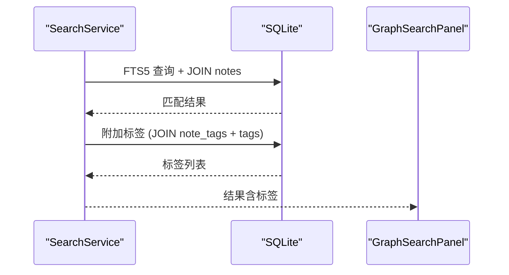
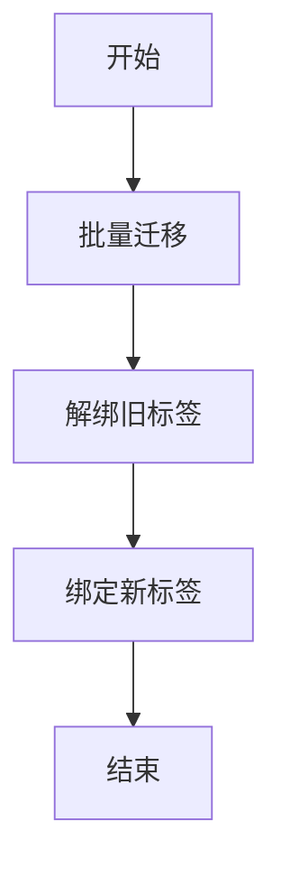
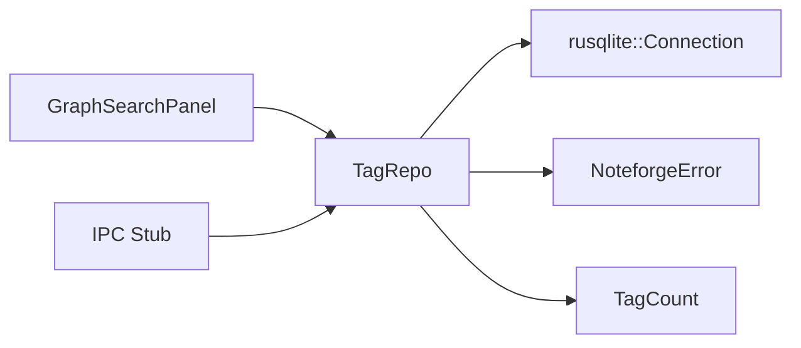

# 标签仓储

<cite>
**本文引用的文件**
- [src-tauri/src/repositories/tag_repo.rs](file://src-tauri/src/repositories/tag_repo.rs)
- [src-tauri/src/models/tag.rs](file://src-tauri/src/models/tag.rs)
- [src-tauri/src/db.rs](file://src-tauri/src/db.rs)
- [.tmp/system-architecture-design.md](file://.tmp/system-architecture-design.md)
- [src-tauri/tests/integration_test.rs](file://src-tauri/tests/integration_test.rs)
- [src-tauri/tests/ipc_contract_tests.rs](file://src-tauri/tests/ipc_contract_tests.rs)
- [src/components/sidebar/GraphSearchPanel.tsx](file://src/components/sidebar/GraphSearchPanel.tsx)
- [src/ipc/stub.ts](file://src/ipc/stub.ts)
- [src-tauri/src/pipeline.rs](file://src-tauri/src/pipeline.rs)
</cite>

## 目录
1. [简介](#简介)
2. [项目结构](#项目结构)
3. [核心组件](#核心组件)
4. [架构总览](#架构总览)
5. [详细组件分析](#详细组件分析)
6. [依赖关系分析](#依赖关系分析)
7. [性能考量](#性能考量)
8. [故障排查指南](#故障排查指南)
9. [结论](#结论)
10. [附录](#附录)

## 简介
本文件系统性梳理标签仓储（TagRepo）在 Noteforge 中的数据管理实现，覆盖标签创建、分配、查询、统计与计数等核心能力，并结合数据库模式、前端展示与测试契约，解释标签云生成、标签关联度计算、标签搜索与自动补全的端到端流程。同时给出批量标签操作、标签重命名、标签继承与冲突处理、重复清理与标准化等实践建议。

## 项目结构
标签仓储位于后端 Rust 侧，围绕 SQLite 数据库中的标签表与多对多关联表进行读写；前端通过知识检索与标签面板展示标签云与过滤结果；测试用例覆盖 IPC 契约与集成行为。

**图表来源**
- [src-tauri/src/repositories/tag_repo.rs:1-121](file://src-tauri/src/repositories/tag_repo.rs#L1-L121)
- [src-tauri/src/db.rs:68-72](file://src-tauri/src/db.rs#L68-L72)
- [src-tauri/src/pipeline.rs:193-203](file://src-tauri/src/pipeline.rs#L193-L203)
- [src/components/sidebar/GraphSearchPanel.tsx:61-145](file://src/components/sidebar/GraphSearchPanel.tsx#L61-L145)
- [src/ipc/stub.ts:477-508](file://src/ipc/stub.ts#L477-L508)

**章节来源**
- [src-tauri/src/repositories/tag_repo.rs:1-121](file://src-tauri/src/repositories/tag_repo.rs#L1-L121)
- [src-tauri/src/db.rs:68-72](file://src-tauri/src/db.rs#L68-L72)
- [.tmp/system-architecture-design.md:519-542](file://.tmp/system-architecture-design.md#L519-L542)

## 核心组件
- 标签仓储 TagRepo：封装标签的获取/创建、笔记/记忆体标签关联与解绑、按笔记/记忆体取标签、工作区标签计数与按名称查找。
- 数据模型 TagCount：用于标签统计结果的序列化结构。
- 数据库模式：tags 主表与 note_tags、memory_tags 关联表，定义唯一约束与外键级联。
- 前端标签云与过滤：基于标签计数渲染标签云，支持多标签组合筛选。
- 索引管线：从内容中提取 #标签，供标签统计与搜索使用。

**章节来源**
- [src-tauri/src/repositories/tag_repo.rs:1-121](file://src-tauri/src/repositories/tag_repo.rs#L1-L121)
- [src-tauri/src/models/tag.rs:1-17](file://src-tauri/src/models/tag.rs#L1-L17)
- [src-tauri/src/db.rs:68-72](file://src-tauri/src/db.rs#L68-L72)
- [src-tauri/src/pipeline.rs:193-203](file://src-tauri/src/pipeline.rs#L193-L203)
- [src/components/sidebar/GraphSearchPanel.tsx:61-145](file://src/components/sidebar/GraphSearchPanel.tsx#L61-L145)

## 架构总览
标签系统围绕“标签实体 + 关联关系 + 统计查询”展开，前端通过知识检索服务与标签云面板消费统计结果，索引管线负责从内容中抽取标签。

**图表来源**
- [src-tauri/src/repositories/tag_repo.rs:88-111](file://src-tauri/src/repositories/tag_repo.rs#L88-L111)
- [src/components/sidebar/GraphSearchPanel.tsx:61-145](file://src/components/sidebar/GraphSearchPanel.tsx#L61-L145)

## 详细组件分析

### 标签实体与关联表设计
- tags 表：主键 id、唯一 name、创建时间 created_at。
- note_tags 关联表：笔记与标签的多对多，主键(note_id, tag_id)，外键级联删除。
- memory_tags 关联表：记忆体与标签的多对多，主键(memory_id, tag_id)，外键级联删除。

**图表来源**
- [.tmp/system-architecture-design.md:519-542](file://.tmp/system-architecture-design.md#L519-L542)
- [src-tauri/src/db.rs:68-72](file://src-tauri/src/db.rs#L68-L72)

**章节来源**
- [.tmp/system-architecture-design.md:519-542](file://.tmp/system-architecture-design.md#L519-L542)
- [src-tauri/src/db.rs:68-72](file://src-tauri/src/db.rs#L68-L72)

### 标签仓储接口与实现要点
- 创建/获取标签：按名称查询，不存在则生成新 UUID 插入 tags。
- 笔记/记忆体标签关联：使用 INSERT OR IGNORE 防止重复插入。
- 解绑：按 (note_id, tag_id) 或 (memory_id, tag_id) 删除关联。
- 查询：按笔记/记忆体 ID 返回标签名列表。
- 统计：按工作区聚合标签使用次数，降序排列。
- 名称查找：按 name 返回 id（用于去重与存在性判断）。

**图表来源**
- [src-tauri/src/repositories/tag_repo.rs:5-121](file://src-tauri/src/repositories/tag_repo.rs#L5-L121)
- [src-tauri/src/models/tag.rs:11-16](file://src-tauri/src/models/tag.rs#L11-L16)

**章节来源**
- [src-tauri/src/repositories/tag_repo.rs:14-119](file://src-tauri/src/repositories/tag_repo.rs#L14-L119)
- [src-tauri/src/models/tag.rs:11-16](file://src-tauri/src/models/tag.rs#L11-L16)

### 标签创建与去重（幂等）
- 逻辑：先查重，命中则返回现有 id；未命中则生成新 id 并插入。
- 测试契约：多次创建同名标签返回相同 id，确保幂等。

**图表来源**
- [src-tauri/src/repositories/tag_repo.rs:14-32](file://src-tauri/src/repositories/tag_repo.rs#L14-L32)
- [src-tauri/tests/integration_test.rs:169-172](file://src-tauri/tests/integration_test.rs#L169-L172)

**章节来源**
- [src-tauri/src/repositories/tag_repo.rs:14-32](file://src-tauri/src/repositories/tag_repo.rs#L14-L32)
- [src-tauri/tests/integration_test.rs:169-172](file://src-tauri/tests/integration_test.rs#L169-L172)

### 标签分配与解绑
- 分配：INSERT OR IGNORE 将 (note_id, tag_id) 或 (memory_id, tag_id) 写入关联表。
- 解绑：按主键删除关联记录，保证幂等与可逆。

**图表来源**
- [src-tauri/src/repositories/tag_repo.rs:34-64](file://src-tauri/src/repositories/tag_repo.rs#L34-L64)

**章节来源**
- [src-tauri/src/repositories/tag_repo.rs:34-64](file://src-tauri/src/repositories/tag_repo.rs#L34-L64)

### 标签统计与标签云生成
- 统计：按工作区聚合标签使用次数，COUNT(nt.note_id) 作为计数，降序排序。
- 前端：根据最大计数归一化字号，渲染标签云；点击切换激活状态，支持多标签组合过滤。

**图表来源**
- [src-tauri/src/repositories/tag_repo.rs:88-111](file://src-tauri/src/repositories/tag_repo.rs#L88-L111)
- [src/components/sidebar/GraphSearchPanel.tsx:61-105](file://src/components/sidebar/GraphSearchPanel.tsx#L61-L105)

**章节来源**
- [src-tauri/src/repositories/tag_repo.rs:88-111](file://src-tauri/src/repositories/tag_repo.rs#L88-L111)
- [src/components/sidebar/GraphSearchPanel.tsx:61-105](file://src/components/sidebar/GraphSearchPanel.tsx#L61-L105)

### 标签搜索、模糊匹配与自动补全
- 搜索：知识检索服务包含“标签附加”步骤，从 note_tags 与 tags 联合查询笔记的标签，返回给前端展示。
- 模糊匹配：前端标签云面板基于 TagCount 列表渲染，实际输入框的模糊匹配由前端自行实现（如按标签名前缀/子串过滤）。
- 自动补全：结合标签云与输入框交互，动态展示候选标签。

**图表来源**
- [.tmp/system-architecture-design.md:825-854](file://.tmp/system-architecture-design.md#L825-L854)
- [src/components/sidebar/GraphSearchPanel.tsx:111-139](file://src/components/sidebar/GraphSearchPanel.tsx#L111-L139)

**章节来源**
- [.tmp/system-architecture-design.md:825-854](file://.tmp/system-architecture-design.md#L825-L854)
- [src/components/sidebar/GraphSearchPanel.tsx:111-139](file://src/components/sidebar/GraphSearchPanel.tsx#L111-L139)

### 标签层次结构、合并与删除
- 层次结构：当前模式未提供父子标签层级；标签以平面集合存在，通过关联表与笔记/记忆体建立多对多关系。
- 合并：可通过批量将多个笔记的旧标签解绑，再将新标签绑定，从而实现“合并到新标签”的效果。
- 删除：删除标签实体会因外键级联删除导致关联表记录被清理；若需保留笔记，请先解绑再删除。

**图表来源**
- [src-tauri/src/repositories/tag_repo.rs:50-64](file://src-tauri/src/repositories/tag_repo.rs#L50-L64)
- [src-tauri/src/repositories/tag_repo.rs:34-48](file://src-tauri/src/repositories/tag_repo.rs#L34-L48)

**章节来源**
- [src-tauri/src/repositories/tag_repo.rs:34-64](file://src-tauri/src/repositories/tag_repo.rs#L34-L64)

### 标签标准化与重复清理
- 标准化：建议统一大小写、去除多余空白、规范化特殊字符，入库前进行清洗。
- 重复清理：利用 get_or_create 的幂等特性，统一使用名称去重；必要时可定期扫描重复名称并合并。

**章节来源**
- [src-tauri/src/repositories/tag_repo.rs:14-32](file://src-tauri/src/repositories/tag_repo.rs#L14-L32)

### 批量标签操作、重命名与继承
- 批量操作：遍历目标笔记/记忆体，逐条执行 link_* / unlink_*，实现批量添加/移除标签。
- 重命名：先创建新标签（get_or_create），再将旧标签解绑、新标签绑定，最后删除旧标签（如不再使用）。
- 继承：当前模式未提供父标签；可在业务层通过规则实现“模板标签”或“默认标签”，在创建笔记/记忆体时批量应用。

**章节来源**
- [src-tauri/src/repositories/tag_repo.rs:14-64](file://src-tauri/src/repositories/tag_repo.rs#L14-L64)

## 依赖关系分析
- TagRepo 依赖 rusqlite 连接与自定义错误类型；返回值统一为 Result。
- TagCount 为 DTO，用于跨层传输标签统计结果。
- 前端 GraphSearchPanel 依赖 TagCount 列表渲染标签云；IPC Stub 提供 getTags/filterByTags 的模拟实现。

**图表来源**
- [src-tauri/src/repositories/tag_repo.rs:1-3](file://src-tauri/src/repositories/tag_repo.rs#L1-L3)
- [src-tauri/src/models/tag.rs:11-16](file://src-tauri/src/models/tag.rs#L11-L16)
- [src/components/sidebar/GraphSearchPanel.tsx:61-105](file://src/components/sidebar/GraphSearchPanel.tsx#L61-L105)
- [src/ipc/stub.ts:477-508](file://src/ipc/stub.ts#L477-L508)

**章节来源**
- [src-tauri/src/repositories/tag_repo.rs:1-3](file://src-tauri/src/repositories/tag_repo.rs#L1-L3)
- [src-tauri/src/models/tag.rs:11-16](file://src-tauri/src/models/tag.rs#L11-L16)
- [src/components/sidebar/GraphSearchPanel.tsx:61-105](file://src/components/sidebar/GraphSearchPanel.tsx#L61-L105)
- [src/ipc/stub.ts:477-508](file://src/ipc/stub.ts#L477-L508)

## 性能考量
- 索引：tags.name 唯一约束；note_tags/memory_tags 主键索引；notes/workspace 外键索引有助于统计与过滤。
- 统计查询：使用 LEFT JOIN + GROUP BY + ORDER BY，注意大数据量时可考虑物化视图或缓存热点标签计数。
- 前端渲染：标签云按最大计数归一化字号，避免 O(N) 字号差异过大导致视觉拥挤。

**章节来源**
- [src-tauri/src/db.rs:68-72](file://src-tauri/src/db.rs#L68-L72)
- [src-tauri/src/repositories/tag_repo.rs:88-111](file://src-tauri/src/repositories/tag_repo.rs#L88-L111)
- [src/components/sidebar/GraphSearchPanel.tsx:68-69](file://src/components/sidebar/GraphSearchPanel.tsx#L68-L69)

## 故障排查指南
- 标签创建不幂等：检查 get_or_create 是否正确捕获“未找到”异常并插入新记录。
- 重复插入：确认 link_* 使用 INSERT OR IGNORE，避免违反关联表主键约束。
- 统计为空：确认笔记与工作区关联正确，且 note_tags 与 notes 的 JOIN 条件有效。
- IPC 契约不一致：参考测试用例，确保字段命名 camelCase 与前端类型一致。

**章节来源**
- [src-tauri/tests/integration_test.rs:169-182](file://src-tauri/tests/integration_test.rs#L169-L182)
- [src-tauri/tests/ipc_contract_tests.rs:219-260](file://src-tauri/tests/ipc_contract_tests.rs#L219-L260)

## 结论
标签仓储以简洁的实体与关联表为核心，提供了标签创建、分配、统计与查询的基础能力；结合前端标签云与知识检索，形成完整的标签生态闭环。通过幂等创建、批量操作与标准化流程，可进一步提升标签管理的可靠性与可维护性。

## 附录
- 索引管线从内容中提取 #标签，为标签统计与搜索提供基础数据来源。
- 前端标签云面板支持多标签组合过滤，点击切换激活状态，直观展示标签热度。

**章节来源**
- [src-tauri/src/pipeline.rs:193-203](file://src-tauri/src/pipeline.rs#L193-L203)
- [src/components/sidebar/GraphSearchPanel.tsx:61-145](file://src/components/sidebar/GraphSearchPanel.tsx#L61-L145)