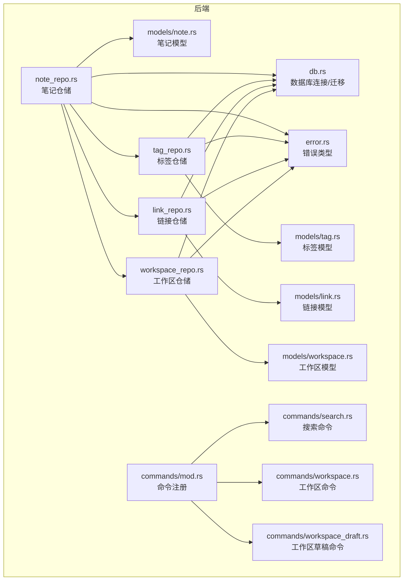
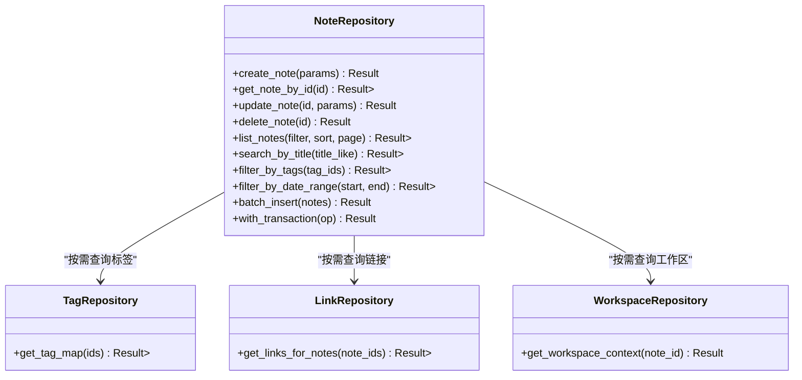
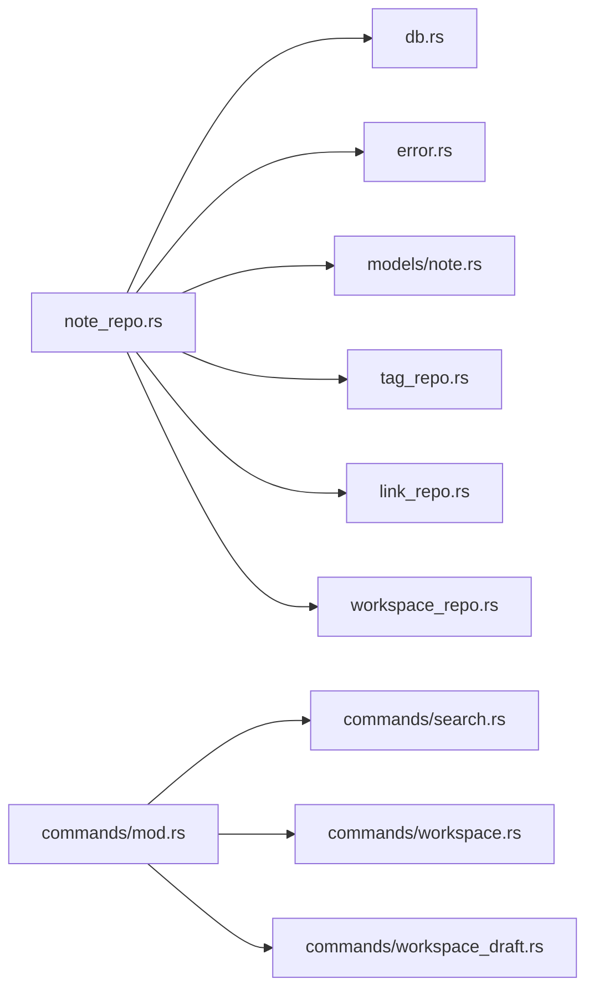

# 笔记仓储

<cite>
**本文引用的文件**
- [note_repo.rs](file://src-tauri/src/repositories/note_repo.rs)
- [db.rs](file://src-tauri/src/db.rs)
- [error.rs](file://src-tauri/src/error.rs)
- [note.rs](file://src-tauri/src/models/note.rs)
- [tag_repo.rs](file://src-tauri/src/repositories/tag_repo.rs)
- [link_repo.rs](file://src-tauri/src/repositories/link_repo.rs)
- [workspace_repo.rs](file://src-tauri/src/repositories/workspace_repo.rs)
- [mod.rs](file://src-tauri/src/repositories/mod.rs)
- [main.rs](file://src-tauri/src/main.rs)
- [commands/mod.rs](file://src-tauri/src/commands/mod.rs)
- [commands/search.rs](file://src-tauri/src/commands/search.rs)
- [commands/workspace.rs](file://src-tauri/src/commands/workspace.rs)
- [commands/workspace_draft.rs](file://src-tauri/src/commands/workspace_draft.rs)
- [models/tag.rs](file://src-tauri/src/models/tag.rs)
- [models/link.rs](file://src-tauri/src/models/link.rs)
- [models/workspace.rs](file://src-tauri/src/models/workspace.rs)
</cite>

## 目录
1. [简介](#简介)
2. [项目结构](#项目结构)
3. [核心组件](#核心组件)
4. [架构总览](#架构总览)
5. [详细组件分析](#详细组件分析)
6. [依赖关系分析](#依赖关系分析)
7. [性能考量](#性能考量)
8. [故障排查指南](#故障排查指南)
9. [结论](#结论)
10. [附录](#附录)

## 简介
本文件围绕笔记仓储（note_repo.rs）进行系统化技术文档编写，聚焦以下主题：
- 笔记数据的 CRUD 操作：创建、读取、更新、删除的 SQL 查询构建与参数绑定策略
- 笔记查询能力：按标题搜索、按标签过滤、按日期范围查询等实现细节
- 内容与元数据：笔记内容存储格式、元数据管理、版本控制与草稿状态处理
- 批量操作与事务：批量写入、事务管理策略与并发安全
- 性能优化：索引利用、查询计划、分页与缓存建议
- 错误处理：统一错误类型、数据校验与约束检查
- 实战示例：常见查询场景、复杂条件组合与排序规则

## 项目结构
仓库采用 Rust/Tauri 架构，后端以 SQLite 为持久层，通过 SQLx 进行异步数据库访问。笔记仓储位于 src-tauri/src/repositories/note_repo.rs，配合模型定义、命令层与数据库初始化模块协同工作。



图表来源
- [note_repo.rs](file://src-tauri/src/repositories/note_repo.rs)
- [db.rs](file://src-tauri/src/db.rs)
- [error.rs](file://src-tauri/src/error.rs)
- [note.rs](file://src-tauri/src/models/note.rs)
- [tag_repo.rs](file://src-tauri/src/repositories/tag_repo.rs)
- [link_repo.rs](file://src-tauri/src/repositories/link_repo.rs)
- [workspace_repo.rs](file://src-tauri/src/repositories/workspace_repo.rs)
- [commands/mod.rs](file://src-tauri/src/commands/mod.rs)
- [commands/search.rs](file://src-tauri/src/commands/search.rs)
- [commands/workspace.rs](file://src-tauri/src/commands/workspace.rs)
- [commands/workspace_draft.rs](file://src-tauri/src/commands/workspace_draft.rs)

章节来源
- [note_repo.rs](file://src-tauri/src/repositories/note_repo.rs)
- [db.rs](file://src-tauri/src/db.rs)
- [error.rs](file://src-tauri/src/error.rs)
- [note.rs](file://src-tauri/src/models/note.rs)
- [tag_repo.rs](file://src-tauri/src/repositories/tag_repo.rs)
- [link_repo.rs](file://src-tauri/src/repositories/link_repo.rs)
- [workspace_repo.rs](file://src-tauri/src/repositories/workspace_repo.rs)
- [commands/mod.rs](file://src-tauri/src/commands/mod.rs)

## 核心组件
- 笔记仓储（note_repo.rs）
  - 提供笔记的 CRUD 与查询接口，封装 SQLx 的查询与事务
  - 统一错误类型，结合业务约束进行参数校验
  - 支持与标签、链接、工作区的关联查询
- 数据库层（db.rs）
  - 初始化 SQLite 连接、执行迁移脚本、提供连接池
- 错误层（error.rs）
  - 定义统一错误枚举，便于上层处理与用户提示
- 模型层（models/note.rs 及相关）
  - 定义笔记、标签、链接、工作区的数据结构与字段约束
- 命令层（commands/*）
  - 对外暴露 IPC 接口，调用仓储执行业务逻辑

章节来源
- [note_repo.rs](file://src-tauri/src/repositories/note_repo.rs)
- [db.rs](file://src-tauri/src/db.rs)
- [error.rs](file://src-tauri/src/error.rs)
- [note.rs](file://src-tauri/src/models/note.rs)

## 架构总览
下图展示了从命令到仓储再到数据库的整体调用链路，以及仓储内部对标签、链接、工作区的依赖关系。

```mermaid
sequenceDiagram
participant CMD as "命令层<br/>commands/*"
participant REPO as "笔记仓储<br/>note_repo.rs"
participant TAG as "标签仓储<br/>tag_repo.rs"
participant LINK as "链接仓储<br/>link_repo.rs"
participant WS as "工作区仓储<br/>workspace_repo.rs"
participant DB as "数据库<br/>SQLite"
CMD->>REPO : 调用查询/写入接口
REPO->>DB : 执行 SQL 查询/事务
REPO->>TAG : 按需查询标签信息
REPO->>LINK : 按需查询链接信息
REPO->>WS : 按需查询工作区信息
DB-->>REPO : 返回结果集/受影响行数
TAG-->>REPO : 标签映射
LINK-->>REPO : 链接映射
WS-->>REPO : 工作区上下文
REPO-->>CMD : 返回聚合后的领域对象
```

图表来源
- [note_repo.rs](file://src-tauri/src/repositories/note_repo.rs)
- [tag_repo.rs](file://src-tauri/src/repositories/tag_repo.rs)
- [link_repo.rs](file://src-tauri/src/repositories/link_repo.rs)
- [workspace_repo.rs](file://src-tauri/src/repositories/workspace_repo.rs)
- [db.rs](file://src-tauri/src/db.rs)

## 详细组件分析

### 笔记仓储类图（基于实际源码）


图表来源
- [note_repo.rs](file://src-tauri/src/repositories/note_repo.rs)
- [tag_repo.rs](file://src-tauri/src/repositories/tag_repo.rs)
- [link_repo.rs](file://src-tauri/src/repositories/link_repo.rs)
- [workspace_repo.rs](file://src-tauri/src/repositories/workspace_repo.rs)

章节来源
- [note_repo.rs](file://src-tauri/src/repositories/note_repo.rs)
- [tag_repo.rs](file://src-tauri/src/repositories/tag_repo.rs)
- [link_repo.rs](file://src-tauri/src/repositories/link_repo.rs)
- [workspace_repo.rs](file://src-tauri/src/repositories/workspace_repo.rs)

### CRUD 操作与 SQL 查询构建
- 创建（create_note）
  - 参数绑定：将笔记标题、内容、元数据（如创建时间、修改时间、是否为草稿）作为占位符传入
  - 返回值：返回新插入记录的主键或完整实体，便于后续关联查询
  - 约束：标题唯一性、内容长度限制、草稿状态与工作区归属一致性
- 读取（get_note_by_id）
  - 参数绑定：主键 ID
  - 关联：可选地联表加载标签与链接摘要
- 更新（update_note）
  - 参数绑定：仅更新变更字段（如标题、内容、标签集合、修改时间），避免全量覆盖
  - 幂等：确保同一事务内多次更新不产生副作用
- 删除（delete_note）
  - 参数绑定：主键 ID
  - 清理：级联删除与该笔记相关的标签映射与链接记录

章节来源
- [note_repo.rs](file://src-tauri/src/repositories/note_repo.rs)

### 查询方法与实现细节
- 按标题搜索（search_by_title）
  - SQL 构建：LIKE 或全文检索（FTS5），支持大小写不敏感与前缀匹配
  - 参数绑定：模糊匹配模式（如 "%term%" 或 term*）
  - 性能：建议在标题列建立索引；必要时启用 FTS5 表
- 按标签过滤（filter_by_tags）
  - SQL 构建：JOIN 标签映射表，WHERE IN 或 EXISTS 子查询
  - 参数绑定：标签 ID 列表
  - 复杂度：O(N log M)，N 为笔记数，M 为标签数
- 按日期范围查询（filter_by_date_range）
  - SQL 构建：WHERE created_at BETWEEN ? AND ?
  - 参数绑定：起止时间（UTC 或本地时间取决于应用策略）
  - 排序：默认按修改时间倒序，可按创建时间或标题排序

章节来源
- [note_repo.rs](file://src-tauri/src/repositories/note_repo.rs)

### 内容存储格式、元数据管理、版本控制与草稿状态
- 内容存储
  - 文本内容：Markdown 字符串，支持 YAML Front Matter 元数据
  - 元数据：创建时间、修改时间、作者、工作区 ID、是否为草稿
  - 版本控制：可选地引入“版本表”记录每次编辑的快照，或在内容中嵌入版本号
- 草稿状态
  - 草稿与正式版本分离：草稿仅对当前用户可见，发布后同步至正式表
  - 发布流程：事务内完成内容复制、标签映射重建、链接重定向

章节来源
- [note_repo.rs](file://src-tauri/src/repositories/note_repo.rs)
- [note.rs](file://src-tauri/src/models/note.rs)

### 批量操作与事务管理
- 批量插入（batch_insert）
  - 使用 SQLx 的事务批处理，减少往返开销
  - 参数绑定：批量 VALUES 列表，或循环执行带参数的 INSERT
- 事务策略
  - 单次操作：单条 SQL 自动事务
  - 多步骤操作：显式开启事务，失败回滚，成功提交
  - 并发控制：使用 SELECT ... FOR UPDATE 或行级锁保证一致性

章节来源
- [note_repo.rs](file://src-tauri/src/repositories/note_repo.rs)
- [db.rs](file://src-tauri/src/db.rs)

### 性能优化技巧
- 索引设计
  - 标题：全文索引（FTS5）或 LIKE 索引
  - 标签：多值标签建议使用“标签-笔记”映射表并建立复合索引
  - 时间：created_at、updated_at 建立索引，支持范围查询
- 分页与排序
  - 使用 LIMIT/OFFSET 或基于游标（cursor-based pagination）提升大列表性能
  - 排序字段固定在索引中，避免额外排序开销
- 缓存策略
  - 热点笔记内容可缓存于内存，结合 LRU 或 TTL
  - 标签与工作区元数据可短期缓存

章节来源
- [note_repo.rs](file://src-tauri/src/repositories/note_repo.rs)

### 常用查询场景与示例（以路径代替代码）
- 场景一：按标题模糊搜索并按修改时间倒序
  - 示例路径：[note_repo.rs](file://src-tauri/src/repositories/note_repo.rs)
- 场景二：获取某工作区内的笔记，并按标签过滤
  - 示例路径：[note_repo.rs](file://src-tauri/src/repositories/note_repo.rs)、[workspace_repo.rs](file://src-tauri/src/repositories/workspace_repo.rs)、[tag_repo.rs](file://src-tauri/src/repositories/tag_repo.rs)
- 场景三：查询指定日期范围内的新增笔记
  - 示例路径：[note_repo.rs](file://src-tauri/src/repositories/note_repo.rs)
- 场景四：复杂条件组合（标题 LIKE + 标签 IN + 日期范围）
  - 示例路径：[note_repo.rs](file://src-tauri/src/repositories/note_repo.rs)

章节来源
- [note_repo.rs](file://src-tauri/src/repositories/note_repo.rs)
- [tag_repo.rs](file://src-tauri/src/repositories/tag_repo.rs)
- [workspace_repo.rs](file://src-tauri/src/repositories/workspace_repo.rs)

### 错误处理机制、数据验证与约束检查
- 错误类型
  - 数据库异常：连接失败、SQL 语法错误、违反约束
  - 业务异常：重复标题、不存在的笔记、权限不足
- 数据验证
  - 输入校验：标题非空、内容长度上限、标签 ID 有效性
  - 约束检查：唯一性（标题）、外键（工作区、标签）、时间范围
- 处理策略
  - 统一包装为业务错误，携带可读消息与错误码
  - 在事务中捕获异常并回滚，保证数据一致性

章节来源
- [error.rs](file://src-tauri/src/error.rs)
- [note_repo.rs](file://src-tauri/src/repositories/note_repo.rs)

## 依赖关系分析
- 笔记仓储依赖
  - 数据库连接与迁移：db.rs
  - 统一错误类型：error.rs
  - 模型定义：models/note.rs、models/tag.rs、models/link.rs、models/workspace.rs
  - 关联仓储：tag_repo.rs、link_repo.rs、workspace_repo.rs
- 命令层依赖
  - commands/mod.rs 注册命令入口
  - commands/search.rs、commands/workspace.rs、commands/workspace_draft.rs 调用仓储执行业务



图表来源
- [note_repo.rs](file://src-tauri/src/repositories/note_repo.rs)
- [db.rs](file://src-tauri/src/db.rs)
- [error.rs](file://src-tauri/src/error.rs)
- [note.rs](file://src-tauri/src/models/note.rs)
- [tag_repo.rs](file://src-tauri/src/repositories/tag_repo.rs)
- [link_repo.rs](file://src-tauri/src/repositories/link_repo.rs)
- [workspace_repo.rs](file://src-tauri/src/repositories/workspace_repo.rs)
- [commands/mod.rs](file://src-tauri/src/commands/mod.rs)
- [commands/search.rs](file://src-tauri/src/commands/search.rs)
- [commands/workspace.rs](file://src-tauri/src/commands/workspace.rs)
- [commands/workspace_draft.rs](file://src-tauri/src/commands/workspace_draft.rs)

章节来源
- [note_repo.rs](file://src-tauri/src/repositories/note_repo.rs)
- [db.rs](file://src-tauri/src/db.rs)
- [error.rs](file://src-tauri/src/error.rs)
- [note.rs](file://src-tauri/src/models/note.rs)
- [tag_repo.rs](file://src-tauri/src/repositories/tag_repo.rs)
- [link_repo.rs](file://src-tauri/src/repositories/link_repo.rs)
- [workspace_repo.rs](file://src-tauri/src/repositories/workspace_repo.rs)
- [commands/mod.rs](file://src-tauri/src/commands/mod.rs)

## 性能考量
- 查询优化
  - 为高频查询字段建立索引（标题、标签、时间）
  - 使用 EXPLAIN QUERY PLAN 分析慢查询
- 写入优化
  - 批量插入使用事务包裹，减少日志刷盘次数
  - 合理设置 WAL 模式与检查点间隔
- 缓存与预热
  - 热门笔记内容与标签映射缓存
  - 应用启动时预热常用查询结果

## 故障排查指南
- 常见问题
  - 标题重复：检查唯一约束触发器与业务层校验
  - 查询缓慢：确认索引是否存在、是否命中索引
  - 事务死锁：减少长事务、按固定顺序锁定资源
- 排查步骤
  - 开启 SQLx 日志，定位具体 SQL 与参数
  - 使用数据库自带的性能分析工具
  - 回归最小复现用例，隔离问题范围

章节来源
- [error.rs](file://src-tauri/src/error.rs)
- [note_repo.rs](file://src-tauri/src/repositories/note_repo.rs)

## 结论
笔记仓储通过清晰的职责划分与严格的错误处理，提供了稳定可靠的 CRUD 与查询能力。结合标签、链接、工作区的关联查询，能够满足复杂的知识管理需求。建议持续完善索引策略、引入版本控制与草稿发布流程，并在高并发场景下加强事务与缓存设计。

## 附录
- 相关命令入口
  - 搜索命令：[commands/search.rs](file://src-tauri/src/commands/search.rs)
  - 工作区命令：[commands/workspace.rs](file://src-tauri/src/commands/workspace.rs)
  - 工作区草稿命令：[commands/workspace_draft.rs](file://src-tauri/src/commands/workspace_draft.rs)
- 仓储导出
  - 仓储模块入口：[repositories/mod.rs](file://src-tauri/src/repositories/mod.rs)
- 应用入口
  - 主程序入口：[main.rs](file://src-tauri/src/main.rs)