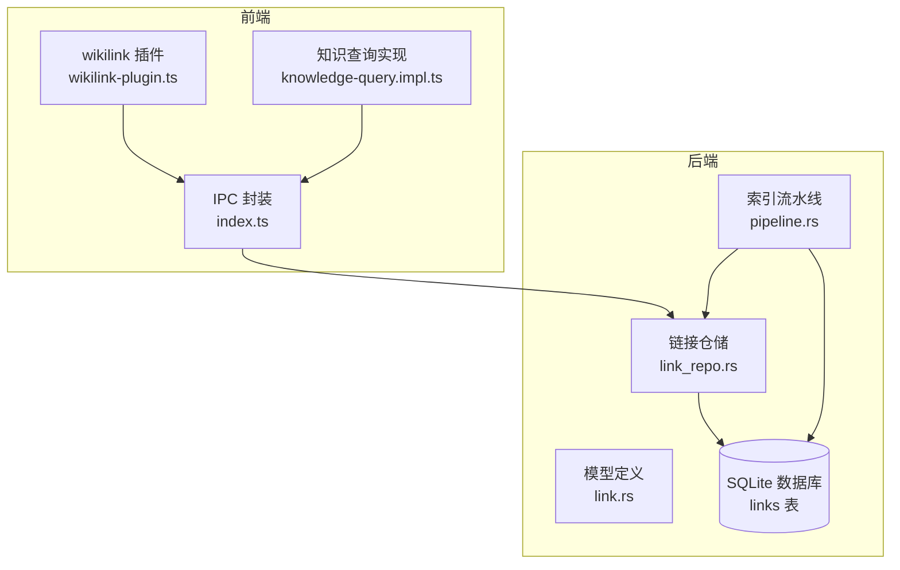
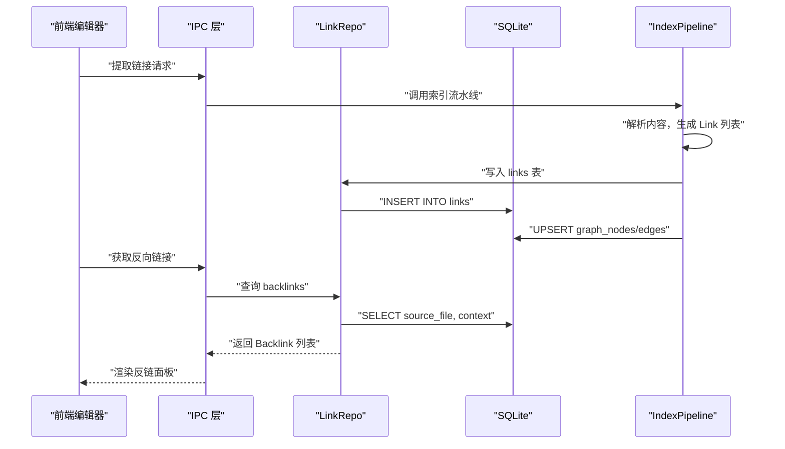
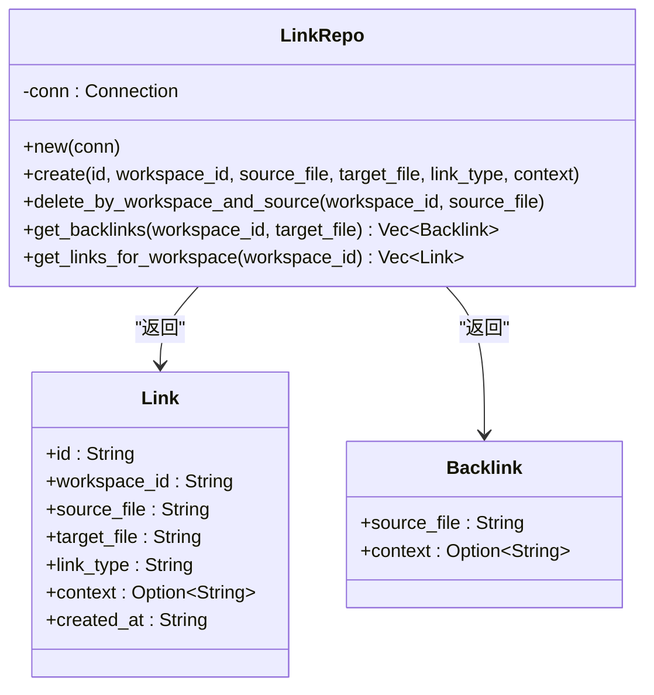
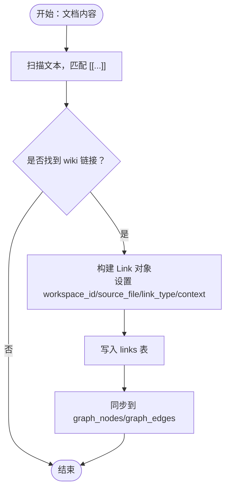
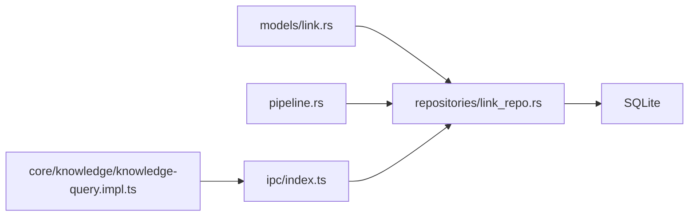

# 链接仓储

<cite>
**本文引用的文件**
- [link_repo.rs](file://src-tauri/src/repositories/link_repo.rs)
- [link.rs](file://src-tauri/src/models/link.rs)
- [pipeline.rs](file://src-tauri/src/pipeline.rs)
- [wikilink-plugin.ts](file://src/features/markdown/wikilink-plugin.ts)
- [knowledge-query.impl.ts](file://src/core/knowledge/knowledge-query.impl.ts)
- [stub.ts](file://src/ipc/stub.ts)
- [index.ts](file://src/ipc/index.ts)
- [system-architecture-design.md](file://.tmp/system-architecture-design.md)
- [ipc_contract_tests.rs](file://src-tauri/tests/ipc_contract_tests.rs)
- [dataflow_tests.rs](file://src-tauri/tests/dataflow_tests.rs)
</cite>

## 目录
1. [简介](#简介)
2. [项目结构](#项目结构)
3. [核心组件](#核心组件)
4. [架构总览](#架构总览)
5. [详细组件分析](#详细组件分析)
6. [依赖分析](#依赖分析)
7. [性能考虑](#性能考虑)
8. [故障排查指南](#故障排查指南)
9. [结论](#结论)
10. [附录](#附录)

## 简介
本文件系统化梳理“链接仓储”的设计与实现，聚焦 link_repo.rs 中文档链接关系的数据管理，覆盖以下主题：
- 内部链接与外部链接的存储与查询
- 链接解析算法与双向链接维护
- 循环引用检测思路与建议
- 链接统计、质量评估与推荐算法的实现现状与扩展点
- 查询优化、索引策略与缓存机制
- 链接操作示例：创建、更新、删除、批量处理
- 链接完整性检查、垃圾链接清理与迁移策略

## 项目结构
链接仓储位于 Tauri 后端，围绕 SQLite 表 links 提供 CRUD 与查询能力，并与前端编辑器插件、索引流水线、图谱服务协同工作。

图表来源
- [link_repo.rs:1-86](file://src-tauri/src/repositories/link_repo.rs#L1-L86)
- [link.rs:1-34](file://src-tauri/src/models/link.rs#L1-L34)
- [pipeline.rs:136-203](file://src-tauri/src/pipeline.rs#L136-L203)
- [wikilink-plugin.ts:1-106](file://src/features/markdown/wikilink-plugin.ts#L1-L106)
- [knowledge-query.impl.ts:96-134](file://src/core/knowledge/knowledge-query.impl.ts#L96-L134)
- [index.ts:326-354](file://src/ipc/index.ts#L326-L354)

章节来源
- [link_repo.rs:1-86](file://src-tauri/src/repositories/link_repo.rs#L1-L86)
- [link.rs:1-34](file://src-tauri/src/models/link.rs#L1-L34)
- [system-architecture-design.md:544-566](file://.tmp/system-architecture-design.md#L544-L566)

## 核心组件
- 链接仓储 LinkRepo：提供链接创建、按工作区与源文件删除、反向链接查询、工作区全量链接查询等方法。
- 链接模型 Link/Backlink：承载链接实体与反向链接条目。
- 索引流水线 IndexPipeline：负责从文档内容提取链接并写入图谱（graph_nodes/graph_edges），同时调用 LinkRepo 维护 links 表。
- 前端插件与查询：wikilink 插件解析 [[wiki 链接]]，知识查询实现提供对外部链接解析与建议。

章节来源
- [link_repo.rs:9-84](file://src-tauri/src/repositories/link_repo.rs#L9-L84)
- [link.rs:3-20](file://src-tauri/src/models/link.rs#L3-L20)
- [pipeline.rs:136-181](file://src-tauri/src/pipeline.rs#L136-L181)

## 架构总览
链接数据在系统中的流转路径如下：

图表来源
- [pipeline.rs:136-181](file://src-tauri/src/pipeline.rs#L136-L181)
- [link_repo.rs:14-60](file://src-tauri/src/repositories/link_repo.rs#L14-L60)
- [index.ts:332-345](file://src/ipc/index.ts#L332-L345)

## 详细组件分析

### 链接仓储 LinkRepo
- 角色定位：面向 workspace_id 的链接持久化层，提供最小可用接口。
- 关键方法
  - create：插入一条链接记录，支持 id、workspace_id、source_file、target_file、link_type、context。
  - delete_by_workspace_and_source：按工作区与源文件删除所有相关链接，用于文档重命名或删除后的清理。
  - get_backlinks：查询某目标文件在指定工作区内的所有反向链接（source_file 与 context）。
  - get_links_for_workspace：查询指定工作区内的全部链接记录。
- 设计要点
  - 使用 rusqlite 参数化执行，避免 SQL 注入。
  - 返回类型统一为 Result，便于上层错误传播。
  - 未实现链接去重与唯一性约束的显式校验，由数据库层约束保障。

图表来源
- [link_repo.rs:5-84](file://src-tauri/src/repositories/link_repo.rs#L5-L84)
- [link.rs:5-20](file://src-tauri/src/models/link.rs#L5-L20)

章节来源
- [link_repo.rs:9-84](file://src-tauri/src/repositories/link_repo.rs#L9-L84)
- [link.rs:3-20](file://src-tauri/src/models/link.rs#L3-L20)

### 链接模型与数据结构
- Link：标准链接实体，包含标识、工作区、源/目标文件、链接类型、上下文与创建时间。
- Backlink：反向链接投影，仅包含来源文件与上下文。
- ExtractLinksRequest/GetBacklinksRequest：用于 API 请求的输入载体。

章节来源
- [link.rs:3-34](file://src-tauri/src/models/link.rs#L3-L34)

### 链接解析算法
- 前端解析（wikilink 插件）：使用正则匹配 [[目标名]]，在编辑态进行节点化与点击打开。
- 后端解析（索引流水线）：从文档内容中抽取 wiki 链接，构造 Link 列表，填充 workspace_id、source_file、target_file、link_type、context 等字段，随后写入数据库并同步到图谱。

图表来源
- [wikilink-plugin.ts:14-41](file://src/features/markdown/wikilink-plugin.ts#L14-L41)
- [pipeline.rs:229-247](file://src-tauri/src/pipeline.rs#L229-L247)

章节来源
- [wikilink-plugin.ts:14-41](file://src/features/markdown/wikilink-plugin.ts#L14-L41)
- [pipeline.rs:229-247](file://src-tauri/src/pipeline.rs#L229-L247)

### 双向链接维护与循环引用检测
- 双向链接维护：IndexPipeline 在写入 links 后，同时在 graph_nodes/graph_edges 中建立边，形成“源节点 -> 目标节点”的有向边，从而在图谱层面实现双向可视化的基础。
- 循环引用检测：当前仓库未实现显式的循环检测逻辑。建议在写入 links 或图谱边前，采用 DFS/BFS 检测是否存在回路；若存在，则拒绝写入或提示用户。

章节来源
- [pipeline.rs:136-181](file://src-tauri/src/pipeline.rs#L136-L181)

### 链接统计、质量评估与推荐算法
- 统计：可基于 links 表按 workspace_id/source_file/target_file 进行聚合统计（如出度、入度、重复链接数）。
- 质量评估：可结合 context 片段长度、目标文件可达性、是否为外部链接等因素进行打分。
- 推荐：可参考 AI 推荐接口的思路，基于标题相似度、内容片段匹配度等生成候选集。

章节来源
- [stub.ts:848-864](file://src/ipc/stub.ts#L848-L864)

### 查询优化、索引策略与缓存机制
- 索引策略：links 表已定义针对 workspace_id、source_file、target_file 的索引，有助于加速按工作区过滤与反链查询。
- 查询优化：建议在高频查询场景下使用参数化查询与 LIMIT/分页；对反链查询可先查 links 再按需加载上下文。
- 缓存机制：可在应用层对热点文件的反链结果进行短期缓存，减少数据库压力。

章节来源
- [system-architecture-design.md:544-566](file://.tmp/system-architecture-design.md#L544-L566)

### 链接操作示例
- 创建链接
  - 步骤：调用 LinkRepo.create，传入 id、workspace_id、source_file、target_file、link_type、context。
  - 参考路径：[link_repo.rs:14-28](file://src-tauri/src/repositories/link_repo.rs#L14-L28)
- 更新链接
  - 当前实现未提供 update 方法。建议采用“删除旧记录 + 插入新记录”或引入 upsert 语句。
  - 参考路径：[link_repo.rs:30-40](file://src-tauri/src/repositories/link_repo.rs#L30-L40)
- 删除链接
  - 单条删除：直接调用 create 插入后，若需要删除可使用 delete_by_workspace_and_source。
  - 批量删除：按工作区与源文件范围批量删除，适合文档重命名/删除后的清理。
  - 参考路径：[link_repo.rs:30-40](file://src-tauri/src/repositories/link_repo.rs#L30-L40)
- 批量处理
  - 建议在索引流水线中批量写入 links 与图谱，减少事务开销。
  - 参考路径：[pipeline.rs:136-181](file://src-tauri/src/pipeline.rs#L136-L181)

章节来源
- [link_repo.rs:14-40](file://src-tauri/src/repositories/link_repo.rs#L14-L40)
- [pipeline.rs:136-181](file://src-tauri/src/pipeline.rs#L136-L181)

### 链接完整性检查、垃圾链接清理与迁移策略
- 完整性检查
  - 校验 links 与 graph_nodes 的一致性：确保每个 target_file 对应的节点存在。
  - 校验 workspace_id 与实际工作区范围一致。
- 垃圾链接清理
  - 清理不可达的目标（如目标文件不存在）、重复链接、孤立边。
- 迁移策略
  - 文档重命名：使用 delete_by_workspace_and_source 清理旧链接，再重新索引生成新链接。
  - 工作区分离：links 已按 workspace_id 隔离，迁移时保持该字段不变。

章节来源
- [link_repo.rs:30-40](file://src-tauri/src/repositories/link_repo.rs#L30-L40)
- [system-architecture-design.md:544-566](file://.tmp/system-architecture-design.md#L544-L566)

## 依赖分析
- LinkRepo 依赖 rusqlite 与自定义错误类型 NoteforgeError。
- 索引流水线依赖 LinkRepo 与图谱写入接口。
- 前端知识查询依赖 IPC 层封装的 get_backlinks。

图表来源
- [link_repo.rs:1-3](file://src-tauri/src/repositories/link_repo.rs#L1-L3)
- [link.rs:1-2](file://src-tauri/src/models/link.rs#L1-L2)
- [pipeline.rs:136-181](file://src-tauri/src/pipeline.rs#L136-L181)
- [index.ts:326-354](file://src/ipc/index.ts#L326-L354)
- [knowledge-query.impl.ts:96-134](file://src/core/knowledge/knowledge-query.impl.ts#L96-L134)

章节来源
- [link_repo.rs:1-3](file://src-tauri/src/repositories/link_repo.rs#L1-L3)
- [pipeline.rs:136-181](file://src-tauri/src/pipeline.rs#L136-L181)
- [index.ts:326-354](file://src/ipc/index.ts#L326-L354)
- [knowledge-query.impl.ts:96-134](file://src/core/knowledge/knowledge-query.impl.ts#L96-L134)

## 性能考虑
- 批量写入：索引阶段合并多条插入，减少事务次数。
- 索引利用：充分利用 workspace_id/source_file/target_file 索引，避免全表扫描。
- 上下文裁剪：仅在需要时加载 context 字段，降低 IO 压力。
- 图谱同步：graph_nodes/graph_edges 的 upsert 与边插入应尽量原子化，避免中间状态。

## 故障排查指南
- 反链为空
  - 检查 links 是否正确写入，确认 workspace_id 与目标文件路径一致。
  - 参考测试用例：[ipc_contract_tests.rs:266-288](file://src-tauri/tests/ipc_contract_tests.rs#L266-L288)
- 多工作区冲突
  - links 已按 workspace_id 隔离，确认传入的 workspace_id 正确。
  - 参考架构设计：[system-architecture-design.md:544-566](file://.tmp/system-architecture-design.md#L544-L566)
- 删除不生效
  - 确认使用 delete_by_workspace_and_source 并传入正确的 workspace_id 与 source_file。
  - 参考实现：[link_repo.rs:30-40](file://src-tauri/src/repositories/link_repo.rs#L30-L40)

章节来源
- [ipc_contract_tests.rs:266-288](file://src-tauri/tests/ipc_contract_tests.rs#L266-L288)
- [system-architecture-design.md:544-566](file://.tmp/system-architecture-design.md#L544-L566)
- [link_repo.rs:30-40](file://src-tauri/src/repositories/link_repo.rs#L30-L40)

## 结论
链接仓储以轻量的 CRUD 与查询为核心，配合索引流水线与前端插件，实现了从内容解析到图谱可视化的闭环。当前实现具备良好的工作区分离与索引基础，建议后续增强：
- 显式循环检测与质量评估
- 批量更新与去重策略
- 反链结果缓存与统计报表
- 更丰富的链接推荐与清理规则

## 附录
- 数据库表结构与索引
  - links 表：包含 id、workspace_id、source_file、target_file、link_type、context、created_at，并定义了针对 workspace_id、source_file、target_file 的索引。
  - 参考路径：[system-architecture-design.md:544-566](file://.tmp/system-architecture-design.md#L544-L566)
- 前端链接提取与反链查询
  - 前端插件负责解析 [[wiki 链接]]；IPC 层封装提取与反链查询。
  - 参考路径：[wikilink-plugin.ts:14-41](file://src/features/markdown/wikilink-plugin.ts#L14-L41)，[index.ts:332-345](file://src/ipc/index.ts#L332-L345)
- 端到端契约测试
  - 包含链接创建与反链查询的契约测试，验证工作区隔离与查询正确性。
  - 参考路径：[ipc_contract_tests.rs:266-288](file://src-tauri/tests/ipc_contract_tests.rs#L266-L288)