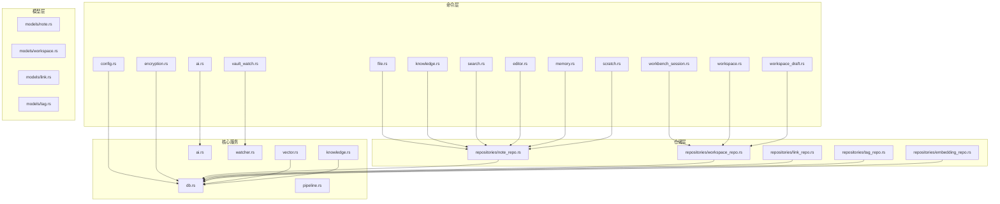
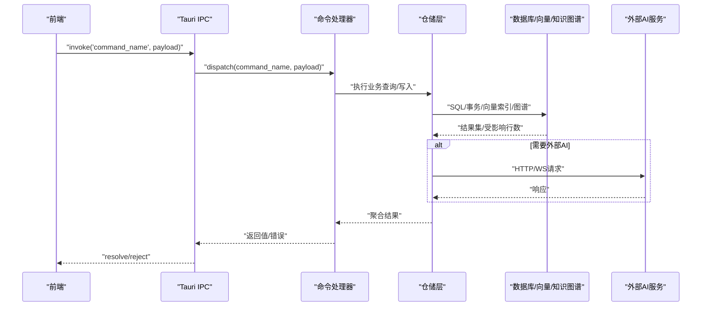
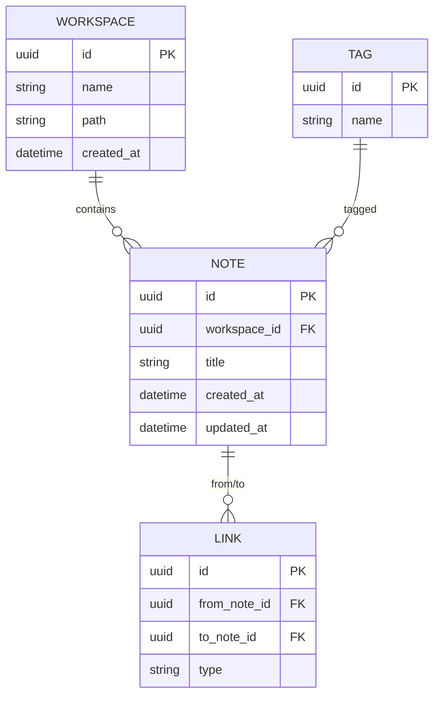
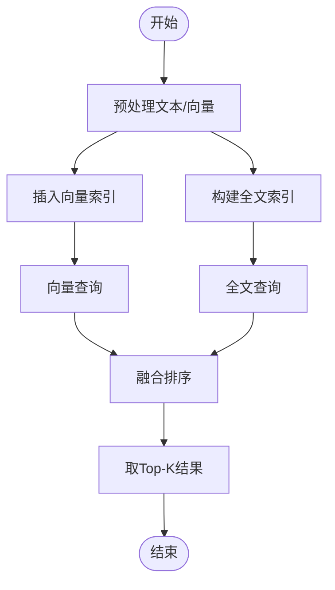
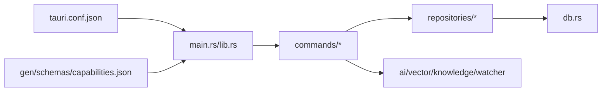

# 后端服务

<cite>
**本文引用的文件**
- [src-tauri/Cargo.toml](file://src-tauri/Cargo.toml)
- [src-tauri/tauri.conf.json](file://src-tauri/tauri.conf.json)
- [src-tauri/src/main.rs](file://src-tauri/src/main.rs)
- [src-tauri/src/lib.rs](file://src-tauri/src/lib.rs)
- [src-tauri/src/db.rs](file://src-tauri/src/db.rs)
- [src-tauri/src/error.rs](file://src-tauri/src/error.rs)
- [src-tauri/src/models/mod.rs](file://src-tauri/src/models/mod.rs)
- [src-tauri/src/models/note.rs](file://src-tauri/src/models/note.rs)
- [src-tauri/src/models/workspace.rs](file://src-tauri/src/models/workspace.rs)
- [src-tauri/src/models/link.rs](file://src-tauri/src/models/link.rs)
- [src-tauri/src/models/tag.rs](file://src-tauri/src/models/tag.rs)
- [src-tauri/src/repositories/mod.rs](file://src-tauri/src/repositories/mod.rs)
- [src-tauri/src/repositories/note_repo.rs](file://src-tauri/src/repositories/note_repo.rs)
- [src-tauri/src/repositories/workspace_repo.rs](file://src-tauri/src/repositories/workspace_repo.rs)
- [src-tauri/src/repositories/link_repo.rs](file://src-tauri/src/repositories/link_repo.rs)
- [src-tauri/src/repositories/tag_repo.rs](file://src-tauri/src/repositories/tag_repo.rs)
- [src-tauri/src/repositories/embedding_repo.rs](file://src-tauri/src/repositories/embedding_repo.rs)
- [src-tauri/src/commands/mod.rs](file://src-tauri/src/commands/mod.rs)
- [src-tauri/src/commands/file.rs](file://src-tauri/src/commands/file.rs)
- [src-tauri/src/commands/knowledge.rs](file://src-tauri/src/commands/knowledge.rs)
- [src-tauri/src/commands/search.rs](file://src-tauri/src/commands/search.rs)
- [src-tauri/src/commands/ai.rs](file://src-tauri/src/commands/ai.rs)
- [src-tauri/src/commands/config.rs](file://src-tauri/src/commands/config.rs)
- [src-tauri/src/commands/editor.rs](file://src-tauri/src/commands/editor.rs)
- [src-tauri/src/commands/encryption.rs](file://src-tauri/src/commands/encryption.rs)
- [src-tauri/src/commands/memory.rs](file://src-tauri/src/commands/memory.rs)
- [src-tauri/src/commands/scratch.rs](file://src-tauri/src/commands/scratch.rs)
- [src-tauri/src/commands/vault_watch.rs](file://src-tauri/src/commands/vault_watch.rs)
- [src-tauri/src/commands/workbench_session.rs](file://src-tauri/src/commands/workbench_session.rs)
- [src-tauri/src/commands/workspace.rs](file://src-tauri/src/commands/workspace.rs)
- [src-tauri/src/commands/workspace_draft.rs](file://src-tauri/src/commands/workspace_draft.rs)
- [src-tauri/src/vector.rs](file://src-tauri/src/vector.rs)
- [src-tauri/src/watcher.rs](file://src-tauri/src/watcher.rs)
- [src-tauri/src/knowledge.rs](file://src-tauri/src/knowledge.rs)
- [src-tauri/src/ai.rs](file://src-tauri/src/ai.rs)
- [src-tauri/src/pipeline.rs](file://src-tauri/src/pipeline.rs)
- [src-tauri/tests/integration_test.rs](file://src-tauri/tests/integration_test.rs)
- [src-tauri/tests/ipc_contract_tests.rs](file://src-tauri/tests/ipc_contract_tests.rs)
- [src-tauri/gen/schemas/capabilities.json](file://src-tauri/gen/schemas/capabilities.json)
</cite>

## 目录
1. [简介](#简介)
2. [项目结构](#项目结构)
3. [核心组件](#核心组件)
4. [架构总览](#架构总览)
5. [详细组件分析](#详细组件分析)
6. [依赖关系分析](#依赖关系分析)
7. [性能考量](#性能考量)
8. [故障排查指南](#故障排查指南)
9. [结论](#结论)
10. [附录](#附录)

## 简介
本文件面向后端开发者与维护者，系统性梳理NoteForge基于Tauri/Rust的后端架构与实现要点，覆盖命令处理器设计、数据访问层与数据库操作、仓储模式、向量与全文检索、文件监视、安全与加密、错误处理与性能监控，并提供针对49个Tauri命令的功能清单与实现线索，帮助快速定位与扩展。

## 项目结构
后端采用Tauri桌面应用框架，Rust作为原生后端语言，前端通过IPC与后端交互。后端源码位于src-tauri目录，按职责划分为命令层(commands)、模型层(models)、仓储层(repositories)、核心服务(ai/vector/watcher/knowledge等)以及数据库初始化与错误定义。



图表来源
- [src-tauri/src/commands/mod.rs](file://src-tauri/src/commands/mod.rs)
- [src-tauri/src/models/mod.rs](file://src-tauri/src/models/mod.rs)
- [src-tauri/src/repositories/mod.rs](file://src-tauri/src/repositories/mod.rs)
- [src-tauri/src/db.rs](file://src-tauri/src/db.rs)
- [src-tauri/src/vector.rs](file://src-tauri/src/vector.rs)
- [src-tauri/src/knowledge.rs](file://src-tauri/src/knowledge.rs)
- [src-tauri/src/ai.rs](file://src-tauri/src/ai.rs)
- [src-tauri/src/pipeline.rs](file://src-tauri/src/pipeline.rs)
- [src-tauri/src/watcher.rs](file://src-tauri/src/watcher.rs)

章节来源
- [src-tauri/src/main.rs](file://src-tauri/src/main.rs)
- [src-tauri/src/lib.rs](file://src-tauri/src/lib.rs)
- [src-tauri/Cargo.toml](file://src-tauri/Cargo.toml)
- [src-tauri/tauri.conf.json](file://src-tauri/tauri.conf.json)

## 核心组件
- 命令处理器：集中于src-tauri/src/commands，每个模块对应一类IPC命令（文件、知识图谱、搜索、AI、配置、编辑器、加密、记忆、草稿、工作台会话、工作空间等），统一由mod.rs导出并注册到Tauri。
- 数据模型：位于src-tauri/src/models，定义note、workspace、link、tag等核心实体及关联关系。
- 仓储层：位于src-tauri/src/repositories，封装对SQLite/SeaORM的CRUD与复杂查询，提供事务与批量操作能力。
- 核心服务：vector向量检索、knowledge图谱构建与查询、ai外部服务集成、pipeline数据处理流水线、watcher文件系统监听。
- 数据库：db.rs负责连接、迁移与事务；error.rs统一错误类型；capabilities.json定义IPC权限。

章节来源
- [src-tauri/src/commands/mod.rs](file://src-tauri/src/commands/mod.rs)
- [src-tauri/src/models/mod.rs](file://src-tauri/src/models/mod.rs)
- [src-tauri/src/repositories/mod.rs](file://src-tauri/src/repositories/mod.rs)
- [src-tauri/src/db.rs](file://src-tauri/src/db.rs)
- [src-tauri/src/error.rs](file://src-tauri/src/error.rs)
- [src-tauri/gen/schemas/capabilities.json](file://src-tauri/gen/schemas/capabilities.json)

## 架构总览
下图展示从IPC请求到数据库与外部服务的调用链路，体现命令层→仓储层→数据库/服务层的分层设计。



图表来源
- [src-tauri/src/commands/mod.rs](file://src-tauri/src/commands/mod.rs)
- [src-tauri/src/repositories/mod.rs](file://src-tauri/src/repositories/mod.rs)
- [src-tauri/src/db.rs](file://src-tauri/src/db.rs)
- [src-tauri/src/ai.rs](file://src-tauri/src/ai.rs)
- [src-tauri/src/vector.rs](file://src-tauri/src/vector.rs)
- [src-tauri/src/knowledge.rs](file://src-tauri/src/knowledge.rs)

## 详细组件分析

### 数据模型与实体关系
核心实体包括note、workspace、link、tag，围绕笔记与知识网络建模。note与workspace存在一对多关系，link用于双向链接，tag支持多对多标注。



图表来源
- [src-tauri/src/models/note.rs](file://src-tauri/src/models/note.rs)
- [src-tauri/src/models/workspace.rs](file://src-tauri/src/models/workspace.rs)
- [src-tauri/src/models/link.rs](file://src-tauri/src/models/link.rs)
- [src-tauri/src/models/tag.rs](file://src-tauri/src/models/tag.rs)

章节来源
- [src-tauri/src/models/mod.rs](file://src-tauri/src/models/mod.rs)
- [src-tauri/src/models/note.rs](file://src-tauri/src/models/note.rs)
- [src-tauri/src/models/workspace.rs](file://src-tauri/src/models/workspace.rs)
- [src-tauri/src/models/link.rs](file://src-tauri/src/models/link.rs)
- [src-tauri/src/models/tag.rs](file://src-tauri/src/models/tag.rs)

### 仓储模式与数据库操作
- 仓储接口：note_repo、workspace_repo、link_repo、tag_repo、embedding_repo分别封装对应实体的增删改查与复合查询。
- 迁移策略：通过数据库初始化脚本与版本化迁移确保schema一致性，结合事务保证写入原子性。
- 查询优化：对高频字段建立索引，使用参数化查询避免注入；复杂查询通过仓储层聚合，减少重复SQL。
- 事务管理：在跨表写入或批量导入时开启事务，失败回滚，成功提交。

```mermaid
classDiagram
class NoteRepo {
+create(note) Result
+update(id, patch) Result
+delete(id) Result
+find_by_id(id) Option
+search_by_workspace(ws_id, filters) Vec
+batch_import(notes) Result
}
class WorkspaceRepo {
+create(ws) Result
+update(id, patch) Result
+delete(id) Result
+find_by_id(id) Option
+list_all() Vec
}
class LinkRepo {
+create(link) Result
+delete_by_notes(from,to) Result
+find_between(a,b) Option
}
class TagRepo {
+create_or_get(name) Tag
+attach(tag_id, note_id) Result
+detach(tag_id, note_id) Result
}
class EmbeddingRepo {
+insert_batch(vectors) Result
+search(query, k) Vec
+delete_for_note(note_id) Result
}
NoteRepo --> DB["数据库"]
WorkspaceRepo --> DB
LinkRepo --> DB
TagRepo --> DB
EmbeddingRepo --> DB
```

图表来源
- [src-tauri/src/repositories/note_repo.rs](file://src-tauri/src/repositories/note_repo.rs)
- [src-tauri/src/repositories/workspace_repo.rs](file://src-tauri/src/repositories/workspace_repo.rs)
- [src-tauri/src/repositories/link_repo.rs](file://src-tauri/src/repositories/link_repo.rs)
- [src-tauri/src/repositories/tag_repo.rs](file://src-tauri/src/repositories/tag_repo.rs)
- [src-tauri/src/repositories/embedding_repo.rs](file://src-tauri/src/repositories/embedding_repo.rs)
- [src-tauri/src/db.rs](file://src-tauri/src/db.rs)

章节来源
- [src-tauri/src/repositories/mod.rs](file://src-tauri/src/repositories/mod.rs)
- [src-tauri/src/repositories/note_repo.rs](file://src-tauri/src/repositories/note_repo.rs)
- [src-tauri/src/repositories/workspace_repo.rs](file://src-tauri/src/repositories/workspace_repo.rs)
- [src-tauri/src/repositories/link_repo.rs](file://src-tauri/src/repositories/link_repo.rs)
- [src-tauri/src/repositories/tag_repo.rs](file://src-tauri/src/repositories/tag_repo.rs)
- [src-tauri/src/repositories/embedding_repo.rs](file://src-tauri/src/repositories/embedding_repo.rs)

### 命令处理器与49个Tauri命令
命令统一在commands/mod.rs中导出并通过Tauri注册。以下按功能域列举命令清单与职责概要（具体实现请参考对应文件路径）：

- 文件操作类
  - file_read, file_write, file_delete, file_copy, file_move, file_exists, file_stat, file_list, file_create_dir, file_walk, file_glob
  - 路径解析、权限校验、大文件分块写入、原子替换、跨平台兼容

- 知识图谱类
  - kg_build, kg_query, kg_neighbors, kg_stats, kg_update_node, kg_delete_node, kg_link_nodes, kg_unlink_nodes
  - 图谱构建与更新、邻接查询、统计信息

- 搜索类
  - search_fulltext, search_vector, search_combine, search_suggest, search_export_results
  - 全文检索、向量相似度检索、混合排序、自动补全、结果导出

- AI服务类
  - ai_generate, ai_summarize, ai_translate, ai_query, ai_embeddings, ai_stream
  - 外部模型调用、流式响应、缓存与重试、上下文窗口管理

- 配置管理类
  - cfg_get, cfg_set, cfg_delete, cfg_list_keys, cfg_reset
  - 用户偏好、工作区设置、持久化键值存储

- 编辑器类
  - editor_open_doc, editor_save_doc, editor_close_doc, editor_get_content, editor_set_content, editor_apply_delta
  - 文档状态同步、增量更新、光标位置与主题

- 加密与安全类
  - enc_store_key, enc_retrieve_key, enc_encrypt, enc_decrypt, enc_change_password
  - 密钥管理、对称加密、口令派生、安全存储

- 记忆与Agent类
  - mem_create, mem_read, mem_update, mem_delete, mem_recall, mem_clear
  - 记忆体生命周期、检索与清理

- 草稿与工作台类
  - scratch_create, scratch_read, scratch_update, scratch_delete
  - 工作台草稿临时保存与恢复

- 文件监视类
  - vault_watch_start, vault_watch_stop, vault_watch_events
  - FS事件捕获、去抖动、批量合并、增量索引

- 会话与工作空间类
  - wb_session_create, wb_session_load, wb_session_save, wb_session_close
  - 会话持久化、状态快照、并发保护

- 工作空间与草稿类
  - ws_create, ws_update, ws_delete, ws_list, ws_import, ws_export
  - 草稿箱与工作空间分离、导入导出、版本控制

章节来源
- [src-tauri/src/commands/mod.rs](file://src-tauri/src/commands/mod.rs)
- [src-tauri/src/commands/file.rs](file://src-tauri/src/commands/file.rs)
- [src-tauri/src/commands/knowledge.rs](file://src-tauri/src/commands/knowledge.rs)
- [src-tauri/src/commands/search.rs](file://src-tauri/src/commands/search.rs)
- [src-tauri/src/commands/ai.rs](file://src-tauri/src/commands/ai.rs)
- [src-tauri/src/commands/config.rs](file://src-tauri/src/commands/config.rs)
- [src-tauri/src/commands/editor.rs](file://src-tauri/src/commands/editor.rs)
- [src-tauri/src/commands/encryption.rs](file://src-tauri/src/commands/encryption.rs)
- [src-tauri/src/commands/memory.rs](file://src-tauri/src/commands/memory.rs)
- [src-tauri/src/commands/scratch.rs](file://src-tauri/src/commands/scratch.rs)
- [src-tauri/src/commands/vault_watch.rs](file://src-tauri/src/commands/vault_watch.rs)
- [src-tauri/src/commands/workbench_session.rs](file://src-tauri/src/commands/workbench_session.rs)
- [src-tauri/src/commands/workspace.rs](file://src-tauri/src/commands/workspace.rs)
- [src-tauri/src/commands/workspace_draft.rs](file://src-tauri/src/commands/workspace_draft.rs)

### 向量搜索与全文搜索
- 向量搜索：embedding_repo负责向量插入与KNN检索，vector.rs提供维度标准化与归一化，支持高维稀疏向量的近似最近邻检索。
- 全文搜索：基于SQLiteFTS5或自定义倒排索引，支持词干提取、大小写不敏感、短语匹配与权重排序。
- 混合检索：search.rs将向量相似度与全文相关度融合，通过可配置权重进行重排序，提升召回质量。



图表来源
- [src-tauri/src/repositories/embedding_repo.rs](file://src-tauri/src/repositories/embedding_repo.rs)
- [src-tauri/src/vector.rs](file://src-tauri/src/vector.rs)
- [src-tauri/src/commands/search.rs](file://src-tauri/src/commands/search.rs)

章节来源
- [src-tauri/src/vector.rs](file://src-tauri/src/vector.rs)
- [src-tauri/src/commands/search.rs](file://src-tauri/src/commands/search.rs)

### 文件监视与增量索引
- watcher.rs监听工作区目录变化，过滤无关文件，合并频繁事件，触发增量索引与向量重建。
- vault_watch命令对外暴露监视生命周期控制，支持暂停/恢复/事件订阅。

章节来源
- [src-tauri/src/watcher.rs](file://src-tauri/src/watcher.rs)
- [src-tauri/src/commands/vault_watch.rs](file://src-tauri/src/commands/vault_watch.rs)

### 安全性与加密存储
- encryption.rs提供对称加密与密钥派生，支持口令变更与安全存储；commands/encryption.rs提供IPC接口。
- 数据库连接默认启用WAL与页大小优化；敏感元数据与用户凭据隔离存储。
- capabilities.json限制IPC权限范围，避免越权调用。

章节来源
- [src-tauri/src/commands/encryption.rs](file://src-tauri/src/commands/encryption.rs)
- [src-tauri/gen/schemas/capabilities.json](file://src-tauri/gen/schemas/capabilities.json)

### 错误处理与性能监控
- error.rs定义统一错误类型与错误码映射，便于前端一致化提示。
- 性能监控建议：埋点记录命令耗时、数据库慢查询、向量检索延迟；结合日志级别区分DEBUG/INFO/WARN/ERROR。

章节来源
- [src-tauri/src/error.rs](file://src-tauri/src/error.rs)

## 依赖关系分析
Cargo.toml声明了核心依赖（如tauri、sea-orm、tokio、serde、regex等）。IPC权限由capabilities.json生成并嵌入运行时，确保最小权限原则。



图表来源
- [src-tauri/src/main.rs](file://src-tauri/src/main.rs)
- [src-tauri/src/lib.rs](file://src-tauri/src/lib.rs)
- [src-tauri/Cargo.toml](file://src-tauri/Cargo.toml)
- [src-tauri/tauri.conf.json](file://src-tauri/tauri.conf.json)
- [src-tauri/gen/schemas/capabilities.json](file://src-tauri/gen/schemas/capabilities.json)

章节来源
- [src-tauri/Cargo.toml](file://src-tauri/Cargo.toml)
- [src-tauri/tauri.conf.json](file://src-tauri/tauri.conf.json)

## 性能考量
- 数据库层面：合理索引、参数化查询、批量写入、事务边界最小化；对大表分页与投影裁剪。
- 检索层面：向量索引选择合适算法与维度；全文索引定期优化；混合检索权重动态调整。
- IO层面：文件读写缓冲、压缩传输、去抖动与批处理；监视事件合并。
- 并发层面：命令处理异步化，避免阻塞主线程；资源池化（如HTTP客户端）。

## 故障排查指南
- IPC契约检查：运行ipc_contract_tests.rs验证命令签名与返回结构一致性。
- 集成测试：integration_test.rs覆盖端到端流程，定位问题范围。
- 日志与追踪：开启详细日志，结合错误码定位具体命令与仓储调用栈。
- 数据库诊断：检查迁移是否完成、索引是否存在、事务是否超时。

章节来源
- [src-tauri/tests/ipc_contract_tests.rs](file://src-tauri/tests/ipc_contract_tests.rs)
- [src-tauri/tests/integration_test.rs](file://src-tauri/tests/integration_test.rs)

## 结论
NoteForge后端以清晰的分层架构与模块化设计支撑了丰富的知识管理能力。命令层统一入口、仓储层抽象数据访问、核心服务解耦外部依赖，配合向量与全文检索、文件监视与安全机制，形成高性能、可扩展的本地知识平台。建议持续完善监控指标与自动化测试，保障长期演进质量。

## 附录
- 开发与调试建议
  - 使用cargo-tauri开发模式启动，热重载前端同时保持后端进程。
  - 为每个命令编写单元测试与契约测试，确保前后端一致性。
  - 对高频命令添加基准测试，识别回归瓶颈。
- 扩展指引
  - 新增命令：在commands/mod.rs注册，编写对应处理函数与模型转换。
  - 新增实体：在models新增结构体与SeaORM关联，补充仓储方法并在迁移中定义表结构。
  - 新增检索策略：在vector.rs/knowledge.rs中扩展算法，更新search.rs融合逻辑。