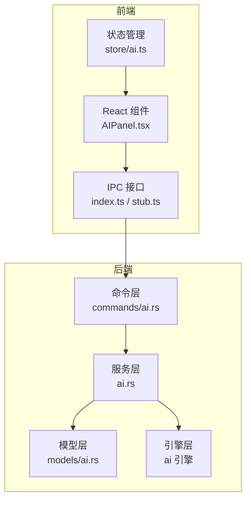
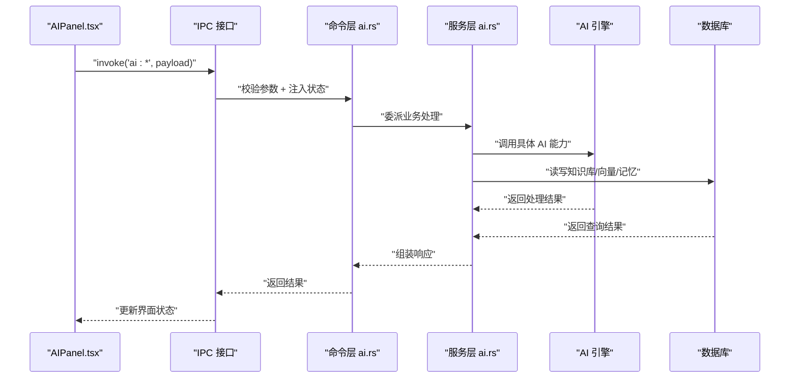
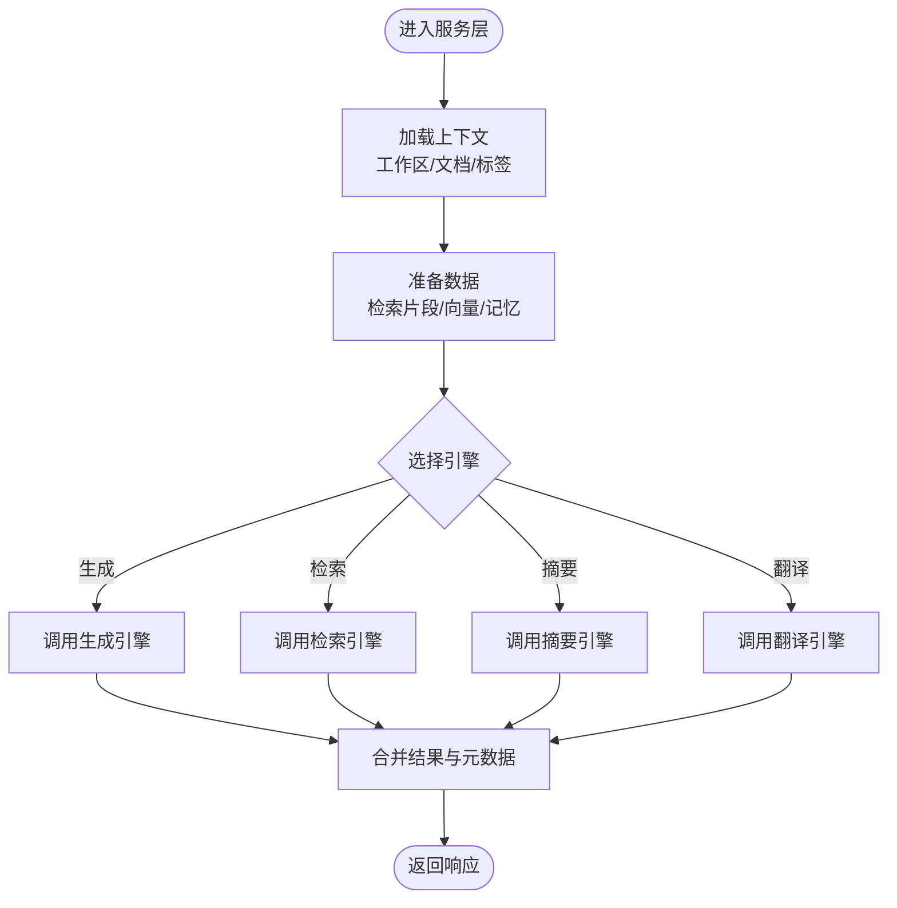
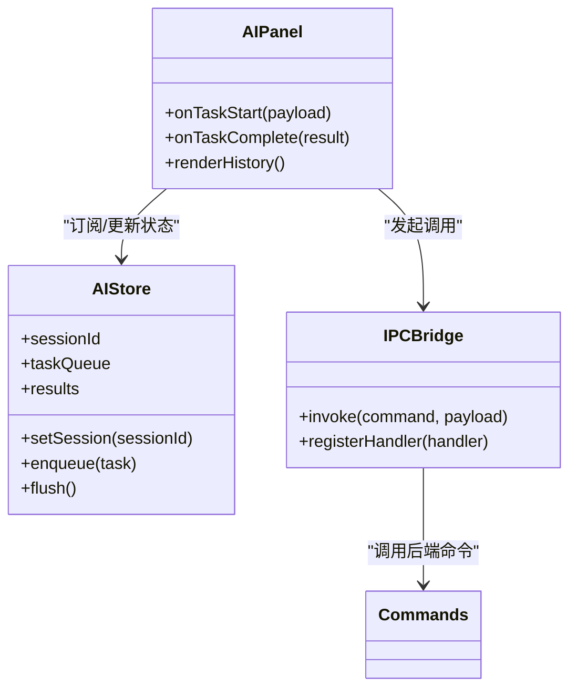
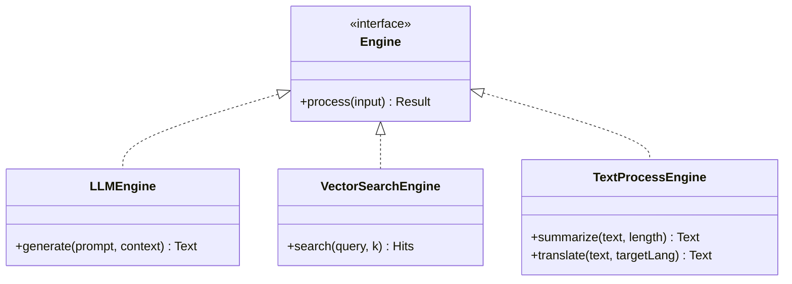
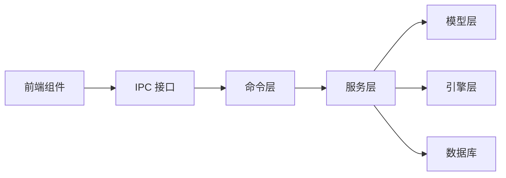

# AI服务命令

<cite>
**本文档引用的文件**
- [src-tauri/src/commands/ai.rs](file://src-tauri/src/commands/ai.rs)
- [src-tauri/src/models/ai.rs](file://src-tauri/src/models/ai.rs)
- [src-tauri/src/ai.rs](file://src-tauri/src/ai.rs)
- [src-tauri/src/lib.rs](file://src-tauri/src/lib.rs)
- [src-tauri/src/main.rs](file://src-tauri/src/main.rs)
- [src-tauri/Cargo.toml](file://src-tauri/Cargo.toml)
- [src/ipc/index.ts](file://src/ipc/index.ts)
- [src/ipc/stub.ts](file://src/ipc/stub.ts)
- [src/features/ai/AIPanel.tsx](file://src/features/ai/AIPanel.tsx)
- [src/store/ai.ts](file://src/store/ai.ts)
- [src-tauri/tests/dataflow_tests.rs](file://src-tauri/tests/dataflow_tests.rs)
</cite>

## 目录
1. [简介](#简介)
2. [项目结构](#项目结构)
3. [核心组件](#核心组件)
4. [架构概览](#架构概览)
5. [详细组件分析](#详细组件分析)
6. [依赖关系分析](#依赖关系分析)
7. [性能考虑](#性能考虑)
8. [故障排除指南](#故障排除指南)
9. [结论](#结论)
10. [附录](#附录)

## 简介
本文件系统性梳理 Noteforge 中的 AI 服务命令实现，覆盖内容生成、智能搜索、文本摘要、翻译等核心能力。文档从架构设计、命令实现、数据模型、前端集成到性能优化进行全面解析，并提供最佳实践与扩展建议。

## 项目结构
AI 功能采用前后端分离的 Tauri 架构：前端通过 IPC 调用后端命令；后端命令层负责参数校验与状态注入，实际业务逻辑由服务层编排；模型层统一前后端契约；引擎层封装具体 AI 能力。

**图表来源**
- [src-tauri/src/commands/ai.rs](file://src-tauri/src/commands/ai.rs)
- [src-tauri/src/ai.rs](file://src-tauri/src/ai.rs)
- [src-tauri/src/models/ai.rs](file://src-tauri/src/models/ai.rs)
- [src-tauri/src/main.rs](file://src-tauri/src/main.rs)
- [src/ipc/index.ts](file://src/ipc/index.ts)
- [src/features/ai/AIPanel.tsx](file://src/features/ai/AIPanel.tsx)

**章节来源**
- [src-tauri/src/lib.rs](file://src-tauri/src/lib.rs)
- [src-tauri/src/main.rs](file://src-tauri/src/main.rs)
- [src-tauri/src/commands/ai.rs](file://src-tauri/src/commands/ai.rs)
- [src-tauri/src/ai.rs](file://src-tauri/src/ai.rs)
- [src-tauri/src/models/ai.rs](file://src-tauri/src/models/ai.rs)

## 核心组件
- 命令层（commands/ai.rs）：薄层职责，执行参数校验与状态注入，随后委派给服务层。
- 服务层（ai.rs）：编排 AI 引擎与数据库交互，实现内容生成、RAG 检索、文本处理等业务流程。
- 模型层（models/ai.rs）：定义前后端共享的数据传输对象（DTO），确保契约一致性。
- 引擎层：封装具体 AI 能力（如 LLM、向量检索、嵌入等），支持可替换实现。
- 前端集成：AIPanel.tsx 提供用户界面，store/ai.ts 管理会话与状态，index.ts/stub.ts 提供 IPC 调用接口。

**章节来源**
- [src-tauri/src/commands/ai.rs](file://src-tauri/src/commands/ai.rs)
- [src-tauri/src/ai.rs](file://src-tauri/src/ai.rs)
- [src-tauri/src/models/ai.rs](file://src-tauri/src/models/ai.rs)
- [src/features/ai/AIPanel.tsx](file://src/features/ai/AIPanel.tsx)
- [src/store/ai.ts](file://src/store/ai.ts)
- [src/ipc/index.ts](file://src/ipc/index.ts)
- [src/ipc/stub.ts](file://src/ipc/stub.ts)

## 架构概览
下图展示从前端到后端的完整调用链路与数据流向：

**图表来源**
- [src-tauri/src/commands/ai.rs](file://src-tauri/src/commands/ai.rs)
- [src-tauri/src/ai.rs](file://src-tauri/src/ai.rs)
- [src-tauri/src/models/ai.rs](file://src-tauri/src/models/ai.rs)
- [src/features/ai/AIPanel.tsx](file://src/features/ai/AIPanel.tsx)
- [src/store/ai.ts](file://src/store/ai.ts)
- [src/ipc/index.ts](file://src/ipc/index.ts)

## 详细组件分析

### 命令层：AI 命令定义与参数校验
命令层作为薄层，承担以下职责：
- 参数校验：确保输入字段类型、长度、格式符合预期。
- 状态注入：根据上下文注入工作区、当前文档等运行时信息。
- 错误传播：将底层异常转换为统一的错误格式返回前端。

典型命令包括：
- 内容生成：接收提示词、上下文、输出格式等参数，调用服务层进行生成。
- 智能搜索：接收查询文本与过滤条件，返回相关片段与来源。
- 文本摘要：接收长文本与摘要长度约束，返回压缩后的摘要。
- 翻译：接收原文、目标语言与风格偏好，返回翻译结果。

参数定义与响应结构在模型层统一约定，保证前后端契约一致。

**章节来源**
- [src-tauri/src/commands/ai.rs](file://src-tauri/src/commands/ai.rs)
- [src-tauri/src/models/ai.rs](file://src-tauri/src/models/ai.rs)

### 服务层：业务编排与数据处理
服务层负责：
- 选择与配置 AI 引擎：根据任务类型与配置选择合适的模型与参数。
- 数据准备：从数据库加载相关文档、向量索引与记忆片段。
- 调用引擎：执行生成、检索、摘要或翻译等操作。
- 结果整合：将引擎输出与元数据（如来源、置信度）组合成最终响应。
- 并发控制：限制同时进行的任务数量，避免资源争用。

**图表来源**
- [src-tauri/src/ai.rs](file://src-tauri/src/ai.rs)
- [src-tauri/src/models/ai.rs](file://src-tauri/src/models/ai.rs)

**章节来源**
- [src-tauri/src/ai.rs](file://src-tauri/src/ai.rs)

### 模型层：数据契约与序列化
模型层定义了所有 AI 相关的 DTO，包括：
- 请求体：如生成请求、搜索请求、摘要请求、翻译请求及其字段约束。
- 响应体：如生成结果、搜索命中、摘要文本、翻译版本及来源信息。
- 元数据：如置信度、来源 ID、片段位置、耗时统计等。

这些模型确保前后端契约一致，减少手写补丁与类型不匹配问题。

**章节来源**
- [src-tauri/src/models/ai.rs](file://src-tauri/src/models/ai.rs)

### 前端集成：UI、状态与 IPC
- AIPanel.tsx：提供 AI 功能的用户界面，支持切换不同任务模式与查看历史记录。
- store/ai.ts：集中管理会话状态、当前任务队列与结果缓存。
- IPC 接口：index.ts 定义 invoke 方法，stub.ts 提供浏览器环境下的桩实现，便于开发调试。

**图表来源**
- [src/features/ai/AIPanel.tsx](file://src/features/ai/AIPanel.tsx)
- [src/store/ai.ts](file://src/store/ai.ts)
- [src/ipc/index.ts](file://src/ipc/index.ts)
- [src/ipc/stub.ts](file://src/ipc/stub.ts)

**章节来源**
- [src/features/ai/AIPanel.tsx](file://src/features/ai/AIPanel.tsx)
- [src/store/ai.ts](file://src/store/ai.ts)
- [src/ipc/index.ts](file://src/ipc/index.ts)
- [src/ipc/stub.ts](file://src/ipc/stub.ts)

### 引擎层：AI 能力与可替换实现
引擎层封装具体 AI 能力，支持多种实现：
- LLM 引擎：用于内容生成与对话。
- 向量检索引擎：基于嵌入向量的语义搜索。
- 文本处理引擎：用于摘要与翻译。
- 可替换性：通过抽象接口支持不同供应商或本地模型。

**图表来源**
- [src-tauri/src/ai.rs](file://src-tauri/src/ai.rs)

**章节来源**
- [src-tauri/src/ai.rs](file://src-tauri/src/ai.rs)

## 依赖关系分析
- 命令层依赖服务层与模型层，不直接访问数据库或引擎。
- 服务层依赖模型层与引擎层，可能间接访问数据库。
- 前端通过 IPC 与命令层交互，不直接依赖后端业务逻辑。
- Cargo.toml 定义了后端依赖与构建配置，确保引擎与工具链可用。

**图表来源**
- [src-tauri/src/commands/ai.rs](file://src-tauri/src/commands/ai.rs)
- [src-tauri/src/ai.rs](file://src-tauri/src/ai.rs)
- [src-tauri/src/models/ai.rs](file://src-tauri/src/models/ai.rs)
- [src-tauri/Cargo.toml](file://src-tauri/Cargo.toml)

**章节来源**
- [src-tauri/src/commands/ai.rs](file://src-tauri/src/commands/ai.rs)
- [src-tauri/src/ai.rs](file://src-tauri/src/ai.rs)
- [src-tauri/src/models/ai.rs](file://src-tauri/src/models/ai.rs)
- [src-tauri/Cargo.toml](file://src-tauri/Cargo.toml)

## 性能考虑
- 并发控制：服务层限制同时进行的任务数量，避免内存与计算资源过载。
- 缓存策略：对常用查询与生成结果进行短期缓存，减少重复计算。
- 分页与截断：对长文档与大量检索结果进行分页与长度截断，提升响应速度。
- 异步处理：将耗时操作异步化，避免阻塞 UI 线程。
- 资源复用：重用连接池与向量索引，降低初始化开销。
- 成本控制：通过参数限制（如最大输出长度、召回数量）与配额管理控制 API 调用成本。

[本节为通用性能指导，无需特定文件引用]

## 故障排除指南
- 参数校验失败：检查前端传参是否符合模型层约束，确认必填字段与类型正确。
- 引擎调用异常：查看服务层日志，确认引擎配置与可用性；必要时降级到备用引擎。
- 数据库访问错误：检查连接字符串与迁移脚本，确保表结构与索引存在。
- IPC 调用超时：增加超时阈值或拆分大任务，避免一次性传输过多数据。
- 前端无响应：确认 IPC 桥接已正确注册，命令名称与负载格式一致。

**章节来源**
- [src-tauri/src/commands/ai.rs](file://src-tauri/src/commands/ai.rs)
- [src-tauri/src/ai.rs](file://src-tauri/src/ai.rs)
- [src-tauri/tests/dataflow_tests.rs](file://src-tauri/tests/dataflow_tests.rs)

## 结论
本文件系统性梳理了 Noteforge 的 AI 服务命令实现，明确了命令层、服务层、模型层与引擎层的职责边界与协作关系。通过统一的数据契约、严格的参数校验与合理的并发控制，实现了可维护、可扩展且高性能的 AI 能力集成。建议在生产环境中结合监控指标持续优化资源利用率与用户体验。

[本节为总结性内容，无需特定文件引用]

## 附录

### 命令与参数参考（基于模型层定义）
- 内容生成
  - 命令：ai:generate
  - 输入：提示词、上下文、输出格式、长度限制
  - 输出：生成文本、来源元数据
- 智能搜索
  - 命令：ai:search
  - 输入：查询文本、过滤条件、返回数量
  - 输出：命中片段列表、置信度、来源
- 文本摘要
  - 命令：ai:summarize
  - 输入：原文、目标长度、风格偏好
  - 输出：摘要文本、处理耗时
- 翻译
  - 命令：ai:translate
  - 输入：原文、目标语言、风格偏好
  - 输出：翻译结果、语言检测

**章节来源**
- [src-tauri/src/models/ai.rs](file://src-tauri/src/models/ai.rs)

### 使用场景示例
- 场景一：在编辑器中选中文本后触发“AI 精炼”，自动对比原文与生成差异，回填到文档。
- 场景二：在知识库中进行语义搜索，返回相关笔记与片段，支持一键插入到编辑器。
- 场景三：对长文档进行自动摘要，生成可读性强的简述，辅助快速浏览。
- 场景四：将技术文档翻译为目标语言，保持术语一致性与专业风格。

**章节来源**
- [src-tauri/tests/dataflow_tests.rs](file://src-tauri/tests/dataflow_tests.rs)
- [src/features/ai/AIPanel.tsx](file://src/features/ai/AIPanel.tsx)