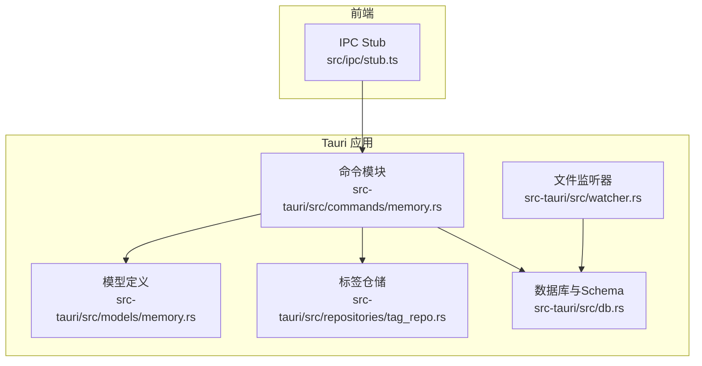
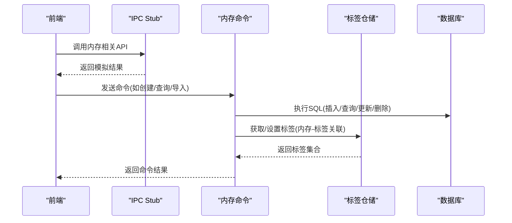
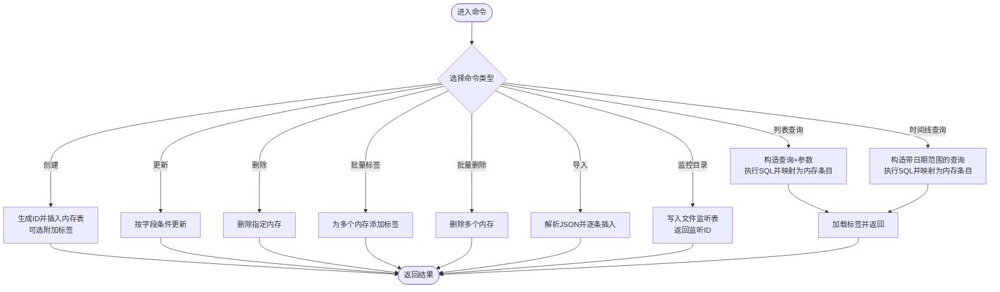
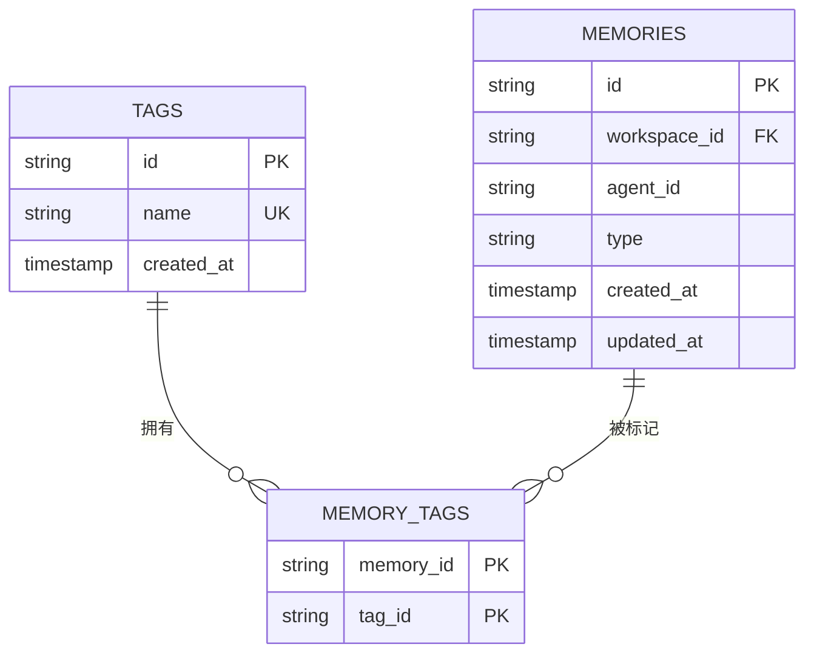
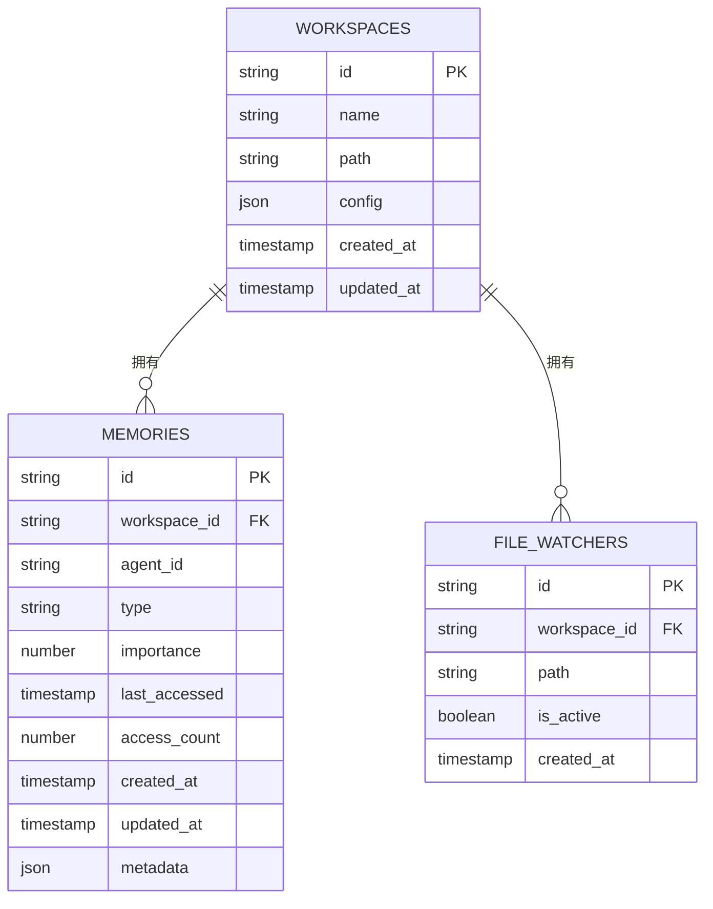
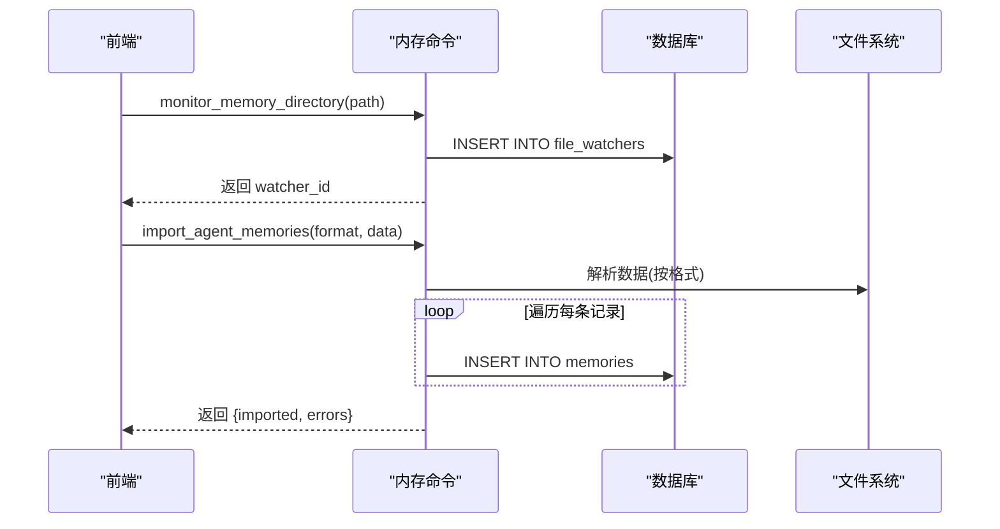
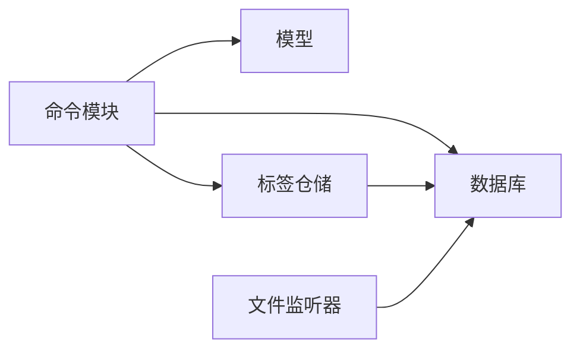

# 内存管理命令

<cite>
**本文引用的文件**
- [src-tauri/src/commands/memory.rs](file://src-tauri/src/commands/memory.rs)
- [src-tauri/src/models/memory.rs](file://src-tauri/src/models/memory.rs)
- [src-tauri/src/repositories/tag_repo.rs](file://src-tauri/src/repositories/tag_repo.rs)
- [src-tauri/src/db.rs](file://src-tauri/src/db.rs)
- [src-tauri/src/watcher.rs](file://src-tauri/src/watcher.rs)
- [src-tauri/Cargo.toml](file://src-tauri/Cargo.toml)
- [src-tauri/src/lib.rs](file://src-tauri/src/lib.rs)
- [src/ipc/stub.ts](file://src/ipc/stub.ts)
</cite>

## 目录
1. [简介](#简介)
2. [项目结构](#项目结构)
3. [核心组件](#核心组件)
4. [架构总览](#架构总览)
5. [详细组件分析](#详细组件分析)
6. [依赖关系分析](#依赖关系分析)
7. [性能考量](#性能考量)
8. [故障排查指南](#故障排查指南)
9. [结论](#结论)
10. [附录：最佳实践与调优建议](#附录最佳实践与调优建议)

## 简介
本文件系统性梳理了项目中的“内存管理命令”实现，聚焦于基于 Tauri 的 Rust 后端如何通过命令接口完成内存（记忆）数据的创建、查询、更新、删除、批量标签与导入等操作，并结合数据库层、标签关联表与文件监听能力，形成完整的内存生命周期管理闭环。文档同时覆盖内存池与对象生命周期的工程化实践、资源限制与异常处理策略、性能监控与优化建议，以及可复用的调试与调优方法。

## 项目结构
围绕“内存管理命令”的关键文件组织如下：
- 命令层：定义并实现所有内存相关的 Tauri 命令函数
- 模型层：定义请求/响应与内存条目数据结构
- 仓储层：封装标签与内存之间的多对多关联
- 数据库层：初始化 SQLite 表结构与索引，提供连接状态
- 文件监听：支持目录级内存导入与变更感知
- 前端 IPC Stub：用于演示与测试的内存 CRUD 行为（非生产路径）

图表来源
- [src-tauri/src/commands/memory.rs:1-337](file://src-tauri/src/commands/memory.rs#L1-L337)
- [src-tauri/src/models/memory.rs:1-107](file://src-tauri/src/models/memory.rs#L1-L107)
- [src-tauri/src/repositories/tag_repo.rs:1-121](file://src-tauri/src/repositories/tag_repo.rs#L1-L121)
- [src-tauri/src/db.rs:1-184](file://src-tauri/src/db.rs#L1-L184)
- [src-tauri/src/watcher.rs:116-128](file://src-tauri/src/watcher.rs#L116-L128)
- [src/ipc/stub.ts:680-817](file://src/ipc/stub.ts#L680-L817)

章节来源
- [src-tauri/src/commands/memory.rs:1-337](file://src-tauri/src/commands/memory.rs#L1-L337)
- [src-tauri/src/models/memory.rs:1-107](file://src-tauri/src/models/memory.rs#L1-L107)
- [src-tauri/src/repositories/tag_repo.rs:1-121](file://src-tauri/src/repositories/tag_repo.rs#L1-L121)
- [src-tauri/src/db.rs:1-184](file://src-tauri/src/db.rs#L1-L184)
- [src-tauri/src/watcher.rs:116-128](file://src-tauri/src/watcher.rs#L116-L128)
- [src/ipc/stub.ts:680-817](file://src/ipc/stub.ts#L680-L817)

## 核心组件
- 内存命令模块：提供目录监控、列表查询、时间线查询、创建、更新、删除、批量标签、批量删除、导入等命令
- 内存模型：统一请求/响应与内存条目结构
- 标签仓储：维护标签与内存的多对多关系
- 数据库与 Schema：定义内存表、索引、外键约束与文件监听表
- 文件监听：支持目录级事件捕获，配合导入流程
- 前端 IPC Stub：演示内存 CRUD 行为（仅用于开发与测试）

章节来源
- [src-tauri/src/commands/memory.rs:12-337](file://src-tauri/src/commands/memory.rs#L12-L337)
- [src-tauri/src/models/memory.rs:3-107](file://src-tauri/src/models/memory.rs#L3-L107)
- [src-tauri/src/repositories/tag_repo.rs:5-121](file://src-tauri/src/repositories/tag_repo.rs#L5-L121)
- [src-tauri/src/db.rs:47-168](file://src-tauri/src/db.rs#L47-L168)
- [src-tauri/src/watcher.rs:116-128](file://src-tauri/src/watcher.rs#L116-L128)
- [src/ipc/stub.ts:697-817](file://src/ipc/stub.ts#L697-L817)

## 架构总览
下图展示从前端到后端命令、仓储与数据库的整体交互路径，以及文件监听在导入流程中的作用。

图表来源
- [src-tauri/src/commands/memory.rs:28-337](file://src-tauri/src/commands/memory.rs#L28-L337)
- [src-tauri/src/repositories/tag_repo.rs:77-86](file://src-tauri/src/repositories/tag_repo.rs#L77-L86)
- [src-tauri/src/db.rs:17-168](file://src-tauri/src/db.rs#L17-L168)
- [src/ipc/stub.ts:697-817](file://src/ipc/stub.ts#L697-L817)

## 详细组件分析

### 命令层：内存管理命令
- 目录监控：向文件监听表写入一条监听记录，返回监听 ID
- 列表查询：按代理 ID 与类型过滤，支持分页式排序
- 时间线查询：按时间范围筛选，支持开始/结束日期
- 创建：生成唯一 ID，写入内存表，可选附加标签
- 更新：支持内容、标题、元数据的增量更新
- 删除：单条删除
- 批量标签：为多个内存附加标签
- 批量删除：删除多个内存
- 导入：支持 JSON 格式批量导入，逐条插入并统计错误

图表来源
- [src-tauri/src/commands/memory.rs:12-337](file://src-tauri/src/commands/memory.rs#L12-L337)

章节来源
- [src-tauri/src/commands/memory.rs:12-337](file://src-tauri/src/commands/memory.rs#L12-L337)

### 模型层：数据契约
- 内存条目：包含标识、代理 ID、内容、标题、类型、重要度、访问计数、时间戳与可选元数据与标签
- 请求/响应：涵盖创建、更新、删除、批量标签、批量删除、列表查询、时间线查询、目录监控、导入等

```mermaid
classDiagram
class MemoryEntry {
+string id
+string agent_id
+string content
+string? title
+string type
+number importance
+string? last_accessed
+number access_count
+string created_at
+string updated_at
+json? metadata
+string[] tags
}
class CreateMemoryRequest {
+string workspace_id
+string agent_id
+string content
+string? title
+string type
+string[]? tags
+json? metadata
}
class UpdateMemoryRequest {
+string memory_id
+string? content
+string? title
+json? metadata
}
class DeleteMemoryRequest {
+string memory_id
}
class BatchTagMemoriesRequest {
+string[] memory_ids
+string[] tags
}
class BatchDeleteMemoriesRequest {
+string[] memory_ids
}
class ListAgentMemoriesRequest {
+string agent_id
+string? type
}
class GetMemoryTimelineRequest {
+string agent_id
+string? start_date
+string? end_date
}
class MonitorMemoryDirectoryRequest {
+string agent_id
+string path
}
class ImportAgentMemoriesRequest {
+string workspace_id
+string agent_id
+string format
+string data
}
class ImportAgentMemoriesResponse {
+number imported
+string[] errors
}
class Agent {
+string id
+string name
+string type
+number memory_count
+string? color
}
```

图表来源
- [src-tauri/src/models/memory.rs:3-107](file://src-tauri/src/models/memory.rs#L3-L107)

章节来源
- [src-tauri/src/models/memory.rs:3-107](file://src-tauri/src/models/memory.rs#L3-L107)

### 仓储层：标签管理
- 提供标签的创建/查找、与内存/笔记的关联与解绑、按内存查询标签集合等能力
- 关系表采用主键约束保证唯一性，配合外键级联删除确保一致性

图表来源
- [src-tauri/src/repositories/tag_repo.rs:77-86](file://src-tauri/src/repositories/tag_repo.rs#L77-L86)
- [src-tauri/src/db.rs:68-88](file://src-tauri/src/db.rs#L68-L88)

章节来源
- [src-tauri/src/repositories/tag_repo.rs:5-121](file://src-tauri/src/repositories/tag_repo.rs#L5-L121)
- [src-tauri/src/db.rs:68-88](file://src-tauri/src/db.rs#L68-L88)

### 数据库层：Schema 与索引
- 内存表：包含工作区外键、代理 ID、类型枚举、重要度、访问计数与时间戳、JSON 元数据
- 标签与关联表：内存-标签多对多，支持按内存查询标签
- 索引：按工作区、代理、类型、重要度排序建立索引，提升查询性能
- 文件监听表：记录目录监控任务，支持启用/禁用与时间戳

图表来源
- [src-tauri/src/db.rs:21-168](file://src-tauri/src/db.rs#L21-L168)

章节来源
- [src-tauri/src/db.rs:18-168](file://src-tauri/src/db.rs#L18-L168)

### 文件监听与导入流程
- 目录监控：命令层写入文件监听表，返回监听 ID；监听器负责捕获文件事件
- 导入流程：前端触发导入命令，后端解析数据并逐条插入内存表，统计成功/失败数量

图表来源
- [src-tauri/src/commands/memory.rs:12-26](file://src-tauri/src/commands/memory.rs#L12-L26)
- [src-tauri/src/commands/memory.rs:299-336](file://src-tauri/src/commands/memory.rs#L299-L336)
- [src-tauri/src/db.rs:127-134](file://src-tauri/src/db.rs#L127-L134)
- [src-tauri/src/watcher.rs:116-128](file://src-tauri/src/watcher.rs#L116-L128)

章节来源
- [src-tauri/src/commands/memory.rs:12-26](file://src-tauri/src/commands/memory.rs#L12-L26)
- [src-tauri/src/commands/memory.rs:299-336](file://src-tauri/src/commands/memory.rs#L299-L336)
- [src-tauri/src/db.rs:127-134](file://src-tauri/src/db.rs#L127-L134)
- [src-tauri/src/watcher.rs:116-128](file://src-tauri/src/watcher.rs#L116-L128)

## 依赖关系分析
- 命令模块依赖模型、仓储与数据库状态
- 仓储依赖 rusqlite 连接与标签表结构
- 数据库初始化依赖 SQLite 连接与 schema 定义
- 文件监听器与命令模块共同支撑目录监控与导入

图表来源
- [src-tauri/src/commands/memory.rs:1-10](file://src-tauri/src/commands/memory.rs#L1-L10)
- [src-tauri/src/repositories/tag_repo.rs:1-3](file://src-tauri/src/repositories/tag_repo.rs#L1-L3)
- [src-tauri/src/db.rs:1-9](file://src-tauri/src/db.rs#L1-L9)
- [src-tauri/src/watcher.rs:116-128](file://src-tauri/src/watcher.rs#L116-L128)

章节来源
- [src-tauri/src/commands/memory.rs:1-10](file://src-tauri/src/commands/memory.rs#L1-L10)
- [src-tauri/src/repositories/tag_repo.rs:1-3](file://src-tauri/src/repositories/tag_repo.rs#L1-L3)
- [src-tauri/src/db.rs:1-9](file://src-tauri/src/db.rs#L1-L9)
- [src-tauri/src/watcher.rs:116-128](file://src-tauri/src/watcher.rs#L116-L128)

## 性能考量
- 查询性能
  - 使用索引：按工作区、代理、类型、重要度建立索引，减少全表扫描
  - 参数化查询：避免字符串拼接，降低 SQL 注入风险并提升缓存命中
  - 分页与排序：列表与时间线查询按时间倒序，避免大结果集全量传输
- 写入性能
  - 批量导入：逐条插入时尽量减少事务边界外的往返，必要时考虑批处理
  - 标签关联：批量标签时先获取或创建标签 ID，再一次性插入关联表
- 内存占用
  - 结果集映射：按需映射列，避免不必要的中间结构
  - JSON 元数据：仅在需要时进行序列化/反序列化
- 并发与锁
  - 数据库连接使用互斥锁保护，避免并发写冲突；长查询应尽量短路或异步化
- 外部依赖
  - SQLite 与 rusqlite：注意现代 SQLite 特性与绑定版本匹配
  - notify：文件监听的事件处理应避免阻塞主线程

[本节为通用性能指导，不直接分析具体文件]

## 故障排查指南
- 常见错误类型
  - 输入校验：JSON 解析失败、格式不支持、必填字段缺失
  - 数据一致性：外键约束导致插入失败、重复标签名
  - 并发问题：数据库锁等待、竞态条件
- 排查步骤
  - 检查命令输入参数与模型定义是否一致
  - 查看数据库日志与错误码，定位失败语句
  - 对批量操作进行小规模验证，逐步扩大样本
  - 监控文件监听器状态与目录权限
- 异常处理
  - 统一错误类型包装，区分无效输入与内部错误
  - 导入流程中记录失败项，便于重试与审计

章节来源
- [src-tauri/src/commands/memory.rs:307-333](file://src-tauri/src/commands/memory.rs#L307-L333)
- [src-tauri/src/db.rs:18-168](file://src-tauri/src/db.rs#L18-L168)

## 结论
该内存管理命令体系以清晰的命令-模型-仓储-数据库分层实现，覆盖了内存的全生命周期管理，并通过标签关联与目录监控扩展了可组合能力。通过合理的索引设计、参数化查询与批量处理策略，可在保证一致性的同时获得良好的性能表现。建议在生产环境中进一步完善事务控制、错误恢复与可观测性指标，以支撑更大规模的数据与更高的并发需求。

## 附录：最佳实践与调优建议
- 内存池与对象生命周期
  - 将数据库连接作为应用级状态管理，避免频繁打开/关闭
  - 在命令入口处统一获取连接与事务边界，减少锁竞争
  - 对热点查询结果进行轻量缓存（如标签名称到 ID 的映射）
- 资源限制
  - 控制单次批量导入的记录数，避免长时间持有数据库锁
  - 设置文件监听器的事件队列上限，防止事件堆积
- 异常处理
  - 对 JSON 解析与 SQL 执行进行细粒度错误分类
  - 记录失败原因与上下文，便于回溯
- 调试与监控
  - 在开发阶段使用前端 IPC Stub 快速验证命令行为
  - 在生产环境增加慢查询日志与错误统计
- 使用示例与场景
  - 场景一：按代理与类型筛选记忆体，用于侧边栏聚合
  - 场景二：按时间范围导出记忆体时间线，用于回顾
  - 场景三：批量导入外部知识库，自动去重与标签化
  - 场景四：监控特定目录变化，触发增量导入

[本节为通用指导，不直接分析具体文件]