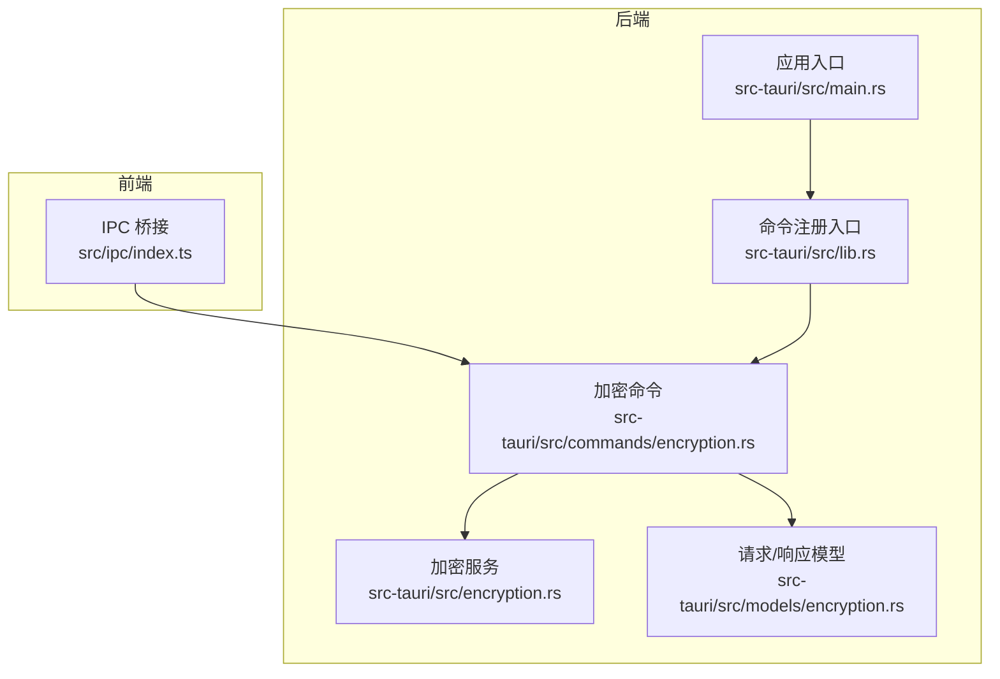
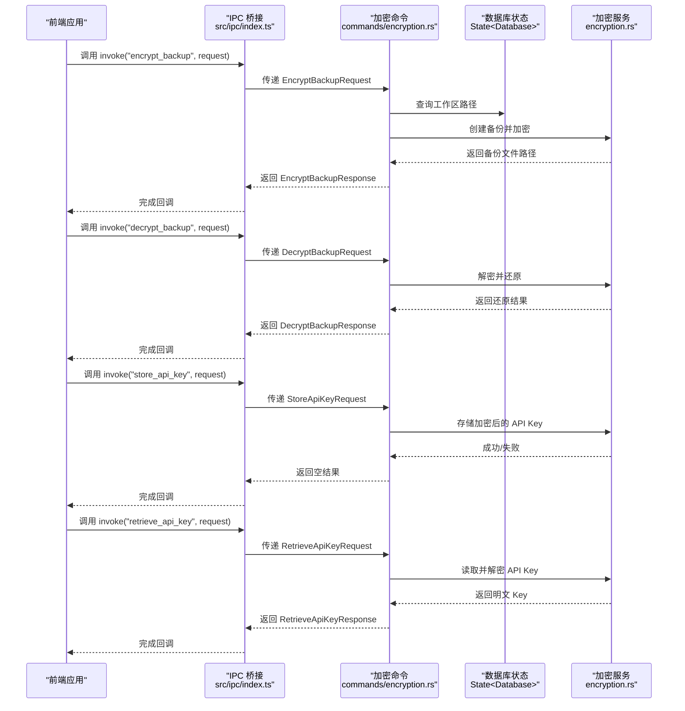
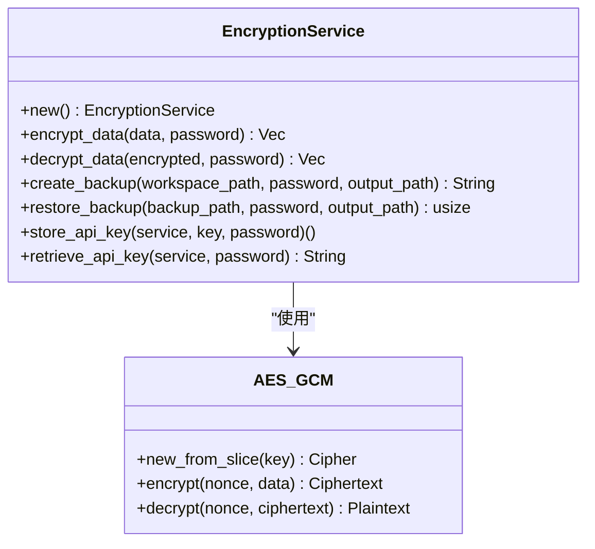
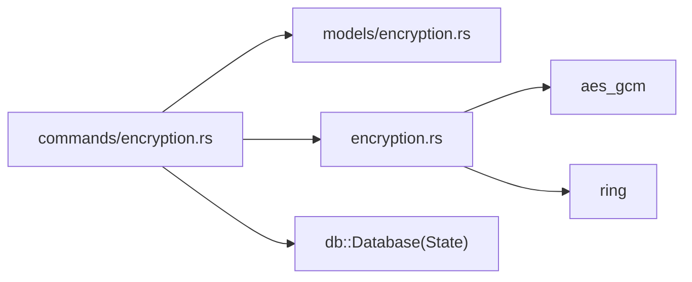

# 加密命令

<cite>
**本文引用的文件**
- [src-tauri/src/commands/encryption.rs](file://src-tauri/src/commands/encryption.rs)
- [src-tauri/src/encryption.rs](file://src-tauri/src/encryption.rs)
- [src-tauri/src/models/encryption.rs](file://src-tauri/src/models/encryption.rs)
- [src-tauri/Cargo.toml](file://src-tauri/Cargo.toml)
- [src-tauri/src/lib.rs](file://src-tauri/src/lib.rs)
- [src-tauri/src/main.rs](file://src-tauri/src/main.rs)
- [src/ipc/index.ts](file://src/ipc/index.ts)
</cite>

## 目录
1. [简介](#简介)
2. [项目结构](#项目结构)
3. [核心组件](#核心组件)
4. [架构总览](#架构总览)
5. [详细组件分析](#详细组件分析)
6. [依赖关系分析](#依赖关系分析)
7. [性能考量](#性能考量)
8. [故障排查指南](#故障排查指南)
9. [结论](#结论)
10. [附录](#附录)

## 简介
本文件系统性梳理并说明本项目中基于 Tauri 的加密命令实现，涵盖数据加密/解密、备份加密与还原、API 密钥的存储与检索等核心功能。文档重点解释：
- 加密算法与密钥派生策略（AES-256-GCM + PBKDF2-HMAC-SHA256）
- 密钥与盐的存储格式与安全性设计
- 命令接口定义与前后端契约
- 性能优化与安全最佳实践
- 使用场景与集成建议

## 项目结构
加密相关代码主要分布在以下位置：
- 后端（Rust）：命令层、加密服务、模型定义
- 前端（TypeScript）：IPC 调用桥接与错误处理

图表来源
- [src-tauri/src/commands/encryption.rs:1-64](file://src-tauri/src/commands/encryption.rs#L1-L64)
- [src-tauri/src/encryption.rs:1-183](file://src-tauri/src/encryption.rs#L1-L183)
- [src-tauri/src/models/encryption.rs:1-51](file://src-tauri/src/models/encryption.rs#L1-L51)
- [src-tauri/src/lib.rs](file://src-tauri/src/lib.rs)
- [src-tauri/src/main.rs](file://src-tauri/src/main.rs)
- [src/ipc/index.ts:1-105](file://src/ipc/index.ts#L1-L105)

章节来源
- [src-tauri/src/commands/encryption.rs:1-64](file://src-tauri/src/commands/encryption.rs#L1-L64)
- [src-tauri/src/encryption.rs:1-183](file://src-tauri/src/encryption.rs#L1-L183)
- [src-tauri/src/models/encryption.rs:1-51](file://src-tauri/src/models/encryption.rs#L1-L51)
- [src-tauri/src/lib.rs](file://src-tauri/src/lib.rs)
- [src-tauri/src/main.rs](file://src-tauri/src/main.rs)
- [src/ipc/index.ts:1-105](file://src/ipc/index.ts#L1-L105)

## 核心组件
- 加密命令模块：暴露四个 Tauri 命令，分别用于加密备份、解密备份、存储 API 密钥、检索 API 密钥。
- 加密服务：封装密码学操作，包括通用数据加解密、备份打包与加解密、API 密钥的持久化读写。
- 数据传输对象（DTO）：定义命令请求/响应的结构，统一采用 camelCase 字段命名。

章节来源
- [src-tauri/src/commands/encryption.rs:11-63](file://src-tauri/src/commands/encryption.rs#L11-L63)
- [src-tauri/src/encryption.rs:13-163](file://src-tauri/src/encryption.rs#L13-L163)
- [src-tauri/src/models/encryption.rs:3-50](file://src-tauri/src/models/encryption.rs#L3-L50)

## 架构总览
下图展示从前端调用到后端执行的完整流程，以及各模块之间的依赖关系。

图表来源
- [src-tauri/src/commands/encryption.rs:11-63](file://src-tauri/src/commands/encryption.rs#L11-L63)
- [src-tauri/src/encryption.rs:86-162](file://src-tauri/src/encryption.rs#L86-L162)
- [src-tauri/src/models/encryption.rs:3-50](file://src-tauri/src/models/encryption.rs#L3-L50)
- [src/ipc/index.ts:66-83](file://src/ipc/index.ts#L66-L83)

## 详细组件分析

### 命令层（Tauri Commands）
- encrypt_backup
  - 输入：EncryptBackupRequest（工作区 ID、密码、输出路径）
  - 处理：查询工作区根路径，调用加密服务创建并加密备份，返回备份文件路径
  - 错误：未找到工作区时返回“未找到”错误
- decrypt_backup
  - 输入：DecryptBackupRequest（备份文件路径、密码、输出路径）
  - 处理：调用加密服务解密并写回文件，返回还原标记
- store_api_key
  - 输入：StoreApiKeyRequest（服务标识、密钥、密码）
  - 处理：将密钥加密后以“服务标识.key”的形式写入本地文件
- retrieve_api_key
  - 输入：RetrieveApiKeyRequest（服务标识、密码）
  - 处理：读取对应 .key 文件并解密，返回明文密钥；若文件不存在则返回“未找到”

章节来源
- [src-tauri/src/commands/encryption.rs:11-63](file://src-tauri/src/commands/encryption.rs#L11-L63)
- [src-tauri/src/models/encryption.rs:3-50](file://src-tauri/src/models/encryption.rs#L3-L50)

### 加密服务（EncryptionService）
- 核心算法
  - 对称加密：AES-256-GCM（AEAD）
  - 密钥派生：PBKDF2-HMAC-SHA256，迭代次数固定，盐长度固定
  - 随机数：使用系统安全随机源
- 数据格式
  - 密文前缀包含：盐（16 字节）+ 随机 nonce（12 字节）+ 密文
- 关键方法
  - encrypt_data：派生密钥、生成 nonce、加密并拼接前缀
  - decrypt_data：解析前缀、派生密钥、解密
  - create_backup：复制工作区内容至临时 zip，加密后写入最终备份文件
  - restore_backup：读取备份、解密、写回目标路径
  - store_api_key/retrieve_api_key：以“服务名.key”为文件名进行持久化读写

图表来源
- [src-tauri/src/encryption.rs:13-163](file://src-tauri/src/encryption.rs#L13-L163)

章节来源
- [src-tauri/src/encryption.rs:13-163](file://src-tauri/src/encryption.rs#L13-L163)

### 数据模型（DTO）
- EncryptBackupRequest/Response
- DecryptBackupRequest/Response
- StoreApiKeyRequest
- RetrieveApiKeyRequest/Response

字段全部采用 camelCase，便于前后端直接映射。

章节来源
- [src-tauri/src/models/encryption.rs:3-50](file://src-tauri/src/models/encryption.rs#L3-L50)

### 命令注册与入口
- 命令通过后端模块导出并在应用入口集中注册，确保前端可通过 invoke 直接调用。
- 前端 IPC 桥接封装了 invoke 调用与错误处理，支持在浏览器环境使用桩函数进行开发调试。

章节来源
- [src-tauri/src/lib.rs](file://src-tauri/src/lib.rs)
- [src-tauri/src/main.rs](file://src-tauri/src/main.rs)
- [src/ipc/index.ts:66-83](file://src/ipc/index.ts#L66-L83)

## 依赖关系分析
- 外部库
  - aes-gcm：AES-GCM 实现
  - ring：PBKDF2、系统安全随机源
- 内部模块
  - commands/encryption.rs 依赖 models 与 encryption.rs
  - encryption.rs 依赖 error.rs（错误类型）

图表来源
- [src-tauri/src/commands/encryption.rs:1-9](file://src-tauri/src/commands/encryption.rs#L1-L9)
- [src-tauri/src/encryption.rs:1-7](file://src-tauri/src/encryption.rs#L1-L7)
- [src-tauri/Cargo.toml](file://src-tauri/Cargo.toml)

章节来源
- [src-tauri/src/commands/encryption.rs:1-9](file://src-tauri/src/commands/encryption.rs#L1-L9)
- [src-tauri/src/encryption.rs:1-7](file://src-tauri/src/encryption.rs#L1-L7)
- [src-tauri/Cargo.toml](file://src-tauri/Cargo.toml)

## 性能考量
- PBKDF2 迭代次数较高，提升抗暴力破解能力的同时增加 CPU 开销。建议：
  - 在后台线程执行加密/解密，避免阻塞主线程
  - 对大体积备份采用流式处理（当前实现为一次性读取，后续可优化为分块读写）
- AES-GCM 为常量时间开销，适合大规模数据处理
- 文件系统 I/O 为瓶颈，建议：
  - 使用 SSD 存储与合适的磁盘缓存策略
  - 备份/还原过程提供进度反馈与取消机制（UI 层可扩展）

## 故障排查指南
- “未找到工作区”
  - 现象：encrypt_backup 抛出“未找到”
  - 排查：确认传入的工作区 ID 是否存在且数据库连接正常
- “无效的加密数据”
  - 现象：decrypt_data 抛出“无效的加密数据”
  - 排查：确认输入数据长度是否满足盐+nonce 前缀；检查密码是否正确
- “API 密钥未找到”
  - 现象：retrieve_api_key 抛出“未找到”
  - 排查：确认服务标识对应的 .key 文件是否存在；检查文件权限
- IPC 调用异常
  - 现象：前端调用 invoke 抛出未知错误
  - 排查：检查 isTauri 判定、@tauri-apps/api/core 是否可用；查看 IpcError 包装信息

章节来源
- [src-tauri/src/commands/encryption.rs:18-24](file://src-tauri/src/commands/encryption.rs#L18-L24)
- [src-tauri/src/encryption.rs:60-62](file://src-tauri/src/encryption.rs#L60-L62)
- [src-tauri/src/encryption.rs:152-154](file://src-tauri/src/encryption.rs#L152-L154)
- [src/ipc/index.ts:66-83](file://src/ipc/index.ts#L66-L83)

## 结论
本加密子系统以 AES-256-GCM 为核心，结合 PBKDF2-HMAC-SHA256 提供强健的密钥派生与认证加密能力。命令层简洁清晰，模型层统一契约，服务层封装密码学细节，整体具备良好的可维护性与扩展性。建议在后续版本中引入更完善的错误分类、进度反馈与并发控制，以进一步提升用户体验与系统稳定性。

## 附录

### 命令与数据模型一览
- 命令
  - encrypt_backup：加密工作区为带密码的备份文件
  - decrypt_backup：解密备份并写回目标路径
  - store_api_key：将密钥加密后以服务名为文件名保存
  - retrieve_api_key：按服务名读取并解密密钥
- 请求/响应模型
  - EncryptBackupRequest/Response
  - DecryptBackupRequest/Response
  - StoreApiKeyRequest
  - RetrieveApiKeyRequest/Response

章节来源
- [src-tauri/src/commands/encryption.rs:11-63](file://src-tauri/src/commands/encryption.rs#L11-L63)
- [src-tauri/src/models/encryption.rs:3-50](file://src-tauri/src/models/encryption.rs#L3-L50)

### 使用场景与最佳实践
- 场景一：定期备份工作区
  - 步骤：调用 encrypt_backup，指定工作区 ID、输出路径与密码
  - 最佳实践：将输出文件存放于受信任的外部存储；定期轮换密码
- 场景二：恢复备份
  - 步骤：调用 decrypt_backup，提供备份文件路径、密码与输出路径
  - 最佳实践：先校验备份完整性再写入；避免覆盖现有工作区
- 场景三：安全存储第三方 API 密钥
  - 步骤：调用 store_api_key，提供服务标识、密钥与密码；需要时调用 retrieve_api_key
  - 最佳实践：密钥文件应位于受限目录；最小权限原则；定期轮换密钥

### 安全审计要点
- 算法强度：AES-256-GCM + PBKDF2-HMAC-SHA256，满足现代安全要求
- 随机性：使用系统安全随机源生成盐与 nonce
- 存储格式：密文前缀包含盐与 nonce，便于跨平台兼容
- 访问控制：API 密钥文件以服务名为文件名，便于权限控制
- 合规性：不涉及敏感数据的永久存储；如需长期保留，请遵循组织数据保护政策