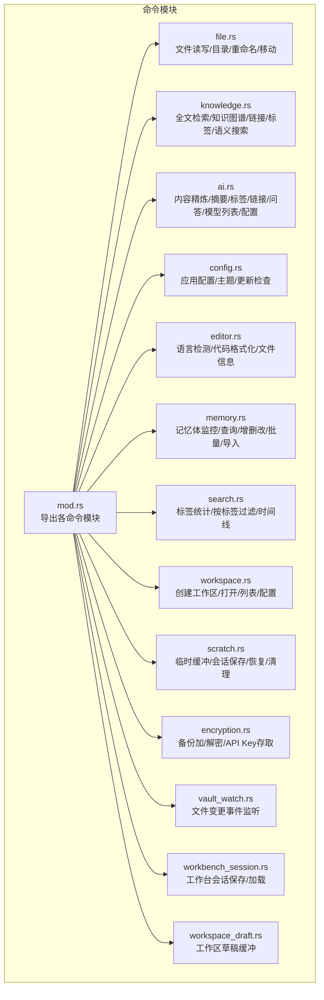
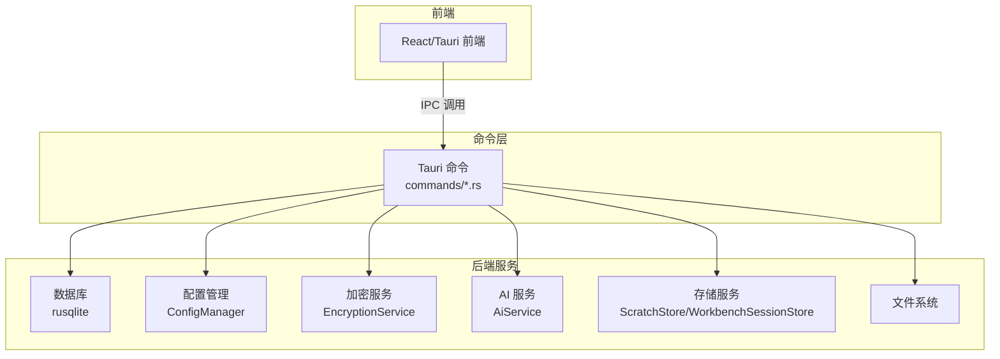
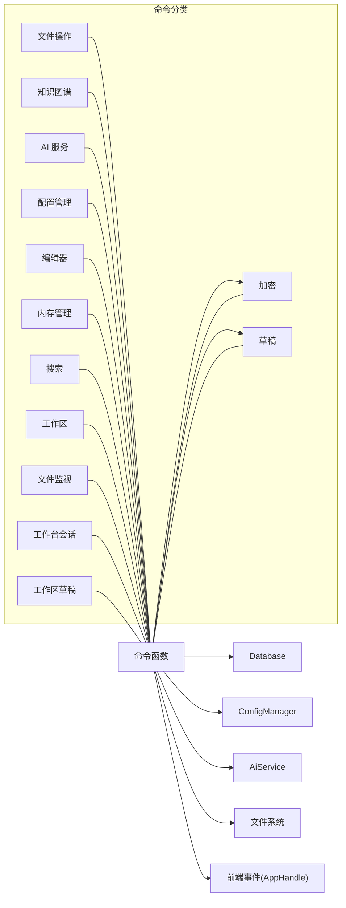

# 命令系统

<cite>
**本文引用的文件**
- [mod.rs](file://src-tauri/src/commands/mod.rs)
- [file.rs](file://src-tauri/src/commands/file.rs)
- [knowledge.rs](file://src-tauri/src/commands/knowledge.rs)
- [ai.rs](file://src-tauri/src/commands/ai.rs)
- [config.rs](file://src-tauri/src/commands/config.rs)
- [editor.rs](file://src-tauri/src/commands/editor.rs)
- [memory.rs](file://src-tauri/src/commands/memory.rs)
- [search.rs](file://src-tauri/src/commands/search.rs)
- [workspace.rs](file://src-tauri/src/commands/workspace.rs)
- [scratch.rs](file://src-tauri/src/commands/scratch.rs)
- [encryption.rs](file://src-tauri/src/commands/encryption.rs)
- [vault_watch.rs](file://src-tauri/src/commands/vault_watch.rs)
- [workbench_session.rs](file://src-tauri/src/commands/workbench_session.rs)
- [workspace_draft.rs](file://src-tauri/src/commands/workspace_draft.rs)
</cite>

## 目录
1. [简介](#简介)
2. [项目结构](#项目结构)
3. [核心组件](#核心组件)
4. [架构总览](#架构总览)
5. [详细组件分析](#详细组件分析)
6. [依赖关系分析](#依赖关系分析)
7. [性能考量](#性能考量)
8. [故障排查指南](#故障排查指南)
9. [结论](#结论)
10. [附录](#附录)

## 简介
本文件系统性梳理 NoteForge 的 Tauri 命令体系，覆盖 49 个命令的完整实现与使用说明，包括文件操作、知识图谱、AI 服务、配置管理、编辑器、内存管理、搜索、工作区、草稿管理、加密、文件监视、工作台会话、向量搜索等模块。文档从命令注册机制、类型安全、异步处理模式入手，逐项解析参数定义、返回值类型、错误处理策略与调用方式，并提供最佳实践与性能优化建议。

## 项目结构
命令模块采用按功能域划分的组织方式：每个领域一个独立文件，统一在 mod.rs 中导出，供 Tauri 在构建时自动注册为 IPC 命令。命令层通过 State 注入数据库连接、配置管理器、存储服务等依赖，确保可测试性与解耦。

图表来源
- [mod.rs:1-13](file://src-tauri/src/commands/mod.rs#L1-L13)

章节来源
- [mod.rs:1-13](file://src-tauri/src/commands/mod.rs#L1-L13)

## 核心组件
- 命令注册机制
  - 每个命令以 #[tauri::command] 宏声明，Tauri 在构建时扫描模块并通过 State 注入依赖（如 Database、ConfigManager、ScratchStore 等），返回值统一包装为 Result<T, NoteforgeError>，确保前端可捕获错误。
  - 参数与返回值均来自 models 模块定义的数据契约，保证类型安全与跨端一致性。
- 类型安全与错误处理
  - 所有命令返回 Result<T, NoteforgeError>，错误枚举集中定义于 error.rs；常见错误包括 NotFound、InvalidInput、Io、Notify、Internal 等。
  - 文件路径校验：对虚拟文档路径进行拦截，避免对真实文件系统造成误操作。
- 异步处理模式
  - AI 相关命令（如内容精炼、摘要生成、问答）标记为 async，内部通过外部服务（Ollama）异步调用，减少阻塞。
  - 文件监听命令通过后台线程与通道接收 notify 事件，再通过 AppHandle 发射前端事件，避免阻塞主线程。

章节来源
- [file.rs:14-175](file://src-tauri/src/commands/file.rs#L14-L175)
- [knowledge.rs:14-305](file://src-tauri/src/commands/knowledge.rs#L14-L305)
- [ai.rs:13-126](file://src-tauri/src/commands/ai.rs#L13-L126)
- [config.rs:9-96](file://src-tauri/src/commands/config.rs#L9-L96)
- [editor.rs:7-104](file://src-tauri/src/commands/editor.rs#L7-L104)
- [memory.rs:12-337](file://src-tauri/src/commands/memory.rs#L12-L337)
- [search.rs:8-117](file://src-tauri/src/commands/search.rs#L8-L117)
- [workspace.rs:7-113](file://src-tauri/src/commands/workspace.rs#L7-L113)
- [scratch.rs:9-52](file://src-tauri/src/commands/scratch.rs#L9-L52)
- [encryption.rs:11-64](file://src-tauri/src/commands/encryption.rs#L11-L64)
- [vault_watch.rs:71-138](file://src-tauri/src/commands/vault_watch.rs#L71-L138)
- [workbench_session.rs:6-20](file://src-tauri/src/commands/workbench_session.rs#L6-L20)
- [workspace_draft.rs:7-30](file://src-tauri/src/commands/workspace_draft.rs#L7-L30)

## 架构总览
下图展示命令层与核心子系统的关系：命令通过 State 访问数据库、配置、加密、AI 服务、存储等能力；部分命令触发前端事件（如文件变更通知）。

图表来源
- [file.rs:1-175](file://src-tauri/src/commands/file.rs#L1-L175)
- [knowledge.rs:1-305](file://src-tauri/src/commands/knowledge.rs#L1-L305)
- [ai.rs:1-126](file://src-tauri/src/commands/ai.rs#L1-L126)
- [config.rs:1-96](file://src-tauri/src/commands/config.rs#L1-L96)
- [editor.rs:1-104](file://src-tauri/src/commands/editor.rs#L1-L104)
- [memory.rs:1-337](file://src-tauri/src/commands/memory.rs#L1-L337)
- [search.rs:1-117](file://src-tauri/src/commands/search.rs#L1-L117)
- [workspace.rs:1-113](file://src-tauri/src/commands/workspace.rs#L1-L113)
- [scratch.rs:1-52](file://src-tauri/src/commands/scratch.rs#L1-L52)
- [encryption.rs:1-64](file://src-tauri/src/commands/encryption.rs#L1-L64)
- [vault_watch.rs:1-138](file://src-tauri/src/commands/vault_watch.rs#L1-L138)
- [workbench_session.rs:1-20](file://src-tauri/src/commands/workbench_session.rs#L1-L20)
- [workspace_draft.rs:1-30](file://src-tauri/src/commands/workspace_draft.rs#L1-L30)

## 详细组件分析

### 文件操作命令（file.rs）
- 命令清单与用途
  - read_file：读取文件内容并推断语言类型
  - write_file：写入内容到指定路径（自动创建父目录）
  - list_directory：列出目录条目（名称、路径、是否目录、大小、修改时间）
  - create_file：创建新文件（若不存在）
  - delete_file：删除文件或目录（递归）
  - rename_file：重命名（目标必须不存在）
  - move_file：移动（自动创建目标父目录）
- 参数与返回
  - 路径参数统一为 String；返回值为 Result<T, NoteforgeError>
  - list_directory 返回 Vec<FileEntry>；read_file 返回 ReadFileResponse
- 错误处理
  - 非法输入（虚拟路径）、不存在（NotFound）、IO 错误（Io）
- 调用方式
  - 前端通过 IPC 调用；注意对虚拟文档路径需前置转换为真实路径
- 性能与最佳实践
  - 大文件读写建议分块或异步执行
  - 移动/重命名前先校验目标是否存在，避免覆盖

章节来源
- [file.rs:14-175](file://src-tauri/src/commands/file.rs#L14-L175)

### 知识图谱命令（knowledge.rs）
- 命令清单与用途
  - index_knowledge_base：遍历路径索引文档（md/txt/json/yaml/yml），写入索引
  - search_fulltext：全文检索，限制结果数量并按工作区过滤
  - get_knowledge_graph：查询图节点与边（去重）
  - extract_links：提取 wiki 链接与 Markdown 链接
  - extract_tags：提取 #标签 与 YAML frontmatter 标签
  - get_backlinks：查询反链
  - semantic_search：基于向量引擎的语义相似度检索
- 参数与返回
  - 请求对象来自 models::IndexKnowledgeBaseRequest 等
  - 返回 SearchResult、KnowledgeGraph、Vec<Link>、Vec<String>、Vec<Backlink>
- 错误处理
  - NotFound、Internal、数据库访问异常
- 调用方式
  - 通过 State<Database> 获取连接；semantic_search 同时使用 VectorEngine
- 性能与最佳实践
  - 大规模索引建议分批处理与事务封装
  - 图查询中对边进行去重，避免重复渲染

章节来源
- [knowledge.rs:14-305](file://src-tauri/src/commands/knowledge.rs#L14-L305)

### AI 服务命令（ai.rs）
- 命令清单与用途
  - ai_refine_content：内容精炼（支持自定义模型）
  - ai_generate_summary：生成摘要
  - ai_suggest_tags：标签建议
  - ai_suggest_links：链接建议（结合现有笔记）
  - ai_knowledge_qa：RAG 问答（检索上下文 + 外部模型）
  - list_ai_models：列举可用模型
  - configure_ai_model：配置模型提供商与端点
- 参数与返回
  - 请求对象来自 models::Ai*Request；返回 RefineResult、String、Vec<String>、Vec<LinkSuggestion>、QaResult、Vec<ModelInfo>
- 错误处理
  - 外部服务调用失败、模型不可用、锁竞争
- 调用方式
  - 通过 State<ConfigManager> 获取 Ollama 端点；RAG 流程先 DB 查询再异步调用模型
- 性能与最佳实践
  - RAG 提前释放数据库锁后再发起网络请求，避免阻塞
  - 对长文本分段处理，控制上下文长度

章节来源
- [ai.rs:13-126](file://src-tauri/src/commands/ai.rs#L13-L126)

### 配置管理命令（config.rs）
- 命令清单与用途
  - get_app_config：读取当前应用配置
  - update_app_config：增量更新配置项并持久化
  - get_theme/set_theme：主题读取/设置
  - check_for_updates：检查更新（当前返回无更新）
- 参数与返回
  - 请求对象来自 models::UpdateAppConfigRequest/SetThemeRequest
  - 返回 GetAppConfigResponse、GetThemeResponse、CheckForUpdatesResponse
- 错误处理
  - 配置更新失败、内部状态异常
- 调用方式
  - 通过 State<ConfigManager> 访问全局配置
- 性能与最佳实践
  - 批量更新时合并写入，减少磁盘 IO

章节来源
- [config.rs:9-96](file://src-tauri/src/commands/config.rs#L9-L96)

### 编辑器命令（editor.rs）
- 命令清单与用途
  - detect_language：根据文件名或内容推断语言
  - format_code：格式化 JSON（Markdown/其他保持原样）
  - get_file_info：获取文件元数据（大小、修改时间、语言、是否目录）
- 参数与返回
  - detect_language 返回 LanguageDetection；format_code 返回 FormatCodeResponse；get_file_info 返回 FileInfo
- 错误处理
  - 文件不存在、JSON 格式非法
- 调用方式
  - 依赖 file.rs 的 ensure_real_file_path 进行路径校验
- 性能与最佳实践
  - 仅对大 JSON 文件进行格式化，避免不必要的 CPU 开销

章节来源
- [editor.rs:7-104](file://src-tauri/src/commands/editor.rs#L7-L104)

### 内存管理命令（memory.rs）
- 命令清单与用途
  - monitor_memory_directory：注册文件监控（记录到 watchers 表）
  - list_agent_memories：按代理与类型查询记忆体（支持标签丰富）
  - list_agents：统计代理及其记忆体数量
  - get_memory_timeline：按时间范围查询记忆体
  - update_memory：更新内容/标题/元数据
  - create_memory：创建记忆体并附加标签
  - delete_memory：删除记忆体
  - batch_tag_memories：批量打标签
  - batch_delete_memories：批量删除
  - import_agent_memories：导入 JSON 格式记忆体
- 参数与返回
  - 请求对象来自 models::CreateMemoryRequest 等；返回 Vec<MemoryEntry>、Agent、ImportAgentMemoriesResponse 等
- 错误处理
  - 数据库约束冲突、JSON 解析失败、锁竞争
- 调用方式
  - 通过 State<Database> 与 TagRepo 协作；标签查询与记忆体查询分离
- 性能与最佳实践
  - 批量操作使用事务；标签关联查询按需懒加载

章节来源
- [memory.rs:12-337](file://src-tauri/src/commands/memory.rs#L12-L337)

### 搜索命令（search.rs）
- 命令清单与用途
  - get_tags：统计工作区内标签使用频次
  - filter_by_tags：按标签集合筛选笔记文件
  - get_timeline：按时间范围查询笔记时间线
- 参数与返回
  - 请求对象来自 models::GetTagsRequest/FilterByTagsRequest/GetTimelineRequest；返回 Vec<TagCount>/Vec<FileEntry>/Vec<TimelineEntry>
- 错误处理
  - SQL 构造与执行异常
- 调用方式
  - 使用动态占位符拼接 SQL，防止注入
- 性能与最佳实践
  - 标签过滤使用 IN 子句并限制标签数量；时间线按创建时间倒序

章节来源
- [search.rs:8-117](file://src-tauri/src/commands/search.rs#L8-L117)

### 工作区命令（workspace.rs）
- 命令清单与用途
  - create_workspace：创建新工作区（目录+配置）
  - open_workspace：打开已有或新路径工作区
  - list_workspaces：列出所有工作区
  - get_workspace_config/update_workspace_config：读取/更新配置
- 参数与返回
  - 请求对象来自 models::CreateWorkspaceRequest/OpenWorkspaceRequest；返回 WorkspaceView、WorkspaceConfig
- 错误处理
  - 路径不存在、非目录、已存在、内部注册失败
- 调用方式
  - 通过 WorkspaceRepo 访问持久化存储
- 性能与最佳实践
  - 创建目录与写入配置在单事务内完成，确保一致性

章节来源
- [workspace.rs:7-113](file://src-tauri/src/commands/workspace.rs#L7-L113)

### 草稿管理命令（scratch.rs）
- 命令清单与用途
  - scratch_save_buffer/load_buffer/delete_buffer：缓冲区 CRUD
  - scratch_save_session/restore/clear_session：会话持久化与恢复
- 参数与返回
  - 请求对象来自 models::scratch；返回 Option<ScratchBufferPayload>/ScratchRestoreResponse
- 错误处理
  - 存储服务异常
- 调用方式
  - 通过 State<ScratchStore> 访问内存/本地存储
- 性能与最佳实践
  - 会话数据尽量轻量化，避免频繁序列化

章节来源
- [scratch.rs:9-52](file://src-tauri/src/commands/scratch.rs#L9-L52)

### 加密命令（encryption.rs）
- 命令清单与用途
  - encrypt_backup：加密备份（基于工作区路径与密码）
  - decrypt_backup：解密还原
  - store_api_key/retrieve_api_key：安全存储/读取第三方 API Key
- 参数与返回
  - 请求对象来自 models::EncryptBackupRequest/DecryptBackupRequest/StoreApiKeyRequest/RetrieveApiKeyRequest；返回 EncryptBackupResponse/DecryptBackupResponse/RetrieveApiKeyResponse
- 错误处理
  - 密码错误、文件不存在、IO 错误
- 调用方式
  - 通过 EncryptionService 执行加解密与密钥管理
- 性能与最佳实践
  - 大文件备份建议分块处理；API Key 存储使用安全容器

章节来源
- [encryption.rs:11-64](file://src-tauri/src/commands/encryption.rs#L11-L64)

### 文件监视命令（vault_watch.rs）
- 命令清单与用途
  - vault_start_watch：启动递归文件监听，返回 watcher_id；同一根路径复用
  - vault_stop_watch：停止当前活跃监听
- 参数与返回
  - 返回 watcher_id 或空；事件通过 AppHandle 发射到前端
- 错误处理
  - 路径不存在、notify 初始化失败、锁竞争
- 调用方式
  - 使用 notify::recommended_watcher；后台线程接收事件并映射为前端事件载荷
- 性能与最佳实践
  - 监听粒度控制在必要范围内；避免对大型二进制文件频繁触发

章节来源
- [vault_watch.rs:71-138](file://src-tauri/src/commands/vault_watch.rs#L71-L138)

### 工作台会话命令（workbench_session.rs）
- 命令清单与用途
  - workbench_save_session：保存当前会话（可选标识）
  - workbench_load_session：加载上次会话
- 参数与返回
  - 返回 Option<String> 表示会话内容
- 错误处理
  - 存储服务异常
- 调用方式
  - 通过 State<WorkbenchSessionStore> 访问会话存储
- 性能与最佳实践
  - 会话内容尽量短小，避免占用过多内存

章节来源
- [workbench_session.rs:6-20](file://src-tauri/src/commands/workbench_session.rs#L6-L20)

### 工作区草稿命令（workspace_draft.rs）
- 命令清单与用途
  - draft_save_buffer/load_buffer/delete_buffer：按 vault_path 维度的草稿缓冲
- 参数与返回
  - 返回 Option<WorkspaceDraftPayload>
- 错误处理
  - 存储服务异常
- 调用方式
  - 通过 State<WorkspaceDraftStore> 访问草稿存储
- 性能与最佳实践
  - 草稿按文件维度隔离，便于快速切换与恢复

章节来源
- [workspace_draft.rs:7-30](file://src-tauri/src/commands/workspace_draft.rs#L7-L30)

## 依赖关系分析
命令层依赖关系如下：命令通过 State 注入核心服务；部分命令组合多个服务（如 AI 问答同时使用知识检索与外部模型）；文件监听命令通过 AppHandle 与前端通信。

图表来源
- [file.rs:1-175](file://src-tauri/src/commands/file.rs#L1-L175)
- [knowledge.rs:1-305](file://src-tauri/src/commands/knowledge.rs#L1-L305)
- [ai.rs:1-126](file://src-tauri/src/commands/ai.rs#L1-L126)
- [config.rs:1-96](file://src-tauri/src/commands/config.rs#L1-L96)
- [editor.rs:1-104](file://src-tauri/src/commands/editor.rs#L1-L104)
- [memory.rs:1-337](file://src-tauri/src/commands/memory.rs#L1-L337)
- [search.rs:1-117](file://src-tauri/src/commands/search.rs#L1-L117)
- [workspace.rs:1-113](file://src-tauri/src/commands/workspace.rs#L1-L113)
- [scratch.rs:1-52](file://src-tauri/src/commands/scratch.rs#L1-L52)
- [encryption.rs:1-64](file://src-tauri/src/commands/encryption.rs#L1-L64)
- [vault_watch.rs:1-138](file://src-tauri/src/commands/vault_watch.rs#L1-L138)
- [workbench_session.rs:1-20](file://src-tauri/src/commands/workbench_session.rs#L1-L20)
- [workspace_draft.rs:1-30](file://src-tauri/src/commands/workspace_draft.rs#L1-L30)

## 性能考量
- I/O 与并发
  - 大文件读写与目录遍历应异步执行，避免阻塞 UI 线程
  - 文件监听使用后台线程与通道，事件聚合发送
- 数据库访问
  - 批量插入/更新使用事务；复杂查询提前释放锁，再进行外部调用
  - 合理使用索引与 LIMIT 控制结果集大小
- 外部服务
  - AI 问答流程先做本地检索，再异步调用模型，减少等待时间
  - 对长文本分段处理，控制上下文长度
- 序列化与缓存
  - 会话与草稿尽量轻量化；对热点数据进行内存缓存

## 故障排查指南
- 常见错误定位
  - NotFound：检查路径是否存在、是否为真实文件路径
  - InvalidInput：检查参数合法性（如目标已存在、虚拟路径）
  - Io：检查权限、磁盘空间、文件被占用
  - Notify：检查路径可访问性与监听权限
  - Internal：检查锁竞争、数据库连接池耗尽
- 排查步骤
  - 确认命令参数与 models 定义一致
  - 查看 State 注入是否正确（ConfigManager、Database、Store 实例）
  - 对异步命令，确认外部服务可达且凭据正确
  - 对文件监听，验证路径与权限
- 日志与可观测性
  - 文件监听错误在后台线程打印；建议在前端订阅 vault-file-event 并记录

章节来源
- [file.rs:5-12](file://src-tauri/src/commands/file.rs#L5-L12)
- [vault_watch.rs:104-118](file://src-tauri/src/commands/vault_watch.rs#L104-L118)

## 结论
NoteForge 的命令系统以模块化设计为核心，通过 #[tauri::command] 宏统一注册，配合 State 注入与 models 数据契约，实现了强类型、可测试、可扩展的 IPC 层。文件操作、知识图谱、AI 服务、配置管理、编辑器、内存管理、搜索、工作区、草稿管理、加密、文件监视、工作台会话与工作区草稿等 49 个命令覆盖了笔记应用的核心场景。遵循本文的最佳实践与性能建议，可在保证稳定性的同时获得更佳的用户体验。

## 附录
- 命令清单（按模块汇总）
  - 文件操作：read_file、write_file、list_directory、create_file、delete_file、rename_file、move_file
  - 知识图谱：index_knowledge_base、search_fulltext、get_knowledge_graph、extract_links、extract_tags、get_backlinks、semantic_search
  - AI 服务：ai_refine_content、ai_generate_summary、ai_suggest_tags、ai_suggest_links、ai_knowledge_qa、list_ai_models、configure_ai_model
  - 配置管理：get_app_config、update_app_config、get_theme、set_theme、check_for_updates
  - 编辑器：detect_language、format_code、get_file_info
  - 内存管理：monitor_memory_directory、list_agent_memories、list_agents、get_memory_timeline、update_memory、create_memory、delete_memory、batch_tag_memories、batch_delete_memories、import_agent_memories
  - 搜索：get_tags、filter_by_tags、get_timeline
  - 工作区：create_workspace、open_workspace、list_workspaces、get_workspace_config、update_workspace_config
  - 草稿管理：scratch_save_buffer、scratch_load_buffer、scratch_delete_buffer、scratch_save_session、scratch_restore_session、scratch_clear_session
  - 加密：encrypt_backup、decrypt_backup、store_api_key、retrieve_api_key
  - 文件监视：vault_start_watch、vault_stop_watch
  - 工作台会话：workbench_save_session、workbench_load_session
  - 工作区草稿：draft_save_buffer、draft_load_buffer、draft_delete_buffer