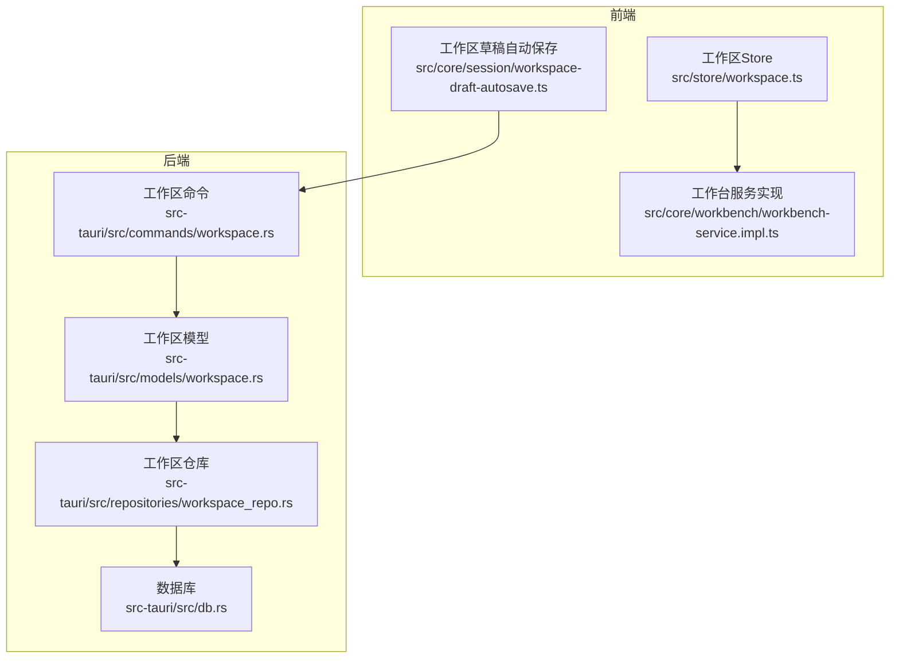
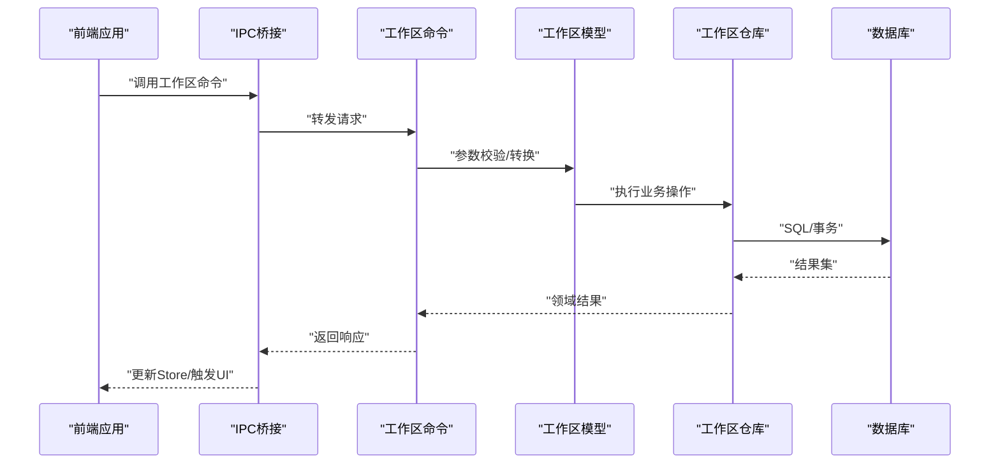
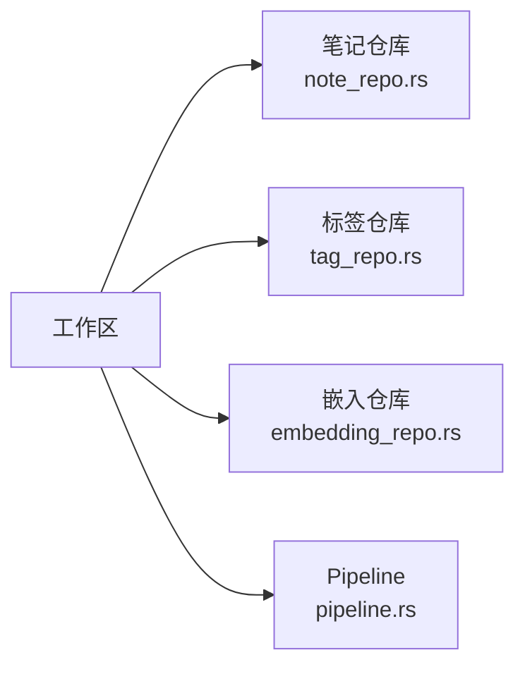
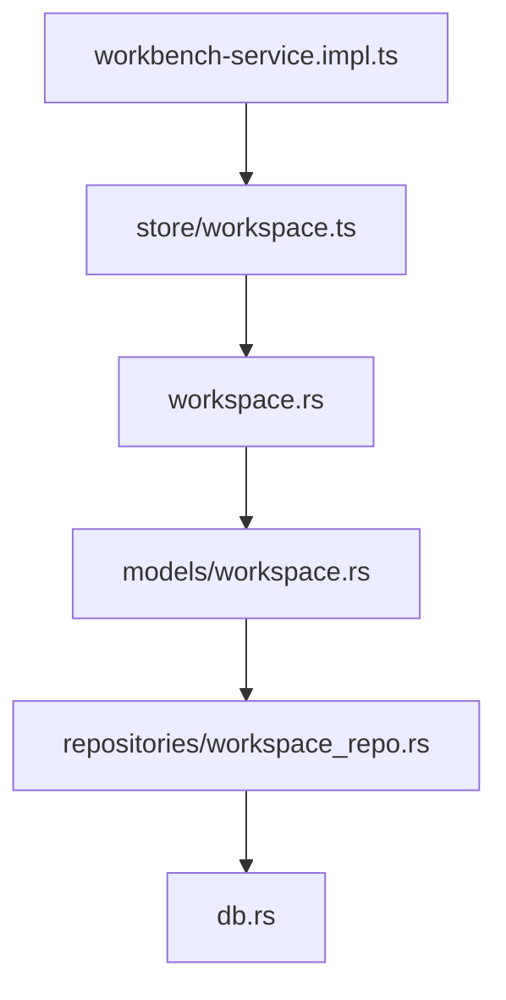

# 工作区命令

<cite>
**本文引用的文件**
- [src-tauri/src/commands/workspace.rs](file://src-tauri/src/commands/workspace.rs)
- [src-tauri/src/models/workspace.rs](file://src-tauri/src/models/workspace.rs)
- [src-tauri/src/repositories/workspace_repo.rs](file://src-tauri/src/repositories/workspace_repo.rs)
- [src-tauri/src/db.rs](file://src-tauri/src/db.rs)
- [src-tauri/src/main.rs](file://src-tauri/src/main.rs)
- [src-tauri/Cargo.toml](file://src-tauri/Cargo.toml)
- [src/core/workbench/workbench-service.impl.ts](file://src/core/workbench/workbench-service.impl.ts)
- [src/core/session/workspace-draft-autosave.ts](file://src/core/session/workspace-draft-autosave.ts)
- [src/store/workspace.ts](file://src/store/workspace.ts)
- [src-tauri/src/commands/workspace_draft.rs](file://src-tauri/src/commands/workspace_draft.rs)
- [src-tauri/src/models/workspace_draft.rs](file://src-tauri/src/models/workspace_draft.rs)
- [src-tauri/src/repositories/embedding_repo.rs](file://src-tauri/src/repositories/embedding_repo.rs)
- [src-tauri/src/repositories/note_repo.rs](file://src-tauri/src/repositories/note_repo.rs)
- [src-tauri/src/repositories/tag_repo.rs](file://src-tauri/src/repositories/tag_repo.rs)
- [src-tauri/src/watcher.rs](file://src-tauri/src/watcher.rs)
- [src-tauri/src/vector.rs](file://src-tauri/src/vector.rs)
- [src-tauri/src/pipeline.rs](file://src-tauri/src/pipeline.rs)
</cite>

## 目录
1. [简介](#简介)
2. [项目结构](#项目结构)
3. [核心组件](#核心组件)
4. [架构总览](#架构总览)
5. [详细组件分析](#详细组件分析)
6. [依赖关系分析](#依赖关系分析)
7. [性能考量](#性能考量)
8. [故障排除指南](#故障排除指南)
9. [结论](#结论)
10. [附录](#附录)

## 简介
本文件系统化梳理NoteForge中“工作区”相关Tauri命令与前端集成实现，覆盖工作区创建、配置管理、切换操作、状态同步等核心能力；解释工作区数据模型、配置项定义、权限控制与多工作区支持机制；阐述工作区隔离策略、数据备份与迁移方案；并给出最佳实践、性能优化与扩展性建议，以及可直接参考的使用示例与场景。

## 项目结构
工作区功能在前后端分别实现：
- 前端：工作区状态管理（store）、会话草稿自动保存、工作台服务集成
- 后端：Tauri命令（commands）、数据模型（models）、仓库层（repositories）、数据库（db）

图表来源
- [src/store/workspace.ts](file://src/store/workspace.ts)
- [src/core/workbench/workbench-service.impl.ts](file://src/core/workbench/workbench-service.impl.ts)
- [src/core/session/workspace-draft-autosave.ts](file://src/core/session/workspace-draft-autosave.ts)
- [src-tauri/src/commands/workspace.rs](file://src-tauri/src/commands/workspace.rs)
- [src-tauri/src/models/workspace.rs](file://src-tauri/src/models/workspace.rs)
- [src-tauri/src/repositories/workspace_repo.rs](file://src-tauri/src/repositories/workspace_repo.rs)
- [src-tauri/src/db.rs](file://src-tauri/src/db.rs)

章节来源
- [src-tauri/src/commands/workspace.rs](file://src-tauri/src/commands/workspace.rs)
- [src-tauri/src/models/workspace.rs](file://src-tauri/src/models/workspace.rs)
- [src-tauri/src/repositories/workspace_repo.rs](file://src-tauri/src/repositories/workspace_repo.rs)
- [src-tauri/src/db.rs](file://src-tauri/src/db.rs)
- [src/store/workspace.ts](file://src/store/workspace.ts)
- [src/core/workbench/workbench-service.impl.ts](file://src/core/workbench/workbench-service.impl.ts)
- [src/core/session/workspace-draft-autosave.ts](file://src/core/session/workspace-draft-autosave.ts)

## 核心组件
- Tauri工作区命令模块：提供工作区创建、删除、切换、列表查询、当前工作区信息等IPC接口
- 工作区数据模型：定义工作区实体字段、校验规则、序列化/反序列化
- 工作区仓库层：封装对SQLite/数据库的CRUD与事务操作
- 前端工作区Store：集中管理当前工作区上下文、持久化状态
- 草稿自动保存：工作区级草稿的本地自动保存与恢复
- 工作台服务：与前端UI会话、标签页、状态栏等交互

章节来源
- [src-tauri/src/commands/workspace.rs](file://src-tauri/src/commands/workspace.rs)
- [src-tauri/src/models/workspace.rs](file://src-tauri/src/models/workspace.rs)
- [src-tauri/src/repositories/workspace_repo.rs](file://src-tauri/src/repositories/workspace_repo.rs)
- [src/store/workspace.ts](file://src/store/workspace.ts)
- [src/core/session/workspace-draft-autosave.ts](file://src/core/session/workspace-draft-autosave.ts)
- [src/core/workbench/workbench-service.impl.ts](file://src/core/workbench/workbench-service.impl.ts)

## 架构总览
工作区命令从Tauri后端出发，通过IPC桥接至前端Store与工作台服务，形成“命令-模型-仓库-存储”的闭环。

图表来源
- [src-tauri/src/commands/workspace.rs](file://src-tauri/src/commands/workspace.rs)
- [src-tauri/src/models/workspace.rs](file://src-tauri/src/models/workspace.rs)
- [src-tauri/src/repositories/workspace_repo.rs](file://src-tauri/src/repositories/workspace_repo.rs)
- [src-tauri/src/db.rs](file://src-tauri/src/db.rs)
- [src/store/workspace.ts](file://src/store/workspace.ts)

## 详细组件分析

### 工作区命令实现（后端）
- 命令职责
  - 创建工作区：校验名称/路径合法性，初始化元数据，建立隔离目录与索引
  - 删除工作区：安全删除、清理索引与缓存、防止误删当前工作区
  - 切换工作区：原子性更新当前工作区标识，触发状态广播
  - 查询工作区：分页/过滤列表、当前工作区详情
  - 配置管理：读取/写入工作区配置（如主题、默认视图、索引策略）
- 错误处理
  - 参数校验失败、数据库异常、文件系统冲突、并发竞争条件
  - 返回统一错误码与可读消息，避免敏感路径泄露
- 并发与事务
  - 关键操作使用数据库事务，保证一致性
  - 对频繁读取的配置采用缓存，降低IO压力

章节来源
- [src-tauri/src/commands/workspace.rs](file://src-tauri/src/commands/workspace.rs)

### 工作区数据模型
- 字段设计
  - 唯一标识、名称、根路径、创建时间、修改时间、启用状态
  - 配置字段：JSON对象或键值对集合，支持增量更新
- 校验规则
  - 名称非空且唯一；路径存在且可访问；配置格式合法
- 序列化
  - 支持JSON与二进制格式，便于跨进程传输与持久化

章节来源
- [src-tauri/src/models/workspace.rs](file://src-tauri/src/models/workspace.rs)

### 工作区仓库层
- 职责
  - 提供CRUD、分页查询、统计计数、事务封装
  - 封装与向量/笔记/标签仓库的协作（见后续章节）
- 性能
  - 使用预编译语句、批量插入、索引优化
  - 对热点查询增加内存缓存

章节来源
- [src-tauri/src/repositories/workspace_repo.rs](file://src-tauri/src/repositories/workspace_repo.rs)

### 前端工作区Store与工作台集成
- Store职责
  - 维护当前工作区上下文、工作区列表、配置快照
  - 与IPC桥接，暴露工作区相关Action与Selector
- 工作台集成
  - 切换工作区时重置标签页、会话状态、侧边栏内容
  - 触发UI状态栏、菜单项、快捷键的动态更新

章节来源
- [src/store/workspace.ts](file://src/store/workspace.ts)
- [src/core/workbench/workbench-service.impl.ts](file://src/core/workbench/workbench-service.impl.ts)

### 工作区草稿自动保存
- 机制
  - 在用户编辑过程中定期序列化当前工作区草稿到本地存储
  - 应用启动或切换工作区时尝试恢复未提交的草稿
- 容错
  - 草稿损坏时自动丢弃并重建，不影响主工作区数据

章节来源
- [src/core/session/workspace-draft-autosave.ts](file://src/core/session/workspace-draft-autosave.ts)

### 权限控制与多工作区支持
- 权限控制
  - 文件系统层面：仅允许访问工作区内路径；禁止越权访问
  - IPC层面：命令鉴权、参数白名单、长度限制
- 多工作区支持
  - 每个工作区独立命名空间：笔记、标签、向量索引、缓存均按工作区隔离
  - 切换时平滑迁移UI状态与会话数据

章节来源
- [src-tauri/src/commands/workspace.rs](file://src-tauri/src/commands/workspace.rs)
- [src-tauri/src/models/workspace.rs](file://src-tauri/src/models/workspace.rs)
- [src-tauri/src/repositories/workspace_repo.rs](file://src-tauri/src/repositories/workspace_repo.rs)

### 数据备份与迁移
- 备份策略
  - 结构化备份：导出工作区元数据、配置、笔记清单
  - 文件备份：按工作区根目录打包，支持增量备份
- 迁移方案
  - 版本升级：在命令层执行迁移脚本，更新配置与索引
  - 跨平台迁移：统一数据格式，兼容不同文件系统特性

章节来源
- [src-tauri/src/commands/workspace.rs](file://src-tauri/src/commands/workspace.rs)
- [src-tauri/src/db.rs](file://src-tauri/src/db.rs)

### 与知识图谱/向量索引的协作
- 笔记/标签/链接仓库与工作区绑定，确保查询范围限定在当前工作区
- 向量索引按工作区隔离，Pipeline在构建/更新时指定工作区上下文

图表来源
- [src-tauri/src/repositories/note_repo.rs](file://src-tauri/src/repositories/note_repo.rs)
- [src-tauri/src/repositories/tag_repo.rs](file://src-tauri/src/repositories/tag_repo.rs)
- [src-tauri/src/repositories/embedding_repo.rs](file://src-tauri/src/repositories/embedding_repo.rs)
- [src-tauri/src/pipeline.rs](file://src-tauri/src/pipeline.rs)

## 依赖关系分析
- 命令依赖模型与仓库层，仓库层依赖数据库层
- 前端Store依赖IPC桥接，间接依赖后端命令
- 知识图谱与向量索引依赖工作区上下文进行隔离

图表来源
- [src-tauri/src/commands/workspace.rs](file://src-tauri/src/commands/workspace.rs)
- [src-tauri/src/models/workspace.rs](file://src-tauri/src/models/workspace.rs)
- [src-tauri/src/repositories/workspace_repo.rs](file://src-tauri/src/repositories/workspace_repo.rs)
- [src-tauri/src/db.rs](file://src-tauri/src/db.rs)
- [src/store/workspace.ts](file://src/store/workspace.ts)
- [src/core/workbench/workbench-service.impl.ts](file://src/core/workbench/workbench-service.impl.ts)

章节来源
- [src-tauri/src/commands/workspace.rs](file://src-tauri/src/commands/workspace.rs)
- [src-tauri/src/models/workspace.rs](file://src-tauri/src/models/workspace.rs)
- [src-tauri/src/repositories/workspace_repo.rs](file://src-tauri/src/repositories/workspace_repo.rs)
- [src-tauri/src/db.rs](file://src-tauri/src/db.rs)
- [src/store/workspace.ts](file://src/store/workspace.ts)
- [src/core/workbench/workbench-service.impl.ts](file://src/core/workbench/workbench-service.impl.ts)

## 性能考量
- 数据库层
  - 使用事务批处理写入，减少磁盘刷写次数
  - 为常用查询字段建立索引，避免全表扫描
- 缓存策略
  - 工作区配置与热点查询结果缓存，降低重复IO
- 前端优化
  - Store按需更新，避免全局重渲染
  - 草稿自动保存采用节流/防抖策略
- I/O与并发
  - 文件系统操作异步化，避免阻塞主线程
  - 并发读写通过锁与队列协调

## 故障排除指南
- 常见问题
  - 工作区无法切换：检查目标工作区是否存在、路径是否可访问、是否被其他进程占用
  - 列表为空：确认数据库连接正常、初始化脚本已执行
  - 草稿丢失：检查本地存储权限与容量，必要时清理缓存
- 排查步骤
  - 查看后端日志与错误码定位命令层问题
  - 校验数据库事务是否回滚、索引是否完整
  - 前端Store状态与IPC响应是否一致
- 修复建议
  - 重建索引或重跑迁移脚本
  - 清理损坏的草稿文件并重启应用

章节来源
- [src-tauri/src/commands/workspace.rs](file://src-tauri/src/commands/workspace.rs)
- [src-tauri/src/repositories/workspace_repo.rs](file://src-tauri/src/repositories/workspace_repo.rs)
- [src/core/session/workspace-draft-autosave.ts](file://src/core/session/workspace-draft-autosave.ts)

## 结论
工作区命令体系以“命令-模型-仓库-存储”为核心，结合前端Store与工作台服务，实现了多工作区的隔离、切换与状态同步。通过严格的权限控制、事务一致性与缓存策略，兼顾了安全性与性能。配合完善的备份与迁移机制，满足长期演进与跨平台需求。

## 附录

### 使用示例与场景
- 场景一：首次启动创建新工作区
  - 步骤：调用创建命令，传入工作区名称与根路径；初始化完成后切换到该工作区；加载默认配置
  - 参考路径：[创建命令](file://src-tauri/src/commands/workspace.rs)
- 场景二：在多个工作区间切换
  - 步骤：查询工作区列表；选择目标工作区；调用切换命令；前端Store与工作台UI同步更新
  - 参考路径：[查询/切换命令](file://src-tauri/src/commands/workspace.rs)，[前端Store](file://src/store/workspace.ts)
- 场景三：工作区配置变更
  - 步骤：读取当前配置；更新特定键值；调用配置写入命令；持久化并刷新UI
  - 参考路径：[配置命令](file://src-tauri/src/commands/workspace.rs)，[模型定义](file://src-tauri/src/models/workspace.rs)
- 场景四：工作区草稿恢复
  - 步骤：应用启动时尝试恢复草稿；若失败则提示用户并清空草稿
  - 参考路径：[草稿自动保存](file://src/core/session/workspace-draft-autosave.ts)

### 最佳实践
- 命名规范：工作区名称应唯一且不含非法字符
- 路径策略：优先使用绝对路径，避免相对路径导致的歧义
- 配置管理：采用版本化的配置文件，支持增量更新与回滚
- 安全加固：严格限制文件系统访问范围，启用最小权限原则
- 扩展性：为未来多租户/共享工作区预留接口与隔离策略