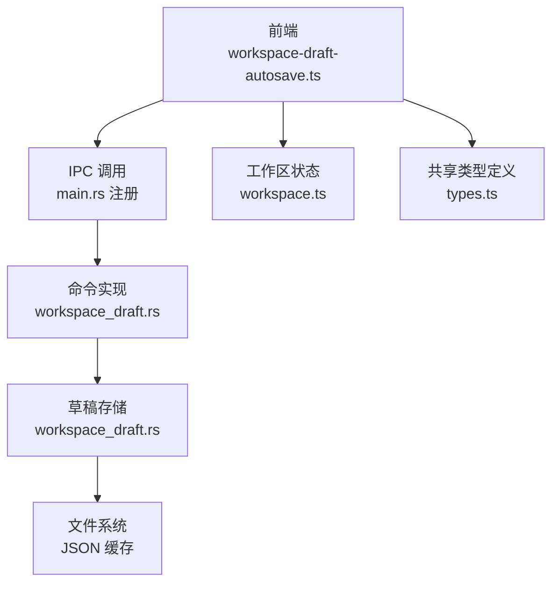
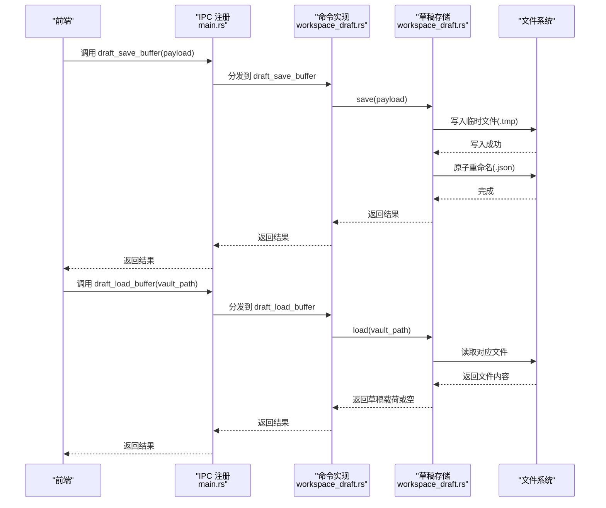
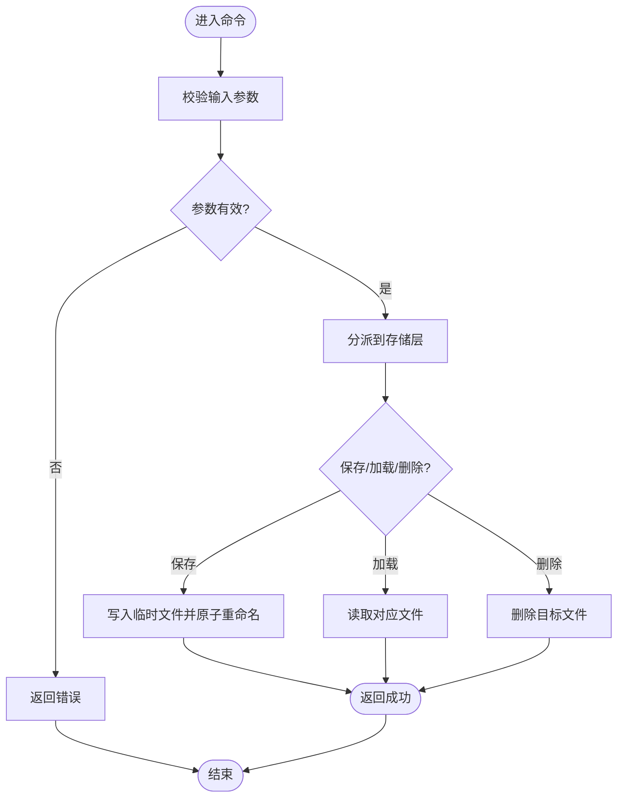
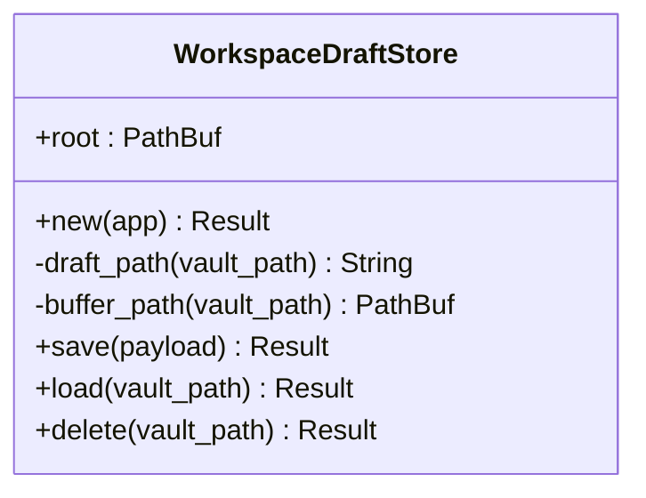
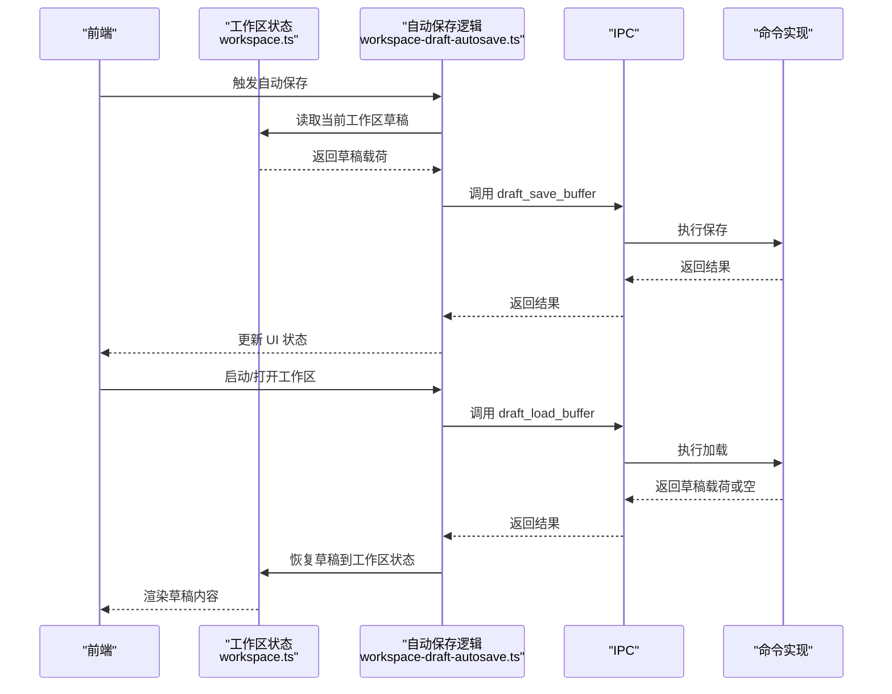
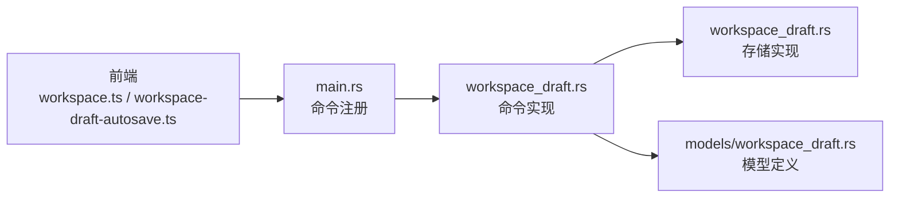

# 工作区草稿命令

<cite>
**本文档引用的文件**
- [src-tauri/src/commands/workspace_draft.rs](file://src-tauri/src/commands/workspace_draft.rs)
- [src-tauri/src/workspace_draft.rs](file://src-tauri/src/workspace_draft.rs)
- [src-tauri/src/models/workspace_draft.rs](file://src-tauri/src/models/workspace_draft.rs)
- [src-tauri/src/main.rs](file://src-tauri/src/main.rs)
- [src/core/session/workspace-draft-autosave.ts](file://src/core/session/workspace-draft-autosave.ts)
- [src/store/workspace.ts](file://src/store/workspace.ts)
- [src-tauri/src/commands/workspace.rs](file://src-tauri/src/commands/workspace.rs)
- [src/types.ts](file://src/types.ts)
</cite>

## 目录
1. [简介](#简介)
2. [项目结构](#项目结构)
3. [核心组件](#核心组件)
4. [架构概览](#架构概览)
5. [详细组件分析](#详细组件分析)
6. [依赖关系分析](#依赖关系分析)
7. [性能考量](#性能考量)
8. [故障排除指南](#故障排除指南)
9. [结论](#结论)
10. [附录](#附录)

## 简介
本文件系统化梳理了工作区草稿命令在 Tauri 后端与前端的完整实现，覆盖草稿创建、加载、删除等基础能力，以及草稿与工作区配置的关联关系、持久化存储机制、版本控制与合并策略的演进路径、权限控制与数据同步方案，并提供最佳实践、协作优化与扩展性建议。

## 项目结构
工作区草稿功能由三层组成：
- 前端层：通过 IPC 调用后端命令，负责草稿自动保存与恢复、与工作区状态联动。
- 后端命令层：暴露 draft_save_buffer/draft_load_buffer/draft_delete_buffer 三个命令，处理草稿的持久化与检索。
- 存储层：基于应用数据目录的本地 JSON 文件缓存，以 vault_path 的哈希作为文件名，确保唯一性与可寻址性。

**图表来源**
- [src-tauri/src/main.rs:92-95](file://src-tauri/src/main.rs#L92-L95)
- [src-tauri/src/commands/workspace_draft.rs:1-29](file://src-tauri/src/commands/workspace_draft.rs#L1-L29)
- [src-tauri/src/workspace_draft.rs:11-43](file://src-tauri/src/workspace_draft.rs#L11-L43)
- [src/core/session/workspace-draft-autosave.ts](file://src/core/session/workspace-draft-autosave.ts)
- [src/store/workspace.ts](file://src/store/workspace.ts)
- [src/types.ts:1-58](file://src/types.ts#L1-L58)

**章节来源**
- [src-tauri/src/main.rs:92-95](file://src-tauri/src/main.rs#L92-L95)
- [src-tauri/src/commands/workspace_draft.rs:1-29](file://src-tauri/src/commands/workspace_draft.rs#L1-L29)
- [src-tauri/src/workspace_draft.rs:11-43](file://src-tauri/src/workspace_draft.rs#L11-L43)
- [src/core/session/workspace-draft-autosave.ts](file://src/core/session/workspace-draft-autosave.ts)
- [src/store/workspace.ts](file://src/store/workspace.ts)
- [src/types.ts:1-58](file://src/types.ts#L1-L58)

## 核心组件
- 草稿命令接口
  - draft_save_buffer：保存草稿缓冲区内容到本地缓存。
  - draft_load_buffer：按 vault_path 加载对应草稿。
  - draft_delete_buffer：删除指定草稿文件。
- 草稿存储实现
  - 使用应用数据目录下的 drafts 子目录存放 JSON 缓存文件。
  - 以 vault_path 的哈希值命名文件，避免路径冲突并提升查找效率。
  - 写入采用临时文件 + 原子重命名，保证写入一致性。
- 类型与契约
  - WorkspaceDraftPayload：后端对齐的草稿载荷结构（字段与 Rust 结构一致）。
  - 共享类型：前端与后端字段形状保持一致，便于跨边界调用。

**章节来源**
- [src-tauri/src/commands/workspace_draft.rs:1-29](file://src-tauri/src/commands/workspace_draft.rs#L1-L29)
- [src-tauri/src/workspace_draft.rs:11-43](file://src-tauri/src/workspace_draft.rs#L11-L43)
- [src-tauri/src/models/workspace_draft.rs](file://src-tauri/src/models/workspace_draft.rs)
- [src/types.ts:1-58](file://src/types.ts#L1-L58)

## 架构概览
下图展示了从前端触发到后端执行再到文件系统落盘的完整链路，以及与工作区状态的交互。

**图表来源**
- [src-tauri/src/main.rs:92-95](file://src-tauri/src/main.rs#L92-L95)
- [src-tauri/src/commands/workspace_draft.rs:1-29](file://src-tauri/src/commands/workspace_draft.rs#L1-L29)
- [src-tauri/src/workspace_draft.rs:36-43](file://src-tauri/src/workspace_draft.rs#L36-L43)

## 详细组件分析

### 组件一：草稿命令实现
- 命令职责
  - draft_save_buffer：接收 WorkspaceDraftPayload，委托存储层进行保存。
  - draft_load_buffer：根据 vault_path 查找并返回草稿；若不存在返回空。
  - draft_delete_buffer：删除指定草稿文件。
- 错误处理
  - 统一映射为 NoteforgeError，便于前端捕获与提示。
- 数据契约
  - 前后端字段形状严格对齐，确保序列化/反序列化稳定。

**图表来源**
- [src-tauri/src/commands/workspace_draft.rs:1-29](file://src-tauri/src/commands/workspace_draft.rs#L1-L29)
- [src-tauri/src/workspace_draft.rs:36-43](file://src-tauri/src/workspace_draft.rs#L36-L43)

**章节来源**
- [src-tauri/src/commands/workspace_draft.rs:1-29](file://src-tauri/src/commands/workspace_draft.rs#L1-L29)

### 组件二：草稿存储实现
- 存储位置
  - 应用数据目录下的 drafts 子目录，首次使用时自动创建。
- 文件命名
  - 以 vault_path 的哈希值作为文件名，扩展名为 .json，避免路径问题与冲突。
- 写入策略
  - 先写入临时文件，再原子重命名为正式文件，防止部分写入导致的数据损坏。
- 读取与删除
  - 读取时按文件名匹配；删除时直接移除对应文件。

**图表来源**
- [src-tauri/src/workspace_draft.rs:11-43](file://src-tauri/src/workspace_draft.rs#L11-L43)

**章节来源**
- [src-tauri/src/workspace_draft.rs:11-43](file://src-tauri/src/workspace_draft.rs#L11-L43)

### 组件三：前端集成与自动保存
- 自动保存
  - 在用户编辑过程中定期将当前工作区草稿写入后端缓存，降低丢失风险。
- 恢复机制
  - 应用启动或打开工作区时，优先从缓存恢复草稿，提升用户体验。
- 与工作区状态联动
  - 与工作区视图、配置等状态协同，确保草稿与当前工作区上下文一致。

**图表来源**
- [src/core/session/workspace-draft-autosave.ts](file://src/core/session/workspace-draft-autosave.ts)
- [src/store/workspace.ts](file://src/store/workspace.ts)
- [src-tauri/src/commands/workspace_draft.rs:1-29](file://src-tauri/src/commands/workspace_draft.rs#L1-L29)

**章节来源**
- [src/core/session/workspace-draft-autosave.ts](file://src/core/session/workspace-draft-autosave.ts)
- [src/store/workspace.ts](file://src/store/workspace.ts)

### 组件四：与工作区配置的关联
- 工作区配置类型
  - WorkspaceConfig/WorkspaceBackendConfig/WorkspaceView 等类型定义前后端一致的结构。
- 工作区草稿与工作区的关系
  - 草稿以 vault_path 为键，与工作区中的文件路径一一对应；工作区配置影响索引与排除规则，间接影响草稿的可见范围。
- 前后端对齐
  - 类型字段名称与 Rust 结构保持一致，避免序列化差异带来的兼容性问题。

**章节来源**
- [src/types.ts:1-58](file://src/types.ts#L1-L58)
- [src-tauri/src/commands/workspace.rs:1-47](file://src-tauri/src/commands/workspace.rs#L1-L47)

## 依赖关系分析
- 命令注册
  - main.rs 中集中注册了工作区草稿相关命令，确保 IPC 层正确分发。
- 命令到存储的依赖
  - 三个命令均依赖 WorkspaceDraftStore 实例，体现清晰的职责分离。
- 前后端类型依赖
  - 前端共享类型与后端模型字段对齐，减少跨边界调用的适配成本。

**图表来源**
- [src-tauri/src/main.rs:92-95](file://src-tauri/src/main.rs#L92-L95)
- [src-tauri/src/commands/workspace_draft.rs:1-29](file://src-tauri/src/commands/workspace_draft.rs#L1-L29)
- [src-tauri/src/workspace_draft.rs:11-43](file://src-tauri/src/workspace_draft.rs#L11-L43)
- [src-tauri/src/models/workspace_draft.rs](file://src-tauri/src/models/workspace_draft.rs)
- [src/store/workspace.ts](file://src/store/workspace.ts)
- [src/core/session/workspace-draft-autosave.ts](file://src/core/session/workspace-draft-autosave.ts)

**章节来源**
- [src-tauri/src/main.rs:92-95](file://src-tauri/src/main.rs#L92-L95)
- [src-tauri/src/commands/workspace_draft.rs:1-29](file://src-tauri/src/commands/workspace_draft.rs#L1-L29)
- [src-tauri/src/workspace_draft.rs:11-43](file://src-tauri/src/workspace_draft.rs#L11-L43)
- [src-tauri/src/models/workspace_draft.rs](file://src-tauri/src/models/workspace_draft.rs)
- [src/store/workspace.ts](file://src/store/workspace.ts)
- [src/core/session/workspace-draft-autosave.ts](file://src/core/session/workspace-draft-autosave.ts)

## 性能考量
- I/O 行为
  - 写入采用临时文件 + 原子重命名，避免部分写入与并发读取冲突，提高可靠性。
- 命名策略
  - 以哈希命名文件，避免长路径与特殊字符问题，提升文件系统访问效率。
- 前端策略
  - 自动保存应避免过于频繁的写入，建议结合节流/防抖策略，平衡数据安全与性能。
- 可扩展性
  - 当前实现为单机 JSON 缓存；如需多设备同步，可在存储层引入版本号与合并策略，或替换为分布式存储。

## 故障排除指南
- 常见错误类型
  - IO 错误：磁盘空间不足、权限不足、路径不可写。
  - JSON 序列化/反序列化错误：载荷结构不匹配或字段缺失。
  - 参数错误：vault_path 为空或格式异常。
- 排查步骤
  - 检查应用数据目录是否存在且可写。
  - 验证 WorkspaceDraftPayload 字段是否与后端模型一致。
  - 确认 vault_path 是否有效且唯一。
- 建议
  - 在前端增加输入校验与容错提示。
  - 对写入失败进行重试与降级处理（例如回退到内存缓存）。

**章节来源**
- [src-tauri/src/workspace_draft.rs:36-43](file://src-tauri/src/workspace_draft.rs#L36-L43)
- [src-tauri/src/commands/workspace_draft.rs:1-29](file://src-tauri/src/commands/workspace_draft.rs#L1-L29)

## 结论
工作区草稿命令通过简洁的三层设计实现了可靠的本地草稿持久化：前端负责触发与恢复，命令层负责编排，存储层提供原子写入保障。当前实现聚焦于单机可靠性与易用性，后续可在版本控制、合并策略与多端同步方面进一步演进，以满足更复杂的协作需求。

## 附录

### A. 数据结构与版本控制机制
- 草稿载荷
  - WorkspaceDraftPayload：承载草稿内容与元信息，字段与后端模型对齐。
- 版本控制与合并策略
  - 当前未实现内置版本号与合并算法；建议引入草稿版本号与时间戳，在冲突时提供“保留本地/保留远程/手动合并”等策略。
- 一致性保证
  - 通过原子重命名与临时文件机制，确保写入过程的一致性与可恢复性。

**章节来源**
- [src-tauri/src/models/workspace_draft.rs](file://src-tauri/src/models/workspace_draft.rs)
- [src-tauri/src/workspace_draft.rs:36-43](file://src-tauri/src/workspace_draft.rs#L36-L43)

### B. 权限控制与数据同步方案
- 权限控制
  - 仅允许当前应用访问其数据目录；可通过操作系统权限与沙箱策略进一步加固。
- 数据同步
  - 单机场景：无需同步；多机场景：建议引入版本号、时间戳与合并策略，或接入云存储/分布式数据库。

**章节来源**
- [src-tauri/src/workspace_draft.rs:16-24](file://src-tauri/src/workspace_draft.rs#L16-L24)

### C. 最佳实践与协作优化
- 最佳实践
  - 自动保存：设置合理的保存间隔，避免频繁 I/O。
  - 输入校验：在前端对 vault_path 进行合法性检查。
  - 错误处理：统一捕获 NoteforgeError 并给出明确提示。
- 协作优化
  - 引入草稿版本号与冲突检测，支持多人协作时的并行编辑。
  - 提供“草稿历史”面板，便于回溯与选择。

**章节来源**
- [src/core/session/workspace-draft-autosave.ts](file://src/core/session/workspace-draft-autosave.ts)
- [src-tauri/src/commands/workspace_draft.rs:1-29](file://src-tauri/src/commands/workspace_draft.rs#L1-L29)

### D. 使用场景示例
- 场景一：新建工作区后自动保存初始草稿
  - 前端在创建完成后立即调用 draft_save_buffer，确保新工作区的初始状态被持久化。
- 场景二：应用重启后恢复草稿
  - 启动时调用 draft_load_buffer，若存在则恢复到当前工作区状态。
- 场景三：清理无用草稿
  - 在工作区关闭或文件删除后调用 draft_delete_buffer，释放存储空间。

**章节来源**
- [src-tauri/src/commands/workspace_draft.rs:1-29](file://src-tauri/src/commands/workspace_draft.rs#L1-L29)
- [src/core/session/workspace-draft-autosave.ts](file://src/core/session/workspace-draft-autosave.ts)