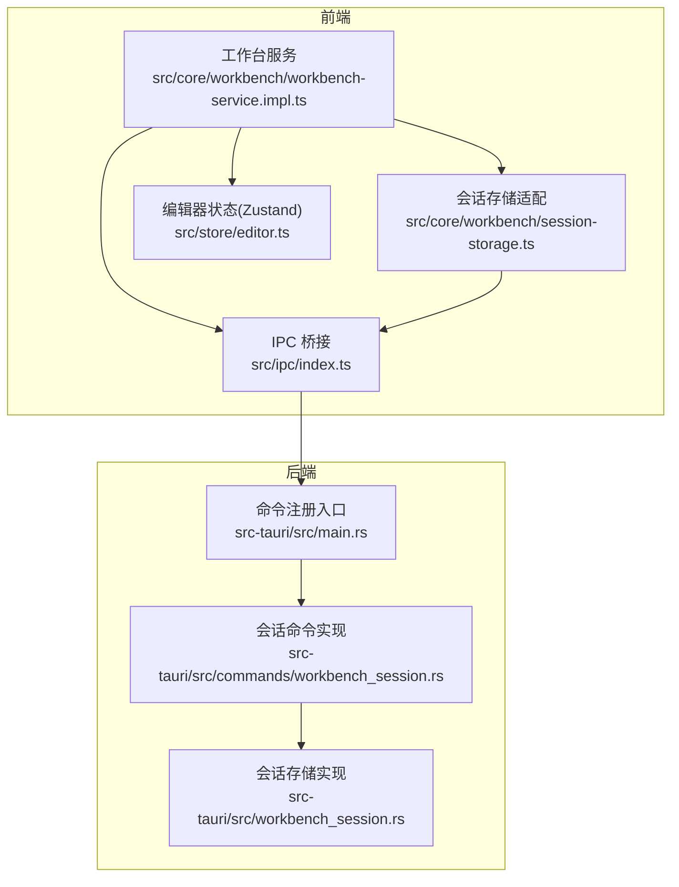
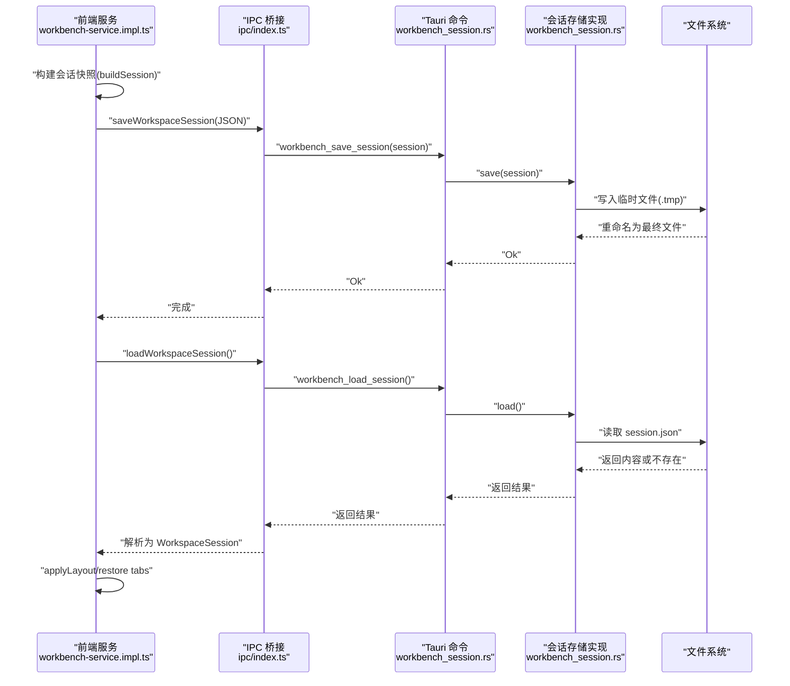
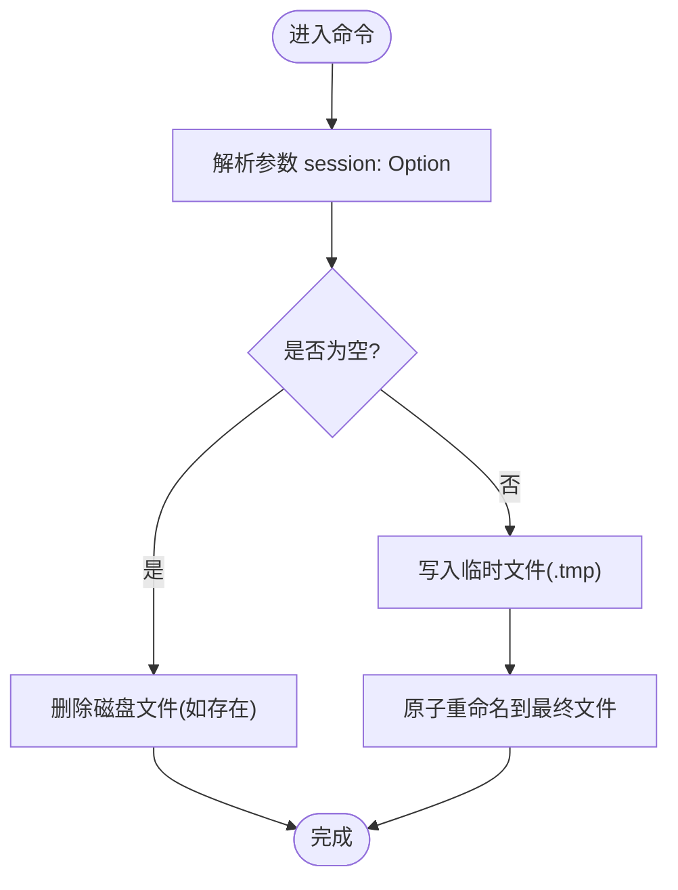
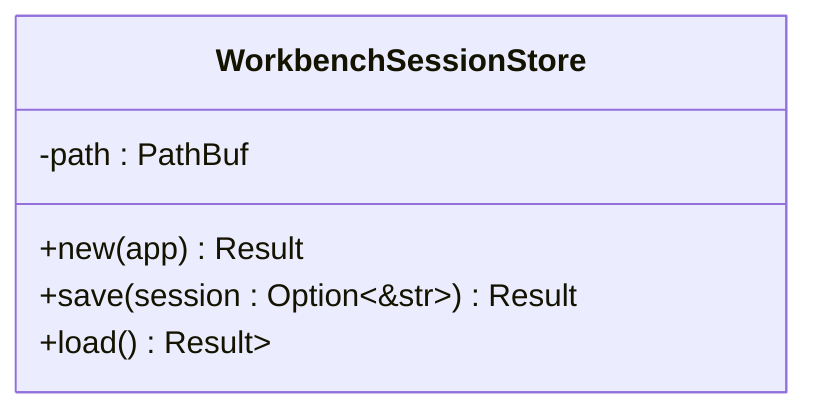
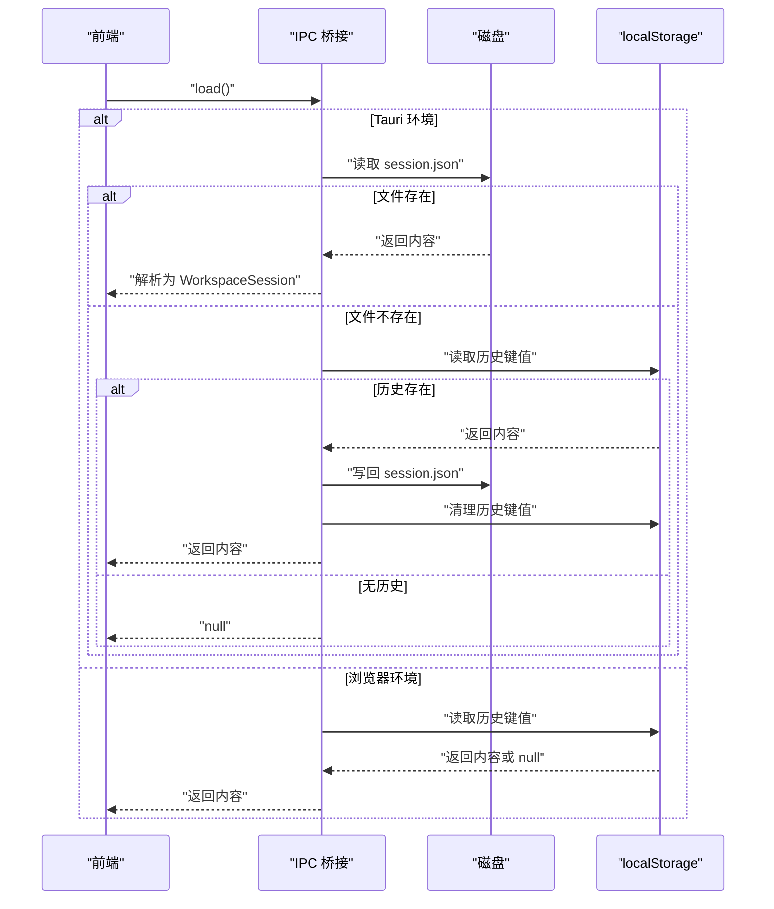
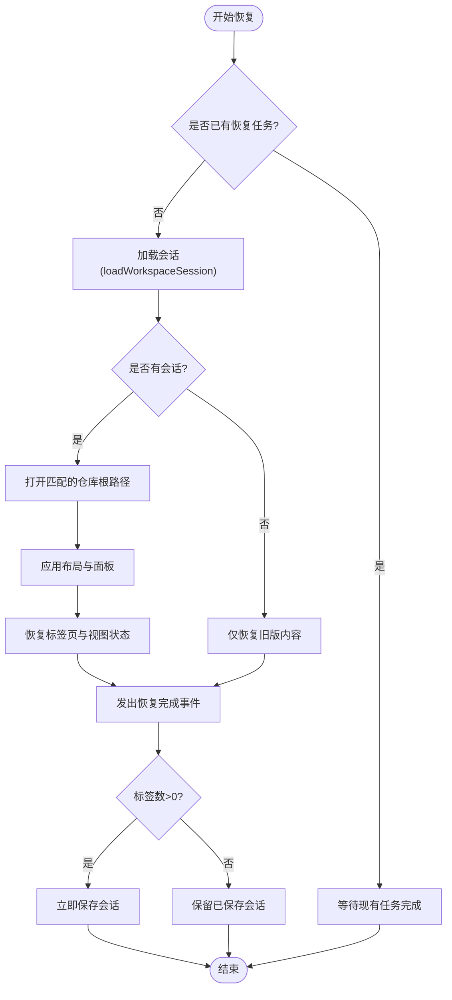
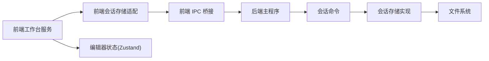

# 工作台会话命令

<cite>
**本文引用的文件**
- [src-tauri/src/commands/workbench_session.rs](file://src-tauri/src/commands/workbench_session.rs)
- [src-tauri/src/workbench_session.rs](file://src-tauri/src/workbench_session.rs)
- [src-tauri/src/main.rs](file://src-tauri/src/main.rs)
- [src/ipc/index.ts](file://src/ipc/index.ts)
- [src/core/workbench/session-storage.ts](file://src/core/workbench/session-storage.ts)
- [src/core/workbench/workbench-service.impl.ts](file://src/core/workbench/workbench-service.impl.ts)
- [src/store/editor.ts](file://src/store/editor.ts)
</cite>

## 目录
1. [简介](#简介)
2. [项目结构](#项目结构)
3. [核心组件](#核心组件)
4. [架构总览](#架构总览)
5. [详细组件分析](#详细组件分析)
6. [依赖关系分析](#依赖关系分析)
7. [性能考量](#性能考量)
8. [故障排查指南](#故障排查指南)
9. [结论](#结论)
10. [附录](#附录)

## 简介
本文件围绕“工作台会话命令”展开，系统性梳理与工作台会话相关的 Tauri 命令实现，涵盖会话创建、状态管理、数据同步、会话恢复、生命周期与持久化、并发控制与异常恢复、会话隔离与数据安全、性能优化与最佳实践等内容，并提供可操作的使用场景与示例。

## 项目结构
工作台会话命令涉及前端 IPC 桥接、后端 Tauri 命令与存储实现、以及前端会话构建与恢复逻辑。整体分层如下：
- 前端 IPC 层：统一调用入口，区分 Tauri 环境与浏览器环境，封装 invoke 调用与错误处理。
- 后端命令层：暴露 workbench_save_session 与 workbench_load_session 两个命令。
- 存储层：以 JSON 文件形式持久化工作台会话，支持临时文件写入与原子重命名。
- 前端服务层：负责构建会话快照、调度保存与恢复、事件通知与并发控制。

图表来源
- [src-tauri/src/main.rs:76-102](file://src-tauri/src/main.rs#L76-L102)
- [src-tauri/src/commands/workbench_session.rs:1-19](file://src-tauri/src/commands/workbench_session.rs#L1-L19)
- [src-tauri/src/workbench_session.rs:1-53](file://src-tauri/src/workbench_session.rs#L1-L53)
- [src/ipc/index.ts:1-105](file://src/ipc/index.ts#L1-L105)
- [src/core/workbench/session-storage.ts:1-74](file://src/core/workbench/session-storage.ts#L1-L74)
- [src/core/workbench/workbench-service.impl.ts:260-432](file://src/core/workbench/workbench-service.impl.ts#L260-L432)
- [src/store/editor.ts:256-304](file://src/store/editor.ts#L256-L304)

章节来源
- [src-tauri/src/main.rs:76-102](file://src-tauri/src/main.rs#L76-L102)
- [src-tauri/src/commands/workbench_session.rs:1-19](file://src-tauri/src/commands/workbench_session.rs#L1-L19)
- [src-tauri/src/workbench_session.rs:1-53](file://src-tauri/src/workbench_session.rs#L1-L53)
- [src/ipc/index.ts:1-105](file://src/ipc/index.ts#L1-L105)
- [src/core/workbench/session-storage.ts:1-74](file://src/core/workbench/session-storage.ts#L1-L74)
- [src/core/workbench/workbench-service.impl.ts:260-432](file://src/core/workbench/workbench-service.impl.ts#L260-L432)
- [src/store/editor.ts:256-304](file://src/store/editor.ts#L256-L304)

## 核心组件
- Tauri 会话命令
  - workbench_save_session：保存会话 JSON；接收可选字符串参数，空值表示删除磁盘上的会话文件。
  - workbench_load_session：加载会话 JSON；返回可选字符串。
- 会话存储实现
  - 使用应用数据目录下的 workbench/session.json 持久化。
  - 采用临时文件写入 + 原子重命名，确保写入一致性。
- 前端 IPC 适配
  - 统一通过 isTauri 判断运行环境，调用 @tauri-apps/api/core.invoke 或回退到 stub。
  - 对 invoke 失败进行 IpcError 包装，便于前端捕获与展示。
- 会话存储适配
  - 前端优先从磁盘加载；若无则回退到本地历史键值（兼容迁移）。
  - 保存时若成功写入磁盘，则清理本地历史键值。
- 工作台服务
  - 构建会话快照（版本号、当前仓库上下文、布局、面板、活动面板等）。
  - 恢复会话时按布局重建面板与标签页，必要时打开对应仓库。
  - 提供调度保存（防抖）、立即保存、暂停保存等能力，避免并发冲突。
- 编辑器状态
  - 通过 Zustand 管理面板、标签页、活动面板等状态，变更时触发会话保存调度。

章节来源
- [src-tauri/src/commands/workbench_session.rs:1-19](file://src-tauri/src/commands/workbench_session.rs#L1-L19)
- [src-tauri/src/workbench_session.rs:1-53](file://src-tauri/src/workbench_session.rs#L1-L53)
- [src/ipc/index.ts:1-105](file://src/ipc/index.ts#L1-L105)
- [src/core/workbench/session-storage.ts:1-74](file://src/core/workbench/session-storage.ts#L1-L74)
- [src/core/workbench/workbench-service.impl.ts:260-432](file://src/core/workbench/workbench-service.impl.ts#L260-L432)
- [src/store/editor.ts:256-304](file://src/store/editor.ts#L256-L304)

## 架构总览
下图展示了从前端发起会话保存/加载请求，到后端存储实现与前端恢复流程的整体交互。

图表来源
- [src/core/workbench/workbench-service.impl.ts:260-432](file://src/core/workbench/workbench-service.impl.ts#L260-L432)
- [src/core/workbench/session-storage.ts:1-74](file://src/core/workbench/session-storage.ts#L1-74)
- [src-tauri/src/commands/workbench_session.rs:1-19](file://src-tauri/src/commands/workbench_session.rs#L1-L19)
- [src-tauri/src/workbench_session.rs:1-53](file://src-tauri/src/workbench_session.rs#L1-L53)
- [src/ipc/index.ts:1-105](file://src/ipc/index.ts#L1-L105)

## 详细组件分析

### Tauri 会话命令
- 命令定义
  - workbench_save_session：接收可选字符串，调用存储实现保存；空值表示删除磁盘文件。
  - workbench_load_session：返回可选字符串；若文件不存在则返回空。
- 错误处理
  - 命令层统一返回 NoteforgeError；前端通过 IPC 桥接转换为 IpcError。
- 注册入口
  - 在主程序中集中注册，确保命令可用。

图表来源
- [src-tauri/src/commands/workbench_session.rs:1-19](file://src-tauri/src/commands/workbench_session.rs#L1-L19)
- [src-tauri/src/workbench_session.rs:26-46](file://src-tauri/src/workbench_session.rs#L26-L46)

章节来源
- [src-tauri/src/commands/workbench_session.rs:1-19](file://src-tauri/src/commands/workbench_session.rs#L1-L19)
- [src-tauri/src/main.rs:76-102](file://src-tauri/src/main.rs#L76-L102)

### 会话存储实现
- 路径与初始化
  - 应用数据目录下创建 workbench/session.json；首次使用自动创建目录。
- 写入策略
  - 先写临时文件，再原子重命名，避免部分写入导致的数据损坏。
- 读取策略
  - 若文件不存在返回空；存在则读取完整 JSON。
- 生命周期
  - 由应用管理器注入，贯穿应用生命周期。

图表来源
- [src-tauri/src/workbench_session.rs:1-53](file://src-tauri/src/workbench_session.rs#L1-L53)

章节来源
- [src-tauri/src/workbench_session.rs:1-53](file://src-tauri/src/workbench_session.rs#L1-L53)

### 前端 IPC 与会话存储适配
- 环境检测与调用
  - isTauri 判断是否在 Tauri 环境；否则走 stub 回退。
  - 调用 invoke 并对异常包装为 IpcError。
- 会话加载
  - 优先从磁盘加载；若无则回退到本地历史键值（兼容迁移），并将成功结果写回磁盘。
- 会话保存
  - 将序列化后的 JSON 写入磁盘；若传入空值则删除磁盘文件；同时清理本地历史键值。

图表来源
- [src/core/workbench/session-storage.ts:16-35](file://src/core/workbench/session-storage.ts#L16-L35)
- [src/core/workbench/session-storage.ts:37-55](file://src/core/workbench/session-storage.ts#L37-L55)
- [src/ipc/index.ts:59-83](file://src/ipc/index.ts#L59-L83)

章节来源
- [src/core/workbench/session-storage.ts:1-74](file://src/core/workbench/session-storage.ts#L1-L74)
- [src/ipc/index.ts:1-105](file://src/ipc/index.ts#L1-L105)

### 工作台服务与会话恢复
- 会话构建
  - 版本号、当前仓库上下文、布局、面板列表、活动面板等。
- 会话恢复
  - 若未找到会话，尝试仅恢复旧版内容；若找到会话，按布局重建面板与标签页。
  - 如需，先打开对应的仓库根路径，再恢复标签页与视图状态。
  - 恢复完成后发出事件通知，并根据当前标签数量决定是否立即保存。
- 并发控制
  - 使用恢复中的标志位与保存调度器，避免并发写入与竞态。
  - 提供暂停保存、立即保存、定时保存等策略。

图表来源
- [src/core/workbench/workbench-service.impl.ts:271-375](file://src/core/workbench/workbench-service.impl.ts#L271-L375)
- [src/core/workbench/workbench-service.impl.ts:377-415](file://src/core/workbench/workbench-service.impl.ts#L377-L415)

章节来源
- [src/core/workbench/workbench-service.impl.ts:260-432](file://src/core/workbench/workbench-service.impl.ts#L260-L432)

### 编辑器状态与会话联动
- 状态管理
  - Zustand 管理面板、标签页、活动面板、光标状态等。
- 会话联动
  - 关闭面板、切换活动面板、移动标签等操作均会触发会话保存调度。
  - 通过 scheduleSessionPersist 定时器合并多次变更，降低写入频率。

章节来源
- [src/store/editor.ts:256-304](file://src/store/editor.ts#L256-L304)

## 依赖关系分析
- 前端依赖
  - IPC 桥接依赖 @tauri-apps/api/core；在非 Tauri 环境下回退至 stub。
  - 会话存储适配依赖 IPC 桥接与本地存储。
  - 工作台服务依赖会话存储适配、编辑器状态与事件总线。
- 后端依赖
  - 命令依赖存储实现；存储实现依赖文件系统。
  - 主程序集中注册命令，保证运行时可用。

图表来源
- [src-tauri/src/main.rs:76-102](file://src-tauri/src/main.rs#L76-L102)
- [src-tauri/src/commands/workbench_session.rs:1-19](file://src-tauri/src/commands/workbench_session.rs#L1-L19)
- [src-tauri/src/workbench_session.rs:1-53](file://src-tauri/src/workbench_session.rs#L1-L53)
- [src/ipc/index.ts:1-105](file://src/ipc/index.ts#L1-L105)
- [src/core/workbench/session-storage.ts:1-74](file://src/core/workbench/session-storage.ts#L1-L74)
- [src/core/workbench/workbench-service.impl.ts:260-432](file://src/core/workbench/workbench-service.impl.ts#L260-L432)
- [src/store/editor.ts:256-304](file://src/store/editor.ts#L256-L304)

章节来源
- [src-tauri/src/main.rs:76-102](file://src-tauri/src/main.rs#L76-L102)
- [src-tauri/src/commands/workbench_session.rs:1-19](file://src-tauri/src/commands/workbench_session.rs#L1-L19)
- [src-tauri/src/workbench_session.rs:1-53](file://src-tauri/src/workbench_session.rs#L1-L53)
- [src/ipc/index.ts:1-105](file://src/ipc/index.ts#L1-L105)
- [src/core/workbench/session-storage.ts:1-74](file://src/core/workbench/session-storage.ts#L1-L74)
- [src/core/workbench/workbench-service.impl.ts:260-432](file://src/core/workbench/workbench-service.impl.ts#L260-L432)
- [src/store/editor.ts:256-304](file://src/store/editor.ts#L256-L304)

## 性能考量
- 写入优化
  - 采用临时文件 + 原子重命名，避免部分写入与锁竞争。
  - 前端通过定时器合并多次变更，减少频繁写入。
- 读取优化
  - 优先从磁盘读取；若无则回退本地历史键值，减少 IO 成本。
- 内存与状态
  - 会话快照仅包含必要字段，避免冗余数据。
  - 恢复时按布局重建，避免逐项重建带来的额外开销。
- 并发控制
  - 恢复与保存互斥，防止竞态；保存调度器合并高频变更。

[本节为通用性能建议，不直接分析具体文件，故无章节来源]

## 故障排查指南
- 常见问题
  - 无法保存会话：检查磁盘写权限与空间；确认临时文件写入与重命名流程是否成功。
  - 加载会话失败：确认 session.json 是否存在且为有效 JSON；检查历史键值迁移是否成功。
  - 恢复异常：查看恢复过程中的仓库打开与标签页恢复日志；确认事件是否正确发出。
- 排查步骤
  - 启用详细日志，定位命令执行与存储读写阶段。
  - 检查 IPC 桥接的 isTauri 判定与错误包装。
  - 验证前端会话构建与恢复流程的关键节点。
- 异常恢复
  - 恢复失败时保持现有状态不变；若无标签页则保留已保存会话。
  - 保存失败时记录错误并忽略，避免阻塞用户操作。

章节来源
- [src-tauri/src/workbench_session.rs:26-46](file://src-tauri/src/workbench_session.rs#L26-L46)
- [src/core/workbench/session-storage.ts:16-35](file://src/core/workbench/session-storage.ts#L16-L35)
- [src/core/workbench/workbench-service.impl.ts:359-371](file://src/core/workbench/workbench-service.impl.ts#L359-L371)
- [src/ipc/index.ts:66-83](file://src/ipc/index.ts#L66-L83)

## 结论
工作台会话命令通过前后端协同，实现了可靠的会话持久化与恢复能力。后端采用原子写入保障数据一致性，前端通过调度与兼容策略提升用户体验。结合并发控制与异常恢复机制，系统在复杂场景下仍能保持稳定与可用。后续可在会话粒度与增量更新方面进一步优化，以满足更高性能需求。

[本节为总结性内容，不直接分析具体文件，故无章节来源]

## 附录

### 会话生命周期与状态流转
- 创建：构建会话快照（版本、仓库上下文、布局、面板、活动面板）。
- 持久化：保存到磁盘或本地存储；必要时清理历史键值。
- 恢复：加载会话，应用布局与面板，恢复标签页与视图状态；发出恢复完成事件。
- 清理：关闭应用或清空会话时删除磁盘文件。

章节来源
- [src/core/workbench/workbench-service.impl.ts:260-432](file://src/core/workbench/workbench-service.impl.ts#L260-L432)
- [src/core/workbench/session-storage.ts:1-74](file://src/core/workbench/session-storage.ts#L1-L74)
- [src-tauri/src/workbench_session.rs:1-53](file://src-tauri/src/workbench_session.rs#L1-L53)

### 使用场景与示例
- 场景一：应用启动时自动恢复上次工作台布局与标签页
  - 前端在初始化阶段调用加载与恢复流程；若无会话则回退到旧版内容。
- 场景二：用户手动保存当前工作台状态
  - 前端构建会话快照并通过 IPC 调用保存命令；后端写入磁盘。
- 场景三：多窗口或多实例隔离
  - 当前实现为单实例会话；若需多实例隔离，可在存储路径中加入实例标识或采用命名空间策略。

章节来源
- [src/core/workbench/workbench-service.impl.ts:271-375](file://src/core/workbench/workbench-service.impl.ts#L271-L375)
- [src/core/workbench/session-storage.ts:16-35](file://src/core/workbench/session-storage.ts#L16-L35)
- [src-tauri/src/commands/workbench_session.rs:1-19](file://src-tauri/src/commands/workbench_session.rs#L1-L19)