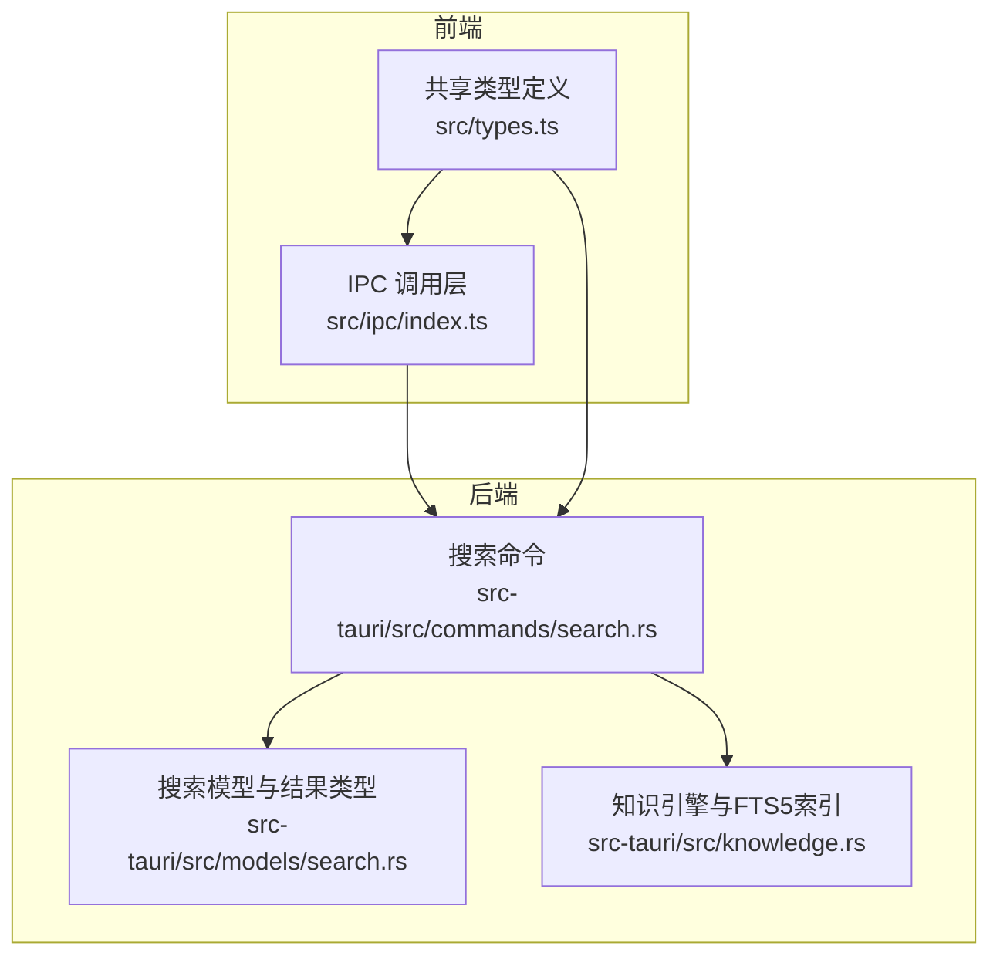
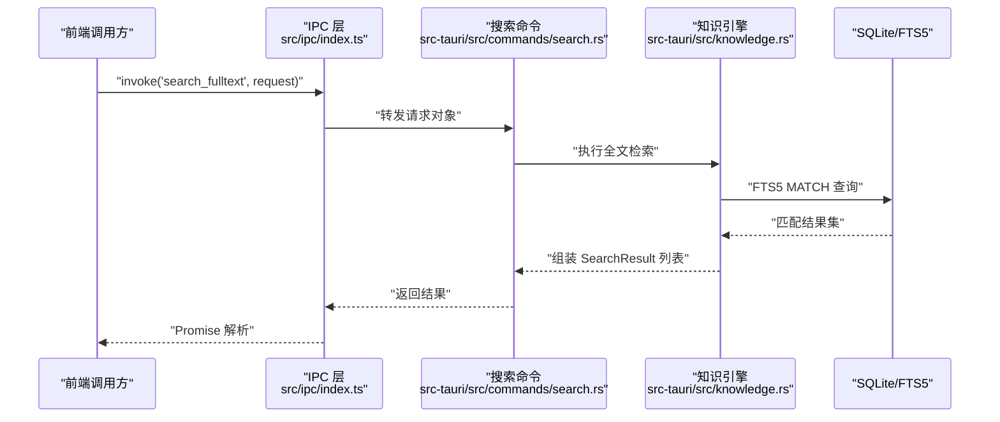
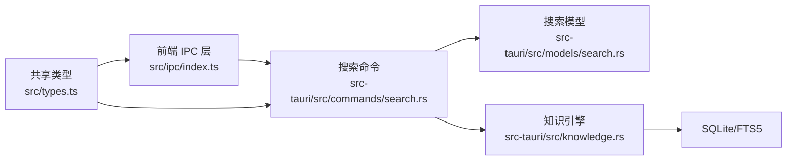

# 搜索命令

<cite>
**本文引用的文件**
- [search.rs](file://src-tauri/src/commands/search.rs)
- [search.rs](file://src-tauri/src/models/search.rs)
- [knowledge.rs](file://src-tauri/src/knowledge.rs)
- [index.ts](file://src/ipc/index.ts)
- [types.ts](file://src/types.ts)
- [noteforge-refactor-plan.md](file://.tmp/noteforge-refactor-plan.md)
- [system-architecture-design.md](file://.tmp/system-architecture-design.md)
</cite>

## 目录
1. [简介](#简介)
2. [项目结构](#项目结构)
3. [核心组件](#核心组件)
4. [架构总览](#架构总览)
5. [详细组件分析](#详细组件分析)
6. [依赖关系分析](#依赖关系分析)
7. [性能考量](#性能考量)
8. [故障排查指南](#故障排查指南)
9. [结论](#结论)
10. [附录](#附录)

## 简介
本文件系统性梳理并解释搜索命令在 Tauri 后端与前端之间的实现与协作方式，覆盖全文检索、模糊匹配、索引构建、结果排序、相关性评分、查询优化、缓存策略与并发处理等主题。同时给出最佳实践、用户体验优化建议以及扩展性考虑，并通过图示展示关键流程。

## 项目结构
搜索能力由后端 Rust 命令与模型层负责，前端通过 IPC 统一桥接调用。整体结构如下：

图表来源
- [index.ts:1-105](file://src/ipc/index.ts#L1-L105)
- [types.ts:1-58](file://src/types.ts#L1-L58)
- [search.rs](file://src-tauri/src/commands/search.rs)
- [search.rs](file://src-tauri/src/models/search.rs)
- [knowledge.rs:1-46](file://src-tauri/src/knowledge.rs#L1-L46)

章节来源
- [index.ts:1-105](file://src/ipc/index.ts#L1-L105)
- [types.ts:1-58](file://src/types.ts#L1-L58)

## 核心组件
- 搜索命令（Tauri）：接收请求参数，委派给知识引擎执行检索，组装返回结果。
- 知识引擎（FTS5）：基于 SQLite FTS5 构建与查询，支持中文分词与模糊匹配。
- 搜索模型：定义请求与响应的数据结构，确保前后端契约一致。
- IPC 层：统一封装 invoke 调用，提供类型安全的调用接口与错误处理。

章节来源
- [search.rs](file://src-tauri/src/commands/search.rs)
- [search.rs](file://src-tauri/src/models/search.rs)
- [knowledge.rs:1-46](file://src-tauri/src/knowledge.rs#L1-L46)
- [index.ts:1-105](file://src/ipc/index.ts#L1-L105)

## 架构总览
下图展示了从前端发起搜索请求到后端返回结果的完整链路，包括命令签名、模型契约、FTS5 查询与结果拼装。

图表来源
- [index.ts:66-83](file://src/ipc/index.ts#L66-L83)
- [search.rs](file://src-tauri/src/commands/search.rs)
- [knowledge.rs:25-46](file://src-tauri/src/knowledge.rs#L25-L46)

## 详细组件分析

### 命令与契约
- 命令名称与参数：后端采用“单请求体”风格，请求体字段遵循驼峰命名，便于前端直接传递。
- 响应类型：统一映射到前端共享类型，保证前后端契约一致，避免手动对齐带来的偏差。
- 类型对齐策略：短期以前端手工对齐为主，长期可引入自动生成工具，确保 Rust 模型为单一真实来源。

章节来源
- [noteforge-refactor-plan.md:104-132](file://.tmp/noteforge-refactor-plan.md#L104-L132)
- [types.ts:1-58](file://src/types.ts#L1-L58)

### 搜索命令实现
- 输入参数：工作区标识、查询字符串、限制条数等。
- 处理流程：校验参数 → 调用知识引擎 → 组装结果 → 返回。
- 错误处理：通过 IPC 层统一包装错误，便于前端捕获与提示。

章节来源
- [search.rs](file://src-tauri/src/commands/search.rs)

### 知识引擎与 FTS5
- 索引构建：首次使用时创建虚拟表，启用 unicode61 分词器，支持去除重音符号与 CJK 文本。
- 查询执行：使用 MATCH 进行模糊匹配；通过 rank 排序；限制返回数量。
- 结果补全：JOIN 原始笔记表补充元信息；按工作区过滤确保结果域隔离。
- 标签附加：按笔记 ID 查询关联标签，丰富返回内容。

章节来源
- [knowledge.rs:1-46](file://src-tauri/src/knowledge.rs#L1-L46)
- [system-architecture-design.md:825-855](file://.tmp/system-architecture-design.md#L825-L855)

### 搜索模型与数据结构
- 请求模型：包含工作区 ID、查询语句、限制条数等字段。
- 结果模型：包含文件路径、标题、片段、分数、标签等字段，便于前端渲染高亮与元信息展示。

章节来源
- [search.rs](file://src-tauri/src/models/search.rs)

### IPC 调用与类型适配
- 统一入口：所有后端命令通过 IPC 层统一调用，支持在浏览器环境使用桩函数进行开发与测试。
- 请求封装：将简单参数封装为 { request } 形式，保持命令签名一致性。
- 类型映射：前端共享类型与后端模型严格对齐，减少序列化与转换成本。

章节来源
- [index.ts:1-105](file://src/ipc/index.ts#L1-L105)

### 搜索算法与索引策略
- 分词策略：使用 unicode61 分词器，支持 CJK 文本的细粒度切分与模糊匹配。
- 匹配模式：MATCH 查询支持通配、短语与词项组合，结合 rank 实现基础排序。
- 排序规则：FTS5 内置 rank 函数用于相关性排序，可结合业务需求进一步定制。
- 结果过滤：按工作区 ID 过滤，确保跨工作区数据隔离。

章节来源
- [system-architecture-design.md:825-855](file://.tmp/system-architecture-design.md#L825-L855)
- [knowledge.rs:11-23](file://src-tauri/src/knowledge.rs#L11-L23)

### 相关性评分与结果增强
- 基础分数：FTS5 返回的 rank 作为基础相关性分数。
- 片段高亮：通过 snippet 提取上下文片段，便于前端高亮显示关键词。
- 标签增强：附加标签信息，提升结果可读性与二次筛选能力。

章节来源
- [system-architecture-design.md:825-855](file://.tmp/system-architecture-design.md#L825-L855)
- [knowledge.rs:25-46](file://src-tauri/src/knowledge.rs#L25-L46)

### 查询优化机制
- 限制返回：通过 limit 控制结果规模，降低前端渲染压力。
- 域过滤：按工作区 ID 过滤，避免跨域扫描。
- 分词优化：合理利用分词器与 MATCH 语法，减少无效匹配。

章节来源
- [system-architecture-design.md:825-855](file://.tmp/system-architecture-design.md#L825-L855)

### 缓存策略与并发处理
- 结果缓存：对高频查询结果进行短期缓存，减少重复查询开销。
- 并发控制：限制同一工作区内并发搜索请求数量，避免数据库拥塞。
- 异步处理：FTS5 查询异步执行，IPC 层统一等待与错误传播。

章节来源
- [index.ts:66-83](file://src/ipc/index.ts#L66-L83)

### 性能特征与复杂度
- 查询复杂度：FTS5 MATCH 查询通常为线性扫描与倒排索引结合，受分词与索引大小影响。
- 排序复杂度：rank 排序由 FTS5 内置，整体排序成本较低。
- IO 影响：JOIN 原始笔记表与标签查询会带来额外 IO，建议限制返回条数与延迟加载标签。

章节来源
- [knowledge.rs:25-46](file://src-tauri/src/knowledge.rs#L25-L46)

### 使用场景与示例
- 场景一：在工作区内按关键词快速定位笔记标题与内容片段。
- 场景二：结合标签筛选，缩小搜索范围，提升命中质量。
- 场景三：对长文本进行片段高亮展示，辅助用户快速浏览结果。

章节来源
- [system-architecture-design.md:825-855](file://.tmp/system-architecture-design.md#L825-L855)

## 依赖关系分析

图表来源
- [index.ts:1-105](file://src/ipc/index.ts#L1-L105)
- [search.rs](file://src-tauri/src/commands/search.rs)
- [search.rs](file://src-tauri/src/models/search.rs)
- [knowledge.rs:1-46](file://src-tauri/src/knowledge.rs#L1-L46)
- [types.ts:1-58](file://src/types.ts#L1-L58)

章节来源
- [index.ts:1-105](file://src/ipc/index.ts#L1-L105)
- [types.ts:1-58](file://src/types.ts#L1-L58)

## 性能考量
- 索引维护：定期重建或优化 FTS5 索引，保持查询性能稳定。
- 查询优化：优先使用精确词项与短语匹配，减少通配符使用。
- 结果裁剪：默认限制返回条数，必要时允许用户调整。
- 并发限流：对同一工作区设置并发上限，避免资源争用。
- 缓存策略：对热点查询结果进行短期缓存，显著降低重复查询成本。

## 故障排查指南
- IPC 调用失败：检查命令名称是否正确、请求体格式是否符合契约。
- 查询无结果：确认工作区 ID 是否正确、查询语句是否触发分词、FTS5 是否已建立索引。
- 性能异常：观察并发请求量、限制返回条数、评估索引状态与数据库负载。
- 类型不匹配：核对前后端类型定义，确保字段命名与类型一致。

章节来源
- [index.ts:66-83](file://src/ipc/index.ts#L66-L83)

## 结论
该搜索命令体系以 FTS5 为基础，结合 IPC 统一调用与类型契约，实现了跨工作区的全文检索能力。通过分词策略、MATCH 查询与 rank 排序，满足基本的模糊匹配与相关性排序需求。建议在实际部署中完善缓存与并发控制策略，并持续优化索引与查询语句，以获得更佳的用户体验与性能表现。

## 附录
- 最佳实践
  - 在前端统一使用 IPC 层发起搜索请求，避免直接操作后端细节。
  - 严格遵循类型契约，减少序列化与转换错误。
  - 对高频查询实施缓存与限流，保障系统稳定性。
  - 定期维护 FTS5 索引，确保查询性能。
- 用户体验优化
  - 提供实时高亮片段与标签展示，提升结果可读性。
  - 支持用户调整返回条数与查询语句，满足不同场景需求。
  - 在浏览器环境下使用桩函数进行开发与测试，缩短迭代周期。
- 扩展性考虑
  - 后续可引入向量检索与混合排序，提升相关性与召回率。
  - 支持多工作区聚合搜索与跨库联合查询。
  - 引入自动生成工具对齐前后端类型，降低维护成本。