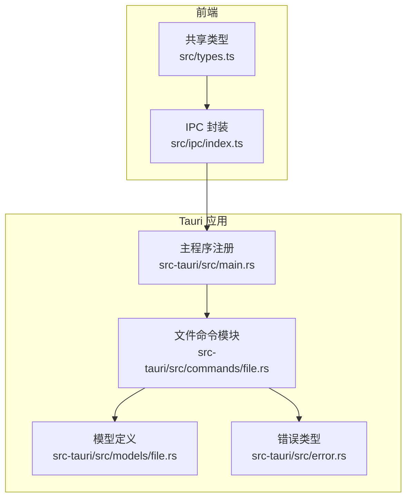
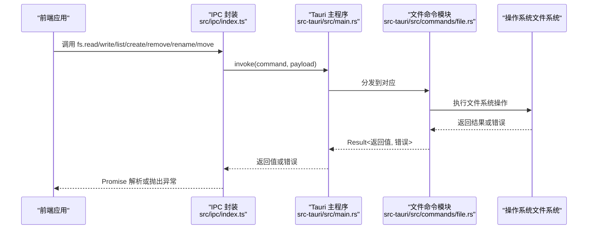
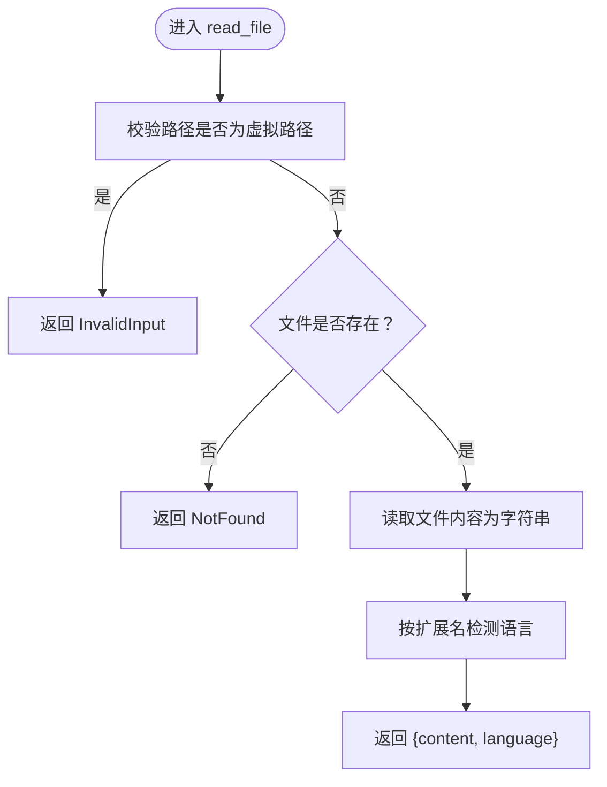
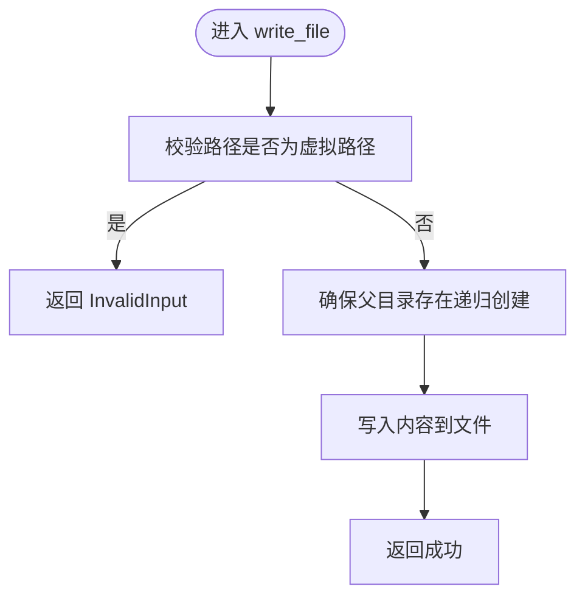
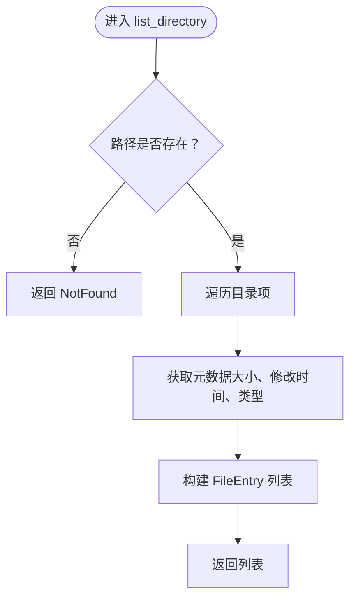
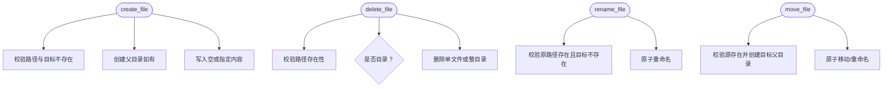
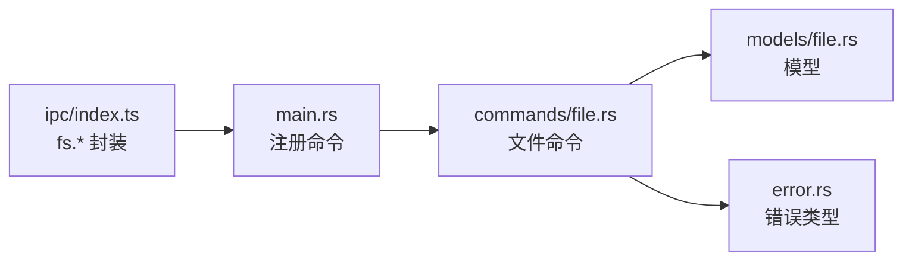

# 文件操作命令

<cite>
**本文引用的文件**
- [src-tauri/src/commands/file.rs](file://src-tauri/src/commands/file.rs)
- [src-tauri/src/main.rs](file://src-tauri/src/main.rs)
- [src/ipc/index.ts](file://src/ipc/index.ts)
- [src/types.ts](file://src/types.ts)
- [src-tauri/src/models/file.rs](file://src-tauri/src/models/file.rs)
- [src-tauri/src/error.rs](file://src-tauri/src/error.rs)
- [src-tauri/Cargo.toml](file://src-tauri/Cargo.toml)
</cite>

## 目录
1. [简介](#简介)
2. [项目结构](#项目结构)
3. [核心组件](#核心组件)
4. [架构总览](#架构总览)
5. [详细组件分析](#详细组件分析)
6. [依赖关系分析](#依赖关系分析)
7. [性能考量](#性能考量)
8. [故障排查指南](#故障排查指南)
9. [结论](#结论)
10. [附录](#附录)

## 简介
本文件面向需要在桌面应用中进行文件系统操作的开发者，系统性梳理了基于 Tauri 的文件操作命令实现与使用方法。内容覆盖文件读取、写入、目录列举、创建、删除、重命名、移动等核心能力，明确参数定义、返回值类型、错误处理机制与调用方式；同时给出路径处理、权限检查、异步 I/O 与性能优化策略、最佳实践与常见问题解决方案。

## 项目结构
文件操作命令位于后端 Rust 模块中，通过 Tauri 注解暴露为 IPC 命令；前端通过统一的 IPC 封装层进行调用。关键位置如下：
- 后端命令实现：src-tauri/src/commands/file.rs
- 前端封装与调用：src/ipc/index.ts
- 共享类型定义（含文件条目）：src/types.ts
- 后端模型（文件条目、读取响应等）：src-tauri/src/models/file.rs
- 错误类型：src-tauri/src/error.rs
- 主程序注册命令：src-tauri/src/main.rs
- 依赖声明：src-tauri/Cargo.toml

图表来源
- [src-tauri/src/main.rs:19-31](file://src-tauri/src/main.rs#L19-L31)
- [src-tauri/src/commands/file.rs:1-153](file://src-tauri/src/commands/file.rs#L1-L153)
- [src/ipc/index.ts:218-238](file://src/ipc/index.ts#L218-L238)
- [src/types.ts:48-58](file://src/types.ts#L48-L58)

章节来源
- [src-tauri/src/main.rs:19-31](file://src-tauri/src/main.rs#L19-L31)
- [src-tauri/src/commands/file.rs:1-153](file://src-tauri/src/commands/file.rs#L1-L153)
- [src/ipc/index.ts:218-238](file://src/ipc/index.ts#L218-L238)
- [src/types.ts:48-58](file://src/types.ts#L48-L58)

## 核心组件
- 文件命令模块：提供 read_file、write_file、list_directory、create_file、delete_file、rename_file、move_file 等命令。
- IPC 封装：前端通过 fs 对象统一调用，内部根据运行环境选择真实 IPC 或本地桩函数。
- 类型系统：共享类型 FileEntry 与后端模型 FileEntry、ReadFileResponse 对齐，确保前后端契约一致。
- 错误体系：统一映射到 NoteforgeError，便于前端捕获与提示。

章节来源
- [src-tauri/src/commands/file.rs:14-153](file://src-tauri/src/commands/file.rs#L14-L153)
- [src/ipc/index.ts:218-238](file://src/ipc/index.ts#L218-L238)
- [src/types.ts:48-58](file://src/types.ts#L48-L58)
- [src-tauri/src/models/file.rs:1-200](file://src-tauri/src/models/file.rs#L1-L200)
- [src-tauri/src/error.rs:1-200](file://src-tauri/src/error.rs#L1-L200)

## 架构总览
下图展示从前端调用到后端执行再到返回的整体流程。

图表来源
- [src/ipc/index.ts:66-83](file://src/ipc/index.ts#L66-L83)
- [src-tauri/src/main.rs:19-31](file://src-tauri/src/main.rs#L19-L31)
- [src-tauri/src/commands/file.rs:14-153](file://src-tauri/src/commands/file.rs#L14-L153)

## 详细组件分析

### 命令总览与参数/返回/错误
以下表格汇总各命令的签名要点、参数、返回值与典型错误。

- read_file
  - 参数：path: string
  - 返回：ReadFileResponse（content: string, language: string）
  - 可能错误：NotFound（文件不存在）、InvalidInput（虚拟路径）、Io（IO 异常）
- write_file
  - 参数：path: string, content: string
  - 返回：void
  - 可能错误：InvalidInput（虚拟路径）、Io（IO 异常）
- list_directory
  - 参数：path: string
  - 返回：Vec<FileEntry>
  - FileEntry 字段：path, name, isDir, size?, modified?
  - 可能错误：NotFound（路径不存在）、Io（IO 异常）
- create_file
  - 参数：path: string, content?: string（默认空串）
  - 返回：void
  - 可能错误：InvalidInput（目标已存在、虚拟路径）、Io（IO 异常）
- delete_file
  - 参数：path: string
  - 返回：void
  - 可能错误：NotFound（不存在）、InvalidInput（虚拟路径）、Io（IO 异常）
- rename_file
  - 参数：oldPath: string, newPath: string
  - 返回：void
  - 可能错误：NotFound（原路径不存在）、InvalidInput（目标已存在、虚拟路径）、Io（IO 异常）
- move_file
  - 参数：source: string, destination: string
  - 返回：void
  - 可能错误：NotFound（源不存在）、Io（IO 异常）

章节来源
- [src-tauri/src/commands/file.rs:14-153](file://src-tauri/src/commands/file.rs#L14-L153)
- [src-tauri/src/models/file.rs:1-200](file://src-tauri/src/models/file.rs#L1-L200)
- [src/types.ts:48-58](file://src/types.ts#L48-L58)

### 路径处理与安全约束
- 虚拟路径拦截：ensure_real_file_path 会拒绝包含“://”或以“untitled:”开头的路径，防止对虚拟文档执行真实文件操作。
- 绝对/相对路径：命令接收字符串路径，建议前端传入绝对路径以避免歧义。
- 目录创建：写入、创建、移动前若父目录不存在，会自动创建（递归）。
- 覆盖保护：重命名与创建均会在目标存在时返回 InvalidInput。

章节来源
- [src-tauri/src/commands/file.rs:5-12](file://src-tauri/src/commands/file.rs#L5-L12)
- [src-tauri/src/commands/file.rs:29-37](file://src-tauri/src/commands/file.rs#L29-L37)
- [src-tauri/src/commands/file.rs:78-94](file://src-tauri/src/commands/file.rs#L78-L94)
- [src-tauri/src/commands/file.rs:114-132](file://src-tauri/src/commands/file.rs#L114-L132)
- [src-tauri/src/commands/file.rs:135-152](file://src-tauri/src/commands/file.rs#L135-L152)

### 语言检测与文件信息
- 读取文件时根据扩展名推断语言，用于编辑器高亮与格式化。
- 列举目录时返回每项的大小与修改时间（UTC RFC3339 字符串），便于 UI 展示与排序。
- 建议：如需更精确的语言识别，可结合内容启发式规则（项目中另有前端启发式实现）。

章节来源
- [src-tauri/src/commands/file.rs:155-174](file://src-tauri/src/commands/file.rs#L155-L174)
- [src-tauri/src/commands/file.rs:41-75](file://src-tauri/src/commands/file.rs#L41-L75)

### 前端调用封装与类型对齐
- 前端通过 fs 对象统一暴露 read、write、list、create、remove、rename、move、info 等方法。
- 调用时根据运行环境选择真实 IPC 或本地桩函数，保证开发调试可用。
- 共享类型 FileEntry 在前端与后端保持一致字段，避免序列化差异导致的契约不匹配。

章节来源
- [src/ipc/index.ts:218-238](file://src/ipc/index.ts#L218-L238)
- [src/types.ts:48-58](file://src/types.ts#L48-L58)

### 错误处理机制
- 后端统一返回 Result，失败时映射为 NoteforgeError，包含 InvalidInput、NotFound、Io 等变体。
- 前端封装在 IPC 失败时抛出 IpcError，便于上层捕获与用户提示。
- 最佳实践：在 UI 中区分“资源不存在”“输入非法”“磁盘 IO 失败”等场景，分别给出明确提示。

章节来源
- [src-tauri/src/error.rs:1-200](file://src-tauri/src/error.rs#L1-L200)
- [src/ipc/index.ts:66-83](file://src/ipc/index.ts#L66-L83)

### 关键流程图与时序

#### 读取文件流程

图表来源
- [src-tauri/src/commands/file.rs:14-26](file://src-tauri/src/commands/file.rs#L14-L26)
- [src-tauri/src/commands/file.rs:155-174](file://src-tauri/src/commands/file.rs#L155-L174)

#### 写入文件流程

图表来源
- [src-tauri/src/commands/file.rs:28-38](file://src-tauri/src/commands/file.rs#L28-L38)

#### 目录列举流程

图表来源
- [src-tauri/src/commands/file.rs:40-75](file://src-tauri/src/commands/file.rs#L40-L75)

#### 创建/删除/重命名/移动流程

图表来源
- [src-tauri/src/commands/file.rs:77-94](file://src-tauri/src/commands/file.rs#L77-L94)
- [src-tauri/src/commands/file.rs:96-111](file://src-tauri/src/commands/file.rs#L96-L111)
- [src-tauri/src/commands/file.rs:113-132](file://src-tauri/src/commands/file.rs#L113-L132)
- [src-tauri/src/commands/file.rs:134-153](file://src-tauri/src/commands/file.rs#L134-L153)

## 依赖关系分析
- 命令注册：主程序在启动时将文件命令注册为 invoke 处理函数。
- 模块内依赖：命令模块依赖错误类型与模型定义；语言检测函数独立于外部库。
- 前后端契约：前端 fs.* 方法与后端命令名称一一对应，参数键名与模型字段保持一致。

图表来源
- [src-tauri/src/main.rs:19-31](file://src-tauri/src/main.rs#L19-L31)
- [src-tauri/src/commands/file.rs:1-153](file://src-tauri/src/commands/file.rs#L1-L153)
- [src-tauri/src/models/file.rs:1-200](file://src-tauri/src/models/file.rs#L1-L200)
- [src-tauri/src/error.rs:1-200](file://src-tauri/src/error.rs#L1-L200)
- [src/ipc/index.ts:218-238](file://src/ipc/index.ts#L218-L238)

章节来源
- [src-tauri/src/main.rs:19-31](file://src-tauri/src/main.rs#L19-L31)
- [src-tauri/src/commands/file.rs:1-153](file://src-tauri/src/commands/file.rs#L1-L153)
- [src-tauri/src/models/file.rs:1-200](file://src-tauri/src/models/file.rs#L1-L200)
- [src-tauri/src/error.rs:1-200](file://src-tauri/src/error.rs#L1-L200)
- [src/ipc/index.ts:218-238](file://src/ipc/index.ts#L218-L238)

## 性能考量
- 避免频繁小块写入：批量合并写入，减少磁盘写放大。
- 目录列举：对大目录采用分页/懒加载策略，仅在展开节点时请求子项。
- 语言检测：扩展名检测 O(1)，避免对超大文件做内容扫描；必要时缓存检测结果。
- 异步 I/O：命令本身为同步阻塞调用，建议在 UI 层使用后台线程或任务队列，避免阻塞主线程。
- 路径规范化：前端传入绝对路径，减少解析与拼接开销。

## 故障排查指南
- “文件未找到”：确认路径存在且非虚拟路径；检查工作目录与权限。
- “输入非法”：目标已存在、路径被判定为虚拟路径、或传入了不合法字符。
- “IO 失败”：磁盘空间不足、权限不足、文件被占用或网络存储不可达。
- 前端调用失败：检查 isTauri 环境判断与 @tauri-apps/api 是否正确注入。
- 类型不匹配：前后端字段名需严格一致（如 camelCase），避免 JSON 序列化差异。

章节来源
- [src-tauri/src/error.rs:1-200](file://src-tauri/src/error.rs#L1-L200)
- [src/ipc/index.ts:59-83](file://src/ipc/index.ts#L59-L83)
- [src/types.ts:48-58](file://src/types.ts#L48-L58)

## 结论
该文件操作命令体系以简洁稳健为核心设计原则：严格的路径校验、清晰的错误语义、前后端一致的类型契约以及直观的 IPC 封装，使得在桌面应用中进行文件系统操作变得安全而高效。建议在实际工程中结合上述性能与安全建议，进一步完善 UI 反馈与错误恢复策略。

## 附录

### 使用场景示例（步骤说明）
- 读取配置文件：调用 read_file，解析返回的 content 与 language，用于初始化编辑器与主题。
- 新建笔记：调用 create_file，传入默认内容（可选），随后 write_file 写入正文。
- 导入目录：调用 list_directory 获取 FileEntry 列表，在 UI 中渲染树形结构。
- 移动文件：调用 move_file，先确保目标目录存在，再执行移动。
- 删除文件夹：调用 delete_file，若路径为目录则删除整棵子树。

### 最佳实践清单
- 始终传入绝对路径，避免相对路径带来的不确定性。
- 对用户输入的路径进行白名单与长度限制，防止路径穿越与过长路径。
- 对大文件写入采用流式或分块写入策略，配合进度反馈。
- 在 UI 中对“重命名/移动”操作增加二次确认，避免误操作。
- 对外暴露的命令应尽量幂等或具备回滚能力（例如临时文件 + 原子替换）。