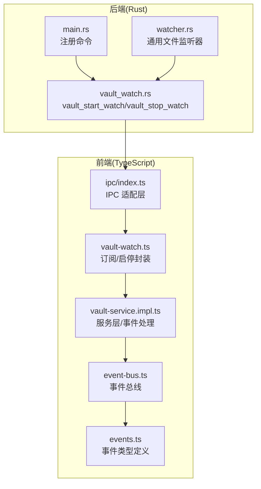
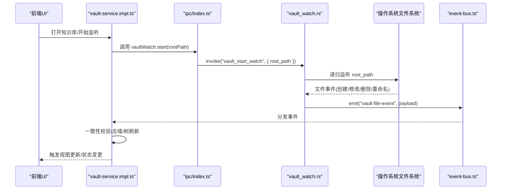
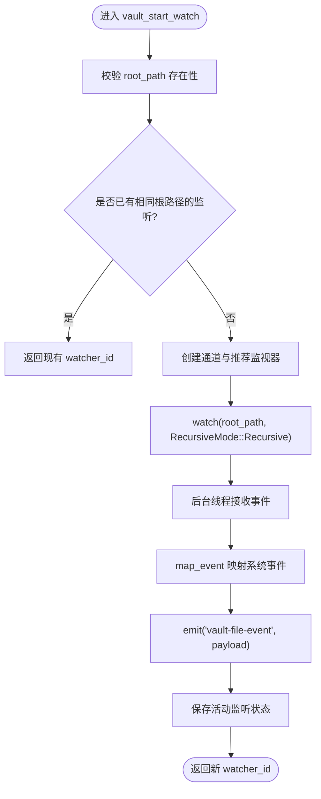
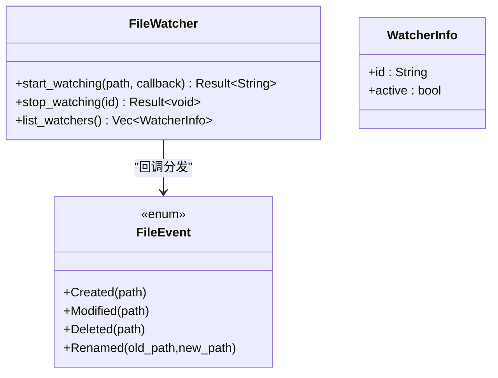
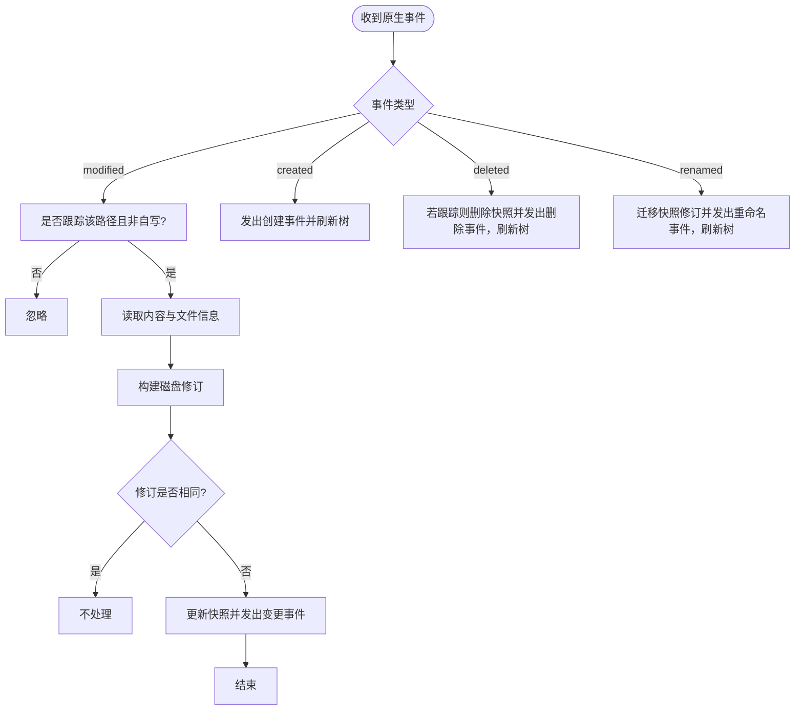
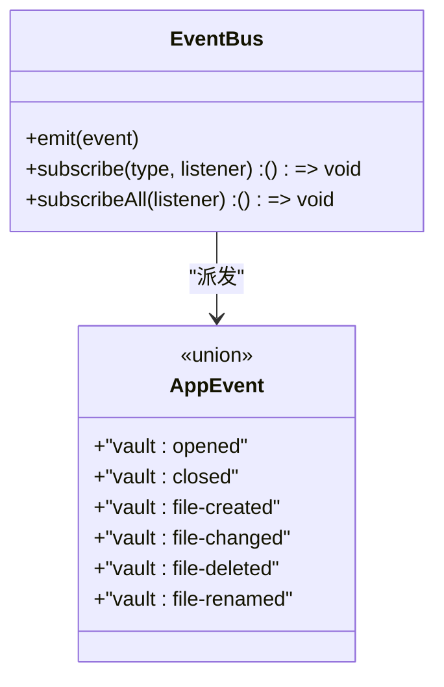
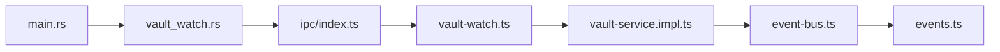

# 文件监视命令

<cite>
**本文引用的文件**
- [src-tauri/src/commands/vault_watch.rs](file://src-tauri/src/commands/vault_watch.rs)
- [src-tauri/src/watcher.rs](file://src-tauri/src/watcher.rs)
- [src-tauri/src/main.rs](file://src-tauri/src/main.rs)
- [src/core/vault/vault-watch.ts](file://src/core/vault/vault-watch.ts)
- [src/core/vault/vault-service.impl.ts](file://src/core/vault/vault-service.impl.ts)
- [src/core/platform/event-bus.ts](file://src/core/platform/event-bus.ts)
- [src/core/events.ts](file://src/core/events.ts)
- [src/ipc/index.ts](file://src/ipc/index.ts)
- [src/types.ts](file://src/types.ts)
</cite>

## 目录
1. [简介](#简介)
2. [项目结构](#项目结构)
3. [核心组件](#核心组件)
4. [架构总览](#架构总览)
5. [组件详解](#组件详解)
6. [依赖关系分析](#依赖关系分析)
7. [性能与资源管理](#性能与资源管理)
8. [故障排查指南](#故障排查指南)
9. [结论](#结论)
10. [附录：使用示例与最佳实践](#附录使用示例与最佳实践)

## 简介
本文件聚焦于“文件监视命令”的实现与使用，涵盖文件变化检测、事件通知、实时同步、批量处理、事件过滤、性能优化与资源管理策略，并阐述变更处理流程、冲突解决与数据一致性保障。文档以 Tauri 命令为核心入口，串联 Rust 后端监听器、前端订阅与事件总线，形成从底层文件系统到上层 UI 的完整链路。

## 项目结构
围绕文件监视的关键模块分布如下：
- 后端（Rust）
  - 命令注册与调用：在主程序中注册文件监视相关命令
  - 专用命令：启动/停止知识库文件监视
  - 通用文件监听器：支持多实例、回调式事件分发
- 前端（TypeScript）
  - IPC 适配层：统一调用后端命令与回退桩函数
  - 订阅接口：订阅“vault-file-event”事件
  - 服务层：基于事件总线与轮询策略实现一致性和去噪

**图表来源**
- [src-tauri/src/main.rs:19-99](file://src-tauri/src/main.rs#L19-L99)
- [src-tauri/src/commands/vault_watch.rs:71-137](file://src-tauri/src/commands/vault_watch.rs#L71-L137)
- [src-tauri/src/watcher.rs:9-114](file://src-tauri/src/watcher.rs#L9-L114)
- [src/core/vault/vault-watch.ts:9-30](file://src/core/vault/vault-watch.ts#L9-L30)
- [src/core/vault/vault-service.impl.ts:63-94](file://src/core/vault/vault-service.impl.ts#L63-L94)
- [src/core/platform/event-bus.ts:3-36](file://src/core/platform/event-bus.ts#L3-L36)
- [src/core/events.ts:9-23](file://src/core/events.ts#L9-L23)
- [src/ipc/index.ts:66-83](file://src/ipc/index.ts#L66-L83)

**章节来源**
- [src-tauri/src/main.rs:19-99](file://src-tauri/src/main.rs#L19-L99)
- [src-tauri/src/commands/vault_watch.rs:71-137](file://src-tauri/src/commands/vault_watch.rs#L71-L137)
- [src-tauri/src/watcher.rs:9-114](file://src-tauri/src/watcher.rs#L9-L114)
- [src/core/vault/vault-watch.ts:9-30](file://src/core/vault/vault-watch.ts#L9-L30)
- [src/core/vault/vault-service.impl.ts:63-94](file://src/core/vault/vault-service.impl.ts#L63-L94)
- [src/core/platform/event-bus.ts:3-36](file://src/core/platform/event-bus.ts#L3-L36)
- [src/core/events.ts:9-23](file://src/core/events.ts#L9-L23)
- [src/ipc/index.ts:66-83](file://src/ipc/index.ts#L66-L83)

## 核心组件
- 后端命令
  - vault_start_watch：递归监听指定根目录，映射系统事件为统一的 VaultWatchEventPayload，并通过事件总线向前端广播
  - vault_stop_watch：释放当前活动监听状态
- 通用文件监听器
  - 支持多实例监听，事件映射为 FileEvent 枚举，回调式分发
- 前端订阅与服务
  - 订阅“vault-file-event”，根据事件类型触发 UI 刷新与一致性检查
  - 写入时加入自写忽略集合，避免自身写入引发重复事件风暴
  - 非 Tauri 环境下采用定时轮询对比磁盘修订，确保一致性

**章节来源**
- [src-tauri/src/commands/vault_watch.rs:71-137](file://src-tauri/src/commands/vault_watch.rs#L71-L137)
- [src-tauri/src/watcher.rs:9-114](file://src-tauri/src/watcher.rs#L9-L114)
- [src/core/vault/vault-watch.ts:9-30](file://src/core/vault/vault-watch.ts#L9-L30)
- [src/core/vault/vault-service.impl.ts:44-61](file://src/core/vault/vault-service.impl.ts#L44-L61)
- [src/core/vault/vault-service.impl.ts:262-298](file://src/core/vault/vault-service.impl.ts#L262-L298)

## 架构总览
文件监视的端到端流程如下：

**图表来源**
- [src-tauri/src/commands/vault_watch.rs:71-137](file://src-tauri/src/commands/vault_watch.rs#L71-L137)
- [src/core/vault/vault-watch.ts:20-24](file://src/core/vault/vault-watch.ts#L20-L24)
- [src/core/vault/vault-service.impl.ts:138-141](file://src/core/vault/vault-service.impl.ts#L138-L141)
- [src/core/platform/event-bus.ts:8-17](file://src/core/platform/event-bus.ts#L8-L17)

## 组件详解

### 后端命令：vault_start_watch / vault_stop_watch
- 功能要点
  - 参数校验与路径存在性检查
  - 复用已激活监听（相同根路径直接返回 watcher_id）
  - 使用推荐的系统监视器，递归监听
  - 将系统事件映射为统一的 VaultWatchEventPayload 并广播
  - 停止命令清理活动状态
- 事件映射
  - 创建/删除：直接映射
  - 修改：区分名称变更（双路径）与数据/元数据变更
  - 目录事件忽略，仅处理文件事件

**图表来源**
- [src-tauri/src/commands/vault_watch.rs:71-137](file://src-tauri/src/commands/vault_watch.rs#L71-L137)
- [src-tauri/src/commands/vault_watch.rs:39-69](file://src-tauri/src/commands/vault_watch.rs#L39-L69)

**章节来源**
- [src-tauri/src/commands/vault_watch.rs:71-137](file://src-tauri/src/commands/vault_watch.rs#L71-L137)
- [src-tauri/src/commands/vault_watch.rs:39-69](file://src-tauri/src/commands/vault_watch.rs#L39-L69)

### 通用文件监听器（多实例）
- 设计模式
  - 每次监听创建独立通道与 watcher 实例
  - 后台线程循环接收事件，映射为 FileEvent 并回调
  - 提供停止与列表能力，便于资源管理
- 事件过滤
  - 忽略目录事件
  - 重命名事件需至少两个路径

**图表来源**
- [src-tauri/src/watcher.rs:9-114](file://src-tauri/src/watcher.rs#L9-L114)
- [src-tauri/src/watcher.rs:116-128](file://src-tauri/src/watcher.rs#L116-L128)

**章节来源**
- [src-tauri/src/watcher.rs:9-114](file://src-tauri/src/watcher.rs#L9-L114)
- [src-tauri/src/watcher.rs:116-128](file://src-tauri/src/watcher.rs#L116-L128)

### 前端订阅与服务层
- 订阅封装
  - subscribeVaultWatch：统一监听“vault-file-event”
  - startVaultRootWatch/stopVaultRootWatch：封装 IPC 调用
- 服务层逻辑
  - 自写去噪：写入期间将路径加入 selfWritePaths，忽略来自外部的重复事件
  - 一致性校验：读取内容与修改时间构建磁盘修订，比较差异后发出变更事件或删除事件
  - 重命名处理：迁移快照中的修订号，保持一致性
  - 树刷新：对创建/删除/重命名事件触发工作区树刷新
  - 非 Tauri 环境：定时轮询（默认 3 秒）对比修订，兜底保证一致性

**图表来源**
- [src/core/vault/vault-service.impl.ts:44-61](file://src/core/vault/vault-service.impl.ts#L44-L61)
- [src/core/vault/vault-service.impl.ts:63-94](file://src/core/vault/vault-service.impl.ts#L63-L94)
- [src/core/vault/vault-service.impl.ts:262-298](file://src/core/vault/vault-service.impl.ts#L262-L298)

**章节来源**
- [src/core/vault/vault-watch.ts:9-30](file://src/core/vault/vault-watch.ts#L9-L30)
- [src/core/vault/vault-service.impl.ts:44-61](file://src/core/vault/vault-service.impl.ts#L44-L61)
- [src/core/vault/vault-service.impl.ts:63-94](file://src/core/vault/vault-service.impl.ts#L63-L94)
- [src/core/vault/vault-service.impl.ts:262-298](file://src/core/vault/vault-service.impl.ts#L262-L298)

### 事件总线与类型
- 事件总线
  - 支持全局与按类型订阅，统一派发
- 事件类型
  - 包含 vault:file-* 与 vault:* 等多种事件，用于驱动 UI 与业务逻辑

**图表来源**
- [src/core/platform/event-bus.ts:3-36](file://src/core/platform/event-bus.ts#L3-L36)
- [src/core/events.ts:9-23](file://src/core/events.ts#L9-L23)

**章节来源**
- [src/core/platform/event-bus.ts:3-36](file://src/core/platform/event-bus.ts#L3-L36)
- [src/core/events.ts:9-23](file://src/core/events.ts#L9-L23)

## 依赖关系分析
- 命令注册
  - 主程序集中注册所有命令，包括 vault_start_watch、vault_stop_watch
- IPC 适配
  - 统一的 invoke 与 call 函数，屏蔽平台差异
- 事件链路
  - 后端通过事件总线向前端广播；前端服务层订阅并处理，再由事件总线驱动 UI

**图表来源**
- [src-tauri/src/main.rs:19-99](file://src-tauri/src/main.rs#L19-L99)
- [src-tauri/src/commands/vault_watch.rs:71-137](file://src-tauri/src/commands/vault_watch.rs#L71-L137)
- [src/ipc/index.ts:66-83](file://src/ipc/index.ts#L66-L83)
- [src/core/vault/vault-watch.ts:9-30](file://src/core/vault/vault-watch.ts#L9-L30)
- [src/core/vault/vault-service.impl.ts:63-94](file://src/core/vault/vault-service.impl.ts#L63-L94)
- [src/core/platform/event-bus.ts:8-17](file://src/core/platform/event-bus.ts#L8-L17)
- [src/core/events.ts:9-23](file://src/core/events.ts#L9-L23)

**章节来源**
- [src-tauri/src/main.rs:19-99](file://src-tauri/src/main.rs#L19-L99)
- [src/ipc/index.ts:66-83](file://src/ipc/index.ts#L66-L83)

## 性能与资源管理
- 监听粒度
  - 递归监听：覆盖子目录全量变更
  - 目录事件忽略：减少无效事件
- 去噪与一致性
  - 自写去噪：写入期间忽略外部事件，避免抖动
  - 修订号对比：仅在内容或修改时间变化时发出变更事件
  - 非 Tauri 环境轮询：兜底一致性，降低系统依赖
- 资源控制
  - 单根路径复用：相同根路径复用监听，避免重复开销
  - 停止命令：显式释放监听状态
  - 多实例监听：每个监听独立通道，便于隔离与回收

**章节来源**
- [src-tauri/src/commands/vault_watch.rs:71-137](file://src-tauri/src/commands/vault_watch.rs#L71-L137)
- [src/core/vault/vault-service.impl.ts:44-61](file://src/core/vault/vault-service.impl.ts#L44-L61)
- [src/core/vault/vault-service.impl.ts:262-298](file://src/core/vault/vault-service.impl.ts#L262-L298)

## 故障排查指南
- 常见问题
  - 监听未生效：确认 root_path 存在且可访问；检查命令返回的 watcher_id 是否被正确记录
  - 事件风暴：检查是否存在自写路径未清理导致的重复事件；确认自写集合是否在写入完成后及时移除
  - 变更未触发 UI 更新：确认前端已订阅“vault-file-event”；检查事件总线派发与服务层处理逻辑
  - 非 Tauri 环境无变更：确认轮询是否启动（默认 3 秒），必要时手动触发一次修订对比
- 排查步骤
  - 后端日志：关注命令执行与错误输出
  - 前端日志：确认订阅回调是否被触发
  - 一致性验证：对比修订号与磁盘实际内容/修改时间

**章节来源**
- [src-tauri/src/commands/vault_watch.rs:112-116](file://src-tauri/src/commands/vault_watch.rs#L112-L116)
- [src/core/vault/vault-service.impl.ts:44-61](file://src/core/vault/vault-service.impl.ts#L44-L61)
- [src/core/vault/vault-service.impl.ts:262-298](file://src/core/vault/vault-service.impl.ts#L262-L298)

## 结论
本实现以 Tauri 命令为入口，结合系统级文件监控与前端事件总线，提供了稳定、可扩展的文件监视能力。通过自写去噪、修订号对比与轮询兜底，兼顾了实时性与一致性。建议在生产环境中合理设置轮询间隔、严格管理监听生命周期，并针对大目录采用更细粒度的过滤策略以进一步优化性能。

## 附录：使用示例与最佳实践

### 使用示例
- 在前端打开知识库并开始监听
  - 步骤：调用服务层 open → 确保原生监听已建立 → 订阅“vault-file-event” → 根据事件类型刷新树或发出变更
  - 参考路径：
    - [src/core/vault/vault-service.impl.ts:106-142](file://src/core/vault/vault-service.impl.ts#L106-L142)
    - [src/core/vault/vault-watch.ts:20-24](file://src/core/vault/vault-watch.ts#L20-L24)
    - [src/core/vault/vault-watch.ts:9-18](file://src/core/vault/vault-watch.ts#L9-L18)
- 写入文件并保持一致性
  - 步骤：写入前加入自写集合 → 写入完成微任务移除 → 若跟踪路径则更新快照
  - 参考路径：
    - [src/core/vault/vault-service.impl.ts:176-195](file://src/core/vault/vault-service.impl.ts#L176-L195)
    - [src/core/vault/vault-service.impl.ts:300-305](file://src/core/vault/vault-service.impl.ts#L300-L305)

### 最佳实践
- 监听策略
  - 对大目录采用“仅跟踪已知路径”的策略，减少无关事件
  - 相同根路径复用监听，避免重复创建
- 事件处理
  - 修改事件优先进行修订号对比，再决定是否发出变更
  - 重命名事件务必迁移快照中的修订号
- 性能优化
  - 非 Tauri 环境适当调整轮询周期（如 3 秒）
  - 控制同时监听数量，避免过多通道造成阻塞
- 扩展性
  - 新增事件类型时，统一在事件总线与服务层处理，保持解耦
  - 通过 IPC 适配层抽象平台差异，便于移植

**章节来源**
- [src/core/vault/vault-service.impl.ts:40-42](file://src/core/vault/vault-service.impl.ts#L40-L42)
- [src/core/vault/vault-service.impl.ts:63-94](file://src/core/vault/vault-service.impl.ts#L63-L94)
- [src/core/vault/vault-service.impl.ts:262-298](file://src/core/vault/vault-service.impl.ts#L262-L298)
- [src/ipc/index.ts:66-83](file://src/ipc/index.ts#L66-L83)