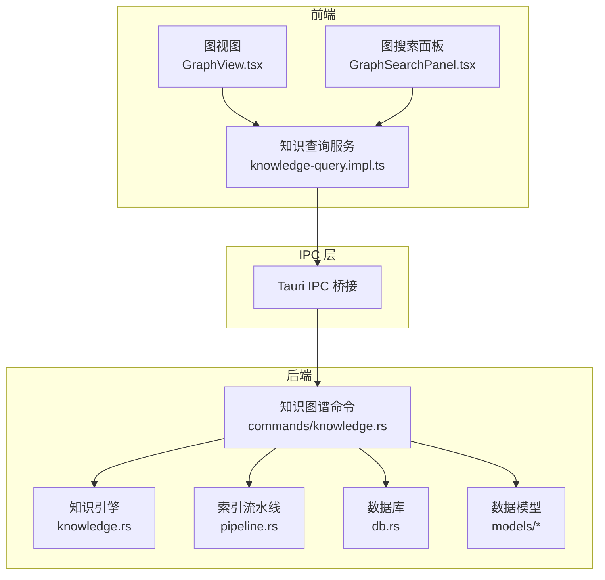
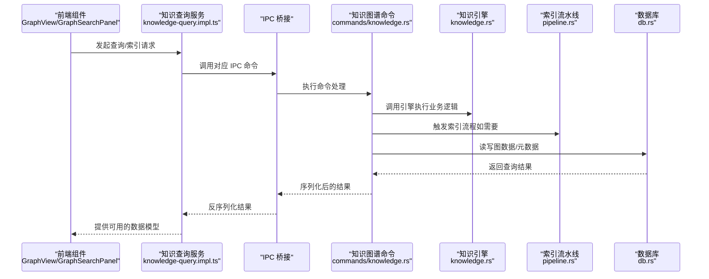
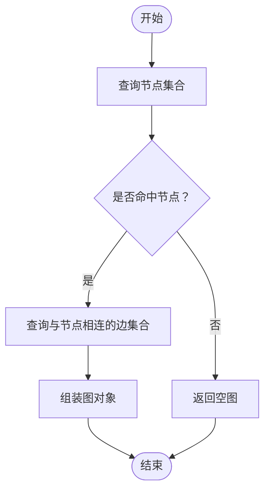
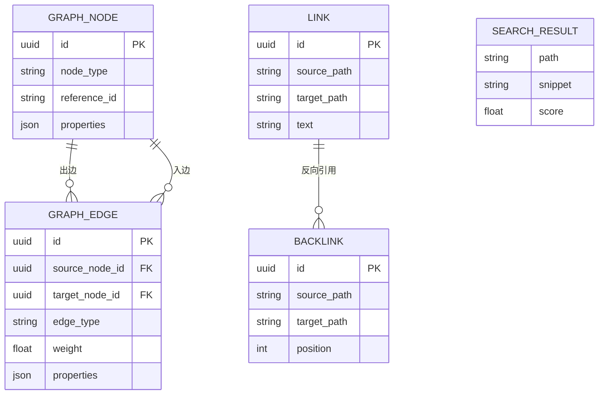
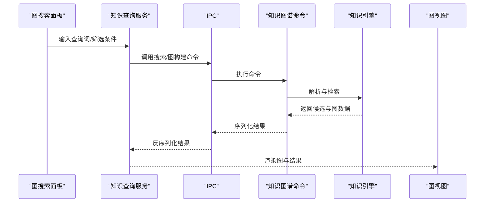
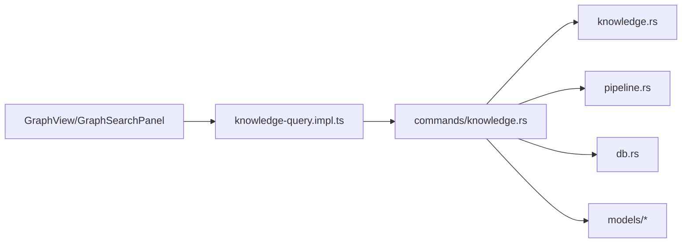

# 知识图谱命令

<cite>
**本文引用的文件**
- [src-tauri/src/commands/knowledge.rs](file://src-tauri/src/commands/knowledge.rs)
- [src-tauri/src/knowledge.rs](file://src-tauri/src/knowledge.rs)
- [src-tauri/src/pipeline.rs](file://src-tauri/src/pipeline.rs)
- [src-tauri/src/models/graph.rs](file://src-tauri/src/models/graph.rs)
- [src-tauri/src/models/link.rs](file://src-tauri/src/models/link.rs)
- [src-tauri/src/models/search.rs](file://src-tauri/src/models/search.rs)
- [src-tauri/src/db.rs](file://src-tauri/src/db.rs)
- [src/core/knowledge/knowledge-query.impl.ts](file://src/core/knowledge/knowledge-query.impl.ts)
- [src/core/knowledge/types.ts](file://src/core/knowledge/types.ts)
- [src/features/graph/GraphView.tsx](file://src/features/graph/GraphView.tsx)
- [src/components/sidebar/GraphSearchPanel.tsx](file://src/components/sidebar/GraphSearchPanel.tsx)
</cite>

## 目录
1. [简介](#简介)
2. [项目结构](#项目结构)
3. [核心组件](#核心组件)
4. [架构总览](#架构总览)
5. [详细组件分析](#详细组件分析)
6. [依赖分析](#依赖分析)
7. [性能考量](#性能考量)
8. [故障排查指南](#故障排查指南)
9. [结论](#结论)
10. [附录：查询示例与最佳实践](#附录查询示例与最佳实践)

## 简介
本文件系统化梳理知识图谱相关 Tauri 命令的实现与使用方法，覆盖图构建、节点查询、边关系获取、图遍历等核心能力；同时阐述数据模型、关系抽取算法、以及前端可视化渲染接口。文档还提供查询优化、缓存策略、性能调优与扩展性建议，并给出可操作的查询示例与使用场景。

## 项目结构
知识图谱功能由 Rust 后端（Tauri 命令）与 TypeScript 前端服务层协同完成：
- 后端命令层：在命令模块中提供索引、查询、图构建等 IPC 接口
- 知识引擎：封装图构建、向量化、语义检索等核心逻辑
- 数据模型：统一定义图节点、边、链接、回链、搜索结果等结构
- 前端服务层：通过 IPC 调用后端命令，驱动图视图与搜索面板

图表来源
- [src-tauri/src/commands/knowledge.rs:1-200](file://src-tauri/src/commands/knowledge.rs#L1-L200)
- [src-tauri/src/knowledge.rs:1-200](file://src-tauri/src/knowledge.rs#L1-L200)
- [src-tauri/src/pipeline.rs:1-200](file://src-tauri/src/pipeline.rs#L1-L200)
- [src-tauri/src/db.rs:1-200](file://src-tauri/src/db.rs#L1-L200)
- [src/core/knowledge/knowledge-query.impl.ts:1-200](file://src/core/knowledge/knowledge-query.impl.ts#L1-L200)
- [src/features/graph/GraphView.tsx:1-200](file://src/features/graph/GraphView.tsx#L1-L200)
- [src/components/sidebar/GraphSearchPanel.tsx:1-200](file://src/components/sidebar/GraphSearchPanel.tsx#L1-L200)

章节来源
- [src-tauri/src/commands/knowledge.rs:1-200](file://src-tauri/src/commands/knowledge.rs#L1-L200)
- [src/core/knowledge/knowledge-query.impl.ts:1-200](file://src/core/knowledge/knowledge-query.impl.ts#L1-L200)

## 核心组件
- 知识图谱命令模块：提供索引、全文检索、图构建、回链查询、语义搜索等命令
- 知识引擎：负责图构建、实体识别、关系抽取、向量化与相似度计算
- 索引流水线：协调文件扫描、解析、嵌入生成与持久化
- 数据模型：统一的图节点、边、链接、回链、搜索结果等结构体
- 前端知识查询服务：封装 IPC 调用，暴露易用的查询接口给 UI 组件

章节来源
- [src-tauri/src/commands/knowledge.rs:1-200](file://src-tauri/src/commands/knowledge.rs#L1-L200)
- [src-tauri/src/knowledge.rs:1-200](file://src-tauri/src/knowledge.rs#L1-L200)
- [src-tauri/src/pipeline.rs:1-200](file://src-tauri/src/pipeline.rs#L1-L200)
- [src-tauri/src/models/graph.rs:1-200](file://src-tauri/src/models/graph.rs#L1-L200)
- [src-tauri/src/models/link.rs:1-200](file://src-tauri/src/models/link.rs#L1-L200)
- [src-tauri/src/models/search.rs:1-200](file://src-tauri/src/models/search.rs#L1-L200)
- [src/core/knowledge/knowledge-query.impl.ts:1-200](file://src/core/knowledge/knowledge-query.impl.ts#L1-L200)

## 架构总览
下图展示从前端到后端的完整调用链路与数据流：

图表来源
- [src/core/knowledge/knowledge-query.impl.ts:1-200](file://src/core/knowledge/knowledge-query.impl.ts#L1-L200)
- [src-tauri/src/commands/knowledge.rs:1-200](file://src-tauri/src/commands/knowledge.rs#L1-L200)
- [src-tauri/src/knowledge.rs:1-200](file://src-tauri/src/knowledge.rs#L1-L200)
- [src-tauri/src/pipeline.rs:1-200](file://src-tauri/src/pipeline.rs#L1-L200)
- [src-tauri/src/db.rs:1-200](file://src-tauri/src/db.rs#L1-L200)

## 详细组件分析

### 命令：索引知识库（index_knowledge_base）
- 功能：对工作区路径进行扫描与索引，建立文档、实体与关系的图谱基础
- 参数：
  - 请求体：包含工作区路径等索引配置
- 返回值：
  - 成功：返回已处理的条目数量
  - 失败：返回统一错误类型
- 处理流程要点：
  - 校验路径存在性
  - 获取数据库连接
  - 初始化索引流水线
  - 遍历文档并写入图谱与向量库
- 性能与优化：
  - 并行处理多个文档
  - 分批写入数据库，控制事务大小
  - 使用增量索引避免全量重建
- 缓存策略：
  - 对已处理文档记录版本号，跳过未变更文件
  - 向量嵌入结果缓存于向量存储

章节来源
- [src-tauri/src/commands/knowledge.rs:14-60](file://src-tauri/src/commands/knowledge.rs#L14-L60)
- [src-tauri/src/pipeline.rs:1-200](file://src-tauri/src/pipeline.rs#L1-L200)

### 命令：获取知识图谱（get_knowledge_graph）
- 功能：按需拉取子图，支持仅返回与指定节点相连的节点与边
- 参数：
  - 请求体：包含查询范围（如中心节点 ID 或标签）、深度限制等
- 返回值：
  - 成功：返回节点列表与边列表组成的图对象
  - 失败：返回统一错误类型
- 查询逻辑：
  - 先查询满足条件的节点集合
  - 再查询与这些节点相连的边集合
- 性能与优化：
  - 使用 EXISTS 子查询过滤节点，减少无关节点加载
  - 边查询使用双向匹配（源或目标节点）
- 缓存策略：
  - 对热点节点的邻域图进行短期缓存
  - 结合标签/类型过滤降低重复查询成本

图表来源
- [src-tauri/src/commands/knowledge.rs:94-161](file://src-tauri/src/commands/knowledge.rs#L94-L161)

章节来源
- [src-tauri/src/commands/knowledge.rs:94-161](file://src-tauri/src/commands/knowledge.rs#L94-L161)

### 命令：全文搜索（search_fulltext）
- 功能：基于全文检索返回候选文档与片段
- 参数：
  - 请求体：包含查询词、工作区上下文、分页参数等
- 返回值：
  - 成功：返回搜索结果列表（含匹配片段、评分等）
  - 失败：返回统一错误类型
- 性能与优化：
  - 使用数据库内置全文索引
  - 限制返回条数与字段集
- 缓存策略：
  - 对高频查询词进行结果缓存

章节来源
- [src-tauri/src/commands/knowledge.rs:61-93](file://src-tauri/src/commands/knowledge.rs#L61-L93)
- [src-tauri/src/models/search.rs:1-200](file://src-tauri/src/models/search.rs#L1-L200)

### 命令：语义搜索（semantic_search）
- 功能：基于向量相似度检索相关内容
- 参数：
  - 请求体：包含查询向量、相似度阈值、返回数量等
- 返回值：
  - 成功：返回匹配项列表
  - 失败：返回统一错误类型
- 性能与优化：
  - 向量检索使用近似最近邻（ANN）加速
  - 过滤掉低置信度结果
- 缓存策略：
  - 查询向量结果缓存

章节来源
- [src-tauri/src/commands/knowledge.rs:61-93](file://src-tauri/src/commands/knowledge.rs#L61-L93)
- [src-tauri/src/knowledge.rs:1-200](file://src-tauri/src/knowledge.rs#L1-L200)

### 命令：提取链接（extract_links）
- 功能：从文档内容中抽取 Wiki 链接与外部链接
- 参数：
  - 请求体：包含文档路径、内容等
- 返回值：
  - 成功：返回链接列表
  - 失败：返回统一错误类型
- 性能与优化：
  - 正则匹配与解析分离，避免重复计算
- 缓存策略：
  - 对已解析文档的链接结果缓存

章节来源
- [src-tauri/src/commands/knowledge.rs:61-93](file://src-tauri/src/commands/knowledge.rs#L61-L93)
- [src-tauri/src/models/link.rs:1-200](file://src-tauri/src/models/link.rs#L1-L200)

### 命令：提取标签（extract_tags）
- 功能：从文档中抽取标签并标准化
- 参数：
  - 请求体：包含文档内容、标签模式等
- 返回值：
  - 成功：返回标签列表
  - 失败：返回统一错误类型
- 性能与优化：
  - 使用预编译正则提升匹配效率
- 缓存策略：
  - 对常用标签映射进行缓存

章节来源
- [src-tauri/src/commands/knowledge.rs:61-93](file://src-tauri/src/commands/knowledge.rs#L61-L93)
- [src-tauri/src/models/tag.rs:1-200](file://src-tauri/src/models/tag.rs#L1-L200)

### 命令：获取回链（get_backlinks）
- 功能：查询指向某文档的回链集合
- 参数：
  - 请求体：包含目标文档路径
- 返回值：
  - 成功：返回回链列表
  - 失败：返回统一错误类型
- 性能与优化：
  - 基于反向索引快速定位
- 缓存策略：
  - 对热门页面的回链结果缓存

章节来源
- [src-tauri/src/commands/knowledge.rs:61-93](file://src-tauri/src/commands/knowledge.rs#L61-L93)
- [src-tauri/src/models/link.rs:1-200](file://src-tauri/src/models/link.rs#L1-L200)

### 数据模型与关系
- 图节点（GraphNode）：标识节点类型、引用 ID、属性字典
- 图边（GraphEdge）：标识源/目标节点、边类型、权重、属性字典
- 搜索结果（SearchResult）：包含文档路径、片段、评分等
- 链接（Link）：包含源/目标路径、链接文本等
- 回链（Backlink）：包含来源文档路径、链接位置等

图表来源
- [src-tauri/src/models/graph.rs:1-200](file://src-tauri/src/models/graph.rs#L1-L200)
- [src-tauri/src/models/link.rs:1-200](file://src-tauri/src/models/link.rs#L1-L200)
- [src-tauri/src/models/search.rs:1-200](file://src-tauri/src/models/search.rs#L1-L200)

章节来源
- [src-tauri/src/models/graph.rs:1-200](file://src-tauri/src/models/graph.rs#L1-L200)
- [src-tauri/src/models/link.rs:1-200](file://src-tauri/src/models/link.rs#L1-L200)
- [src-tauri/src/models/search.rs:1-200](file://src-tauri/src/models/search.rs#L1-L200)

### 前端集成与可视化
- 知识查询服务：封装 IPC 调用，提供统一的查询入口
- 图视图组件：接收后端返回的节点/边数据，渲染交互式图
- 图搜索面板：提供筛选器与搜索框，联动后端命令实现高效探索

图表来源
- [src/core/knowledge/knowledge-query.impl.ts:1-200](file://src/core/knowledge/knowledge-query.impl.ts#L1-L200)
- [src-tauri/src/commands/knowledge.rs:1-200](file://src-tauri/src/commands/knowledge.rs#L1-L200)
- [src/features/graph/GraphView.tsx:1-200](file://src/features/graph/GraphView.tsx#L1-L200)
- [src/components/sidebar/GraphSearchPanel.tsx:1-200](file://src/components/sidebar/GraphSearchPanel.tsx#L1-L200)

章节来源
- [src/core/knowledge/knowledge-query.impl.ts:1-200](file://src/core/knowledge/knowledge-query.impl.ts#L1-L200)
- [src/features/graph/GraphView.tsx:1-200](file://src/features/graph/GraphView.tsx#L1-L200)
- [src/components/sidebar/GraphSearchPanel.tsx:1-200](file://src/components/sidebar/GraphSearchPanel.tsx#L1-L200)

## 依赖分析
- 命令层依赖知识引擎与索引流水线，以实现图构建与检索
- 知识引擎依赖数据库与向量引擎，用于持久化与相似度计算
- 前端服务层通过 IPC 与命令层解耦，便于替换实现与测试

图表来源
- [src-tauri/src/commands/knowledge.rs:1-200](file://src-tauri/src/commands/knowledge.rs#L1-L200)
- [src-tauri/src/knowledge.rs:1-200](file://src-tauri/src/knowledge.rs#L1-L200)
- [src-tauri/src/pipeline.rs:1-200](file://src-tauri/src/pipeline.rs#L1-L200)
- [src-tauri/src/db.rs:1-200](file://src-tauri/src/db.rs#L1-L200)
- [src/core/knowledge/knowledge-query.impl.ts:1-200](file://src/core/knowledge/knowledge-query.impl.ts#L1-L200)

章节来源
- [src-tauri/src/commands/knowledge.rs:1-200](file://src-tauri/src/commands/knowledge.rs#L1-L200)
- [src-tauri/src/knowledge.rs:1-200](file://src-tauri/src/knowledge.rs#L1-L200)
- [src-tauri/src/pipeline.rs:1-200](file://src-tauri/src/pipeline.rs#L1-L200)
- [src-tauri/src/db.rs:1-200](file://src-tauri/src/db.rs#L1-L200)
- [src/core/knowledge/knowledge-query.impl.ts:1-200](file://src/core/knowledge/knowledge-query.impl.ts#L1-L200)

## 性能考量
- 查询优化
  - 使用 EXISTS 子查询过滤节点，减少无关数据传输
  - 边查询采用双向匹配，避免重复扫描
  - 限制返回条数与字段集，降低序列化开销
- 缓存策略
  - 对热点节点邻域图与回链结果进行短期缓存
  - 对常用标签与链接映射进行常驻缓存
- 索引与向量化
  - 增量索引避免全量重建
  - 向量检索使用 ANN，结合阈值过滤
- 并发与批处理
  - 文档处理与向量生成并行化
  - 数据库写入采用批量提交

## 故障排查指南
- 常见错误与处理
  - 路径不存在：检查工作区根路径与权限
  - 数据库锁冲突：调整并发度与事务粒度
  - 向量引擎不可用：确认嵌入模型加载状态
- 日志与监控
  - 记录命令耗时、命中率与缓存命中情况
  - 监控向量维度与存储占用
- 重试与降级
  - 对网络型向量服务增加指数退避
  - 在失败时返回部分结果或默认图

章节来源
- [src-tauri/src/commands/knowledge.rs:1-200](file://src-tauri/src/commands/knowledge.rs#L1-L200)
- [src-tauri/src/error.rs:1-200](file://src-tauri/src/error.rs#L1-L200)

## 结论
知识图谱命令体系通过清晰的分层设计实现了从索引、检索到可视化的完整闭环。后端命令提供稳定可靠的 IPC 接口，前端服务层屏蔽复杂细节，使 UI 能够专注于用户体验。配合合理的查询优化与缓存策略，系统可在大规模知识库上保持良好性能与扩展性。

## 附录：查询示例与最佳实践
- 示例场景
  - 快速定位“项目管理”主题下的相关文档与概念关联
  - 基于语义相似度查找与“敏捷开发”相近的资料
  - 通过回链发现被多处引用的重要参考
- 最佳实践
  - 使用标签与类型过滤缩小搜索范围
  - 对高频查询词与热点页面启用缓存
  - 采用增量索引与分批处理，避免阻塞主线程
  - 在图视图中启用节点折叠与层级缩放，提升可读性