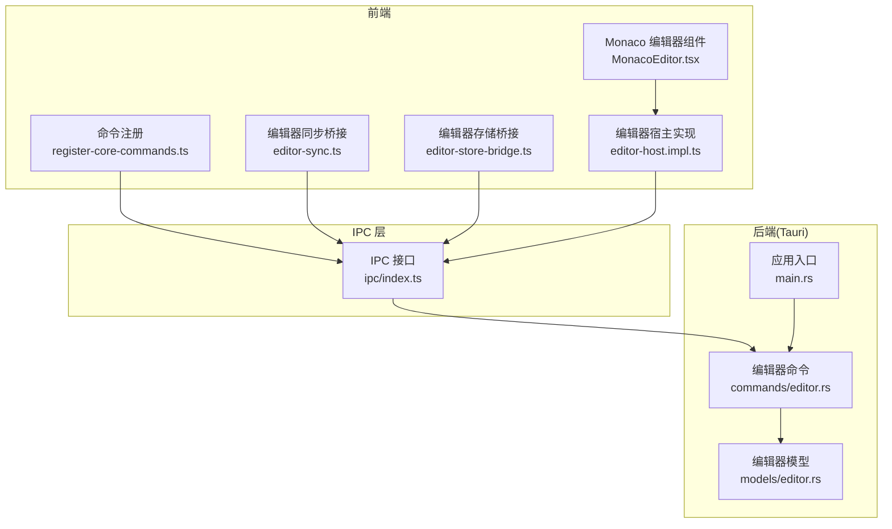
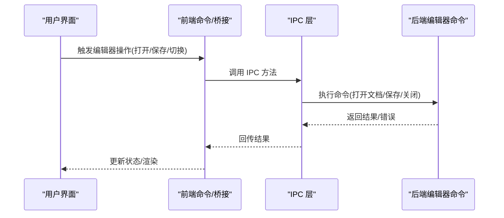
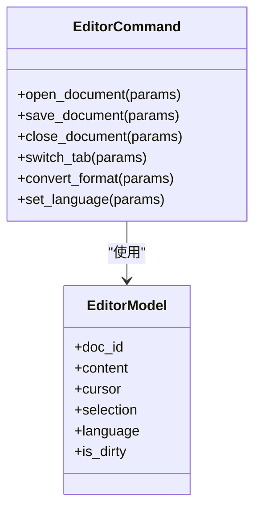
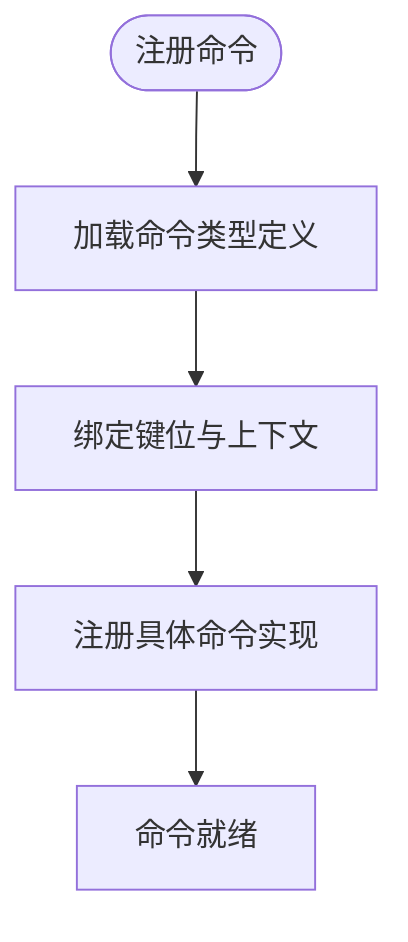
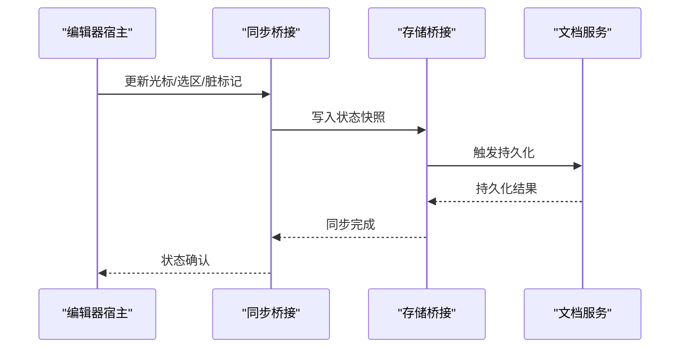
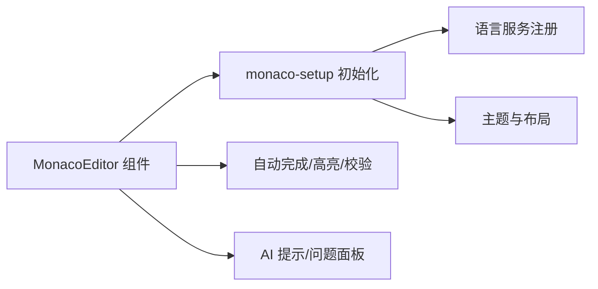
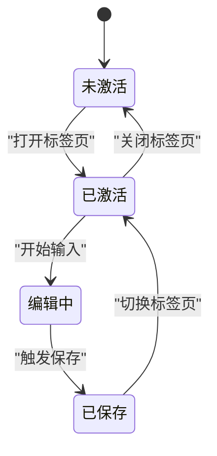
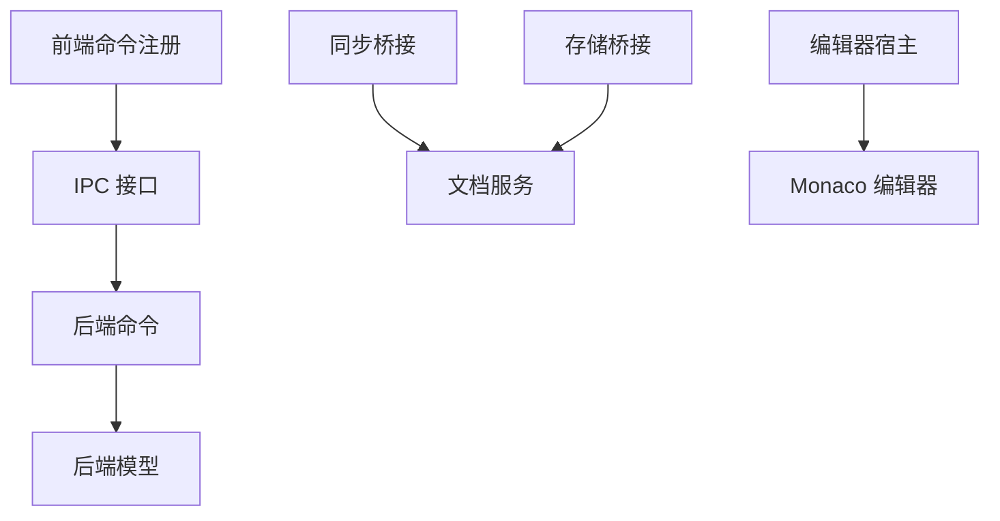

# 编辑器命令

<cite>
**本文档引用的文件**
- [src-tauri/src/commands/editor.rs](file://src-tauri/src/commands/editor.rs)
- [src-tauri/src/models/editor.rs](file://src-tauri/src/models/editor.rs)
- [src/core/bridge/editor-sync.ts](file://src/core/bridge/editor-sync.ts)
- [src/core/bridge/editor-store-bridge.ts](file://src/core/bridge/editor-store-bridge.ts)
- [src/core/command/register-core-commands.ts](file://src/core/command/register-core-commands.ts)
- [src/core/command/types.ts](file://src/core/command/types.ts)
- [src/core/editor/editor-host.impl.ts](file://src/core/editor/editor-host.impl.ts)
- [src/components/editor/MonacoEditor.tsx](file://src/components/editor/MonacoEditor.tsx)
- [src/lib/monaco-setup.ts](file://src/lib/monaco-setup.ts)
- [src/core/document/document-service.impl.ts](file://src/core/document/document-service.impl.ts)
- [src/core/session/tab-lifecycle.ts](file://src/core/session/tab-lifecycle.ts)
- [src/core/workbench/workbench-service.impl.ts](file://src/core/workbench/workbench-service.impl.ts)
- [src/ipc/index.ts](file://src/ipc/index.ts)
- [src-tauri/src/main.rs](file://src-tauri/src/main.rs)
- [src-tauri/Cargo.toml](file://src-tauri/Cargo.toml)
</cite>

## 目录
1. [简介](#简介)
2. [项目结构](#项目结构)
3. [核心组件](#核心组件)
4. [架构总览](#架构总览)
5. [详细组件分析](#详细组件分析)
6. [依赖关系分析](#依赖关系分析)
7. [性能考量](#性能考量)
8. [故障排除指南](#故障排除指南)
9. [结论](#结论)
10. [附录](#附录)

## 简介
本文件聚焦于编辑器相关的 Tauri 命令实现与前端桥接层，系统性梳理以下主题：
- 文档内容操作：打开、保存、关闭、切换等基础能力
- 格式转换与语法高亮：Markdown、JSON/YAML 等多格式支持
- 自动完成与智能提示：基于 Monaco 的语言服务与 AI 提示
- 编辑器状态管理：会话、标签页生命周期、工作台状态
- 内容同步机制：本地存储桥接与实时协作（如适用）
- 插件系统与扩展接口：命令注册、键位绑定、对话框集成
- 性能优化策略：增量更新、缓存、懒加载
- 最佳实践与兼容性：跨平台、安全权限、错误处理

## 项目结构
编辑器命令在前后端分层清晰：
- 后端（Rust/Tauri）：定义命令接口、数据模型与业务逻辑
- 前端（TypeScript/React）：命令注册、状态桥接、UI 组件与 Monaco 集成
- 桥接层：负责前端与后端之间的 IPC 调用与状态同步

**图表来源**
- [src/core/command/register-core-commands.ts](file://src/core/command/register-core-commands.ts)
- [src/core/bridge/editor-sync.ts](file://src/core/bridge/editor-sync.ts)
- [src/core/bridge/editor-store-bridge.ts](file://src/core/bridge/editor-store-bridge.ts)
- [src/core/editor/editor-host.impl.ts](file://src/core/editor/editor-host.impl.ts)
- [src/components/editor/MonacoEditor.tsx](file://src/components/editor/MonacoEditor.tsx)
- [src/ipc/index.ts](file://src/ipc/index.ts)
- [src-tauri/src/commands/editor.rs](file://src-tauri/src/commands/editor.rs)
- [src-tauri/src/models/editor.rs](file://src-tauri/src/models/editor.rs)
- [src-tauri/src/main.rs](file://src-tauri/src/main.rs)

**章节来源**
- [src/core/command/register-core-commands.ts](file://src/core/command/register-core-commands.ts)
- [src/core/bridge/editor-sync.ts](file://src/core/bridge/editor-sync.ts)
- [src/core/bridge/editor-store-bridge.ts](file://src/core/bridge/editor-store-bridge.ts)
- [src/core/editor/editor-host.impl.ts](file://src/core/editor/editor-host.impl.ts)
- [src/components/editor/MonacoEditor.tsx](file://src/components/editor/MonacoEditor.tsx)
- [src/ipc/index.ts](file://src/ipc/index.ts)
- [src-tauri/src/commands/editor.rs](file://src-tauri/src/commands/editor.rs)
- [src-tauri/src/models/editor.rs](file://src-tauri/src/models/editor.rs)
- [src-tauri/src/main.rs](file://src-tauri/src/main.rs)

## 核心组件
- 编辑器命令模块（后端）：提供文档打开、保存、关闭、切换、格式转换等命令
- 编辑器模型（后端）：定义文档、光标位置、选区、语言模式等数据结构
- 前端命令注册：集中注册编辑器相关命令，绑定键位与上下文
- 同步桥接：将编辑器状态与后端持久化、协作机制对接
- 存储桥接：将编辑器内容与本地存储、工作台状态联动
- 编辑器宿主：封装编辑器实例、事件与生命周期管理
- Monaco 集成：语言服务、语法高亮、自动完成、主题与布局

**章节来源**
- [src-tauri/src/commands/editor.rs](file://src-tauri/src/commands/editor.rs)
- [src-tauri/src/models/editor.rs](file://src-tauri/src/models/editor.rs)
- [src/core/command/register-core-commands.ts](file://src/core/command/register-core-commands.ts)
- [src/core/bridge/editor-sync.ts](file://src/core/bridge/editor-sync.ts)
- [src/core/bridge/editor-store-bridge.ts](file://src/core/bridge/editor-store-bridge.ts)
- [src/core/editor/editor-host.impl.ts](file://src/core/editor/editor-host.impl.ts)
- [src/components/editor/MonacoEditor.tsx](file://src/components/editor/MonacoEditor.tsx)

## 架构总览
编辑器命令通过 IPC 在前端与后端之间传递，前端负责 UI 与交互，后端负责持久化与业务规则。

**图表来源**
- [src/core/command/register-core-commands.ts](file://src/core/command/register-core-commands.ts)
- [src/core/bridge/editor-sync.ts](file://src/core/bridge/editor-sync.ts)
- [src/core/bridge/editor-store-bridge.ts](file://src/core/bridge/editor-store-bridge.ts)
- [src/ipc/index.ts](file://src/ipc/index.ts)
- [src-tauri/src/commands/editor.rs](file://src-tauri/src/commands/editor.rs)

## 详细组件分析

### 后端编辑器命令模块
- 职责：实现文档打开、保存、关闭、切换、格式转换、语言模式设置等命令
- 数据模型：定义文档标识、内容、光标、选区、语言类型等字段
- 错误处理：对文件不存在、写入失败、并发冲突等情况进行统一处理
- 安全与权限：通过 Tauri 能力配置限制文件系统访问范围

**图表来源**
- [src-tauri/src/commands/editor.rs](file://src-tauri/src/commands/editor.rs)
- [src-tauri/src/models/editor.rs](file://src-tauri/src/models/editor.rs)

**章节来源**
- [src-tauri/src/commands/editor.rs](file://src-tauri/src/commands/editor.rs)
- [src-tauri/src/models/editor.rs](file://src-tauri/src/models/editor.rs)

### 前端命令注册与键位绑定
- 命令注册：集中注册编辑器命令，绑定执行函数与上下文
- 键位绑定：将常用操作映射到快捷键，提升效率
- 上下文感知：根据当前标签页、焦点位置动态启用/禁用命令
- 对话框集成：通过对话框 API 触发复杂流程（如导入、导出）

**图表来源**
- [src/core/command/register-core-commands.ts](file://src/core/command/register-core-commands.ts)
- [src/core/command/types.ts](file://src/core/command/types.ts)

**章节来源**
- [src/core/command/register-core-commands.ts](file://src/core/command/register-core-commands.ts)
- [src/core/command/types.ts](file://src/core/command/types.ts)

### 编辑器状态管理与同步机制
- 状态桥接：将编辑器的光标、选区、脏标记等状态同步至后端或存储
- 内容同步：在多标签页或多设备间保持一致性
- 协作支持：预留协作接口，支持实时冲突解决与增量合并
- 生命周期：随标签页创建/销毁同步清理状态

**图表来源**
- [src/core/editor/editor-host.impl.ts](file://src/core/editor/editor-host.impl.ts)
- [src/core/bridge/editor-sync.ts](file://src/core/bridge/editor-sync.ts)
- [src/core/bridge/editor-store-bridge.ts](file://src/core/bridge/editor-store-bridge.ts)
- [src/core/document/document-service.impl.ts](file://src/core/document/document-service.impl.ts)

**章节来源**
- [src/core/editor/editor-host.impl.ts](file://src/core/editor/editor-host.impl.ts)
- [src/core/bridge/editor-sync.ts](file://src/core/bridge/editor-sync.ts)
- [src/core/bridge/editor-store-bridge.ts](file://src/core/bridge/editor-store-bridge.ts)
- [src/core/document/document-service.impl.ts](file://src/core/document/document-service.impl.ts)

### Monaco 编辑器集成与功能特性
- 语言服务：Markdown、JSON/YAML 等多语言支持，语法高亮与校验
- 自动完成：基于上下文的智能补全与 Snippet 支持
- 主题与布局：动态主题切换、只读模式、侧边栏联动
- 插件扩展：通过 Monaco 扩展点接入 AI 提示、问题面板等

**图表来源**
- [src/components/editor/MonacoEditor.tsx](file://src/components/editor/MonacoEditor.tsx)
- [src/lib/monaco-setup.ts](file://src/lib/monaco-setup.ts)

**章节来源**
- [src/components/editor/MonacoEditor.tsx](file://src/components/editor/MonacoEditor.tsx)
- [src/lib/monaco-setup.ts](file://src/lib/monaco-setup.ts)

### 工作台与标签页生命周期
- 标签页管理：创建、切换、关闭标签页时维护编辑器状态
- 工作台会话：记录最近打开的文档与布局，重启后恢复
- 草稿与自动保存：在无持久化前临时保存，避免丢失

**图表来源**
- [src/core/session/tab-lifecycle.ts](file://src/core/session/tab-lifecycle.ts)
- [src/core/workbench/workbench-service.impl.ts](file://src/core/workbench/workbench-service.impl.ts)

**章节来源**
- [src/core/session/tab-lifecycle.ts](file://src/core/session/tab-lifecycle.ts)
- [src/core/workbench/workbench-service.impl.ts](file://src/core/workbench/workbench-service.impl.ts)

## 依赖关系分析
- 前端依赖后端命令：所有编辑器操作最终通过 IPC 调用后端命令
- 命令依赖模型：命令实现依赖后端模型定义的数据结构
- 桥接层耦合：同步与存储桥接同时依赖编辑器宿主与文档服务
- Monaco 依赖：编辑器 UI 依赖 Monaco 初始化与语言服务

**图表来源**
- [src/core/command/register-core-commands.ts](file://src/core/command/register-core-commands.ts)
- [src/core/bridge/editor-sync.ts](file://src/core/bridge/editor-sync.ts)
- [src/core/bridge/editor-store-bridge.ts](file://src/core/bridge/editor-store-bridge.ts)
- [src/core/editor/editor-host.impl.ts](file://src/core/editor/editor-host.impl.ts)
- [src/components/editor/MonacoEditor.tsx](file://src/components/editor/MonacoEditor.tsx)
- [src/ipc/index.ts](file://src/ipc/index.ts)
- [src-tauri/src/commands/editor.rs](file://src-tauri/src/commands/editor.rs)
- [src-tauri/src/models/editor.rs](file://src-tauri/src/models/editor.rs)

**章节来源**
- [src/core/command/register-core-commands.ts](file://src/core/command/register-core-commands.ts)
- [src/core/bridge/editor-sync.ts](file://src/core/bridge/editor-sync.ts)
- [src/core/bridge/editor-store-bridge.ts](file://src/core/bridge/editor-store-bridge.ts)
- [src/core/editor/editor-host.impl.ts](file://src/core/editor/editor-host.impl.ts)
- [src/components/editor/MonacoEditor.tsx](file://src/components/editor/MonacoEditor.tsx)
- [src/ipc/index.ts](file://src/ipc/index.ts)
- [src-tauri/src/commands/editor.rs](file://src-tauri/src/commands/editor.rs)
- [src-tauri/src/models/editor.rs](file://src-tauri/src/models/editor.rs)

## 性能考量
- 增量更新：仅在内容变化时触发保存与同步，减少 IO 压力
- 缓存策略：主题、语言服务、自动完成词典按需加载与缓存
- 懒加载：Monaco 语言服务与插件在首次使用时初始化
- 并发控制：对同一文档的多次保存进行去重与队列化
- 跨平台优化：在不同操作系统上调整文件监听与磁盘 IO 策略

## 故障排除指南
- 常见错误类型：文件不存在、权限不足、写入失败、并发冲突
- 错误传播：后端命令返回错误码，前端通过 IPC 获取并展示
- 用户提示：结合对话框与状态栏显示错误信息与重试选项
- 日志追踪：在开发环境开启详细日志，定位命令调用链路

**章节来源**
- [src-tauri/src/commands/editor.rs](file://src-tauri/src/commands/editor.rs)
- [src/core/dialog/dialog-api.ts](file://src/core/dialog/dialog-api.ts)

## 结论
编辑器命令体系以“前端命令注册 + IPC 调用 + 后端命令实现”为核心，配合状态桥接与 Monaco 集成，形成完整的文档编辑体验。通过模块化设计与清晰的职责划分，既保证了功能扩展性，也为性能优化与错误处理提供了良好基础。

## 附录

### 使用场景与最佳实践
- 快速切换：利用标签页生命周期与工作台会话，确保频繁切换不丢失状态
- 多格式编辑：通过语言模式设置与格式转换命令，无缝切换 Markdown/JSON/YAML
- 智能提示：结合 Monaco 语言服务与 AI 提示，提升写作与配置效率
- 实时协作：预留协作接口，建议采用 CRDT 或 Op-based 方案进行增量合并

### 兼容性考虑
- 跨平台：在 Windows/macOS/Linux 上验证文件路径、权限与热键行为
- 权限安全：通过 Tauri 能力配置最小权限原则，避免越权访问
- 版本演进：命令参数与模型字段变更时保持向后兼容或提供迁移脚本