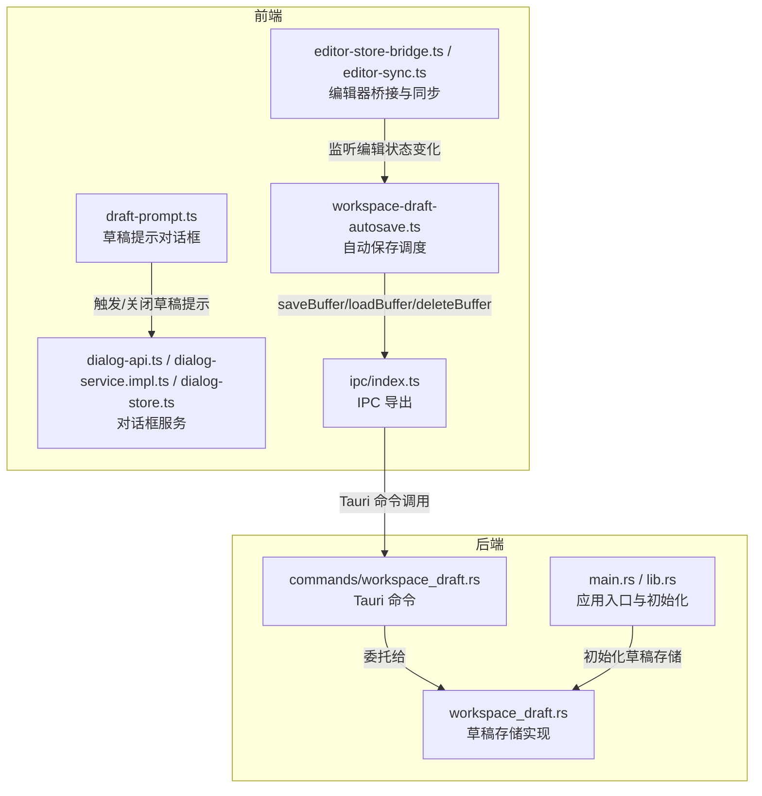
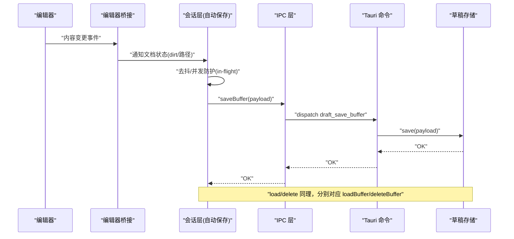
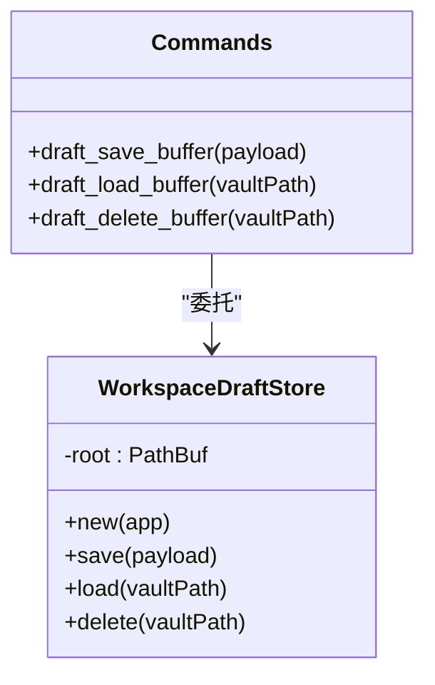
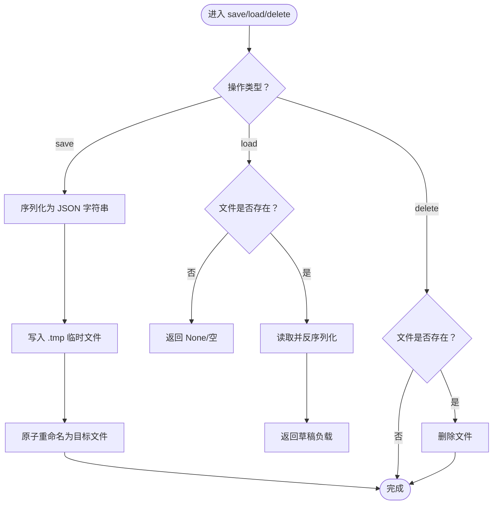
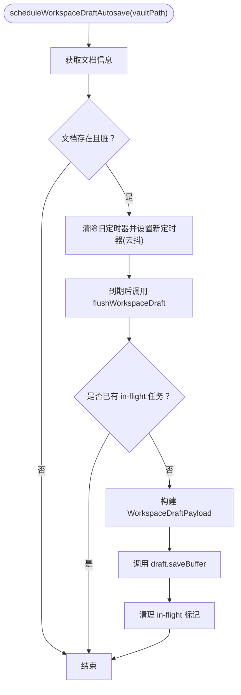
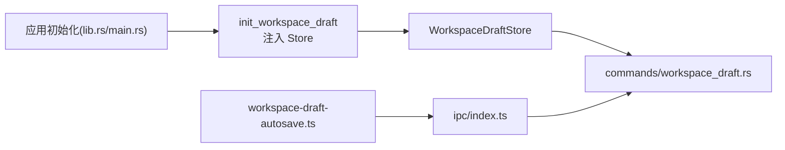

# 草稿管理命令

<cite>
**本文引用的文件**
- [src-tauri/src/commands/workspace_draft.rs](file://src-tauri/src/commands/workspace_draft.rs)
- [src-tauri/src/workspace_draft.rs](file://src-tauri/src/workspace_draft.rs)
- [src/core/session/workspace-draft-autosave.ts](file://src/core/session/workspace-draft-autosave.ts)
- [src/core/dialog/draft-prompt.ts](file://src/core/dialog/draft-prompt.ts)
- [src/core/dialog/dialog-api.ts](file://src/core/dialog/dialog-api.ts)
- [src/core/dialog/dialog-service.impl.ts](file://src/core/dialog/dialog-service.impl.ts)
- [src/core/dialog/dialog-store.ts](file://src/core/dialog/dialog-store.ts)
- [src/core/dialog/types.ts](file://src/core/dialog/types.ts)
- [src/core/document/file-tier.ts](file://src/core/document/file-tier.ts)
- [src/core/document/types.ts](file://src/core/document/types.ts)
- [src/core/bridge/editor-store-bridge.ts](file://src/core/bridge/editor-store-bridge.ts)
- [src/core/bridge/editor-sync.ts](file://src/core/bridge/editor-sync.ts)
- [src/ipc/index.ts](file://src/ipc/index.ts)
- [src-tauri/src/main.rs](file://src-tauri/src/main.rs)
- [src-tauri/src/lib.rs](file://src-tauri/src/lib.rs)
</cite>

## 目录
1. [简介](#简介)
2. [项目结构](#项目结构)
3. [核心组件](#核心组件)
4. [架构总览](#架构总览)
5. [详细组件分析](#详细组件分析)
6. [依赖关系分析](#依赖关系分析)
7. [性能考量](#性能考量)
8. [故障排查指南](#故障排查指南)
9. [结论](#结论)
10. [附录](#附录)

## 简介
本文件系统性梳理了 NoteForge 中“草稿管理命令”的实现与使用方式，覆盖 Tauri 命令层（Rust）与前端会话层（TypeScript）的协作机制，重点说明草稿的创建、保存、加载、删除与清理流程；解释草稿存储机制、版本控制策略、自动保存策略与数据持久化方案；阐述草稿与正式文档的关系、冲突处理与同步机制；并提供最佳实践、用户体验优化与数据安全建议。

## 项目结构
草稿管理涉及前后端协同：前端负责内容采集、去抖与自动保存调度；后端负责草稿缓冲区的持久化与检索；二者通过 IPC 通道交互。

图表来源
- [src/core/session/workspace-draft-autosave.ts:1-100](file://src/core/session/workspace-draft-autosave.ts#L1-L100)
- [src/core/dialog/draft-prompt.ts](file://src/core/dialog/draft-prompt.ts)
- [src/core/dialog/dialog-api.ts](file://src/core/dialog/dialog-api.ts)
- [src/core/dialog/dialog-service.impl.ts](file://src/core/dialog/dialog-service.impl.ts)
- [src/core/dialog/dialog-store.ts](file://src/core/dialog/dialog-store.ts)
- [src/core/bridge/editor-store-bridge.ts](file://src/core/bridge/editor-store-bridge.ts)
- [src/core/bridge/editor-sync.ts](file://src/core/bridge/editor-sync.ts)
- [src/ipc/index.ts](file://src/ipc/index.ts)
- [src-tauri/src/workspace_draft.rs:1-68](file://src-tauri/src/workspace_draft.rs#L1-L68)
- [src-tauri/src/commands/workspace_draft.rs:1-29](file://src-tauri/src/commands/workspace_draft.rs#L1-L29)
- [src-tauri/src/main.rs](file://src-tauri/src/main.rs)
- [src-tauri/src/lib.rs](file://src-tauri/src/lib.rs)

章节来源
- [src/core/session/workspace-draft-autosave.ts:1-100](file://src/core/session/workspace-draft-autosave.ts#L1-L100)
- [src-tauri/src/workspace_draft.rs:1-68](file://src-tauri/src/workspace_draft.rs#L1-L68)
- [src-tauri/src/commands/workspace_draft.rs:1-29](file://src-tauri/src/commands/workspace_draft.rs#L1-L29)

## 核心组件
- Tauri 草稿命令
  - draft_save_buffer：保存草稿缓冲区
  - draft_load_buffer：按 vault_path 加载草稿
  - draft_delete_buffer：按 vault_path 删除草稿
- 草稿存储实现
  - WorkspaceDraftStore：基于应用数据目录的 JSON 文件持久化，采用临时文件写入+原子重命名保证一致性
  - 草稿文件名以 vault_path 的哈希值命名，避免非法字符与路径冲突
- 自动保存调度
  - 基于文档层级配置的去抖策略，仅在文档脏状态且存在时执行
  - 支持并发去重（in-flight 防护）、批量刷新与取消待定任务
- 对话框与提示
  - 草稿提示对话框用于引导用户处理未保存草稿
  - 对话框服务统一管理显示/隐藏与状态

章节来源
- [src-tauri/src/commands/workspace_draft.rs:1-29](file://src-tauri/src/commands/workspace_draft.rs#L1-L29)
- [src-tauri/src/workspace_draft.rs:1-68](file://src-tauri/src/workspace_draft.rs#L1-L68)
- [src/core/session/workspace-draft-autosave.ts:1-100](file://src/core/session/workspace-draft-autosave.ts#L1-L100)
- [src/core/dialog/draft-prompt.ts](file://src/core/dialog/draft-prompt.ts)
- [src/core/dialog/dialog-api.ts](file://src/core/dialog/dialog-api.ts)
- [src/core/dialog/dialog-service.impl.ts](file://src/core/dialog/dialog-service.impl.ts)
- [src/core/dialog/dialog-store.ts](file://src/core/dialog/dialog-store.ts)

## 架构总览
下图展示从编辑器到 IPC、再到后端草稿存储的完整链路，以及自动保存与手动保存的双轨策略。

图表来源
- [src/core/bridge/editor-store-bridge.ts](file://src/core/bridge/editor-store-bridge.ts)
- [src/core/bridge/editor-sync.ts](file://src/core/bridge/editor-sync.ts)
- [src/core/session/workspace-draft-autosave.ts:1-100](file://src/core/session/workspace-draft-autosave.ts#L1-L100)
- [src/ipc/index.ts](file://src/ipc/index.ts)
- [src-tauri/src/commands/workspace_draft.rs:1-29](file://src-tauri/src/commands/workspace_draft.rs#L1-L29)
- [src-tauri/src/workspace_draft.rs:1-68](file://src-tauri/src/workspace_draft.rs#L1-L68)

## 详细组件分析

### Tauri 草稿命令
- 命令职责
  - draft_save_buffer：接收 WorkspaceDraftPayload，委托存储实现进行保存
  - draft_load_buffer：根据 vault_path 返回草稿或空
  - draft_delete_buffer：根据 vault_path 删除草稿文件
- 错误处理
  - 统一映射为 NoteforgeError，便于前端捕获与提示

图表来源
- [src-tauri/src/commands/workspace_draft.rs:1-29](file://src-tauri/src/commands/workspace_draft.rs#L1-L29)
- [src-tauri/src/workspace_draft.rs:1-68](file://src-tauri/src/workspace_draft.rs#L1-L68)

章节来源
- [src-tauri/src/commands/workspace_draft.rs:1-29](file://src-tauri/src/commands/workspace_draft.rs#L1-L29)
- [src-tauri/src/workspace_draft.rs:1-68](file://src-tauri/src/workspace_draft.rs#L1-L68)

### 草稿存储实现
- 存储位置
  - 应用数据目录下的 drafts 子目录
- 文件命名
  - 使用 vault_path 的哈希值作为文件名，扩展名为 .json
- 写入策略
  - 先写入临时文件，再原子重命名为目标文件，避免部分写入导致的数据损坏
- 并发与幂等
  - 通过 in-flight Map 避免重复提交
  - load/delete 在不存在时返回空/无操作

图表来源
- [src-tauri/src/workspace_draft.rs:36-61](file://src-tauri/src/workspace_draft.rs#L36-L61)

章节来源
- [src-tauri/src/workspace_draft.rs:1-68](file://src-tauri/src/workspace_draft.rs#L1-L68)

### 自动保存调度与去抖
- 触发条件
  - 文档存在且处于脏状态
- 去抖策略
  - 每个 vault_path 维护一个定时器，最近一次变更后等待 tier 配置的延迟时间
- 并发防护
  - in-flight Map 记录当前正在执行的任务，避免重复提交
- 批量刷新
  - 支持一次性刷新所有脏文档
- 取消与清理
  - 提供取消待定任务与清理内存中的定时器方法

图表来源
- [src/core/session/workspace-draft-autosave.ts:12-55](file://src/core/session/workspace-draft-autosave.ts#L12-L55)

章节来源
- [src/core/session/workspace-draft-autosave.ts:1-100](file://src/core/session/workspace-draft-autosave.ts#L1-L100)
- [src/core/document/file-tier.ts](file://src/core/document/file-tier.ts)
- [src/core/document/types.ts](file://src/core/document/types.ts)

### 草稿与正式文档的关系、冲突与同步
- 关系定位
  - 草稿是“未落盘”的工作缓冲区，正式文档来自磁盘文件
- 冲突与同步
  - 自动保存将编辑器缓冲写入草稿存储，不直接修改正式文件
  - 手动保存/另存为由文档服务层处理，草稿可作为恢复来源
  - 若同一文档同时存在草稿与正式版本，建议在打开时优先加载草稿并提示用户合并
- 编辑器桥接
  - 通过 editor-store-bridge 与 editor-sync 监听编辑状态变化，驱动自动保存

章节来源
- [src/core/bridge/editor-store-bridge.ts](file://src/core/bridge/editor-store-bridge.ts)
- [src/core/bridge/editor-sync.ts](file://src/core/bridge/editor-sync.ts)

### 对话框与用户提示
- 草稿提示
  - 在退出或切换文档时，若存在未保存草稿，弹出对话框询问用户处理方式
- 对话框服务
  - dialog-service.impl.ts 提供统一的服务接口
  - dialog-store.ts 管理对话框状态
  - dialog-api.ts 暴露对外 API

章节来源
- [src/core/dialog/draft-prompt.ts](file://src/core/dialog/draft-prompt.ts)
- [src/core/dialog/dialog-api.ts](file://src/core/dialog/dialog-api.ts)
- [src/core/dialog/dialog-service.impl.ts](file://src/core/dialog/dialog-service.impl.ts)
- [src/core/dialog/dialog-store.ts](file://src/core/dialog/dialog-store.ts)
- [src/core/dialog/types.ts](file://src/core/dialog/types.ts)

## 依赖关系分析
- 初始化链路
  - 应用启动时初始化草稿存储，并注入到全局状态
- 命令注册
  - 通过 Tauri 命令系统暴露 draft_* 接口
- 前后端耦合点
  - 前端仅依赖 IPC 导出的 draft.* 方法
  - 后端通过 State 注入 WorkspaceDraftStore，降低模块间耦合

图表来源
- [src-tauri/src/lib.rs](file://src-tauri/src/lib.rs)
- [src-tauri/src/main.rs](file://src-tauri/src/main.rs)
- [src-tauri/src/workspace_draft.rs:64-68](file://src-tauri/src/workspace_draft.rs#L64-L68)
- [src/core/session/workspace-draft-autosave.ts:1-100](file://src/core/session/workspace-draft-autosave.ts#L1-L100)
- [src/ipc/index.ts](file://src/ipc/index.ts)
- [src-tauri/src/commands/workspace_draft.rs:1-29](file://src-tauri/src/commands/workspace_draft.rs#L1-L29)

章节来源
- [src-tauri/src/lib.rs](file://src-tauri/src/lib.rs)
- [src-tauri/src/main.rs](file://src-tauri/src/main.rs)
- [src-tauri/src/workspace_draft.rs:64-68](file://src-tauri/src/workspace_draft.rs#L64-L68)
- [src/core/session/workspace-draft-autosave.ts:1-100](file://src/core/session/workspace-draft-autosave.ts#L1-L100)
- [src/ipc/index.ts](file://src/ipc/index.ts)

## 性能考量
- IO 原子性
  - 采用临时文件+重命名策略，减少部分写入风险，提升可靠性
- 去抖与并发
  - 基于 Map 的去抖与 in-flight 防护，避免高频变更导致的 IO 放大
- 文件命名
  - 哈希命名避免路径分隔符与非法字符问题，简化文件系统访问
- 批量刷新
  - flushAllDirtyWorkspaceDrafts 并行处理多个文档，缩短整体刷新时间

章节来源
- [src-tauri/src/workspace_draft.rs:36-61](file://src-tauri/src/workspace_draft.rs#L36-L61)
- [src/core/session/workspace-draft-autosave.ts:64-74](file://src/core/session/workspace-draft-autosave.ts#L64-L74)

## 故障排查指南
- 常见错误类型
  - IO 错误：文件读写失败、权限不足、磁盘空间不足
  - JSON 解析错误：草稿文件格式异常或被破坏
  - 内部错误：应用数据目录不可用
- 定位步骤
  - 检查应用数据目录下的 drafts 子目录是否存在与权限
  - 校验草稿文件是否为合法 JSON
  - 查看前端日志中自动保存失败的堆栈
- 处理建议
  - 清理无效草稿文件后重试
  - 重启应用以重新初始化草稿存储
  - 检查磁盘配额与文件系统权限

章节来源
- [src-tauri/src/workspace_draft.rs:36-61](file://src-tauri/src/workspace_draft.rs#L36-L61)
- [src/core/session/workspace-draft-autosave.ts:42-46](file://src/core/session/workspace-draft-autosave.ts#L42-L46)

## 结论
草稿管理通过“前端自动保存 + 后端原子持久化”的双轨设计，在保障数据安全的同时提升了用户体验。去抖与并发防护有效降低了 IO 压力；哈希命名与临时文件策略确保了可靠性。建议在后续迭代中进一步增强版本控制与冲突合并能力，以支持更复杂的协作场景。

## 附录

### 使用场景与操作示例（步骤说明）
- 场景一：自动保存草稿
  - 步骤：编辑器内容变更 → 去抖计时器启动 → 到期后构建草稿负载 → 调用 saveBuffer → 后端原子写入
  - 参考：[src/core/session/workspace-draft-autosave.ts:12-55](file://src/core/session/workspace-draft-autosave.ts#L12-L55)
- 场景二：手动加载草稿
  - 步骤：打开文档 → 调用 loadBuffer → 若存在则提示用户恢复
  - 参考：[src/core/session/workspace-draft-autosave.ts:94-100](file://src/core/session/workspace-draft-autosave.ts#L94-L100)
- 场景三：清理草稿
  - 步骤：关闭文档或确认不再需要 → 调用 deleteBuffer → 删除本地草稿文件
  - 参考：[src/core/session/workspace-draft-autosave.ts:76-85](file://src/core/session/workspace-draft-autosave.ts#L76-L85)

### 最佳实践
- 用户体验
  - 在退出或切换文档前检查草稿并弹出提示
  - 提供“恢复草稿”快捷入口
- 数据安全
  - 严格使用临时文件+重命名策略
  - 对异常情况记录日志并允许用户回滚
- 性能优化
  - 合理设置去抖间隔，平衡实时性与 IO 压力
  - 批量刷新脏文档，减少频繁小文件写入