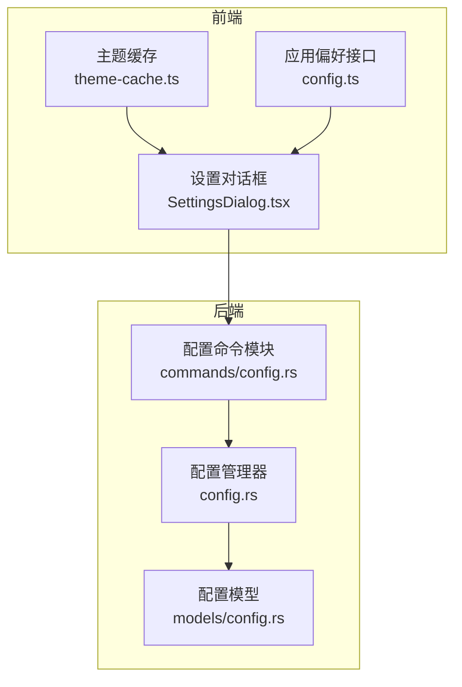
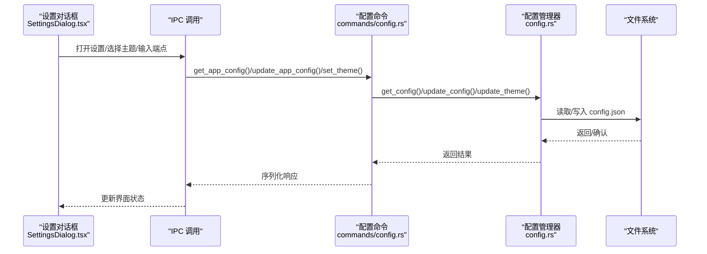
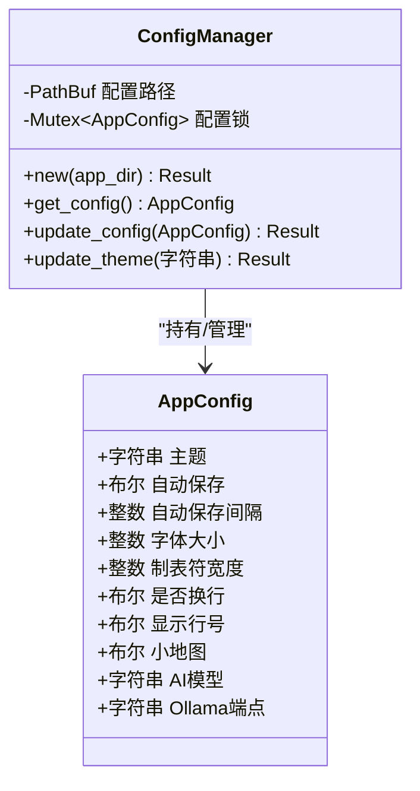
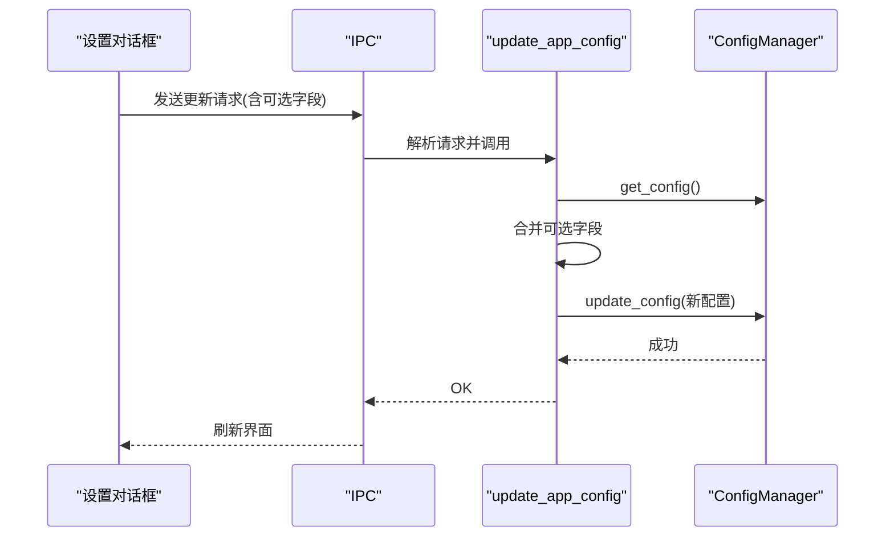
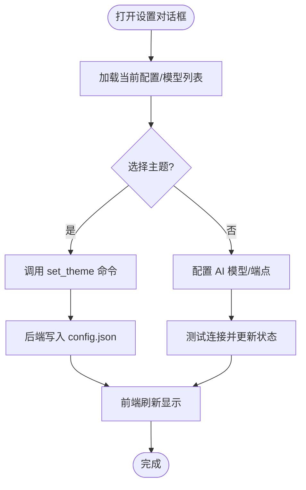
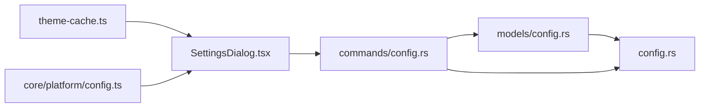

# 配置管理命令

<cite>
**本文引用的文件**
- [src-tauri/src/commands/config.rs](file://src-tauri/src/commands/config.rs)
- [src-tauri/src/config.rs](file://src-tauri/src/config.rs)
- [src-tauri/src/models/config.rs](file://src-tauri/src/models/config.rs)
- [src/core/platform/config.ts](file://src/core/platform/config.ts)
- [src/components/dialogs/SettingsDialog.tsx](file://src/components/dialogs/SettingsDialog.tsx)
- [src/lib/theme-cache.ts](file://src/lib/theme-cache.ts)
</cite>

## 目录
1. [简介](#简介)
2. [项目结构](#项目结构)
3. [核心组件](#核心组件)
4. [架构总览](#架构总览)
5. [详细组件分析](#详细组件分析)
6. [依赖关系分析](#依赖关系分析)
7. [性能考量](#性能考量)
8. [故障排查指南](#故障排查指南)
9. [结论](#结论)
10. [附录](#附录)

## 简介
本文件系统化梳理 NoteForge 中“配置管理命令”的实现与使用方式，覆盖以下方面：
- 配置读取、写入、主题设置与更新检查等命令
- 配置文件格式（JSON）、默认值处理、持久化位置
- 前端设置对话框与后端命令的交互流程
- 安全性与版本兼容性建议
- 最佳实践、备份恢复与迁移策略
- 典型使用场景与示例路径

## 项目结构
配置管理涉及前后端协作：
- 后端（Rust）：定义配置数据结构、初始化与持久化、暴露 Tauri 命令
- 前端（TypeScript/React）：通过 IPC 调用命令，展示设置界面并驱动用户交互

图表来源
- [src/components/dialogs/SettingsDialog.tsx:1-167](file://src/components/dialogs/SettingsDialog.tsx#L1-L167)
- [src/lib/theme-cache.ts:1-45](file://src/lib/theme-cache.ts#L1-L45)
- [src/core/platform/config.ts:1-40](file://src/core/platform/config.ts#L1-L40)
- [src-tauri/src/commands/config.rs:1-96](file://src-tauri/src/commands/config.rs#L1-L96)
- [src-tauri/src/config.rs:1-90](file://src-tauri/src/config.rs#L1-L90)
- [src-tauri/src/models/config.rs:1-51](file://src-tauri/src/models/config.rs#L1-L51)

章节来源
- [src-tauri/src/commands/config.rs:1-96](file://src-tauri/src/commands/config.rs#L1-L96)
- [src-tauri/src/config.rs:1-90](file://src-tauri/src/config.rs#L1-L90)
- [src-tauri/src/models/config.rs:1-51](file://src-tauri/src/models/config.rs#L1-L51)
- [src/core/platform/config.ts:1-40](file://src/core/platform/config.ts#L1-L40)
- [src/components/dialogs/SettingsDialog.tsx:1-167](file://src/components/dialogs/SettingsDialog.tsx#L1-L167)
- [src/lib/theme-cache.ts:1-45](file://src/lib/theme-cache.ts#L1-L45)

## 核心组件
- 配置数据结构与默认值
  - 后端定义了应用配置结构体，包含主题、自动保存、字体大小、制表符宽度、换行、行号、小地图、AI 模型与 Ollama 端点等字段，并提供默认值。
  - 默认值在首次运行或缺失配置文件时生效。

- 配置管理器
  - 负责加载/保存 JSON 配置到应用数据目录；提供线程安全的读写封装。

- Tauri 配置命令
  - 提供获取完整配置、按需更新配置、仅更新主题、检查更新等命令。

- 前端设置对话框
  - 展示主题选择、AI 模型与端点配置，支持连接测试与状态反馈。

章节来源
- [src-tauri/src/config.rs:9-38](file://src-tauri/src/config.rs#L9-L38)
- [src-tauri/src/config.rs:40-80](file://src-tauri/src/config.rs#L40-L80)
- [src-tauri/src/commands/config.rs:9-87](file://src-tauri/src/commands/config.rs#L9-L87)
- [src-tauri/src/models/config.rs:3-51](file://src-tauri/src/models/config.rs#L3-L51)
- [src/components/dialogs/SettingsDialog.tsx:10-167](file://src/components/dialogs/SettingsDialog.tsx#L10-L167)

## 架构总览
下图展示了从 UI 到后端命令再到持久化的整体流程：

图表来源
- [src/components/dialogs/SettingsDialog.tsx:1-167](file://src/components/dialogs/SettingsDialog.tsx#L1-L167)
- [src-tauri/src/commands/config.rs:9-87](file://src-tauri/src/commands/config.rs#L9-L87)
- [src-tauri/src/config.rs:40-80](file://src-tauri/src/config.rs#L40-L80)

## 详细组件分析

### 数据模型与默认值
- 结构体字段
  - 主题、自动保存开关、自动保存间隔、字体大小、制表符宽度、是否换行、是否显示行号、是否启用小地图、AI 模型名称、Ollama 服务端点。
- 默认值
  - 首次运行或缺失配置文件时，使用默认值初始化配置对象。

章节来源
- [src-tauri/src/config.rs:9-38](file://src-tauri/src/config.rs#L9-L38)

### 配置管理器（ConfigManager）
- 初始化
  - 在应用数据目录创建配置文件路径，若存在则解析 JSON，否则使用默认值。
- 读取与更新
  - 读取：返回当前配置快照（克隆）。
  - 更新：替换内存中的配置并以美化格式写回 JSON 文件。
- 主题更新
  - 仅更新主题字段并持久化，便于快速切换主题。

图表来源
- [src-tauri/src/config.rs:9-38](file://src-tauri/src/config.rs#L9-L38)
- [src-tauri/src/config.rs:40-80](file://src-tauri/src/config.rs#L40-L80)

章节来源
- [src-tauri/src/config.rs:40-80](file://src-tauri/src/config.rs#L40-L80)

### Tauri 配置命令
- get_app_config
  - 读取当前配置并返回完整响应对象。
- update_app_config
  - 支持按需更新多个字段；内部合并请求中的可选字段到当前配置并持久化。
- get_theme / set_theme
  - 获取/设置主题；set_theme 为独立命令，便于 UI 快速切换。
- check_for_updates
  - 当前返回固定占位响应，表示暂不提供更新检查。

图表来源
- [src-tauri/src/commands/config.rs:29-69](file://src-tauri/src/commands/config.rs#L29-L69)
- [src-tauri/src/config.rs:60-71](file://src-tauri/src/config.rs#L60-L71)

章节来源
- [src-tauri/src/commands/config.rs:9-87](file://src-tauri/src/commands/config.rs#L9-L87)
- [src-tauri/src/models/config.rs:18-31](file://src-tauri/src/models/config.rs#L18-L31)

### 前端设置对话框与主题缓存
- 设置对话框
  - 提供主题模式选择（亮色/暗色/跟随系统）、AI 模型与端点配置、连接测试与状态提示。
- 主题缓存
  - 使用本地存储缓存主题模式；页面加载时应用缓存的主题类名，避免闪烁。
- 应用偏好接口
  - 定义编辑器与自动保存等偏好接口与默认值，用于前端层面的偏好管理。

图表来源
- [src/components/dialogs/SettingsDialog.tsx:10-167](file://src/components/dialogs/SettingsDialog.tsx#L10-L167)
- [src/lib/theme-cache.ts:1-45](file://src/lib/theme-cache.ts#L1-L45)
- [src/core/platform/config.ts:1-40](file://src/core/platform/config.ts#L1-L40)
- [src-tauri/src/commands/config.rs:71-87](file://src-tauri/src/commands/config.rs#L71-L87)
- [src-tauri/src/config.rs:73-79](file://src-tauri/src/config.rs#L73-L79)

章节来源
- [src/components/dialogs/SettingsDialog.tsx:1-167](file://src/components/dialogs/SettingsDialog.tsx#L1-L167)
- [src/lib/theme-cache.ts:1-45](file://src/lib/theme-cache.ts#L1-L45)
- [src/core/platform/config.ts:1-40](file://src/core/platform/config.ts#L1-L40)

## 依赖关系分析
- 组件耦合
  - 命令模块依赖配置管理器；配置管理器依赖模型定义与文件系统。
  - 前端通过 IPC 调用命令，设置对话框与主题缓存相互配合。
- 可能的循环依赖
  - 当前模块间为单向依赖，未见循环。
- 外部依赖
  - JSON 序列化/反序列化、文件系统读写、Tauri 状态注入。

图表来源
- [src-tauri/src/models/config.rs:1-51](file://src-tauri/src/models/config.rs#L1-L51)
- [src-tauri/src/config.rs:1-90](file://src-tauri/src/config.rs#L1-L90)
- [src-tauri/src/commands/config.rs:1-96](file://src-tauri/src/commands/config.rs#L1-L96)
- [src/components/dialogs/SettingsDialog.tsx:1-167](file://src/components/dialogs/SettingsDialog.tsx#L1-L167)
- [src/lib/theme-cache.ts:1-45](file://src/lib/theme-cache.ts#L1-L45)
- [src/core/platform/config.ts:1-40](file://src/core/platform/config.ts#L1-L40)

章节来源
- [src-tauri/src/commands/config.rs:1-96](file://src-tauri/src/commands/config.rs#L1-L96)
- [src-tauri/src/config.rs:1-90](file://src-tauri/src/config.rs#L1-L90)
- [src-tauri/src/models/config.rs:1-51](file://src-tauri/src/models/config.rs#L1-L51)
- [src/components/dialogs/SettingsDialog.tsx:1-167](file://src/components/dialogs/SettingsDialog.tsx#L1-L167)
- [src/lib/theme-cache.ts:1-45](file://src/lib/theme-cache.ts#L1-L45)
- [src/core/platform/config.ts:1-40](file://src/core/platform/config.ts#L1-L40)

## 性能考量
- 内存与锁
  - 配置管理器使用互斥锁保护配置对象，读写均进行加锁；频繁更新时建议批量合并后再写入，减少磁盘 IO。
- JSON 序列化
  - 写入采用美化格式，可读性更好但体积略大；如对性能敏感可评估紧凑格式。
- 前端渲染
  - 主题切换通过命令与缓存结合，避免闪烁；建议在高频切换场景下节流 UI 更新。

## 故障排查指南
- 配置文件损坏
  - 现象：启动时报错或配置未生效。
  - 排查：删除或重命名配置文件，重启应用以生成默认配置。
  - 位置：应用数据目录下的配置文件路径由管理器初始化时确定。
- 权限问题
  - 现象：无法写入配置文件。
  - 排查：确保应用数据目录可写；必要时以管理员权限运行或调整目录权限。
- 命令调用失败
  - 现象：前端设置无效或报错。
  - 排查：检查命令注册与 IPC 调用链路；确认命令参数类型与后端模型一致。

章节来源
- [src-tauri/src/config.rs:46-59](file://src-tauri/src/config.rs#L46-L59)
- [src-tauri/src/config.rs:65-71](file://src-tauri/src/config.rs#L65-L71)
- [src-tauri/src/commands/config.rs:1-96](file://src-tauri/src/commands/config.rs#L1-L96)

## 结论
本配置管理方案以简洁的数据模型与命令接口为核心，结合前端设置对话框与主题缓存，实现了从读取、更新到持久化的闭环。建议在生产环境中进一步完善版本兼容、增量更新与校验机制，并加强错误处理与日志记录，以提升稳定性与可观测性。

## 附录

### 配置文件格式与默认值
- 存储位置
  - 应用数据目录下的配置文件路径由管理器初始化时确定。
- 格式
  - JSON；后端写入时采用美化格式。
- 默认值
  - 首次运行或缺失配置时使用默认值初始化。

章节来源
- [src-tauri/src/config.rs:46-59](file://src-tauri/src/config.rs#L46-L59)
- [src-tauri/src/config.rs:23-38](file://src-tauri/src/config.rs#L23-L38)

### 环境变量与动态更新
- 环境变量
  - 当前实现未直接使用环境变量；如需扩展，可在初始化阶段读取并覆盖默认值。
- 动态更新
  - 前端通过命令实时更新配置并持久化；主题变更可通过独立命令快速生效。

章节来源
- [src-tauri/src/commands/config.rs:71-87](file://src-tauri/src/commands/config.rs#L71-L87)
- [src-tauri/src/config.rs:73-79](file://src-tauri/src/config.rs#L73-L79)

### 安全性考虑
- 凭证存储
  - AI 模型 API Key 等敏感信息应避免明文存储；建议引入加密存储或平台级凭据管理。
- 文件权限
  - 确保配置文件仅当前用户可读写，避免被其他用户篡改。
- 输入校验
  - 对外部输入（如端点、模型名）进行白名单与格式校验，防止注入与异常。

### 版本兼容性与迁移策略
- 版本标记
  - 在配置根对象添加版本字段，用于识别配置格式版本。
- 迁移流程
  - 启动时检测版本，若低于当前版本则执行迁移脚本：补齐新增字段、转换旧字段、清理废弃项。
- 回滚与备份
  - 迁移前备份原配置；失败时回滚至备份。

### 最佳实践
- 批量更新
  - UI 多处修改时，先在前端聚合，再一次性调用更新命令，减少 IO 次数。
- 错误处理
  - 对命令调用失败进行统一捕获与提示，避免影响用户体验。
- 日志与监控
  - 记录关键配置变更事件，便于审计与问题定位。

### 使用场景示例
- 场景一：切换主题
  - 步骤：用户在设置对话框选择主题 → 调用设置主题命令 → 后端更新并写回配置 → 前端应用缓存主题。
  - 示例路径：[设置对话框:42-61](file://src/components/dialogs/SettingsDialog.tsx#L42-L61)，[设置主题命令:81-87](file://src-tauri/src/commands/config.rs#L81-L87)，[主题缓存:24-45](file://src/lib/theme-cache.ts#L24-L45)。
- 场景二：配置 AI 模型与端点
  - 步骤：用户在设置对话框填写端点与选择模型 → 触发连接测试 → 更新成功后持久化配置。
  - 示例路径：[设置对话框:67-153](file://src/components/dialogs/SettingsDialog.tsx#L67-L153)，[更新配置命令:29-69](file://src-tauri/src/commands/config.rs#L29-L69)。