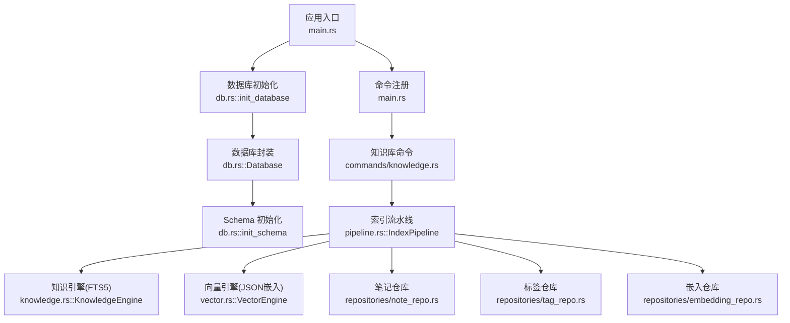
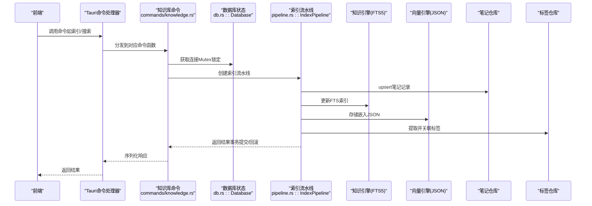
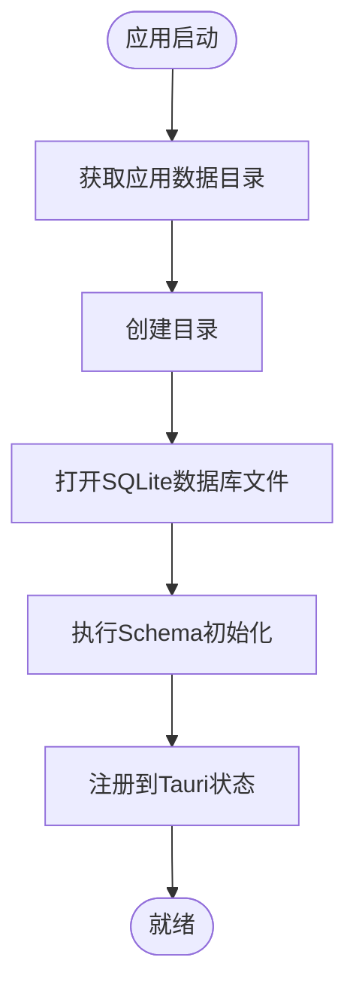
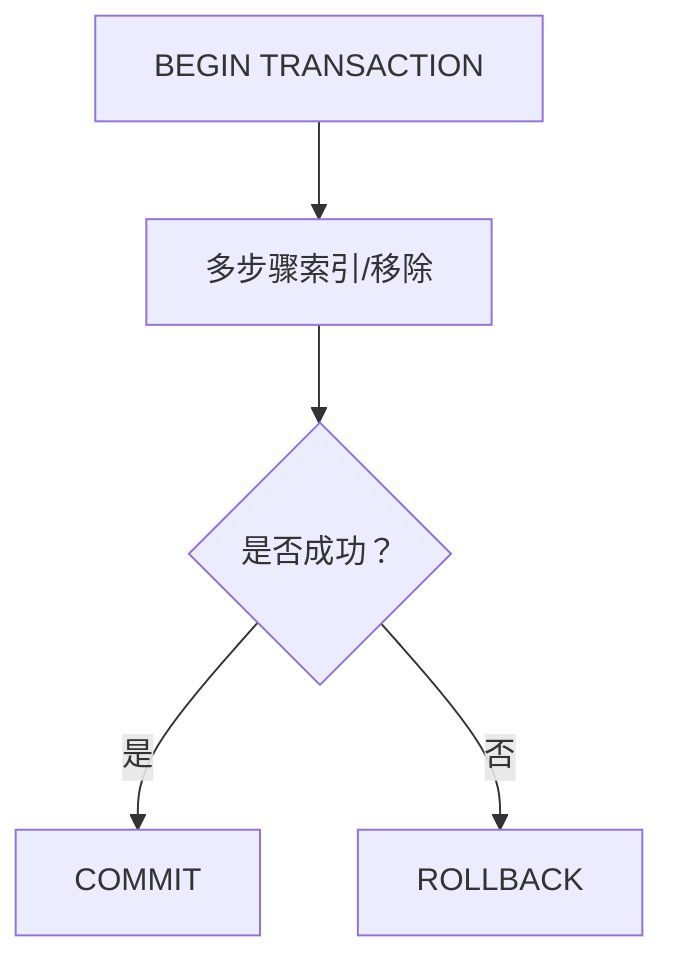
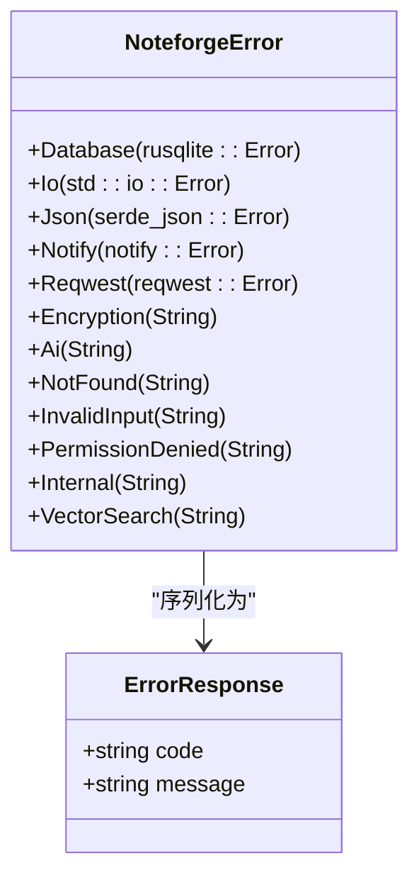
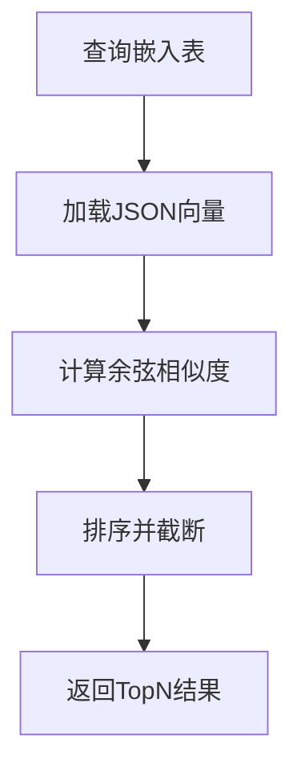
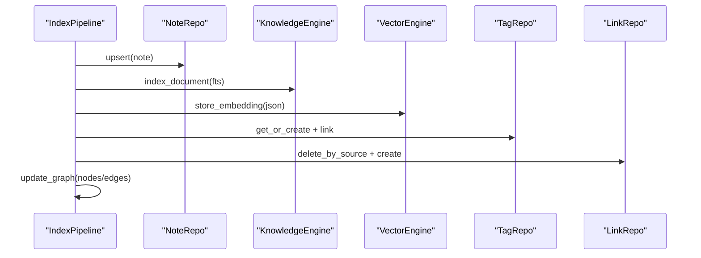
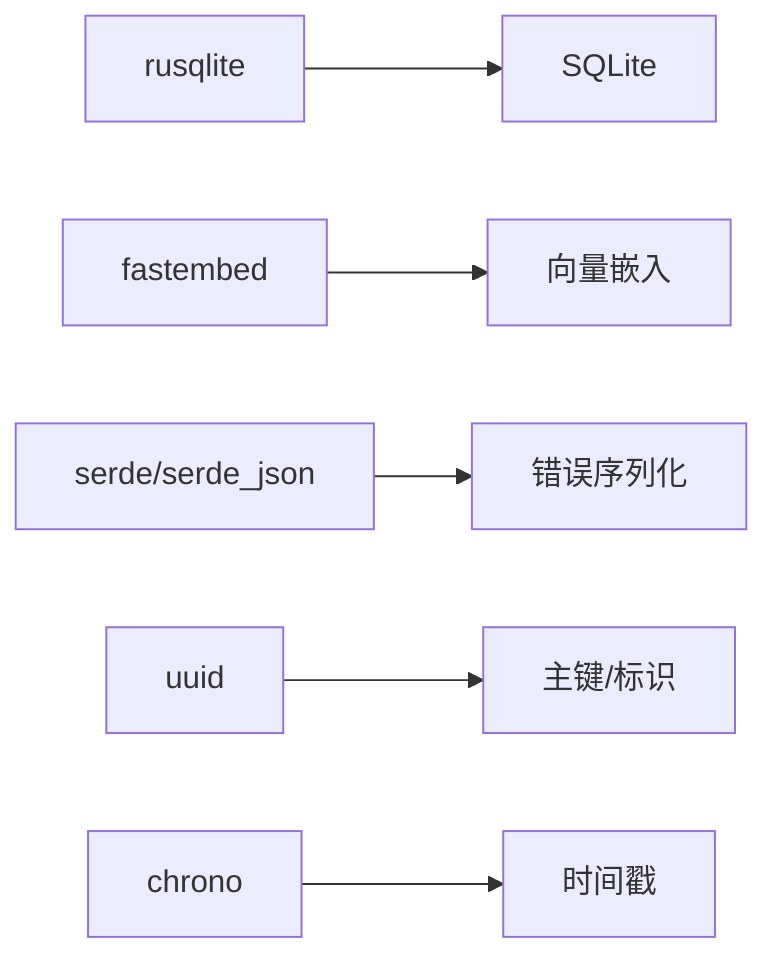

# 数据库操作

<cite>
**本文引用的文件**
- [src-tauri/src/db.rs](file://src-tauri/src/db.rs)
- [src-tauri/src/error.rs](file://src-tauri/src/error.rs)
- [src-tauri/src/repositories/note_repo.rs](file://src-tauri/src/repositories/note_repo.rs)
- [src-tauri/src/repositories/tag_repo.rs](file://src-tauri/src/repositories/tag_repo.rs)
- [src-tauri/src/repositories/embedding_repo.rs](file://src-tauri/src/repositories/embedding_repo.rs)
- [src-tauri/src/vector.rs](file://src-tauri/src/vector.rs)
- [src-tauri/src/knowledge.rs](file://src-tauri/src/knowledge.rs)
- [src-tauri/src/pipeline.rs](file://src-tauri/src/pipeline.rs)
- [src-tauri/src/commands/knowledge.rs](file://src-tauri/src/commands/knowledge.rs)
- [src-tauri/src/commands/search.rs](file://src-tauri/src/commands/search.rs)
- [src-tauri/src/models/note.rs](file://src-tauri/src/models/note.rs)
- [src-tauri/src/main.rs](file://src-tauri/src/main.rs)
- [src-tauri/Cargo.toml](file://src-tauri/Cargo.toml)
</cite>

## 目录
1. [简介](#简介)
2. [项目结构](#项目结构)
3. [核心组件](#核心组件)
4. [架构总览](#架构总览)
5. [详细组件分析](#详细组件分析)
6. [依赖分析](#依赖分析)
7. [性能考量](#性能考量)
8. [故障排查指南](#故障排查指南)
9. [结论](#结论)
10. [附录](#附录)

## 简介
本文件系统性梳理 NoteForge 的数据库操作实现，覆盖 SQLite 初始化与连接管理、模式（Schema）与索引设计、事务与并发控制、错误处理体系、迁移与版本升级策略、向量数据库与全文检索集成、备份与维护建议，以及面向生产环境的最佳实践与性能优化路径。

## 项目结构
NoteForge 后端基于 Tauri + Rust 实现，数据库层位于 src-tauri/src 下，采用 rusqlite 作为 SQLite 驱动，通过统一的 Database 封装持有连接，并在应用启动时初始化数据库与 Schema。知识引擎使用 FTS5 全文检索，向量引擎基于 fastembed 计算嵌入并以 JSON 存储于 SQLite，配合多表索引与事务保证一致性。

**图表来源**
- [src-tauri/src/main.rs:1-101](file://src-tauri/src/main.rs#L1-L101)
- [src-tauri/src/db.rs:1-184](file://src-tauri/src/db.rs#L1-L184)
- [src-tauri/src/knowledge.rs:1-75](file://src-tauri/src/knowledge.rs#L1-L75)
- [src-tauri/src/vector.rs:1-151](file://src-tauri/src/vector.rs#L1-L151)
- [src-tauri/src/pipeline.rs:1-290](file://src-tauri/src/pipeline.rs#L1-L290)
- [src-tauri/src/repositories/note_repo.rs:1-170](file://src-tauri/src/repositories/note_repo.rs#L1-L170)
- [src-tauri/src/repositories/tag_repo.rs:1-121](file://src-tauri/src/repositories/tag_repo.rs#L1-L121)
- [src-tauri/src/repositories/embedding_repo.rs:1-72](file://src-tauri/src/repositories/embedding_repo.rs#L1-L72)
- [src-tauri/src/commands/knowledge.rs:1-305](file://src-tauri/src/commands/knowledge.rs#L1-L305)

**章节来源**
- [src-tauri/src/main.rs:1-101](file://src-tauri/src/main.rs#L1-L101)
- [src-tauri/src/db.rs:1-184](file://src-tauri/src/db.rs#L1-L184)

## 核心组件
- 数据库封装与连接管理：通过 Mutex 包裹 rusqlite::Connection，提供线程安全访问；在应用启动阶段创建数据库文件并初始化 Schema。
- 错误处理体系：统一的 NoteforgeError 枚举，覆盖数据库、IO、JSON、通知、网络、加密、AI、未找到、输入无效、权限、内部、向量搜索等错误类型，并支持序列化为统一响应格式。
- 仓库层（Repository）：按领域拆分，如 NoteRepo、TagRepo、EmbeddingRepo，负责具体 CRUD 操作与参数绑定，避免 SQL 注入风险。
- 知识引擎（FTS5）：基于 FTS5 虚拟表进行全文检索，支持删除重建与增量插入。
- 向量引擎（JSON 嵌入）：使用 fastembed 生成向量，以 JSON 形式存入 SQLite 表，提供相似度检索与删除。
- 索引流水线（事务化）：将单文档索引过程原子化，涵盖笔记写入、FTS 更新、嵌入存储、标签提取与链接抽取、图节点/边更新。

**章节来源**
- [src-tauri/src/db.rs:1-184](file://src-tauri/src/db.rs#L1-L184)
- [src-tauri/src/error.rs:1-80](file://src-tauri/src/error.rs#L1-L80)
- [src-tauri/src/repositories/note_repo.rs:1-170](file://src-tauri/src/repositories/note_repo.rs#L1-L170)
- [src-tauri/src/repositories/tag_repo.rs:1-121](file://src-tauri/src/repositories/tag_repo.rs#L1-L121)
- [src-tauri/src/repositories/embedding_repo.rs:1-72](file://src-tauri/src/repositories/embedding_repo.rs#L1-L72)
- [src-tauri/src/knowledge.rs:1-75](file://src-tauri/src/knowledge.rs#L1-L75)
- [src-tauri/src/vector.rs:1-151](file://src-tauri/src/vector.rs#L1-L151)
- [src-tauri/src/pipeline.rs:1-290](file://src-tauri/src/pipeline.rs#L1-L290)

## 架构总览
下图展示从 IPC 命令到数据库操作的关键调用链，以及事务化索引流水线如何协调多个子系统。

**图表来源**
- [src-tauri/src/commands/knowledge.rs:1-305](file://src-tauri/src/commands/knowledge.rs#L1-L305)
- [src-tauri/src/db.rs:1-184](file://src-tauri/src/db.rs#L1-L184)
- [src-tauri/src/pipeline.rs:1-290](file://src-tauri/src/pipeline.rs#L1-L290)
- [src-tauri/src/knowledge.rs:1-75](file://src-tauri/src/knowledge.rs#L1-L75)
- [src-tauri/src/vector.rs:1-151](file://src-tauri/src/vector.rs#L1-L151)
- [src-tauri/src/repositories/note_repo.rs:1-170](file://src-tauri/src/repositories/note_repo.rs#L1-L170)
- [src-tauri/src/repositories/tag_repo.rs:1-121](file://src-tauri/src/repositories/tag_repo.rs#L1-L121)

## 详细组件分析

### 数据库初始化与连接管理
- 初始化流程：应用启动时定位数据目录，创建 noteforge.db 文件，打开连接后调用 init_schema 执行建表与索引。
- 连接封装：Database 结构体以 Mutex<Connection> 暴露 conn 字段，命令处理函数通过 State<Database> 获取连接并加锁执行 SQL。
- 并发与锁：当前实现为单连接 + Mutex，适合桌面端单线程命令处理场景；若需并发读写，建议引入连接池或拆分读写连接。

**图表来源**
- [src-tauri/src/db.rs:171-184](file://src-tauri/src/db.rs#L171-L184)

**章节来源**
- [src-tauri/src/db.rs:1-184](file://src-tauri/src/db.rs#L1-L184)
- [src-tauri/src/main.rs:10-18](file://src-tauri/src/main.rs#L10-L18)

### Schema 设计与索引策略
- 主要实体：
  - 工作区（workspaces）、笔记（notes）、记忆（memories）、标签（tags）、笔记标签（note_tags）、记忆标签（memory_tags）、链接（links）、图节点（graph_nodes）、图边（graph_edges）、文件监听器（file_watchers）、搜索历史（search_history）、AI日志（ai_logs）、应用配置（app_config）。
- 关键索引：
  - 笔记：按 workspace_id 与 (workspace_id, file_path) 复合索引，加速按工作区查询与唯一约束。
  - 记忆：按 workspace_id、agent_id、type、importance 降序索引，支撑筛选与排序。
  - 链接：按 source_file、target_file 建立索引，支持反链查询。
  - 图边：按 source_node_id、target_node_id 建立索引，支撑邻接查询。
- FTS5 虚拟表：notes_fts 支持全文检索，使用 unicode61 分词器并移除变音符号，提升多语言检索体验。

**章节来源**
- [src-tauri/src/db.rs:21-165](file://src-tauri/src/db.rs#L21-L165)
- [src-tauri/src/knowledge.rs:11-20](file://src-tauri/src/knowledge.rs#L11-L20)

### 事务管理、并发控制与锁机制
- 事务化索引：IndexPipeline 在索引与移除文档时显式 BEGIN/COMMIT/ROLLBACK，确保多步骤操作原子性。
- 并发访问：当前通过 Mutex 串行化对同一连接的访问；若出现高并发写入需求，可考虑：
  - 引入连接池（如 r2d2 或 deadpool），区分读写连接；
  - 使用 WAL 模式与 PRAGMA 设置提升并发读写能力；
  - 对热点表采用分区或分库策略。
- 锁与一致性：外键约束与级联删除保障级联清理；索引与嵌入同步更新在事务内完成，避免不一致。

**图表来源**
- [src-tauri/src/pipeline.rs:25-90](file://src-tauri/src/pipeline.rs#L25-L90)
- [src-tauri/src/pipeline.rs:97-134](file://src-tauri/src/pipeline.rs#L97-L134)

**章节来源**
- [src-tauri/src/pipeline.rs:17-90](file://src-tauri/src/pipeline.rs#L17-L90)
- [src-tauri/src/pipeline.rs:92-134](file://src-tauri/src/pipeline.rs#L92-L134)

### 错误处理体系
- 统一错误枚举：NoteforgeError 覆盖数据库、IO、JSON、通知、网络、加密、AI、未找到、输入无效、权限、内部、向量搜索等错误分支。
- 序列化响应：实现 Serialize 为 ErrorResponse，包含 code 与 message，便于前端统一处理。
- 命令层传播：命令函数返回 Result，错误自动转换为统一格式。

**图表来源**
- [src-tauri/src/error.rs:4-41](file://src-tauri/src/error.rs#L4-L41)
- [src-tauri/src/error.rs:43-74](file://src-tauri/src/error.rs#L43-L74)

**章节来源**
- [src-tauri/src/error.rs:1-80](file://src-tauri/src/error.rs#L1-L80)

### 仓库层与 SQL 安全性
- 参数绑定：所有仓库方法均使用 rusqlite::params! 或 params_from_iter，避免字符串拼接引发注入。
- 唯一性与约束：notes 的 (workspace_id, file_path) 唯一约束，外键级联删除保障数据完整性。
- 查询优化：针对高频查询建立复合索引；按需选择 SELECT 列，减少 IO 与序列化开销。

**章节来源**
- [src-tauri/src/repositories/note_repo.rs:23-48](file://src-tauri/src/repositories/note_repo.rs#L23-L48)
- [src-tauri/src/repositories/tag_repo.rs:14-32](file://src-tauri/src/repositories/tag_repo.rs#L14-L32)
- [src-tauri/src/repositories/embedding_repo.rs:18-24](file://src-tauri/src/repositories/embedding_repo.rs#L18-L24)

### 知识引擎（全文检索）
- FTS5 虚拟表：notes_fts 支持 content/title/file_path 列，使用 unicode61 分词器并移除变音符号。
- 检索与索引：search 接受查询词与限制数量；index_document 先删除旧条目再插入新条目，保证索引一致性。

**章节来源**
- [src-tauri/src/knowledge.rs:11-20](file://src-tauri/src/knowledge.rs#L11-L20)
- [src-tauri/src/knowledge.rs:25-46](file://src-tauri/src/knowledge.rs#L25-L46)
- [src-tauri/src/knowledge.rs:48-74](file://src-tauri/src/knowledge.rs#L48-L74)

### 向量数据库集成（JSON 嵌入）
- 嵌入表：document_embeddings 存储 document_id、document_type 与 embedding JSON。
- 生成与存储：VectorEngine::store_embedding 使用 fastembed 生成向量并以 JSON 存储。
- 相似度检索：内存中加载全部嵌入，计算余弦相似度并排序，支持按类型过滤与限制数量。
- 删除：按 document_id 删除嵌入记录。

**图表来源**
- [src-tauri/src/vector.rs:57-118](file://src-tauri/src/vector.rs#L57-L118)
- [src-tauri/src/repositories/embedding_repo.rs:26-62](file://src-tauri/src/repositories/embedding_repo.rs#L26-L62)

**章节来源**
- [src-tauri/src/vector.rs:13-28](file://src-tauri/src/vector.rs#L13-L28)
- [src-tauri/src/vector.rs:30-55](file://src-tauri/src/vector.rs#L30-L55)
- [src-tauri/src/vector.rs:57-118](file://src-tauri/src/vector.rs#L57-L118)
- [src-tauri/src/repositories/embedding_repo.rs:13-24](file://src-tauri/src/repositories/embedding_repo.rs#L13-L24)

### 索引流水线与图谱构建
- 六步原子化索引：upsert 笔记 → 更新 FTS → 存储嵌入 → 提取标签并关联 → 抽取链接并入库 → 更新图节点/边。
- 移除文档：逆向执行，清理笔记、FTS、嵌入、链接与图节点/边。
- 图谱：以 graph_nodes/graph_edges 维护节点与边，属性以 JSON 存储，支持权重与上下文信息。

**图表来源**
- [src-tauri/src/pipeline.rs:18-90](file://src-tauri/src/pipeline.rs#L18-L90)
- [src-tauri/src/pipeline.rs:136-191](file://src-tauri/src/pipeline.rs#L136-L191)

**章节来源**
- [src-tauri/src/pipeline.rs:17-90](file://src-tauri/src/pipeline.rs#L17-L90)
- [src-tauri/src/pipeline.rs:136-191](file://src-tauri/src/pipeline.rs#L136-L191)

### 命令与查询示例
- 知识库索引：遍历目录，过滤扩展名，逐文件调用索引流水线。
- 全文检索：调用 KnowledgeEngine.search，结合工作区文件路径过滤。
- 语义检索：调用 VectorEngine.search_similar，JOIN notes 获取标题与内容。
- 标签与时间线：通过 TagRepo 与 NoteRepo 提供统计与分页查询。

**章节来源**
- [src-tauri/src/commands/knowledge.rs:14-68](file://src-tauri/src/commands/knowledge.rs#L14-L68)
- [src-tauri/src/commands/knowledge.rs:70-92](file://src-tauri/src/commands/knowledge.rs#L70-L92)
- [src-tauri/src/commands/knowledge.rs:232-269](file://src-tauri/src/commands/knowledge.rs#L232-L269)
- [src-tauri/src/commands/search.rs:8-117](file://src-tauri/src/commands/search.rs#L8-L117)

## 依赖分析
- 核心依赖：rusqlite（SQLite 驱动，启用 bundled 与 modern_sqlite 特性）、fastembed（向量嵌入）、notify（文件监听）、reqwest（HTTP 请求）、serde/serde_json（序列化）、uuid/chrono（标识与时间）。
- 版本与特性：rusqlite 0.31（bundled + modern_sqlite），fastembed 4，tokio 用于异步运行时（虽当前未直接使用 async，但为后续扩展预留）。

**图表来源**
- [src-tauri/Cargo.toml:7-32](file://src-tauri/Cargo.toml#L7-L32)

**章节来源**
- [src-tauri/Cargo.toml:1-40](file://src-tauri/Cargo.toml#L1-L40)

## 性能考量
- 连接与并发：
  - 当前为单连接 + Mutex，适合单线程命令处理；高并发场景建议引入连接池与 WAL 模式。
- 索引与查询：
  - 已有关键索引覆盖高频查询；建议定期分析表统计（ANALYZE）并评估复合索引选择性。
- I/O 与序列化：
  - 向量以 JSON 存储，内存中计算相似度；大规模场景建议专用向量数据库（如 HNSW/FAISS）并持久化索引。
- 编码与分词：
  - FTS5 使用 unicode61 分词并移除变音符号，适合多语言检索；可根据业务调整 tokenizer。
- 事务批处理：
  - 对批量导入建议分批执行事务，避免长事务占用锁资源。

[本节为通用指导，无需特定文件来源]

## 故障排查指南
- 数据库错误：检查 NoteforgeError::Database，确认连接路径、权限与磁盘空间；必要时重建数据库文件。
- IO 错误：检查应用数据目录创建与写入权限。
- JSON 序列化失败：向量嵌入 JSON 序列化错误由 NoteforgeError::VectorSearch 捕获，检查嵌入维度与序列化逻辑。
- 权限与未找到：根据 NoteforgeError::PermissionDenied 与 NoteforgeError::NotFound 定位问题来源。
- 响应格式：统一的 ErrorResponse.code/message 便于前端定位错误类型。

**章节来源**
- [src-tauri/src/error.rs:49-74](file://src-tauri/src/error.rs#L49-L74)
- [src-tauri/src/vector.rs:38-44](file://src-tauri/src/vector.rs#L38-L44)

## 结论
NoteForge 的数据库层以 SQLite 为核心，结合 rusqlite 的原生能力与 FTS5 全文检索，辅以 JSON 存储的向量嵌入，实现了从笔记索引到语义检索的完整闭环。通过事务化的索引流水线与严格的参数绑定，系统在易用性与一致性之间取得平衡。面向未来，可在连接池、WAL、专用向量数据库与索引统计等方面进一步优化，以满足更高并发与更大规模数据的需求。

## 附录

### 最佳实践清单
- SQL 注入防护：始终使用参数绑定，避免动态拼接 SQL。
- 查询优化：基于 EXPLAIN QUERY PLAN 分析慢查询，合理添加索引与重写查询。
- 事务边界：将多步写操作包裹在事务中，确保原子性。
- 并发控制：在高并发场景引入连接池与 WAL 模式，降低锁竞争。
- 向量检索：小规模数据可用 JSON 存储；大规模场景迁移到专用向量数据库。
- 备份与恢复：定期导出 SQLite 文件；对重要数据进行校验与归档。

[本节为通用指导，无需特定文件来源]