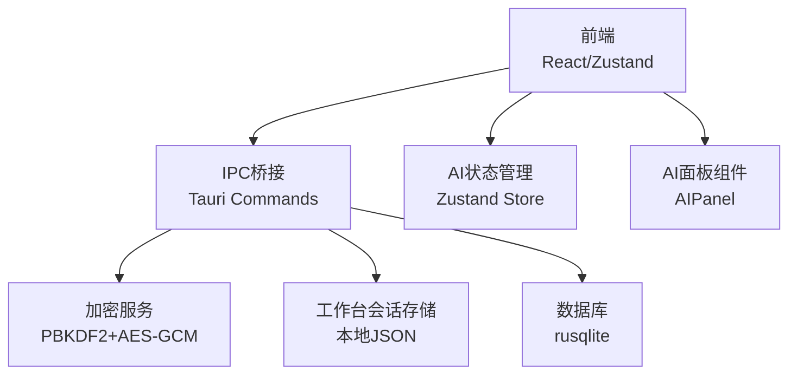
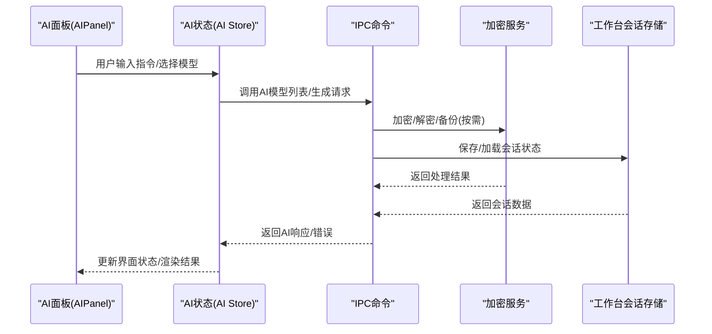
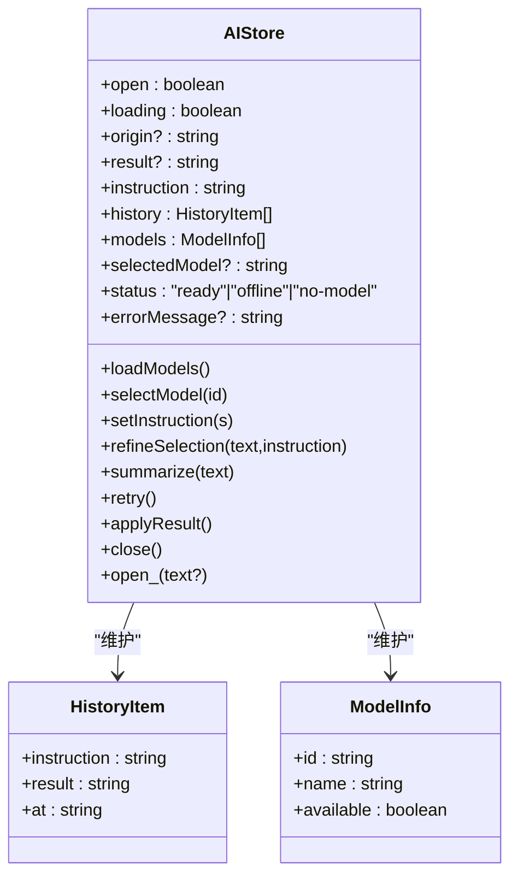
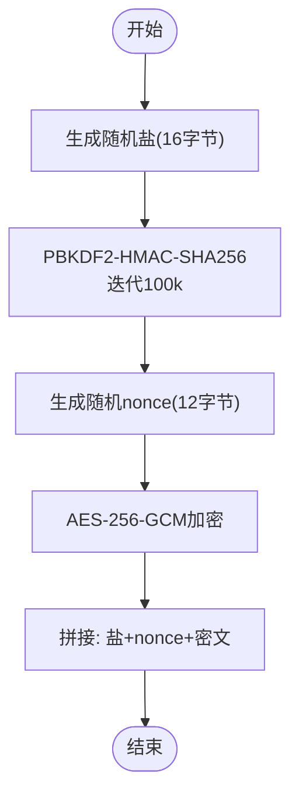
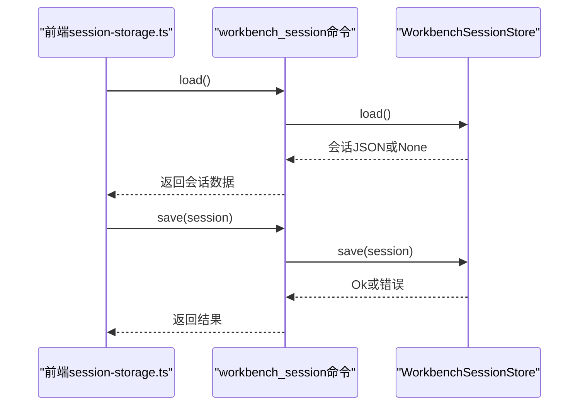
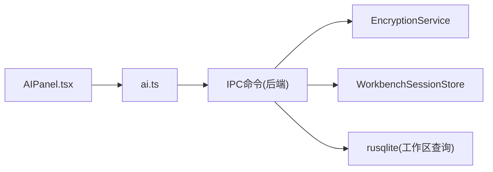

# AI与加密数据模型

<cite>
**本文引用的文件**
- [src-tauri/src/encryption.rs](file://src-tauri/src/encryption.rs)
- [src-tauri/src/models/encryption.rs](file://src-tauri/src/models/encryption.rs)
- [src-tauri/src/commands/encryption.rs](file://src-tauri/src/commands/encryption.rs)
- [src-tauri/src/workbench_session.rs](file://src-tauri/src/workbench_session.rs)
- [src-tauri/src/commands/workbench_session.rs](file://src-tauri/src/commands/workbench_session.rs)
- [src/core/workbench/session-storage.ts](file://src/core/workbench/session-storage.ts)
- [src/store/ai.ts](file://src/store/ai.ts)
- [src/features/ai/AIPanel.tsx](file://src/features/ai/AIPanel.tsx)
- [.tmp/requirements-specification.md](file://.tmp/requirements-specification.md)
- [src-tauri/tests/dataflow_tests.rs](file://src-tauri/tests/dataflow_tests.rs)
</cite>

## 目录
1. [简介](#简介)
2. [项目结构](#项目结构)
3. [核心组件](#核心组件)
4. [架构总览](#架构总览)
5. [详细组件分析](#详细组件分析)
6. [依赖关系分析](#依赖关系分析)
7. [性能考虑](#性能考虑)
8. [故障排查指南](#故障排查指南)
9. [结论](#结论)
10. [附录](#附录)

## 简介
本文件面向NoteForge AI与加密数据模型，系统化梳理以下三类核心数据模型与其实现：
- AI人工智能模型：前端AI面板状态与调用流程、模型选择与历史记录的数据结构设计。
- 加密模型：基于PBKDF2+AES-GCM的端到端加密服务，支持备份加密、API密钥安全存储与恢复。
- 工作台会话模型：跨平台窗口布局与视图状态的持久化与迁移策略。

文档重点阐释：
- AI调用记录的数据结构与持久化规范
- 加密密钥管理机制与安全参数选择依据
- 工作台会话的状态持久化与兼容性策略
- 端到端加密、会话令牌管理与审计日志的合规性要求
- 最佳实践与常见问题排查

## 项目结构
NoteForge采用前后端分离的Tauri架构：
- 前端（React + Zustand）负责UI与状态管理，通过IPC调用后端命令。
- 后端（Rust）提供加密服务、会话存储、数据库访问等能力，并通过Tauri命令暴露给前端。

图表来源
- [src-tauri/src/commands/encryption.rs:1-63](file://src-tauri/src/commands/encryption.rs#L1-L63)
- [src-tauri/src/commands/workbench_session.rs:1-19](file://src-tauri/src/commands/workbench_session.rs#L1-L19)
- [src/core/workbench/session-storage.ts:1-74](file://src/core/workbench/session-storage.ts#L1-L74)
- [src/store/ai.ts:1-49](file://src/store/ai.ts#L1-L49)
- [src/features/ai/AIPanel.tsx:42-82](file://src/features/ai/AIPanel.tsx#L42-L82)

章节来源
- [src-tauri/src/commands/encryption.rs:1-63](file://src-tauri/src/commands/encryption.rs#L1-L63)
- [src-tauri/src/commands/workbench_session.rs:1-19](file://src-tauri/src/commands/workbench_session.rs#L1-L19)
- [src/core/workbench/session-storage.ts:1-74](file://src/core/workbench/session-storage.ts#L1-L74)
- [src/store/ai.ts:1-49](file://src/store/ai.ts#L1-L49)
- [src/features/ai/AIPanel.tsx:42-82](file://src/features/ai/AIPanel.tsx#L42-L82)

## 核心组件
- 加密服务（EncryptionService）
  - 使用PBKDF2-HMAC-SHA256进行密钥派生，迭代次数为100,000；使用AES-256-GCM进行对称加密；随机盐（16字节）与随机nonce（12字节）组合，输出格式为“盐+nonce+密文”。
  - 提供数据加解密、备份创建与恢复、API密钥的加密存储与检索。
- 工作台会话存储（WorkbenchSessionStore）
  - 在应用数据目录下以JSON形式持久化窗口布局与视图状态；支持保存、加载与删除；提供从旧版localStorage迁移的能力。
- AI状态与调用（AI Store与AIPanel）
  - 前端Zustand Store维护模型列表、当前指令、历史记录、加载状态与错误信息；AIPanel负责触发生成、总结、重试与应用结果。

章节来源
- [src-tauri/src/encryption.rs:1-93](file://src-tauri/src/encryption.rs#L1-L93)
- [src-tauri/src/models/encryption.rs:1-50](file://src-tauri/src/models/encryption.rs#L1-L50)
- [src-tauri/src/workbench_session.rs:1-53](file://src-tauri/src/workbench_session.rs#L1-L53)
- [src/core/workbench/session-storage.ts:1-74](file://src/core/workbench/session-storage.ts#L1-L74)
- [src/store/ai.ts:1-49](file://src/store/ai.ts#L1-L49)
- [src/features/ai/AIPanel.tsx:42-82](file://src/features/ai/AIPanel.tsx#L42-L82)

## 架构总览
NoteForge通过Tauri命令在前端与后端之间建立安全通道，AI与加密功能均通过命令接口调用后端实现，确保敏感操作在受控环境中执行。

图表来源
- [src/features/ai/AIPanel.tsx:42-82](file://src/features/ai/AIPanel.tsx#L42-L82)
- [src/store/ai.ts:1-49](file://src/store/ai.ts#L1-L49)
- [src-tauri/src/commands/encryption.rs:1-63](file://src-tauri/src/commands/encryption.rs#L1-L63)
- [src-tauri/src/commands/workbench_session.rs:1-19](file://src-tauri/src/commands/workbench_session.rs#L1-L19)

## 详细组件分析

### AI人工智能模型
- 状态模型
  - 字段：打开状态、加载状态、原始文本、最终结果、指令、历史记录、可用模型列表、选中模型、状态（就绪/离线/无模型）、错误信息。
  - 历史记录结构：包含指令、结果与时间戳，用于审计与复盘。
- 调用流程
  - 首次加载时拉取本地与云端模型列表，选择可用模型；支持精炼、总结、重试与应用结果。
- 数据格式规范
  - 指令与结果为字符串；历史记录数组元素包含指令、结果与at时间戳；模型列表包含模型元信息（如id、名称、可用性）。

图表来源
- [src/store/ai.ts:1-49](file://src/store/ai.ts#L1-L49)

章节来源
- [src/store/ai.ts:1-49](file://src/store/ai.ts#L1-L49)
- [src/features/ai/AIPanel.tsx:42-82](file://src/features/ai/AIPanel.tsx#L42-L82)

### 加密数据模型
- 加密服务（EncryptionService）
  - 密钥派生：PBKDF2-HMAC-SHA256，迭代100,000次，盐长16字节。
  - 对称加密：AES-256-GCM，随机nonce（12字节），输出格式为“盐+nonce+密文”。
  - 功能：数据加解密、备份创建与恢复、API密钥加密存储与检索。
- 请求/响应模型
  - 备份加密：EncryptBackupRequest/EncryptBackupResponse
  - 备份解密：DecryptBackupRequest/DecryptBackupResponse
  - API密钥存储：StoreApiKeyRequest、RetrieveApiKeyRequest/RetrieveApiKeyResponse

图表来源
- [src-tauri/src/encryption.rs:24-56](file://src-tauri/src/encryption.rs#L24-L56)

章节来源
- [src-tauri/src/encryption.rs:1-93](file://src-tauri/src/encryption.rs#L1-L93)
- [src-tauri/src/models/encryption.rs:1-50](file://src-tauri/src/models/encryption.rs#L1-L50)
- [src-tauri/src/commands/encryption.rs:1-63](file://src-tauri/src/commands/encryption.rs#L1-L63)
- [src-tauri/tests/dataflow_tests.rs:318-359](file://src-tauri/tests/dataflow_tests.rs#L318-L359)

### 工作台会话模型
- 存储位置与格式
  - 后端：应用数据目录下的workbench/session.json，采用临时文件写入与原子重命名，避免损坏。
  - 前端：统一通过IPC命令读写；支持从旧版localStorage迁移至后端存储。
- 版本与兼容
  - 前端使用版本号字段校验会话数据；若版本不符或读取失败，回退到旧存储或返回空。
- 生命周期
  - 加载：优先从后端磁盘加载；若为空则尝试旧版localStorage并迁移。
  - 保存：序列化为JSON字符串；空值表示删除。

图表来源
- [src/core/workbench/session-storage.ts:16-74](file://src/core/workbench/session-storage.ts#L16-L74)
- [src-tauri/src/commands/workbench_session.rs:1-19](file://src-tauri/src/commands/workbench_session.rs#L1-L19)
- [src-tauri/src/workbench_session.rs:26-46](file://src-tauri/src/workbench_session.rs#L26-L46)

章节来源
- [src-tauri/src/workbench_session.rs:1-53](file://src-tauri/src/workbench_session.rs#L1-L53)
- [src-tauri/src/commands/workbench_session.rs:1-19](file://src-tauri/src/commands/workbench_session.rs#L1-L19)
- [src/core/workbench/session-storage.ts:1-74](file://src/core/workbench/session-storage.ts#L1-L74)

## 依赖关系分析
- 组件耦合
  - 前端AI Store与AIPanel仅通过IPC命令与后端交互，耦合度低。
  - 加密服务与会话存储均为独立模块，通过命令接口被调用，便于替换与扩展。
- 外部依赖
  - 加密：aes-gcm、ring（PBKDF2与随机数）。
  - IPC：Tauri命令系统。
  - 存储：文件系统（会话JSON）与数据库（工作区查询）。

图表来源
- [src/features/ai/AIPanel.tsx:42-82](file://src/features/ai/AIPanel.tsx#L42-L82)
- [src/store/ai.ts:1-49](file://src/store/ai.ts#L1-L49)
- [src-tauri/src/commands/encryption.rs:1-63](file://src-tauri/src/commands/encryption.rs#L1-L63)
- [src-tauri/src/commands/workbench_session.rs:1-19](file://src-tauri/src/commands/workbench_session.rs#L1-L19)

章节来源
- [src-tauri/src/commands/encryption.rs:1-63](file://src-tauri/src/commands/encryption.rs#L1-L63)
- [src-tauri/src/commands/workbench_session.rs:1-19](file://src-tauri/src/commands/workbench_session.rs#L1-L19)

## 性能考虑
- 加密性能
  - PBKDF2迭代100,000次在现代CPU上通常可在毫秒级完成，兼顾安全性与交互体验。
  - AES-GCM为硬件加速友好算法，适合大文件加密。
- 会话存储
  - 采用临时文件+原子重命名，避免部分写入导致的数据损坏风险。
- 建议
  - 对超大备份建议异步处理并在UI反馈进度。
  - 对频繁的会话保存可引入去抖策略，减少IO压力。

## 故障排查指南
- 加密相关
  - “无效加密数据”：检查输入数据长度是否包含足够盐与nonce；确认密码正确且未被篡改。
  - 加密/解密失败：检查PBKDF2派生过程与nonce长度；确认密文未截断。
- 会话相关
  - 无法加载会话：检查后端session.json是否存在与可读；确认版本字段一致；必要时清理旧localStorage迁移标记。
  - 保存失败：检查应用数据目录权限与磁盘空间。
- AI相关
  - 模型列表为空：检查本地与云端模型服务可达性；查看状态字段“offline/no-model”。

章节来源
- [src-tauri/src/encryption.rs:60-84](file://src-tauri/src/encryption.rs#L60-L84)
- [src-tauri/src/workbench_session.rs:26-46](file://src-tauri/src/workbench_session.rs#L26-L46)
- [src/store/ai.ts:36-49](file://src/store/ai.ts#L36-L49)

## 结论
NoteForge的AI与加密数据模型通过清晰的前后端职责划分与严格的加密参数配置，实现了：
- 端到端加密与密钥安全存储，满足备份与API密钥保护需求；
- 工作台会话的可靠持久化与跨版本兼容；
- AI调用记录的结构化存储与审计能力。

建议在生产环境持续关注合规性与性能优化，结合实际业务场景迭代模型与策略。

## 附录

### AI调用记录数据结构规范
- 历史项字段
  - 指令：用户输入的自然语言指令
  - 结果：AI生成的文本内容
  - 时间戳：记录生成时间
- 历史数组
  - 顺序按时间倒序排列，便于审计与回溯

章节来源
- [src/store/ai.ts:10-12](file://src/store/ai.ts#L10-L12)

### 加密算法与参数选择依据
- PBKDF2-HMAC-SHA256，迭代100,000次：平衡安全强度与用户体验。
- AES-256-GCM：提供机密性与完整性保护。
- 随机盐与nonce：确保相同明文多次加密得到不同密文，抵御统计分析。

章节来源
- [src-tauri/src/encryption.rs:9-11](file://src-tauri/src/encryption.rs#L9-L11)
- [src-tauri/src/encryption.rs:30-48](file://src-tauri/src/encryption.rs#L30-L48)

### 会话安全策略
- 会话数据以纯文本JSON存储于应用数据目录，建议配合操作系统权限控制。
- 会话保存采用临时文件+原子重命名，降低崩溃风险。
- 前端版本校验与旧版localStorage迁移，提升兼容性与可靠性。

章节来源
- [src-tauri/src/workbench_session.rs:26-37](file://src-tauri/src/workbench_session.rs#L26-L37)
- [src/core/workbench/session-storage.ts:6-14](file://src/core/workbench/session-storage.ts#L6-L14)

### 合规性要求与最佳实践
- 备份加密：使用zip打包+AES-GCM加密，符合BR-031。
- API密钥存储：置于应用数据目录的独立文件中，避免日志泄露，符合BR-030。
- 文件访问：可选路径校验限制在工作区根目录内，符合BR-032。
- 审计日志：每次AI调用写入ai_logs表，符合BR-021。

章节来源
- [.tmp/requirements-specification.md:520-568](file://.tmp/requirements-specification.md#L520-L568)