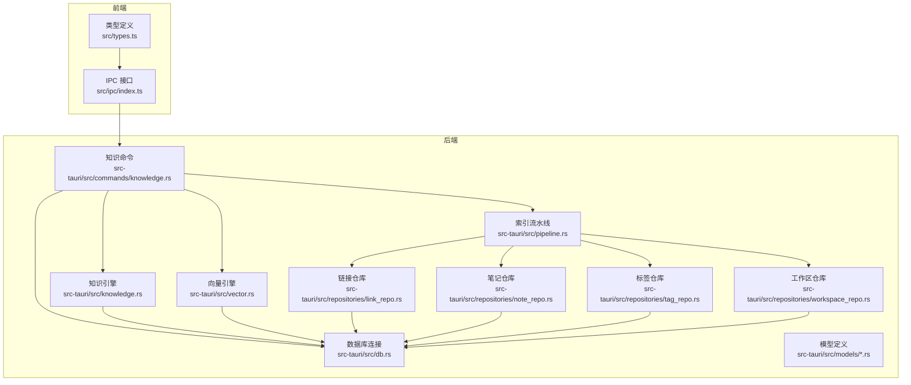
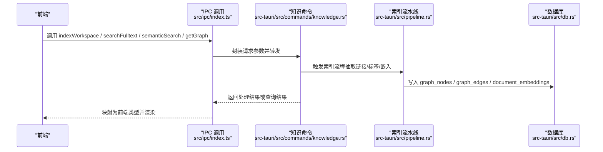
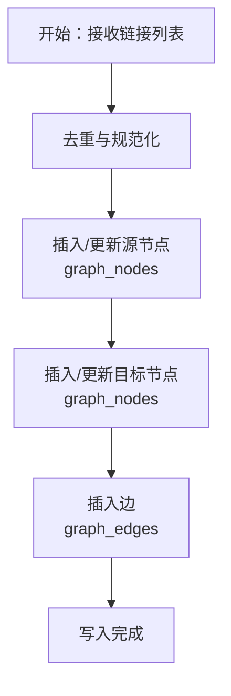
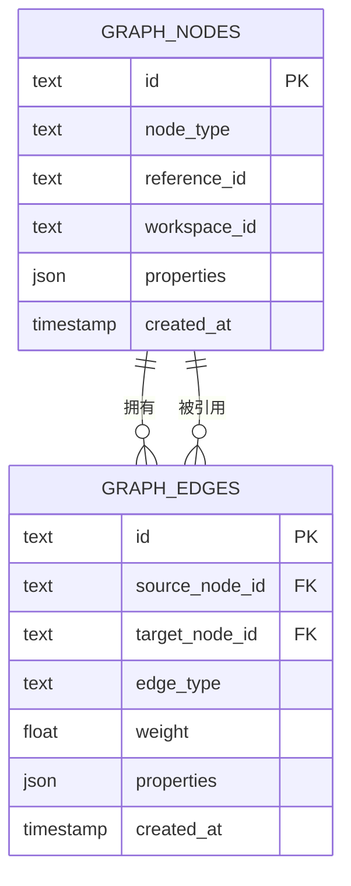
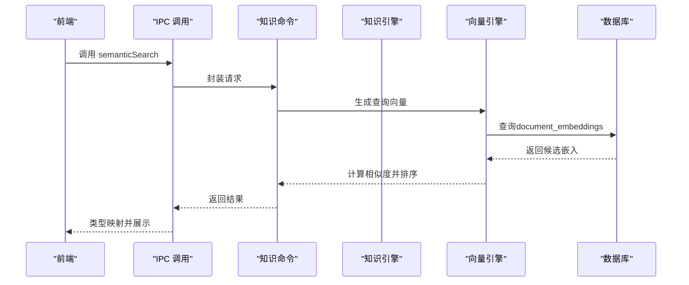
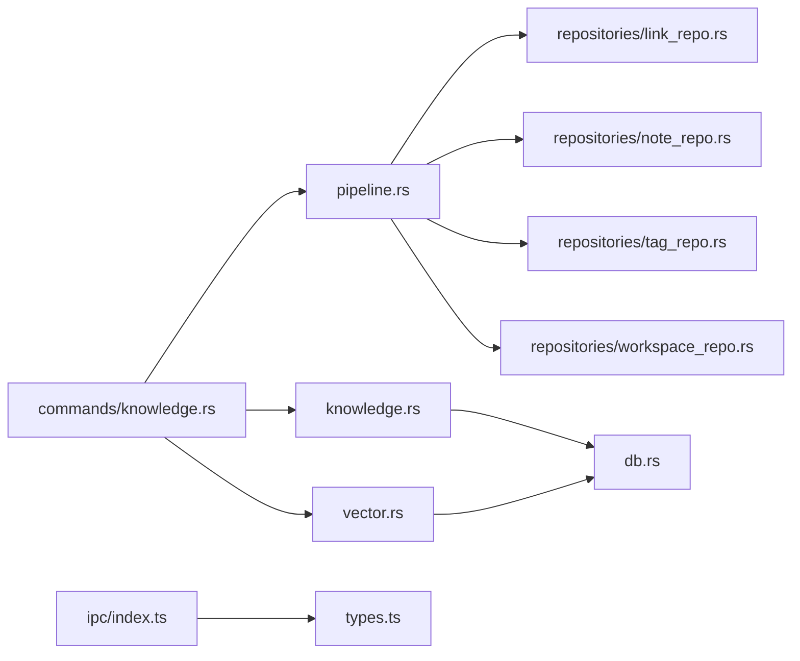

# 关系数据模型

<cite>
**本文引用的文件**
- [src-tauri/src/models/link.rs](file://src-tauri/src/models/link.rs)
- [src-tauri/src/models/graph.rs](file://src-tauri/src/models/graph.rs)
- [src-tauri/src/models/search.rs](file://src-tauri/src/models/search.rs)
- [src-tauri/src/repositories/link_repo.rs](file://src-tauri/src/repositories/link_repo.rs)
- [src-tauri/src/repositories/note_repo.rs](file://src-tauri/src/repositories/note_repo.rs)
- [src-tauri/src/repositories/tag_repo.rs](file://src-tauri/src/repositories/tag_repo.rs)
- [src-tauri/src/repositories/workspace_repo.rs](file://src-tauri/src/repositories/workspace_repo.rs)
- [src-tauri/src/pipeline.rs](file://src-tauri/src/pipeline.rs)
- [src-tauri/src/vector.rs](file://src-tauri/src/vector.rs)
- [src-tauri/src/commands/knowledge.rs](file://src-tauri/src/commands/knowledge.rs)
- [src-tauri/src/knowledge.rs](file://src-tauri/src/knowledge.rs)
- [src-tauri/src/db.rs](file://src-tauri/src/db.rs)
- [src/types.ts](file://src/types.ts)
- [src/ipc/index.ts](file://src/ipc/index.ts)
- [.tmp/system-architecture-design.md](file://.tmp/system-architecture-design.md)
- [src-tauri/tests/ipc_contract_tests.rs](file://src-tauri/tests/ipc_contract_tests.rs)
</cite>

## 目录
1. [简介](#简介)
2. [项目结构](#项目结构)
3. [核心组件](#核心组件)
4. [架构总览](#架构总览)
5. [详细组件分析](#详细组件分析)
6. [依赖分析](#依赖分析)
7. [性能考虑](#性能考虑)
8. [故障排查指南](#故障排查指南)
9. [结论](#结论)
10. [附录](#附录)

## 简介
本文件系统性梳理NoteForge的关系数据模型设计与实现，聚焦以下三类核心模型：
- 链接模型（link）：文档内/跨文档链接的抽取、存储与查询。
- 图模型（graph）：基于节点与边的知识图谱表示，支持多类型节点与边权重。
- 搜索模型（search）：全文检索与语义检索的混合索引与返回结构。

文档还深入解释：
- 文档间链接关系的建模方式与一致性维护；
- 知识图谱节点与边的表示方法与索引策略；
- 搜索索引的数据结构与性能权衡；
- 查询优化策略、图遍历算法与搜索性能考量；
- 关系数据的维护机制、一致性保证与缓存策略；
- 在知识图谱构建与智能搜索中的应用实例与最佳实践。

## 项目结构
后端采用Tauri + Rust，前端为TypeScript/Vue。关系数据模型主要由Rust层的模型定义、仓库层（Repository）、流水线（Pipeline）与命令接口组成，并通过IPC桥接到前端。

图表来源
- [src-tauri/src/commands/knowledge.rs:1-27](file://src-tauri/src/commands/knowledge.rs#L1-L27)
- [src-tauri/src/pipeline.rs:136-167](file://src-tauri/src/pipeline.rs#L136-L167)
- [src-tauri/src/vector.rs:1-151](file://src-tauri/src/vector.rs#L1-L151)
- [src-tauri/src/db.rs](file://src-tauri/src/db.rs)
- [src-tauri/src/repositories/link_repo.rs](file://src-tauri/src/repositories/link_repo.rs)
- [src-tauri/src/repositories/note_repo.rs](file://src-tauri/src/repositories/note_repo.rs)
- [src-tauri/src/repositories/tag_repo.rs](file://src-tauri/src/repositories/tag_repo.rs)
- [src-tauri/src/repositories/workspace_repo.rs](file://src-tauri/src/repositories/workspace_repo.rs)
- [src-tauri/src/models/link.rs](file://src-tauri/src/models/link.rs)
- [src-tauri/src/models/graph.rs](file://src-tauri/src/models/graph.rs)
- [src-tauri/src/models/search.rs](file://src-tauri/src/models/search.rs)
- [src/ipc/index.ts:297-330](file://src/ipc/index.ts#L297-L330)
- [src/types.ts:139-204](file://src/types.ts#L139-L204)

章节来源
- [src-tauri/src/commands/knowledge.rs:1-27](file://src-tauri/src/commands/knowledge.rs#L1-L27)
- [src-tauri/src/pipeline.rs:136-167](file://src-tauri/src/pipeline.rs#L136-L167)
- [src-tauri/src/vector.rs:1-151](file://src-tauri/src/vector.rs#L1-L151)
- [src-tauri/src/db.rs](file://src-tauri/src/db.rs)
- [src-tauri/src/repositories/link_repo.rs](file://src-tauri/src/repositories/link_repo.rs)
- [src-tauri/src/repositories/note_repo.rs](file://src-tauri/src/repositories/note_repo.rs)
- [src-tauri/src/repositories/tag_repo.rs](file://src-tauri/src/repositories/tag_repo.rs)
- [src-tauri/src/repositories/workspace_repo.rs](file://src-tauri/src/repositories/workspace_repo.rs)
- [src-tauri/src/models/link.rs](file://src-tauri/src/models/link.rs)
- [src-tauri/src/models/graph.rs](file://src-tauri/src/models/graph.rs)
- [src-tauri/src/models/search.rs](file://src-tauri/src/models/search.rs)
- [src/ipc/index.ts:297-330](file://src/ipc/index.ts#L297-L330)
- [src/types.ts:139-204](file://src/types.ts#L139-L204)

## 核心组件
- 链接模型（Link）：描述源文档到目标文档的引用关系，包含源路径、目标路径、链接文本等字段，用于建立文档间的引用边。
- 图模型（Graph）：以节点（GraphNodes）与边（GraphEdges）表示知识图谱，节点支持多种类型（如note/memory/concept/agent），边支持多种类型（如reference/embed/tag/semantic）与权重。
- 搜索模型（Search）：统一全文检索与语义检索的结果结构，包含文件路径、标题、片段、分数以及可选标签；语义检索结果额外包含相似度分数。

章节来源
- [src-tauri/src/models/link.rs](file://src-tauri/src/models/link.rs)
- [src-tauri/src/models/graph.rs](file://src-tauri/src/models/graph.rs)
- [src-tauri/src/models/search.rs](file://src-tauri/src/models/search.rs)
- [src/types.ts:139-204](file://src/types.ts#L139-L204)

## 架构总览
NoteForge的关系数据模型围绕“抽取—索引—查询”闭环展开。前端通过IPC调用后端命令，后端使用索引流水线解析文档、抽取链接与标签，写入图数据库表（graph_nodes/graph_edges），同时生成向量嵌入（document_embeddings）。查询阶段结合全文与向量相似度进行混合排序与返回。

图表来源
- [src/ipc/index.ts:297-330](file://src/ipc/index.ts#L297-L330)
- [src-tauri/src/commands/knowledge.rs:1-27](file://src-tauri/src/commands/knowledge.rs#L1-L27)
- [src-tauri/src/pipeline.rs:136-167](file://src-tauri/src/pipeline.rs#L136-L167)
- [src-tauri/src/db.rs](file://src-tauri/src/db.rs)

## 详细组件分析

### 链接模型（Link）
- 设计要点
  - 源路径与目标路径唯一标识一条引用边；
  - 支持记录链接文本、位置信息等元数据；
  - 与图模型配合，形成文档间的引用网络。
- 存储与维护
  - 抽取后写入图节点（确保源/目标节点存在），再插入边；
  - 使用“先插入忽略，后更新属性”的策略避免级联删除导致的边丢失；
  - 工作区隔离：节点与边均携带workspace_id，确保多工作区数据隔离。
- 查询
  - 可按节点查找入边/出边，支持回链（backlinks）查询；
  - 结合标签与全文索引，提升导航体验。

图表来源
- [src-tauri/src/pipeline.rs:136-167](file://src-tauri/src/pipeline.rs#L136-L167)
- [.tmp/system-architecture-design.md:568-593](file://.tmp/system-architecture-design.md#L568-L593)

章节来源
- [src-tauri/src/pipeline.rs:136-167](file://src-tauri/src/pipeline.rs#L136-L167)
- [.tmp/system-architecture-design.md:568-593](file://.tmp/system-architecture-design.md#L568-L593)

### 图模型（Graph）
- 节点（GraphNodes）
  - 主键id：统一节点标识，格式通常为“类型:引用ID”，如“note:相对路径.md”；
  - node_type：节点类型枚举（note/memory/concept/agent）；
  - reference_id：与底层实体（如notes.id）的关联；
  - workspace_id：工作区隔离；
  - properties：JSON属性，存储动态元数据（如标题、路径等）。
- 边（GraphEdges）
  - 主键id：边标识；
  - source_node_id / target_node_id：起点与终点节点；
  - edge_type：边类型（如reference/embed/tag/semantic）；
  - weight：边权重（默认1.0），用于排序与可视化；
  - properties：边的动态属性；
  - 外键约束：删除节点时级联删除相关边。
- 索引
  - 为边的source_node_id与target_node_id建立索引，加速邻接查询与遍历。

图表来源
- [.tmp/system-architecture-design.md:568-593](file://.tmp/system-architecture-design.md#L568-L593)

章节来源
- [.tmp/system-architecture-design.md:568-593](file://.tmp/system-architecture-design.md#L568-L593)

### 搜索模型（Search）
- 全文检索
  - 输入：工作区ID、查询词、限制条数；
  - 输出：文件路径、标题、内容片段、分数等。
- 语义检索
  - 基于向量嵌入（document_embeddings）计算余弦相似度；
  - 支持按文档类型过滤与Top-K返回。
- 前后端映射
  - 后端返回SnakeCase结构，前端映射为CamelCase便于消费。

图表来源
- [src-tauri/src/commands/knowledge.rs:1-27](file://src-tauri/src/commands/knowledge.rs#L1-L27)
- [src-tauri/src/vector.rs:57-151](file://src-tauri/src/vector.rs#L57-L151)
- [src-tauri/src/knowledge.rs](file://src-tauri/src/knowledge.rs)
- [src/ipc/index.ts:315-322](file://src/ipc/index.ts#L315-L322)

章节来源
- [src-tauri/src/commands/knowledge.rs:1-27](file://src-tauri/src/commands/knowledge.rs#L1-L27)
- [src-tauri/src/vector.rs:57-151](file://src-tauri/src/vector.rs#L57-L151)
- [src-tauri/src/knowledge.rs](file://src-tauri/src/knowledge.rs)
- [src/ipc/index.ts:307-322](file://src/ipc/index.ts#L307-L322)
- [src/types.ts:139-204](file://src/types.ts#L139-L204)

## 依赖分析
- 组件耦合
  - 命令层（commands/knowledge.rs）聚合知识引擎、向量引擎与索引流水线；
  - 流水线（pipeline.rs）依赖各仓库层（link_repo、note_repo、tag_repo、workspace_repo）与数据库连接；
  - 知识引擎（knowledge.rs）与向量引擎（vector.rs）共享数据库连接；
  - 前端IPC（ipc/index.ts）依赖类型定义（types.ts）进行参数封装与结果映射。
- 外部依赖
  - 数据库：rusqlite + SQLite；
  - 向量模型：fastembed（惰性加载，避免阻塞启动）。

图表来源
- [src-tauri/src/commands/knowledge.rs:1-27](file://src-tauri/src/commands/knowledge.rs#L1-L27)
- [src-tauri/src/pipeline.rs:136-167](file://src-tauri/src/pipeline.rs#L136-L167)
- [src-tauri/src/knowledge.rs](file://src-tauri/src/knowledge.rs)
- [src-tauri/src/vector.rs:1-151](file://src-tauri/src/vector.rs#L1-L151)
- [src-tauri/src/repositories/link_repo.rs](file://src-tauri/src/repositories/link_repo.rs)
- [src-tauri/src/repositories/note_repo.rs](file://src-tauri/src/repositories/note_repo.rs)
- [src-tauri/src/repositories/tag_repo.rs](file://src-tauri/src/repositories/tag_repo.rs)
- [src-tauri/src/repositories/workspace_repo.rs](file://src-tauri/src/repositories/workspace_repo.rs)
- [src-tauri/src/db.rs](file://src-tauri/src/db.rs)
- [src/ipc/index.ts:297-330](file://src/ipc/index.ts#L297-L330)
- [src/types.ts:139-204](file://src/types.ts#L139-L204)

章节来源
- [src-tauri/src/commands/knowledge.rs:1-27](file://src-tauri/src/commands/knowledge.rs#L1-L27)
- [src-tauri/src/pipeline.rs:136-167](file://src-tauri/src/pipeline.rs#L136-L167)
- [src-tauri/src/knowledge.rs](file://src-tauri/src/knowledge.rs)
- [src-tauri/src/vector.rs:1-151](file://src-tauri/src/vector.rs#L1-L151)
- [src-tauri/src/repositories/link_repo.rs](file://src-tauri/src/repositories/link_repo.rs)
- [src-tauri/src/repositories/note_repo.rs](file://src-tauri/src/repositories/note_repo.rs)
- [src-tauri/src/repositories/tag_repo.rs](file://src-tauri/src/repositories/tag_repo.rs)
- [src-tauri/src/repositories/workspace_repo.rs](file://src-tauri/src/repositories/workspace_repo.rs)
- [src-tauri/src/db.rs](file://src-tauri/src/db.rs)
- [src/ipc/index.ts:297-330](file://src/ipc/index.ts#L297-L330)
- [src/types.ts:139-204](file://src/types.ts#L139-L204)

## 性能考虑
- 图查询优化
  - 为graph_edges的source_node_id与target_node_id建立索引，降低邻接查询与遍历成本；
  - 使用“插入忽略+更新属性”的节点写入策略，减少重复写入与级联删除开销。
- 搜索性能
  - 向量检索采用内存中相似度计算（简化实现），生产环境建议引入专用向量数据库；
  - 通过document_type过滤减少候选集规模；
  - 限制返回数量（limit）控制响应时间。
- 缓存策略
  - 向量模型惰性加载，避免启动阻塞；
  - 可在应用层对热点查询结果进行短期缓存（需注意数据一致性）。

章节来源
- [.tmp/system-architecture-design.md:568-593](file://.tmp/system-architecture-design.md#L568-L593)
- [src-tauri/src/pipeline.rs:136-167](file://src-tauri/src/pipeline.rs#L136-L167)
- [src-tauri/src/vector.rs:57-151](file://src-tauri/src/vector.rs#L57-L151)

## 故障排查指南
- 图数据不一致
  - 症状：节点缺失或边无法查询；
  - 排查：检查graph_nodes与graph_edges是否存在，确认workspace_id是否匹配；
  - 参考测试用例中的调试输出，验证节点与边的存在性。
- 搜索无结果
  - 症状：全文/语义搜索为空；
  - 排查：确认document_embeddings中是否存在对应document_id的嵌入；检查查询类型过滤条件。
- IPC契约问题
  - 症状：前端调用后端命令失败；
  - 排查：核对请求参数命名（前端CamelCase vs 后端SnakeCase）与类型映射。

章节来源
- [src-tauri/tests/ipc_contract_tests.rs:421-457](file://src-tauri/tests/ipc_contract_tests.rs#L421-L457)
- [src-tauri/src/commands/knowledge.rs:1-27](file://src-tauri/src/commands/knowledge.rs#L1-L27)
- [src-tauri/src/vector.rs:57-151](file://src-tauri/src/vector.rs#L57-L151)
- [src/ipc/index.ts:297-330](file://src/ipc/index.ts#L297-L330)

## 结论
NoteForge的关系数据模型以SQLite为底座，结合图模型与向量嵌入，实现了从文档链接抽取到知识图谱构建与智能搜索的完整链路。通过工作区隔离、索引优化与惰性加载等策略，在功能完备性与性能之间取得平衡。未来可在向量检索与缓存一致性方面进一步增强，以支撑更大规模的知识管理场景。

## 附录
- 应用实例
  - 知识图谱构建：基于文档链接与标签生成节点与边，支持节点属性与边权重的可视化展示；
  - 智能搜索：混合全文与语义检索，提供更精准的文档召回与排序；
  - 回链面板：利用图模型快速定位反向引用，提升导航效率。