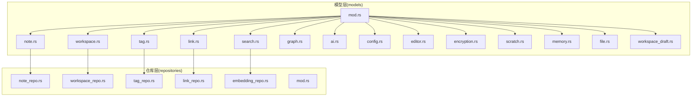
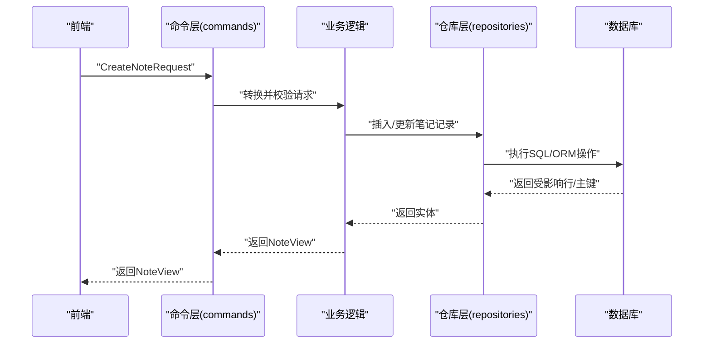
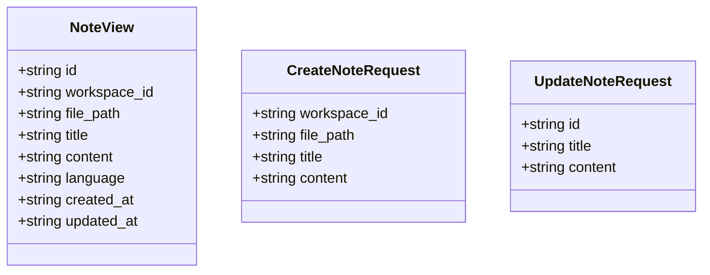
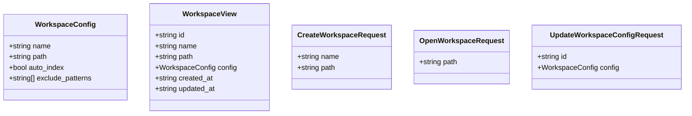
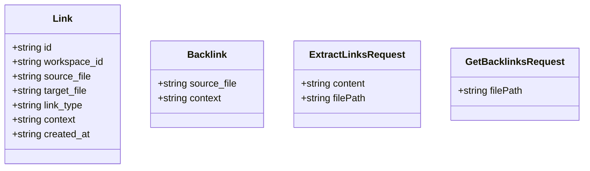
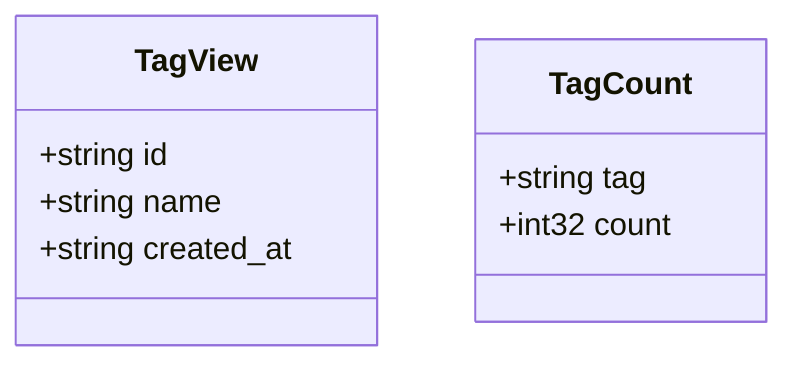
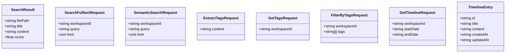
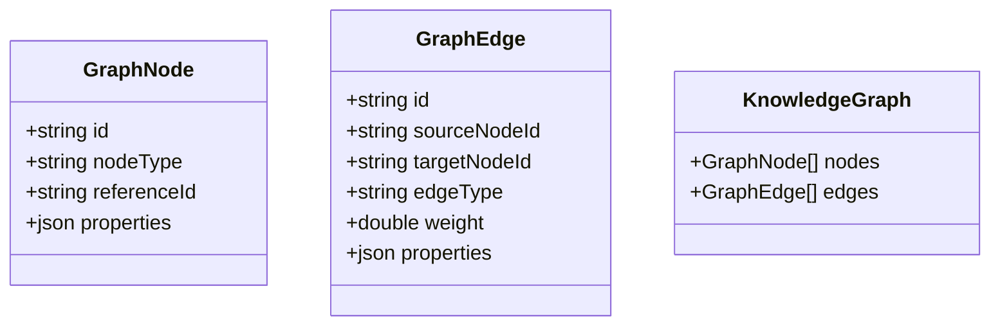
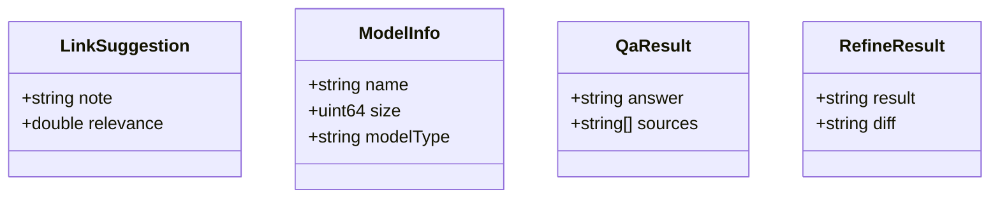
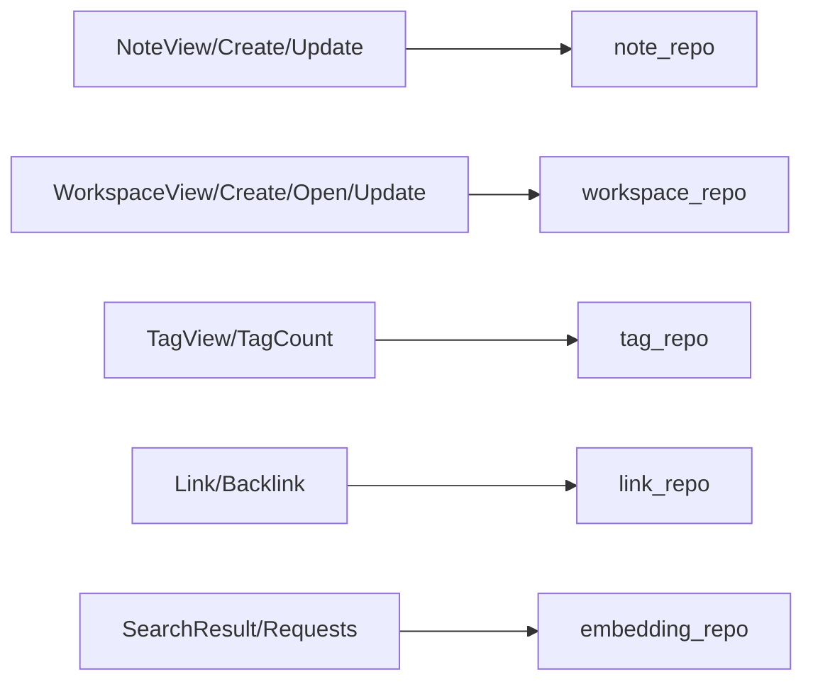

# 数据模型

<cite>
**本文引用的文件**
- [src-tauri/src/models/mod.rs](file://src-tauri/src/models/mod.rs)
- [src-tauri/src/models/note.rs](file://src-tauri/src/models/note.rs)
- [src-tauri/src/models/workspace.rs](file://src-tauri/src/models/workspace.rs)
- [src-tauri/src/models/link.rs](file://src-tauri/src/models/link.rs)
- [src-tauri/src/models/tag.rs](file://src-tauri/src/models/tag.rs)
- [src-tauri/src/models/search.rs](file://src-tauri/src/models/search.rs)
- [src-tauri/src/models/graph.rs](file://src-tauri/src/models/graph.rs)
- [src-tauri/src/models/ai.rs](file://src-tauri/src/models/ai.rs)
- [src-tauri/src/models/config.rs](file://src-tauri/src/models/config.rs)
- [src-tauri/src/models/editor.rs](file://src-tauri/src/models/editor.rs)
- [src-tauri/src/models/encryption.rs](file://src-tauri/src/models/encryption.rs)
- [src-tauri/src/models/scratch.rs](file://src-tauri/src/models/scratch.rs)
- [src-tauri/src/models/memory.rs](file://src-tauri/src/models/memory.rs)
- [src-tauri/src/models/file.rs](file://src-tauri/src/models/file.rs)
- [src-tauri/src/models/workspace_draft.rs](file://src-tauri/src/models/workspace_draft.rs)
- [src-tauri/src/repositories/mod.rs](file://src-tauri/src/repositories/mod.rs)
- [src-tauri/src/repositories/note_repo.rs](file://src-tauri/src/repositories/note_repo.rs)
- [src-tauri/src/repositories/workspace_repo.rs](file://src-tauri/src/repositories/workspace_repo.rs)
- [src-tauri/src/repositories/tag_repo.rs](file://src-tauri/src/repositories/tag_repo.rs)
- [src-tauri/src/repositories/link_repo.rs](file://src-tauri/src/repositories/link_repo.rs)
- [src-tauri/src/repositories/embedding_repo.rs](file://src-tauri/src/repositories/embedding_repo.rs)
</cite>

## 目录
1. [简介](#简介)
2. [项目结构](#项目结构)
3. [核心组件](#核心组件)
4. [架构总览](#架构总览)
5. [详细组件分析](#详细组件分析)
6. [依赖分析](#依赖分析)
7. [性能考虑](#性能考虑)
8. [故障排查指南](#故障排查指南)
9. [结论](#结论)
10. [附录](#附录)

## 简介
本文件系统性梳理 NoteForge 的数据模型与相关实现，覆盖笔记、工作区、链接、标签、搜索、知识图谱、AI、配置、编辑器、草稿、记忆、加密、工作台会话等模型。重点说明各模型的字段定义、数据类型、约束与业务规则；阐明模型间的关系映射、外键约束与索引设计；给出使用示例、序列化/反序列化机制与验证规则；并提供模型演进策略与版本兼容性建议。

## 项目结构
NoteForge 的数据模型主要位于后端 Rust 模块 src-tauri/src/models 下，并通过对应的仓库层进行持久化操作。模型导出统一由 models/mod.rs 聚合，便于前端或其它模块按需引入。

图表来源
- [src-tauri/src/models/mod.rs:1-28](file://src-tauri/src/models/mod.rs#L1-L28)
- [src-tauri/src/repositories/mod.rs](file://src-tauri/src/repositories/mod.rs)

章节来源
- [src-tauri/src/models/mod.rs:1-28](file://src-tauri/src/models/mod.rs#L1-L28)

## 核心组件
本节对各数据模型进行字段、类型、约束与业务规则的归纳，并指出其在系统中的职责边界与交互方式。

- 笔记模型（NoteView、CreateNoteRequest、UpdateNoteRequest）
  - 字段与类型：id、workspace_id、file_path、title、content、language、created_at、updated_at 等
  - 约束与规则：id 唯一标识；workspace_id 关联工作区；file_path 在工作区内唯一；title/content 可空但建议保持一致性；时间字段为字符串格式（ISO 8601 风格）
  - 使用场景：创建、更新、查询笔记视图；内容变更时更新 updated_at
  - 序列化：统一采用 camelCase

- 工作区模型（WorkspaceConfig、WorkspaceView、CreateWorkspaceRequest、OpenWorkspaceRequest、UpdateWorkspaceConfigRequest）
  - 字段与类型：id、name、path、config（含 auto_index、exclude_patterns）、created_at、updated_at
  - 约束与规则：path 唯一且指向本地目录；auto_index 控制是否自动索引；exclude_patterns 支持通配符排除
  - 使用场景：创建工作区、打开工作区、更新配置
  - 序列化：统一采用 camelCase

- 链接模型（Link、Backlink、ExtractLinksRequest、GetBacklinksRequest）
  - 字段与类型：id、workspace_id、source_file、target_file、link_type、context、created_at
  - 约束与规则：source_file 与 target_file 均为工作区内相对路径；link_type 表示链接语义（如“wikilink”、“embed”）；backlink 提供反向解析
  - 使用场景：提取链接、查询反链、构建知识图谱
  - 序列化：统一采用 camelCase

- 标签模型（TagView、TagCount）
  - 字段与类型：id、name、created_at；count（聚合统计）
  - 约束与规则：name 唯一；用于内容标记与过滤
  - 使用场景：标签提取、标签列表、按标签过滤
  - 序列化：统一采用 camelCase

- 搜索模型（SearchResult、SearchFulltextRequest、SemanticSearchRequest、ExtractTagsRequest、GetTagsRequest、FilterByTagsRequest、GetTimelineRequest、TimelineEntry）
  - 字段与类型：全文检索返回 file_path/title/content/score；语义检索支持向量相似度；时间线包含 id/title/content/created_at/updated_at
  - 约束与规则：limit 可选控制返回数量；日期范围可空表示全时段
  - 使用场景：全文检索、语义检索、标签提取与过滤、时间线浏览
  - 序列化：统一采用 camelCase

- 图模型（GraphNode、GraphEdge、KnowledgeGraph、GetKnowledgeGraphRequest）
  - 字段与类型：节点包含 id/node_type/reference_id/properties；边包含 id/source_node_id/target_node_id/edge_type/weight/properties
  - 约束与规则：节点与边均以字符串 id 标识；properties 为 JSON 值；权重为浮点数
  - 使用场景：构建与查询知识图谱
  - 序列化：统一采用 camelCase

- AI 模型（LinkSuggestion、ModelInfo、QaResult、RefineResult、各类请求与配置）
  - 字段与类型：问答结果包含 answer 与 sources；内容精炼包含 result 与 diff；模型信息包含 name/size/model_type；请求包含 content/question/workspace_id/instruction/model 等
  - 约束与规则：model 可选；provider/api_key/endpoint 支持外部模型服务配置
  - 使用场景：问答、摘要生成、标签建议、链接建议、模型管理
  - 序列化：统一采用 camelCase

- 其他模型（config、editor、encryption、scratch、memory、file、workspace_draft）
  - 字段与类型：配置项、编辑器状态、加密参数、草稿内容、记忆片段、文件元信息、工作区草稿等
  - 约束与规则：遵循各自业务域的唯一性与一致性要求
  - 使用场景：系统配置、编辑器行为、安全存储、临时草稿、记忆增强、文件索引、工作区级草稿
  - 序列化：统一采用 camelCase

章节来源
- [src-tauri/src/models/note.rs:1-32](file://src-tauri/src/models/note.rs#L1-L32)
- [src-tauri/src/models/workspace.rs:1-42](file://src-tauri/src/models/workspace.rs#L1-L42)
- [src-tauri/src/models/link.rs:1-34](file://src-tauri/src/models/link.rs#L1-L34)
- [src-tauri/src/models/tag.rs:1-17](file://src-tauri/src/models/tag.rs#L1-L17)
- [src-tauri/src/models/search.rs:1-64](file://src-tauri/src/models/search.rs#L1-L64)
- [src-tauri/src/models/graph.rs:1-35](file://src-tauri/src/models/graph.rs#L1-L35)
- [src-tauri/src/models/ai.rs:1-90](file://src-tauri/src/models/ai.rs#L1-L90)

## 架构总览
下图展示模型与仓库层的对应关系，以及典型调用流程（以“创建笔记”为例）：

图表来源
- [src-tauri/src/models/note.rs:16-31](file://src-tauri/src/models/note.rs#L16-L31)
- [src-tauri/src/repositories/note_repo.rs](file://src-tauri/src/repositories/note_repo.rs)

## 详细组件分析

### 笔记模型（Note）
- 字段与类型
  - id: 字符串，全局唯一
  - workspace_id: 字符串，关联工作区
  - file_path: 字符串，工作区内相对路径
  - title/content/language: 可空字符串
  - created_at/updated_at: 字符串（时间戳）
- 约束与规则
  - 唯一性：同一工作区内 file_path 唯一
  - 外键：workspace_id 引用工作区
  - 时间：更新时更新 updated_at
- 使用示例
  - 创建：提交 CreateNoteRequest，返回 NoteView
  - 更新：提交 UpdateNoteRequest，返回更新后的 NoteView
- 序列化/反序列化
  - 统一 camelCase，便于前后端一致
- 验证规则
  - 必填：workspace_id、file_path
  - 可选：title、content、language
- 演进策略
  - 新增字段建议可空并提供默认值，避免破坏旧版本导入
  - 对于历史数据迁移，提供批量补全脚本

图表来源
- [src-tauri/src/models/note.rs:3-31](file://src-tauri/src/models/note.rs#L3-L31)

章节来源
- [src-tauri/src/models/note.rs:1-32](file://src-tauri/src/models/note.rs#L1-L32)

### 工作区模型（Workspace）
- 字段与类型
  - id/name/path/config/exclude_patterns/auto_index
  - created_at/updated_at
- 约束与规则
  - path 唯一；auto_index 控制索引策略；exclude_patterns 支持通配符
- 使用示例
  - 创建：CreateWorkspaceRequest
  - 打开：OpenWorkspaceRequest
  - 更新：UpdateWorkspaceConfigRequest
- 序列化/反序列化
  - camelCase
- 验证规则
  - 必填：name、path
  - 可选：config（包含 auto_index、exclude_patterns）

图表来源
- [src-tauri/src/models/workspace.rs:3-41](file://src-tauri/src/models/workspace.rs#L3-L41)

章节来源
- [src-tauri/src/models/workspace.rs:1-42](file://src-tauri/src/models/workspace.rs#L1-L42)

### 链接模型（Link）
- 字段与类型
  - id、workspace_id、source_file、target_file、link_type、context、created_at
- 约束与规则
  - source_file/target_file 为工作区内相对路径
  - link_type 表示链接语义
- 使用示例
  - 提取：ExtractLinksRequest
  - 查询反链：GetBacklinksRequest
- 序列化/反序列化
  - camelCase
- 验证规则
  - 必填：workspace_id、source_file、target_file、link_type

图表来源
- [src-tauri/src/models/link.rs:3-33](file://src-tauri/src/models/link.rs#L3-L33)

章节来源
- [src-tauri/src/models/link.rs:1-34](file://src-tauri/src/models/link.rs#L1-L34)

### 标签模型（Tag）
- 字段与类型
  - TagView：id、name、created_at
  - TagCount：tag、count
- 约束与规则
  - name 唯一
- 使用示例
  - 提取标签：ExtractTagsRequest
  - 获取标签：GetTagsRequest
  - 过滤：FilterByTagsRequest
- 序列化/反序列化
  - camelCase

图表来源
- [src-tauri/src/models/tag.rs:3-16](file://src-tauri/src/models/tag.rs#L3-L16)

章节来源
- [src-tauri/src/models/tag.rs:1-17](file://src-tauri/src/models/tag.rs#L1-L17)

### 搜索模型（Search）
- 字段与类型
  - SearchResult：file_path、title、content、score
  - 请求：全文/语义检索、提取标签、获取标签、按标签过滤、时间线
  - 时间线条目：TimelineEntry
- 约束与规则
  - limit 可空；日期范围可空
- 使用示例
  - 全文检索：SearchFulltextRequest
  - 语义检索：SemanticSearchRequest
  - 标签过滤：FilterByTagsRequest
  - 时间线：GetTimelineRequest
- 序列化/反序列化
  - camelCase

图表来源
- [src-tauri/src/models/search.rs:3-63](file://src-tauri/src/models/search.rs#L3-L63)

章节来源
- [src-tauri/src/models/search.rs:1-64](file://src-tauri/src/models/search.rs#L1-L64)

### 图模型（Graph）
- 字段与类型
  - GraphNode：id、node_type、reference_id、properties
  - GraphEdge：id、source_node_id、target_node_id、edge_type、weight、properties
  - KnowledgeGraph：nodes、edges
  - 请求：GetKnowledgeGraphRequest
- 约束与规则
  - 节点/边 id 唯一；properties 为 JSON；weight 浮点
- 使用示例
  - 获取知识图谱：GetKnowledgeGraphRequest
- 序列化/反序列化
  - camelCase

图表来源
- [src-tauri/src/models/graph.rs:3-28](file://src-tauri/src/models/graph.rs#L3-L28)

章节来源
- [src-tauri/src/models/graph.rs:1-35](file://src-tauri/src/models/graph.rs#L1-L35)

### AI 模型（AI）
- 字段与类型
  - LinkSuggestion、ModelInfo、QaResult、RefineResult
  - 请求：内容精炼、生成摘要、标签建议、链接建议、问答、列出模型、配置模型、索引知识库
- 约束与规则
  - model 可选；provider/api_key/endpoint 支持外部模型
- 使用示例
  - 问答：AiKnowledgeQaRequest
  - 精炼：AiRefineContentRequest
  - 建议：AiSuggestTagsRequest/AiSuggestLinksRequest
- 序列化/反序列化
  - camelCase

图表来源
- [src-tauri/src/models/ai.rs:3-30](file://src-tauri/src/models/ai.rs#L3-L30)

章节来源
- [src-tauri/src/models/ai.rs:1-90](file://src-tauri/src/models/ai.rs#L1-L90)

### 其他模型概览
- 配置模型（config）：系统配置项
- 编辑器模型（editor）：编辑器状态与设置
- 加密模型（encryption）：密钥与加密参数
- 草稿模型（scratch）：临时草稿
- 记忆模型（memory）：Agent 记忆片段
- 文件模型（file）：文件元信息
- 工作区草稿模型（workspace_draft）：工作区级草稿

章节来源
- [src-tauri/src/models/config.rs](file://src-tauri/src/models/config.rs)
- [src-tauri/src/models/editor.rs](file://src-tauri/src/models/editor.rs)
- [src-tauri/src/models/encryption.rs](file://src-tauri/src/models/encryption.rs)
- [src-tauri/src/models/scratch.rs](file://src-tauri/src/models/scratch.rs)
- [src-tauri/src/models/memory.rs](file://src-tauri/src/models/memory.rs)
- [src-tauri/src/models/file.rs](file://src-tauri/src/models/file.rs)
- [src-tauri/src/models/workspace_draft.rs](file://src-tauri/src/models/workspace_draft.rs)

## 依赖分析
- 模型到仓库的依赖
  - note -> note_repo
  - workspace -> workspace_repo
  - tag -> tag_repo
  - link -> link_repo
  - search -> embedding_repo（语义检索）
- 依赖关系可视化

图表来源
- [src-tauri/src/repositories/mod.rs](file://src-tauri/src/repositories/mod.rs)
- [src-tauri/src/repositories/note_repo.rs](file://src-tauri/src/repositories/note_repo.rs)
- [src-tauri/src/repositories/workspace_repo.rs](file://src-tauri/src/repositories/workspace_repo.rs)
- [src-tauri/src/repositories/tag_repo.rs](file://src-tauri/src/repositories/tag_repo.rs)
- [src-tauri/src/repositories/link_repo.rs](file://src-tauri/src/repositories/link_repo.rs)
- [src-tauri/src/repositories/embedding_repo.rs](file://src-tauri/src/repositories/embedding_repo.rs)

章节来源
- [src-tauri/src/repositories/mod.rs](file://src-tauri/src/repositories/mod.rs)

## 性能考虑
- 索引设计
  - 工作区：path 唯一索引；auto_index 开关配合增量索引
  - 笔记：file_path（工作区内唯一）、workspace_id 索引；updated_at 用于时间线
  - 链接：source_file/target_file、workspace_id 索引；link_type 辅助筛选
  - 标签：name 唯一索引；与笔记多对多关系建立中间表
- 查询优化
  - 全文检索与语义检索分离；限制 limit；分页加载
  - 时间线按日期范围裁剪
- 写入优化
  - 批量写入与事务包裹；更新时仅变更字段
- 缓存策略
  - 热门标签、常用查询结果缓存；失效策略基于时间或事件

## 故障排查指南
- 常见问题
  - 笔记重复创建：检查 file_path 在同一工作区内唯一性
  - 链接无效：确认 source_file/target_file 为工作区内相对路径
  - 搜索无结果：检查索引是否开启、exclude_patterns 是否误排除
  - 语义检索异常：确认向量嵌入已建立、limit 合理
- 排查步骤
  - 校验请求体字段完整性与类型
  - 查看仓库层日志与 SQL 执行计划
  - 核对索引是否存在、重建必要索引
- 错误处理
  - 返回统一错误码与消息；对可恢复错误提供重试策略

## 结论
NoteForge 的数据模型围绕“工作区—笔记—标签/链接—搜索/图谱—AI”的主干路径设计，既满足基础 CRUD 场景，又兼顾语义检索与知识图谱构建。通过清晰的字段定义、严格的约束与合理的索引设计，为上层功能提供了稳定可靠的数据支撑。建议在后续演进中持续完善版本迁移与兼容策略，确保平滑升级。

## 附录
- 版本兼容与演进策略
  - 新增字段默认可空并提供默认值
  - 提供迁移脚本与回滚方案
  - 对外接口保持向后兼容，新增字段不破坏旧客户端
- 最佳实践
  - 所有字符串时间字段统一为 ISO 8601 风格
  - JSON 字段（如 properties）保持最小必要结构
  - 对高频查询建立复合索引与物化视图