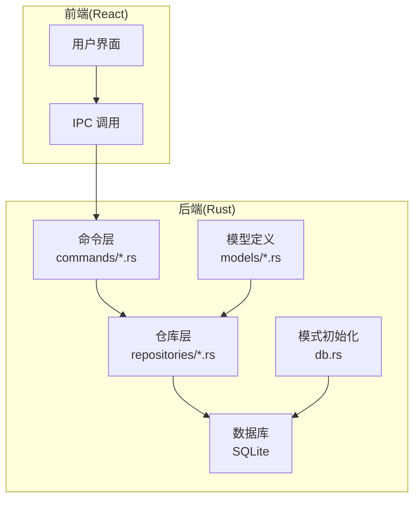
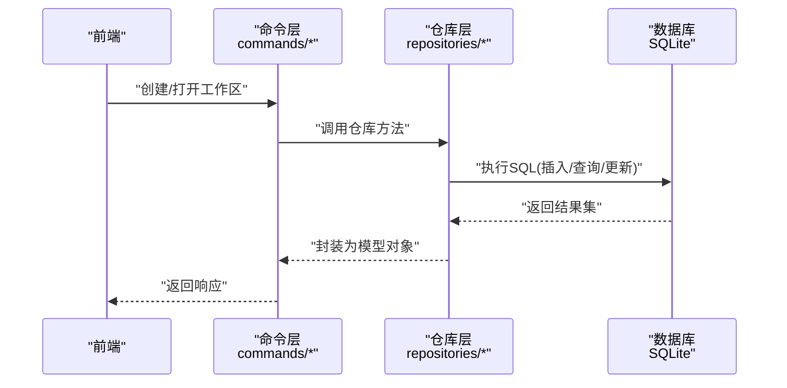
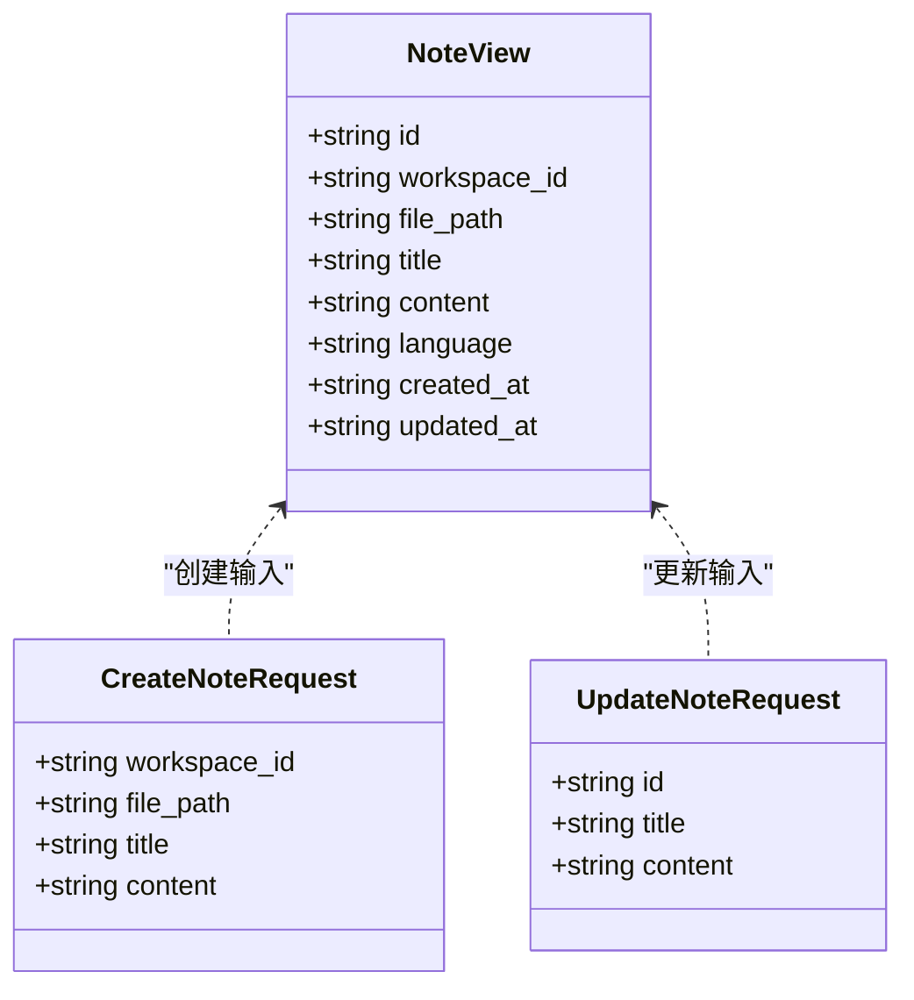
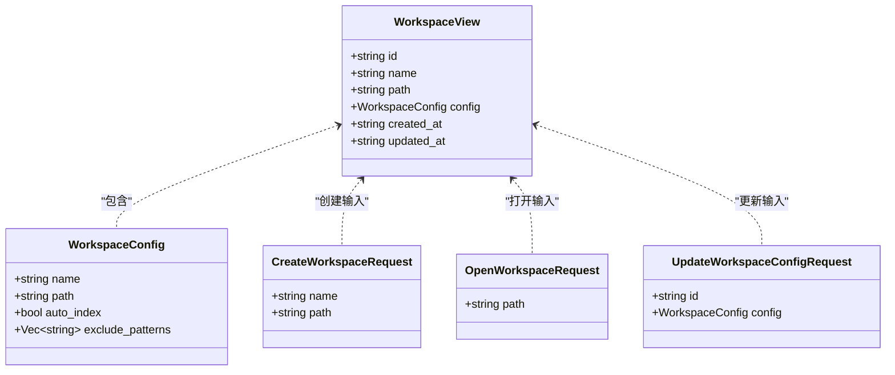
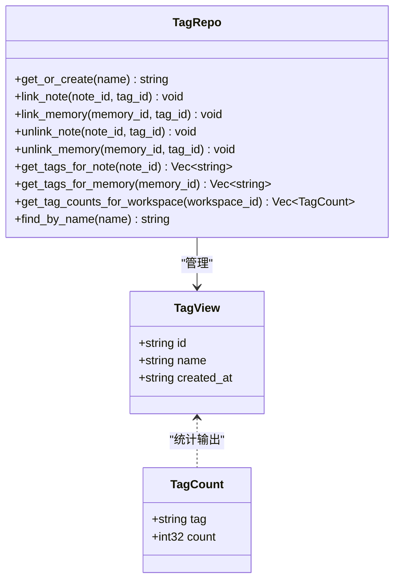
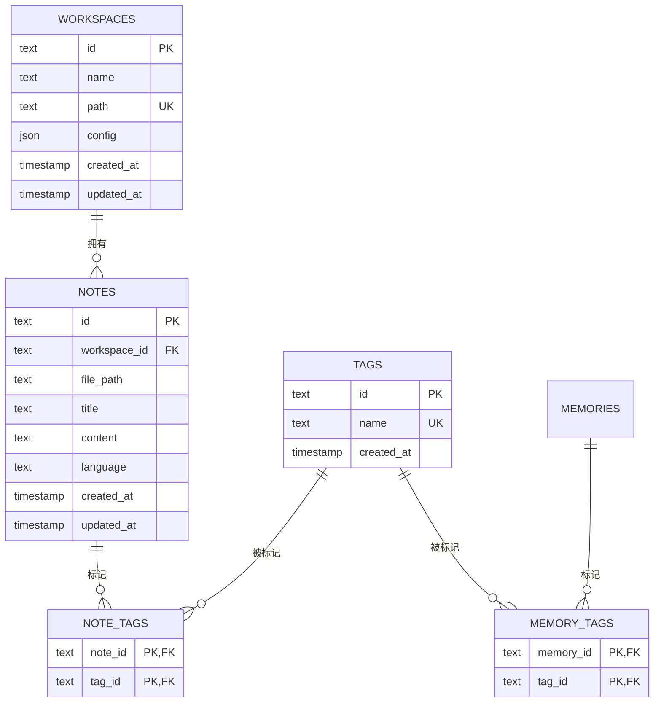

# 核心数据模型

<cite>
**本文引用的文件**
- [src-tauri/src/models/note.rs](file://src-tauri/src/models/note.rs)
- [src-tauri/src/models/workspace.rs](file://src-tauri/src/models/workspace.rs)
- [src-tauri/src/models/tag.rs](file://src-tauri/src/models/tag.rs)
- [src-tauri/src/repositories/note_repo.rs](file://src-tauri/src/repositories/note_repo.rs)
- [src-tauri/src/repositories/workspace_repo.rs](file://src-tauri/src/repositories/workspace_repo.rs)
- [src-tauri/src/repositories/tag_repo.rs](file://src-tauri/src/repositories/tag_repo.rs)
- [src-tauri/src/db.rs](file://src-tauri/src/db.rs)
- [src-tauri/src/commands/workspace.rs](file://src-tauri/src/commands/workspace.rs)
</cite>

## 目录
1. [简介](#简介)
2. [项目结构](#项目结构)
3. [核心组件](#核心组件)
4. [架构总览](#架构总览)
5. [详细组件分析](#详细组件分析)
6. [依赖分析](#依赖分析)
7. [性能考虑](#性能考虑)
8. [故障排查指南](#故障排查指南)
9. [结论](#结论)
10. [附录](#附录)

## 简介
本文件聚焦于NoteForge的核心数据模型：note笔记模型、workspace工作区模型与tag标签模型。我们将从字段定义、数据类型、约束条件与业务规则入手，梳理模型间的关系映射、外键与索引设计，并给出使用示例、序列化/反序列化机制、验证规则、模型演进策略与版本兼容性处理，以及它们在系统中的作用与相互依赖。

## 项目结构
NoteForge采用前后端分离的Tauri架构，数据层位于Rust后端，通过SQLite持久化存储；前端通过IPC调用后端命令完成业务操作。核心数据模型与仓库层均位于后端src-tauri目录中，数据库初始化与表结构定义集中在db.rs中。

图表来源
- [src-tauri/src/db.rs:18-168](file://src-tauri/src/db.rs#L18-L168)
- [src-tauri/src/models/note.rs:1-32](file://src-tauri/src/models/note.rs#L1-L32)
- [src-tauri/src/models/workspace.rs:1-42](file://src-tauri/src/models/workspace.rs#L1-L42)
- [src-tauri/src/models/tag.rs:1-17](file://src-tauri/src/models/tag.rs#L1-L17)
- [src-tauri/src/repositories/note_repo.rs:1-170](file://src-tauri/src/repositories/note_repo.rs#L1-L170)
- [src-tauri/src/repositories/workspace_repo.rs:1-122](file://src-tauri/src/repositories/workspace_repo.rs#L1-L122)
- [src-tauri/src/repositories/tag_repo.rs:1-121](file://src-tauri/src/repositories/tag_repo.rs#L1-L121)
- [src-tauri/src/commands/workspace.rs:1-113](file://src-tauri/src/commands/workspace.rs#L1-L113)

章节来源
- [src-tauri/src/db.rs:18-168](file://src-tauri/src/db.rs#L18-L168)

## 核心组件
- note笔记模型：用于描述单个笔记的视图与请求载荷，支持创建、更新、查询与删除等操作。
- workspace工作区模型：用于描述工作区配置、视图与请求载荷，支持创建工作区、打开工作区、列出与更新配置。
- tag标签模型：用于描述标签视图与标签计数，支持标签的创建/获取、笔记/记忆体关联与解绑、按工作区统计标签使用情况。

章节来源
- [src-tauri/src/models/note.rs:1-32](file://src-tauri/src/models/note.rs#L1-L32)
- [src-tauri/src/models/workspace.rs:1-42](file://src-tauri/src/models/workspace.rs#L1-L42)
- [src-tauri/src/models/tag.rs:1-17](file://src-tauri/src/models/tag.rs#L1-L17)

## 架构总览
下图展示了核心数据模型在系统中的位置与交互流程：前端通过命令层发起请求，命令层调用仓库层执行数据库操作，仓库层基于模型进行序列化/反序列化与参数校验，最终由数据库执行SQL语句。

图表来源
- [src-tauri/src/commands/workspace.rs:1-113](file://src-tauri/src/commands/workspace.rs#L1-L113)
- [src-tauri/src/repositories/workspace_repo.rs:1-122](file://src-tauri/src/repositories/workspace_repo.rs#L1-L122)
- [src-tauri/src/db.rs:18-168](file://src-tauri/src/db.rs#L18-L168)

## 详细组件分析

### note笔记模型
- 字段定义与类型
  - id: 字符串，主键
  - workspace_id: 字符串，外键，指向workspaces.id
  - file_path: 字符串，与workspace_id组成唯一索引
  - title: 可选字符串
  - content: 可选字符串
  - language: 可选字符串
  - created_at/updated_at: 时间戳，默认CURRENT_TIMESTAMP
- 约束与索引
  - 外键: workspace_id 引用 workspaces(id)
  - 唯一索引: (workspace_id, file_path)
  - 普通索引: workspace_id；复合索引: (workspace_id, file_path)
- 业务规则
  - upsert按(工作区+文件路径)冲突时更新时间戳与内容/语言等字段
  - 支持按id或(工作区+文件路径)查询
  - 支持按工作区列出并按更新时间倒序
- 序列化/反序列化
  - 使用Serde进行JSON序列化，字段名采用驼峰命名
- 验证规则
  - 创建/更新请求包含必要字段，如workspace_id、file_path等
- 使用示例
  - 创建笔记：调用仓库create/upsert，传入id、workspace_id、file_path、title、content、language
  - 查询笔记：按id或(工作区+路径)查询，或按工作区列出
  - 更新笔记：按id更新title或content
  - 删除笔记：按id或(工作区+路径)删除

图表来源
- [src-tauri/src/models/note.rs:3-31](file://src-tauri/src/models/note.rs#L3-L31)

章节来源
- [src-tauri/src/models/note.rs:1-32](file://src-tauri/src/models/note.rs#L1-L32)
- [src-tauri/src/repositories/note_repo.rs:14-170](file://src-tauri/src/repositories/note_repo.rs#L14-L170)
- [src-tauri/src/db.rs:31-46](file://src-tauri/src/db.rs#L31-L46)

### workspace工作区模型
- 字段定义与类型
  - id: 字符串，主键
  - name: 字符串
  - path: 字符串，唯一
  - config: JSON对象，包含name、path、auto_index、exclude_patterns
  - created_at/updated_at: 时间戳
- 约束与索引
  - 唯一键: path
- 业务规则
  - 创建工作区时生成新id，写入config(JSON)，并确保路径存在
  - 打开工作区时若路径未注册则自动创建记录
  - 列出所有工作区并按更新时间倒序
  - 更新配置时序列化config为JSON写入
- 序列化/反序列化
  - config以JSON字符串形式存取，读取时反序列化为WorkspaceConfig对象
- 验证规则
  - 打开工作区时校验路径存在且为目录
  - 创建工作区时校验路径不重复
- 使用示例
  - 创建工作区：传入name与path，自动生成id与默认config
  - 打开工作区：传入path，若不存在则创建并返回
  - 列出工作区：返回所有工作区视图
  - 更新配置：传入id与新的config

图表来源
- [src-tauri/src/models/workspace.rs:3-41](file://src-tauri/src/models/workspace.rs#L3-L41)

章节来源
- [src-tauri/src/models/workspace.rs:1-42](file://src-tauri/src/models/workspace.rs#L1-L42)
- [src-tauri/src/repositories/workspace_repo.rs:14-122](file://src-tauri/src/repositories/workspace_repo.rs#L14-L122)
- [src-tauri/src/commands/workspace.rs:7-113](file://src-tauri/src/commands/workspace.rs#L7-L113)
- [src-tauri/src/db.rs:21-29](file://src-tauri/src/db.rs#L21-L29)

### tag标签模型
- 字段定义与类型
  - id: 字符串，主键
  - name: 字符串，唯一
  - created_at: 时间戳
- 关联表
  - note_tags: 笔记与标签的多对多关联，主键为(none_id, tag_id)，级联删除
  - memory_tags: 记忆体与标签的多对多关联，主键为(memory_id, tag_id)，级联删除
- 业务规则
  - 标签按名称去重，不存在则创建新标签并返回id
  - 提供笔记/记忆体与标签的关联/解绑
  - 统计工作区内各标签的使用次数
- 使用示例
  - 获取或创建标签：按name查找或创建
  - 关联笔记/记忆体：插入或忽略已存在的关联
  - 解绑：删除指定关联
  - 统计：按工作区聚合标签计数

图表来源
- [src-tauri/src/models/tag.rs:3-17](file://src-tauri/src/models/tag.rs#L3-L17)
- [src-tauri/src/repositories/tag_repo.rs:9-121](file://src-tauri/src/repositories/tag_repo.rs#L9-L121)

章节来源
- [src-tauri/src/models/tag.rs:1-17](file://src-tauri/src/models/tag.rs#L1-L17)
- [src-tauri/src/repositories/tag_repo.rs:14-121](file://src-tauri/src/repositories/tag_repo.rs#L14-L121)
- [src-tauri/src/db.rs:68-88](file://src-tauri/src/db.rs#L68-L88)

## 依赖分析
- 数据库模式
  - workspaces: 主键id，唯一键path，JSON字段config
  - notes: 主键id，外键workspace_id引用workspaces(id)，唯一索引(workspace_id, file_path)，普通索引workspace_id与(file_path, workspace_id)
  - tags: 主键id，唯一键name
  - note_tags/memories: 多对多关联，主键(none_id, tag_id)/(memory_id, tag_id)，外键级联删除
- 模型到仓库
  - NoteRepo/WorkspaceRepo/TagRepo分别封装notes/workspaces/tags及关联表的CRUD
- 命令到仓库
  - 命令层接收前端请求，调用对应仓库方法，完成业务逻辑与数据持久化

图表来源
- [src-tauri/src/db.rs:21-88](file://src-tauri/src/db.rs#L21-L88)

章节来源
- [src-tauri/src/db.rs:18-168](file://src-tauri/src/db.rs#L18-L168)
- [src-tauri/src/repositories/note_repo.rs:1-170](file://src-tauri/src/repositories/note_repo.rs#L1-L170)
- [src-tauri/src/repositories/workspace_repo.rs:1-122](file://src-tauri/src/repositories/workspace_repo.rs#L1-L122)
- [src-tauri/src/repositories/tag_repo.rs:1-121](file://src-tauri/src/repositories/tag_repo.rs#L1-L121)

## 性能考虑
- 索引策略
  - notes上建立workspace_id与(file_path, workspace_id)复合索引，优化按工作区查询与按路径精确匹配
  - workspaces上以path为唯一键，减少重复注册
  - tags上以name为唯一键，避免重复标签
- 写入优化
  - upsert按(工作区+文件路径)冲突更新，避免重复插入
  - 批量查询使用prepared statement与query_map，减少解析开销
- 序列化成本
  - workspace.config以JSON存储，读取时反序列化，注意配置变更频率与缓存策略

[本节为通用性能建议，无需特定文件引用]

## 故障排查指南
- 工作区路径问题
  - 打开工作区时若路径不存在或非目录，命令层会返回相应错误
  - 创建工作区前检查路径是否已存在
- 笔记唯一性冲突
  - upsert按(工作区+文件路径)冲突时更新，若出现异常需检查该组合是否重复
- 标签关联异常
  - 关联/解绑失败通常与外键约束或重复主键有关，确认note_id/tag_id有效且未重复
- JSON配置反序列化
  - 若config损坏，读取时回退到默认配置，避免应用崩溃

章节来源
- [src-tauri/src/commands/workspace.rs:45-79](file://src-tauri/src/commands/workspace.rs#L45-L79)
- [src-tauri/src/repositories/workspace_repo.rs:34-72](file://src-tauri/src/repositories/workspace_repo.rs#L34-L72)
- [src-tauri/src/repositories/note_repo.rs:30-50](file://src-tauri/src/repositories/note_repo.rs#L30-L50)
- [src-tauri/src/repositories/tag_repo.rs:34-64](file://src-tauri/src/repositories/tag_repo.rs#L34-L64)

## 结论
NoteForge的核心数据模型围绕“工作区-笔记-标签”三者展开：工作区作为容器承载笔记，笔记通过标签实现语义关联。通过合理的外键与索引设计、统一的序列化/反序列化机制以及命令层的业务封装，系统实现了高内聚、低耦合的数据访问层。后续演进可优先考虑配置schema版本化与向后兼容策略，以保障模型升级的稳定性。

[本节为总结性内容，无需特定文件引用]

## 附录

### 数据模型演进与版本兼容
- 配置版本化
  - 在workspace.config中引入version字段，新增字段时保持默认值，旧版本读取时回退到默认配置
- 表结构迁移
  - 新增列时使用ALTER TABLE添加默认值，避免破坏现有数据
  - 对于需要重算的列，提供一次性迁移脚本并在应用启动时执行
- 兼容策略
  - 读取JSON字段时使用try-from并提供降级方案
  - 对外接口保持字段名驼峰一致，避免破坏前端契约

[本节为通用演进建议，无需特定文件引用]

### 使用示例与最佳实践
- 创建工作区
  - 输入: name, path
  - 步骤: 校验路径不存在 -> 创建目录 -> 生成id与默认config -> 插入workspaces
- 打开工作区
  - 输入: path
  - 步骤: 查找是否存在 -> 不存在则创建并返回
- 创建笔记
  - 输入: workspace_id, file_path, title?, content?
  - 步骤: upsert(工作区+路径) -> 返回NoteView
- 标签管理
  - 获取或创建标签 -> 关联到笔记 -> 统计标签计数

章节来源
- [src-tauri/src/commands/workspace.rs:7-113](file://src-tauri/src/commands/workspace.rs#L7-L113)
- [src-tauri/src/repositories/note_repo.rs:14-50](file://src-tauri/src/repositories/note_repo.rs#L14-L50)
- [src-tauri/src/repositories/tag_repo.rs:14-48](file://src-tauri/src/repositories/tag_repo.rs#L14-L48)