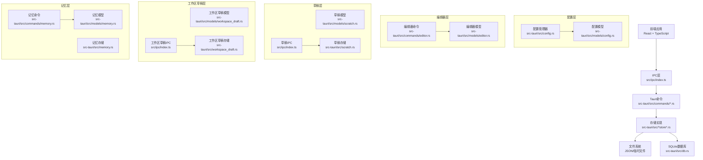
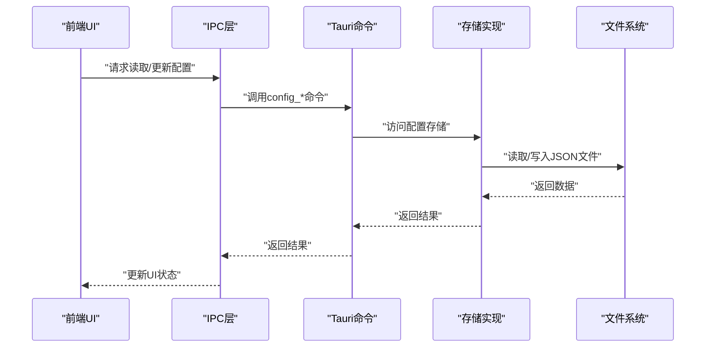
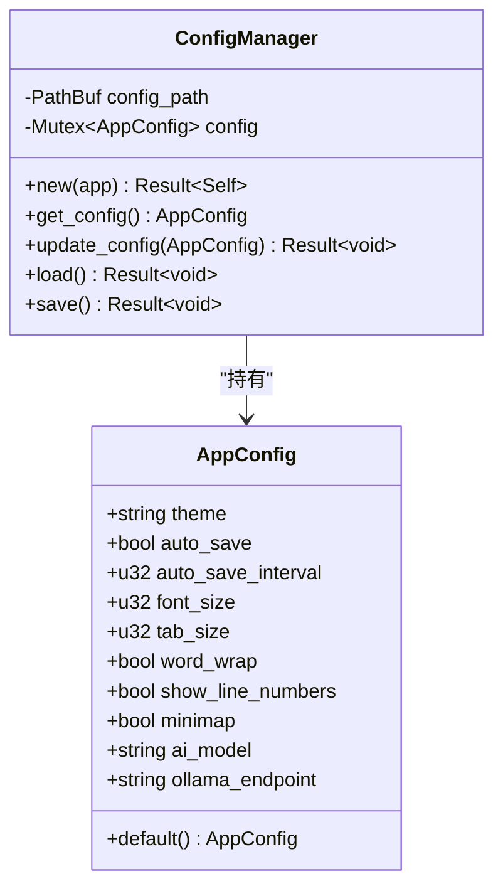
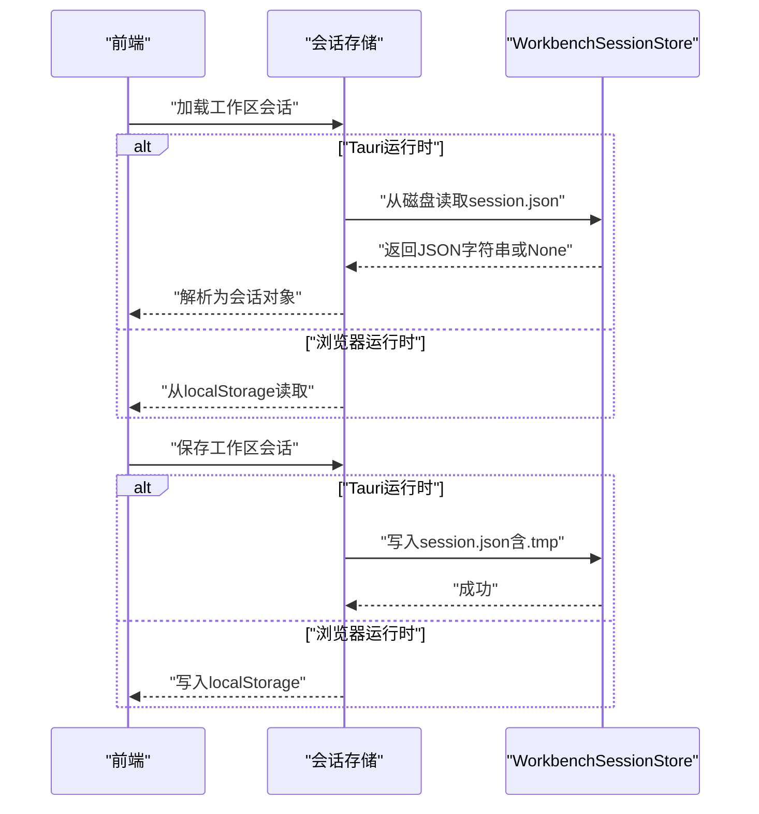
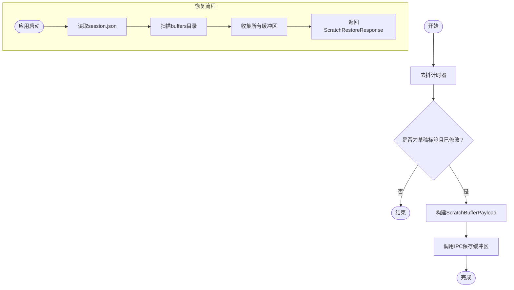
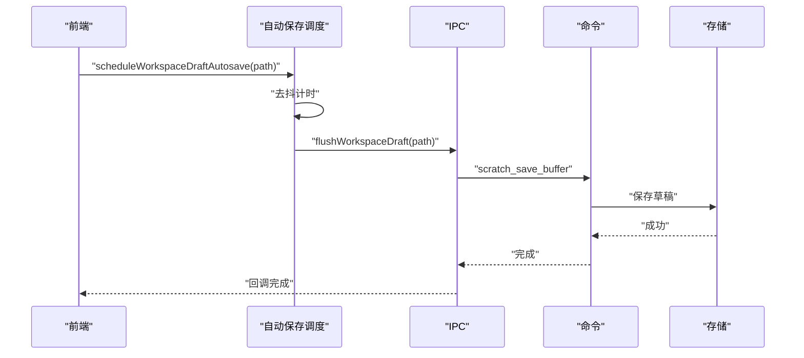
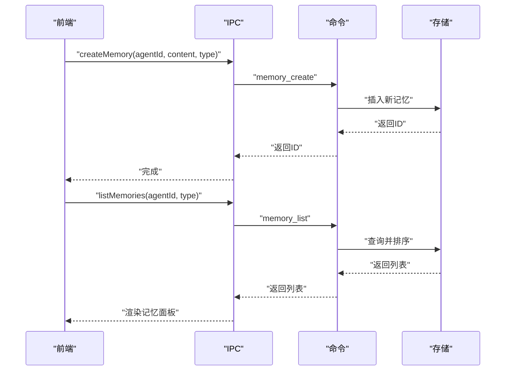
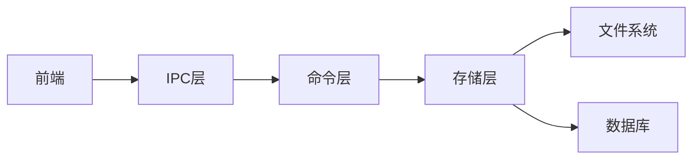

# 系统数据模型

<cite>
**本文档引用的文件**
- [src-tauri/src/config.rs](file://src-tauri/src/config.rs)
- [src-tauri/src/models/config.rs](file://src-tauri/src/models/config.rs)
- [src-tauri/src/commands/config.rs](file://src-tauri/src/commands/config.rs)
- [src-tauri/src/core/platform/config.ts](file://src-tauri/src/core/platform/config.ts)
- [src-tauri/src/models/editor.rs](file://src-tauri/src/models/editor.rs)
- [src-tauri/src/commands/editor.rs](file://src-tauri/src/commands/editor.rs)
- [src-tauri/src/models/scratch.rs](file://src-tauri/src/models/scratch.rs)
- [src-tauri/src/scratch.rs](file://src-tauri/src/scratch.rs)
- [src-tauri/src/commands/scratch.rs](file://src-tauri/src/commands/scratch.rs)
- [src-tauri/src/models/workspace_draft.rs](file://src-tauri/src/models/workspace_draft.rs)
- [src-tauri/src/workspace_draft.rs](file://src-tauri/src/workspace_draft.rs)
- [src-tauri/src/commands/workspace_draft.rs](file://src-tauri/src/commands/workspace_draft.rs)
- [src-tauri/src/models/memory.rs](file://src-tauri/src/models/memory.rs)
- [src-tauri/src/memory.rs](file://src-tauri/src/memory.rs)
- [src-tauri/src/commands/memory.rs](file://src-tauri/src/commands/memory.rs)
- [src/core/session/scratch-autosave.ts](file://src/core/session/scratch-autosave.ts)
- [src/core/session/workspace-draft-autosave.ts](file://src/core/session/workspace-draft-autosave.ts)
- [src-tauri/src/workbench_session.rs](file://src-tauri/src/workbench_session.rs)
- [src/core/workbench/session-storage.ts](file://src/core/workbench/session-storage.ts)
- [src-tauri/tests/ipc_contract_tests.rs](file://src-tauri/tests/ipc_contract_tests.rs)
- [src-tauri/tests/dataflow_tests.rs](file://src-tauri/tests/dataflow_tests.rs)
- [src/ipc/index.ts](file://src/ipc/index.ts)
- [src/ipc/stub.ts](file://src/ipc/stub.ts)
</cite>

## 目录
1. [简介](#简介)
2. [项目结构](#项目结构)
3. [核心组件](#核心组件)
4. [架构总览](#架构总览)
5. [详细组件分析](#详细组件分析)
6. [依赖分析](#依赖分析)
7. [性能考虑](#性能考虑)
8. [故障排除指南](#故障排除指南)
9. [结论](#结论)

## 简介
本文件系统性梳理NoteForge的数据模型，重点覆盖以下四类核心模型：
- 配置模型（config）：定义用户偏好与编辑器行为参数，并提供持久化与迁移能力
- 编辑器模型（editor）：承载编辑器状态与视图信息，支持跨会话恢复
- 草稿模型（scratch）：管理临时草稿缓冲区与会话状态，确保重启后可恢复
- 记忆模型（memory）：记录AI交互与知识片段，支持检索与生命周期管理

文档将从数据结构、持久化机制、状态恢复流程、错误处理与性能优化等维度进行深入解析，并给出配置迁移、状态恢复与数据清理的实现细节。

## 项目结构
NoteForge采用前后端分层的数据模型设计：
- 前端（React + TypeScript）负责UI状态与业务逻辑编排，通过IPC调用后端命令
- 后端（Rust）提供稳定的数据持久化与模型定义，保证可靠性与跨平台一致性
- IPC层封装了所有数据读写操作，屏蔽平台差异

图表来源
- [src-tauri/src/config.rs:1-43](file://src-tauri/src/config.rs#L1-L43)
- [src-tauri/src/models/config.rs](file://src-tauri/src/models/config.rs)
- [src-tauri/src/commands/config.rs](file://src-tauri/src/commands/config.rs)
- [src-tauri/src/models/editor.rs](file://src-tauri/src/models/editor.rs)
- [src-tauri/src/commands/editor.rs](file://src-tauri/src/commands/editor.rs)
- [src-tauri/src/models/scratch.rs](file://src-tauri/src/models/scratch.rs)
- [src-tauri/src/scratch.rs](file://src-tauri/src/scratch.rs)
- [src-tauri/src/models/workspace_draft.rs](file://src-tauri/src/models/workspace_draft.rs)
- [src-tauri/src/workspace_draft.rs](file://src-tauri/src/workspace_draft.rs)
- [src-tauri/src/models/memory.rs](file://src-tauri/src/models/memory.rs)
- [src-tauri/src/memory.rs](file://src-tauri/src/memory.rs)
- [src-tauri/src/commands/memory.rs](file://src-tauri/src/commands/memory.rs)
- [src/ipc/index.ts:240-257](file://src/ipc/index.ts#L240-L257)

章节来源
- [src-tauri/src/config.rs:1-43](file://src-tauri/src/config.rs#L1-L43)
- [src-tauri/src/models/config.rs](file://src-tauri/src/models/config.rs)
- [src-tauri/src/commands/config.rs](file://src-tauri/src/commands/config.rs)
- [src-tauri/src/models/editor.rs](file://src-tauri/src/models/editor.rs)
- [src-tauri/src/commands/editor.rs](file://src-tauri/src/commands/editor.rs)
- [src-tauri/src/models/scratch.rs](file://src-tauri/src/models/scratch.rs)
- [src-tauri/src/scratch.rs](file://src-tauri/src/scratch.rs)
- [src-tauri/src/models/workspace_draft.rs](file://src-tauri/src/models/workspace_draft.rs)
- [src-tauri/src/workspace_draft.rs](file://src-tauri/src/workspace_draft.rs)
- [src-tauri/src/models/memory.rs](file://src-tauri/src/models/memory.rs)
- [src-tauri/src/memory.rs](file://src-tauri/src/memory.rs)
- [src-tauri/src/commands/memory.rs](file://src-tauri/src/commands/memory.rs)
- [src/ipc/index.ts:240-257](file://src/ipc/index.ts#L240-L257)

## 核心组件
本节概述四大数据模型的职责与关键字段，以及它们如何支撑NoteForge的核心功能。

- 配置模型（config）
  - 负责用户主题、字体、自动保存、编辑器行为、AI模型与端点等偏好设置
  - 提供默认值与持久化，支持跨平台迁移与回退
  - 支撑“用户偏好设置”与“编辑器行为控制”

- 编辑器模型（editor）
  - 描述编辑器视图状态、光标位置、滚动位置等
  - 与窗口会话（workbench session）协同，实现跨会话恢复
  - 支撑“编辑会话管理”

- 草稿模型（scratch）
  - 存储临时草稿缓冲区（untitled buffers）与会话布局
  - 通过IPC与后端存储交互，实现重启恢复
  - 支撑“临时草稿存储策略”与“状态恢复”

- 记忆模型（memory）
  - 记录AI交互、知识片段与标签，支持重要性评分与时间线查询
  - 提供增删改查与统计聚合
  - 支撑“AI交互记录”与“知识管理”

章节来源
- [src-tauri/src/config.rs:9-38](file://src-tauri/src/config.rs#L9-L38)
- [src-tauri/src/models/editor.rs](file://src-tauri/src/models/editor.rs)
- [src-tauri/src/models/scratch.rs:4-38](file://src-tauri/src/models/scratch.rs#L4-L38)
- [src-tauri/src/models/memory.rs](file://src-tauri/src/models/memory.rs)

## 架构总览
NoteForge的数据模型遵循“前端状态 + IPC命令 + 后端存储”的分层架构。前端通过IPC调用后端命令，命令层根据模型定义执行读写操作，最终落盘至文件系统或数据库。

图表来源
- [src-tauri/src/commands/config.rs](file://src-tauri/src/commands/config.rs)
- [src-tauri/src/config.rs:40-43](file://src-tauri/src/config.rs#L40-L43)
- [src-tauri/src/models/config.rs](file://src-tauri/src/models/config.rs)
- [src/ipc/index.ts](file://src/ipc/index.ts)

## 详细组件分析

### 配置模型（config）
- 数据结构
  - 字段涵盖主题、自动保存开关与间隔、字体大小、制表符宽度、换行、行号、小地图、AI模型名称与本地推理端点
  - 默认值集中于默认实现，确保首次使用体验一致
- 持久化机制
  - 使用带“.tmp”中间文件的原子写入策略，避免部分写入导致损坏
  - 支持跨平台应用数据目录定位
- 迁移与兼容
  - 单元测试覆盖默认值与持久化读写，保障迁移稳定性
- 错误处理
  - 文件IO与序列化异常统一映射为内部错误类型

图表来源
- [src-tauri/src/config.rs:9-43](file://src-tauri/src/config.rs#L9-L43)

章节来源
- [src-tauri/src/config.rs:9-43](file://src-tauri/src/config.rs#L9-L43)
- [src-tauri/src/models/config.rs](file://src-tauri/src/models/config.rs)
- [src-tauri/src/commands/config.rs](file://src-tauri/src/commands/config.rs)
- [src-tauri/tests/ipc_contract_tests.rs:497-527](file://src-tauri/tests/ipc_contract_tests.rs#L497-L527)

### 编辑器模型（editor）
- 数据结构
  - 编辑器状态包含视图状态、语言模式、光标与滚动位置等
  - 与窗口会话（workbench session）配合，实现多标签页布局与活动状态恢复
- 持久化与恢复
  - 窗口会话以JSON形式存储，支持从磁盘加载与写入
  - 前端提供版本校验与迁移逻辑，兼容旧版本localStorage键
- 错误处理
  - 解析失败时降级为空会话，保证启动不中断

图表来源
- [src-tauri/src/workbench_session.rs:13-47](file://src-tauri/src/workbench_session.rs#L13-L47)
- [src/core/workbench/session-storage.ts:16-74](file://src/core/workbench/session-storage.ts#L16-L74)

章节来源
- [src-tauri/src/models/editor.rs](file://src-tauri/src/models/editor.rs)
- [src-tauri/src/commands/editor.rs](file://src-tauri/src/commands/editor.rs)
- [src-tauri/src/workbench_session.rs:1-53](file://src-tauri/src/workbench_session.rs#L1-L53)
- [src/core/workbench/session-storage.ts:1-74](file://src/core/workbench/session-storage.ts#L1-L74)

### 草稿模型（scratch）
- 数据结构
  - 草稿缓冲区：包含临时ID、显示名、语言与内容
  - 会话布局：包含面板列表、活动面板、各面板活动标签页映射与标签页列表
  - 恢复响应：包含会话与所有缓冲区
- 存储策略
  - 每个草稿缓冲区独立文件，路径基于哈希计算，避免冲突
  - 会话文件单独存储，同样采用“.tmp”原子写入
- 自动保存与恢复
  - 前端定时器去抖合并变更，批量刷新至后端
  - 应用启动时后端扫描buffers目录与session.json，返回恢复数据
- 清理策略
  - 删除单个缓冲区或清空会话，均通过命令层实现

图表来源
- [src/core/session/scratch-autosave.ts:12-58](file://src/core/session/scratch-autosave.ts#L12-L58)
- [src-tauri/src/models/scratch.rs:4-38](file://src-tauri/src/models/scratch.rs#L4-L38)
- [src-tauri/src/scratch.rs:34-96](file://src-tauri/src/scratch.rs#L34-L96)
- [src-tauri/src/commands/scratch.rs:9-51](file://src-tauri/src/commands/scratch.rs#L9-L51)
- [src/ipc/index.ts:243-257](file://src/ipc/index.ts#L243-L257)

章节来源
- [src-tauri/src/models/scratch.rs:4-38](file://src-tauri/src/models/scratch.rs#L4-L38)
- [src-tauri/src/scratch.rs:11-112](file://src-tauri/src/scratch.rs#L11-L112)
- [src-tauri/src/commands/scratch.rs:1-51](file://src-tauri/src/commands/scratch.rs#L1-L51)
- [src/core/session/scratch-autosave.ts:1-84](file://src/core/session/scratch-autosave.ts#L1-L84)
- [src/ipc/index.ts:243-257](file://src/ipc/index.ts#L243-L257)

### 工作区草稿模型（workspace draft）
- 数据结构
  - 工作区草稿负载包含工作区路径、内容与语言
- 存储策略
  - 与草稿模型类似，采用哈希命名与“.tmp”原子写入
- 自动保存机制
  - 前端按文件层级配置的去抖时间调度，批量刷新
  - 支持立即刷新、全部刷新与删除草稿

图表来源
- [src/core/session/workspace-draft-autosave.ts:12-55](file://src/core/session/workspace-draft-autosave.ts#L12-L55)
- [src-tauri/src/models/workspace_draft.rs:5-9](file://src-tauri/src/models/workspace_draft.rs#L5-L9)
- [src-tauri/src/workspace_draft.rs:36-43](file://src-tauri/src/workspace_draft.rs#L36-L43)
- [src-tauri/src/commands/workspace_draft.rs](file://src-tauri/src/commands/workspace_draft.rs)

章节来源
- [src-tauri/src/models/workspace_draft.rs:1-9](file://src-tauri/src/models/workspace_draft.rs#L1-L9)
- [src-tauri/src/workspace_draft.rs:11-43](file://src-tauri/src/workspace_draft.rs#L11-L43)
- [src-tauri/src/commands/workspace_draft.rs](file://src-tauri/src/commands/workspace_draft.rs)
- [src/core/session/workspace-draft-autosave.ts:1-100](file://src/core/session/workspace-draft-autosave.ts#L1-L100)

### 记忆模型（memory）
- 数据结构
  - 包含代理ID、内容、标题、类型、重要性、访问统计、标签与元数据
  - 支持按代理与时间范围查询
- 存储与命令
  - 后端提供增删改查与统计聚合命令
  - 前端提供内存模拟实现用于开发与测试
- 数据流测试
  - 集成测试验证记忆注入与AI精炼流程

图表来源
- [src-tauri/src/models/memory.rs](file://src-tauri/src/models/memory.rs)
- [src-tauri/src/memory.rs](file://src-tauri/src/memory.rs)
- [src-tauri/src/commands/memory.rs](file://src-tauri/src/commands/memory.rs)
- [src/ipc/stub.ts:697-767](file://src/ipc/stub.ts#L697-L767)

章节来源
- [src-tauri/src/models/memory.rs](file://src-tauri/src/models/memory.rs)
- [src-tauri/src/memory.rs](file://src-tauri/src/memory.rs)
- [src-tauri/src/commands/memory.rs](file://src-tauri/src/commands/memory.rs)
- [src-tauri/tests/dataflow_tests.rs:128-160](file://src-tauri/tests/dataflow_tests.rs#L128-L160)
- [src/ipc/stub.ts:697-767](file://src/ipc/stub.ts#L697-L767)

## 依赖分析
- 组件耦合
  - 前端通过IPC调用后端命令，命令层依赖存储实现
  - 存储实现依赖文件系统或数据库，提供原子写入与错误映射
- 可能的循环依赖
  - 模块间通过命令接口解耦，未见直接循环导入
- 外部依赖
  - IPC层封装平台差异，前端仅依赖命令签名
  - 测试包含IPC契约测试与数据流测试，确保行为一致性

图表来源
- [src/ipc/index.ts](file://src/ipc/index.ts)
- [src-tauri/src/commands/config.rs](file://src-tauri/src/commands/config.rs)
- [src-tauri/src/scratch.rs](file://src-tauri/src/scratch.rs)
- [src-tauri/src/workspace_draft.rs](file://src-tauri/src/workspace_draft.rs)
- [src-tauri/src/memory.rs](file://src-tauri/src/memory.rs)

章节来源
- [src/ipc/index.ts](file://src/ipc/index.ts)
- [src-tauri/src/commands/config.rs](file://src-tauri/src/commands/config.rs)
- [src-tauri/src/scratch.rs](file://src-tauri/src/scratch.rs)
- [src-tauri/src/workspace_draft.rs](file://src-tauri/src/workspace_draft.rs)
- [src-tauri/src/memory.rs](file://src-tauri/src/memory.rs)

## 性能考虑
- 去抖与批处理
  - 草稿自动保存对高频变更进行去抖，减少IO压力
  - 工作区草稿按文件层级配置去抖时间，平衡实时性与性能
- 原子写入
  - 所有文件写入均采用“.tmp”中间文件，避免部分写入与竞态
- 内存占用
  - 编辑真相仅在编辑器模型中保存，业务层仅保留元数据，避免重复持有全量内容
- 查询优化
  - 记忆查询支持按代理与时间范围过滤，结合索引可进一步优化

## 故障排除指南
- 配置无法持久化
  - 检查应用数据目录权限与磁盘空间
  - 观察“.tmp”文件是否遗留，必要时手动清理
- 草稿丢失或恢复失败
  - 确认buffers目录与session.json存在且格式正确
  - 查看自动保存日志，确认去抖时间是否过短导致频繁覆盖
- 记忆数据异常
  - 使用集成测试脚本验证数据流
  - 检查代理ID与时间范围参数是否正确
- 会话恢复问题
  - 前端版本校验失败时，检查localStorage中的旧键是否仍存在并尝试迁移

章节来源
- [src-tauri/tests/ipc_contract_tests.rs:497-527](file://src-tauri/tests/ipc_contract_tests.rs#L497-L527)
- [src-tauri/tests/dataflow_tests.rs:128-160](file://src-tauri/tests/dataflow_tests.rs#L128-L160)
- [src/core/workbench/session-storage.ts:16-35](file://src/core/workbench/session-storage.ts#L16-L35)

## 结论
NoteForge的数据模型通过清晰的分层与严格的持久化策略，有效支撑了用户偏好设置、编辑会话管理与AI交互记录等核心功能。配置模型提供稳健的默认值与迁移能力；编辑器与窗口会话模型确保跨会话一致性；草稿模型通过去抖与原子写入保障临时内容安全；记忆模型则为AI交互提供了可靠的数据基础。整体设计兼顾易用性、可靠性与扩展性，为后续功能演进奠定了坚实基础。