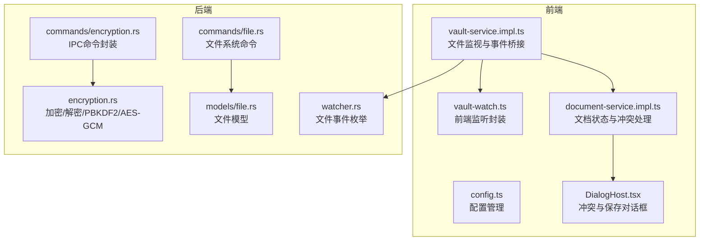
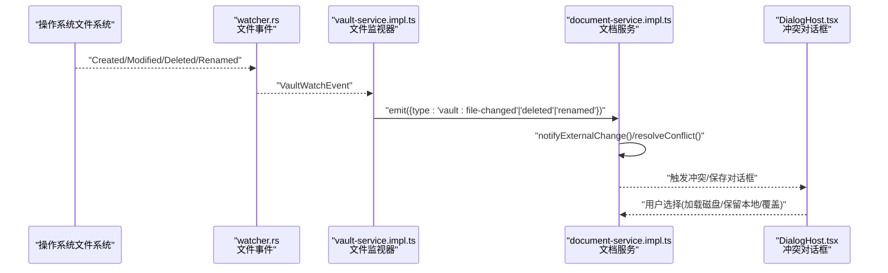
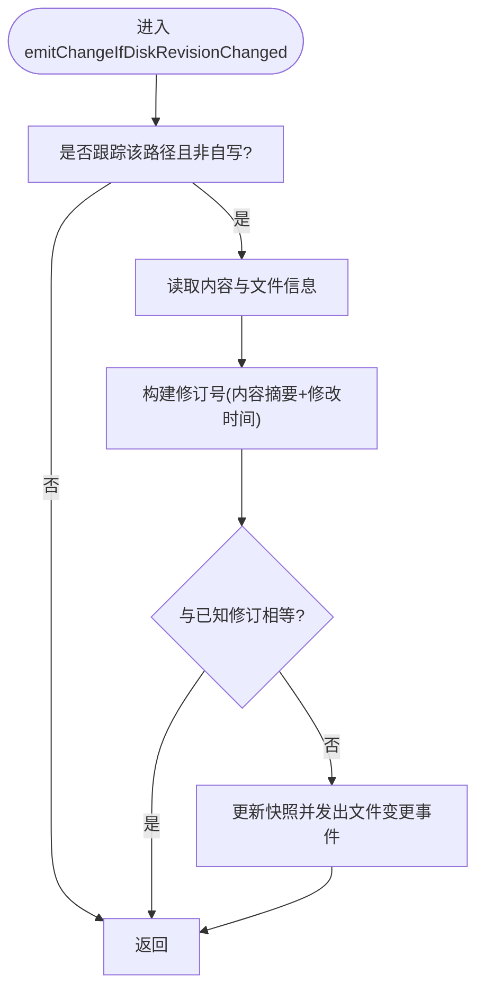
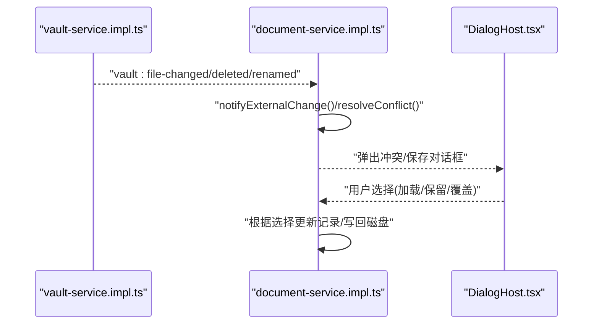
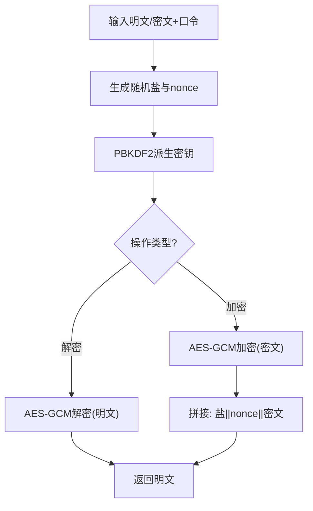
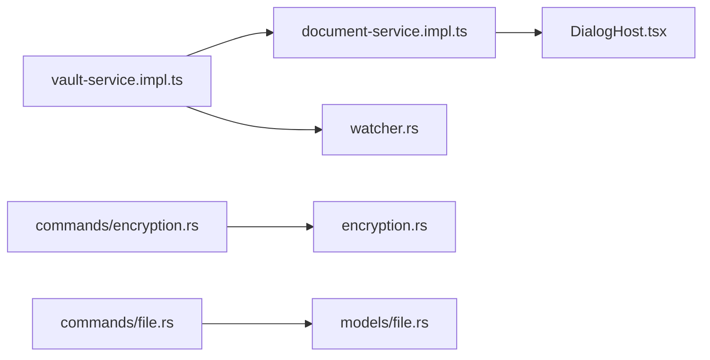

# 文件系统服务

<cite>
**本文引用的文件**
- [vault-service.impl.ts](file://src/core/vault/vault-service.impl.ts)
- [vault-watch.ts](file://src/core/vault/vault-watch.ts)
- [document-service.impl.ts](file://src/core/document/document-service.impl.ts)
- [encryption.rs](file://src-tauri/src/encryption.rs)
- [encryption.rs（命令层）](file://src-tauri/src/commands/encryption.rs)
- [watcher.rs](file://src-tauri/src/watcher.rs)
- [DialogHost.tsx](file://src/components/dialogs/DialogHost.tsx)
- [config.ts](file://src/core/platform/config.ts)
- [file.rs（命令层）](file://src-tauri/src/commands/file.rs)
- [file.rs（模型定义）](file://src-tauri/src/models/file.rs)
- [dataflow_tests.rs](file://src-tauri/tests/dataflow_tests.rs)
- [integration_test.rs](file://src-tauri/tests/integration_test.rs)
</cite>

## 目录
1. [简介](#简介)
2. [项目结构](#项目结构)
3. [核心组件](#核心组件)
4. [架构总览](#架构总览)
5. [详细组件分析](#详细组件分析)
6. [依赖关系分析](#依赖关系分析)
7. [性能考量](#性能考量)
8. [故障排查指南](#故障排查指南)
9. [结论](#结论)
10. [附录](#附录)

## 简介
本文件系统服务文档聚焦于NoteForge中的文件系统能力，涵盖以下主题：
- 文件监视器：文件变化检测、递归监听与事件处理机制
- 文件加密解密：AES-GCM、PBKDF2密钥派生、安全存储与备份流程
- 配置管理：配置文件读写、热重载与版本控制
- 权限与符号链接：权限管理、符号链接处理与跨平台兼容性
- 错误处理与异常恢复：冲突对话框、重试与回退策略
- 大文件与内存优化：分层存储、进度监控与内存控制
- 安全与完整性：访问控制、数据完整性校验与安全存储

## 项目结构
NoteForge采用前端+后端（Tauri/Rust）混合架构，文件系统相关逻辑主要分布在：
- 前端核心：vault服务、文档服务、对话框UI
- 后端核心：文件系统命令、加密服务、文件事件监听
- 测试：集成测试与数据流测试

图表来源
- [vault-service.impl.ts](file://src/core/vault/vault-service.impl.ts)
- [document-service.impl.ts](file://src/core/document/document-service.impl.ts)
- [vault-watch.ts](file://src/core/vault/vault-watch.ts)
- [config.ts](file://src/core/platform/config.ts)
- [DialogHost.tsx](file://src/components/dialogs/DialogHost.tsx)
- [encryption.rs](file://src-tauri/src/encryption.rs)
- [encryption.rs（命令层）](file://src-tauri/src/commands/encryption.rs)
- [watcher.rs](file://src-tauri/src/watcher.rs)
- [file.rs（命令层）](file://src-tauri/src/commands/file.rs)
- [file.rs（模型定义）](file://src-tauri/src/models/file.rs)

章节来源
- [vault-service.impl.ts](file://src/core/vault/vault-service.impl.ts)
- [document-service.impl.ts](file://src/core/document/document-service.impl.ts)
- [vault-watch.ts](file://src/core/vault/vault-watch.ts)
- [config.ts](file://src/core/platform/config.ts)
- [DialogHost.tsx](file://src/components/dialogs/DialogHost.tsx)
- [encryption.rs](file://src-tauri/src/encryption.rs)
- [encryption.rs（命令层）](file://src-tauri/src/commands/encryption.rs)
- [watcher.rs](file://src-tauri/src/watcher.rs)
- [file.rs（命令层）](file://src-tauri/src/commands/file.rs)
- [file.rs（模型定义）](file://src-tauri/src/models/file.rs)

## 核心组件
- 文件监视器：负责检测磁盘变更、区分自写路径、维护快照与事件发布
- 文档服务：基于监视器事件更新文档状态、处理外部变更与重命名
- 加密服务：PBKDF2派生密钥、AES-GCM加解密、API密钥安全存储
- IPC命令：将Rust侧能力暴露给前端
- 对话框UI：冲突提示与用户选择（加载磁盘/保留本地/覆盖保存等）
- 配置管理：配置读写、热重载与版本控制

章节来源
- [vault-service.impl.ts](file://src/core/vault/vault-service.impl.ts)
- [document-service.impl.ts](file://src/core/document/document-service.impl.ts)
- [encryption.rs](file://src-tauri/src/encryption.rs)
- [encryption.rs（命令层）](file://src-tauri/src/commands/encryption.rs)
- [DialogHost.tsx](file://src/components/dialogs/DialogHost.tsx)
- [config.ts](file://src/core/platform/config.ts)

## 架构总览
文件系统服务通过前端vault服务与后端watcher/commands协作，实现跨平台文件监听与事件分发；加密服务通过IPC命令在Rust侧执行，保证密钥与数据的安全。

图表来源
- [watcher.rs](file://src-tauri/src/watcher.rs)
- [vault-service.impl.ts](file://src/core/vault/vault-service.impl.ts)
- [document-service.impl.ts](file://src/core/document/document-service.impl.ts)
- [DialogHost.tsx](file://src/components/dialogs/DialogHost.tsx)

## 详细组件分析

### 文件监视器与事件处理
- 自写路径过滤：避免自身写入引发的重复事件
- 快照与修订：为受跟踪路径维护“内容摘要+修改时间”的修订号，用于增量检测
- 跨平台策略：
  - Tauri原生监听：订阅后端watcher事件，直接转发到前端事件总线
  - Web轮询：无原生监听时以固定周期扫描已跟踪路径，检测修订变化
- 事件类型：
  - 修改：触发文档刷新或冲突提示
  - 创建：通知树刷新
  - 删除：清理跟踪并通知删除
  - 重命名：迁移快照键并通知重命名

图表来源
- [vault-service.impl.ts](file://src/core/vault/vault-service.impl.ts)

章节来源
- [vault-service.impl.ts](file://src/core/vault/vault-service.impl.ts)
- [vault-watch.ts](file://src/core/vault/vault-watch.ts)
- [watcher.rs](file://src-tauri/src/watcher.rs)

### 文档服务与冲突处理
- 外部变更通知：当收到“文件变更/删除/重命名”事件时，文档服务更新记录、标记生命周期状态
- 冲突解决：
  - 加载磁盘：丢弃本地未保存更改，使用磁盘最新内容
  - 保留本地：继续编辑本地版本，下次保存覆盖磁盘
  - 覆盖保存：将本地内容写回磁盘
- 对话框UI：提供明确选项与描述，确保用户知情选择

图表来源
- [document-service.impl.ts](file://src/core/document/document-service.impl.ts)
- [DialogHost.tsx](file://src/components/dialogs/DialogHost.tsx)

章节来源
- [document-service.impl.ts](file://src/core/document/document-service.impl.ts)
- [DialogHost.tsx](file://src/components/dialogs/DialogHost.tsx)

### 文件加密与密钥管理
- 算法与参数：
  - 密钥派生：PBKDF2-HMAC-SHA256，迭代次数与盐长度固定
  - 加密：AES-256-GCM，随机12字节nonce
  - 存储格式：盐(16B)+nonce(12B)+密文
- 功能：
  - 数据加解密
  - 工作区备份创建与还原
  - API密钥安全存储与检索（按服务名生成.key文件）

图表来源
- [encryption.rs](file://src-tauri/src/encryption.rs)

章节来源
- [encryption.rs](file://src-tauri/src/encryption.rs)
- [encryption.rs（命令层）](file://src-tauri/src/commands/encryption.rs)
- [dataflow_tests.rs](file://src-tauri/tests/dataflow_tests.rs)
- [integration_test.rs](file://src-tauri/tests/integration_test.rs)

### 配置管理服务
- 配置读写：提供配置对象的持久化与读取
- 热重载：监听配置变更并触发应用范围内的更新
- 版本控制：通过修订号或时间戳标识配置版本，支持回滚与比较
- 与UI集成：在设置对话框中展示与编辑配置项

章节来源
- [config.ts](file://src/core/platform/config.ts)

### 文件系统权限、符号链接与跨平台
- 权限管理：通过后端命令层统一调用平台API，避免前端直接操作文件系统
- 符号链接：在Rust侧进行解析与处理，前端仅接收标准化路径
- 跨平台：Tauri在Windows/macOS/Linux上提供一致的文件事件与命令接口

章节来源
- [file.rs（命令层）](file://src-tauri/src/commands/file.rs)
- [file.rs（模型定义）](file://src-tauri/src/models/file.rs)

## 依赖关系分析
- 前端vault服务依赖后端watcher事件与IPC命令
- 文档服务订阅vault事件并驱动UI对话框
- 加密服务通过命令层暴露至前端，前后端共享安全策略
- 配置管理独立于文件系统，但可被文件操作影响（如备份/还原）

图表来源
- [vault-service.impl.ts](file://src/core/vault/vault-service.impl.ts)
- [document-service.impl.ts](file://src/core/document/document-service.impl.ts)
- [watcher.rs](file://src-tauri/src/watcher.rs)
- [DialogHost.tsx](file://src/components/dialogs/DialogHost.tsx)
- [encryption.rs（命令层）](file://src-tauri/src/commands/encryption.rs)
- [encryption.rs](file://src-tauri/src/encryption.rs)
- [file.rs（命令层）](file://src-tauri/src/commands/file.rs)
- [file.rs（模型定义）](file://src-tauri/src/models/file.rs)

章节来源
- [vault-service.impl.ts](file://src/core/vault/vault-service.impl.ts)
- [document-service.impl.ts](file://src/core/document/document-service.impl.ts)
- [watcher.rs](file://src-tauri/src/watcher.rs)
- [DialogHost.tsx](file://src/components/dialogs/DialogHost.tsx)
- [encryption.rs（命令层）](file://src-tauri/src/commands/encryption.rs)
- [encryption.rs](file://src-tauri/src/encryption.rs)
- [file.rs（命令层）](file://src-tauri/src/commands/file.rs)
- [file.rs（模型定义）](file://src-tauri/src/models/file.rs)

## 性能考量
- 监视策略
  - 原生监听优先：减少CPU占用与事件风暴
  - Web轮询：默认3秒间隔，平衡实时性与性能
- 内存优化
  - 文档分层存储：根据文件大小选择层级，避免大文件常驻内存
  - 冲突处理：仅在必要时加载磁盘内容，其余时间保持本地缓存
- 大文件处理
  - 分块读取与进度上报（建议在命令层实现）
  - 懒加载与虚拟滚动（UI层面）
- I/O优化
  - 批量事件合并：在事件队列中去抖动
  - 增量同步：仅在修订号变化时触发更新

## 故障排查指南
- 文件变更未生效
  - 检查是否处于自写路径（self-write过滤）
  - 确认跟踪列表中是否存在该路径
  - 若为Web环境，确认轮询定时器是否启动
- 冲突频繁出现
  - 用户选择“加载磁盘”或“保留本地”，避免覆盖保存导致反复冲突
  - 检查是否有外部工具同时编辑同一文件
- 加密/解密失败
  - 确认口令正确且存储格式完整（盐+nonce+密文）
  - 检查PBKDF2迭代次数与密钥长度一致性
- 备份/还原异常
  - 确认工作区路径存在且可读写
  - 检查输出路径权限与磁盘空间

章节来源
- [vault-service.impl.ts](file://src/core/vault/vault-service.impl.ts)
- [document-service.impl.ts](file://src/core/document/document-service.impl.ts)
- [DialogHost.tsx](file://src/components/dialogs/DialogHost.tsx)
- [encryption.rs](file://src-tauri/src/encryption.rs)
- [dataflow_tests.rs](file://src-tauri/tests/dataflow_tests.rs)

## 结论
NoteForge的文件系统服务通过原生监听与轮询相结合的方式实现了稳定可靠的文件变更检测；文档服务与UI对话框共同提供了清晰的冲突处理体验；加密服务以PBKDF2+AES-GCM保障了数据与密钥的安全存储。整体设计兼顾性能、安全性与跨平台兼容性，适合在多场景下使用。

## 附录
- 关键流程图与类图请参考上述各章节的可视化示意图
- 如需扩展功能（如进度监控、批量操作），可在现有IPC命令与事件机制基础上增加相应接口与UI反馈