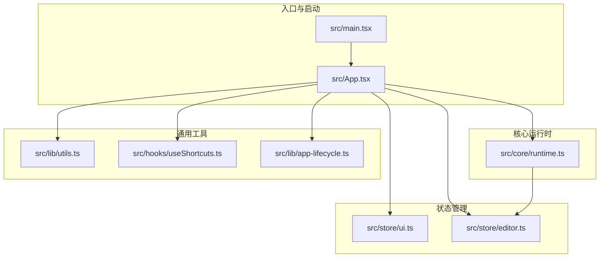
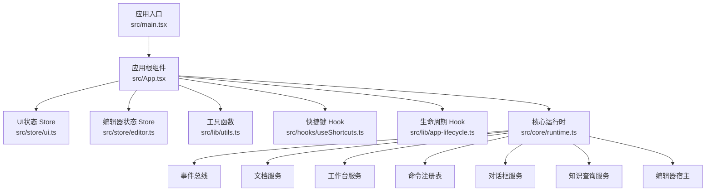
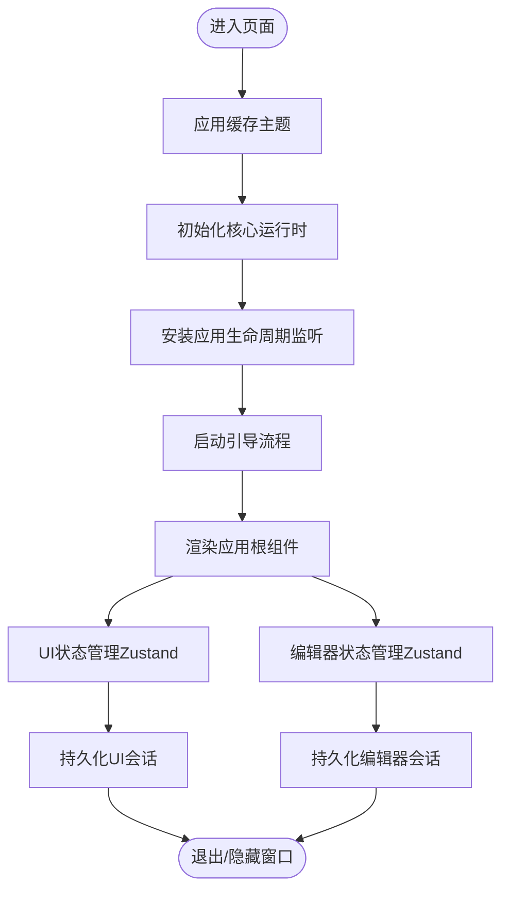
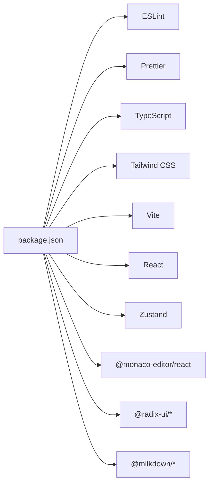

# 代码规范与最佳实践

<cite>
**本文引用的文件**
- [.eslintrc.json](file://.eslintrc.json)
- [.prettierrc.json](file://.prettierrc.json)
- [tailwind.config.js](file://tailwind.config.js)
- [tsconfig.json](file://tsconfig.json)
- [package.json](file://package.json)
- [src/types.ts](file://src/types.ts)
- [src/App.tsx](file://src/App.tsx)
- [src/main.tsx](file://src/main.tsx)
- [src/components/ui/Button.tsx](file://src/components/ui/Button.tsx)
- [src/hooks/useShortcuts.ts](file://src/hooks/useShortcuts.ts)
- [src/lib/utils.ts](file://src/lib/utils.ts)
- [src/store/ui.ts](file://src/store/ui.ts)
- [src/store/editor.ts](file://src/store/editor.ts)
- [src/core/runtime.ts](file://src/core/runtime.ts)
- [src/lib/app-lifecycle.ts](file://src/lib/app-lifecycle.ts)
</cite>

## 目录
1. [简介](#简介)
2. [项目结构](#项目结构)
3. [核心组件](#核心组件)
4. [架构总览](#架构总览)
5. [详细组件分析](#详细组件分析)
6. [依赖关系分析](#依赖关系分析)
7. [性能考虑](#性能考虑)
8. [故障排查指南](#故障排查指南)
9. [结论](#结论)
10. [附录](#附录)

## 简介
本指南面向NoteForge前端团队与贡献者，系统性阐述工程的代码规范与最佳实践，覆盖以下方面：
- ESLint配置与JavaScript/TypeScript编码标准（命名、文件组织、注释）
- Prettier格式化与代码风格统一
- TypeScript类型系统使用规范（接口、联合类型、类型安全）
- Tailwind CSS类名规范与样式组织原则
- 组件开发最佳实践（React组件设计、状态管理、错误边界）
- 性能优化（懒加载、防抖节流、内存泄漏防护）

## 项目结构
NoteForge采用模块化与分层架构，前端以Vite+React+TypeScript构建，配合Zustand进行状态管理，核心运行时通过“核心服务”抽象连接文档、工作台、命令系统等子域。

图表来源
- [src/main.tsx:1-24](file://src/main.tsx#L1-L24)
- [src/App.tsx:1-111](file://src/App.tsx#L1-L111)
- [src/core/runtime.ts:1-191](file://src/core/runtime.ts#L1-L191)
- [src/store/ui.ts:1-86](file://src/store/ui.ts#L1-L86)
- [src/store/editor.ts:1-842](file://src/store/editor.ts#L1-L842)
- [src/lib/utils.ts:1-100](file://src/lib/utils.ts#L1-L100)
- [src/hooks/useShortcuts.ts:1-25](file://src/hooks/useShortcuts.ts#L1-L25)
- [src/lib/app-lifecycle.ts:1-31](file://src/lib/app-lifecycle.ts#L1-L31)

章节来源
- [src/main.tsx:1-24](file://src/main.tsx#L1-L24)
- [src/App.tsx:1-111](file://src/App.tsx#L1-L111)

## 核心组件
- ESLint与Prettier：统一语法检查与格式化，确保跨团队一致性。
- TypeScript：严格模式与路径别名，提升类型安全与可维护性。
- Tailwind CSS：基于CSS变量的主题系统，支持明暗主题与原子化样式。
- Zustand：轻量状态管理，集中管理UI状态与编辑器会话。
- React组件：高内聚、低耦合，通过Hook与Store解耦逻辑与视图。

章节来源
- [.eslintrc.json:1-26](file://.eslintrc.json#L1-L26)
- [.prettierrc.json:1-10](file://.prettierrc.json#L1-L10)
- [tsconfig.json:1-28](file://tsconfig.json#L1-L28)
- [tailwind.config.js:1-105](file://tailwind.config.js#L1-L105)
- [package.json:1-70](file://package.json#L1-L70)

## 架构总览
NoteForge前端采用“应用入口 → 核心运行时 → 状态管理 → UI组件”的分层结构。核心运行时负责事件总线、文档服务、工作台、命令注册与知识查询等；状态管理通过Zustand集中管理UI与编辑器状态；UI组件通过Hook与Store实现松耦合交互。

图表来源
- [src/main.tsx:1-24](file://src/main.tsx#L1-L24)
- [src/App.tsx:1-111](file://src/App.tsx#L1-L111)
- [src/core/runtime.ts:1-191](file://src/core/runtime.ts#L1-L191)
- [src/store/ui.ts:1-86](file://src/store/ui.ts#L1-L86)
- [src/store/editor.ts:1-842](file://src/store/editor.ts#L1-L842)
- [src/lib/utils.ts:1-100](file://src/lib/utils.ts#L1-L100)
- [src/hooks/useShortcuts.ts:1-25](file://src/hooks/useShortcuts.ts#L1-L25)
- [src/lib/app-lifecycle.ts:1-31](file://src/lib/app-lifecycle.ts#L1-L31)

## 详细组件分析

### ESLint与Prettier配置
- ESLint扩展与插件：启用推荐规则、TypeScript、React与React Hooks，并集成prettier以避免格式冲突。
- 解析器与环境：使用TypeScript解析器，目标环境为浏览器与Node，版本为ES2022。
- 规则取舍：关闭React JSX作用域与prop-types检查；对未使用变量允许忽略下划线前缀；对any、空函数、ts注释与空语句进行宽松处理，同时保留整体严格性。
- 忽略模式：排除dist、node_modules、Rust侧src-tauri、以及各类*.config.*文件。

章节来源
- [.eslintrc.json:1-26](file://.eslintrc.json#L1-L26)

### Prettier格式化规范
- 标点与引号：使用分号、双引号；箭头函数参数括号始终添加；行尾LF换行。
- 缩进与宽度：2空格缩进，行宽100字符。
- 尾随逗号：所有适用位置均添加。
- 命令：提供lint与format脚本，分别用于检查与自动修复。

章节来源
- [.prettierrc.json:1-10](file://.prettierrc.json#L1-L10)
- [package.json:7-16](file://package.json#L7-L16)

### TypeScript类型系统规范
- 严格编译选项：开启严格模式、不允许未使用局部变量与参数（可按需放宽）、禁止switch漏掉情况。
- 路径别名：baseUrl与paths映射到src，便于相对导入与可读性。
- 类型设计原则：
  - 接口命名：使用名词或形容词，描述数据结构与职责边界。
  - 联合类型：对枚举值（如语言、面板模式）使用字面量联合类型，保证编译期安全。
  - 可选属性：仅在后端对齐场景中使用，避免滥用导致类型污染。
  - 错误类型：自定义IpcError类，携带错误码与详情，便于上层统一处理。
  - 共享类型：在src/types.ts集中声明，前后端对齐（如snake_case与camelCase映射），减少重复与不一致。

章节来源
- [tsconfig.json:1-28](file://tsconfig.json#L1-L28)
- [src/types.ts:1-389](file://src/types.ts#L1-L389)

### Tailwind CSS类名规范与样式组织
- 主题变量：通过CSS变量映射背景、表面、边框、文本、强调色与标签色，支持明/暗主题切换。
- 圆角与间距：统一sm/md/lg/xl等尺寸，便于组件复用与一致性。
- 字体族与字号：提供无衬线与等宽字体族，字号与行高组合满足阅读体验。
- 动画与关键帧：内置淡入、脉冲与光晕等动画，统一过渡效果。
- 类名合并：使用clsx与tailwind-merge进行条件类名合并，避免冲突与冗余。

章节来源
- [tailwind.config.js:1-105](file://tailwind.config.js#L1-L105)
- [src/components/ui/Button.tsx:1-44](file://src/components/ui/Button.tsx#L1-L44)
- [src/lib/utils.ts:1-100](file://src/lib/utils.ts#L1-L100)

### 组件开发最佳实践
- 组件职责单一：UI组件仅负责渲染与事件透传，业务逻辑下沉至Hook或Store。
- Props与变体：通过变体与尺寸枚举约束外观，结合Tailwind原子类实现灵活组合。
- 受控与非受控：优先使用受控组件，避免内部状态与外部状态不一致。
- 可访问性：为容器设置aria属性，必要时禁用交互元素。
- 生命周期：在入口处初始化主题、核心运行时与应用生命周期，确保退出前持久化与清理。

章节来源
- [src/components/ui/Button.tsx:1-44](file://src/components/ui/Button.tsx#L1-L44)
- [src/App.tsx:1-111](file://src/App.tsx#L1-L111)
- [src/main.tsx:1-24](file://src/main.tsx#L1-L24)

### 状态管理模式
- UI状态：集中于ui.ts，包含侧边栏、右侧面板、搜索、设置等开关与尺寸控制。
- 编辑器状态：集中于editor.ts，包含多窗格、标签页、语言、表面模式、树同步联动等；提供保存、关闭、分割、移动等操作。
- 持久化策略：窗口会话（UI布局与活动状态）与草稿（未保存内容）分层持久化，退出前统一刷新与落盘。

图表来源
- [src/main.tsx:1-24](file://src/main.tsx#L1-L24)
- [src/core/runtime.ts:1-191](file://src/core/runtime.ts#L1-L191)
- [src/lib/app-lifecycle.ts:1-31](file://src/lib/app-lifecycle.ts#L1-L31)
- [src/store/ui.ts:1-86](file://src/store/ui.ts#L1-L86)
- [src/store/editor.ts:1-842](file://src/store/editor.ts#L1-L842)

章节来源
- [src/store/ui.ts:1-86](file://src/store/ui.ts#L1-L86)
- [src/store/editor.ts:1-842](file://src/store/editor.ts#L1-L842)
- [src/core/runtime.ts:1-191](file://src/core/runtime.ts#L1-L191)
- [src/lib/app-lifecycle.ts:1-31](file://src/lib/app-lifecycle.ts#L1-L31)

### 错误边界与异常处理
- 自定义错误类型：IpcError封装错误码与详情，便于统一捕获与提示。
- 对话框与确认：在关闭标签或窗体时弹出确认对话框，避免误操作丢失数据。
- 事件订阅：核心运行时订阅文档变更与冲突事件，触发对话框展示与持久化调度。

章节来源
- [src/types.ts:333-389](file://src/types.ts#L333-L389)
- [src/store/editor.ts:129-183](file://src/store/editor.ts#L129-L183)
- [src/core/runtime.ts:66-96](file://src/core/runtime.ts#L66-L96)

### 快捷键与全局路由
- 全局快捷键：通过Hook监听keydown，结合命令注册表匹配与执行，支持Mod+F1等组合键。
- 上下文构建：根据当前上下文构建命令上下文，提高快捷键命中率与可发现性。

章节来源
- [src/hooks/useShortcuts.ts:1-25](file://src/hooks/useShortcuts.ts#L1-L25)
- [src/core/runtime.ts:1-191](file://src/core/runtime.ts#L1-L191)

## 依赖关系分析
- 开发工具链：ESLint、Prettier、TypeScript、Tailwind CSS、Vite、React与React Hooks。
- 运行时依赖：React生态、Radix UI组件、Monaco编辑器、Zustand状态管理、Milkdown富文本、Fuse.js搜索、Tailwind Merge等。
- 脚本命令：dev、build、preview、lint、format、tauri系列，覆盖开发、构建与打包全流程。

图表来源
- [package.json:1-70](file://package.json#L1-L70)

章节来源
- [package.json:1-70](file://package.json#L1-L70)

## 性能考虑
- 懒加载与异步导入：在编辑器状态与会话持久化中广泛使用动态import，降低首屏体积与启动时间。
- 防抖与节流：建议在高频输入、滚动与窗口大小变化场景引入节流/防抖，避免频繁重渲染与计算。
- 内存泄漏防护：
  - 在组件卸载时移除事件监听（如useEffect返回清理函数）。
  - 在应用退出前取消待定的自动保存任务，确保资源释放。
- 渲染优化：使用React.memo、useMemo、useCallback缓存昂贵计算与子组件；合理拆分子组件，避免不必要的重渲染。
- 图像与大列表：对图片与长列表采用虚拟化或占位符策略，减少初始渲染压力。

## 故障排查指南
- ESLint告警过多：调整脚本中的最大警告数或临时放宽规则，但需尽快回归严格。
- Prettier冲突：确保编辑器保存时自动调用格式化命令，避免手动修改格式化配置。
- 类名冲突：使用clsx与tailwind-merge合并类名，避免重复与覆盖。
- 退出未持久化：检查生命周期安装与请求退出流程，确保在Tauri环境下正确拦截关闭事件。
- 文档冲突：关注核心运行时对冲突事件的订阅与对话框展示，及时处理外部修改导致的冲突。

章节来源
- [.eslintrc.json:15-23](file://.eslintrc.json#L15-L23)
- [.prettierrc.json:1-10](file://.prettierrc.json#L1-10)
- [src/lib/utils.ts:1-6](file://src/lib/utils.ts#L1-L6)
- [src/lib/app-lifecycle.ts:13-30](file://src/lib/app-lifecycle.ts#L13-L30)
- [src/core/runtime.ts:66-96](file://src/core/runtime.ts#L66-L96)

## 结论
通过统一的ESLint/Prettier配置、严格的TypeScript类型系统、Tailwind CSS主题化与Zustand状态管理，NoteForge实现了高一致性、可维护与可扩展的前端架构。遵循本文规范与最佳实践，可在保证开发效率的同时，持续提升代码质量与用户体验。

## 附录
- 命名约定
  - 文件：采用帕斯卡命名（如App.tsx、Button.tsx）；Hook使用use前缀（如useShortcuts.ts）。
  - 类型：接口与类型使用帕斯卡命名；常量使用大写下划线（如MAIN_PANE_ID）。
  - 变量：小驼峰命名；枚举值使用全大写与下划线分隔。
- 注释规范
  - 公共API与复杂逻辑添加JSDoc式注释，说明用途、参数与返回值。
  - TODO/FIXME标注问题与后续改进点，便于追踪。
- 文件组织
  - 按功能域划分目录（components、hooks、lib、store、features等），保持同层文件职责单一。
  - 使用路径别名（@/*）简化导入路径，提升可读性与迁移便利性。