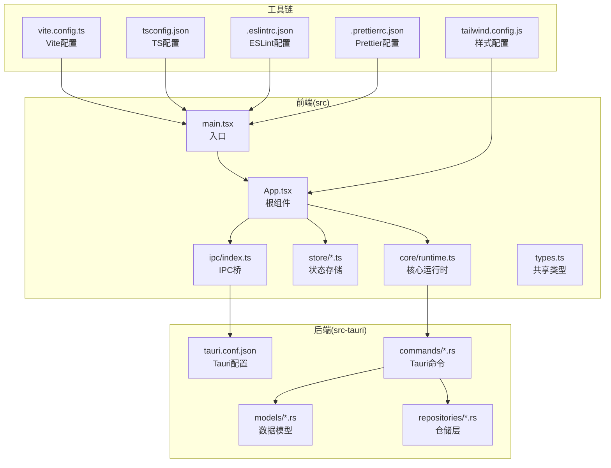
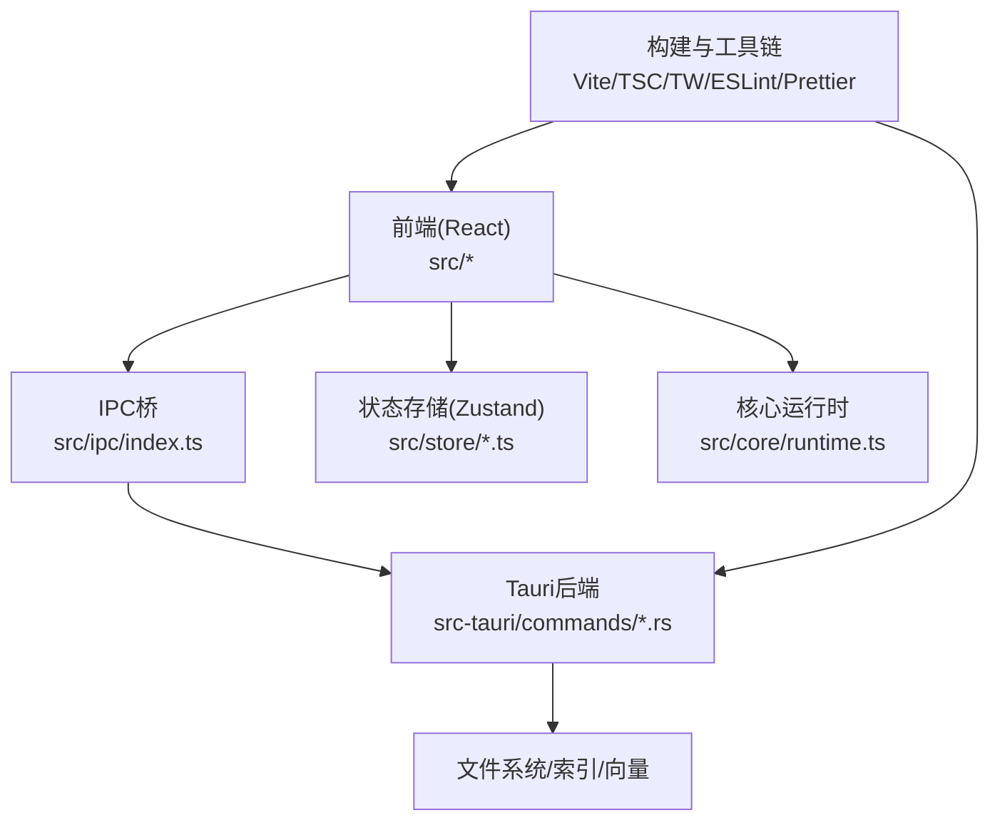
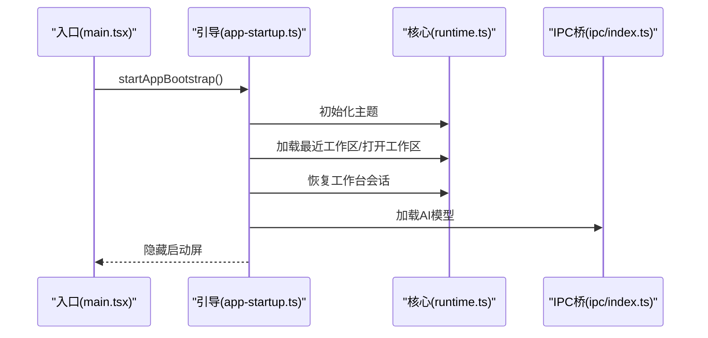
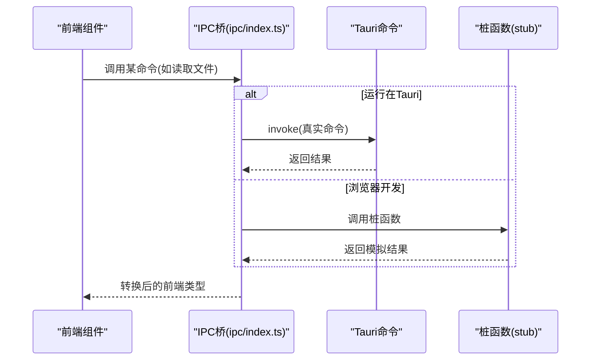
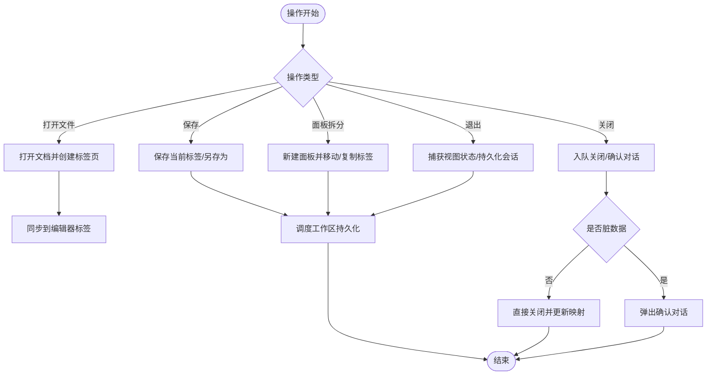
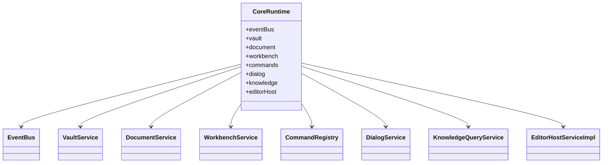
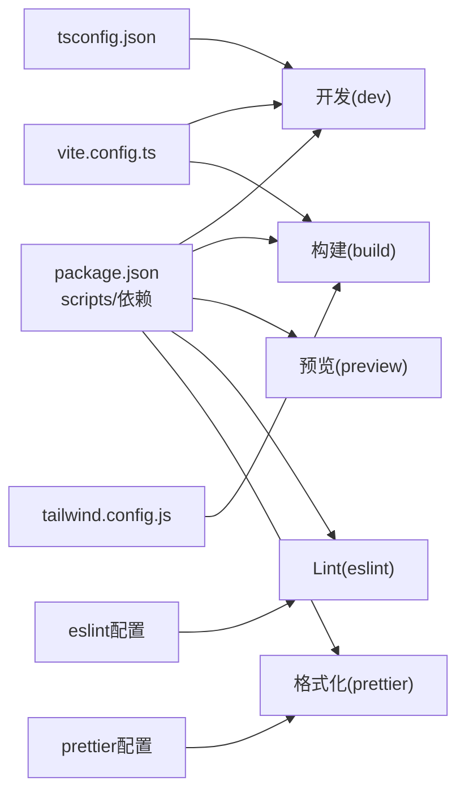

# 开发指南

<cite>
**本文引用的文件**
- [package.json](file://package.json)
- [tsconfig.json](file://tsconfig.json)
- [tailwind.config.js](file://tailwind.config.js)
- [.eslintrc.json](file://.eslintrc.json)
- [.prettierrc.json](file://.prettierrc.json)
- [vite.config.ts](file://vite.config.ts)
- [src-tauri/tauri.conf.json](file://src-tauri/tauri.conf.json)
- [src/main.tsx](file://src/main.tsx)
- [src/App.tsx](file://src/App.tsx)
- [src/core/runtime.ts](file://src/core/runtime.ts)
- [src/lib/app-startup.ts](file://src/lib/app-startup.ts)
- [src/ipc/index.ts](file://src/ipc/index.ts)
- [src/store/ui.ts](file://src/store/ui.ts)
- [src/store/editor.ts](file://src/store/editor.ts)
- [src/types.ts](file://src/types.ts)
</cite>

## 目录
1. [简介](#简介)
2. [项目结构](#项目结构)
3. [核心组件](#核心组件)
4. [架构总览](#架构总览)
5. [详细组件分析](#详细组件分析)
6. [依赖关系分析](#依赖关系分析)
7. [性能考虑](#性能考虑)
8. [故障排除指南](#故障排除指南)
9. [结论](#结论)
10. [附录](#附录)

## 简介
本开发指南面向新加入的开发者与维护者，目标是帮助你快速搭建开发环境、理解代码结构与运行机制、掌握编码规范与最佳实践，并提供调试、性能优化与扩展开发的实用建议。NoteForge 是基于 Tauri v2 的本地优先知识管理应用，采用 React + TypeScript 前端与 Rust 后端，通过 IPC 桥接实现前后端通信。

## 项目结构
- 前端位于 src 目录，包含组件、核心运行时、状态存储、类型定义与启动流程。
- 后端位于 src-tauri 目录，包含 Tauri 配置、命令实现、模型与仓库层等。
- 构建与工具链由 Vite、TypeScript、Tailwind CSS、ESLint、Prettier 等组成。
- 根目录脚本用于开发、构建、预览、格式化与 Lint。

图表来源
- [src/main.tsx:1-24](file://src/main.tsx#L1-L24)
- [src/App.tsx:1-111](file://src/App.tsx#L1-L111)
- [src/core/runtime.ts:1-191](file://src/core/runtime.ts#L1-L191)
- [src/ipc/index.ts:1-489](file://src/ipc/index.ts#L1-L489)
- [src-tauri/tauri.conf.json:1-40](file://src-tauri/tauri.conf.json#L1-L40)
- [vite.config.ts:1-42](file://vite.config.ts#L1-L42)
- [tsconfig.json:1-28](file://tsconfig.json#L1-L28)
- [tailwind.config.js:1-105](file://tailwind.config.js#L1-L105)
- [.eslintrc.json:1-26](file://.eslintrc.json#L1-L26)
- [.prettierrc.json:1-10](file://.prettierrc.json#L1-L10)

章节来源
- [src/main.tsx:1-24](file://src/main.tsx#L1-L24)
- [src/App.tsx:1-111](file://src/App.tsx#L1-L111)
- [src/core/runtime.ts:1-191](file://src/core/runtime.ts#L1-L191)
- [src/ipc/index.ts:1-489](file://src/ipc/index.ts#L1-L489)
- [src-tauri/tauri.conf.json:1-40](file://src-tauri/tauri.conf.json#L1-L40)
- [vite.config.ts:1-42](file://vite.config.ts#L1-L42)
- [tsconfig.json:1-28](file://tsconfig.json#L1-L28)
- [tailwind.config.js:1-105](file://tailwind.config.js#L1-L105)
- [.eslintrc.json:1-26](file://.eslintrc.json#L1-L26)
- [.prettierrc.json:1-10](file://.prettierrc.json#L1-L10)

## 核心组件
- 应用入口与启动
  - 入口文件负责初始化主题缓存、核心运行时、应用生命周期与启动流程，并挂载根组件。
  - 启动流程按顺序完成主题加载、工作区选择与打开、会话恢复与 AI 模型加载。
- 核心运行时
  - 负责创建事件总线、文档服务、工作台服务、命令注册表、对话框服务、知识查询服务与编辑器宿主。
  - 订阅文档变更、冲突与关闭事件，触发自动保存与会话持久化。
- IPC 桥
  - 统一的 IPC 调用入口，根据是否在 Tauri 环境决定调用真实命令或模拟桩函数。
  - 提供工作区、文件系统、草稿、工作台会话、编辑器、知识引擎、代理记忆、AI 服务与系统配置等模块。
- 状态存储
  - UI 状态（侧边栏、右侧面板、问题面板、对话框开关等）与编辑器状态（标签页、面板、光标状态、会话持久化等）。
- 类型系统
  - 定义前后端对齐的数据结构，确保 IPC 接口稳定且可演进。

章节来源
- [src/main.tsx:1-24](file://src/main.tsx#L1-L24)
- [src/lib/app-startup.ts:1-75](file://src/lib/app-startup.ts#L1-L75)
- [src/core/runtime.ts:1-191](file://src/core/runtime.ts#L1-L191)
- [src/ipc/index.ts:1-489](file://src/ipc/index.ts#L1-L489)
- [src/store/ui.ts:1-86](file://src/store/ui.ts#L1-L86)
- [src/store/editor.ts:1-842](file://src/store/editor.ts#L1-L842)
- [src/types.ts:1-389](file://src/types.ts#L1-L389)

## 架构总览
NoteForge 采用“前端 React + Tauri 后端”的双端架构，通过 IPC 桥实现解耦。前端负责 UI 与交互，后端负责文件系统、索引与 AI 能力。Vite 提供开发服务器与打包，TypeScript 提供类型安全，Tailwind CSS 提供样式基础。

图表来源
- [src/ipc/index.ts:1-489](file://src/ipc/index.ts#L1-L489)
- [src/core/runtime.ts:1-191](file://src/core/runtime.ts#L1-L191)
- [src/store/editor.ts:1-842](file://src/store/editor.ts#L1-L842)
- [vite.config.ts:1-42](file://vite.config.ts#L1-L42)
- [tsconfig.json:1-28](file://tsconfig.json#L1-L28)
- [tailwind.config.js:1-105](file://tailwind.config.js#L1-L105)

## 详细组件分析

### 启动流程与生命周期
- 入口初始化：应用启动时应用缓存主题、初始化核心运行时、安装应用生命周期钩子、启动引导流程。
- 引导步骤：主题 → 工作区选择与打开 → 会话恢复 → AI 模型加载；失败时兜底处理并隐藏启动屏。
- 生命周期：在非 Tauri 环境下监听窗口隐藏与卸载事件，确保退出前刷新与持久化。

图表来源
- [src/main.tsx:1-24](file://src/main.tsx#L1-L24)
- [src/lib/app-startup.ts:1-75](file://src/lib/app-startup.ts#L1-L75)
- [src/core/runtime.ts:1-191](file://src/core/runtime.ts#L1-L191)
- [src/ipc/index.ts:1-489](file://src/ipc/index.ts#L1-L489)

章节来源
- [src/main.tsx:1-24](file://src/main.tsx#L1-L24)
- [src/lib/app-startup.ts:1-75](file://src/lib/app-startup.ts#L1-L75)
- [src/App.tsx:1-111](file://src/App.tsx#L1-L111)

### IPC 桥与命令调用
- 设计要点：统一入口、条件调用、错误包装、数据转换。
- 模块划分：工作区、文件系统、草稿、工作台会话、编辑器、知识引擎、代理记忆、AI 服务、系统配置。
- 数据映射：后端返回结构到前端类型的转换函数，保证接口稳定。

图表来源
- [src/ipc/index.ts:1-489](file://src/ipc/index.ts#L1-L489)

章节来源
- [src/ipc/index.ts:1-489](file://src/ipc/index.ts#L1-L489)

### 编辑器状态与多面板
- 状态模型：包含面板列表、标签页集合、活动标签映射、活动面板、会话恢复标记、光标状态等。
- 关键行为：打开/关闭标签、保存/另存为、语言切换、表面模式切换、面板拆分与合并、退出队列与持久化。
- 一致性保障：通过 DocumentService 与 EditorHost 协同，确保内容变更与 UI 同步。

图表来源
- [src/store/editor.ts:1-842](file://src/store/editor.ts#L1-L842)

章节来源
- [src/store/editor.ts:1-842](file://src/store/editor.ts#L1-L842)

### 核心运行时与事件驱动
- 组件装配：事件总线、文档服务、工作台服务、命令注册表、对话框服务、知识查询服务、编辑器宿主。
- 事件订阅：文档冲突提示、文档关闭清理、文档变更调度持久化与自动保存。
- 外部能力：打开/保存文档、工作区会话恢复与持久化、退出前刷新。

图表来源
- [src/core/runtime.ts:1-191](file://src/core/runtime.ts#L1-L191)

章节来源
- [src/core/runtime.ts:1-191](file://src/core/runtime.ts#L1-L191)

## 依赖关系分析
- 包管理与脚本：使用包管理器执行开发、构建、预览、Lint 与格式化任务。
- 构建配置：Vite 配置别名、端口与主机、产物分包策略（monaco、milkdown、radix）。
- 类型系统：TypeScript 配置启用严格模式、路径别名与 JSX。
- 样式系统：Tailwind 使用 CSS 变量支持明暗主题，PostCSS 自动前缀。
- 规范工具：ESLint 与 Prettier 配置，确保代码风格一致。

图表来源
- [package.json:1-70](file://package.json#L1-L70)
- [vite.config.ts:1-42](file://vite.config.ts#L1-L42)
- [tsconfig.json:1-28](file://tsconfig.json#L1-L28)
- [tailwind.config.js:1-105](file://tailwind.config.js#L1-L105)
- [.eslintrc.json:1-26](file://.eslintrc.json#L1-L26)
- [.prettierrc.json:1-10](file://.prettierrc.json#L1-L10)

章节来源
- [package.json:1-70](file://package.json#L1-L70)
- [vite.config.ts:1-42](file://vite.config.ts#L1-L42)
- [tsconfig.json:1-28](file://tsconfig.json#L1-L28)
- [tailwind.config.js:1-105](file://tailwind.config.js#L1-L105)
- [.eslintrc.json:1-26](file://.eslintrc.json#L1-L26)
- [.prettierrc.json:1-10](file://.prettierrc.json#L1-L10)

## 性能考虑
- 内存管理
  - 合理使用状态存储，避免不必要的全局订阅与大对象频繁拷贝。
  - 在退出流程中取消待定的自动保存任务，确保资源释放。
- 渲染优化
  - 使用 Tailwind CSS 的原子类减少重复样式计算；合理拆分组件以提升重渲染粒度。
  - 对长列表与复杂面板使用虚拟化或懒加载策略（如文件树、搜索结果）。
- 网络与 IPC
  - 批量调用与去抖：对高频 IPC 请求进行节流/去抖，避免阻塞主线程。
  - 错误降级：在网络/模型不可用时提供本地回退或提示，避免长时间等待。
- 构建与分包
  - 利用 Vite 的手动分包策略，将大型依赖（Monaco、Milkdown、Radix）独立打包，提升缓存命中率。

[本节为通用性能建议，不直接分析具体文件]

## 故障排除指南
- 前端调试
  - 使用浏览器开发者工具检查组件层级、状态变化与事件流；关注控制台错误与未处理异常。
  - 在非 Tauri 环境下，确认 IPC 桥已走桩函数路径，便于定位逻辑问题。
- 后端调试
  - 在 Tauri 环境下，检查命令实现与日志输出；验证 IPC 参数与返回值结构是否与类型定义一致。
- IPC 问题排查
  - 若调用无响应，确认 isTauri 判断与命令名称正确；核对类型转换函数是否遗漏字段。
  - 对于错误码，使用统一的错误包装类进行捕获与提示，避免静默失败。
- 会话与持久化
  - 若退出后丢失状态，检查退出队列与持久化调度逻辑；确保在关键节点调用持久化 API。

章节来源
- [src/ipc/index.ts:1-489](file://src/ipc/index.ts#L1-L489)
- [src/store/editor.ts:1-842](file://src/store/editor.ts#L1-L842)
- [src/core/runtime.ts:1-191](file://src/core/runtime.ts#L1-L191)

## 结论
本指南从环境搭建、代码规范、核心组件、架构设计、调试与性能优化等方面提供了系统化的开发指引。建议新开发者先从入口与启动流程入手，逐步熟悉 IPC 桥与核心运行时，再深入到状态存储与具体功能模块。遵循既定的规范与最佳实践，有助于保持代码质量与团队协作效率。

[本节为总结性内容，不直接分析具体文件]

## 附录

### 开发环境搭建与 IDE 设置
- 安装依赖
  - 使用包管理器安装依赖后，执行开发脚本启动前端与后端。
- IDE 推荐
  - VS Code：安装 TypeScript、ESLint、Prettier、Tailwind CSS 插件，启用格式化与 Lint。
  - 配置：启用“在保存时格式化”与“在保存时运行 ESLint”，确保与根配置一致。
- 调试工具
  - 前端：Chrome DevTools；后端：Rust LSP（如 rust-analyzer）与日志输出。
- 开发工作流
  - 分支命名：feature/xxx、fix/xxx、chore/xxx。
  - 提交规范：参考约定式提交（例如 feat: 新增功能），并在 PR 中附上变更摘要与测试说明。
  - 代码审查：至少一名维护者审查，关注性能、可维护性与安全性。

章节来源
- [package.json:1-70](file://package.json#L1-L70)
- [.eslintrc.json:1-26](file://.eslintrc.json#L1-L26)
- [.prettierrc.json:1-10](file://.prettierrc.json#L1-L10)

### 代码规范与最佳实践
- ESLint 配置
  - 扩展推荐规则集，禁用 React 需要的导入声明与属性类型校验，保留未使用变量警告。
- Prettier 格式化
  - 使用根配置统一缩进、引号、尾随逗号与行宽，确保跨平台一致性。
- TypeScript 配置
  - 严格模式开启，路径别名与 JSX 配置与 Vite 保持一致，避免类型漂移。
- Tailwind CSS 使用
  - 通过 CSS 变量支持明暗主题；避免内联样式，优先使用原子类组合。
- 组件与状态
  - 使用 Zustand 管理局部状态；组件职责单一，避免过度耦合。
- IPC 与类型
  - 所有 IPC 接口使用统一类型定义，前后端对齐；错误统一包装与传播。

章节来源
- [.eslintrc.json:1-26](file://.eslintrc.json#L1-L26)
- [.prettierrc.json:1-10](file://.prettierrc.json#L1-L10)
- [tsconfig.json:1-28](file://tsconfig.json#L1-L28)
- [tailwind.config.js:1-105](file://tailwind.config.js#L1-L105)
- [src/types.ts:1-389](file://src/types.ts#L1-L389)
- [src/ipc/index.ts:1-489](file://src/ipc/index.ts#L1-L489)

### 贡献流程与协作规范
- 分支管理
  - 主分支保护，功能开发在 feature 分支，修复在 fix 分支，日常维护在 chore 分支。
- 提交规范
  - 使用约定式提交，配合简短标题与详细描述，必要时附带影响范围与风险评估。
- 代码审查
  - PR 必须通过自动化检查（Lint、格式化、构建），并至少一次审查通过后方可合并。
- 版本与发布
  - 使用语义化版本管理；发布前确保变更日志与相关文档同步更新。

[本节为通用协作规范，不直接分析具体文件]

### 技术债务与重构计划
- 债务识别
  - 高频 IPC 调用缺乏批量处理与去抖；部分状态更新存在重复渲染。
- 重构建议
  - 引入请求去抖与批处理队列；对长列表与复杂面板进行虚拟化。
  - 将共享逻辑抽象为 Hook 或工具函数，降低组件间重复代码。
  - 明确模块边界与依赖方向，减少循环依赖风险。
- 优先级
  - 高：影响用户体验的渲染卡顿与 IPC 延迟。
  - 中：可维护性与可测试性的改进。
  - 低：样式与文案的微调与国际化支持。

[本节为通用技术规划，不直接分析具体文件]

### 扩展开发指导
- 添加新功能
  - 在 src/features 下新增特性模块；通过 IPC 桥接入后端能力；在核心运行时注册相关服务与事件。
- 修改现有组件
  - 遵循单一职责原则；使用 Tailwind 原子类与语义化命名；确保无障碍与键盘导航可用。
- 集成第三方服务
  - 通过 IPC 桥封装外部服务调用；在类型系统中补充对应接口；提供错误处理与降级策略。

章节来源
- [src/core/runtime.ts:1-191](file://src/core/runtime.ts#L1-L191)
- [src/ipc/index.ts:1-489](file://src/ipc/index.ts#L1-L489)
- [src/types.ts:1-389](file://src/types.ts#L1-L389)

### 新人入门与成长路径
- 第一周
  - 熟悉项目结构与启动流程；运行开发环境；阅读核心运行时与 IPC 桥。
- 第二周
  - 深入状态存储与编辑器模块；尝试修复小 bug 或完善单元测试。
- 第三周
  - 参与一次代码审查；实现一个小型功能模块；编写相关文档与测试。
- 长期
  - 主导模块重构或引入新技术；承担新人指导与流程优化。

[本节为通用成长建议，不直接分析具体文件]