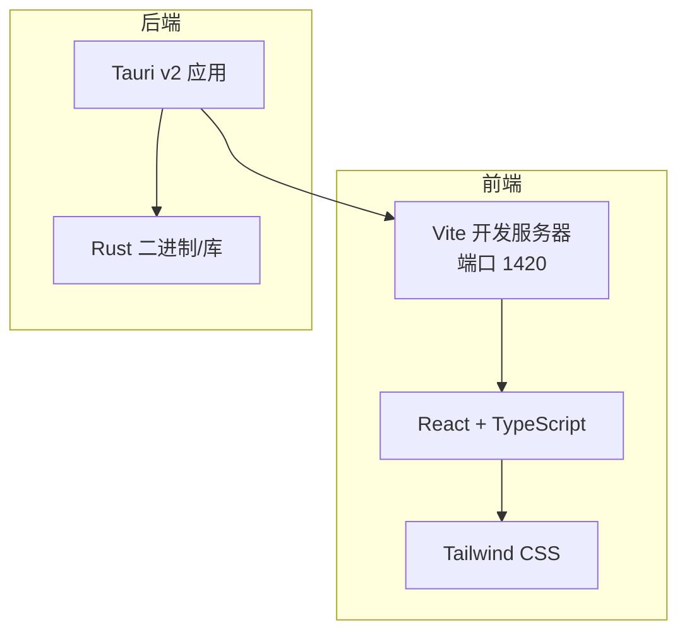
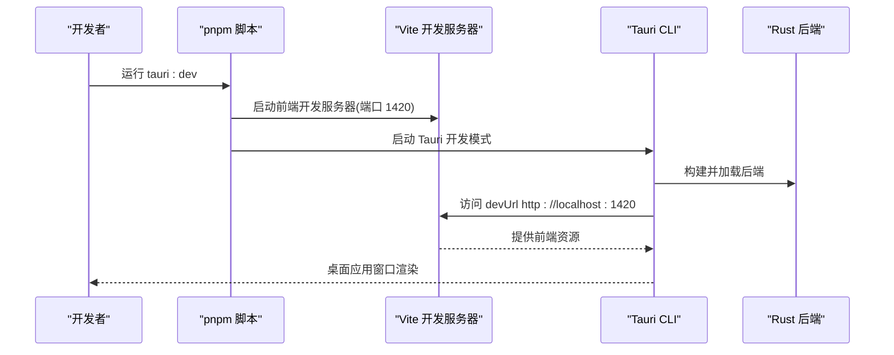
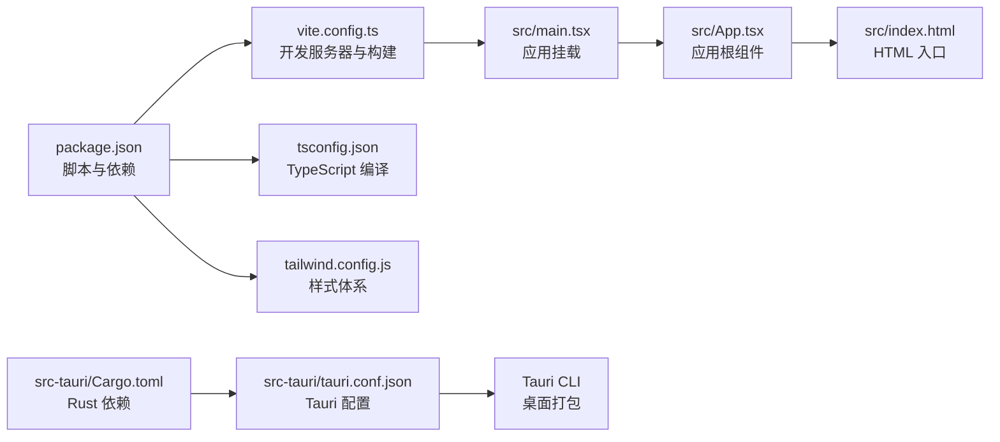

# 开发环境搭建

<cite>
**本文引用的文件**
- [package.json](file://package.json)
- [vite.config.ts](file://vite.config.ts)
- [tsconfig.json](file://tsconfig.json)
- [tailwind.config.js](file://tailwind.config.js)
- [src-tauri/Cargo.toml](file://src-tauri/Cargo.toml)
- [src-tauri/tauri.conf.json](file://src-tauri/tauri.conf.json)
- [.eslintrc.json](file://.eslintrc.json)
- [.prettierrc.json](file://.prettierrc.json)
- [README.md](file://README.md)
- [src/main.tsx](file://src/main.tsx)
- [src/App.tsx](file://src/App.tsx)
- [src/index.html](file://src/index.html)
</cite>

## 目录
1. [简介](#简介)
2. [项目结构](#项目结构)
3. [核心组件](#核心组件)
4. [架构总览](#架构总览)
5. [详细组件分析](#详细组件分析)
6. [依赖关系分析](#依赖关系分析)
7. [性能考虑](#性能考虑)
8. [故障排除指南](#故障排除指南)
9. [结论](#结论)
10. [附录](#附录)

## 简介
本指南面向希望在本地搭建 NoteForge 开发环境的工程师与技术作者。内容覆盖系统要求与前置条件（Node.js、Rust 工具链、Tauri 依赖）、IDE 设置（VSCode 推荐配置）、调试工具、环境变量、Vite 开发服务器启动与配置、TypeScript 编译选项、Tailwind CSS 的使用与定制，以及跨平台（Windows、macOS、Linux）安装指引与常见问题排查。

## 项目结构
NoteForge 采用“前端 React + TypeScript + Vite”与“后端 Rust + Tauri v2”的双端架构。前端通过 Vite 提供开发服务器与构建能力；后端通过 Tauri 将 Rust 逻辑桥接到桌面应用中，并由 Vite 提供的前端资源作为其前端分发目录。

图表来源
- [vite.config.ts:1-42](file://vite.config.ts#L1-L42)
- [src-tauri/tauri.conf.json:1-40](file://src-tauri/tauri.conf.json#L1-L40)

章节来源
- [README.md:75-112](file://README.md#L75-L112)

## 核心组件
- 前端开发与构建
  - Vite 作为开发服务器与打包工具，提供 React 支持、路径别名、环境变量前缀、构建优化与分包策略。
  - TypeScript 编译目标为 ES2022，严格模式开启，使用 bundler 解析器与 JSX React 运行时。
  - Tailwind CSS 用于样式体系，支持深色模式类、CSS 变量映射与自定义主题扩展。
- 后端与桌面集成
  - Tauri v2 作为桌面框架，Rust 作为后端语言，Cargo 管理依赖与构建。
  - Tauri 配置指定开发前命令、构建前命令、前端开发地址与产物目录，窗口尺寸与安全策略等。
- 质量保障
  - ESLint + TypeScript ESLint 插件 + Prettier 规则，统一代码风格与质量基线。

章节来源
- [package.json:1-70](file://package.json#L1-L70)
- [vite.config.ts:1-42](file://vite.config.ts#L1-L42)
- [tsconfig.json:1-28](file://tsconfig.json#L1-L28)
- [tailwind.config.js:1-105](file://tailwind.config.js#L1-L105)
- [src-tauri/tauri.conf.json:1-40](file://src-tauri/tauri.conf.json#L1-L40)
- [.eslintrc.json:1-26](file://.eslintrc.json#L1-L26)
- [.prettierrc.json:1-10](file://.prettierrc.json#L1-L10)

## 架构总览
NoteForge 的开发与构建流程如下：

图表来源
- [package.json:7-16](file://package.json#L7-L16)
- [src-tauri/tauri.conf.json:6-11](file://src-tauri/tauri.conf.json#L6-L11)
- [vite.config.ts:13-17](file://vite.config.ts#L13-L17)

## 详细组件分析

### 系统要求与前置条件
- Node.js 版本要求：>= 18
- 包管理器：pnpm（全局安装）
- Rust 工具链：安装 rustup 并确保可用
- Tauri CLI：安装版本 ^2
- 可选：Ollama（本地 AI）

章节来源
- [README.md:24-31](file://README.md#L24-L31)

### IDE 设置（VSCode 推荐配置）
- 扩展建议
  - ESLint、Prettier、Tailwind CSS IntelliSense、ES7+ React/Redux/React Native snippets、TypeScript Importer
- VSCode 设置要点
  - 使用工作区设置启用格式化与 ESLint
  - 设置默认终端为集成终端，便于直接运行 pnpm 脚本
  - 在设置中启用 TypeScript/JS 的严格模式与路径映射（基于 tsconfig.json 的路径别名）
- 调试配置
  - 使用 VSCode 的“启动配置”调试前端（Vite）与后端（Rust）进程，分别对应前端开发服务器与 Tauri 开发模式

章节来源
- [.eslintrc.json:1-26](file://.eslintrc.json#L1-L26)
- [.prettierrc.json:1-10](file://.prettierrc.json#L1-L10)
- [tsconfig.json:21-23](file://tsconfig.json#L21-L23)

### 环境变量配置
- Vite 环境变量前缀
  - VITE_ 与 TAURI_ 前缀的变量可在前端代码中访问
- 建议
  - 在项目根目录新增 .env.development 与 .env.production 文件，按需注入开发与生产环境变量
  - 注意区分前端与后端（Tauri）侧的变量命名与作用域

章节来源
- [vite.config.ts:18](file://vite.config.ts#L18)

### Vite 开发服务器启动与配置
- 启动方式
  - 开发模式：pnpm tauri:dev（同时启动前端开发服务器与 Tauri）
  - 仅前端开发：pnpm dev 或 vite
- 关键配置
  - 端口与主机：127.0.0.1:1420，严格端口
  - 路径别名：@ 指向 src
  - 环境变量前缀：VITE_、TAURI_
  - 构建目标：esnext，最小化使用 esbuild，禁用 SourceMap
  - 手动分包：monaco、milkdown、radix 等大依赖拆分为独立 chunk
- 构建与预览
  - TypeScript 类型检查 + Vite 构建：pnpm build
  - 预览构建产物：pnpm preview

章节来源
- [package.json:7-16](file://package.json#L7-L16)
- [vite.config.ts:1-42](file://vite.config.ts#L1-L42)

### TypeScript 编译选项
- 目标与库：ES2022、DOM、DOM.Iterable
- 模块解析：bundler
- 严格性：开启严格模式，允许导入 TS 扩展名，保留未使用局部变量/参数规则
- JSX：react-jsx
- 路径映射：@/* -> src/*
- 排除：node_modules、dist、src-tauri

章节来源
- [tsconfig.json:1-28](file://tsconfig.json#L1-L28)

### Tailwind CSS 使用与定制
- 深色模式：通过 class 启用
- 内容扫描：index.html 与 src 下的 ts/tsx
- 主题扩展：颜色、圆角、间距、字体族、字号、阴影、动画与关键帧均通过 CSS 变量映射，支持明暗主题切换
- 插件：当前为空，可按需扩展

章节来源
- [tailwind.config.js:1-105](file://tailwind.config.js#L1-L105)

### Tauri 与 Rust 后端
- CLI 与工具链
  - 安装：cargo install tauri-cli --version "^2"
  - 构建与测试：在 src-tauri 目录下使用 cargo build/test，或在根目录通过 --manifest-path 指定
- 配置要点
  - 开发前命令：pnpm dev
  - 构建前命令：pnpm build
  - devUrl：http://localhost:1420
  - 前端产物目录：../dist
  - 窗口尺寸与背景色、安全策略（CSP）等
- 依赖与功能
  - 核心依赖：tauri、shell、dialog、serde、tokio、rusqlite、notify、reqwest、ring/aes-gcm、fastembed、uuid、chrono 等

章节来源
- [README.md:61-73](file://README.md#L61-L73)
- [src-tauri/tauri.conf.json:1-40](file://src-tauri/tauri.conf.json#L1-L40)
- [src-tauri/Cargo.toml:1-40](file://src-tauri/Cargo.toml#L1-L40)

### 质量与格式化
- Lint：ESLint + TypeScript ESLint 插件 + React/React Hooks 规则，与 Prettier 集成
- 格式化：Prettier 规则（分号、单引号、缩进、尾逗号、行长、箭头括号、换行符）
- 命令：pnpm lint、pnpm format

章节来源
- [.eslintrc.json:1-26](file://.eslintrc.json#L1-L26)
- [.prettierrc.json:1-10](file://.prettierrc.json#L1-L10)
- [package.json:11-12](file://package.json#L11-L12)

## 依赖关系分析
NoteForge 的开发与构建涉及多层依赖关系，前端与后端相互协作并通过 Tauri 集成。

图表来源
- [package.json:1-70](file://package.json#L1-L70)
- [vite.config.ts:1-42](file://vite.config.ts#L1-L42)
- [tsconfig.json:1-28](file://tsconfig.json#L1-L28)
- [tailwind.config.js:1-105](file://tailwind.config.js#L1-L105)
- [src-tauri/Cargo.toml:1-40](file://src-tauri/Cargo.toml#L1-L40)
- [src-tauri/tauri.conf.json:1-40](file://src-tauri/tauri.conf.json#L1-L40)
- [src/main.tsx:1-24](file://src/main.tsx#L1-L24)
- [src/App.tsx:1-111](file://src/App.tsx#L1-L111)
- [src/index.html:1-83](file://src/index.html#L1-L83)

## 性能考虑
- 构建目标与最小化：esnext 目标与 esbuild 最小化提升构建速度
- 分包策略：将 monaco-editor、@milkdown 生态与 Radix UI 等大依赖拆分为独立 chunk，减少首屏体积
- SourceMap：开发阶段可按需开启，生产关闭以减小产物体积
- 严格模式与跳过库检查：在保证类型安全的前提下提升编译效率

章节来源
- [vite.config.ts:20-39](file://vite.config.ts#L20-L39)
- [tsconfig.json:6-7](file://tsconfig.json#L6-L7)

## 故障排除指南
- Node.js 版本过低
  - 现象：pnpm 安装失败或 Vite 启动报错
  - 处理：升级至 Node.js >= 18
- Rust 工具链不可用
  - 现象：cargo 命令不可用或 Tauri CLI 安装失败
  - 处理：安装 rustup 并确保 PATH 生效；重新安装 tauri-cli
- Vite 端口被占用
  - 现象：开发服务器无法绑定到 127.0.0.1:1420
  - 处理：修改 vite.config.ts 中的端口或释放占用端口
- Tauri 开发模式无法访问前端
  - 现象：窗口空白或白屏
  - 处理：确认 devUrl 与 Vite 端口一致；先启动 pnpm dev，再启动 pnpm tauri:dev
- TypeScript 编译错误
  - 现象：pnpm build 报错
  - 处理：根据 ESLint 与 TypeScript 报错逐项修复；必要时放宽部分严格规则但保持整体一致性
- Tailwind 样式未生效
  - 现象：自定义颜色/主题无效
  - 处理：确认 content 扫描范围包含相关文件；重启 Vite 开发服务器；检查 CSS 变量是否正确注入

章节来源
- [vite.config.ts:13-17](file://vite.config.ts#L13-L17)
- [src-tauri/tauri.conf.json:9](file://src-tauri/tauri.conf.json#L9)
- [package.json:9](file://package.json#L9)
- [tsconfig.json:13-16](file://tsconfig.json#L13-L16)
- [tailwind.config.js:4](file://tailwind.config.js#L4)

## 结论
通过本指南，您可以在 Windows、macOS、Linux 上完成 NoteForge 的开发环境搭建。遵循系统要求与前置条件、正确配置 Vite 与 TypeScript、合理使用 Tailwind CSS，并结合 Tauri 与 Rust 后端，即可顺利开展前端与桌面应用的开发与调试。

## 附录

### 不同操作系统安装指导
- Windows
  - 安装 Node.js（>= 18）与 pnpm
  - 安装 Rust 工具链（rustup），确保命令可用
  - 安装 Tauri CLI：cargo install tauri-cli --version "^2"
  - 可选：安装 Ollama
  - 初始化项目：pnpm install
  - 启动开发：pnpm tauri:dev
- macOS
  - 安装 Node.js 与 pnpm
  - 安装 Rust 工具链（rustup）
  - 安装 Tauri CLI：cargo install tauri-cli --version "^2"
  - 可选：安装 Ollama
  - 初始化与启动流程同上
- Linux
  - 安装 Node.js 与 pnpm
  - 安装 Rust 工具链（rustup）
  - 安装 Tauri CLI：cargo install tauri-cli --version "^2"
  - 可选：安装 Ollama
  - 初始化与启动流程同上

章节来源
- [README.md:126-130](file://README.md#L126-L130)