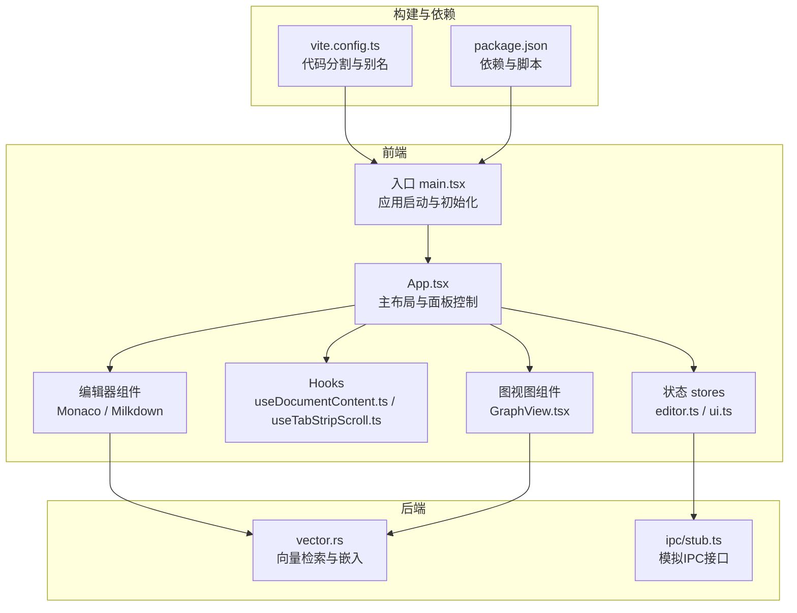
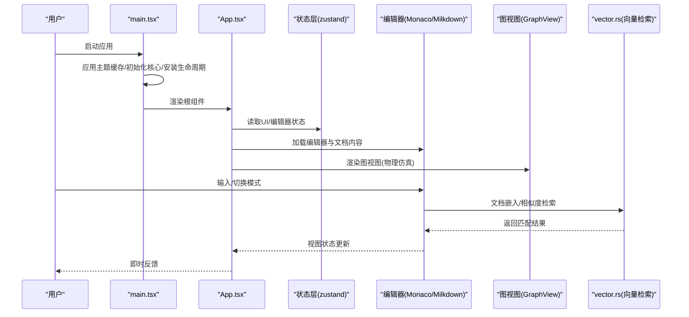
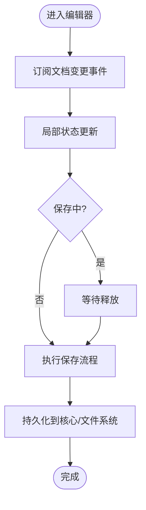
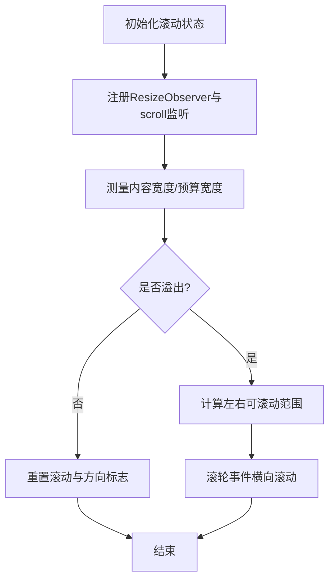
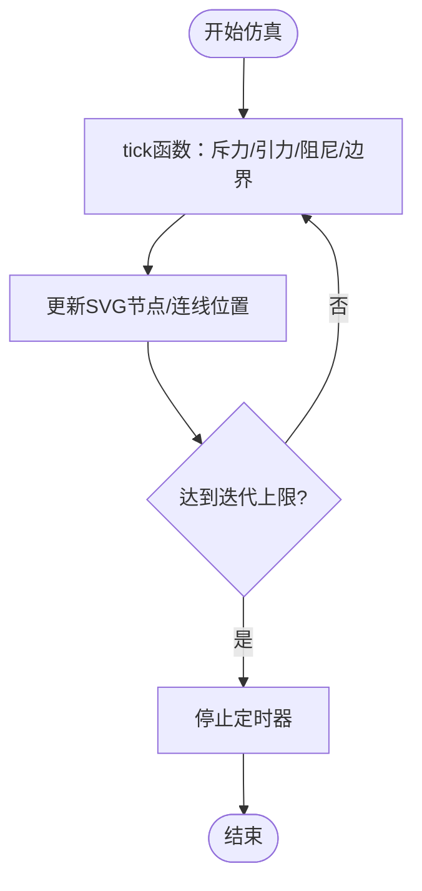
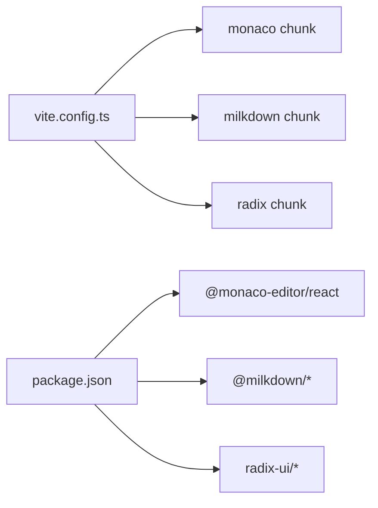

# 性能优化指南

<cite>
**本文引用的文件**
- [src/main.tsx](file://src/main.tsx)
- [src/App.tsx](file://src/App.tsx)
- [vite.config.ts](file://vite.config.ts)
- [package.json](file://package.json)
- [src/store/editor.ts](file://src/store/editor.ts)
- [src/store/ui.ts](file://src/store/ui.ts)
- [src/lib/theme-cache.ts](file://src/lib/theme-cache.ts)
- [src/lib/app-lifecycle.ts](file://src/lib/app-lifecycle.ts)
- [src/hooks/useDocumentContent.ts](file://src/hooks/useDocumentContent.ts)
- [src/hooks/useTabStripScroll.ts](file://src/hooks/useTabStripScroll.ts)
- [src/features/markdown/MilkdownSurface.tsx](file://src/features/markdown/MilkdownSurface.tsx)
- [src/features/graph/GraphView.tsx](file://src/features/graph/GraphView.tsx)
- [src-tauri/src/vector.rs](file://src-tauri/src/vector.rs)
- [.tmp/system-architecture-design.md](file://.tmp/system-architecture-design.md)
- [src/ipc/stub.ts](file://src/ipc/stub.ts)
</cite>

## 目录
1. [简介](#简介)
2. [项目结构](#项目结构)
3. [核心组件](#核心组件)
4. [架构总览](#架构总览)
5. [详细组件分析](#详细组件分析)
6. [依赖分析](#依赖分析)
7. [性能考虑](#性能考虑)
8. [故障排查指南](#故障排查指南)
9. [结论](#结论)
10. [附录](#附录)

## 简介
本指南面向NoteForge前端与跨端性能优化，聚焦以下方面：
- 前端性能：React组件优化、虚拟滚动与懒加载、状态更新优化
- 内存管理：对象池与缓存、垃圾回收优化、内存泄漏预防
- 渲染性能：Canvas/WebGL与动画调优
- 网络与IPC：缓存策略、批量请求、CDN与本地存储结合
- 数据库与向量检索：索引、查询计划、事务与批量写入
- 大文件处理：分块上传、增量同步、压缩与去重
- 性能监控与指标采集：埋点与可视化

NoteForge采用React + Vite + Tauri架构，前端通过Zustand状态管理，编辑器集成Monaco与Milkdown，后端以Rust + SQLite为主，支持向量检索与嵌入。

## 项目结构
NoteForge采用“前端React + 后端Tauri/Rust”的双端架构。前端通过Vite构建，按依赖拆分代码块；后端负责文件系统、数据库、向量检索等高性能计算。

图表来源
- [src/main.tsx:1-24](file://src/main.tsx#L1-L24)
- [src/App.tsx:25-111](file://src/App.tsx#L25-L111)
- [vite.config.ts:1-42](file://vite.config.ts#L1-L42)
- [package.json:1-70](file://package.json#L1-L70)
- [src/store/editor.ts:1-800](file://src/store/editor.ts#L1-L800)
- [src/store/ui.ts:1-86](file://src/store/ui.ts#L1-L86)
- [src/hooks/useDocumentContent.ts:1-47](file://src/hooks/useDocumentContent.ts#L1-L47)
- [src/hooks/useTabStripScroll.ts:44-134](file://src/hooks/useTabStripScroll.ts#L44-L134)
- [src/features/markdown/MilkdownSurface.tsx:99-119](file://src/features/markdown/MilkdownSurface.tsx#L99-L119)
- [src/features/graph/GraphView.tsx:35-146](file://src/features/graph/GraphView.tsx#L35-L146)
- [src-tauri/src/vector.rs:44-128](file://src-tauri/src/vector.rs#L44-L128)
- [src/ipc/stub.ts:305-348](file://src/ipc/stub.ts#L305-L348)

章节来源
- [src/main.tsx:1-24](file://src/main.tsx#L1-L24)
- [vite.config.ts:1-42](file://vite.config.ts#L1-L42)
- [package.json:1-70](file://package.json#L1-L70)

## 核心组件
- 应用入口与生命周期
  - 启动顺序：主题缓存应用 → 核心初始化 → 生命周期安装 → 引导完成 → 渲染根组件
  - 生命周期：桌面端通过Tauri窗口关闭事件拦截退出流程，确保数据持久化
- 状态层
  - 编辑器状态：标签页、活动面板、草稿保存、会话持久化、内容变更队列
  - UI状态：侧边栏/右侧面板开关与尺寸、对话框状态、引导标记
- Hooks
  - useDocumentContent：订阅文档变更事件，仅在目标文档变化时触发重渲染
  - useTabStripScroll：带被动监听与ResizeObserver的标签栏滚动控制，避免主线程阻塞

章节来源
- [src/main.tsx:12-24](file://src/main.tsx#L12-L24)
- [src/lib/app-lifecycle.ts:13-31](file://src/lib/app-lifecycle.ts#L13-L31)
- [src/store/editor.ts:281-800](file://src/store/editor.ts#L281-L800)
- [src/store/ui.ts:39-86](file://src/store/ui.ts#L39-L86)
- [src/hooks/useDocumentContent.ts:8-25](file://src/hooks/useDocumentContent.ts#L8-L25)
- [src/hooks/useTabStripScroll.ts:67-134](file://src/hooks/useTabStripScroll.ts#L67-L134)

## 架构总览
NoteForge的性能关键路径包括：启动阶段的资源预热、编辑器渲染与状态同步、图视图物理仿真、向量检索与数据库交互。

图表来源
- [src/main.tsx:12-24](file://src/main.tsx#L12-L24)
- [src/App.tsx:25-111](file://src/App.tsx#L25-L111)
- [src/store/editor.ts:281-800](file://src/store/editor.ts#L281-L800)
- [src/features/graph/GraphView.tsx:120-146](file://src/features/graph/GraphView.tsx#L120-L146)
- [src-tauri/src/vector.rs:57-118](file://src-tauri/src/vector.rs#L57-L118)

## 详细组件分析

### 组件A：编辑器与文档状态（React + Zustand）
- 优化要点
  - 使用useDocumentContent基于事件总线订阅特定文档，避免全局状态风暴
  - 编辑器状态通过Zustand切片化管理，减少无关重渲染
  - 保存流程加锁(saveTabInFlight)，防止并发写入导致的竞态
  - 标签页关闭队列与应用退出队列分离，保证退出前的数据落盘
- 性能影响
  - 事件驱动的局部更新降低渲染成本
  - 批量关闭与持久化调度减少IO抖动
- 可扩展建议
  - 对频繁变更的字段使用浅比较或自定义selector
  - 将草稿保存与工作区草稿保存拆分为独立任务队列

图表来源
- [src/hooks/useDocumentContent.ts:8-25](file://src/hooks/useDocumentContent.ts#L8-L25)
- [src/store/editor.ts:495-582](file://src/store/editor.ts#L495-L582)
- [src/store/editor.ts:129-183](file://src/store/editor.ts#L129-L183)

章节来源
- [src/hooks/useDocumentContent.ts:1-47](file://src/hooks/useDocumentContent.ts#L1-L47)
- [src/store/editor.ts:117-183](file://src/store/editor.ts#L117-L183)
- [src/store/editor.ts:495-582](file://src/store/editor.ts#L495-L582)

### 组件B：标签栏滚动与布局（被动监听与ResizeObserver）
- 优化要点
  - 使用passive: true的scroll监听，避免主线程阻塞
  - ResizeObserver观测滚动容器、工具栏与子元素，动态计算溢出与滚动边界
  - 平滑滚动与滚轮横向滚动适配，提升可用性
- 性能影响
  - 被动监听显著降低滚动卡顿
  - 微任务队列更新布局，避免强制同步布局
- 可扩展建议
  - 对超长列表采用虚拟滚动替换真实DOM节点
  - 将滚动位置与可见区域映射为索引区间，减少DOM查询

图表来源
- [src/hooks/useTabStripScroll.ts:67-134](file://src/hooks/useTabStripScroll.ts#L67-L134)

章节来源
- [src/hooks/useTabStripScroll.ts:44-134](file://src/hooks/useTabStripScroll.ts#L44-L134)

### 组件C：图视图物理仿真（Canvas/动画）
- 优化要点
  - 物理仿真在每帧对节点施加斥力、引力、阻尼与边界约束
  - 使用定时器驱动迭代，将变换直接写入DOM属性，减少中间状态
  - 限制最大迭代次数，避免长时间占用主线程
- 性能影响
  - 帧内DOM写入可能引发回流，建议改用CSS变换或WebGL
  - 迭代上限有助于稳定帧率
- 可扩展建议
  - 将节点/边数据迁移至WebGL绘制，利用GPU加速
  - 使用requestAnimationFrame与时间片控制，避免长任务

图表来源
- [src/features/graph/GraphView.tsx:35-79](file://src/features/graph/GraphView.tsx#L35-L79)
- [src/features/graph/GraphView.tsx:120-146](file://src/features/graph/GraphView.tsx#L120-L146)

章节来源
- [src/features/graph/GraphView.tsx:35-146](file://src/features/graph/GraphView.tsx#L35-L146)

### 组件D：主题与启动（首屏与主题缓存）
- 优化要点
  - 在首次渲染前应用主题类，避免FOUC
  - 主题模式持久化于localStorage，启动时快速恢复
- 性能影响
  - 首屏无闪烁，提升感知速度
- 可扩展建议
  - 将主题切换与系统偏好联动，减少用户操作

章节来源
- [src/lib/theme-cache.ts:40-46](file://src/lib/theme-cache.ts#L40-L46)
- [src/main.tsx:12-13](file://src/main.tsx#L12-L13)

### 组件E：应用生命周期（桌面端退出保护）
- 优化要点
  - 拦截窗口关闭事件，统一执行草稿保存、会话持久化与数据刷新
- 性能影响
  - 避免数据丢失与二次IO，提升稳定性
- 可扩展建议
  - 将退出流程异步化，显示进度条或最小化到托盘

章节来源
- [src/lib/app-lifecycle.ts:13-31](file://src/lib/app-lifecycle.ts#L13-L31)
- [src/store/editor.ts:412-440](file://src/store/editor.ts#L412-L440)

## 依赖分析
- 代码分割策略
  - 将monaco-editor、@milkdown系列与radix-ui组件分别打包为独立chunk，降低首屏体积
  - 通过manualChunks配置，平衡缓存命中与并行下载
- 依赖与版本
  - React 18、Zustand、Monaco、Milkdown、Radix UI等均为性能关键依赖
- 影响
  - 合理的chunk划分可缩短TTFB与首屏渲染时间

图表来源
- [vite.config.ts:26-38](file://vite.config.ts#L26-L38)
- [package.json:17-48](file://package.json#L17-L48)

章节来源
- [vite.config.ts:1-42](file://vite.config.ts#L1-L42)
- [package.json:1-70](file://package.json#L1-L70)

## 性能考虑

### 前端性能优化策略
- React组件优化
  - 使用事件驱动的局部订阅（如useDocumentContent），避免全局状态风暴
  - 切片化Zustand状态，减少无关重渲染
  - 对高频更新的字段使用浅比较或自定义selector
- 虚拟滚动与懒加载
  - 标签栏已采用被动监听与微任务更新；对长列表建议引入虚拟滚动库
  - 编辑器面板按需渲染，避免一次性挂载大量组件
- 状态更新优化
  - 保存流程加锁与队列化（关闭标签队列、应用退出队列）降低并发风险
  - 将草稿保存与会话持久化拆分为独立任务，避免阻塞UI

章节来源
- [src/hooks/useDocumentContent.ts:8-25](file://src/hooks/useDocumentContent.ts#L8-L25)
- [src/store/editor.ts:117-183](file://src/store/editor.ts#L117-L183)
- [src/hooks/useTabStripScroll.ts:67-134](file://src/hooks/useTabStripScroll.ts#L67-L134)

### 内存管理最佳实践
- 对象池与缓存
  - 使用Zustand缓存轻量UI状态；对昂贵对象（如编辑器实例）采用懒创建与复用
- 垃圾回收优化
  - 及时移除事件监听与ResizeObserver回调，避免闭包持有
  - 在组件卸载时清理定时器与订阅
- 内存泄漏预防
  - 确保所有订阅在useEffect返回函数中注销
  - 避免在回调中持有对DOM或组件实例的强引用

章节来源
- [src/hooks/useTabStripScroll.ts:82-85](file://src/hooks/useTabStripScroll.ts#L82-L85)
- [src/App.tsx:52-56](file://src/App.tsx#L52-L56)

### 渲染性能优化
- Canvas/WebGL与动画
  - 图视图当前通过DOM写入位置，建议迁移到WebGL或CSS变换
  - 使用requestAnimationFrame与时间片控制，避免长任务
- 动画性能调优
  - 减少强制同步布局，优先使用transform与opacity
  - 控制帧率与迭代上限，避免主线程过载

章节来源
- [src/features/graph/GraphView.tsx:120-146](file://src/features/graph/GraphView.tsx#L120-L146)

### 网络请求与IPC优化
- 缓存策略
  - 本地文件系统与IPC层采用延迟写入与批处理，减少频繁IO
- 批量请求
  - 关闭标签与应用退出采用队列化处理，合并持久化操作
- CDN与静态资源
  - 通过Vite的chunk拆分与浏览器缓存机制提升资源复用

章节来源
- [src/store/editor.ts:129-183](file://src/store/editor.ts#L129-L183)
- [vite.config.ts:26-38](file://vite.config.ts#L26-L38)

### 数据库查询优化
- 索引使用
  - 设计文档与记忆体表时建立必要索引（如agent_id、type、importance）
- 查询计划分析
  - 对向量检索采用内存扫描与相似度排序，生产环境建议引入专用向量数据库
- 事务优化
  - 批量写入时使用事务，减少磁盘写入次数

章节来源
- [.tmp/system-architecture-design.md:498-542](file://.tmp/system-architecture-design.md#L498-L542)
- [src-tauri/src/vector.rs:47-55](file://src-tauri/src/vector.rs#L47-L55)
- [src-tauri/src/vector.rs:71-118](file://src-tauri/src/vector.rs#L71-L118)

### 大文件处理优化
- 分块上传与增量同步
  - 文件系统接口支持创建/删除/遍历，建议在上层封装分块与断点续传
- 压缩与去重
  - 对重复内容进行哈希校验与去重存储，减少磁盘占用

章节来源
- [src/ipc/stub.ts:327-348](file://src/ipc/stub.ts#L327-L348)

### 性能监控与指标收集
- 建议
  - 在关键路径埋点：启动耗时、首屏渲染、编辑器输入延迟、图视图帧率
  - 使用Performance API与自定义指标上报，结合日志与错误追踪

[本节为通用指导，不直接分析具体文件]

## 故障排查指南
- 编辑器保存失败或卡顿
  - 检查saveTabInFlight状态与并发保存逻辑
  - 确认DocumentService的保存流程未被阻塞
- 标签栏滚动异常
  - 确认passive监听与ResizeObserver正确注册与注销
  - 检查容器宽度与子元素测量逻辑
- 图视图卡顿
  - 检查tick迭代次数与DOM写入频率
  - 考虑迁移到WebGL或使用transform
- 退出时数据丢失
  - 确认Tauri关闭事件拦截与requestAppExit流程执行

章节来源
- [src/store/editor.ts:495-582](file://src/store/editor.ts#L495-L582)
- [src/hooks/useTabStripScroll.ts:67-134](file://src/hooks/useTabStripScroll.ts#L67-L134)
- [src/features/graph/GraphView.tsx:120-146](file://src/features/graph/GraphView.tsx#L120-L146)
- [src/lib/app-lifecycle.ts:19-31](file://src/lib/app-lifecycle.ts#L19-L31)

## 结论
NoteForge在启动、状态管理与编辑器渲染方面已具备良好的性能基础。后续可在以下方向持续优化：引入虚拟滚动、将图视图迁移到WebGL、完善向量检索的向量化与索引、加强性能埋点与指标可视化，以及在桌面端提供更友好的退出体验与数据保护。

[本节为总结，不直接分析具体文件]

## 附录
- 快速检查清单
  - 是否使用事件驱动的局部订阅？
  - 是否对高频滚动与动画使用被动监听与时间片控制？
  - 是否对昂贵操作进行批处理与队列化？
  - 是否在组件卸载时清理所有监听与定时器？

[本节为通用指导，不直接分析具体文件]