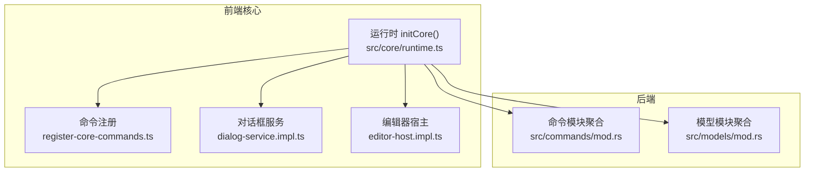
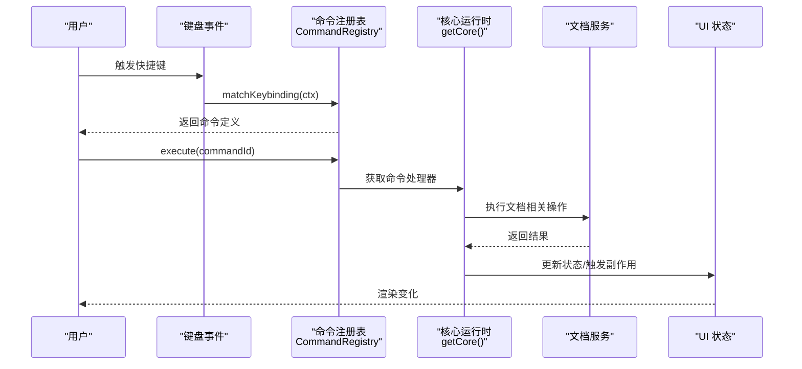
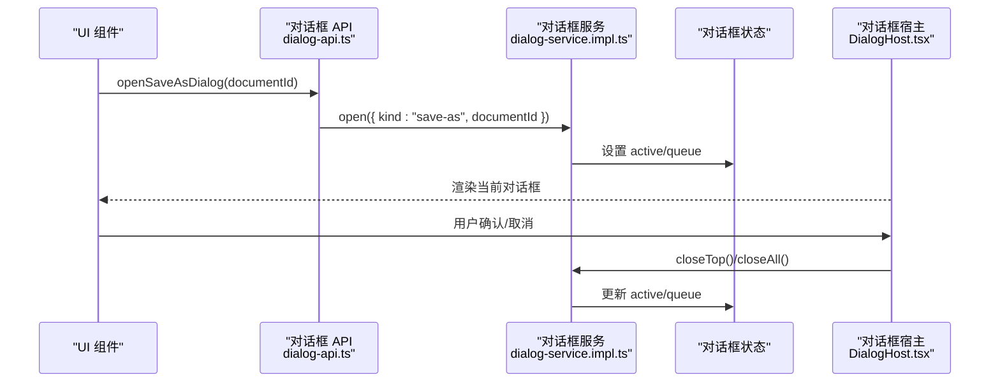
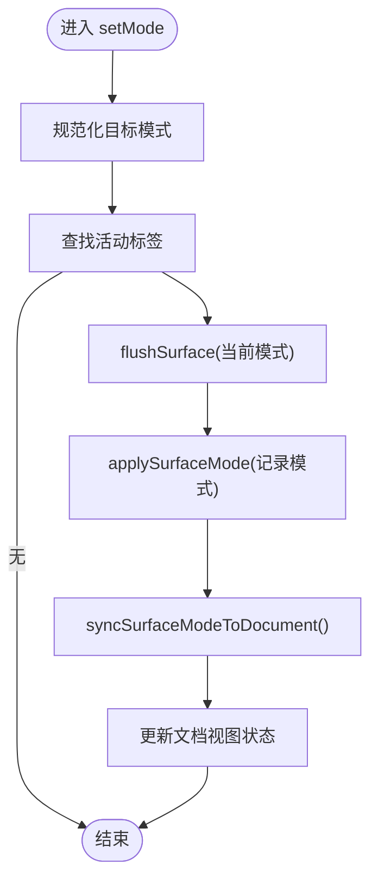
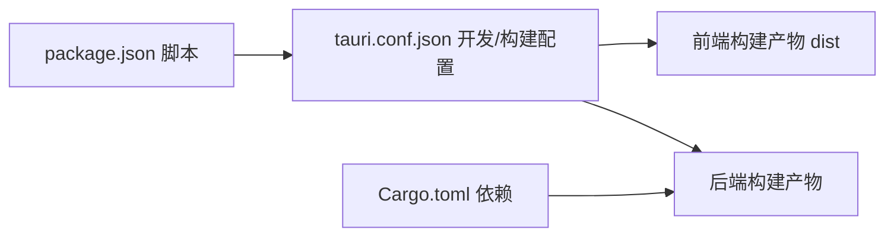

# 扩展开发指南

<cite>
**本文档引用的文件**
- [README.md](file://README.md)
- [package.json](file://package.json)
- [src-tauri/Cargo.toml](file://src-tauri/Cargo.toml)
- [src-tauri/tauri.conf.json](file://src-tauri/tauri.conf.json)
- [src/main.tsx](file://src/main.tsx)
- [src/App.tsx](file://src/App.tsx)
- [src/core/runtime.ts](file://src/core/runtime.ts)
- [src/core/command/types.ts](file://src/core/command/types.ts)
- [src/core/command/register-core-commands.ts](file://src/core/command/register-core-commands.ts)
- [src/core/dialog/types.ts](file://src/core/dialog/types.ts)
- [src/core/dialog/dialog-service.impl.ts](file://src/core/dialog/dialog-service.impl.ts)
- [src/core/dialog/dialog-api.ts](file://src/core/dialog/dialog-api.ts)
- [src/components/dialogs/DialogHost.tsx](file://src/components/dialogs/DialogHost.tsx)
- [src/core/editor/editor-host.impl.ts](file://src/core/editor/editor-host.impl.ts)
- [src/core/editor/types.ts](file://src/core/editor/types.ts)
- [src/store/editor.ts](file://src/store/editor.ts)
- [src-tauri/src/commands/mod.rs](file://src-tauri/src/commands/mod.rs)
- [src-tauri/src/models/mod.rs](file://src-tauri/src/models/mod.rs)
</cite>

## 目录
1. [简介](#简介)
2. [项目结构](#项目结构)
3. [核心组件](#核心组件)
4. [架构总览](#架构总览)
5. [详细组件分析](#详细组件分析)
6. [依赖关系分析](#依赖关系分析)
7. [性能考虑](#性能考虑)
8. [故障排查指南](#故障排查指南)
9. [结论](#结论)
10. [附录](#附录)

## 简介
本指南面向希望为 NoteForge 进行扩展开发的工程师，涵盖以下主题：
- 如何添加新功能模块：命令注册、对话框系统扩展、编辑器功能增强
- 组件扩展方法：自定义 UI 组件开发、主题系统扩展、插件架构理解
- 第三方服务集成：API 接入、认证处理、数据同步
- 后端服务扩展：新增 Tauri 命令、数据库模型扩展、文件系统操作
- 现有组件修改的安全方法：向后兼容性保证、破坏性变更处理
- 扩展测试策略与发布流程
- 实际扩展示例与模板代码路径

## 项目结构
NoteForge 采用前后端分离的桌面应用架构：
- 前端基于 React 18 + TypeScript，使用 Zustand 管理状态，UI 采用 Radix UI + Tailwind CSS
- 后端基于 Tauri v2 + Rust，提供 IPC 命令、SQLite 数据库、文件系统与加密能力
- 核心运行时负责装配各子系统（文档、工作台、命令、对话框、知识图谱、编辑器宿主）

```mermaid
graph TB
subgraph "前端"
A["React 应用<br/>src/main.tsx, src/App.tsx"]
B["核心运行时<br/>src/core/runtime.ts"]
C["命令系统<br/>src/core/command/*"]
D["对话框系统<br/>src/core/dialog/*"]
E["编辑器宿主<br/>src/core/editor/*"]
F["状态管理<br/>src/store/editor.ts"]
end
subgraph "后端"
G["Tauri 配置<br/>src-tauri/tauri.conf.json"]
H["Cargo 依赖<br/>src-tauri/Cargo.toml"]
I["命令模块<br/>src-tauri/src/commands/*"]
J["模型模块<br/>src-tauri/src/models/*"]
end
A --> B
B --> C
B --> D
B --> E
B --> F
A <- --> G
H --> I
H --> J
```

图表来源
- [src/main.tsx:1-24](file://src/main.tsx#L1-L24)
- [src/App.tsx:1-111](file://src/App.tsx#L1-L111)
- [src/core/runtime.ts:1-191](file://src/core/runtime.ts#L1-L191)
- [src-tauri/tauri.conf.json:1-40](file://src-tauri/tauri.conf.json#L1-L40)
- [src-tauri/Cargo.toml:1-40](file://src-tauri/Cargo.toml#L1-L40)

章节来源
- [README.md:75-112](file://README.md#L75-L112)
- [package.json:1-70](file://package.json#L1-L70)
- [src-tauri/Cargo.toml:1-40](file://src-tauri/Cargo.toml#L1-L40)
- [src-tauri/tauri.conf.json:1-40](file://src-tauri/tauri.conf.json#L1-L40)

## 核心组件
- 核心运行时：统一初始化与装配文档、工作台、命令、对话框、知识图谱、编辑器宿主等子系统，并订阅事件驱动行为
- 命令系统：集中注册命令、快捷键绑定、上下文判断与执行
- 对话框系统：统一的对话框请求、队列与渲染宿主
- 编辑器宿主：表面模式切换、视图状态同步、内容补丁应用
- 状态管理：编辑器标签页、分屏、光标状态、草稿自动保存等

章节来源
- [src/core/runtime.ts:29-100](file://src/core/runtime.ts#L29-L100)
- [src/core/command/types.ts:1-63](file://src/core/command/types.ts#L1-L63)
- [src/core/dialog/types.ts:1-22](file://src/core/dialog/types.ts#L1-L22)
- [src/core/editor/types.ts:1-66](file://src/core/editor/types.ts#L1-L66)
- [src/store/editor.ts:65-115](file://src/store/editor.ts#L65-L115)

## 架构总览
NoteForge 的扩展点主要集中在前端核心运行时与后端 Tauri 命令模块。前端通过运行时装配各子系统，后端通过命令模块暴露 IPC 能力。



图表来源
- [src/core/runtime.ts:43-100](file://src/core/runtime.ts#L43-L100)
- [src/core/command/register-core-commands.ts:11-201](file://src/core/command/register-core-commands.ts#L11-L201)
- [src/core/dialog/dialog-service.impl.ts:10-58](file://src/core/dialog/dialog-service.impl.ts#L10-L58)
- [src/core/editor/editor-host.impl.ts:14-99](file://src/core/editor/editor-host.impl.ts#L14-L99)
- [src-tauri/src/commands/mod.rs:1-13](file://src-tauri/src/commands/mod.rs#L1-L13)
- [src-tauri/src/models/mod.rs:1-28](file://src-tauri/src/models/mod.rs#L1-L28)

## 详细组件分析

### 命令系统扩展
命令系统采用“注册—匹配—执行”的统一路径，支持快捷键、命令面板与菜单调用。扩展步骤：
1. 在命令注册处新增命令定义，设置 id、title、category、keybindings、enabled 与 run
2. 在命令上下文中根据需要读取活动文档、标签、表面模式等
3. run 中通过核心运行时访问文档、工作台、对话框等服务



图表来源
- [src/core/command/types.ts:29-45](file://src/core/command/types.ts#L29-L45)
- [src/core/command/register-core-commands.ts:11-201](file://src/core/command/register-core-commands.ts#L11-L201)
- [src/core/runtime.ts:58-64](file://src/core/runtime.ts#L58-L64)

章节来源
- [src/core/command/types.ts:1-63](file://src/core/command/types.ts#L1-L63)
- [src/core/command/register-core-commands.ts:11-201](file://src/core/command/register-core-commands.ts#L11-L201)

### 对话框系统扩展
对话框系统通过请求对象与服务队列实现串行化交互，支持冲突处理、保存提示、删除确认等场景。扩展步骤：
1. 在对话框 API 中新增请求函数，调用核心运行时的 dialog.open
2. 在对话框服务中处理队列逻辑，避免并发冲突
3. 在对话框宿主中新增对应视图组件，处理用户交互与回调



图表来源
- [src/core/dialog/dialog-api.ts:1-33](file://src/core/dialog/dialog-api.ts#L1-L33)
- [src/core/dialog/dialog-service.impl.ts:10-58](file://src/core/dialog/dialog-service.impl.ts#L10-L58)
- [src/core/dialog/types.ts:6-13](file://src/core/dialog/types.ts#L6-L13)
- [src/components/dialogs/DialogHost.tsx:25-48](file://src/components/dialogs/DialogHost.tsx#L25-L48)

章节来源
- [src/core/dialog/dialog-api.ts:1-33](file://src/core/dialog/dialog-api.ts#L1-L33)
- [src/core/dialog/dialog-service.impl.ts:10-58](file://src/core/dialog/dialog-service.impl.ts#L10-L58)
- [src/core/dialog/types.ts:1-22](file://src/core/dialog/types.ts#L1-L22)
- [src/components/dialogs/DialogHost.tsx:139-216](file://src/components/dialogs/DialogHost.tsx#L139-L216)

### 编辑器功能增强
编辑器宿主负责表面模式切换、视图状态同步与内容补丁应用。扩展步骤：
1. 在编辑器宿主中注册表面适配器或 LiveSurfaceHandle
2. 切换模式时确保 flush 当前表面的未提交编辑
3. 将补丁应用到文档服务，并同步视图状态



图表来源
- [src/core/editor/editor-host.impl.ts:41-53](file://src/core/editor/editor-host.impl.ts#L41-L53)
- [src/core/editor/editor-host.impl.ts:55-74](file://src/core/editor/editor-host.impl.ts#L55-L74)
- [src/core/editor/types.ts:40-53](file://src/core/editor/types.ts#L40-L53)

章节来源
- [src/core/editor/editor-host.impl.ts:14-99](file://src/core/editor/editor-host.impl.ts#L14-L99)
- [src/core/editor/types.ts:1-66](file://src/core/editor/types.ts#L1-L66)
- [src/store/editor.ts:594-601](file://src/store/editor.ts#L594-L601)

### 插件架构理解
- 前端通过运行时装配各子系统，形成松耦合的插件式结构
- 命令、对话框、编辑器宿主均通过统一接口注入与使用
- 后端命令模块按功能域划分，便于扩展与维护

章节来源
- [src/core/runtime.ts:29-38](file://src/core/runtime.ts#L29-L38)
- [src-tauri/src/commands/mod.rs:1-13](file://src-tauri/src/commands/mod.rs#L1-L13)
- [src-tauri/src/models/mod.rs:1-28](file://src-tauri/src/models/mod.rs#L1-L28)

### 主题系统扩展
- 应用启动时应用缓存主题，可通过扩展主题配置与缓存机制实现动态主题切换
- 建议在运行时初始化阶段注入主题服务，并与 UI 状态联动

章节来源
- [src/main.tsx:4-15](file://src/main.tsx#L4-L15)

### 第三方服务集成指南
- 认证处理：建议在后端命令中封装第三方 API 调用，对敏感信息进行加密存储
- 数据同步：通过文档服务与工作台会话持久化，结合事件总线实现增量同步
- API 接入：在命令模块中新增对应命令，返回结构化结果供前端消费

章节来源
- [README.md:134-137](file://README.md#L134-L137)
- [src-tauri/Cargo.toml:22-26](file://src-tauri/Cargo.toml#L22-L26)

### 后端服务扩展
- 新增 Tauri 命令：在命令模块中新增子模块与导出，在前端通过 IPC 调用
- 数据库模型扩展：在模型模块中新增对应实体，配合仓库层实现 CRUD
- 文件系统操作：利用后端提供的文件读写与监控能力，确保线程安全与错误处理

章节来源
- [src-tauri/src/commands/mod.rs:1-13](file://src-tauri/src/commands/mod.rs#L1-L13)
- [src-tauri/src/models/mod.rs:1-28](file://src-tauri/src/models/mod.rs#L1-L28)
- [src-tauri/Cargo.toml:20-21](file://src-tauri/Cargo.toml#L20-L21)

## 依赖关系分析
前端与后端通过 Tauri 配置建立开发与构建关联，前端脚本与后端依赖共同构成完整的开发环境。



图表来源
- [package.json:7-16](file://package.json#L7-L16)
- [src-tauri/tauri.conf.json:6-11](file://src-tauri/tauri.conf.json#L6-L11)
- [src-tauri/Cargo.toml:7-32](file://src-tauri/Cargo.toml#L7-L32)

章节来源
- [package.json:1-70](file://package.json#L1-L70)
- [src-tauri/tauri.conf.json:1-40](file://src-tauri/tauri.conf.json#L1-L40)
- [src-tauri/Cargo.toml:1-40](file://src-tauri/Cargo.toml#L1-L40)

## 性能考虑
- 命令执行与对话框队列应避免阻塞主线程，必要时使用微任务或异步处理
- 编辑器表面切换时及时 flush，减少补丁堆积导致的同步延迟
- 文件系统操作与数据库事务尽量批量处理，降低 I/O 压力

## 故障排查指南
- 命令未响应：检查命令注册与快捷键上下文条件，确认命令在当前上下文中 enabled
- 对话框卡住：检查对话框服务队列长度与 active 状态，确保 closeTop/closeAll 正确调用
- 编辑器模式切换异常：确认 flushSurface 是否成功，文档视图状态是否正确更新
- 后端命令失败：查看后端日志与错误类型，确保 IPC 参数与返回值结构一致

章节来源
- [src/core/dialog/dialog-service.impl.ts:34-54](file://src/core/dialog/dialog-service.impl.ts#L34-L54)
- [src/core/editor/editor-host.impl.ts:26-39](file://src/core/editor/editor-host.impl.ts#L26-L39)
- [src/store/editor.ts:129-183](file://src/store/editor.ts#L129-L183)

## 结论
通过以上扩展点与最佳实践，开发者可以在保持向后兼容的前提下，安全地为 NoteForge 添加新功能模块、增强编辑器体验、集成第三方服务并扩展后端能力。建议在每次变更前评估影响范围，编写单元与集成测试，并遵循破坏性变更的版本策略。

## 附录

### 扩展测试策略
- 前端：针对命令执行、对话框队列、编辑器模式切换编写单元测试；使用集成测试验证 IPC 流程
- 后端：针对命令模块与模型层编写单元测试，使用集成测试验证数据库与文件系统操作
- 发布流程：在 CI 中执行类型检查、构建与测试，生成可复现的安装包

章节来源
- [README.md:42-59](file://README.md#L42-L59)
- [package.json:8-16](file://package.json#L8-L16)

### 发布流程
- 开发模式：pnpm tauri:dev
- 生产构建：pnpm tauri:build
- 预览构建：pnpm preview

章节来源
- [README.md:42-59](file://README.md#L42-L59)

### 实际扩展示例与模板代码路径
- 新增命令示例：参考命令注册与上下文判断
  - [src/core/command/register-core-commands.ts:11-201](file://src/core/command/register-core-commands.ts#L11-L201)
  - [src/core/command/types.ts:12-21](file://src/core/command/types.ts#L12-L21)
- 新增对话框示例：参考对话框 API、服务与宿主
  - [src/core/dialog/dialog-api.ts:1-33](file://src/core/dialog/dialog-api.ts#L1-L33)
  - [src/core/dialog/dialog-service.impl.ts:10-58](file://src/core/dialog/dialog-service.impl.ts#L10-L58)
  - [src/components/dialogs/DialogHost.tsx:25-48](file://src/components/dialogs/DialogHost.tsx#L25-L48)
- 编辑器表面扩展：参考编辑器宿主与类型定义
  - [src/core/editor/editor-host.impl.ts:14-99](file://src/core/editor/editor-host.impl.ts#L14-L99)
  - [src/core/editor/types.ts:15-38](file://src/core/editor/types.ts#L15-L38)
- 后端命令与模型扩展：参考模块聚合与依赖声明
  - [src-tauri/src/commands/mod.rs:1-13](file://src-tauri/src/commands/mod.rs#L1-L13)
  - [src-tauri/src/models/mod.rs:1-28](file://src-tauri/src/models/mod.rs#L1-L28)
  - [src-tauri/Cargo.toml:7-32](file://src-tauri/Cargo.toml#L7-L32)