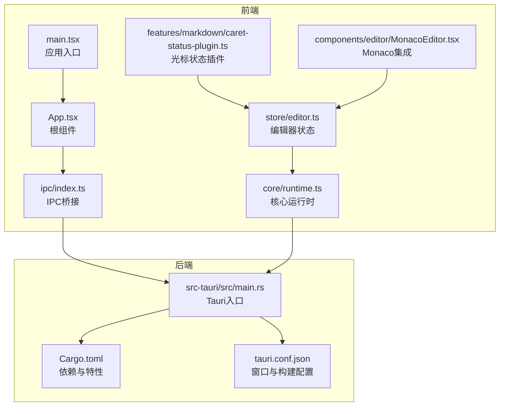
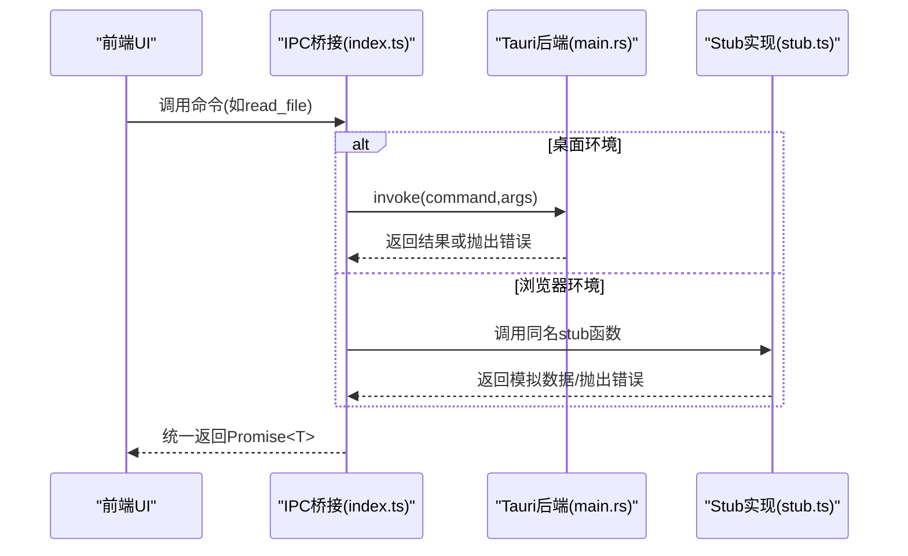
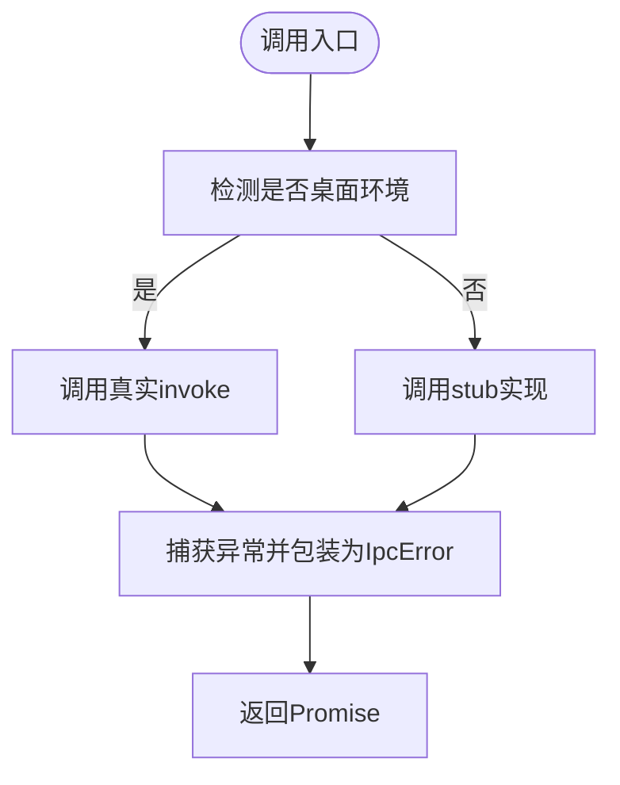
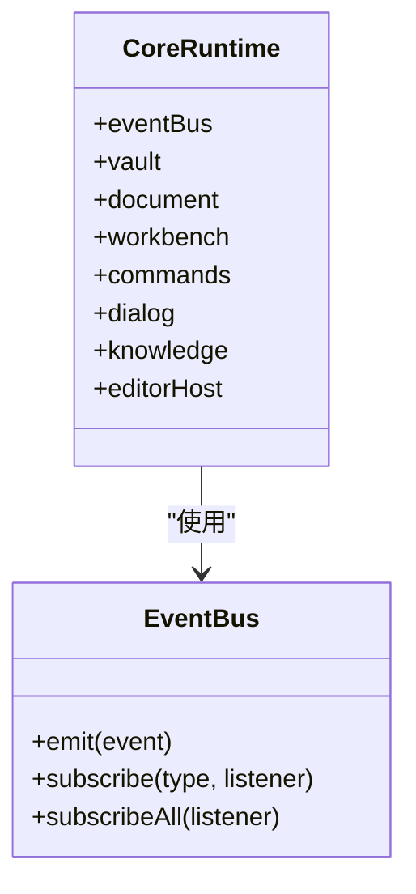
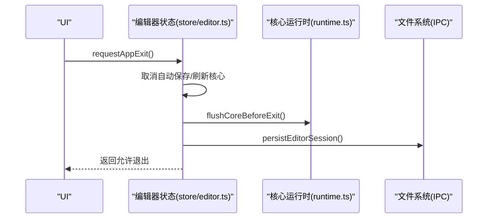
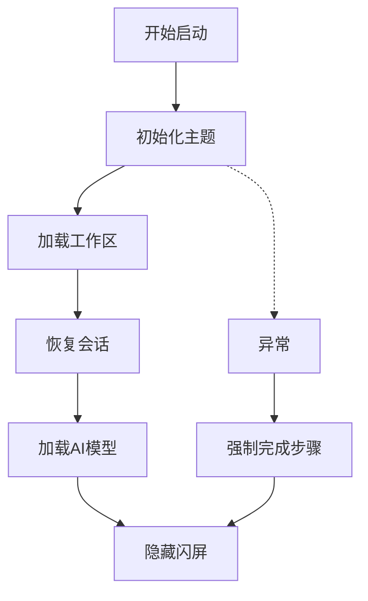
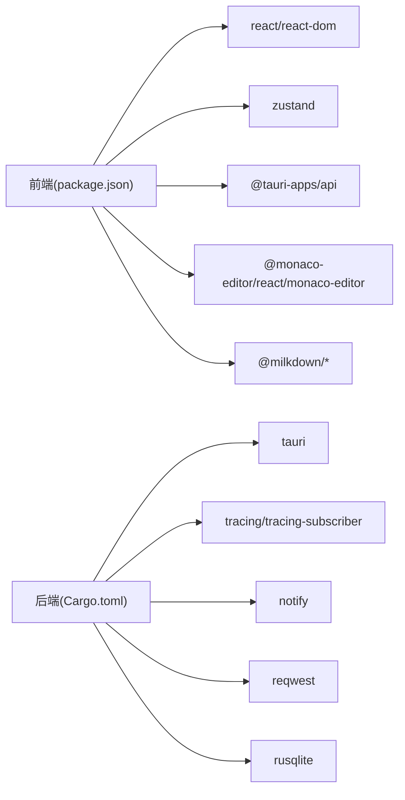

# 调试与故障排除

<cite>
**本文引用的文件**
- [src/main.tsx](file://src/main.tsx)
- [src/App.tsx](file://src/App.tsx)
- [src/ipc/index.ts](file://src/ipc/index.ts)
- [src/ipc/stub.ts](file://src/ipc/stub.ts)
- [src-tauri/src/main.rs](file://src-tauri/src/main.rs)
- [src-tauri/Cargo.toml](file://src-tauri/Cargo.toml)
- [src-tauri/tauri.conf.json](file://src-tauri/tauri.conf.json)
- [src/lib/app-startup.ts](file://src/lib/app-startup.ts)
- [src/lib/app-lifecycle.ts](file://src/lib/app-lifecycle.ts)
- [src/store/editor.ts](file://src/store/editor.ts)
- [src/core/runtime.ts](file://src/core/runtime.ts)
- [src/core/platform/event-bus.ts](file://src/core/platform/event-bus.ts)
- [src/features/markdown/caret-status-plugin.ts](file://src/features/markdown/caret-status-plugin.ts)
- [src/components/editor/MonacoEditor.tsx](file://src/components/editor/MonacoEditor.tsx)
- [src/types.ts](file://src/types.ts)
- [package.json](file://package.json)
</cite>

## 目录
1. [简介](#简介)
2. [项目结构](#项目结构)
3. [核心组件](#核心组件)
4. [架构总览](#架构总览)
5. [详细组件分析](#详细组件分析)
6. [依赖关系分析](#依赖关系分析)
7. [性能考量](#性能考量)
8. [故障排除指南](#故障排除指南)
9. [结论](#结论)
10. [附录](#附录)

## 简介
本指南面向NoteForge的前端与后端工程师，提供系统化的调试与故障排除方法，覆盖以下方面：
- 前端调试：React DevTools、状态管理调试、浏览器开发者工具高级用法
- 后端调试：Rust调试器、日志配置、错误追踪
- IPC通信诊断：消息传递验证、类型检查、异步错误处理
- 常见问题排查：应用启动失败、编辑器异常、知识图谱渲染问题
- 性能分析：内存泄漏检测、渲染性能监控、网络请求分析
- 生产应急：问题定位流程与回滚策略

## 项目结构
NoteForge采用前端Vite + React + Zustand，后端Tauri v2 + Rust的混合架构。前端通过统一的IPC桥接层与后端命令交互；后端以事件总线为核心协调各子系统。

图表来源
- [src/main.tsx:1-24](file://src/main.tsx#L1-L24)
- [src/App.tsx:1-111](file://src/App.tsx#L1-L111)
- [src/ipc/index.ts:1-489](file://src/ipc/index.ts#L1-L489)
- [src/core/runtime.ts:1-191](file://src/core/runtime.ts#L1-L191)
- [src-tauri/src/main.rs:1-101](file://src-tauri/src/main.rs#L1-L101)
- [src-tauri/Cargo.toml:1-40](file://src-tauri/Cargo.toml#L1-L40)
- [src-tauri/tauri.conf.json:1-40](file://src-tauri/tauri.conf.json#L1-L40)

章节来源
- [src/main.tsx:1-24](file://src/main.tsx#L1-L24)
- [src/App.tsx:1-111](file://src/App.tsx#L1-L111)
- [src/ipc/index.ts:1-489](file://src/ipc/index.ts#L1-L489)
- [src/core/runtime.ts:1-191](file://src/core/runtime.ts#L1-L191)
- [src-tauri/src/main.rs:1-101](file://src-tauri/src/main.rs#L1-L101)
- [src-tauri/Cargo.toml:1-40](file://src-tauri/Cargo.toml#L1-L40)
- [src-tauri/tauri.conf.json:1-40](file://src-tauri/tauri.conf.json#L1-L40)

## 核心组件
- IPC桥接层：封装isTauri判断、真实invoke与stub代理，统一命令调用与错误包装
- 核心运行时：事件总线、文档/工作台/知识/编辑器宿主等子系统的装配与调度
- 编辑器状态：Zustand状态管理，包含标签页、面板布局、保存/关闭队列、退出流程
- 启动流程：主题→工作区→会话恢复的顺序化启动与闪屏控制
- 生命周期：桌面窗口关闭请求拦截与应用退出流程
- 错误模型：IpcError统一错误码与详情

章节来源
- [src/ipc/index.ts:59-83](file://src/ipc/index.ts#L59-L83)
- [src/core/runtime.ts:29-99](file://src/core/runtime.ts#L29-L99)
- [src/store/editor.ts:281-440](file://src/store/editor.ts#L281-L440)
- [src/lib/app-startup.ts:32-74](file://src/lib/app-startup.ts#L32-L74)
- [src/lib/app-lifecycle.ts:13-30](file://src/lib/app-lifecycle.ts#L13-L30)
- [src/types.ts:378-388](file://src/types.ts#L378-L388)

## 架构总览
NoteForge的前端通过IPC桥接层调用后端命令，后端在main.rs中注册所有命令处理器，并在运行期通过事件总线驱动内部协作。开发态下，IPC桥接层可切换至stub实现，保证UI自测与离线开发。

图表来源
- [src/ipc/index.ts:66-83](file://src/ipc/index.ts#L66-L83)
- [src-tauri/src/main.rs:19-97](file://src-tauri/src/main.rs#L19-L97)
- [src/ipc/stub.ts:283-298](file://src/ipc/stub.ts#L283-L298)

章节来源
- [src/ipc/index.ts:1-489](file://src/ipc/index.ts#L1-L489)
- [src-tauri/src/main.rs:1-101](file://src-tauri/src/main.rs#L1-L101)
- [src/ipc/stub.ts:1-800](file://src/ipc/stub.ts#L1-L800)

## 详细组件分析

### 组件A：IPC桥接与错误模型
- 统一入口：isTauri判断决定invoke或stub路径
- 错误包装：IpcError承载错误码与细节，便于前端分类处理
- 类型映射：后端DTO到前端类型的转换函数，确保契约一致

图表来源
- [src/ipc/index.ts:59-83](file://src/ipc/index.ts#L59-L83)
- [src/types.ts:378-388](file://src/types.ts#L378-L388)

章节来源
- [src/ipc/index.ts:12-83](file://src/ipc/index.ts#L12-L83)
- [src/types.ts:333-388](file://src/types.ts#L333-L388)

### 组件B：核心运行时与事件总线
- 初始化：创建事件总线、文档/工作台/知识/编辑器宿主等服务
- 事件订阅：文档变更、冲突、关闭等事件驱动持久化与UI同步
- 关闭流程：取消待定自动保存，刷新核心状态，持久化会话

图表来源
- [src/core/runtime.ts:29-99](file://src/core/runtime.ts#L29-L99)
- [src/core/platform/event-bus.ts:3-36](file://src/core/platform/event-bus.ts#L3-L36)

章节来源
- [src/core/runtime.ts:1-191](file://src/core/runtime.ts#L1-L191)
- [src/core/platform/event-bus.ts:1-36](file://src/core/platform/event-bus.ts#L1-L36)

### 组件C：编辑器状态与生命周期
- 标签页与面板：多面板、标签页克隆与移动、去重逻辑
- 关闭队列：脏文件弹窗确认、分组关闭、应用退出时的批量处理
- 退出流程：取消自动保存、刷新核心、持久化会话、允许/阻止退出
- 光标状态：Monaco与Milkdown分别上报光标位置与选区统计

图表来源
- [src/store/editor.ts:429-440](file://src/store/editor.ts#L429-L440)
- [src/core/runtime.ts:174-182](file://src/core/runtime.ts#L174-L182)

章节来源
- [src/store/editor.ts:129-183](file://src/store/editor.ts#L129-L183)
- [src/store/editor.ts:412-440](file://src/store/editor.ts#L412-L440)
- [src/features/markdown/caret-status-plugin.ts:13-49](file://src/features/markdown/caret-status-plugin.ts#L13-L49)
- [src/components/editor/MonacoEditor.tsx:191-214](file://src/components/editor/MonacoEditor.tsx#L191-L214)

### 组件D：启动流程与闪屏
- 启动步骤：主题→工作区→会话恢复，逐步完成并推进进度
- 闪屏控制：最小显示时间与淡出动画，保证用户体验
- 异常兜底：启动失败时强制完成步骤并隐藏闪屏

图表来源
- [src/lib/app-startup.ts:32-74](file://src/lib/app-startup.ts#L32-L74)

章节来源
- [src/lib/app-startup.ts:1-75](file://src/lib/app-startup.ts#L1-L75)

## 依赖关系分析
- 前端依赖：React、Zustand、@tauri-apps/api、Monaco、Milkdown等
- 后端依赖：tauri、tracing/tracing-subscriber、notify、reqwest、rusqlite等
- 构建与打包：Vite、Tailwind、ESLint/Prettier

图表来源
- [package.json:17-68](file://package.json#L17-L68)
- [src-tauri/Cargo.toml:7-32](file://src-tauri/Cargo.toml#L7-L32)

章节来源
- [package.json:1-70](file://package.json#L1-L70)
- [src-tauri/Cargo.toml:1-40](file://src-tauri/Cargo.toml#L1-L40)

## 性能考量
- 渲染性能
  - 使用React.StrictMode与轻量级状态拆分，避免不必要重渲染
  - 将大列表虚拟化，减少DOM节点数量
- 内存与GC
  - 避免在状态中存放大型对象快照，优先使用引用或惰性加载
  - 在关闭标签页/面板时及时清理监听器与定时器
- 网络与IPC
  - 合理批处理请求，合并频繁调用
  - 对长耗时操作使用后台线程或分片处理
- 日志与追踪
  - 后端启用tracing-subscriber，前端可通过浏览器开发者工具观察IPC调用频率与耗时

[本节为通用指导，无需特定文件来源]

## 故障排除指南

### 前端调试技巧
- React DevTools
  - 使用组件树查看props与state变化，定位渲染热点
  - 利用“Highlight Updates”识别不必要的重渲染
- Redux DevTools（Zustand）
  - 使用Zustand DevTools扩展记录动作与状态快照，回放历史变更
- 浏览器开发者工具高级用法
  - Network面板：观察IPC调用耗时、失败率与重试行为
  - Performance面板：录制交互过程，分析主线程阻塞点
  - Memory面板：Heap Snapshot对比，定位内存泄漏（注意清理事件监听与定时器）

章节来源
- [src/store/editor.ts:281-440](file://src/store/editor.ts#L281-L440)
- [src/ipc/index.ts:66-83](file://src/ipc/index.ts#L66-L83)

### 后端调试方法
- Rust调试器
  - 使用LLDB/GDB或IDE断点，设置断点于命令处理器入口
  - 观察数据库事务、文件系统操作与外部API调用
- 日志配置
  - 后端已启用tracing-subscriber，可在main.rs中调整级别
  - 前端通过浏览器控制台查看IPC错误与异常堆栈
- 错误追踪
  - IpcError携带错误码，前端据此进行降级或提示
  - 后端命令返回统一错误类型，便于统一处理

章节来源
- [src-tauri/src/main.rs:4](file://src-tauri/src/main.rs#L4)
- [src/types.ts:378-388](file://src/types.ts#L378-L388)

### IPC通信诊断
- 消息传递验证
  - 在IPC桥接层添加调用日志，记录command、args与返回值
  - 对比前后端命令签名，确保字段命名一致（camelCase）
- 类型检查
  - 严格校验请求/响应DTO，避免字段缺失导致的序列化失败
  - 使用stub实现进行契约测试，保证前端类型与后端结构一致
- 异步错误处理
  - 包装IpcError，区分业务错误与未知错误
  - 在前端捕获Promise拒绝，统一转化为用户可理解的提示

章节来源
- [src/ipc/index.ts:86-88](file://src/ipc/index.ts#L86-L88)
- [src/ipc/stub.ts:283-298](file://src/ipc/stub.ts#L283-L298)
- [src/types.ts:333-388](file://src/types.ts#L333-L388)

### 常见问题排查流程
- 应用启动失败
  - 检查启动步骤：主题→工作区→会话恢复
  - 若失败，确认是否强制完成步骤并隐藏闪屏
  - 查看控制台错误与IPC调用失败原因
- 编辑器异常
  - 关闭队列：确认脏文件是否正确触发保存/放弃
  - 退出流程：检查是否取消自动保存、刷新核心与持久化会话
  - 光标状态：Monaco与Milkdown插件是否正常上报
- 知识图谱渲染问题
  - 检查get_knowledge_graph返回节点/边数量与格式
  - 确认extractLinks/extractTags是否正确解析内容
  - 对比后端索引进度与前端展示延迟

章节来源
- [src/lib/app-startup.ts:64-71](file://src/lib/app-startup.ts#L64-L71)
- [src/store/editor.ts:129-183](file://src/store/editor.ts#L129-L183)
- [src/store/editor.ts:412-440](file://src/store/editor.ts#L412-L440)
- [src/features/markdown/caret-status-plugin.ts:13-49](file://src/features/markdown/caret-status-plugin.ts#L13-L49)
- [src/components/editor/MonacoEditor.tsx:191-214](file://src/components/editor/MonacoEditor.tsx#L191-L214)
- [src/ipc/index.ts:323-331](file://src/ipc/index.ts#L323-L331)
- [src/ipc/index.ts:332-344](file://src/ipc/index.ts#L332-L344)

### 性能分析工具使用
- 内存泄漏检测
  - 使用浏览器Memory面板进行Heap Snapshot对比
  - 关注事件监听器、定时器、闭包引用与未释放的Monaco实例
- 渲染性能监控
  - 使用Performance面板录制交互，关注长任务与布局抖动
  - 优化Zustand状态粒度，减少无关订阅
- 网络请求分析
  - 使用Network面板观察IPC调用次数与耗时
  - 对高频请求进行节流/防抖或缓存

章节来源
- [src/store/editor.ts:281-440](file://src/store/editor.ts#L281-L440)
- [src/components/editor/MonacoEditor.tsx:191-214](file://src/components/editor/MonacoEditor.tsx#L191-L214)

### 生产环境应急处理与回滚策略
- 应急处理
  - 快速定位：收集错误码、堆栈与最近一次IPC调用
  - 降级方案：禁用高风险功能（如AI服务）、回退到stub模式
  - 限流与熔断：对失败率高的命令增加重试上限与退避
- 回滚策略
  - 版本回退：保留上一个稳定版本的安装包与配置
  - 数据备份：导出当前工作区配置与会话快照
  - 渐进式发布：灰度发布新版本，监控关键指标（启动时间、IPC失败率）

[本节为通用指导，无需特定文件来源]

## 结论
通过统一的IPC桥接层、事件驱动的核心运行时与完善的错误模型，NoteForge在开发与生产环境中均具备良好的可观测性与可调试性。建议团队在日常开发中：
- 严格遵循IPC契约与类型定义
- 使用Zustand DevTools与浏览器性能工具进行持续优化
- 在后端启用结构化日志，配合前端错误聚合
- 建立自动化契约测试，保障前后端一致性

[本节为总结，无需特定文件来源]

## 附录
- 开发与构建脚本：参见package.json中的scripts字段
- 窗口与安全策略：参见tauri.conf.json中的app.security与windows配置

章节来源
- [package.json:7-16](file://package.json#L7-L16)
- [src-tauri/tauri.conf.json:27-29](file://src-tauri/tauri.conf.json#L27-L29)
- [src-tauri/tauri.conf.json:12-26](file://src-tauri/tauri.conf.json#L12-L26)