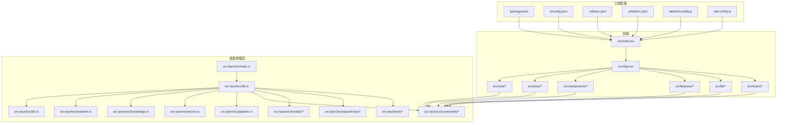
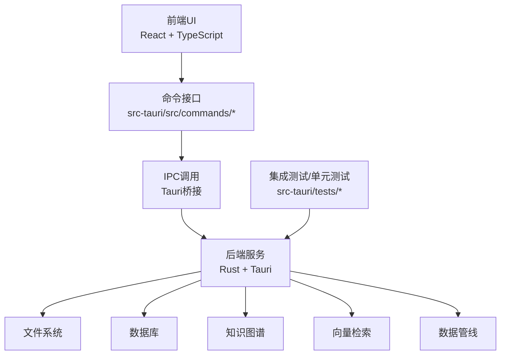
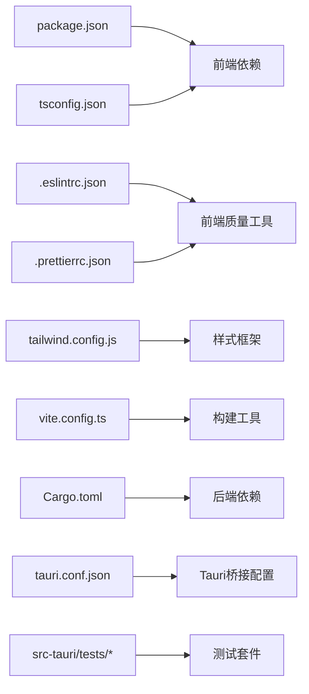

# 贡献流程与协作

<cite>
**本文引用的文件**
- [README.md](file://README.md)
- [package.json](file://package.json)
- [.gitignore](file://.gitignore)
- [.eslintrc.json](file://.eslintrc.json)
- [.prettierrc.json](file://.prettierrc.json)
- [tailwind.config.js](file://tailwind.config.js)
- [tsconfig.json](file://tsconfig.json)
- [vite.config.ts](file://vite.config.ts)
- [src/main.tsx](file://src/main.tsx)
- [src/App.tsx](file://src/App.tsx)
- [src/core/index.ts](file://src/core/index.ts)
- [src/core/runtime.ts](file://src/core/runtime.ts)
- [src/core/events.ts](file://src/core/events.ts)
- [src/core/invariants.ts](file://src/core/invariants.ts)
- [src/store/workspace.ts](file://src/store/workspace.ts)
- [src/store/theme.ts](file://src/store/theme.ts)
- [src/store/ui.ts](file://src/store/ui.ts)
- [src/features/welcome/WelcomeView.tsx](file://src/features/welcome/WelcomeView.tsx)
- [src/components/editor/MonacoEditor.tsx](file://src/components/editor/MonacoEditor.tsx)
- [src/components/editor/StatusBar.tsx](file://src/components/editor/StatusBar.tsx)
- [src/components/sidebar/FileTree.tsx](file://src/components/sidebar/FileTree.tsx)
- [src/components/right/RightPanel.tsx](file://src/components/right/RightPanel.tsx)
- [src/lib/utils.ts](file://src/lib/utils.ts)
- [src/lib/front-matter.ts](file://src/lib/front-matter.ts)
- [src/lib/markdown-front-matter.ts](file://src/lib/markdown-front-matter.ts)
- [src/lib/wiki-resolve.ts](file://src/lib/wiki-resolve.ts)
- [src/lib/yaml-location.ts](file://src/lib/yaml-location.ts)
- [src/lib/json-location.ts](file://src/lib/json-location.ts)
- [src/hooks/useShortcuts.ts](file://src/hooks/useShortcuts.ts)
- [src/hooks/useFileDrop.ts](file://src/hooks/useFileDrop.ts)
- [src/hooks/useTabStripScroll.ts](file://src/hooks/useTabStripScroll.ts)
- [src-tauri/Cargo.toml](file://src-tauri/Cargo.toml)
- [src-tauri/tauri.conf.json](file://src-tauri/tauri.conf.json)
- [src-tauri/src/main.rs](file://src-tauri/src/main.rs)
- [src-tauri/src/lib.rs](file://src-tauri/src/lib.rs)
- [src-tauri/src/db.rs](file://src-tauri/src/db.rs)
- [src-tauri/src/watcher.rs](file://src-tauri/src/watcher.rs)
- [src-tauri/src/knowledge.rs](file://src-tauri/src/knowledge.rs)
- [src-tauri/src/vector.rs](file://src-tauri/src/vector.rs)
- [src-tauri/src/pipeline.rs](file://src-tauri/src/pipeline.rs)
- [src-tauri/src/error.rs](file://src-tauri/src/error.rs)
- [src-tauri/src/models/mod.rs](file://src-tauri/src/models/mod.rs)
- [src-tauri/src/repositories/note_repo.rs](file://src-tauri/src/repositories/note_repo.rs)
- [src-tauri/src/repositories/tag_repo.rs](file://src-tauri/src/repositories/tag_repo.rs)
- [src-tauri/src/repositories/link_repo.rs](file://src-tauri/src/repositories/link_repo.rs)
- [src-tauri/src/repositories/embedding_repo.rs](file://src-tauri/src/repositories/embedding_repo.rs)
- [src-tauri/src/repositories/workspace_repo.rs](file://src-tauri/src/repositories/workspace_repo.rs)
- [src-tauri/src/commands/mod.rs](file://src-tauri/src/commands/mod.rs)
- [src-tauri/src/commands/file.rs](file://src-tauri/src/commands/file.rs)
- [src-tauri/src/commands/search.rs](file://src-tauri/src/commands/search.rs)
- [src-tauri/src/commands/workbench_session.rs](file://src-tauri/src/commands/workbench_session.rs)
- [src-tauri/src/commands/workspace.rs](file://src-tauri/src/commands/workspace.rs)
- [src-tauri/src/commands/memory.rs](file://src-tauri/src/commands/memory.rs)
- [src-tauri/src/commands/knowledge.rs](file://src-tauri/src/commands/knowledge.rs)
- [src-tauri/src/commands/editor.rs](file://src-tauri/src/commands/editor.rs)
- [src-tauri/src/commands/ai.rs](file://src-tauri/src/commands/ai.rs)
- [src-tauri/src/commands/config.rs](file://src-tauri/src/commands/config.rs)
- [src-tauri/src/commands/encryption.rs](file://src-tauri/src/commands/encryption.rs)
- [src-tauri/src/commands/scratch.rs](file://src-tauri/src/commands/scratch.rs)
- [src-tauri/src/commands/workspace_draft.rs](file://src-tauri/src/commands/workspace_draft.rs)
- [src-tauri/tests/integration_test.rs](file://src-tauri/tests/integration_test.rs)
- [src-tauri/tests/ipc_contract_tests.rs](file://src-tauri/tests/ipc_contract_tests.rs)
- [src-tauri/tests/dataflow_tests.rs](file://src-tauri/tests/dataflow_tests.rs)
- [docs/design/README.md](file://docs/design/README.md)
- [docs/design/01-design-system.md](file://docs/design/01-design-system.md)
- [docs/design/02-workspace.md](file://docs/design/02-workspace.md)
- [docs/design/03-file-browser-editor.md](file://docs/design/03-file-browser-editor.md)
- [docs/design/04-search.md](file://docs/design/04-search.md)
- [docs/design/05-knowledge-graph.md](file://docs/design/05-knowledge-graph.md)
- [docs/design/06-ai-qa.md](file://docs/design/06-ai-qa.md)
- [docs/design/07-agent-memory.md](file://docs/design/07-agent-memory.md)
- [docs/design/08-settings.md](file://docs/design/08-settings.md)
</cite>

## 目录
1. [引言](#引言)
2. [项目结构](#项目结构)
3. [核心组件](#核心组件)
4. [架构总览](#架构总览)
5. [详细组件分析](#详细组件分析)
6. [依赖关系分析](#依赖关系分析)
7. [性能考虑](#性能考虑)
8. [故障排查指南](#故障排查指南)
9. [结论](#结论)
10. [附录](#附录)

## 引言
本指南面向所有希望参与NoteForge开发的贡献者，系统性地定义了从分支管理、提交信息到代码审查、问题跟踪与文档协作的完整流程规范。NoteForge采用前端React/Vite + 后端Tauri/Rust的技术栈，围绕“知识型笔记与智能编辑”的目标构建。为确保协作高效、可追溯、可维护，本文档在不泄露具体实现细节的前提下，给出可操作的流程与最佳实践。

## 项目结构
NoteForge采用前后端分离的多模块组织方式：
- 前端（src/）：React + TypeScript，包含核心运行时、状态管理、UI组件、功能特性等。
- 桌面桥接层（src-tauri/）：Rust Tauri应用，负责系统能力、文件系统访问、数据库、向量检索、AI命令等。
- 文档设计（docs/design/）：产品与技术设计文档集合。
- 工程配置：包管理、构建、样式、类型与ESLint/Prettier等质量工具配置。

图表来源
- [src/main.tsx](file://src/main.tsx)
- [src/App.tsx](file://src/App.tsx)
- [src/core/index.ts](file://src/core/index.ts)
- [src-tauri/src/main.rs](file://src-tauri/src/main.rs)
- [src-tauri/src/lib.rs](file://src-tauri/src/lib.rs)
- [package.json](file://package.json)
- [tsconfig.json](file://tsconfig.json)
- [vite.config.ts](file://vite.config.ts)

章节来源
- [README.md](file://README.md)
- [package.json](file://package.json)
- [tsconfig.json](file://tsconfig.json)
- [vite.config.ts](file://vite.config.ts)

## 核心组件
- 前端核心（src/core）：运行时、事件系统、不变量与约束、桥接层集成等。
- 状态与工作区（src/store）：工作区、主题、UI状态等。
- 组件与特性（src/components、src/features）：编辑器、侧边栏、右侧面板、Markdown渲染、AI面板等。
- 工具与钩子（src/lib、src/hooks）：通用工具、Front Matter解析、Wiki链接解析、拖拽与快捷键等。
- 桌面桥接层（src-tauri）：数据库、文件监听、知识图谱、向量检索、命令接口、模型与仓库等。

章节来源
- [src/core/index.ts](file://src/core/index.ts)
- [src/core/runtime.ts](file://src/core/runtime.ts)
- [src/core/events.ts](file://src/core/events.ts)
- [src/core/invariants.ts](file://src/core/invariants.ts)
- [src/store/workspace.ts](file://src/store/workspace.ts)
- [src/store/theme.ts](file://src/store/theme.ts)
- [src/store/ui.ts](file://src/store/ui.ts)
- [src/components/editor/MonacoEditor.tsx](file://src/components/editor/MonacoEditor.tsx)
- [src/components/editor/StatusBar.tsx](file://src/components/editor/StatusBar.tsx)
- [src/components/sidebar/FileTree.tsx](file://src/components/sidebar/FileTree.tsx)
- [src/components/right/RightPanel.tsx](file://src/components/right/RightPanel.tsx)
- [src/lib/utils.ts](file://src/lib/utils.ts)
- [src/lib/front-matter.ts](file://src/lib/front-matter.ts)
- [src/lib/markdown-front-matter.ts](file://src/lib/markdown-front-matter.ts)
- [src/lib/wiki-resolve.ts](file://src/lib/wiki-resolve.ts)
- [src/lib/yaml-location.ts](file://src/lib/yaml-location.ts)
- [src/lib/json-location.ts](file://src/lib/json-location.ts)
- [src/hooks/useShortcuts.ts](file://src/hooks/useShortcuts.ts)
- [src/hooks/useFileDrop.ts](file://src/hooks/useFileDrop.ts)
- [src/hooks/useTabStripScroll.ts](file://src/hooks/useTabStripScroll.ts)
- [src-tauri/src/db.rs](file://src-tauri/src/db.rs)
- [src-tauri/src/watcher.rs](file://src-tauri/src/watcher.rs)
- [src-tauri/src/knowledge.rs](file://src-tauri/src/knowledge.rs)
- [src-tauri/src/vector.rs](file://src-tauri/src/vector.rs)
- [src-tauri/src/pipeline.rs](file://src-tauri/src/pipeline.rs)
- [src-tauri/src/commands/mod.rs](file://src-tauri/src/commands/mod.rs)
- [src-tauri/src/models/mod.rs](file://src-tauri/src/models/mod.rs)
- [src-tauri/src/repositories/note_repo.rs](file://src-tauri/src/repositories/note_repo.rs)
- [src-tauri/src/repositories/tag_repo.rs](file://src-tauri/src/repositories/tag_repo.rs)
- [src-tauri/src/repositories/link_repo.rs](file://src-tauri/src/repositories/link_repo.rs)
- [src-tauri/src/repositories/embedding_repo.rs](file://src-tauri/src/repositories/embedding_repo.rs)
- [src-tauri/src/repositories/workspace_repo.rs](file://src-tauri/src/repositories/workspace_repo.rs)

## 架构总览
NoteForge采用“前端React + Tauri桥接”的双层架构。前端通过命令接口与后端通信，后端负责文件系统、数据库、向量检索与知识图谱等底层能力。测试覆盖前端与后端，确保数据流与IPC契约稳定。

图表来源
- [src-tauri/src/commands/mod.rs](file://src-tauri/src/commands/mod.rs)
- [src-tauri/src/main.rs](file://src-tauri/src/main.rs)
- [src-tauri/src/lib.rs](file://src-tauri/src/lib.rs)
- [src-tauri/tests/integration_test.rs](file://src-tauri/tests/integration_test.rs)
- [src-tauri/tests/ipc_contract_tests.rs](file://src-tauri/tests/ipc_contract_tests.rs)
- [src-tauri/tests/dataflow_tests.rs](file://src-tauri/tests/dataflow_tests.rs)

## 详细组件分析

### 分支管理策略
- 主分支（main）保护
  - main分支用于发布稳定版本，禁止直接推送；任何变更必须通过Pull Request合并。
  - 合并前需满足：通过CI检查、至少一名维护者批准、无阻塞冲突。
- 功能分支（feature/*）
  - 命名规范：feature/<简短描述>，如feature/new-editor-toolbar。
  - 建议：每个功能一个分支，保持原子性与可回滚性。
- 修复分支（hotfix/*）
  - 使用场景：紧急修复线上问题，修复后同时合并至main与对应release分支。
  - 命名规范：hotfix/<问题简述>，如hotfix/critical-ui-crash。
- 发布分支（release/*）
  - 用于准备发布的稳定版本，合并完成后打标签并回并至main。

章节来源
- [README.md](file://README.md)

### Pull Request 流程
- 创建分支：基于最新main创建功能或修复分支。
- 提交与校验：本地通过ESLint、Prettier与TypeScript检查；必要时运行测试。
- 描述规范：
  - 标题：简洁明确，体现变更类型与范围。
  - 内容：背景、动机、变更点、影响范围、测试与验证方法。
- 代码审查：
  - 至少一名维护者批准；涉及跨层改动需相关模块负责人审阅。
  - 审查要点：正确性、可维护性、性能、安全性、一致性。
- 合并策略：
  - Squash合并以保持提交历史整洁；Rebase以获得线性历史。
  - 合并后及时删除已合并的分支。

章节来源
- [README.md](file://README.md)
- [.eslintrc.json](file://.eslintrc.json)
- [.prettierrc.json](file://.prettierrc.json)
- [tsconfig.json](file://tsconfig.json)

### 提交信息规范与语义化版本
- 提交信息格式
  - 类型：feat、fix、docs、style、refactor、perf、test、build、ci、chore、revert
  - 范围：可选，如core、editor、store、tauri
  - 描述：简明扼要说明变更内容
  - 示例：feat(core): 新增事件系统扩展点
- 语义化版本（SemVer）
  - 主版本：破坏性变更
  - 次版本：新增兼容功能
  - 修订版本：兼容性修复
  - 预发布：alpha/beta/rc等

章节来源
- [README.md](file://README.md)

### Issue 管理与任务分配
- Issue 类型
  - bug、enhancement、task、question、design
- 标签体系
  - area/*、type/*、priority/*、status/*
- 任务分配
  - Assignees：限定1-2人，避免过度并行
  - Milestone：按迭代规划
  - 优先级：blocker > high > normal > low
- 闭环流程
  - 讨论 -> 分配 -> 开发 -> PR -> 审查 -> 合并 -> 关闭

章节来源
- [README.md](file://README.md)

### 代码审查标准与流程
- 审查清单
  - 正确性：逻辑是否正确，边界条件是否覆盖
  - 可读性：命名、注释、结构清晰
  - 性能：是否存在不必要的开销
  - 安全性：输入校验、权限控制、敏感信息处理
  - 兼容性：对现有API与行为的影响
- 反馈处理
  - 明确、具体、可操作；必要时提供修改示例
  - 修改后重新请求审查
- 合并策略
  - 批准后由维护者执行合并；避免squash导致历史丢失

章节来源
- [README.md](file://README.md)

### 新贡献者入门
- 准备工作
  - Fork仓库并克隆；安装Node.js与Rust工具链；安装依赖。
- 第一次贡献建议
  - 选择good first issue或help wanted标签的任务
  - 在开始前开启Issue讨论方案
- 沟通渠道
  - 使用GitHub Discussions或Issue进行技术讨论
- 社区礼仪
  - 尊重他人意见，保持建设性反馈
  - 遵循审查流程与规范

章节来源
- [README.md](file://README.md)

### 文档贡献与翻译规范
- 文档结构
  - 设计文档位于docs/design/，遵循统一模板与命名
- 翻译规范
  - 保持术语一致；避免直译造成歧义
  - 更新中英文双语索引与导航
- 质量控制
  - 文档变更纳入PR审查；确保与实现同步

章节来源
- [docs/design/README.md](file://docs/design/README.md)
- [docs/design/01-design-system.md](file://docs/design/01-design-system.md)
- [docs/design/02-workspace.md](file://docs/design/02-workspace.md)
- [docs/design/03-file-browser-editor.md](file://docs/design/03-file-browser-editor.md)
- [docs/design/04-search.md](file://docs/design/04-search.md)
- [docs/design/05-knowledge-graph.md](file://docs/design/05-knowledge-graph.md)
- [docs/design/06-ai-qa.md](file://docs/design/06-ai-qa.md)
- [docs/design/07-agent-memory.md](file://docs/design/07-agent-memory.md)
- [docs/design/08-settings.md](file://docs/design/08-settings.md)

## 依赖关系分析
- 前端依赖
  - React、Vite、Tailwind CSS、Monaco Editor等；类型检查与格式化工具贯穿开发流程。
- 后端依赖
  - Rust生态（Tauri、SQLx、tokio、serde等），数据库与向量库作为核心能力。
- 测试依赖
  - 集成测试与IPC契约测试保障前后端交互稳定性。

图表来源
- [package.json](file://package.json)
- [tsconfig.json](file://tsconfig.json)
- [.eslintrc.json](file://.eslintrc.json)
- [.prettierrc.json](file://.prettierrc.json)
- [tailwind.config.js](file://tailwind.config.js)
- [vite.config.ts](file://vite.config.ts)
- [src-tauri/Cargo.toml](file://src-tauri/Cargo.toml)
- [src-tauri/tauri.conf.json](file://src-tauri/tauri.conf.json)
- [src-tauri/tests/integration_test.rs](file://src-tauri/tests/integration_test.rs)
- [src-tauri/tests/ipc_contract_tests.rs](file://src-tauri/tests/ipc_contract_tests.rs)
- [src-tauri/tests/dataflow_tests.rs](file://src-tauri/tests/dataflow_tests.rs)

章节来源
- [package.json](file://package.json)
- [src-tauri/Cargo.toml](file://src-tauri/Cargo.toml)
- [src-tauri/tauri.conf.json](file://src-tauri/tauri.conf.json)

## 性能考虑
- 前端
  - 模块拆分与懒加载，避免单页bundle过大；合理使用缓存与节流。
- 后端
  - 数据库查询优化、批量写入、连接池配置；向量检索与知识图谱查询的索引策略。
- 构建与打包
  - 生产环境启用压缩与Tree Shaking；按需引入样式与字体。

## 故障排查指南
- 本地启动失败
  - 检查Node与Rust版本；清理依赖后重装；确认端口占用。
- 编译错误
  - 运行类型检查与ESLint；修正TS与格式化问题。
- 桌面端异常
  - 查看日志输出；核对Tauri配置；运行集成测试定位问题。
- 测试失败
  - 单独运行失败用例；检查依赖状态；更新快照或契约。

章节来源
- [README.md](file://README.md)
- [src-tauri/tests/integration_test.rs](file://src-tauri/tests/integration_test.rs)
- [src-tauri/tests/ipc_contract_tests.rs](file://src-tauri/tests/ipc_contract_tests.rs)
- [src-tauri/tests/dataflow_tests.rs](file://src-tauri/tests/dataflow_tests.rs)

## 结论
通过规范化的分支与PR流程、严格的代码审查与测试、清晰的Issue与文档协作机制，NoteForge能够持续产出高质量的功能与改进。建议所有贡献者在提交前通读本指南，并在实践中不断优化协作效率与质量。

## 附录
- 快速参考
  - 分支命名：feature/*、hotfix/*、release/*
  - 提交类型：feat、fix、docs、style、refactor、perf、test、build、ci、chore、revert
  - 审查清单：正确性、可读性、性能、安全、兼容性
  - 文档规范：统一模板、术语一致、中英对照