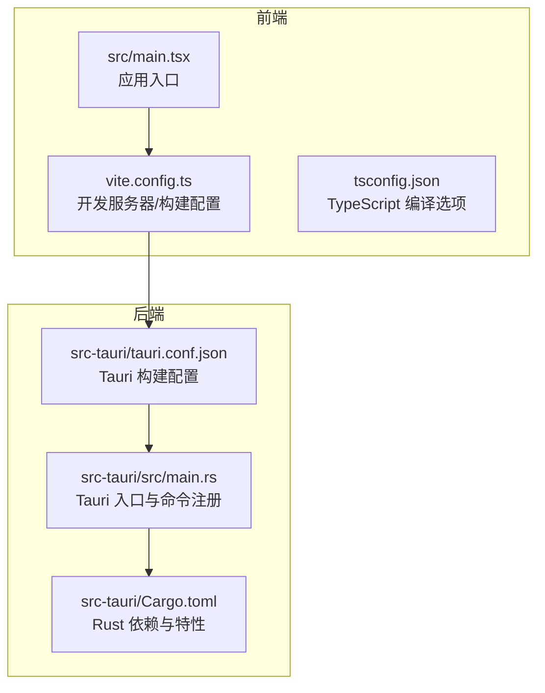
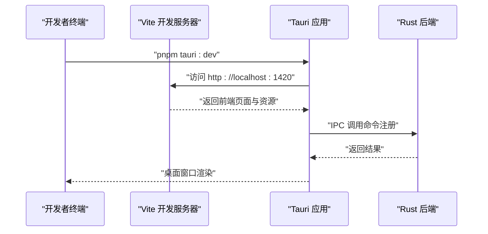
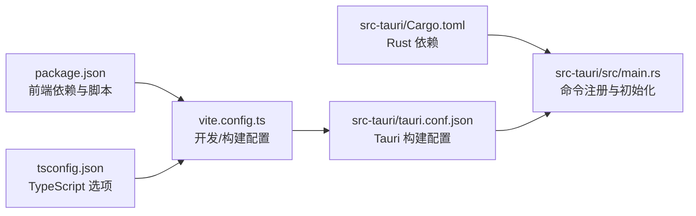

# 快速开始

<cite>
**本文引用的文件**
- [README.md](file://README.md)
- [package.json](file://package.json)
- [vite.config.ts](file://vite.config.ts)
- [tsconfig.json](file://tsconfig.json)
- [src-tauri/Cargo.toml](file://src-tauri/Cargo.toml)
- [src-tauri/tauri.conf.json](file://src-tauri/tauri.conf.json)
- [src-tauri/src/main.rs](file://src-tauri/src/main.rs)
- [src/main.tsx](file://src/main.tsx)
- [src/ipc/stub.ts](file://src/ipc/stub.ts)
- [src/components/dialogs/SettingsDialog.tsx](file://src/components/dialogs/SettingsDialog.tsx)
</cite>

## 目录
1. [简介](#简介)
2. [项目结构](#项目结构)
3. [核心组件](#核心组件)
4. [架构总览](#架构总览)
5. [详细组件分析](#详细组件分析)
6. [依赖分析](#依赖分析)
7. [性能考虑](#性能考虑)
8. [故障排除指南](#故障排除指南)
9. [结论](#结论)
10. [附录](#附录)

## 简介
本指南面向初学者与进阶用户，帮助你在本地快速搭建并运行 NoteForge。你将学到如何准备环境（Node.js、pnpm、Rust 工具链、Tauri CLI），可选地安装 Ollama 本地 AI 服务，完成项目克隆、依赖安装与启动，理解各类 pnpm 脚本的作用，并掌握首次运行后的基础使用方法。

## 项目结构
NoteForge 采用前后端分离架构：
- 前端：React + TypeScript + Vite，负责 UI、编辑器与交互逻辑
- 后端：Rust + Tauri v2，负责系统能力、文件操作、数据库、向量检索、加密与 AI 桥接等
- 构建与打包：Vite + Tauri CLI

图表来源
- [src/main.tsx:1-24](file://src/main.tsx#L1-L24)
- [vite.config.ts:1-42](file://vite.config.ts#L1-L42)
- [tsconfig.json:1-28](file://tsconfig.json#L1-L28)
- [src-tauri/src/main.rs:1-101](file://src-tauri/src/main.rs#L1-L101)
- [src-tauri/Cargo.toml:1-40](file://src-tauri/Cargo.toml#L1-L40)
- [src-tauri/tauri.conf.json:1-40](file://src-tauri/tauri.conf.json#L1-L40)

章节来源
- [README.md:75-112](file://README.md#L75-L112)

## 核心组件
- 前端应用入口与初始化
  - 初始化主题缓存、核心运行时、应用生命周期与引导流程
  - 引入 Monaco 编辑器与全局样式
- Tauri 主进程
  - 注册 49 个 IPC 命令，覆盖工作区、文件、编辑器、知识引擎、Agent 记忆、AI 服务、搜索过滤、加密、系统配置、草稿与会话、文件监听等
  - 在 setup 阶段初始化数据库、配置、临时草稿、工作台会话与工作区草稿
- 构建与开发配置
  - Vite 提供开发服务器与打包，配置了别名、端口、环境变量前缀与手动分包策略
  - Tauri 配置了开发前钩子、构建命令、前端产物目录与窗口参数

章节来源
- [src/main.tsx:1-24](file://src/main.tsx#L1-L24)
- [src-tauri/src/main.rs:1-101](file://src-tauri/src/main.rs#L1-L101)
- [vite.config.ts:1-42](file://vite.config.ts#L1-L42)
- [src-tauri/tauri.conf.json:1-40](file://src-tauri/tauri.conf.json#L1-L40)

## 架构总览
NoteForge 的运行时由前端 React 应用与 Rust 后端共同组成，通过 Tauri 的 IPC 进行通信。开发模式下，前端 Vite 服务器在 127.0.0.1:1420 提供资源；Tauri 作为宿主加载前端产物并在本地系统能力之上运行。

图表来源
- [README.md:32-59](file://README.md#L32-L59)
- [src-tauri/tauri.conf.json:6-11](file://src-tauri/tauri.conf.json#L6-L11)
- [vite.config.ts:13-17](file://vite.config.ts#L13-L17)

## 详细组件分析

### 环境准备与前置依赖
- Node.js：版本要求 >= 18
- 包管理：pnpm（全局安装）
- Rust 工具链：用于编译 Tauri 后端
- Tauri CLI：版本 ^2
- 可选：Ollama（本地 AI 服务，提供 HTTP API）

章节来源
- [README.md:24-30](file://README.md#L24-L30)

### 项目克隆与依赖安装
- 克隆仓库后，在项目根目录执行前端依赖安装
- 如需独立构建后端，可在 src-tauri 目录下使用 Cargo 命令

章节来源
- [README.md:32-40](file://README.md#L32-L40)

### 启动与构建流程
- 开发模式（前端 + 后端）：使用 Tauri 开发命令
- 生产构建：生成可分发的应用包
- 仅构建前端：TypeScript 类型检查 + Vite 构建
- 仅启动前端开发服务器：跳过 Tauri，直接运行 Vite
- 预览构建产物：本地预览生产构建结果

章节来源
- [README.md:42-59](file://README.md#L42-L59)
- [package.json:7-16](file://package.json#L7-L16)

### pnpm 脚本详解
- dev：启动 Vite 前端开发服务器
- build：先进行 TypeScript 检查，再执行 Vite 构建
- preview：预览构建产物
- lint：ESLint 代码质量检查
- format：Prettier 格式化
- tauri:dev：启动 Tauri 开发模式（前端 + 后端）
- tauri:build：生产构建并打包

章节来源
- [README.md:114-125](file://README.md#L114-L125)
- [package.json:7-16](file://package.json#L7-L16)

### Rust 后端命令
- 进入 src-tauri 目录执行 Cargo 构建与测试
- 或在根目录使用 --manifest-path 指定 Cargo.toml 路径执行

章节来源
- [README.md:61-73](file://README.md#L61-L73)
- [src-tauri/Cargo.toml:1-40](file://src-tauri/Cargo.toml#L1-L40)

### 首次运行后的基本使用
- 打开应用后，进入工作区与文件树界面
- 使用顶部工具栏与侧边栏导航
- 在编辑器中编写与格式化内容
- 通过设置对话框选择 AI 提供商与模型（本地 Ollama 或云端 API）
- 使用 AI 面板进行内容优化、摘要生成、标签建议与链接建议等

章节来源
- [src/components/dialogs/SettingsDialog.tsx:63-142](file://src/components/dialogs/SettingsDialog.tsx#L63-L142)
- [src/ipc/stub.ts:881-924](file://src/ipc/stub.ts#L881-L924)

## 依赖分析
- 前端依赖
  - React、Monaco Editor、Milkdown、Radix UI、Tailwind CSS、Zustand 等
  - 通过 Vite 别名 @ 指向 src 目录，便于统一导入
- 后端依赖
  - Tauri v2、SQLite（rusqlite）、fastembed、reqwest、notify、uuid、chrono、AES-GCM 加密等
- 构建与开发
  - Vite + React 插件；TypeScript 编译目标 ES2022；Rollup 手动分包策略优化加载

图表来源
- [package.json:17-68](file://package.json#L17-L68)
- [vite.config.ts:1-42](file://vite.config.ts#L1-L42)
- [tsconfig.json:1-28](file://tsconfig.json#L1-L28)
- [src-tauri/Cargo.toml:7-32](file://src-tauri/Cargo.toml#L7-L32)
- [src-tauri/src/main.rs:19-97](file://src-tauri/src/main.rs#L19-L97)
- [src-tauri/tauri.conf.json:6-11](file://src-tauri/tauri.conf.json#L6-L11)

章节来源
- [package.json:17-68](file://package.json#L17-L68)
- [src-tauri/Cargo.toml:7-32](file://src-tauri/Cargo.toml#L7-L32)
- [vite.config.ts:1-42](file://vite.config.ts#L1-L42)
- [tsconfig.json:1-28](file://tsconfig.json#L1-L28)

## 性能考虑
- Vite 开发服务器默认端口为 1420，严格端口绑定，避免端口冲突
- Rollup 手动分包策略将大型依赖（如 Monaco、Milkdown、Radix UI）拆分为独立 chunk，提升缓存命中率与加载效率
- 构建目标设为 esnext，最小化与源码映射按需启用，平衡体积与调试体验

章节来源
- [vite.config.ts:13-24](file://vite.config.ts#L13-L24)

## 故障排除指南
- 端口占用
  - 现象：开发服务器无法启动或端口被占用
  - 处理：确认 127.0.0.1:1420 未被占用，或调整 vite.config.ts 中的 server.port
- Tauri 开发模式失败
  - 现象：pnpm tauri:dev 启动后无法加载前端资源
  - 处理：检查 tauri.conf.json 中 devUrl 是否与 Vite 端口一致；确认 beforeDevCommand 正确指向 pnpm dev
- Rust 工具链缺失
  - 现象：cargo install tauri-cli 或构建失败
  - 处理：安装 Rust 工具链与 Tauri CLI；在 src-tauri 目录执行 Cargo 命令或使用 --manifest-path 指定路径
- Ollama 连接问题
  - 现象：AI 模型不可用或调用失败
  - 处理：确认 Ollama 服务运行于默认端口；在设置中校验 Ollama 端点；使用 ai.rs 中的连接检测逻辑验证连通性
- 权限与平台限制
  - 现象：应用在特定平台无法运行或功能受限
  - 处理：参考 README 中的最低系统版本要求与平台支持说明

章节来源
- [README.md:126-130](file://README.md#L126-L130)
- [src-tauri/tauri.conf.json:6-11](file://src-tauri/tauri.conf.json#L6-L11)
- [vite.config.ts:13-17](file://vite.config.ts#L13-L17)
- [src-tauri/src/ai.rs:138-157](file://src-tauri/src/ai.rs#L138-L157)

## 结论
通过本快速开始指南，你已了解 NoteForge 的环境准备、安装与启动流程、脚本用途以及常见问题处理方式。建议在完成本地运行后，进一步探索设置对话框中的 AI 配置与编辑器功能，以充分利用本地优先的知识管理与 AI 协作能力。

## 附录

### 常用命令速查
- 安装前端依赖：pnpm install
- 开发模式：pnpm tauri:dev
- 生产构建：pnpm tauri:build
- 仅构建前端：pnpm build
- 仅启动前端开发服务器：pnpm dev
- 预览构建产物：pnpm preview
- Rust 构建/测试（两种方式）：进入 src-tauri 目录执行 Cargo 命令，或在根目录使用 --manifest-path 指定路径

章节来源
- [README.md:32-59](file://README.md#L32-L59)
- [README.md:61-73](file://README.md#L61-L73)
- [package.json:7-16](file://package.json#L7-L16)