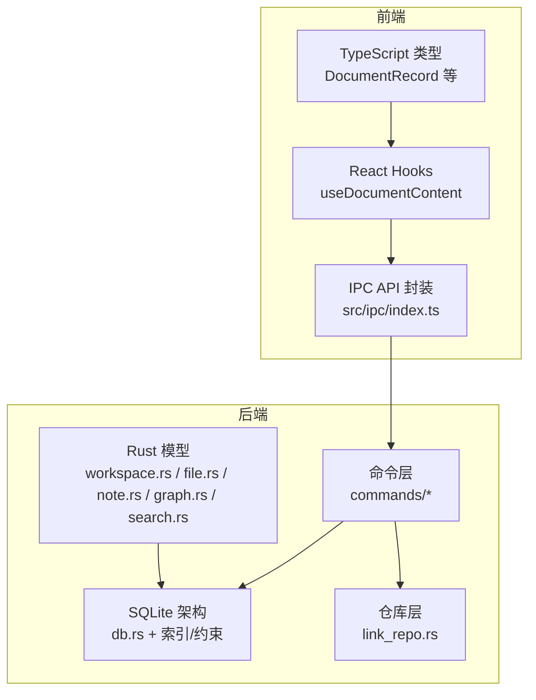
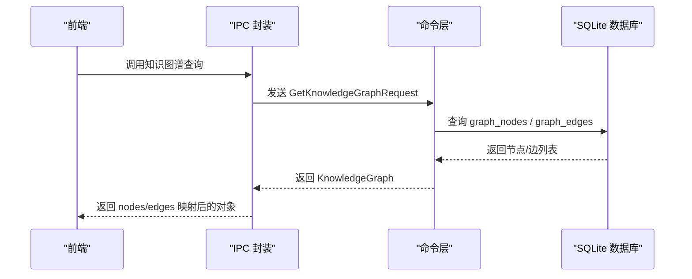
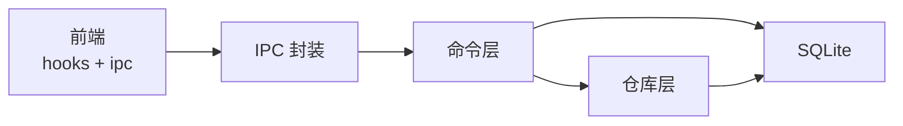

# 数据模型

<cite>
**本文引用的文件**
- [src-tauri/src/db.rs](file://src-tauri/src/db.rs)
- [src-tauri/src/models/workspace.rs](file://src-tauri/src/models/workspace.rs)
- [src-tauri/src/models/file.rs](file://src-tauri/src/models/file.rs)
- [src-tauri/src/models/note.rs](file://src-tauri/src/models/note.rs)
- [src-tauri/src/models/graph.rs](file://src-tauri/src/models/graph.rs)
- [src-tauri/src/models/search.rs](file://src-tauri/src/models/search.rs)
- [src-tauri/src/repositories/link_repo.rs](file://src-tauri/src/repositories/link_repo.rs)
- [src-tauri/src/commands/memory.rs](file://src-tauri/src/commands/memory.rs)
- [src-tauri/src/commands/knowledge.rs](file://src-tauri/src/commands/knowledge.rs)
- [src-tauri/src/commands/workspace.rs](file://src-tauri/src/commands/workspace.rs)
- [src-tauri/src/commands/file.rs](file://src-tauri/src/commands/file.rs)
- [src/ipc/index.ts](file://src/ipc/index.ts)
- [src/hooks/useDocumentContent.ts](file://src/hooks/useDocumentContent.ts)
- [src/core/document/types.ts](file://src/core/document/types.ts)
- [.tmp/system-architecture-design.md](file://.tmp/system-architecture-design.md)
- [src-tauri/tests/dataflow_tests.rs](file://src-tauri/tests/dataflow_tests.rs)
- [src-tauri/tests/ipc_contract_tests.rs](file://src-tauri/tests/ipc_contract_tests.rs)
- [.tmp/requirements-specification.md](file://.tmp/requirements-specification.md)
</cite>

## 目录
1. [简介](#简介)
2. [项目结构](#项目结构)
3. [核心组件](#核心组件)
4. [架构总览](#架构总览)
5. [详细组件分析](#详细组件分析)
6. [依赖分析](#依赖分析)
7. [性能考虑](#性能考虑)
8. [故障排查指南](#故障排查指南)
9. [结论](#结论)
10. [附录](#附录)

## 简介
本文件系统性梳理 NoteForge 的数据模型与相关实现，覆盖以下核心主题：
- 数据实体设计：Workspace、FileEntry、Note（视图）、KnowledgeGraph 及其节点/边
- 实体关系映射：一对一、一对多、多对多
- 数据验证与约束：必填字段、格式校验、业务规则
- 序列化与反序列化：JSON 转换、数据库存储格式
- 数据访问与缓存：内存缓存、持久化存储、同步机制
- 使用示例与最佳实践：如何正确创建/更新/查询数据
- 迁移策略、版本兼容性与备份恢复方案

## 项目结构
NoteForge 的数据模型由前端 TypeScript 类型与 Rust 后端模型共同构成，并通过 IPC 层进行交互；后端使用 SQLite 作为持久化存储，配合索引与约束保障一致性。

图表来源
- [src/core/document/types.ts:45-84](file://src/core/document/types.ts#L45-L84)
- [src/hooks/useDocumentContent.ts:1-47](file://src/hooks/useDocumentContent.ts#L1-L47)
- [src/ipc/index.ts:297-330](file://src/ipc/index.ts#L297-L330)
- [src-tauri/src/db.rs:18-168](file://src-tauri/src/db.rs#L18-L168)
- [src-tauri/src/models/workspace.rs:1-42](file://src-tauri/src/models/workspace.rs#L1-L42)
- [src-tauri/src/models/file.rs:1-19](file://src-tauri/src/models/file.rs#L1-L19)
- [src-tauri/src/models/note.rs:1-32](file://src-tauri/src/models/note.rs#L1-L32)
- [src-tauri/src/models/graph.rs:1-35](file://src-tauri/src/models/graph.rs#L1-L35)
- [src-tauri/src/models/search.rs:1-63](file://src-tauri/src/models/search.rs#L1-L63)
- [src-tauri/src/repositories/link_repo.rs:1-40](file://src-tauri/src/repositories/link_repo.rs#L1-L40)

章节来源
- [src/core/document/types.ts:45-84](file://src/core/document/types.ts#L45-L84)
- [src/hooks/useDocumentContent.ts:1-47](file://src/hooks/useDocumentContent.ts#L1-L47)
- [src/ipc/index.ts:297-330](file://src/ipc/index.ts#L297-L330)
- [src-tauri/src/db.rs:18-168](file://src-tauri/src/db.rs#L18-L168)
- [src-tauri/src/models/workspace.rs:1-42](file://src-tauri/src/models/workspace.rs#L1-L42)
- [src-tauri/src/models/file.rs:1-19](file://src-tauri/src/models/file.rs#L1-L19)
- [src-tauri/src/models/note.rs:1-32](file://src-tauri/src/models/note.rs#L1-L32)
- [src-tauri/src/models/graph.rs:1-35](file://src-tauri/src/models/graph.rs#L1-L35)
- [src-tauri/src/models/search.rs:1-63](file://src-tauri/src/models/search.rs#L1-L63)
- [src-tauri/src/repositories/link_repo.rs:1-40](file://src-tauri/src/repositories/link_repo.rs#L1-L40)

## 核心组件
本节聚焦于核心数据实体及其字段、类型与业务规则。

- Workspace（工作区）
  - 字段与类型：id、name、path、config（JSON）、created_at、updated_at
  - 业务规则：唯一标识；配置为 JSON，支持自动索引、排除模式等
  - 关系：一对多（一个工作区包含多个笔记、标签、链接、图节点/边）

- FileEntry（文件条目）
  - 字段与类型：name、path、is_dir、size、modified
  - 用途：文件浏览器与资源浏览的基础数据载体

- Note（笔记视图）
  - 字段与类型：id、workspace_id、file_path、title、content、language、created_at、updated_at
  - 约束：唯一索引 (workspace_id, file_path)，确保同一工作区内文件路径唯一
  - 关系：一对一（与文件系统路径映射），一对多（与标签多对多 via note_tags）

- KnowledgeGraph（知识图谱）
  - 组成：nodes（节点）、edges（边）
  - GraphNode：id、node_type、reference_id、properties（JSON）
  - GraphEdge：id、source_node_id、target_node_id、edge_type、weight、properties（JSON）
  - 业务规则：节点类型枚举（note/memory/concept/agent），权重默认 1.0，边外键级联删除

- 搜索结果与请求
  - SearchResult：file_path、title、content、score
  - Fulltext/Semantic 请求：workspace_id、query、limit
  - 时间线与标签：GetTimelineRequest、FilterByTagsRequest 等

章节来源
- [src-tauri/src/models/workspace.rs:1-42](file://src-tauri/src/models/workspace.rs#L1-L42)
- [src-tauri/src/models/file.rs:1-19](file://src-tauri/src/models/file.rs#L1-L19)
- [src-tauri/src/models/note.rs:1-32](file://src-tauri/src/models/note.rs#L1-L32)
- [src-tauri/src/models/graph.rs:1-35](file://src-tauri/src/models/graph.rs#L1-L35)
- [src-tauri/src/models/search.rs:1-63](file://src-tauri/src/models/search.rs#L1-L63)

## 架构总览
NoteForge 的数据模型围绕“工作区隔离”展开，所有核心数据均以 workspace_id 为维度进行隔离与查询。前端通过 IPC 调用后端命令，后端使用 SQLite 存储并在必要时进行 JSON 序列化/反序列化。

图表来源
- [src/ipc/index.ts:323-330](file://src/ipc/index.ts#L323-L330)
- [src-tauri/src/commands/knowledge.rs:1-200](file://src-tauri/src/commands/knowledge.rs#L1-L200)
- [src-tauri/src/db.rs:104-126](file://src-tauri/src/db.rs#L104-L126)

章节来源
- [src/ipc/index.ts:297-330](file://src/ipc/index.ts#L297-L330)
- [src-tauri/src/commands/knowledge.rs:1-200](file://src-tauri/src/commands/knowledge.rs#L1-L200)
- [src-tauri/src/db.rs:104-126](file://src-tauri/src/db.rs#L104-L126)

## 详细组件分析

### Workspace 数据模型
- 结构要点
  - WorkspaceConfig：name、path、auto_index、exclude_patterns
  - WorkspaceView：id、name、path、config、created_at、updated_at
  - 请求对象：Create/Open/UpdateWorkspaceConfigRequest
- 业务规则
  - 工作区唯一标识；配置项影响索引行为与排除规则
- 与数据库映射
  - workspaces 表：id、name、path、config(JSON)、created_at、updated_at

章节来源
- [src-tauri/src/models/workspace.rs:1-42](file://src-tauri/src/models/workspace.rs#L1-L42)
- [src-tauri/src/db.rs:22-29](file://src-tauri/src/db.rs#L22-L29)

### FileEntry 数据模型
- 结构要点
  - FileEntry：name、path、is_dir、size、modified
  - ReadFileResponse：content、language
- 用途
  - 文件树展示、文件内容读取

章节来源
- [src-tauri/src/models/file.rs:1-19](file://src-tauri/src/models/file.rs#L1-L19)

### Note（笔记）数据模型
- 结构要点
  - NoteView：id、workspace_id、file_path、title、content、language、created_at、updated_at
  - 请求对象：CreateNoteRequest、UpdateNoteRequest
- 约束与索引
  - 唯一索引 (workspace_id, file_path)
  - 索引 idx_notes_workspace、idx_notes_file_path
- 与标签的多对多
  - note_tags 关联表，外键级联删除

章节来源
- [src-tauri/src/models/note.rs:1-32](file://src-tauri/src/models/note.rs#L1-L32)
- [src-tauri/src/db.rs:31-42](file://src-tauri/src/db.rs#L31-L42)
- [src-tauri/src/db.rs:74-80](file://src-tauri/src/db.rs#L74-L80)

### KnowledgeGraph 数据模型
- 结构要点
  - GraphNode：id、node_type、reference_id、properties(JSON)
  - GraphEdge：id、source_node_id、target_node_id、edge_type、weight、properties(JSON)
  - KnowledgeGraph：nodes、edges
- 约束与索引
  - graph_nodes：node_type 枚举检查
  - graph_edges：外键级联删除，索引 idx_graph_edges_source/target
- 与工作区隔离
  - 设计文档中提出 graph_nodes 新增 workspace_id 字段用于隔离（当前模型未在 Rust 层体现，但数据库层已具备该能力）

章节来源
- [src-tauri/src/models/graph.rs:1-35](file://src-tauri/src/models/graph.rs#L1-L35)
- [src-tauri/src/db.rs:104-126](file://src-tauri/src/db.rs#L104-L126)
- [.tmp/system-architecture-design.md:568-593](file://.tmp/system-architecture-design.md#L568-L593)

### 搜索与标签数据模型
- 搜索结果：SearchResult（file_path、title、content、score）
- 请求：SearchFulltextRequest、SemanticSearchRequest
- 标签：标签表与 note_tags/memoir_tags 关联表
- 时间线：GetTimelineRequest、TimelineEntry

章节来源
- [src-tauri/src/models/search.rs:1-63](file://src-tauri/src/models/search.rs#L1-L63)
- [src-tauri/src/db.rs:68-88](file://src-tauri/src/db.rs#L68-L88)
- [src-tauri/src/db.rs:47-67](file://src-tauri/src/db.rs#L47-L67)

### 链接（Backlinks）与工作区隔离
- links 表
  - 唯一约束：(workspace_id, source_file, target_file, link_type)
  - 索引：idx_links_workspace、idx_links_source、idx_links_target
  - 逻辑关联：通过 workspace_id + source_file 做逻辑关联，避免多工作区冲突
- 仓库层
  - LinkRepo 提供按 workspace_id + source_file 删除链接的能力

章节来源
- [.tmp/system-architecture-design.md:544-561](file://.tmp/system-architecture-design.md#L544-L561)
- [src-tauri/src/repositories/link_repo.rs:1-40](file://src-tauri/src/repositories/link_repo.rs#L1-L40)
- [src-tauri/src/db.rs:90-103](file://src-tauri/src/db.rs#L90-L103)

### 记忆（Memories）与标签
- memories 表：id、agent_id、workspace_id、content、type、importance、last_accessed、access_count、metadata(JSON)、created_at、updated_at
- 索引：agent_id、type、importance
- 标签：memory_tags 关联表，支持批量打标与删除

章节来源
- [.tmp/system-architecture-design.md:498-517](file://.tmp/system-architecture-design.md#L498-L517)
- [.tmp/system-architecture-design.md:519-542](file://.tmp/system-architecture-design.md#L519-L542)
- [src-tauri/src/commands/memory.rs:36-222](file://src-tauri/src/commands/memory.rs#L36-L222)

### 前端文档记录与订阅
- DocumentRecord：包含 content、baseline、dirty、revision、savedRevision、tier、lifecycle、disk、viewState、language、createdAt、updatedAt 等
- React Hook：useDocumentContent/useDocumentRecord 基于事件总线订阅文档变化

章节来源
- [src/core/document/types.ts:45-84](file://src/core/document/types.ts#L45-L84)
- [src/hooks/useDocumentContent.ts:1-47](file://src/hooks/useDocumentContent.ts#L1-L47)

## 依赖分析
- 前端依赖后端模型与 IPC 封装
- 后端命令依赖数据库与仓库层
- 数据库层提供统一的约束、索引与 JSON 字段支持

图表来源
- [src/hooks/useDocumentContent.ts:1-47](file://src/hooks/useDocumentContent.ts#L1-L47)
- [src/ipc/index.ts:297-330](file://src/ipc/index.ts#L297-L330)
- [src-tauri/src/commands/knowledge.rs:1-200](file://src-tauri/src/commands/knowledge.rs#L1-L200)
- [src-tauri/src/repositories/link_repo.rs:1-40](file://src-tauri/src/repositories/link_repo.rs#L1-L40)
- [src-tauri/src/db.rs:18-168](file://src-tauri/src/db.rs#L18-L168)

章节来源
- [src/hooks/useDocumentContent.ts:1-47](file://src/hooks/useDocumentContent.ts#L1-L47)
- [src/ipc/index.ts:297-330](file://src/ipc/index.ts#L297-L330)
- [src-tauri/src/commands/knowledge.rs:1-200](file://src-tauri/src/commands/knowledge.rs#L1-L200)
- [src-tauri/src/repositories/link_repo.rs:1-40](file://src-tauri/src/repositories/link_repo.rs#L1-L40)
- [src-tauri/src/db.rs:18-168](file://src-tauri/src/db.rs#L18-L168)

## 性能考虑
- 索引策略
  - notes：idx_notes_workspace、idx_notes_file_path
  - memories：idx_memories_agent、idx_memories_type、idx_memories_importance
  - links：idx_links_workspace、idx_links_source、idx_links_target
  - graph_edges：idx_graph_edges_source、idx_graph_edges_target
- JSON 字段
  - config、properties、metadata、app_config.value 等采用 JSON 存储，便于扩展但需注意查询限制
- 查询建议
  - 所有跨工作区操作必须携带 workspace_id
  - 大查询使用 limit 控制返回数量
  - 对频繁访问的属性（如 importance）建立索引

章节来源
- [src-tauri/src/db.rs:44-45](file://src-tauri/src/db.rs#L44-L45)
- [src-tauri/src/db.rs:63-66](file://src-tauri/src/db.rs#L63-L66)
- [src-tauri/src/db.rs:101-102](file://src-tauri/src/db.rs#L101-L102)
- [src-tauri/src/db.rs:124-125](file://src-tauri/src/db.rs#L124-L125)

## 故障排查指南
- 知识图谱为空或节点缺失
  - 检查 graph_nodes 是否存在对应节点；确认 workspace_id 与节点 id 匹配
  - 参考测试用例中的断言与调试输出
- 链接删除无效
  - 确认使用 workspace_id + source_file 删除；避免误删其他工作区链接
- 搜索结果异常
  - 确认请求包含 workspace_id；检查索引是否生效
- 备份/恢复失败
  - 检查加密参数与 KDF 头；确保解密流程一致

章节来源
- [src-tauri/tests/ipc_contract_tests.rs:421-457](file://src-tauri/tests/ipc_contract_tests.rs#L421-L457)
- [src-tauri/tests/dataflow_tests.rs:275-316](file://src-tauri/tests/dataflow_tests.rs#L275-L316)
- [.tmp/requirements-specification.md:475-495](file://.tmp/requirements-specification.md#L475-L495)

## 结论
NoteForge 的数据模型以“工作区隔离”为核心，结合 SQLite 的 JSON 字段与索引策略，实现了笔记、链接、标签、记忆与知识图谱的统一管理。前端通过 IPC 与命令层交互，后端通过仓库层保证数据一致性。遵循本文的验证规则、访问模式与最佳实践，可有效提升系统的稳定性与可维护性。

## 附录

### 数据验证与约束清单
- 必填字段
  - workspace_id、file_path（notes）、name/path（workspaces）、content（memories）
- 枚举与范围
  - node_type ∈ {note, memory, concept, agent}
  - link_type ∈ {reference, embed, custom}
  - memory.type ∈ {conversation, fact, procedure, context}
  - search.type ∈ {fulltext, semantic, graph}
- 唯一性
  - (workspace_id, file_path)（notes）
  - (workspace_id, source_file, target_file, link_type)（links）
- 约束与外键
  - links.workspace_id 外键（逻辑关联，非硬 FK）
  - graph_edges.source/target 外键级联删除
  - note_tags/memory_tags 外键级联删除

章节来源
- [src-tauri/src/db.rs:41-41](file://src-tauri/src/db.rs#L41-L41)
- [src-tauri/src/db.rs:95-95](file://src-tauri/src/db.rs#L95-L95)
- [src-tauri/src/db.rs:94-94](file://src-tauri/src/db.rs#L94-L94)
- [src-tauri/src/db.rs:120-121](file://src-tauri/src/db.rs#L120-L121)
- [src-tauri/src/db.rs:78-79](file://src-tauri/src/db.rs#L78-L79)
- [src-tauri/src/db.rs:86-87](file://src-tauri/src/db.rs#L86-L87)

### 序列化与反序列化机制
- JSON 字段
  - properties、metadata、config、value 等以 JSON 存储
  - Rust 层使用 serde_json::Value 或字符串 JSON 字段
- 前端映射
  - IPC 返回对象中对节点/边进行 toGraphNode/toGraphEdge 映射
- 建议
  - 对 JSON 字段进行最小化写入，避免大体积 JSON 导致存储膨胀

章节来源
- [src-tauri/src/models/graph.rs:9-20](file://src-tauri/src/models/graph.rs#L9-L20)
- [src-tauri/src/commands/memory.rs:153-154](file://src-tauri/src/commands/memory.rs#L153-L154)
- [src/ipc/index.ts:323-330](file://src/ipc/index.ts#L323-L330)

### 数据访问模式与缓存策略
- 前端缓存
  - DocumentRecord 在内存中维护 content/baseline/dirty/revision 等状态
  - useDocumentContent/useDocumentRecord 基于事件总线订阅更新
- 后端缓存
  - 通过索引与查询优化减少重复扫描
- 同步机制
  - 文档保存后更新 disk 快照与语言检测
  - 外部变更通知触发重载或冲突处理

章节来源
- [src/core/document/types.ts:45-84](file://src/core/document/types.ts#L45-L84)
- [src/hooks/useDocumentContent.ts:1-47](file://src/hooks/useDocumentContent.ts#L1-L47)
- [src/core/document/document-service.impl.ts:334-372](file://src/core/document/document-service.impl.ts#L334-L372)

### 使用示例与最佳实践
- 创建工作区
  - 使用 CreateWorkspaceRequest 指定 name/path
  - 更新配置使用 UpdateWorkspaceConfigRequest
- 创建笔记
  - 使用 CreateNoteRequest 指定 workspace_id + file_path
  - 更新标题/内容使用 UpdateNoteRequest
- 获取知识图谱
  - 使用 knowledge.getGraph(workspaceId) 获取 nodes/edges
- 搜索
  - 使用 searchFulltext/semanticSearch 并传入 workspace_id 与 limit
- 链接管理
  - 通过 LinkRepo.create/delete_by_workspace_and_source 管理链接
- 最佳实践
  - 所有查询/写入均携带 workspace_id
  - 大文件跳过索引，避免超大 JSON
  - 使用唯一约束避免重复链接

章节来源
- [src-tauri/src/models/workspace.rs:25-41](file://src-tauri/src/models/workspace.rs#L25-L41)
- [src-tauri/src/models/note.rs:18-31](file://src-tauri/src/models/note.rs#L18-L31)
- [src/ipc/index.ts:300-330](file://src/ipc/index.ts#L300-L330)
- [src-tauri/src/repositories/link_repo.rs:14-39](file://src-tauri/src/repositories/link_repo.rs#L14-L39)
- [.tmp/requirements-specification.md:501-518](file://.tmp/requirements-specification.md#L501-L518)

### 数据迁移策略、版本兼容性与备份恢复
- 迁移策略
  - 使用 schema_migrations 表记录版本号、名称与应用时间
  - 初始版本 v1，后续迁移逐步演进
- 版本兼容性
  - 通过枚举字段与 JSON 扩展保持向前兼容
  - 严格区分 workspace_id，避免跨工作区冲突
- 备份恢复
  - 备份前打包为 zip，使用 AES-GCM 加密，包含 KDF 参数头
  - 恢复时解密并解压，确保数据完整性

章节来源
- [.tmp/system-architecture-design.md:605-614](file://.tmp/system-architecture-design.md#L605-L614)
- [.tmp/requirements-specification.md:475-495](file://.tmp/requirements-specification.md#L475-L495)