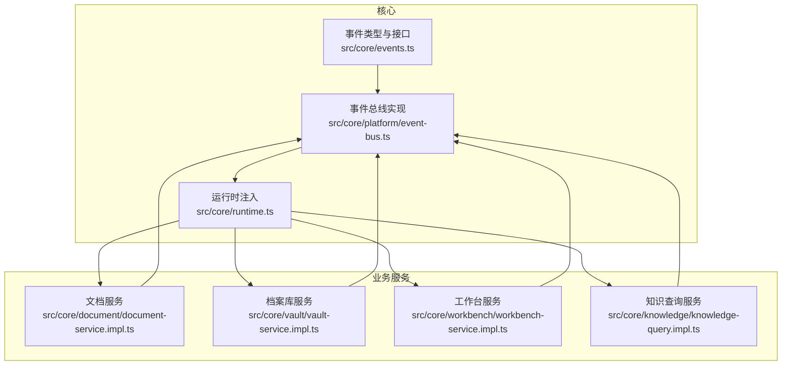
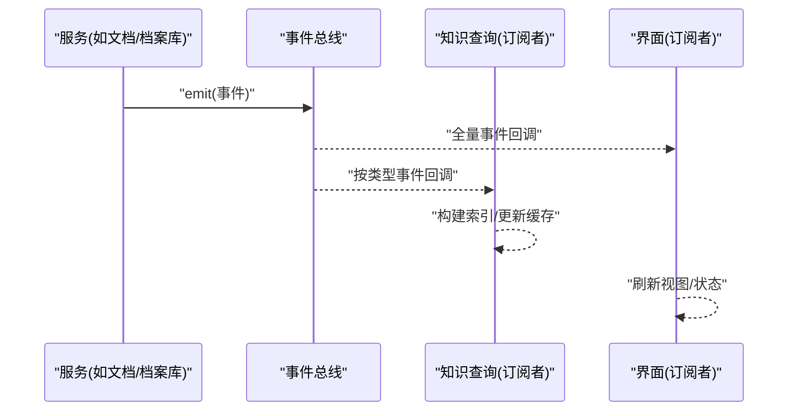
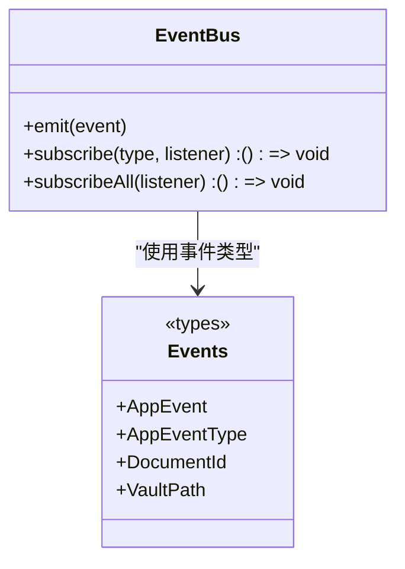
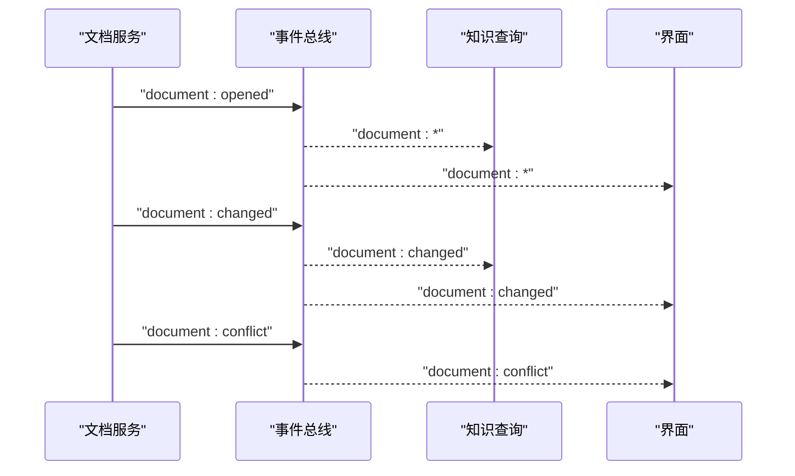
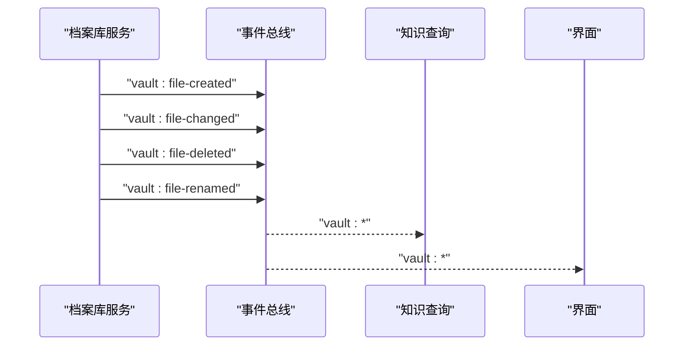
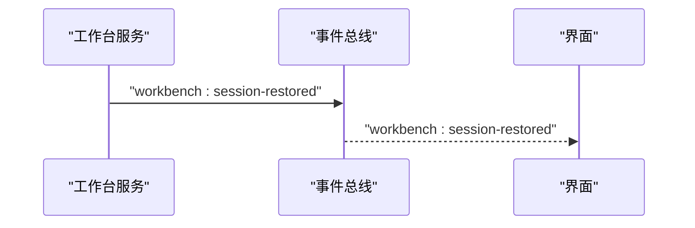
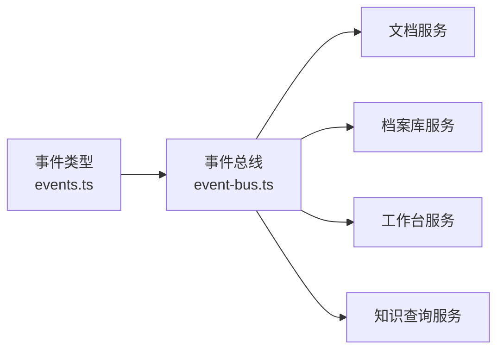

# 事件驱动架构

<cite>
**本文引用的文件**
- [src/core/events.ts](file://src/core/events.ts)
- [src/core/platform/event-bus.ts](file://src/core/platform/event-bus.ts)
- [src/core/runtime.ts](file://src/core/runtime.ts)
- [src/core/document/document-service.impl.ts](file://src/core/document/document-service.impl.ts)
- [src/core/vault/vault-service.impl.ts](file://src/core/vault/vault-service.impl.ts)
- [src/core/workbench/workbench-service.impl.ts](file://src/core/workbench/workbench-service.impl.ts)
- [src/core/knowledge/knowledge-query.impl.ts](file://src/core/knowledge/knowledge-query.impl.ts)
- [src/core/invariants.ts](file://src/core/invariants.ts)
</cite>

## 目录
1. [引言](#引言)
2. [项目结构](#项目结构)
3. [核心组件](#核心组件)
4. [架构总览](#架构总览)
5. [详细组件分析](#详细组件分析)
6. [依赖关系分析](#依赖关系分析)
7. [性能考量](#性能考量)
8. [故障排查指南](#故障排查指南)
9. [结论](#结论)
10. [附录](#附录)

## 引言
本文件系统性梳理 NoteForge 的事件驱动架构，重点围绕事件总线的设计与实现、事件类型定义、发布订阅机制展开；并结合文档变更、冲突检测、会话管理等关键业务事件，说明事件在组件解耦、异步处理与响应式更新方面的价值。同时给出性能与稳定性建议，并提供可操作的实践参考。

## 项目结构
事件系统位于前端核心层，采用“事件类型定义 + 事件总线实现 + 运行时注入”的分层组织方式：
- 事件类型与接口：统一在事件模块中定义，确保类型安全与扩展性
- 事件总线：提供发布/订阅能力，支持按类型与全量订阅
- 运行时：集中创建并注入事件总线，供各服务共享
- 业务服务：在合适时机发出事件，触发跨模块联动（如文档、知识图谱、工作台）

图表来源
- [src/core/events.ts:1-34](file://src/core/events.ts#L1-L34)
- [src/core/platform/event-bus.ts:1-36](file://src/core/platform/event-bus.ts#L1-L36)
- [src/core/runtime.ts:1-45](file://src/core/runtime.ts#L1-L45)
- [src/core/document/document-service.impl.ts:180-220](file://src/core/document/document-service.impl.ts#L180-L220)
- [src/core/vault/vault-service.impl.ts:130-150](file://src/core/vault/vault-service.impl.ts#L130-L150)
- [src/core/workbench/workbench-service.impl.ts:270-290](file://src/core/workbench/workbench-service.impl.ts#L270-L290)
- [src/core/knowledge/knowledge-query.impl.ts:1-30](file://src/core/knowledge/knowledge-query.impl.ts#L1-L30)

章节来源
- [src/core/events.ts:1-34](file://src/core/events.ts#L1-L34)
- [src/core/platform/event-bus.ts:1-36](file://src/core/platform/event-bus.ts#L1-L36)
- [src/core/runtime.ts:1-45](file://src/core/runtime.ts#L1-L45)

## 核心组件
- 事件类型与接口
  - 定义稳定文档标识、档案库路径等基础类型
  - 统一的 AppEvent 联合类型，覆盖档案库与文档相关事件
  - EventBus 接口提供 emit、subscribe、subscribeAll 三类能力
- 事件总线实现
  - 使用集合维护监听器，支持全量与按类型两类订阅
  - emit 时先广播给全量监听器，再按事件类型匹配到具体监听器集合
  - 返回取消函数，便于在组件卸载或上下文结束时清理
- 运行时注入
  - 在运行时创建事件总线实例，并注入到全局运行时对象
  - 各业务服务通过运行时获取事件总线，避免循环依赖

章节来源
- [src/core/events.ts:1-34](file://src/core/events.ts#L1-L34)
- [src/core/platform/event-bus.ts:1-36](file://src/core/platform/event-bus.ts#L1-L36)
- [src/core/runtime.ts:1-45](file://src/core/runtime.ts#L1-L45)

## 架构总览
事件驱动架构通过“事件总线”作为中枢，实现以下目标：
- 解耦：UI、服务与索引器之间仅通过事件交互，无直接调用链
- 异步：事件发布非阻塞，订阅者按需处理
- 响应式：订阅者对事件做出反应，驱动状态与视图更新
- 可观测：全量订阅可用于日志与审计

图表来源
- [src/core/platform/event-bus.ts:7-18](file://src/core/platform/event-bus.ts#L7-L18)
- [src/core/knowledge/knowledge-query.impl.ts:140-160](file://src/core/knowledge/knowledge-query.impl.ts#L140-L160)

## 详细组件分析

### 事件类型与发布订阅模型
- 事件类型
  - 档案库事件：打开/关闭、文件创建/修改/删除/重命名
  - 文档事件：打开/关闭、保存、变更、冲突、视图状态变化
  - 工作台事件：会话恢复、活动文档切换
- 发布订阅
  - 订阅：按类型订阅或全量订阅，返回取消函数
  - 发布：emit 将事件投递给所有监听器
- 类型安全
  - 通过泛型约束确保订阅者收到与其订阅类型一致的事件

图表来源
- [src/core/events.ts:27-34](file://src/core/events.ts#L27-L34)
- [src/core/platform/event-bus.ts:3-36](file://src/core/platform/event-bus.ts#L3-L36)

章节来源
- [src/core/events.ts:8-25](file://src/core/events.ts#L8-L25)
- [src/core/platform/event-bus.ts:3-36](file://src/core/platform/event-bus.ts#L3-L36)

### 文档变更事件流
- 触发点
  - 打开/关闭文档、内容保存、内容变更、视图状态变化
- 处理链
  - 文档服务发出事件 → 知识查询服务订阅并更新索引 → UI 订阅并刷新视图
- 冲突检测
  - 当检测到冲突时，发出冲突事件，由 UI 或编辑器进行提示与合并引导

图表来源
- [src/core/document/document-service.impl.ts:180-220](file://src/core/document/document-service.impl.ts#L180-L220)
- [src/core/document/document-service.impl.ts:360-395](file://src/core/document/document-service.impl.ts#L360-L395)
- [src/core/knowledge/knowledge-query.impl.ts:140-160](file://src/core/knowledge/knowledge-query.impl.ts#L140-L160)

章节来源
- [src/core/document/document-service.impl.ts:180-220](file://src/core/document/document-service.impl.ts#L180-L220)
- [src/core/document/document-service.impl.ts:360-395](file://src/core/document/document-service.impl.ts#L360-L395)
- [src/core/knowledge/knowledge-query.impl.ts:140-160](file://src/core/knowledge/knowledge-query.impl.ts#L140-L160)

### 档案库文件事件流
- 触发点
  - 文件创建、修改、删除、重命名
- 处理链
  - 档案库服务发出事件 → 索引器/链接解析订阅并迁移索引 → UI 刷新文件树

图表来源
- [src/core/vault/vault-service.impl.ts:130-150](file://src/core/vault/vault-service.impl.ts#L130-L150)
- [src/core/vault/vault-service.impl.ts:200-220](file://src/core/vault/vault-service.impl.ts#L200-L220)
- [src/core/knowledge/knowledge-query.impl.ts:140-160](file://src/core/knowledge/knowledge-query.impl.ts#L140-L160)

章节来源
- [src/core/vault/vault-service.impl.ts:130-150](file://src/core/vault/vault-service.impl.ts#L130-L150)
- [src/core/vault/vault-service.impl.ts:200-220](file://src/core/vault/vault-service.impl.ts#L200-L220)
- [src/core/knowledge/knowledge-query.impl.ts:140-160](file://src/core/knowledge/knowledge-query.impl.ts#L140-L160)

### 会话管理事件流
- 触发点
  - 会话恢复
- 处理链
  - 工作台服务发出事件 → UI 与状态管理订阅并恢复界面状态

图表来源
- [src/core/workbench/workbench-service.impl.ts:270-290](file://src/core/workbench/workbench-service.impl.ts#L270-L290)

章节来源
- [src/core/workbench/workbench-service.impl.ts:270-290](file://src/core/workbench/workbench-service.impl.ts#L270-L290)

### 事件处理器编写规范与错误处理
- 编写规范
  - 订阅时使用类型化订阅，确保事件参数正确
  - 订阅者内部应尽量保持幂等与快速返回，避免阻塞事件总线
  - 对于耗时任务，应在订阅内启动异步流程（如后台任务）
- 错误处理
  - 订阅者内部捕获异常，避免影响其他订阅者
  - 提供统一的错误上报入口，便于定位问题
  - 对重复订阅与未清理订阅进行告警或日志记录

章节来源
- [src/core/platform/event-bus.ts:20-34](file://src/core/platform/event-bus.ts#L20-L34)
- [src/core/invariants.ts:48-48](file://src/core/invariants.ts#L48-L48)

## 依赖关系分析
- 低耦合
  - 事件总线是唯一共享依赖，服务间通过事件通信
- 可观测性
  - 全量订阅用于日志与审计，类型订阅用于功能实现
- 可扩展性
  - 新增事件类型只需扩展联合类型与对应发布点
  - 新增订阅者无需改动发布方

图表来源
- [src/core/events.ts:8-25](file://src/core/events.ts#L8-L25)
- [src/core/platform/event-bus.ts:1-36](file://src/core/platform/event-bus.ts#L1-L36)
- [src/core/document/document-service.impl.ts:180-220](file://src/core/document/document-service.impl.ts#L180-L220)
- [src/core/vault/vault-service.impl.ts:130-150](file://src/core/vault/vault-service.impl.ts#L130-L150)
- [src/core/workbench/workbench-service.impl.ts:270-290](file://src/core/workbench/workbench-service.impl.ts#L270-L290)
- [src/core/knowledge/knowledge-query.impl.ts:140-160](file://src/core/knowledge/knowledge-query.impl.ts#L140-L160)

章节来源
- [src/core/events.ts:8-25](file://src/core/events.ts#L8-L25)
- [src/core/platform/event-bus.ts:1-36](file://src/core/platform/event-bus.ts#L1-L36)

## 性能考量
- 事件队列管理
  - 事件发布为同步调用，订阅者应避免长耗时逻辑；长任务异步执行
  - 对高频事件（如文档变更）建议节流/去抖，减少订阅者压力
- 内存泄漏防护
  - 订阅返回取消函数，务必在组件卸载或上下文结束时调用
  - 避免闭包持有大对象导致无法回收
- 事件风暴处理
  - 对批量操作（如重命名、导入）可合并事件或延迟发布
  - 订阅者内部增加背压与限速策略，防止过载

章节来源
- [src/core/platform/event-bus.ts:20-34](file://src/core/platform/event-bus.ts#L20-L34)
- [src/core/invariants.ts:48-48](file://src/core/invariants.ts#L48-L48)

## 故障排查指南
- 事件未到达
  - 检查订阅是否在事件发布前完成
  - 确认订阅类型与事件类型一致
- 事件风暴导致卡顿
  - 查看是否有大量高频事件发布，必要时引入节流/批处理
- 订阅未清理
  - 确保在组件卸载时调用取消函数
- 订阅者异常
  - 捕获并记录异常，避免影响其他订阅者

章节来源
- [src/core/platform/event-bus.ts:20-34](file://src/core/platform/event-bus.ts#L20-L34)

## 结论
NoteForge 的事件驱动架构以类型安全的事件模型与轻量级事件总线为核心，实现了服务间的松耦合与可观测性。通过文档变更、冲突检测与会话管理等关键事件流，系统在保证性能的同时提升了可扩展性与可维护性。遵循订阅规范与错误处理策略，可在复杂场景下稳定运行。

## 附录
- 事件类型定义位置：[src/core/events.ts:8-25](file://src/core/events.ts#L8-L25)
- 事件总线实现位置：[src/core/platform/event-bus.ts:1-36](file://src/core/platform/event-bus.ts#L1-L36)
- 运行时注入位置：[src/core/runtime.ts:25-45](file://src/core/runtime.ts#L25-L45)
- 文档事件发布示例：[src/core/document/document-service.impl.ts:180-220](file://src/core/document/document-service.impl.ts#L180-L220)
- 档案库事件发布示例：[src/core/vault/vault-service.impl.ts:130-150](file://src/core/vault/vault-service.impl.ts#L130-L150)
- 工作台事件发布示例：[src/core/workbench/workbench-service.impl.ts:270-290](file://src/core/workbench/workbench-service.impl.ts#L270-L290)
- 知识查询订阅示例：[src/core/knowledge/knowledge-query.impl.ts:140-160](file://src/core/knowledge/knowledge-query.impl.ts#L140-L160)