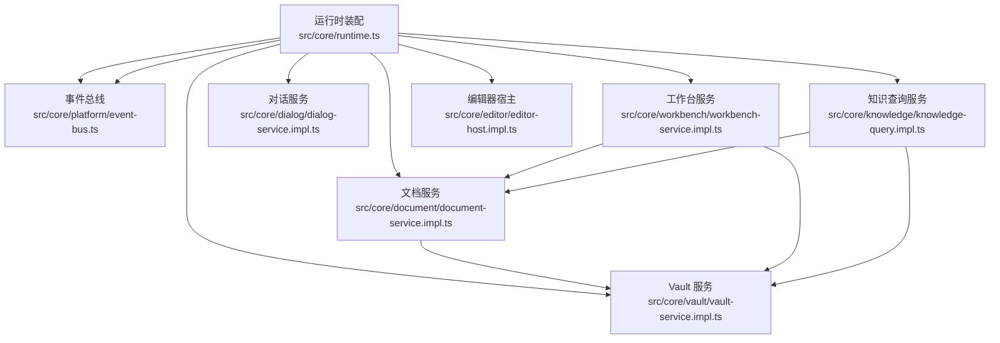
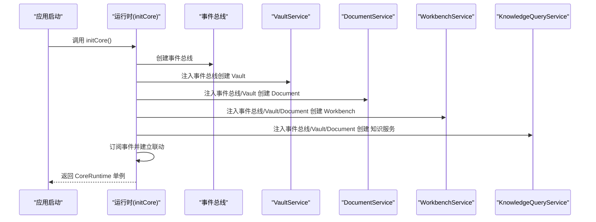
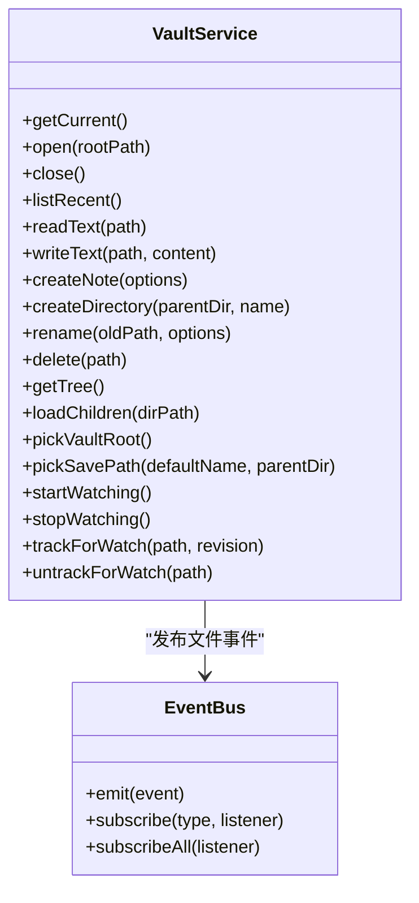
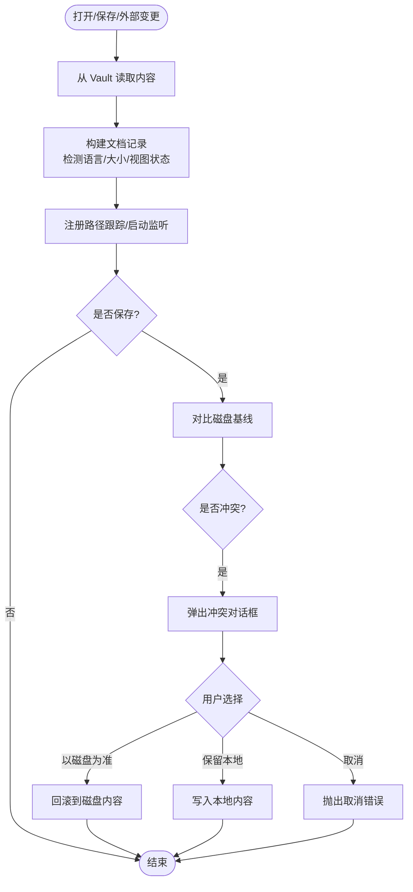
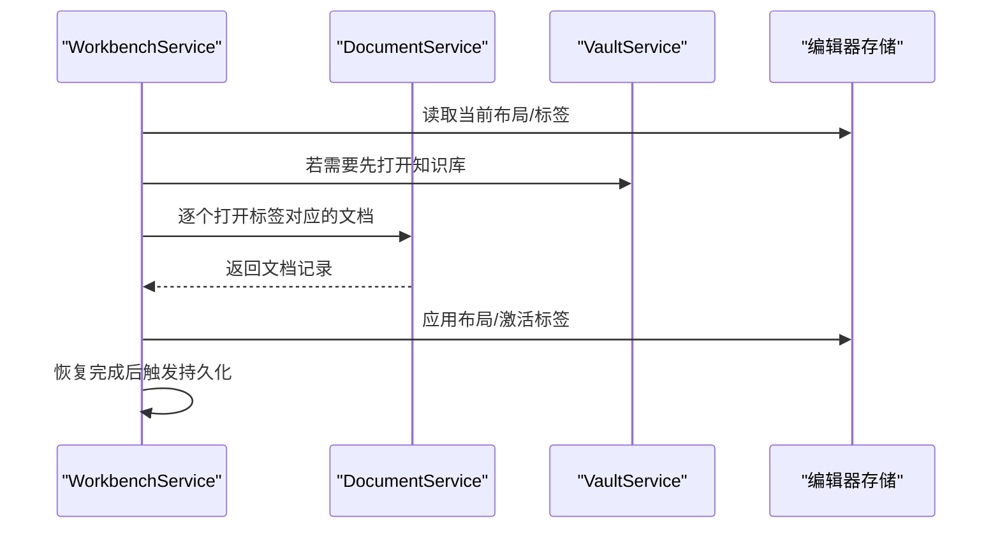
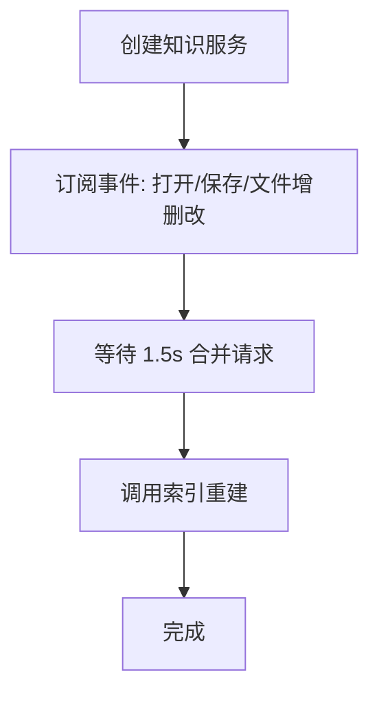
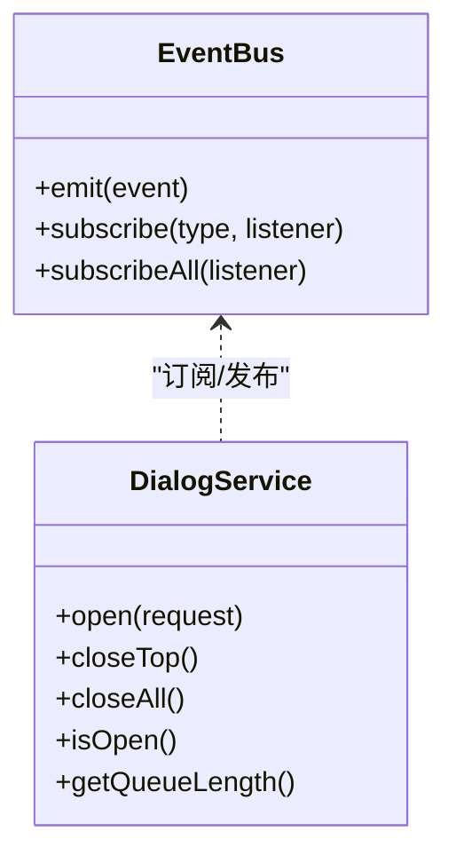
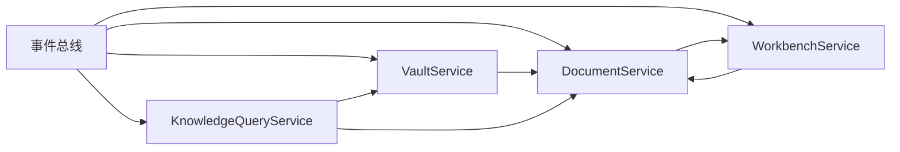

# 依赖注入容器

<cite>
**本文引用的文件**
- [src/core/runtime.ts](file://src/core/runtime.ts)
- [src/core/vault/vault-service.impl.ts](file://src/core/vault/vault-service.impl.ts)
- [src/core/vault/service.ts](file://src/core/vault/service.ts)
- [src/core/document/document-service.impl.ts](file://src/core/document/document-service.impl.ts)
- [src/core/document/service.ts](file://src/core/document/service.ts)
- [src/core/workbench/workbench-service.impl.ts](file://src/core/workbench/workbench-service.impl.ts)
- [src/core/workbench/service.ts](file://src/core/workbench/service.ts)
- [src/core/knowledge/knowledge-query.impl.ts](file://src/core/knowledge/knowledge-query.impl.ts)
- [src/core/platform/event-bus.ts](file://src/core/platform/event-bus.ts)
- [src/core/dialog/dialog-service.impl.ts](file://src/core/dialog/dialog-service.impl.ts)
- [src/core/dialog/dialog-store.ts](file://src/core/dialog/dialog-store.ts)
- [src/core/editor/editor-host.impl.ts](file://src/core/editor/editor-host.impl.ts)
</cite>

## 目录
1. [引言](#引言)
2. [项目结构](#项目结构)
3. [核心组件](#核心组件)
4. [架构总览](#架构总览)
5. [详细组件分析](#详细组件分析)
6. [依赖关系分析](#依赖关系分析)
7. [性能考量](#性能考量)
8. [故障排查指南](#故障排查指南)
9. [结论](#结论)
10. [附录](#附录)

## 引言
本文件系统性梳理 NoteForge 的“依赖注入容器”设计与实现，重点围绕核心运行时系统如何通过构造器注入的方式组织服务、管理生命周期与事件联动，并在不引入传统 IoC 容器的前提下，实现松耦合、可测试与可维护的架构。本文将深入解释服务注册、依赖解析与生命周期管理，详述 VaultService、DocumentService、WorkbenchService 等核心服务的初始化顺序与相互依赖关系；同时讨论循环依赖规避策略、单例化机制、异步初始化与事件驱动的解耦方式，并给出最佳实践与扩展建议。

## 项目结构
NoteForge 的依赖注入以“工厂函数 + 构造器参数”的形式实现，核心运行时在单一入口集中装配各服务实例并暴露统一接口。关键目录与文件如下：
- 运行时装配：src/core/runtime.ts
- 服务定义与实现：
  - VaultService：src/core/vault/service.ts、src/core/vault/vault-service.impl.ts
  - DocumentService：src/core/document/service.ts、src/core/document/document-service.impl.ts
  - WorkbenchService：src/core/workbench/service.ts、src/core/workbench/workbench-service.impl.ts
  - 知识服务：src/core/knowledge/knowledge-query.impl.ts
  - 对话服务：src/core/dialog/dialog-service.impl.ts、src/core/dialog/dialog-store.ts
  - 编辑器宿主：src/core/editor/editor-host.impl.ts
- 平台与事件：src/core/platform/event-bus.ts

图表来源
- [src/core/runtime.ts:43-100](file://src/core/runtime.ts#L43-L100)
- [src/core/vault/vault-service.impl.ts:31-311](file://src/core/vault/vault-service.impl.ts#L31-L311)
- [src/core/document/document-service.impl.ts:48-465](file://src/core/document/document-service.impl.ts#L48-L465)
- [src/core/workbench/workbench-service.impl.ts:138-416](file://src/core/workbench/workbench-service.impl.ts#L138-L416)
- [src/core/knowledge/knowledge-query.impl.ts:41-148](file://src/core/knowledge/knowledge-query.impl.ts#L41-L148)
- [src/core/dialog/dialog-service.impl.ts:10-55](file://src/core/dialog/dialog-service.impl.ts#L10-L55)
- [src/core/editor/editor-host.impl.ts:82-110](file://src/core/editor/editor-host.impl.ts#L82-L110)

章节来源
- [src/core/runtime.ts:1-191](file://src/core/runtime.ts#L1-L191)

## 核心组件
- 运行时接口与单例
  - CoreRuntime 暴露事件总线、Vault、Document、Workbench、命令、对话、知识、编辑器宿主等能力。
  - 通过惰性初始化与单例缓存避免重复装配。
- 服务契约
  - 各服务均以接口定义能力边界，实现以工厂函数返回对象形式提供。
- 事件驱动
  - 通过事件总线在服务间解耦，如文档变更触发工作台持久化、冲突提示等。

章节来源
- [src/core/runtime.ts:29-111](file://src/core/runtime.ts#L29-L111)
- [src/core/vault/service.ts:13-53](file://src/core/vault/service.ts#L13-L53)
- [src/core/document/service.ts:17-51](file://src/core/document/service.ts#L17-L51)
- [src/core/workbench/service.ts:8-43](file://src/core/workbench/service.ts#L8-L43)

## 架构总览
NoteForge 的依赖注入采用“显式构造器注入 + 事件总线”的组合模式：
- 初始化阶段：运行时按固定顺序创建服务实例，将共享依赖（如事件总线）注入到各服务。
- 运行阶段：服务通过事件总线进行松耦合通信，避免直接互相引用导致的紧耦合与循环依赖。
- 生命周期：服务实例在运行时单例存在，部分服务支持异步初始化（如知识索引器的延时重索引）。

图表来源
- [src/core/runtime.ts:43-100](file://src/core/runtime.ts#L43-L100)

## 详细组件分析

### VaultService（知识库服务）
- 角色与职责
  - 负责知识库根路径打开/关闭、文件读写、树形结构与变更监听、路径选择器等。
- 依赖注入
  - 仅依赖事件总线，用于发出文件变更/创建/删除/重命名等事件。
- 关键行为
  - 打开知识库时尝试打开工作区，失败则创建并重试；随后启动原生或轮询监听。
  - 写入文件时记录自写入路径集合，避免监听噪声；并更新跟踪快照。
- 生命周期
  - 单例存在，随运行时初始化；支持手动开启/停止监听。

图表来源
- [src/core/vault/service.ts:13-53](file://src/core/vault/service.ts#L13-L53)
- [src/core/vault/vault-service.impl.ts:31-311](file://src/core/vault/vault-service.impl.ts#L31-L311)
- [src/core/platform/event-bus.ts:3-36](file://src/core/platform/event-bus.ts#L3-L36)

章节来源
- [src/core/vault/vault-service.impl.ts:16-311](file://src/core/vault/vault-service.impl.ts#L16-L311)
- [src/core/vault/service.ts:13-53](file://src/core/vault/service.ts#L13-L53)

### DocumentService（文档服务）
- 角色与职责
  - 统一的文档打开、编辑、保存、撤销、外部变更通知与冲突处理。
- 依赖注入
  - 依赖事件总线与 Vault 服务；可选回调 onDocumentsChanged 用于通知上层。
- 关键行为
  - 打开文档时从 Vault 读取内容并构建记录；根据大小选择存储层级；跟踪磁盘修订以检测外部变更。
  - 保存前检查磁盘基线，出现冲突时弹出对话框由用户选择；支持草稿恢复与本地覆盖。
  - 订阅 Vault 文件事件，自动同步外部变更。
- 生命周期
  - 单例存在，内部维护文档映射与冲突表；支持异步清理草稿与持久化。

图表来源
- [src/core/document/document-service.impl.ts:145-312](file://src/core/document/document-service.impl.ts#L145-L312)
- [src/core/document/document-service.impl.ts:439-462](file://src/core/document/document-service.impl.ts#L439-L462)

章节来源
- [src/core/document/document-service.impl.ts:24-465](file://src/core/document/document-service.impl.ts#L24-L465)
- [src/core/document/service.ts:17-51](file://src/core/document/service.ts#L17-L51)

### WorkbenchService（工作台服务）
- 角色与职责
  - 管理多面板、标签页、布局与会话持久化/恢复；协调文档与编辑器状态。
- 依赖注入
  - 依赖事件总线、Vault、Document 服务；通过闭包持有 DocumentService 引用以避免循环导入。
- 关键行为
  - 会话构建：遍历编辑器状态，序列化标签引用、布局与活动面板。
  - 会话恢复：按顺序打开标签，必要时先打开对应知识库；恢复后清理遗留草稿。
  - 持久化调度：800ms 延迟合并多次变更，避免频繁写入。
- 生命周期
  - 单例存在；支持立即持久化与定时调度；恢复过程中暂停持久化以避免覆盖。

图表来源
- [src/core/workbench/workbench-service.impl.ts:271-375](file://src/core/workbench/workbench-service.impl.ts#L271-L375)
- [src/core/workbench/workbench-service.impl.ts:418-466](file://src/core/workbench/workbench-service.impl.ts#L418-L466)

章节来源
- [src/core/workbench/workbench-service.impl.ts:28-416](file://src/core/workbench/workbench-service.impl.ts#L28-L416)
- [src/core/workbench/service.ts:8-43](file://src/core/workbench/service.ts#L8-L43)

### 知识查询服务（KnowledgeQueryService）
- 角色与职责
  - 提供笔记标题搜索、反链查询、标题索引、链接解析与工作区索引。
- 依赖注入
  - 依赖事件总线、Vault、Document 服务；通过事件总线订阅文件变更以延时重建索引。
- 关键行为
  - 延时索引：在多个事件触发后 1.5 秒内合并一次索引重建，降低 I/O 压力。
  - Wiki 链接解析：基于已打开文档内容与笔记树解析 [[目标]] 链接。
- 生命周期
  - 单例存在；通过返回的卸载函数解除事件订阅。

图表来源
- [src/core/knowledge/knowledge-query.impl.ts:150-175](file://src/core/knowledge/knowledge-query.impl.ts#L150-L175)
- [src/core/knowledge/knowledge-query.impl.ts:41-148](file://src/core/knowledge/knowledge-query.impl.ts#L41-L148)

章节来源
- [src/core/knowledge/knowledge-query.impl.ts:23-178](file://src/core/knowledge/knowledge-query.impl.ts#L23-L178)

### 对话服务与事件总线
- 对话服务
  - 通过全局状态队列管理对话框的打开/关闭与排队逻辑；提供 isOpen 与队列长度查询。
- 事件总线
  - 提供类型化订阅与广播，支持所有事件与特定类型事件；用于服务间解耦。

图表来源
- [src/core/platform/event-bus.ts:3-36](file://src/core/platform/event-bus.ts#L3-L36)
- [src/core/dialog/dialog-service.impl.ts:10-55](file://src/core/dialog/dialog-service.impl.ts#L10-L55)

章节来源
- [src/core/dialog/dialog-service.impl.ts:1-57](file://src/core/dialog/dialog-service.impl.ts#L1-L57)
- [src/core/dialog/dialog-store.ts:1-20](file://src/core/dialog/dialog-store.ts#L1-L20)
- [src/core/platform/event-bus.ts:1-36](file://src/core/platform/event-bus.ts#L1-L36)

### 编辑器宿主服务
- 角色与职责
  - 管理编辑器表面注册、模式切换、滚动定位与内容刷新；桥接运行时与编辑器 UI。
- 依赖注入
  - 依赖 DocumentService 以获取当前文档状态并执行操作。
- 关键行为
  - 支持外部内容应用、表面刷新与模式切换；提供注册适配器的钩子。

章节来源
- [src/core/editor/editor-host.impl.ts:82-110](file://src/core/editor/editor-host.impl.ts#L82-L110)

## 依赖关系分析
- 初始化顺序与依赖链
  1) 事件总线 → 2) VaultService → 3) DocumentService → 4) WorkbenchService → 5) 知识查询服务 → 6) 对话服务 → 7) 编辑器宿主服务
- 循环依赖规避
  - Workbench 通过闭包持有 DocumentService 引用，避免直接 import 导致的循环导入；同时在运行时通过全局引用注入，确保只在装配阶段建立依赖。
- 单例化与懒加载
  - 运行时通过单例缓存 CoreRuntime，避免重复初始化；部分功能（如对话框队列、知识索引）采用惰性加载与异步初始化。
- 松耦合与事件驱动
  - 文档保存触发工作台持久化、冲突提示由对话服务弹出；知识索引通过事件延时重建，均通过事件总线解耦。

图表来源
- [src/core/runtime.ts:43-100](file://src/core/runtime.ts#L43-L100)
- [src/core/workbench/workbench-service.impl.ts:138-139](file://src/core/workbench/workbench-service.impl.ts#L138-L139)

章节来源
- [src/core/runtime.ts:43-100](file://src/core/runtime.ts#L43-L100)
- [src/core/workbench/workbench-service.impl.ts:131-136](file://src/core/workbench/workbench-service.impl.ts#L131-L136)

## 性能考量
- 延迟与合并
  - 工作台持久化采用 800ms 延迟合并多次变更，减少 I/O 次数。
  - 知识索引重建采用 1.5s 延迟合并，避免频繁重建带来的性能损耗。
- 监听与去噪
  - Vault 写入时记录自写入路径集合，避免监听噪声触发不必要的事件。
- 草稿与增量
  - 文档服务对未保存内容采用草稿机制，保存成功后再清理，减少磁盘写入次数。

## 故障排查指南
- 无法打开知识库
  - 检查运行时是否成功打开工作区并创建知识库；确认事件总线是否正确发出“vault:opened”事件。
- 文档保存冲突
  - 观察是否触发冲突对话框；若用户选择“取消”，保存流程会抛出取消错误；检查 DocumentService 的冲突处理逻辑。
- 会话恢复失败
  - 查看恢复流程中是否因知识库打开失败而降级；确认持久化开关在恢复期间被正确暂停。
- 知识索引未更新
  - 检查事件订阅是否生效；确认 1.5s 延迟内未被后续事件清除。

章节来源
- [src/core/vault/vault-service.impl.ts:106-143](file://src/core/vault/vault-service.impl.ts#L106-L143)
- [src/core/document/document-service.impl.ts:250-312](file://src/core/document/document-service.impl.ts#L250-L312)
- [src/core/workbench/workbench-service.impl.ts:271-375](file://src/core/workbench/workbench-service.impl.ts#L271-L375)
- [src/core/knowledge/knowledge-query.impl.ts:150-175](file://src/core/knowledge/knowledge-query.impl.ts#L150-L175)

## 结论
NoteForge 的依赖注入容器以“工厂函数 + 构造器注入 + 事件总线”为核心，实现了清晰的服务边界、稳定的初始化顺序与强大的解耦能力。通过单例化、惰性加载与异步初始化，系统在保证性能的同时提升了可测试性与可维护性。该设计避免了传统 IoC 容器的复杂度，同时保留了良好的扩展性与演进空间。

## 附录

### 最佳实践与扩展建议
- 服务注册
  - 将服务创建与依赖注入集中在运行时装配处，保持接口稳定与实现可替换。
- 依赖解析
  - 使用接口定义服务契约，避免硬编码具体实现；通过工厂函数注入依赖，便于测试替身。
- 生命周期管理
  - 对外暴露卸载函数（如知识索引器的返回值），在应用退出或服务销毁时清理订阅与定时器。
- 循环依赖
  - 采用闭包持有引用或延迟访问（如 Workbench 中对 DocumentService 的闭包注入）。
- 异步初始化
  - 对耗时任务（索引、监听）采用延时合并策略；对外暴露 ready 状态或 Promise 以便上层等待。
- 可测试性
  - 通过 DI 容器注入替身（Mock）与测试桩，隔离外部依赖；利用事件总线断言交互。
- 可维护性
  - 明确服务职责与边界，避免跨服务直接耦合；统一通过事件总线进行协作。