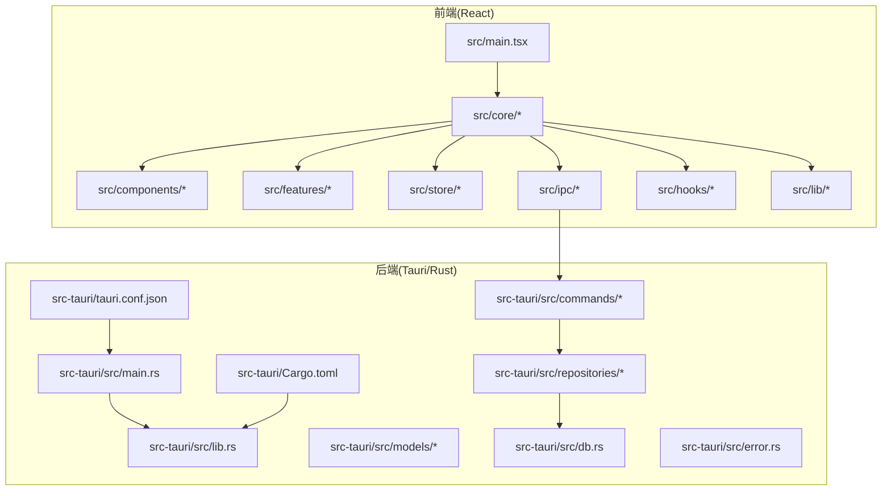
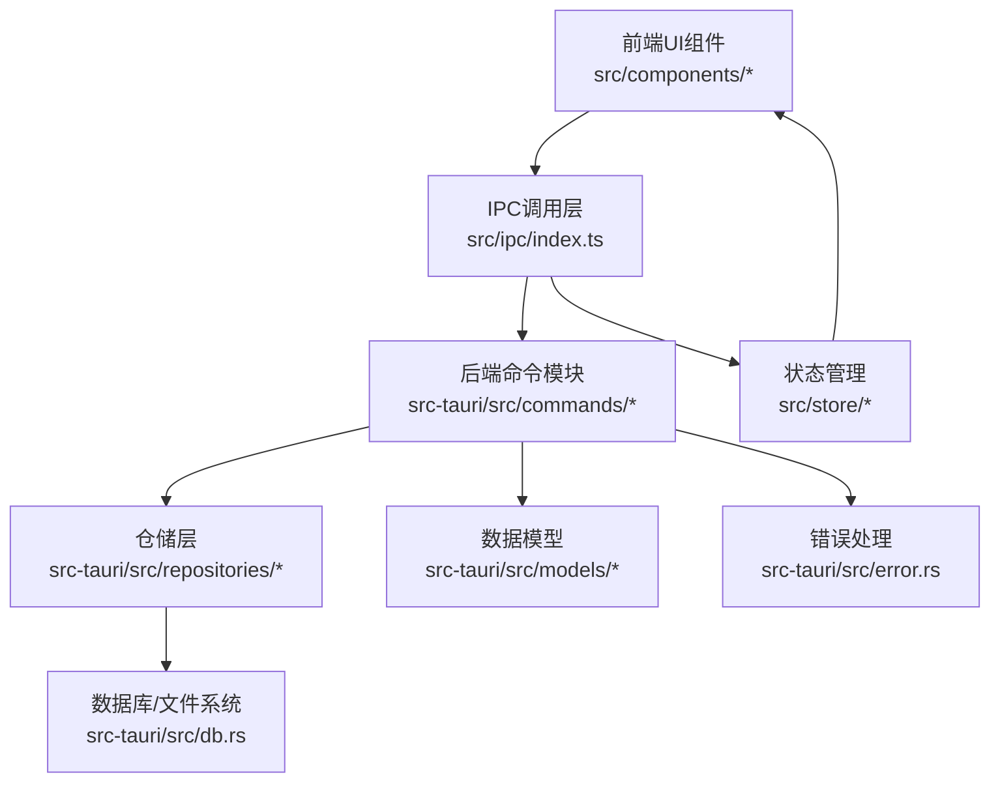
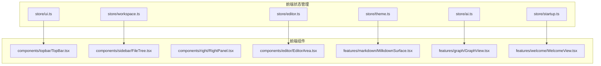
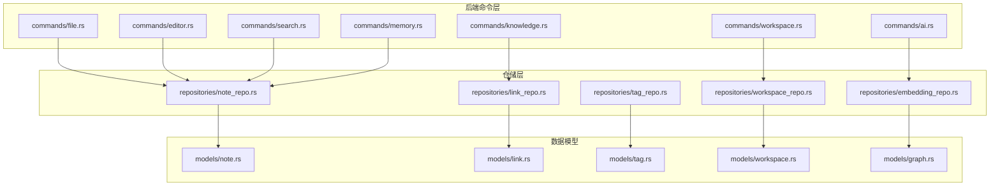
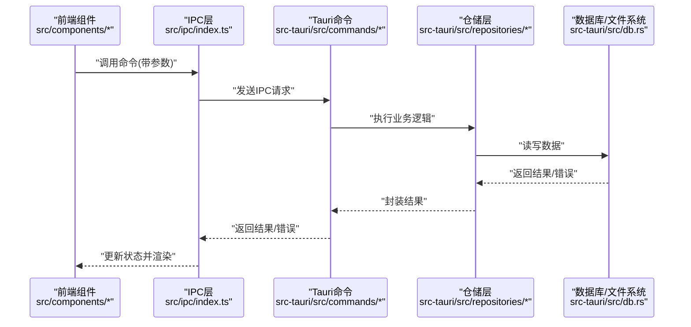
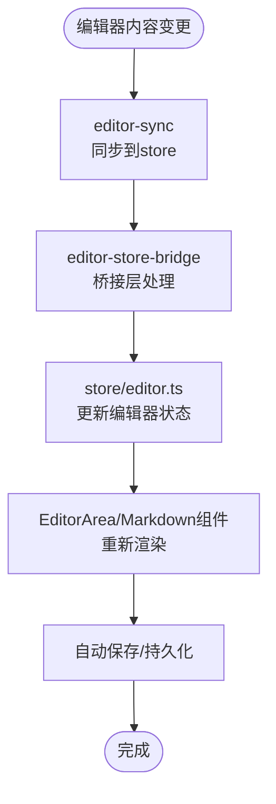
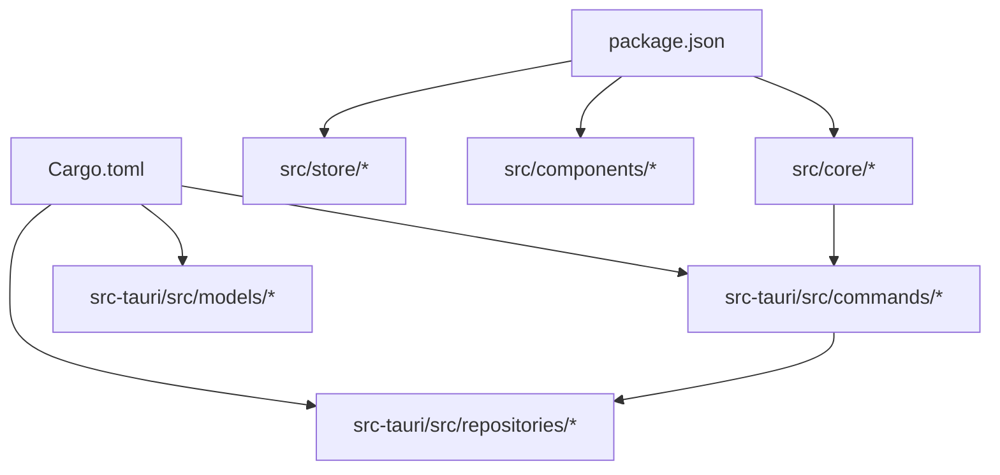

# 前后端分离设计

<cite>
**本文档引用的文件**
- [README.md](file://README.md)
- [package.json](file://package.json)
- [src/main.tsx](file://src/main.tsx)
- [src-tauri/Cargo.toml](file://src-tauri/Cargo.toml)
- [src-tauri/tauri.conf.json](file://src-tauri/tauri.conf.json)
- [src/core/index.ts](file://src/core/index.ts)
- [src/core/runtime.ts](file://src/core/runtime.ts)
- [src/core/platform/event-bus.ts](file://src/core/platform/event-bus.ts)
- [src/core/dialog/dialog-api.ts](file://src/core/dialog/dialog-api.ts)
- [src/core/dialog/dialog-service.impl.ts](file://src/core/dialog/dialog-service.impl.ts)
- [src/core/document/document-service.impl.ts](file://src/core/document/document-service.impl.ts)
- [src/core/editor/editor-host.impl.ts](file://src/core/editor/editor-host.impl.ts)
- [src/core/workbench/workbench-service.impl.ts](file://src/core/workbench/workbench-service.impl.ts)
- [src/core/vault/vault-service.impl.ts](file://src/core/vault/vault-service.impl.ts)
- [src/core/knowledge/knowledge-query.impl.ts](file://src/core/knowledge/knowledge-query.impl.ts)
- [src/core/command/command-registry.impl.ts](file://src/core/command/command-registry.impl.ts)
- [src/core/session/tab-lifecycle.ts](file://src/core/session/tab-lifecycle.ts)
- [src/core/session/workspace-draft-autosave.ts](file://src/core/session/workspace-draft-autosave.ts)
- [src/core/bridge/editor-sync.ts](file://src/core/bridge/editor-sync.ts)
- [src/core/bridge/editor-store-bridge.ts](file://src/core/bridge/editor-store-bridge.ts)
- [src/ipc/index.ts](file://src/ipc/index.ts)
- [src/ipc/stub.ts](file://src/ipc/stub.ts)
- [src/store/editor.ts](file://src/store/editor.ts)
- [src/store/workspace.ts](file://src/store/workspace.ts)
- [src/store/ui.ts](file://src/store/ui.ts)
- [src/store/theme.ts](file://src/store/theme.ts)
- [src/store/startup.ts](file://src/store/startup.ts)
- [src/store/ai.ts](file://src/store/ai.ts)
- [src/features/markdown/MilkdownSurface.tsx](file://src/features/markdown/MilkdownSurface.tsx)
- [src/features/graph/GraphView.tsx](file://src/features/graph/GraphView.tsx)
- [src/features/welcome/WelcomeView.tsx](file://src/features/welcome/WelcomeView.tsx)
- [src/components/editor/MonacoEditor.tsx](file://src/components/editor/MonacoEditor.tsx)
- [src/components/editor/EditorArea.tsx](file://src/components/editor/EditorArea.tsx)
- [src/components/sidebar/FileTree.tsx](file://src/components/sidebar/FileTree.tsx)
- [src/components/topbar/TopBar.tsx](file://src/components/topbar/TopBar.tsx)
- [src/components/right/RightPanel.tsx](file://src/components/right/RightPanel.tsx)
- [src/components/ui/Button.tsx](file://src/components/ui/Button.tsx)
- [src/hooks/useDocumentContent.ts](file://src/hooks/useDocumentContent.ts)
- [src/hooks/useShortcuts.ts](file://src/hooks/useShortcuts.ts)
- [src/lib/app-startup.ts](file://src/lib/app-startup.ts)
- [src/lib/editor-doc.ts](file://src/lib/editor-doc.ts)
- [src/lib/utils.ts](file://src/lib/utils.ts)
- [src-tauri/src/main.rs](file://src-tauri/src/main.rs)
- [src-tauri/src/lib.rs](file://src-tauri/src/lib.rs)
- [src-tauri/src/commands/mod.rs](file://src-tauri/src/commands/mod.rs)
- [src-tauri/src/models/mod.rs](file://src-tauri/src/models/mod.rs)
- [src-tauri/src/repositories/mod.rs](file://src-tauri/src/repositories/mod.rs)
- [src-tauri/src/db.rs](file://src-tauri/src/db.rs)
- [src-tauri/src/error.rs](file://src-tauri/src/error.rs)
- [src-tauri/tests/ipc_contract_tests.rs](file://src-tauri/tests/ipc_contract_tests.rs)
- [src-tauri/tests/integration_test.rs](file://src-tauri/tests/integration_test.rs)
</cite>

## 目录
1. [引言](#引言)
2. [项目结构](#项目结构)
3. [核心组件](#核心组件)
4. [架构总览](#架构总览)
5. [详细组件分析](#详细组件分析)
6. [依赖关系分析](#依赖关系分析)
7. [性能考虑](#性能考虑)
8. [故障排除指南](#故障排除指南)
9. [结论](#结论)
10. [附录](#附录)

## 引言
本文件系统性阐述NoteForge的前后端分离设计：前端采用React + TypeScript构建，后端基于Rust与Tauri框架实现桌面原生能力与跨平台运行时；通过IPC（进程间通信）在前端与后端之间建立强契约的数据通道，确保类型安全与错误处理的一致性。文档覆盖职责边界、数据传输协议、通信机制、模块化架构、状态管理与路由设计，并提供具体交互模式与最佳实践。

## 项目结构
项目采用“前端React应用 + Rust后端服务”的双工程布局，前端位于src目录，后端位于src-tauri目录。前端负责UI渲染、用户交互、状态管理与路由；后端负责文件系统操作、数据库访问、AI与知识图谱等业务逻辑，并通过Tauri暴露命令接口供前端调用。

图表来源
- [src/main.tsx:1-50](file://src/main.tsx#L1-L50)
- [src-tauri/src/main.rs:1-120](file://src-tauri/src/main.rs#L1-L120)
- [src-tauri/tauri.conf.json:1-200](file://src-tauri/tauri.conf.json#L1-L200)
- [src-tauri/Cargo.toml:1-200](file://src-tauri/Cargo.toml#L1-L200)

章节来源
- [package.json:1-100](file://package.json#L1-L100)
- [src/main.tsx:1-120](file://src/main.tsx#L1-L120)
- [src-tauri/src/main.rs:1-120](file://src-tauri/src/main.rs#L1-L120)

## 核心组件
- 前端核心模块
  - 运行时与事件总线：负责应用生命周期、事件分发与订阅。
  - 对话框系统：统一的对话框API与服务实现，支持模态与非模态交互。
  - 文档服务：文件读写、内容同步与版本控制。
  - 编辑器宿主：集成Monaco与Milkdown，提供多格式编辑体验。
  - 工作台服务：工作空间、会话与草稿管理。
  - 保险库服务：文件系统监控与索引。
  - 知识查询：图谱与搜索能力封装。
  - 命令注册表：快捷键与命令绑定。
  - 桥接层：编辑器状态与存储之间的同步桥。
  - IPC层：前端到后端的类型安全调用入口。
  - 状态管理：独立的store模块，涵盖编辑器、工作区、UI主题等。
  - 组件与特性：编辑器区域、侧边栏、右侧面板、Markdown视图、图谱视图等。
  - 钩子与工具：文档内容监听、快捷键、启动流程等。

- 后端核心模块
  - 命令模块：AI、配置、编辑器、加密、文件、知识、内存、检索、保险库、工作台会话、工作区、草稿等命令。
  - 数据模型：note、link、tag、workspace、memory、search、graph等实体定义。
  - 仓储层：笔记、链接、标签、工作区、嵌入向量等数据访问对象。
  - 数据库：SQLite/嵌入式数据库初始化与迁移。
  - 错误处理：统一错误类型与错误码映射。
  - 配置与能力：Tauri配置、能力声明与平台权限。

章节来源
- [src/core/index.ts:1-200](file://src/core/index.ts#L1-L200)
- [src/core/runtime.ts:1-120](file://src/core/runtime.ts#L1-L120)
- [src/core/platform/event-bus.ts:1-120](file://src/core/platform/event-bus.ts#L1-L120)
- [src/core/dialog/dialog-api.ts:1-120](file://src/core/dialog/dialog-api.ts#L1-L120)
- [src/core/dialog/dialog-service.impl.ts:1-200](file://src/core/dialog/dialog-service.impl.ts#L1-L200)
- [src/core/document/document-service.impl.ts:1-200](file://src/core/document/document-service.impl.ts#L1-L200)
- [src/core/editor/editor-host.impl.ts:1-200](file://src/core/editor/editor-host.impl.ts#L1-L200)
- [src/core/workbench/workbench-service.impl.ts:1-200](file://src/core/workbench/workbench-service.impl.ts#L1-L200)
- [src/core/vault/vault-service.impl.ts:1-200](file://src/core/vault/vault-service.impl.ts#L1-L200)
- [src/core/knowledge/knowledge-query.impl.ts:1-200](file://src/core/knowledge/knowledge-query.impl.ts#L1-L200)
- [src/core/command/command-registry.impl.ts:1-200](file://src/core/command/command-registry.impl.ts#L1-L200)
- [src/core/bridge/editor-sync.ts:1-200](file://src/core/bridge/editor-sync.ts#L1-L200)
- [src/core/bridge/editor-store-bridge.ts:1-200](file://src/core/bridge/editor-store-bridge.ts#L1-L200)
- [src/ipc/index.ts:1-200](file://src/ipc/index.ts#L1-L200)
- [src-tauri/src/commands/mod.rs:1-200](file://src-tauri/src/commands/mod.rs#L1-L200)
- [src-tauri/src/models/mod.rs:1-200](file://src-tauri/src/models/mod.rs#L1-L200)
- [src-tauri/src/repositories/mod.rs:1-200](file://src-tauri/src/repositories/mod.rs#L1-L200)
- [src-tauri/src/db.rs:1-200](file://src-tauri/src/db.rs#L1-L200)
- [src-tauri/src/error.rs:1-200](file://src-tauri/src/error.rs#L1-L200)

## 架构总览
NoteForge采用“前端渲染 + 后端原生”的混合架构。前端通过IPC调用后端命令，后端以结构化数据响应，前端再更新本地状态与UI。Tauri提供安全沙箱、能力声明与系统级API访问。

图表来源
- [src/ipc/index.ts:1-200](file://src/ipc/index.ts#L1-L200)
- [src-tauri/src/commands/mod.rs:1-200](file://src-tauri/src/commands/mod.rs#L1-L200)
- [src-tauri/src/repositories/mod.rs:1-200](file://src-tauri/src/repositories/mod.rs#L1-L200)
- [src-tauri/src/db.rs:1-200](file://src-tauri/src/db.rs#L1-L200)
- [src-tauri/src/error.rs:1-200](file://src-tauri/src/error.rs#L1-L200)

## 详细组件分析

### 前端模块化架构
- 组件层次
  - 顶层容器：App、SplashScreen、TopBar、Sidebar、RightPanel、EditorArea等。
  - 功能特性：Markdown编辑器、JSON/YAML树视图、图谱视图、AI面板、欢迎页等。
  - 可复用UI：Button、Dialog、Dropdown、Tooltip等。
- 状态管理
  - 独立store模块：editor、workspace、ui、theme、startup、ai等，避免全局污染。
  - 与组件解耦：通过hooks与状态订阅实现松耦合更新。
- 路由设计
  - 单页应用路由：通过特性视图切换与编辑器标签页实现页面级导航。
  - 快捷键与命令：CommandRegistry集中管理快捷键与命令执行。
- 生命周期与事件
  - Runtime与EventBus：应用启动、窗口事件、会话切换等。
  - Tab生命周期与草稿自动保存：保障数据一致性与用户体验。

图表来源
- [src/store/editor.ts:1-200](file://src/store/editor.ts#L1-L200)
- [src/store/workspace.ts:1-200](file://src/store/workspace.ts#L1-L200)
- [src/store/ui.ts:1-200](file://src/store/ui.ts#L1-L200)
- [src/store/theme.ts:1-200](file://src/store/theme.ts#L1-L200)
- [src/store/startup.ts:1-200](file://src/store/startup.ts#L1-L200)
- [src/store/ai.ts:1-200](file://src/store/ai.ts#L1-L200)
- [src/components/topbar/TopBar.tsx:1-200](file://src/components/topbar/TopBar.tsx#L1-L200)
- [src/components/sidebar/FileTree.tsx:1-200](file://src/components/sidebar/FileTree.tsx#L1-L200)
- [src/components/right/RightPanel.tsx:1-200](file://src/components/right/RightPanel.tsx#L1-L200)
- [src/components/editor/EditorArea.tsx:1-200](file://src/components/editor/EditorArea.tsx#L1-L200)
- [src/features/markdown/MilkdownSurface.tsx:1-200](file://src/features/markdown/MilkdownSurface.tsx#L1-L200)
- [src/features/graph/GraphView.tsx:1-200](file://src/features/graph/GraphView.tsx#L1-L200)
- [src/features/welcome/WelcomeView.tsx:1-200](file://src/features/welcome/WelcomeView.tsx#L1-L200)

章节来源
- [src/store/editor.ts:1-200](file://src/store/editor.ts#L1-L200)
- [src/store/workspace.ts:1-200](file://src/store/workspace.ts#L1-L200)
- [src/store/ui.ts:1-200](file://src/store/ui.ts#L1-L200)
- [src/store/theme.ts:1-200](file://src/store/theme.ts#L1-L200)
- [src/store/startup.ts:1-200](file://src/store/startup.ts#L1-L200)
- [src/store/ai.ts:1-200](file://src/store/ai.ts#L1-L200)
- [src/components/editor/EditorArea.tsx:1-200](file://src/components/editor/EditorArea.tsx#L1-L200)
- [src/features/markdown/MilkdownSurface.tsx:1-200](file://src/features/markdown/MilkdownSurface.tsx#L1-L200)
- [src/features/graph/GraphView.tsx:1-200](file://src/features/graph/GraphView.tsx#L1-L200)
- [src/features/welcome/WelcomeView.tsx:1-200](file://src/features/welcome/WelcomeView.tsx#L1-L200)

### 后端模块化设计
- 命令处理器
  - 按功能域拆分：ai、config、editor、encryption、file、knowledge、memory、search、vault_watch、workbench_session、workspace、workspace_draft等。
  - 统一返回结构：成功/失败结果类型，便于前端消费。
- 数据访问层
  - Repositories：note_repo、link_repo、tag_repo、workspace_repo、embedding_repo等，封装SQL与文件系统操作。
  - 数据模型：note、link、tag、workspace、memory、search、graph等，与数据库schema保持一致。
- 业务逻辑层
  - 知识图谱、向量检索、文件监控、会话持久化等，均通过命令调用进入后端处理。
- 错误处理
  - 统一错误枚举与错误码，便于前端识别与提示。

图表来源
- [src-tauri/src/commands/mod.rs:1-200](file://src-tauri/src/commands/mod.rs#L1-L200)
- [src-tauri/src/repositories/mod.rs:1-200](file://src-tauri/src/repositories/mod.rs#L1-L200)
- [src-tauri/src/models/mod.rs:1-200](file://src-tauri/src/models/mod.rs#L1-L200)

章节来源
- [src-tauri/src/commands/mod.rs:1-200](file://src-tauri/src/commands/mod.rs#L1-L200)
- [src-tauri/src/repositories/mod.rs:1-200](file://src-tauri/src/repositories/mod.rs#L1-L200)
- [src-tauri/src/models/mod.rs:1-200](file://src-tauri/src/models/mod.rs#L1-L200)

### Tauri桥接与IPC
- IPC消息传递
  - 前端通过src/ipc/index.ts发起调用，后端在src-tauri/src/commands/*中注册对应命令。
  - 调用路径：前端组件 → IPC层 → Tauri命令 → 仓储层 → 数据库/文件系统。
- 类型安全保证
  - 使用Tauri生成的schemas与capabilities，确保命令签名与参数类型在编译期校验。
  - 后端错误类型映射到前端可识别的结果结构。
- 错误处理
  - 前端捕获后端返回的错误并进行UI提示或重试策略。
  - 后端统一错误枚举，便于前端分支处理。

图表来源
- [src/ipc/index.ts:1-200](file://src/ipc/index.ts#L1-L200)
- [src-tauri/src/commands/mod.rs:1-200](file://src-tauri/src/commands/mod.rs#L1-L200)
- [src-tauri/src/repositories/mod.rs:1-200](file://src-tauri/src/repositories/mod.rs#L1-L200)
- [src-tauri/src/db.rs:1-200](file://src-tauri/src/db.rs#L1-L200)

章节来源
- [src/ipc/index.ts:1-200](file://src/ipc/index.ts#L1-L200)
- [src-tauri/src/commands/mod.rs:1-200](file://src-tauri/src/commands/mod.rs#L1-L200)
- [src-tauri/src/repositories/mod.rs:1-200](file://src-tauri/src/repositories/mod.rs#L1-L200)
- [src-tauri/src/db.rs:1-200](file://src-tauri/src/db.rs#L1-L200)

### 编辑器桥接与状态同步
- 编辑器桥接
  - editor-sync与editor-store-bridge负责编辑器内容与前端store之间的双向同步。
  - 支持实时协作与草稿保存，减少冲突与丢失。
- 状态同步机制
  - 通过事件总线与store订阅，确保编辑器状态变更即时反映到UI与其他模块。

图表来源
- [src/core/bridge/editor-sync.ts:1-200](file://src/core/bridge/editor-sync.ts#L1-L200)
- [src/core/bridge/editor-store-bridge.ts:1-200](file://src/core/bridge/editor-store-bridge.ts#L1-L200)
- [src/store/editor.ts:1-200](file://src/store/editor.ts#L1-L200)
- [src/components/editor/EditorArea.tsx:1-200](file://src/components/editor/EditorArea.tsx#L1-L200)

章节来源
- [src/core/bridge/editor-sync.ts:1-200](file://src/core/bridge/editor-sync.ts#L1-L200)
- [src/core/bridge/editor-store-bridge.ts:1-200](file://src/core/bridge/editor-store-bridge.ts#L1-L200)
- [src/store/editor.ts:1-200](file://src/store/editor.ts#L1-L200)
- [src/components/editor/EditorArea.tsx:1-200](file://src/components/editor/EditorArea.tsx#L1-L200)

### 典型交互模式
- 异步调用
  - 前端发起IPC调用后等待Promise结果，期间显示加载状态。
  - 后端命令完成后返回结果，前端更新store并触发UI刷新。
- 回调处理
  - 对话框API与服务实现提供回调接口，用于确认/取消等交互。
- 状态同步
  - 编辑器内容变更通过桥接层同步至store，其他模块订阅该状态以保持UI一致性。

章节来源
- [src/core/dialog/dialog-api.ts:1-200](file://src/core/dialog/dialog-api.ts#L1-L200)
- [src/core/dialog/dialog-service.impl.ts:1-200](file://src/core/dialog/dialog-service.impl.ts#L1-L200)
- [src/core/bridge/editor-sync.ts:1-200](file://src/core/bridge/editor-sync.ts#L1-L200)

## 依赖关系分析
- 前端依赖
  - React生态：Vite、TailwindCSS、Monaco Editor、Milkdown等。
  - 应用内模块：core、store、components、features、hooks、lib。
- 后端依赖
  - Rust生态：Tauri、SQLite、Tokio、Serde等。
  - 内部模块：commands、models、repositories、db、error。
- IPC契约
  - 前后端通过命令名称与参数结构严格约定，测试用例验证IPC契约一致性。

图表来源
- [package.json:1-200](file://package.json#L1-L200)
- [src-tauri/Cargo.toml:1-200](file://src-tauri/Cargo.toml#L1-L200)

章节来源
- [package.json:1-200](file://package.json#L1-L200)
- [src-tauri/Cargo.toml:1-200](file://src-tauri/Cargo.toml#L1-L200)

## 性能考虑
- 前端
  - 组件按需加载与懒渲染，减少初始包体与首屏时间。
  - 状态分片与局部更新，避免全量重渲染。
  - 编辑器桥接层采用增量同步，降低频繁写入开销。
- 后端
  - 仓储层使用连接池与事务批量提交，提升IO吞吐。
  - 搜索与向量检索使用索引与缓存，缩短响应时间。
- IPC
  - 大数据分块传输与流式处理，避免阻塞主线程。
  - 错误快速失败与重试退避，提升鲁棒性。

## 故障排除指南
- IPC调用失败
  - 检查命令名称是否匹配，参数结构是否符合后端定义。
  - 查看后端错误日志与错误码映射，定位具体异常。
- 编辑器不同步
  - 确认editor-sync与editor-store-bridge是否正常工作。
  - 检查store订阅链路与事件总线状态。
- 文件系统异常
  - 核对Tauri能力配置与权限声明。
  - 检查仓储层SQL执行与事务回滚情况。

章节来源
- [src-tauri/src/error.rs:1-200](file://src-tauri/src/error.rs#L1-L200)
- [src-tauri/tests/ipc_contract_tests.rs:1-200](file://src-tauri/tests/ipc_contract_tests.rs#L1-L200)
- [src-tauri/tests/integration_test.rs:1-200](file://src-tauri/tests/integration_test.rs#L1-L200)

## 结论
NoteForge通过清晰的前后端职责边界、严格的IPC契约与类型安全、以及模块化的状态与业务分层，实现了高性能、可维护且跨平台的桌面应用。前端专注于用户体验与交互，后端专注数据与业务逻辑，二者通过Tauri桥接实现高效协同。建议持续完善测试覆盖与错误监控，优化大文件与复杂查询场景的性能表现。

## 附录
- 关键文件速览
  - 前端入口与配置：src/main.tsx、package.json
  - 后端入口与配置：src-tauri/src/main.rs、src-tauri/tauri.conf.json、src-tauri/Cargo.toml
  - IPC与桥接：src/ipc/index.ts、src/core/bridge/*
  - 核心服务：src/core/*、src/store/*
  - 后端命令与仓储：src-tauri/src/commands/*、src-tauri/src/repositories/*