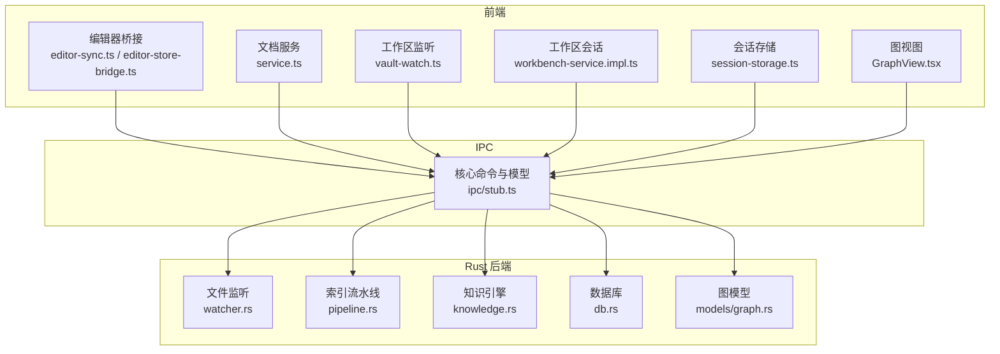
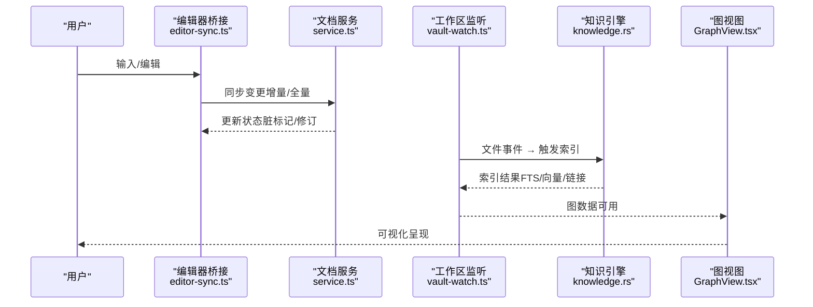
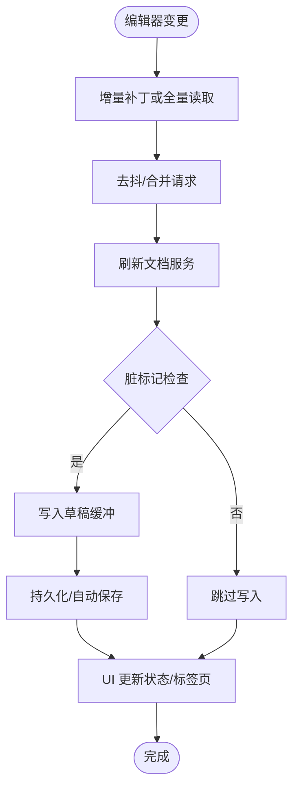
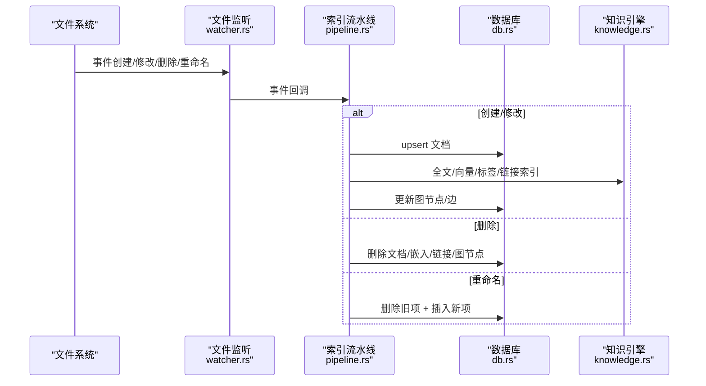
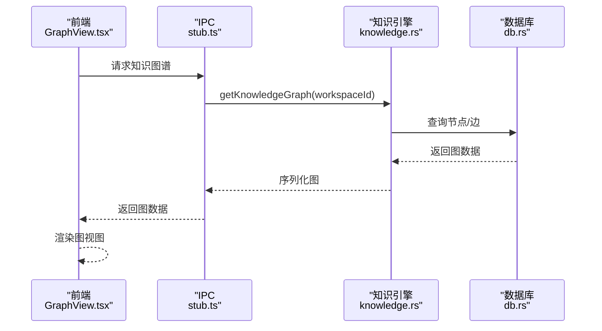
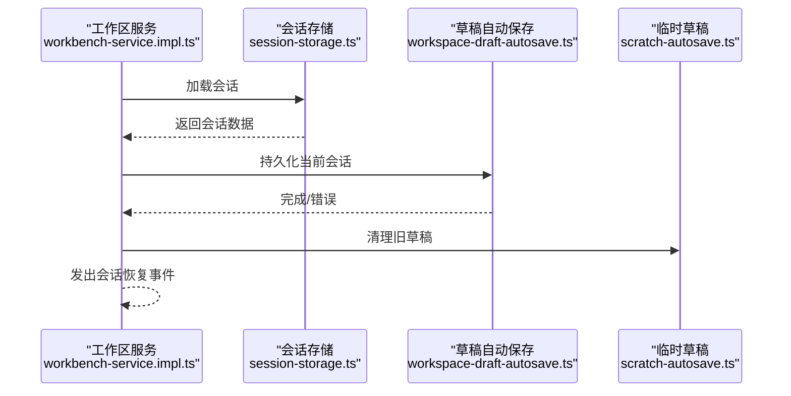
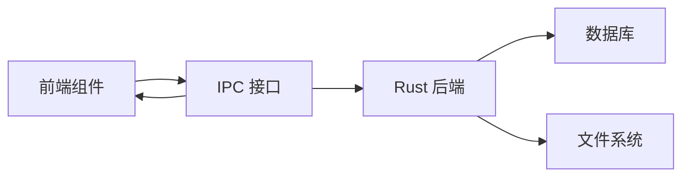

# 数据流分析

<cite>
**本文引用的文件**
- [src/core/bridge/editor-sync.ts](file://src/core/bridge/editor-sync.ts)
- [src/core/bridge/editor-store-bridge.ts](file://src/core/bridge/editor-store-bridge.ts)
- [src/core/document/service.ts](file://src/core/document/service.ts)
- [src/core/vault/vault-service.impl.ts](file://src/core/vault/vault-service.impl.ts)
- [src/core/vault/vault-watch.ts](file://src/core/vault/vault-watch.ts)
- [src/core/vault/service.ts](file://src/core/vault/service.ts)
- [src/core/workbench/workbench-service.impl.ts](file://src/core/workbench/workbench-service.impl.ts)
- [src/core/workbench/session-storage.ts](file://src/core/workbench/session-storage.ts)
- [src/core/session/workspace-draft-autosave.ts](file://src/core/session/workspace-draft-autosave.ts)
- [src/core/session/scratch-autosave.ts](file://src/core/session/scratch-autosave.ts)
- [src/core/knowledge/knowledge-query.impl.ts](file://src/core/knowledge/knowledge-query.impl.ts)
- [src/features/graph/GraphView.tsx](file://src/features/graph/GraphView.tsx)
- [src/ipc/stub.ts](file://src/ipc/stub.ts)
- [src-tauri/src/models/graph.rs](file://src-tauri/src/models/graph.rs)
- [src-tauri/src/watcher.rs](file://src-tauri/src/watcher.rs)
- [src-tauri/src/pipeline.rs](file://src-tauri/src/pipeline.rs)
- [src-tauri/src/knowledge.rs](file://src-tauri/src/knowledge.rs)
- [src-tauri/src/db.rs](file://src-tauri/src/db.rs)
- [src-tauri/tests/ipc_contract_tests.rs](file://src-tauri/tests/ipc_contract_tests.rs)
- [src-tauri/tests/dataflow_tests.rs](file://src-tauri/tests/dataflow_tests.rs)
- [.tmp/system-architecture-design.md](file://.tmp/system-architecture-design.md)
- [.tmp/noteforgeChat.md](file://.tmp/noteforgeChat.md)
</cite>

## 目录
1. [简介](#简介)
2. [项目结构](#项目结构)
3. [核心组件](#核心组件)
4. [架构总览](#架构总览)
5. [详细组件分析](#详细组件分析)
6. [依赖分析](#依赖分析)
7. [性能考虑](#性能考虑)
8. [故障排查指南](#故障排查指南)
9. [结论](#结论)
10. [附录](#附录)

## 简介
本文件针对 NoteForge 的数据流进行系统性分析，覆盖以下关键主题：
- 用户输入到 UI 更新的端到端数据路径
- 编辑器内容同步机制（实时编辑状态、冲突检测与版本控制）
- 知识图谱数据的构建与更新（从文件扫描到图结构生成的完整数据管道）
- 会话持久化（自动保存、工作区状态存储与恢复）
- 异步操作时序与并发控制
- 数据流优化策略（增量更新、缓存、性能监控）
- 数据一致性保证与错误恢复机制

## 项目结构
NoteForge 采用前端 React/Tauri 架构，核心数据流由前端 Store/Service 与 Rust 后端 IPC 交互构成。前端负责 UI 与用户交互，Rust 负责文件系统监听、全文检索、向量索引、知识图谱与数据库持久化。

**图表来源**
- [src/core/bridge/editor-sync.ts](file://src/core/bridge/editor-sync.ts)
- [src/core/bridge/editor-store-bridge.ts](file://src/core/bridge/editor-store-bridge.ts)
- [src/core/document/service.ts](file://src/core/document/service.ts)
- [src/core/vault/vault-watch.ts](file://src/core/vault/vault-watch.ts)
- [src/core/workbench/workbench-service.impl.ts](file://src/core/workbench/workbench-service.impl.ts)
- [src/core/workbench/session-storage.ts](file://src/core/workbench/session-storage.ts)
- [src/features/graph/GraphView.tsx](file://src/features/graph/GraphView.tsx)
- [src/ipc/stub.ts](file://src/ipc/stub.ts)
- [src-tauri/src/watcher.rs](file://src-tauri/src/watcher.rs)
- [src-tauri/src/pipeline.rs](file://src-tauri/src/pipeline.rs)
- [src-tauri/src/knowledge.rs](file://src-tauri/src/knowledge.rs)
- [src-tauri/src/db.rs](file://src-tauri/src/db.rs)
- [src-tauri/src/models/graph.rs](file://src-tauri/src/models/graph.rs)

**章节来源**
- [src/core/bridge/editor-sync.ts](file://src/core/bridge/editor-sync.ts)
- [src/core/bridge/editor-store-bridge.ts](file://src/core/bridge/editor-store-bridge.ts)
- [src/core/document/service.ts](file://src/core/document/service.ts)
- [src/core/vault/vault-watch.ts](file://src/core/vault/vault-watch.ts)
- [src/core/workbench/workbench-service.impl.ts](file://src/core/workbench/workbench-service.impl.ts)
- [src/core/workbench/session-storage.ts](file://src/core/workbench/session-storage.ts)
- [src/features/graph/GraphView.tsx](file://src/features/graph/GraphView.tsx)
- [src/ipc/stub.ts](file://src/ipc/stub.ts)
- [src-tauri/src/watcher.rs](file://src-tauri/src/watcher.rs)
- [src-tauri/src/pipeline.rs](file://src-tauri/src/pipeline.rs)
- [src-tauri/src/knowledge.rs](file://src-tauri/src/knowledge.rs)
- [src-tauri/src/db.rs](file://src-tauri/src/db.rs)
- [src-tauri/src/models/graph.rs](file://src-tauri/src/models/graph.rs)

## 核心组件
- 编辑器桥接层：负责将 Monaco 编辑器的变更通过增量补丁或全量读取方式同步至文档服务，并驱动 UI 更新。
- 文档服务：抽象文件内容与元数据，管理草稿、语言、修订版本与持久化。
- 工作区监听：基于文件系统事件（创建/修改/删除/重命名）触发索引与图谱更新。
- 知识图谱：从笔记内容提取链接，构建节点与边，提供查询与可视化。
- 会话持久化：工作区会话、草稿自动保存与恢复，确保崩溃后可恢复。
- IPC 与模型：定义前后端通信协议与数据模型，保障类型安全与契约一致。

**章节来源**
- [src/core/bridge/editor-sync.ts](file://src/core/bridge/editor-sync.ts)
- [src/core/document/service.ts](file://src/core/document/service.ts)
- [src/core/vault/vault-watch.ts](file://src/core/vault/vault-watch.ts)
- [src/core/knowledge/knowledge-query.impl.ts](file://src/core/knowledge/knowledge-query.impl.ts)
- [src/core/workbench/workbench-service.impl.ts](file://src/core/workbench/workbench-service.impl.ts)
- [src/core/session/workspace-draft-autosave.ts](file://src/core/session/workspace-draft-autosave.ts)
- [src/ipc/stub.ts](file://src/ipc/stub.ts)
- [src-tauri/src/models/graph.rs](file://src-tauri/src/models/graph.rs)

## 架构总览
NoteForge 的数据流以“前端 Store/Service → IPC → Rust 后端”的分层架构为核心，结合文件系统事件驱动的增量索引与知识图谱更新，形成闭环的数据管道。

**图表来源**
- [src/core/bridge/editor-sync.ts](file://src/core/bridge/editor-sync.ts)
- [src/core/document/service.ts](file://src/core/document/service.ts)
- [src/core/vault/vault-watch.ts](file://src/core/vault/vault-watch.ts)
- [src/core/knowledge/knowledge-query.impl.ts](file://src/core/knowledge/knowledge-query.impl.ts)
- [src/features/graph/GraphView.tsx](file://src/features/graph/GraphView.tsx)

## 详细组件分析

### 编辑器内容同步机制
- 实时编辑状态：编辑器通过增量补丁或定时全量读取，避免将整文件内容驻留于前端状态层，降低内存与重渲染开销。
- 脏标记与版本控制：基于文档修订号与已保存修订号对比，确定是否显示“未保存”指示；支持草稿缓冲与自动保存。
- 并发与去抖：对频繁变更进行去抖处理，合并写入请求，减少 I/O 压力。

**图表来源**
- [src/core/bridge/editor-sync.ts](file://src/core/bridge/editor-sync.ts)
- [src/core/document/service.ts](file://src/core/document/service.ts)
- [src/core/session/workspace-draft-autosave.ts](file://src/core/session/workspace-draft-autosave.ts)
- [.tmp/noteforgeChat.md](file://.tmp/noteforgeChat.md)

**章节来源**
- [src/core/bridge/editor-sync.ts](file://src/core/bridge/editor-sync.ts)
- [src/core/bridge/editor-store-bridge.ts](file://src/core/bridge/editor-store-bridge.ts)
- [src/core/document/service.ts](file://src/core/document/service.ts)
- [src/core/session/workspace-draft-autosave.ts](file://src/core/session/workspace-draft-autosave.ts)
- [.tmp/noteforgeChat.md](file://.tmp/noteforgeChat.md)

### 文件系统变更通知与索引流水线
- 文件监听：Rust 使用 notify 库递归监听工作区目录，区分创建/修改/删除/重命名事件。
- 增量索引：根据事件类型调用索引流水线，执行 upsert、全文索引、向量嵌入、标签与链接抽取、图节点/边同步。
- 一致性与错误处理：批量处理时收集错误，保留成功索引；删除/重命名事件清理对应索引与图节点。

**图表来源**
- [src-tauri/src/watcher.rs](file://src-tauri/src/watcher.rs)
- [src-tauri/src/pipeline.rs](file://src-tauri/src/pipeline.rs)
- [src-tauri/src/db.rs](file://src-tauri/src/db.rs)
- [src-tauri/src/knowledge.rs](file://src-tauri/src/knowledge.rs)
- [.tmp/system-architecture-design.md](file://.tmp/system-architecture-design.md)

**章节来源**
- [src-tauri/src/watcher.rs](file://src-tauri/src/watcher.rs)
- [src-tauri/src/pipeline.rs](file://src-tauri/src/pipeline.rs)
- [src-tauri/src/db.rs](file://src-tauri/src/db.rs)
- [src-tauri/src/knowledge.rs](file://src-tauri/src/knowledge.rs)
- [.tmp/system-architecture-design.md](file://.tmp/system-architecture-design.md)

### 知识图谱数据构建与更新
- 数据来源：遍历工作区 Markdown 文件，提取 wiki 链接与 Markdown 链接，构建节点与边。
- 模型定义：图节点/边包含标识、类型、权重与属性，便于后续查询与可视化。
- 查询与可视化：前端通过 IPC 获取图数据，GraphView 渲染力导向布局，支持过滤与缩放。

**图表来源**
- [src/features/graph/GraphView.tsx](file://src/features/graph/GraphView.tsx)
- [src/ipc/stub.ts](file://src/ipc/stub.ts)
- [src-tauri/src/knowledge.rs](file://src-tauri/src/knowledge.rs)
- [src-tauri/src/db.rs](file://src-tauri/src/db.rs)
- [src-tauri/src/models/graph.rs](file://src-tauri/src/models/graph.rs)

**章节来源**
- [src/features/graph/GraphView.tsx](file://src/features/graph/GraphView.tsx)
- [src/ipc/stub.ts](file://src/ipc/stub.ts)
- [src-tauri/src/models/graph.rs](file://src-tauri/src/models/graph.rs)
- [src-tauri/src/knowledge.rs](file://src-tauri/src/knowledge.rs)
- [src-tauri/src/db.rs](file://src-tauri/src/db.rs)

### 会话持久化与恢复
- 工作区会话：保存打开的标签页、视图状态与工作区根路径；支持 Tauri 本地存储与浏览器本地存储。
- 草稿自动保存：对脏文档进行去抖与并发控制，批量写入草稿缓冲，崩溃后可恢复。
- 恢复流程：启动时加载会话，若存在则重建编辑器状态；失败时保持现有状态不变。

**图表来源**
- [src/core/workbench/workbench-service.impl.ts](file://src/core/workbench/workbench-service.impl.ts)
- [src/core/workbench/session-storage.ts](file://src/core/workbench/session-storage.ts)
- [src/core/session/workspace-draft-autosave.ts](file://src/core/session/workspace-draft-autosave.ts)
- [src/core/session/scratch-autosave.ts](file://src/core/session/scratch-autosave.ts)

**章节来源**
- [src/core/workbench/workbench-service.impl.ts](file://src/core/workbench/workbench-service.impl.ts)
- [src/core/workbench/session-storage.ts](file://src/core/workbench/session-storage.ts)
- [src/core/session/workspace-draft-autosave.ts](file://src/core/session/workspace-draft-autosave.ts)
- [src/core/session/scratch-autosave.ts](file://src/core/session/scratch-autosave.ts)

## 依赖分析
- 前端依赖 Rust 后端提供的 IPC 能力，包括文件读写、索引、搜索与图谱查询。
- 知识图谱依赖数据库中的节点/边与链接表，索引流水线负责维护这些表的一致性。
- 编辑器桥接依赖文档服务的状态与草稿缓冲，确保 UI 与底层内容保持一致。

**图表来源**
- [src/ipc/stub.ts](file://src/ipc/stub.ts)
- [src-tauri/src/db.rs](file://src-tauri/src/db.rs)
- [src-tauri/src/watcher.rs](file://src-tauri/src/watcher.rs)

**章节来源**
- [src/ipc/stub.ts](file://src/ipc/stub.ts)
- [src-tauri/src/db.rs](file://src-tauri/src/db.rs)
- [src-tauri/src/watcher.rs](file://src-tauri/src/watcher.rs)

## 性能考虑
- 增量更新：编辑器与文档服务采用增量补丁与去抖策略，避免全量内容驻留前端状态层。
- 按需读取：Rust 提供按范围读取与头部读取能力，支持大文件的懒加载与草稿层存储。
- 虚拟化与降级：树形视图与大纲面板在大文件场景下可选择延迟解析或禁用联动，降低主线程压力。
- 并发控制：草稿自动保存使用去抖与并发去重，避免重复写入与竞态。

**章节来源**
- [.tmp/noteforgeChat.md](file://.tmp/noteforgeChat.md)
- [src/core/bridge/editor-sync.ts](file://src/core/bridge/editor-sync.ts)
- [src/core/session/workspace-draft-autosave.ts](file://src/core/session/workspace-draft-autosave.ts)

## 故障排查指南
- 知识图谱为空：确认工作区已建立且文件事件正常触发；检查链接提取与图同步逻辑。
- 编辑器内容未更新：检查编辑器桥接是否正确读取增量补丁或全量内容；确认文档服务的脏标记与修订号。
- 会话恢复失败：查看会话存储加载/保存日志；确认草稿缓冲与临时草稿清理流程。
- 文件监听异常：检查 Rust 监听器状态与事件回调；验证工作区根路径与排除规则。

**章节来源**
- [src-tauri/tests/ipc_contract_tests.rs](file://src-tauri/tests/ipc_contract_tests.rs)
- [src-tauri/tests/dataflow_tests.rs](file://src-tauri/tests/dataflow_tests.rs)
- [src/core/workbench/workbench-service.impl.ts](file://src/core/workbench/workbench-service.impl.ts)
- [src/core/vault/vault-service.impl.ts](file://src/core/vault/vault-service.impl.ts)

## 结论
NoteForge 的数据流以“前端桥接 + Rust 后端 + IPC 协议”为核心，围绕文档、索引、图谱与会话四大主题构建了高内聚、低耦合的数据管道。通过增量更新、按需读取、并发控制与错误恢复机制，系统在保证数据一致性的同时兼顾性能与用户体验。

## 附录
- 关键流程参考：单文档索引、批量索引与增量索引的步骤与约束
- 测试契约：知识图谱节点/边与搜索结果的契约测试

**章节来源**
- [.tmp/system-architecture-design.md](file://.tmp/system-architecture-design.md)
- [src-tauri/tests/ipc_contract_tests.rs](file://src-tauri/tests/ipc_contract_tests.rs)