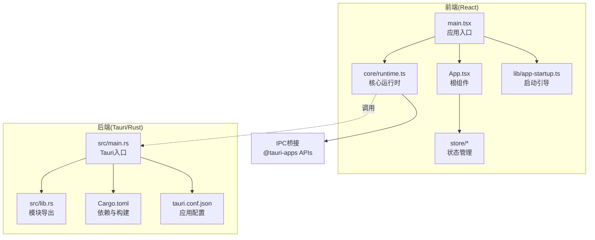
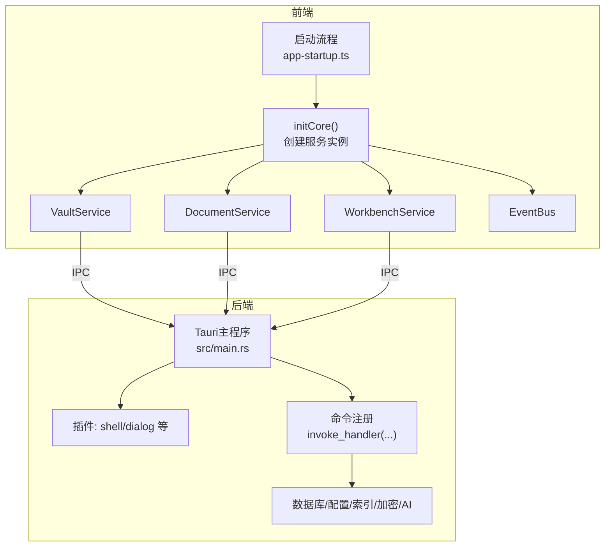
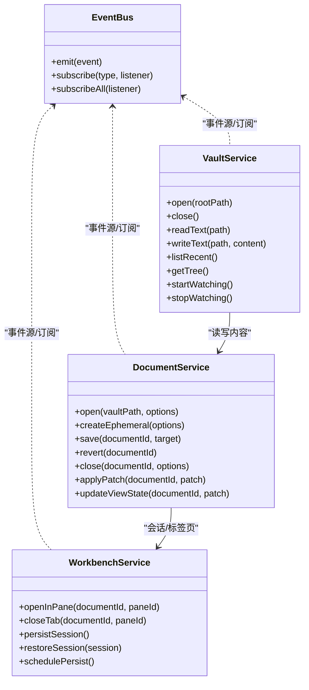
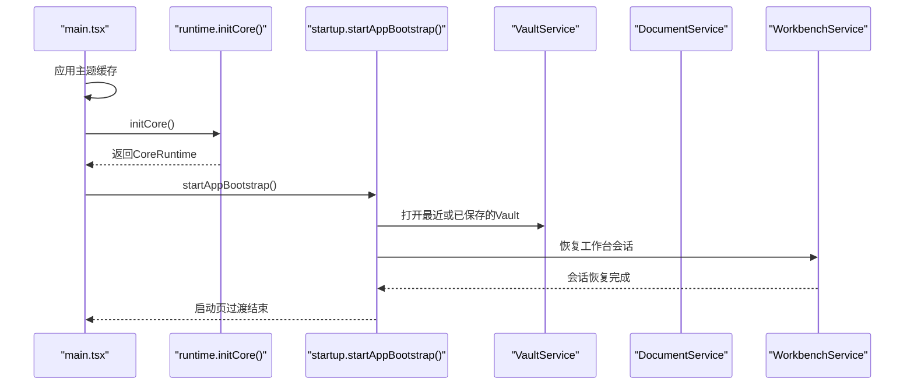
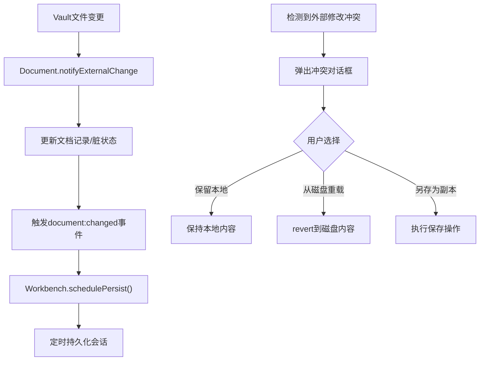
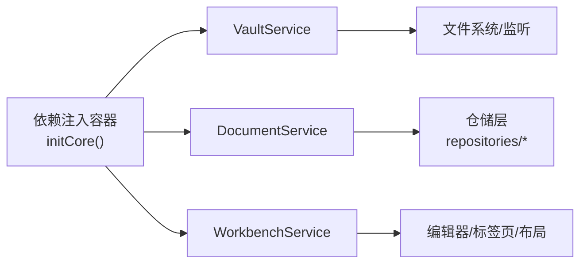
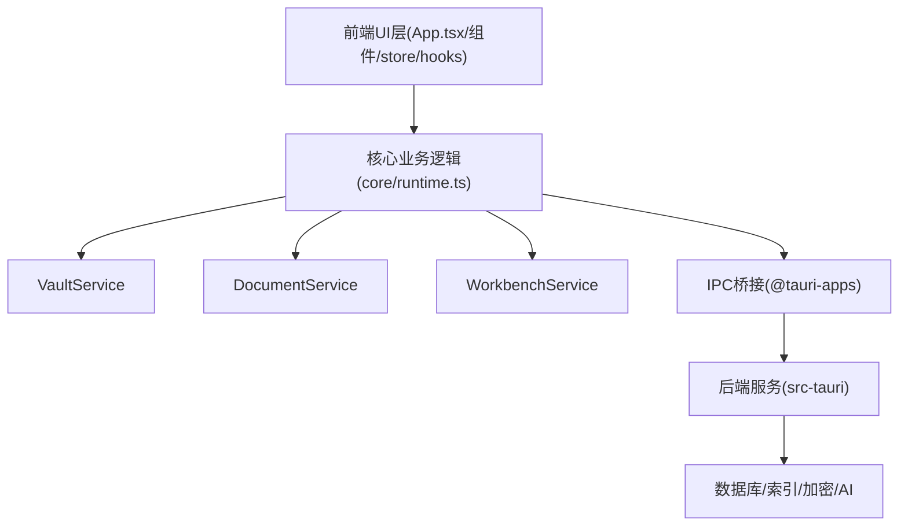
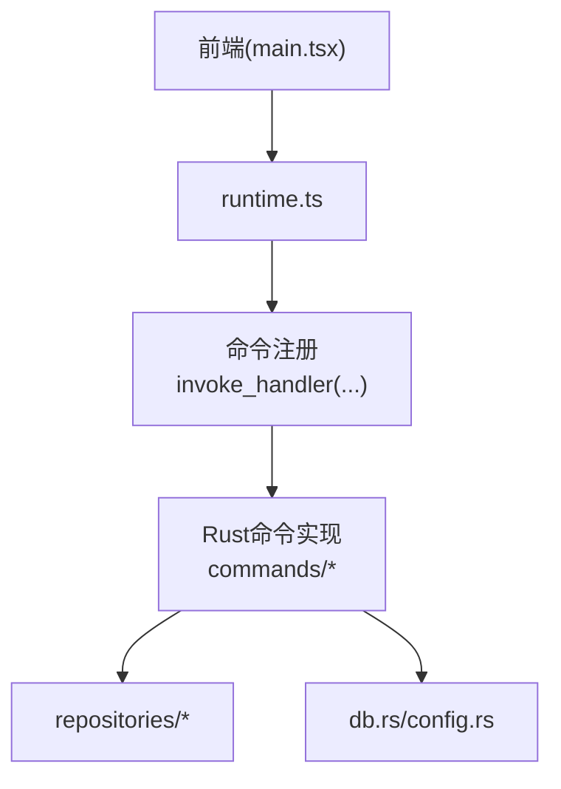

# 整体架构

<cite>
**本文引用的文件**
- [src/main.tsx](file://src/main.tsx)
- [src/App.tsx](file://src/App.tsx)
- [src/core/runtime.ts](file://src/core/runtime.ts)
- [src/core/platform/event-bus.ts](file://src/core/platform/event-bus.ts)
- [src/core/vault/vault-service.impl.ts](file://src/core/vault/vault-service.impl.ts)
- [src/core/document/document-service.impl.ts](file://src/core/document/document-service.impl.ts)
- [src/core/workbench/workbench-service.impl.ts](file://src/core/workbench/workbench-service.impl.ts)
- [src/lib/app-startup.ts](file://src/lib/app-startup.ts)
- [src-tauri/src/main.rs](file://src-tauri/src/main.rs)
- [src-tauri/Cargo.toml](file://src-tauri/Cargo.toml)
- [src-tauri/src/lib.rs](file://src-tauri/src/lib.rs)
- [src-tauri/tauri.conf.json](file://src-tauri/tauri.conf.json)
</cite>

## 目录
1. [引言](#引言)
2. [项目结构](#项目结构)
3. [核心组件](#核心组件)
4. [架构总览](#架构总览)
5. [详细组件分析](#详细组件分析)
6. [依赖分析](#依赖分析)
7. [性能考虑](#性能考虑)
8. [故障排查指南](#故障排查指南)
9. [结论](#结论)
10. [附录](#附录)

## 引言
本文件面向NoteForge的整体架构，围绕基于Tauri v2的“前后端分离”设计展开：前端采用React应用，后端由Rust实现并通过IPC桥接调用。文档重点阐述核心运行时系统的初始化流程（含依赖注入容器、服务实例创建顺序与生命周期管理）、关键设计模式（事件驱动、依赖注入、仓储模式等）、系统边界与职责划分、数据流与控制流，并给出架构图示与性能/可扩展性建议。

## 项目结构
NoteForge采用典型的“前端React + 后端Tauri(Rust)”分层组织：
- 前端层（src/）：React应用、UI组件、状态存储、启动与生命周期钩子、核心运行时与服务封装。
- 后端层（src-tauri/）：Tauri入口、命令注册、数据库/配置/索引等后端能力、模型与仓库模块。

**图表来源**
- [src/main.tsx:1-24](file://src/main.tsx#L1-L24)
- [src/App.tsx:1-111](file://src/App.tsx#L1-L111)
- [src/core/runtime.ts:1-191](file://src/core/runtime.ts#L1-L191)
- [src/lib/app-startup.ts:1-75](file://src/lib/app-startup.ts#L1-L75)
- [src-tauri/src/main.rs:1-101](file://src-tauri/src/main.rs#L1-L101)
- [src-tauri/src/lib.rs:1-16](file://src-tauri/src/lib.rs#L1-L16)
- [src-tauri/Cargo.toml:1-40](file://src-tauri/Cargo.toml#L1-L40)
- [src-tauri/tauri.conf.json:1-40](file://src-tauri/tauri.conf.json#L1-L40)

**章节来源**
- [src/main.tsx:1-24](file://src/main.tsx#L1-L24)
- [src-tauri/src/main.rs:1-101](file://src-tauri/src/main.rs#L1-L101)

## 核心组件
- 事件总线（EventBus）：提供全局事件发布/订阅，贯穿Vault、Document、Workbench等服务。
- Vault服务：抽象知识库（Vault）的读写、树形浏览、文件变更监听与持久化上下文。
- 文档服务（DocumentService）：文档打开/关闭/保存、冲突检测与解决、视图状态管理、草稿与自动保存集成。
- 工作台服务（WorkbenchService）：多面板/标签页布局、会话持久化与恢复、UI布局同步。
- 核心运行时（Core Runtime）：集中初始化与装配上述服务，建立事件联动与生命周期钩子。
- 启动流程（App Startup）：主题加载 → 工作区打开 → 会话恢复 → 模型加载 → 展示启动页过渡。

**章节来源**
- [src/core/platform/event-bus.ts:1-37](file://src/core/platform/event-bus.ts#L1-L37)
- [src/core/vault/vault-service.impl.ts:1-314](file://src/core/vault/vault-service.impl.ts#L1-L314)
- [src/core/document/document-service.impl.ts:1-466](file://src/core/document/document-service.impl.ts#L1-L466)
- [src/core/workbench/workbench-service.impl.ts:1-505](file://src/core/workbench/workbench-service.impl.ts#L1-L505)
- [src/core/runtime.ts:1-191](file://src/core/runtime.ts#L1-L191)
- [src/lib/app-startup.ts:1-75](file://src/lib/app-startup.ts#L1-L75)

## 架构总览
NoteForge采用“前端事件驱动 + 后端IPC命令”的架构。前端通过核心运行时统一调度服务；后端在Tauri Builder中注册命令，提供文件系统、数据库、索引、加密、AI等能力。IPC桥接使用@tauri-apps插件与原生对话框等能力。

**图表来源**
- [src/core/runtime.ts:43-100](file://src/core/runtime.ts#L43-L100)
- [src/lib/app-startup.ts:32-74](file://src/lib/app-startup.ts#L32-L74)
- [src-tauri/src/main.rs:6-98](file://src-tauri/src/main.rs#L6-L98)

## 详细组件分析

### 核心运行时系统（依赖注入容器与生命周期）
- 容器式装配：initCore集中创建EventBus、Vault、Document、Workbench、命令注册、对话框、知识查询、编辑器宿主等服务实例，并建立事件订阅链路。
- 生命周期钩子：对文档变更、关闭、冲突等事件进行响应，触发工作台持久化、自动保存调度、编辑器同步等。
- 服务间耦合：Vault负责磁盘与变更通知；Document负责内容与冲突；Workbench负责布局与会话；EventBus作为粘合层。

**图表来源**
- [src/core/platform/event-bus.ts:3-36](file://src/core/platform/event-bus.ts#L3-L36)
- [src/core/vault/vault-service.impl.ts:101-310](file://src/core/vault/vault-service.impl.ts#L101-L310)
- [src/core/document/document-service.impl.ts:136-437](file://src/core/document/document-service.impl.ts#L136-L437)
- [src/core/workbench/workbench-service.impl.ts:138-416](file://src/core/workbench/workbench-service.impl.ts#L138-L416)

**章节来源**
- [src/core/runtime.ts:43-100](file://src/core/runtime.ts#L43-L100)
- [src/core/runtime.ts:102-191](file://src/core/runtime.ts#L102-L191)

### 启动流程（初始化顺序与控制流）
- 前端入口顺序：应用主题缓存应用 → 初始化核心运行时 → 安装应用生命周期钩子 → 启动引导（主题/工作区/会话）→ 渲染根组件。
- 启动步骤：主题加载 → 最近工作区/会话恢复 → 会话恢复完成标记 → 可选AI模型加载 → 启动页淡出。
- 关键事件：Vault打开、Document打开/保存、Workbench会话持久化均通过事件驱动串联。

**图表来源**
- [src/main.tsx:12-15](file://src/main.tsx#L12-L15)
- [src/core/runtime.ts:43-100](file://src/core/runtime.ts#L43-L100)
- [src/lib/app-startup.ts:32-74](file://src/lib/app-startup.ts#L32-L74)

**章节来源**
- [src/main.tsx:12-23](file://src/main.tsx#L12-L23)
- [src/lib/app-startup.ts:31-74](file://src/lib/app-startup.ts#L31-L74)

### 事件驱动架构与关键事件流
- 事件总线：支持通配与类型订阅，所有服务通过它解耦通信。
- 典型事件链：
  - Vault文件变更 → Document外部变更通知 → 更新记录与脏状态 → 触发工作台持久化调度。
  - 文档关闭 → 移除编辑器标签 → 触发工作台持久化。
  - 文档冲突（外部修改）→ 对话框提示 → 用户选择策略（保留本地/从磁盘重载/另存为副本）。

**图表来源**
- [src/core/platform/event-bus.ts:7-35](file://src/core/platform/event-bus.ts#L7-L35)
- [src/core/document/document-service.impl.ts:439-462](file://src/core/document/document-service.impl.ts#L439-L462)
- [src/core/workbench/workbench-service.impl.ts:407-414](file://src/core/workbench/workbench-service.impl.ts#L407-L414)
- [src/core/runtime.ts:66-96](file://src/core/runtime.ts#L66-L96)

**章节来源**
- [src/core/platform/event-bus.ts:1-37](file://src/core/platform/event-bus.ts#L1-L37)
- [src/core/document/document-service.impl.ts:439-462](file://src/core/document/document-service.impl.ts#L439-L462)
- [src/core/workbench/workbench-service.impl.ts:377-414](file://src/core/workbench/workbench-service.impl.ts#L377-L414)
- [src/core/runtime.ts:66-96](file://src/core/runtime.ts#L66-L96)

### 依赖注入模式与仓储模式
- 依赖注入：initCore以工厂函数方式创建服务实例，传入EventBus等依赖，避免硬编码耦合；服务内部通过事件总线解耦。
- 仓储模式：后端src-tauri/src/repositories下定义Note/Tag/Link/Workspace等仓储接口与实现，配合数据库访问与向量索引，支撑知识检索与链接提取等能力。

**图表来源**
- [src/core/runtime.ts:46-63](file://src/core/runtime.ts#L46-L63)
- [src-tauri/src/lib.rs:11-16](file://src-tauri/src/lib.rs#L11-L16)

**章节来源**
- [src/core/runtime.ts:43-100](file://src/core/runtime.ts#L43-L100)
- [src-tauri/src/lib.rs:11-16](file://src-tauri/src/lib.rs#L11-L16)

### 系统边界与职责划分
- 前端UI层：App.tsx及其组件负责布局、状态与交互；store/*负责状态持久化；hooks提供快捷键与拖拽等横切能力。
- 核心业务逻辑层：core/runtime.ts与各服务实现业务编排与规则（文档打开/保存/冲突处理、工作台布局与会话）。
- 后端服务层：src-tauri/src/main.rs注册命令，提供文件系统、数据库、索引、加密、AI等底层能力；通过IPC桥接到前端。

**图表来源**
- [src/App.tsx:25-110](file://src/App.tsx#L25-L110)
- [src/core/runtime.ts:29-38](file://src/core/runtime.ts#L29-L38)
- [src-tauri/src/main.rs:19-97](file://src-tauri/src/main.rs#L19-L97)

**章节来源**
- [src/App.tsx:25-110](file://src/App.tsx#L25-L110)
- [src/core/runtime.ts:29-38](file://src/core/runtime.ts#L29-L38)
- [src-tauri/src/main.rs:19-97](file://src-tauri/src/main.rs#L19-L97)

## 依赖分析
- 前端依赖：React、@tauri-apps插件（shell/dialog）、Monaco编辑器、Tailwind等；通过Vite构建。
- 后端依赖：Tauri v2、tokio、rusqlite、notify、fastembed、regex、tracing等；以lib crate形式暴露命令与能力。
- IPC契约：前端通过invoke_handler注册的命令与后端命令一一对应，形成稳定的跨语言调用面。

**图表来源**
- [src-tauri/src/main.rs:19-97](file://src-tauri/src/main.rs#L19-L97)
- [src-tauri/src/lib.rs:1-16](file://src-tauri/src/lib.rs#L1-L16)
- [src-tauri/Cargo.toml:7-32](file://src-tauri/Cargo.toml#L7-L32)

**章节来源**
- [src-tauri/Cargo.toml:1-40](file://src-tauri/Cargo.toml#L1-L40)
- [src-tauri/src/main.rs:19-97](file://src-tauri/src/main.rs#L19-L97)

## 性能考虑
- 事件节流：工作台会话持久化采用定时器节流（约800ms），避免频繁写入。
- 自动保存：未命名/临时文档与已命名文档分别走不同自动保存路径，减少无效IO。
- 文件监听：Vault侧区分自写路径与外部变更，避免重复事件风暴；非Tauri平台采用轮询策略。
- 启动页过渡：最小显示时间与淡出动画，提升感知性能与用户体验。

**章节来源**
- [src/core/workbench/workbench-service.impl.ts:407-414](file://src/core/workbench/workbench-service.impl.ts#L407-L414)
- [src/core/vault/vault-service.impl.ts:37-42](file://src/core/vault/vault-service.impl.ts#L37-L42)
- [src/core/vault/vault-service.impl.ts:262-282](file://src/core/vault/vault-service.impl.ts#L262-L282)
- [src/lib/app-startup.ts:21-29](file://src/lib/app-startup.ts#L21-L29)

## 故障排查指南
- 启动失败：检查启动流程错误捕获与启动页过渡逻辑，确保主题/工作区/会话三步完成后释放阻塞。
- 文档保存冲突：确认冲突对话框返回值与后续重载/保存分支逻辑。
- 会话恢复异常：关注restoreSession的悬浮标志位与失败回退策略，避免覆盖已保存会话。
- IPC调用失败：核对命令注册列表与前端调用路径，确保命令名一致且参数正确。

**章节来源**
- [src/lib/app-startup.ts:64-71](file://src/lib/app-startup.ts#L64-L71)
- [src/core/document/document-service.impl.ts:265-279](file://src/core/document/document-service.impl.ts#L265-L279)
- [src/core/workbench/workbench-service.impl.ts:271-375](file://src/core/workbench/workbench-service.impl.ts#L271-L375)
- [src-tauri/src/main.rs:19-97](file://src-tauri/src/main.rs#L19-L97)

## 结论
NoteForge以事件驱动为核心，结合依赖注入与仓储模式，实现了前端React与后端Tauri的清晰边界与高内聚低耦合。通过启动流程与会话持久化机制，系统在可用性与性能之间取得平衡，并为未来扩展（如Agent记忆、向量检索）预留了良好的模块化空间。

## 附录
- 配置参考：应用窗口尺寸、透明度、打包类别等在配置文件中集中定义。
- 开发与构建：前端开发服务器与构建路径、后端构建脚本在配置中声明。

**章节来源**
- [src-tauri/tauri.conf.json:1-40](file://src-tauri/tauri.conf.json#L1-L40)