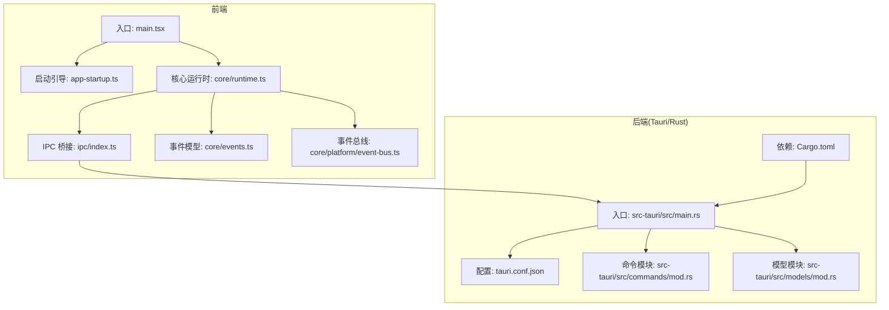
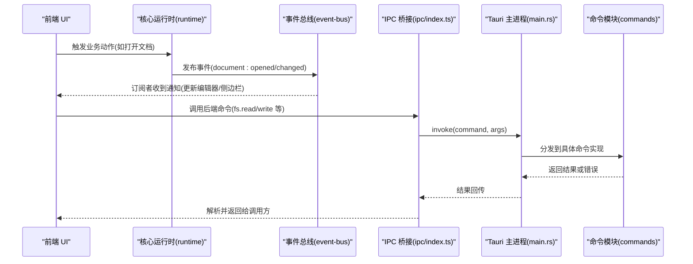
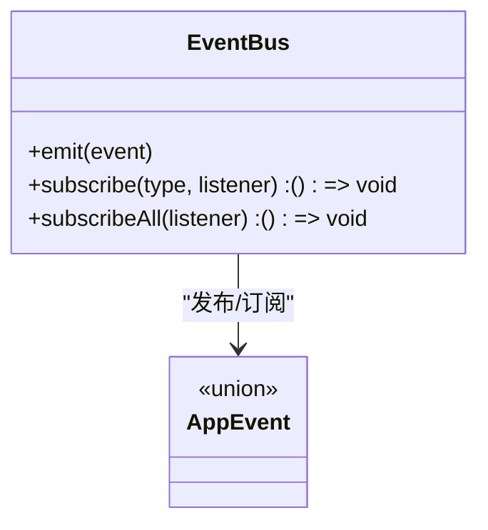
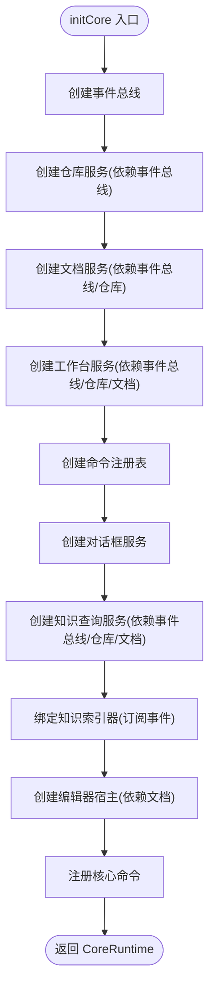
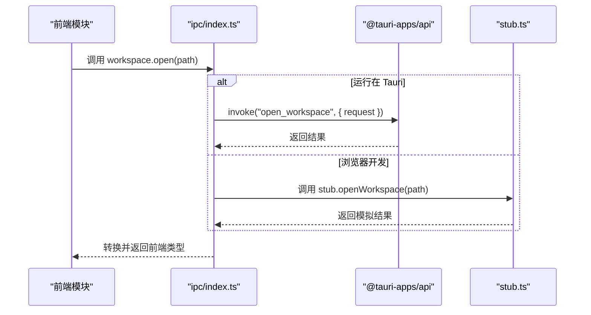
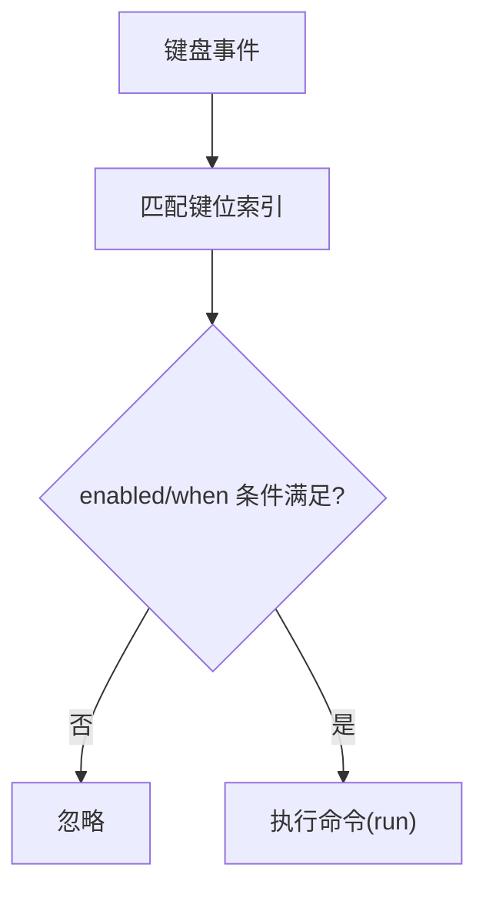
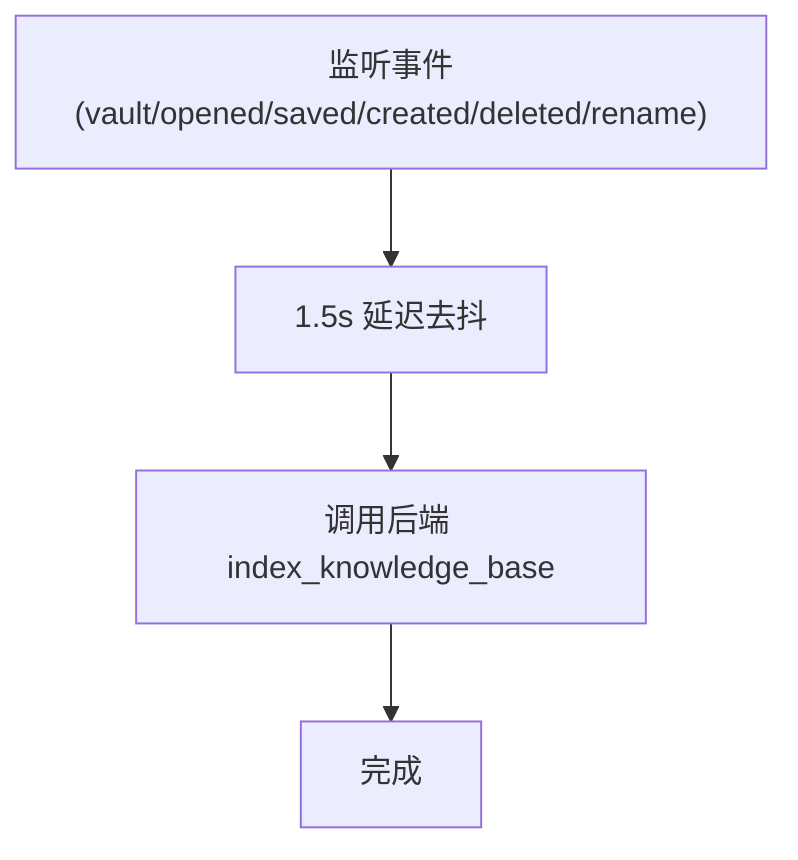
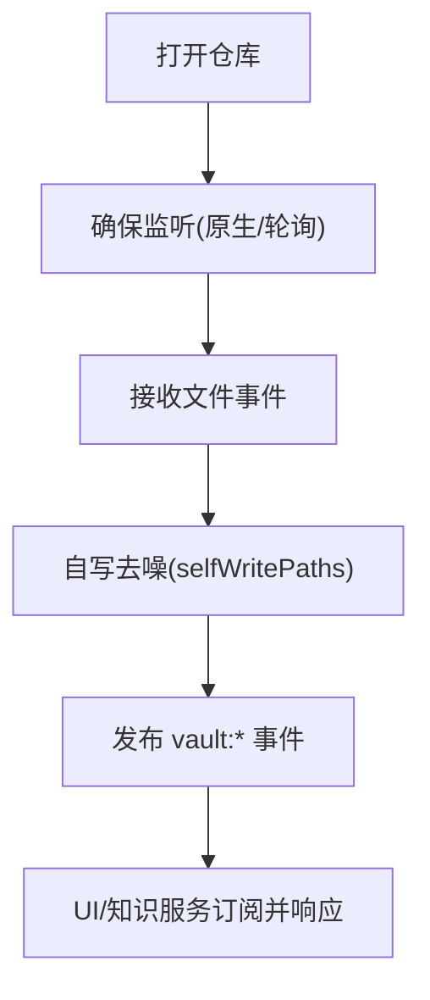
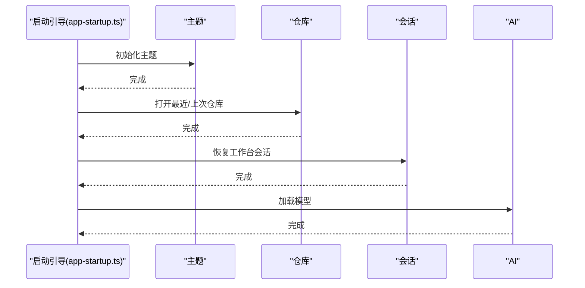
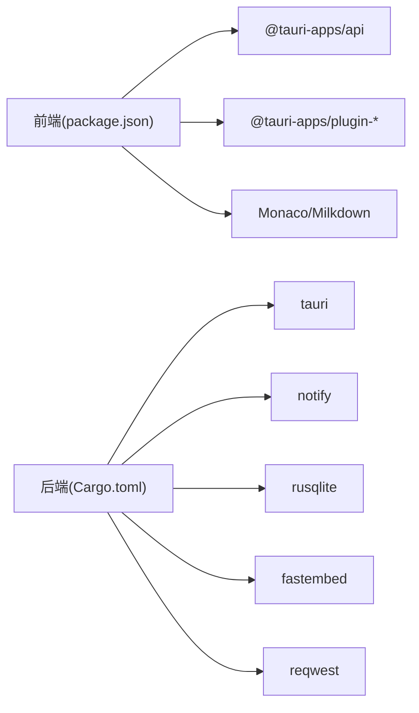

# 架构设计

<cite>
**本文引用的文件**
- [src/main.tsx](file://src/main.tsx)
- [src-tauri/src/main.rs](file://src-tauri/src/main.rs)
- [src/core/runtime.ts](file://src/core/runtime.ts)
- [src/core/platform/event-bus.ts](file://src/core/platform/event-bus.ts)
- [src/ipc/index.ts](file://src/ipc/index.ts)
- [src/core/events.ts](file://src/core/events.ts)
- [src-tauri/Cargo.toml](file://src-tauri/Cargo.toml)
- [src-tauri/tauri.conf.json](file://src-tauri/tauri.conf.json)
- [src/lib/app-startup.ts](file://src/lib/app-startup.ts)
- [src/core/vault/vault-service.impl.ts](file://src/core/vault/vault-service.impl.ts)
- [src/core/command/command-registry.impl.ts](file://src/core/command/command-registry.impl.ts)
- [src/core/knowledge/knowledge-query.impl.ts](file://src/core/knowledge/knowledge-query.impl.ts)
- [src-tauri/src/commands/mod.rs](file://src-tauri/src/commands/mod.rs)
- [src-tauri/src/models/mod.rs](file://src-tauri/src/models/mod.rs)
- [package.json](file://package.json)
</cite>

## 目录
1. [引言](#引言)
2. [项目结构](#项目结构)
3. [核心组件](#核心组件)
4. [架构总览](#架构总览)
5. [详细组件分析](#详细组件分析)
6. [依赖分析](#依赖分析)
7. [性能考量](#性能考量)
8. [故障排查指南](#故障排查指南)
9. [结论](#结论)
10. [附录](#附录)

## 引言
本文件为 NoteForge 的系统架构设计文档，聚焦于整体架构模式（前后端分离、事件驱动、依赖注入）、Tauri v2 集成方案、核心运行时初始化流程、事件总线与 IPC 通信层设计、数据流与组件交互关系，并给出可扩展性与性能优化建议。文档面向技术与非技术读者，提供从高层到代码级的渐进式理解。

## 项目结构
NoteForge 采用典型的“前端 React 应用 + 后端 Tauri/Rust”分层架构：
- 前端层：React + TypeScript，通过 IPC 桥接调用后端能力；提供启动引导、主题、会话恢复、编辑器桥接等逻辑。
- 后端层：Tauri v2 + Rust，暴露命令接口，管理数据库、配置、文件系统、索引与 AI 能力。
- 共享层：事件总线、命令注册表、知识查询服务等跨层协作组件。

**图表来源**
- [src/main.tsx:1-24](file://src/main.tsx#L1-L24)
- [src/lib/app-startup.ts:1-75](file://src/lib/app-startup.ts#L1-L75)
- [src/core/runtime.ts:1-186](file://src/core/runtime.ts#L1-L186)
- [src/core/platform/event-bus.ts:1-37](file://src/core/platform/event-bus.ts#L1-L37)
- [src/core/events.ts:1-35](file://src/core/events.ts#L1-L35)
- [src/ipc/index.ts:1-489](file://src/ipc/index.ts#L1-L489)
- [src-tauri/src/main.rs:1-101](file://src-tauri/src/main.rs#L1-L101)
- [src-tauri/tauri.conf.json:1-40](file://src-tauri/tauri.conf.json#L1-L40)
- [src-tauri/Cargo.toml:1-40](file://src-tauri/Cargo.toml#L1-L40)
- [src-tauri/src/commands/mod.rs:1-13](file://src-tauri/src/commands/mod.rs#L1-L13)
- [src-tauri/src/models/mod.rs:1-28](file://src-tauri/src/models/mod.rs#L1-L28)

**章节来源**
- [src/main.tsx:1-24](file://src/main.tsx#L1-L24)
- [src/lib/app-startup.ts:1-75](file://src/lib/app-startup.ts#L1-L75)
- [src/core/runtime.ts:1-186](file://src/core/runtime.ts#L1-L186)
- [src/core/platform/event-bus.ts:1-37](file://src/core/platform/event-bus.ts#L1-L37)
- [src/core/events.ts:1-35](file://src/core/events.ts#L1-L35)
- [src/ipc/index.ts:1-489](file://src/ipc/index.ts#L1-L489)
- [src-tauri/src/main.rs:1-101](file://src-tauri/src/main.rs#L1-L101)
- [src-tauri/tauri.conf.json:1-40](file://src-tauri/tauri.conf.json#L1-L40)
- [src-tauri/Cargo.toml:1-40](file://src-tauri/Cargo.toml#L1-L40)
- [src-tauri/src/commands/mod.rs:1-13](file://src-tauri/src/commands/mod.rs#L1-L13)
- [src-tauri/src/models/mod.rs:1-28](file://src-tauri/src/models/mod.rs#L1-L28)

## 核心组件
- 事件总线：提供全局事件发布订阅，支持通配与类型化订阅，是解耦的核心。
- 核心运行时：集中初始化各子系统（文档、工作台、知识、对话框、编辑器宿主），并建立事件联动。
- IPC 桥接：统一前端调用入口，自动区分 Tauri 环境与浏览器环境，屏蔽差异。
- 命令注册表：集中注册命令与快捷键，提供执行、过滤与匹配能力。
- 知识查询服务：基于仓库树与文档内容构建本地知识索引，提供标题搜索、链接解析、反链等能力。
- 仓库服务：封装文件系统操作、文件监听、最近仓库管理、保存路径选择等。

**章节来源**
- [src/core/platform/event-bus.ts:1-37](file://src/core/platform/event-bus.ts#L1-L37)
- [src/core/runtime.ts:1-186](file://src/core/runtime.ts#L1-L186)
- [src/ipc/index.ts:1-489](file://src/ipc/index.ts#L1-L489)
- [src/core/command/command-registry.impl.ts:1-100](file://src/core/command/command-registry.impl.ts#L1-L100)
- [src/core/knowledge/knowledge-query.impl.ts:1-178](file://src/core/knowledge/knowledge-query.impl.ts#L1-L178)
- [src/core/vault/vault-service.impl.ts:1-314](file://src/core/vault/vault-service.impl.ts#L1-L314)

## 架构总览
NoteForge 采用“前端事件驱动 + 后端命令式”的混合架构：
- 前端负责 UI、状态与事件编排；通过 IPC 调用后端命令，后端返回结构化结果。
- 后端负责文件系统、数据库、索引、加密、AI 等底层能力，暴露稳定命令接口。
- 事件总线贯穿前后端协作，形成松耦合的数据与控制流。

**图表来源**
- [src/core/runtime.ts:1-186](file://src/core/runtime.ts#L1-L186)
- [src/core/platform/event-bus.ts:1-37](file://src/core/platform/event-bus.ts#L1-L37)
- [src/ipc/index.ts:1-489](file://src/ipc/index.ts#L1-L489)
- [src-tauri/src/main.rs:19-97](file://src-tauri/src/main.rs#L19-L97)

## 详细组件分析

### 事件驱动与事件总线
- 设计要点：双层订阅（全量与类型化），emit 广播，订阅返回取消函数。
- 使用场景：文档变更、仓库文件变化、工作台会话恢复等。
- 复杂度：订阅/取消为 O(1)，emit 为 O(N)（N 为订阅数）。

**图表来源**
- [src/core/platform/event-bus.ts:1-37](file://src/core/platform/event-bus.ts#L1-L37)
- [src/core/events.ts:1-35](file://src/core/events.ts#L1-L35)

**章节来源**
- [src/core/platform/event-bus.ts:1-37](file://src/core/platform/event-bus.ts#L1-L37)
- [src/core/events.ts:1-35](file://src/core/events.ts#L1-L35)

### 核心运行时初始化与依赖注入
- 初始化顺序：事件总线 → 仓库服务 → 文档服务 → 工作台服务 → 命令注册表 → 对话框服务 → 知识查询服务 → 编辑器宿主。
- 依赖注入：通过工厂函数与依赖对象构造，避免全局状态，便于测试与替换。
- 事件联动：对文档冲突、关闭、变更等事件进行响应，触发对话框与持久化调度。

**图表来源**
- [src/core/runtime.ts:43-100](file://src/core/runtime.ts#L43-L100)
- [src/core/knowledge/knowledge-query.impl.ts:150-175](file://src/core/knowledge/knowledge-query.impl.ts#L150-L175)

**章节来源**
- [src/core/runtime.ts:1-186](file://src/core/runtime.ts#L1-L186)

### IPC 通信层设计
- 统一入口：isTauri 判断运行环境，决定真实 invoke 或 stub 回退。
- 类型安全：请求参数统一封装为 { request: Payload }，返回值在桥接层转换为前端类型。
- 错误处理：捕获 invoke 异常并包装为 IpcError，便于上层统一处理。
- 命令组织：按功能域划分命名空间（workspace/fs/knowledge/memory/ai 等）。

**图表来源**
- [src/ipc/index.ts:66-83](file://src/ipc/index.ts#L66-L83)
- [src/ipc/index.ts:191-213](file://src/ipc/index.ts#L191-L213)

**章节来源**
- [src/ipc/index.ts:1-489](file://src/ipc/index.ts#L1-L489)

### 命令注册与快捷键匹配
- 注册：命令注册表维护命令字典与按键索引，支持动态注册/注销。
- 执行：根据上下文构建执行环境，校验 enabled 条件后执行。
- 匹配：基于键位组合与 when 条件匹配，支持输入上下文、编辑器焦点等约束。

**图表来源**
- [src/core/command/command-registry.impl.ts:30-65](file://src/core/command/command-registry.impl.ts#L30-L65)

**章节来源**
- [src/core/command/command-registry.impl.ts:1-100](file://src/core/command/command-registry.impl.ts#L1-L100)

### 知识查询与索引联动
- 索引触发：监听仓库与文档事件，延迟批量重建索引。
- 查询能力：标题搜索、wiki 链接解析、反链提取、标题层级索引。
- 与仓库树结合：基于当前工作区树收集笔记，构建本地知识图谱基础。

**图表来源**
- [src/core/knowledge/knowledge-query.impl.ts:150-175](file://src/core/knowledge/knowledge-query.impl.ts#L150-L175)

**章节来源**
- [src/core/knowledge/knowledge-query.impl.ts:1-178](file://src/core/knowledge/knowledge-query.impl.ts#L1-L178)

### 仓库服务与文件监听
- 文件操作：读写、创建、删除、重命名、目录列表、信息查询。
- 监听机制：Tauri 环境使用原生文件监控；浏览器环境轮询检测。
- 自写去噪：记录自写路径，避免自身写入触发重复事件。
- 与 UI 协作：刷新树、派发文件变更事件，供其他模块订阅。

**图表来源**
- [src/core/vault/vault-service.impl.ts:96-99](file://src/core/vault/vault-service.impl.ts#L96-L99)
- [src/core/vault/vault-service.impl.ts:44-61](file://src/core/vault/vault-service.impl.ts#L44-L61)
- [src/core/vault/vault-service.impl.ts:262-298](file://src/core/vault/vault-service.impl.ts#L262-L298)

**章节来源**
- [src/core/vault/vault-service.impl.ts:1-314](file://src/core/vault/vault-service.impl.ts#L1-L314)

### 启动流程与会话恢复
- 步骤：主题初始化 → 仓库打开 → 会话恢复 → AI 模型加载 → 展示屏淡出。
- 容错：任一步失败均标记完成并继续后续步骤，最终保证 UI 可用。

**图表来源**
- [src/lib/app-startup.ts:32-74](file://src/lib/app-startup.ts#L32-L74)

**章节来源**
- [src/lib/app-startup.ts:1-75](file://src/lib/app-startup.ts#L1-L75)

## 依赖分析
- 前端依赖：React 生态、Monaco 编辑器、Milkdown、Zustand 状态管理、Tauri 插件等。
- 后端依赖：Tauri v2、notify 文件监控、rusqlite 数据库、fastembed 向量检索、reqwest 网络等。
- 构建与打包：Vite + Tauri CLI，开发时前端 devServer 由 Tauri 配置托管。

**图表来源**
- [package.json:17-48](file://package.json#L17-L48)
- [src-tauri/Cargo.toml:7-32](file://src-tauri/Cargo.toml#L7-L32)

**章节来源**
- [package.json:1-70](file://package.json#L1-L70)
- [src-tauri/Cargo.toml:1-40](file://src-tauri/Cargo.toml#L1-L40)

## 性能考量
- 事件去抖：知识索引重建采用 1.5 秒延时，降低频繁变更导致的重复索引成本。
- 监听去噪：自写路径集合避免自身写入引发的监听风暴。
- 会话恢复：异步加载与容错，保证首屏可用性。
- IPC 路径：请求体统一封装，减少序列化开销；浏览器回退仅用于开发调试，不参与生产路径。
- 存储与索引：向量化与全文索引结合，按需触发重建，避免冷启动阻塞。

[本节为通用性能建议，无需特定文件引用]

## 故障排查指南
- IPC 调用异常：检查 isTauri 环境判断与 invoke 包装，确认 IpcError 的 message 与原始错误。
- 事件未触发：确认订阅是否正确注册，类型是否匹配；检查事件总线 emit 调用位置。
- 文件监听失效：Tauri 环境检查原生监听是否已启动；浏览器环境确认轮询定时器存在。
- 知识索引未更新：确认事件订阅链路（vault:opened/document:saved 等）是否生效，索引重建是否被去抖抑制。

**章节来源**
- [src/ipc/index.ts:66-83](file://src/ipc/index.ts#L66-L83)
- [src/core/platform/event-bus.ts:19-35](file://src/core/platform/event-bus.ts#L19-L35)
- [src/core/vault/vault-service.impl.ts:96-99](file://src/core/vault/vault-service.impl.ts#L96-L99)
- [src/core/knowledge/knowledge-query.impl.ts:150-175](file://src/core/knowledge/knowledge-query.impl.ts#L150-L175)

## 结论
NoteForge 通过清晰的前后端分层、事件驱动与 IPC 通信，实现了本地优先的知识管理与 AI 协作体验。核心运行时以依赖注入模式组织服务，事件总线作为跨模块粘合层，既保证了模块内聚，又提供了良好的扩展性。Tauri v2 提供了安全、高效的原生能力访问，配合命令模块化组织，便于长期演进与维护。

[本节为总结性内容，无需特定文件引用]

## 附录

### 系统边界与第三方集成点
- 系统边界：前端 UI 与后端命令之间通过 IPC 明确隔离；仓库文件系统与数据库位于后端。
- 第三方集成：文件监控（notify）、SQLite（rusqlite）、向量检索（fastembed）、网络请求（reqwest）、日志（tracing）。

**章节来源**
- [src-tauri/Cargo.toml:20-32](file://src-tauri/Cargo.toml#L20-L32)

### 部署拓扑
- 开发：Vite 前端 + Tauri devServer，前端热更新，后端命令即插即用。
- 构建：Vite 打包前端，Tauri CLI 打包为多平台安装包，内置运行时。

**章节来源**
- [src-tauri/tauri.conf.json:6-11](file://src-tauri/tauri.conf.json#L6-L11)
- [package.json:7-16](file://package.json#L7-L16)