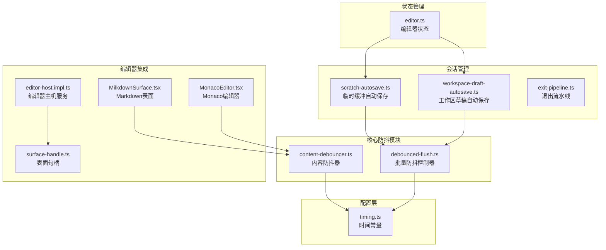
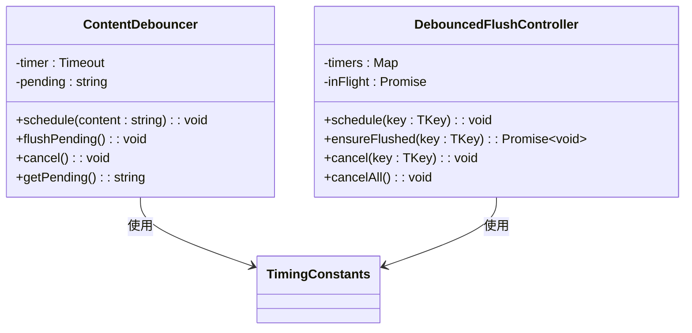
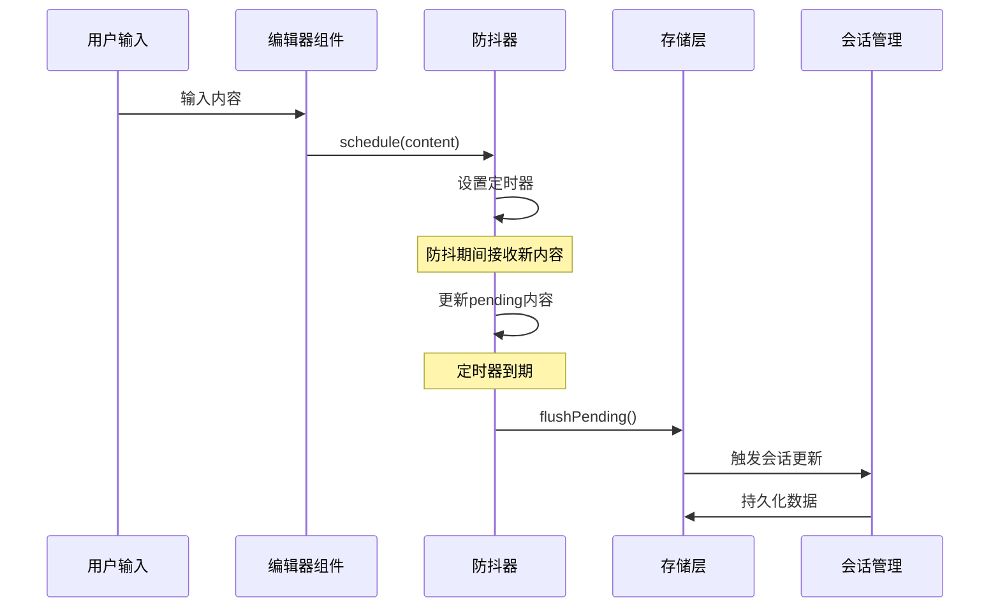
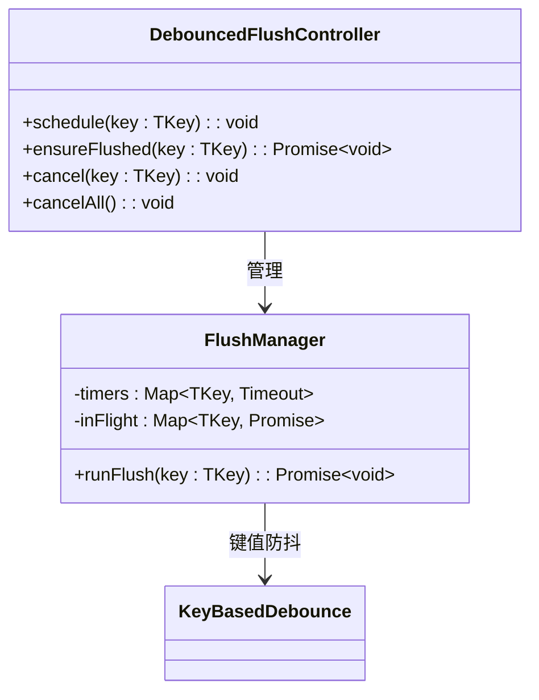
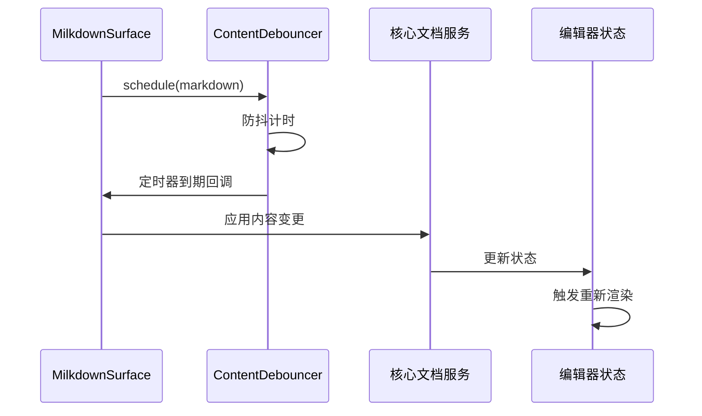
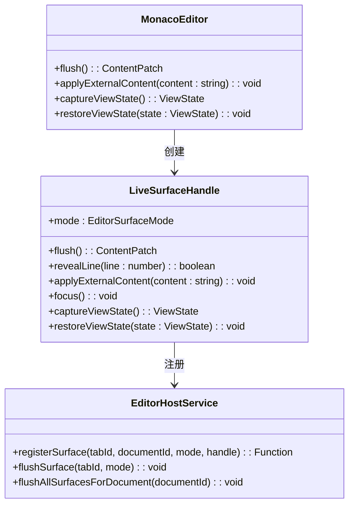
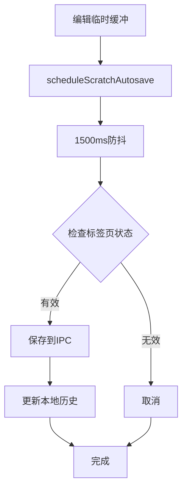
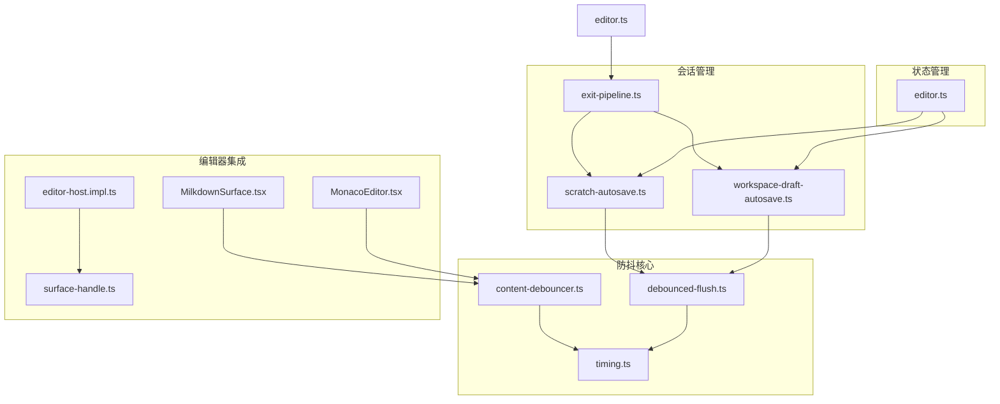

# 内容防抖系统

<cite>
**本文档引用的文件**
- [content-debouncer.ts](file://src/core/editor/content-debouncer.ts)
- [debounced-flush.ts](file://src/core/session/debounced-flush.ts)
- [timing.ts](file://src/core/platform/timing.ts)
- [scratch-autosave.ts](file://src/core/session/scratch-autosave.ts)
- [workspace-draft-autosave.ts](file://src/core/session/workspace-draft-autosave.ts)
- [exit-pipeline.ts](file://src/core/session/exit-pipeline.ts)
- [editor.ts](file://src/store/editor.ts)
- [MilkdownSurface.tsx](file://src/features/markdown/MilkdownSurface.tsx)
- [MonacoEditor.tsx](file://src/components/editor/MonacoEditor.tsx)
- [editor-host.impl.ts](file://src/core/editor/editor-host.impl.ts)
- [surface-handle.ts](file://src/core/editor/surface-handle.ts)
</cite>

## 目录
1. [简介](#简介)
2. [项目结构](#项目结构)
3. [核心组件](#核心组件)
4. [架构概览](#架构概览)
5. [详细组件分析](#详细组件分析)
6. [依赖关系分析](#依赖关系分析)
7. [性能考虑](#性能考虑)
8. [故障排除指南](#故障排除指南)
9. [结论](#结论)

## 简介

内容防抖系统是 NoteForge 编辑器中的一个关键机制，用于优化编辑器内容的处理和存储。该系统通过延迟处理用户输入，避免频繁的文件写入操作，从而提高应用性能并减少资源消耗。

系统主要包含两个层面的防抖机制：
- **内容级防抖**：针对编辑器内容变更的实时防抖
- **会话级防抖**：针对工作区文件草稿缓存的批量防抖

## 项目结构

内容防抖系统在项目中的组织结构如下：



**图表来源**
- [content-debouncer.ts:1-60](file://src/core/editor/content-debouncer.ts#L1-L60)
- [debounced-flush.ts:1-63](file://src/core/session/debounced-flush.ts#L1-L63)
- [timing.ts:1-23](file://src/core/platform/timing.ts#L1-L23)

**章节来源**
- [content-debouncer.ts:1-60](file://src/core/editor/content-debouncer.ts#L1-L60)
- [debounced-flush.ts:1-63](file://src/core/session/debounced-flush.ts#L1-L63)
- [timing.ts:1-23](file://src/core/platform/timing.ts#L1-L23)

## 核心组件

### 内容防抖器 (ContentDebouncer)

内容防抖器是系统的核心组件，负责处理编辑器内容的实时防抖逻辑。



**图表来源**
- [content-debouncer.ts:3-8](file://src/core/editor/content-debouncer.ts#L3-L8)
- [debounced-flush.ts:1-6](file://src/core/session/debounced-flush.ts#L1-L6)

### 时间配置常量

系统使用统一的时间配置常量来控制各种防抖行为：

| 常量名称 | 默认值(ms) | 用途 |
|---------|-----------|------|
| EDITOR_CONTENT_DEBOUNCE_MS | 200 | 编辑器内容变更防抖 |
| SCRATCH_AUTOSAVE_DEBOUNCE_MS | 1500 | 临时缓冲自动保存防抖 |
| SESSION_PERSIST_CONTENT_DEBOUNCE_MS | 2000 | 会话持久化内容防抖 |
| SESSION_PERSIST_LAYOUT_DEBOUNCE_MS | 400 | 会话布局变更防抖 |

**章节来源**
- [content-debouncer.ts:1-60](file://src/core/editor/content-debouncer.ts#L1-L60)
- [timing.ts:1-23](file://src/core/platform/timing.ts#L1-L23)

## 架构概览

内容防抖系统采用分层架构设计，确保不同层面的防抖需求得到适当处理：



**图表来源**
- [content-debouncer.ts:19-44](file://src/core/editor/content-debouncer.ts#L19-L44)
- [debounced-flush.ts:27-40](file://src/core/session/debounced-flush.ts#L27-L40)

## 详细组件分析

### 内容防抖器实现

内容防抖器提供了完整的防抖功能，包括内容调度、定时器管理和事件触发。

```mermaid
flowchart TD
Start([开始编辑]) --> Schedule[schedule(content)]
Schedule --> SetTimer[设置定时器]
SetTimer --> Pending[更新pending内容]
Pending --> Wait[等待防抖期]
Wait --> TimerExpire{定时器到期?}
TimerExpire --> |是| Flush[flushPending()]
TimerExpire --> |否| NewInput[新输入]
NewInput --> CancelPrev[取消前一定时器]
CancelPrev --> SetTimer
Flush --> ShouldEmit{shouldEmit检查}
ShouldEmit --> |通过| Emit[触发onEmit]
ShouldEmit --> |拒绝| Skip[跳过]
Emit --> End([结束])
Skip --> End
```

**图表来源**
- [content-debouncer.ts:19-44](file://src/core/editor/content-debouncer.ts#L19-L44)

### 批量防抖控制器

批量防抖控制器支持基于键值的多实例防抖管理，适用于会话级别的内容保存。



**图表来源**
- [debounced-flush.ts:1-63](file://src/core/session/debounced-flush.ts#L1-L63)

### 编辑器集成点

内容防抖系统与多个编辑器组件深度集成：

#### Milkdown 表面集成



**图表来源**
- [MilkdownSurface.tsx:55-82](file://src/features/markdown/MilkdownSurface.tsx#L55-L82)
- [content-debouncer.ts:32-44](file://src/core/editor/content-debouncer.ts#L32-L44)

#### Monaco 编辑器集成

Monaco 编辑器通过表面句柄与防抖系统交互：



**图表来源**
- [MonacoEditor.tsx:325-367](file://src/components/editor/MonacoEditor.tsx#L325-L367)
- [surface-handle.ts:4-18](file://src/core/editor/surface-handle.ts#L4-L18)
- [editor-host.impl.ts:72-104](file://src/core/editor/editor-host.impl.ts#L72-L104)

**章节来源**
- [MilkdownSurface.tsx:55-97](file://src/features/markdown/MilkdownSurface.tsx#L55-L97)
- [MonacoEditor.tsx:323-370](file://src/components/editor/MonacoEditor.tsx#L323-L370)
- [surface-handle.ts:1-26](file://src/core/editor/surface-handle.ts#L1-L26)
- [editor-host.impl.ts:1-154](file://src/core/editor/editor-host.impl.ts#L1-L154)

### 会话级防抖实现

会话级防抖系统处理临时缓冲和工作区草稿的自动保存：

#### 临时缓冲自动保存



**图表来源**
- [scratch-autosave.ts:37-43](file://src/core/session/scratch-autosave.ts#L37-L43)

#### 工作区草稿自动保存

工作区草稿保存根据文件层级动态调整防抖时间：

| 文件层级 | 草稿防抖(ms) | 用途 |
|---------|-------------|------|
| 本地文件 | 1500 | 快速响应本地编辑 |
| 远程同步 | 3000 | 减少网络请求频率 |
| 大型文件 | 5000 | 避免频繁磁盘I/O |

**章节来源**
- [scratch-autosave.ts:1-63](file://src/core/session/scratch-autosave.ts#L1-L63)
- [workspace-draft-autosave.ts:1-84](file://src/core/session/workspace-draft-autosave.ts#L1-L84)

## 依赖关系分析

内容防抖系统各组件之间的依赖关系如下：



**图表来源**
- [content-debouncer.ts](file://src/core/editor/content-debouncer.ts#L1)
- [debounced-flush.ts](file://src/core/session/debounced-flush.ts#L1)
- [timing.ts](file://src/core/platform/timing.ts#L1)
- [scratch-autosave.ts](file://src/core/session/scratch-autosave.ts#L1)
- [workspace-draft-autosave.ts](file://src/core/session/workspace-draft-autosave.ts#L1)
- [exit-pipeline.ts](file://src/core/session/exit-pipeline.ts#L1)
- [MilkdownSurface.tsx](file://src/features/markdown/MilkdownSurface.tsx#L1)
- [MonacoEditor.tsx](file://src/components/editor/MonacoEditor.tsx#L1)
- [editor-host.impl.ts](file://src/core/editor/editor-host.impl.ts#L1)
- [surface-handle.ts](file://src/core/editor/surface-handle.ts#L1)
- [editor.ts](file://src/store/editor.ts#L1)

**章节来源**
- [editor.ts:21-29](file://src/store/editor.ts#L21-L29)
- [exit-pipeline.ts:5-13](file://src/core/session/exit-pipeline.ts#L5-L13)

## 性能考虑

### 时间复杂度分析

- **内容防抖器**：单次调度 O(1)，定时器到期 O(1)
- **批量防抖控制器**：单次调度 O(1)，内存使用 O(n)（n为活跃键数量）
- **会话级防抖**：按需触发，平均 O(1)，最坏情况 O(n)

### 内存管理

系统采用以下策略优化内存使用：
- 及时清理过期的定时器引用
- 支持批量取消所有防抖任务
- 动态调整防抖时间以平衡性能和响应性

### 并发控制

- 使用Promise队列避免重复的异步操作
- 支持确保刷新模式，保证最终一致性
- 提供取消机制防止竞态条件

## 故障排除指南

### 常见问题及解决方案

#### 防抖不生效

**症状**：编辑器内容频繁保存或防抖完全失效

**排查步骤**：
1. 检查防抖时间配置是否正确
2. 确认定时器是否被意外清除
3. 验证shouldEmit函数逻辑

**解决方案**：
- 调整EDITOR_CONTENT_DEBOUNCE_MS参数
- 检查是否有其他代码调用cancel()方法
- 确保onEmit回调正确实现

#### 内存泄漏

**症状**：长时间使用后内存持续增长

**排查步骤**：
1. 检查定时器引用是否正确清理
2. 确认批量防抖控制器的键值映射
3. 验证会话退出时的清理逻辑

**解决方案**：
- 调用cancelAll()清理所有定时器
- 在组件卸载时调用cancel()方法
- 确保退出流水线正确执行

#### 数据丢失

**症状**：应用崩溃或意外关闭导致未保存内容丢失

**排查步骤**：
1. 检查退出流水线是否正确执行
2. 确认flushPending()是否被调用
3. 验证会话持久化的时机

**解决方案**：
- 确保runExitFlushPipeline()正确调用
- 在应用生命周期钩子中添加清理逻辑
- 实现适当的错误恢复机制

**章节来源**
- [content-debouncer.ts:48-59](file://src/core/editor/content-debouncer.ts#L48-L59)
- [debounced-flush.ts:49-61](file://src/core/session/debounced-flush.ts#L49-L61)
- [exit-pipeline.ts:5-13](file://src/core/session/exit-pipeline.ts#L5-L13)

## 结论

内容防抖系统通过精心设计的分层架构，在保证用户体验的同时显著提升了应用性能。系统的关键优势包括：

1. **多层次防抖**：从内容级到会话级的完整覆盖
2. **灵活配置**：可调整的防抖时间和条件判断
3. **内存友好**：及时清理和并发控制机制
4. **可靠持久化**：完善的退出处理和错误恢复

该系统为 NoteForge 的编辑器功能提供了坚实的性能基础，能够有效处理大量用户的并发编辑需求，同时保持应用的响应性和稳定性。