# 大型文件处理系统

<cite>
**本文档引用的文件**
- [large-file-features.ts](file://src/core/document/large-file-features.ts)
- [LargeFileFeatureNotice.tsx](file://src/components/editor/LargeFileFeatureNotice.tsx)
- [LargeFilePreview.tsx](file://src/components/editor/LargeFilePreview.tsx)
- [large-file-overrides.ts](file://src/store/large-file-overrides.ts)
- [file-tier.ts](file://src/core/document/file-tier.ts)
- [types.ts](file://src/core/document/types.ts)
- [utils.ts](file://src/core/document/utils.ts)
- [service.ts](file://src/core/document/service.ts)
- [document-service.impl.ts](file://src/core/document/document-service.impl.ts)
- [editor-doc.ts](file://src/lib/editor-doc.ts)
- [index.ts](file://src/ipc/index.ts)
- [editor.ts](file://src/store/editor.ts)
- [workspace-draft-autosave.ts](file://src/core/session/workspace-draft-autosave.ts)
- [startup-perf.ts](file://src/lib/startup-perf.ts)
- [README.md](file://README.md)
</cite>

## 目录
1. [简介](#简介)
2. [项目结构](#项目结构)
3. [核心组件](#核心组件)
4. [架构概览](#架构概览)
5. [详细组件分析](#详细组件分析)
6. [依赖关系分析](#依赖关系分析)
7. [性能考虑](#性能考虑)
8. [故障排除指南](#故障排除指南)
9. [结论](#结论)

## 简介

NoteForge 是一个本地优先、编辑器与知识库深度融合的技术知识工作站，其大型文件处理系统是整个应用的核心功能之一。该系统专门设计用于高效处理超大文件（超过20MB），提供智能的文件分级策略、渐进式功能降级和用户可控的性能优化机制。

系统采用分层架构设计，通过文件大小自动识别（2MB为大文件阈值，20MB为超大文件阈值）来决定不同的处理策略。对于超大文件，系统采用只读预览模式，避免内存溢出；对于大文件，系统会智能禁用部分资源密集型功能，同时允许用户手动启用这些功能。

## 项目结构

NoteForge 的大型文件处理系统主要分布在以下核心目录中：

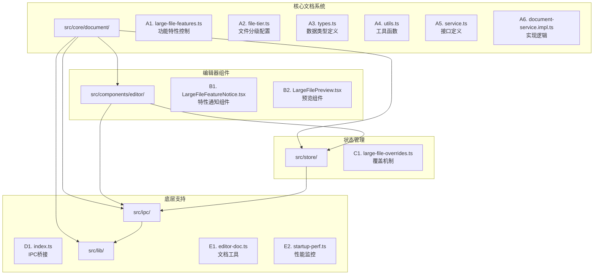

**图表来源**
- [large-file-features.ts:1-68](file://src/core/document/large-file-features.ts#L1-L68)
- [file-tier.ts:1-96](file://src/core/document/file-tier.ts#L1-L96)
- [LargeFileFeatureNotice.tsx:1-59](file://src/components/editor/LargeFileFeatureNotice.tsx#L1-L59)
- [LargeFilePreview.tsx:1-188](file://src/components/editor/LargeFilePreview.tsx#L1-L188)

**章节来源**
- [README.md:75-112](file://README.md#L75-L112)

## 核心组件

### 文件分级系统

系统采用三层文件分级策略：

| 级别 | 大小阈值 | 特性配置 | 性能影响 |
|------|----------|----------|----------|
| normal | < 2MB | 完整功能集 | 最优性能 |
| large | 2MB - 20MB | 功能降级 | 中等性能 |
| huge | > 20MB | 只读预览 | 最低性能 |

### 大型文件特性控制

系统定义了四种可降级的功能特性：

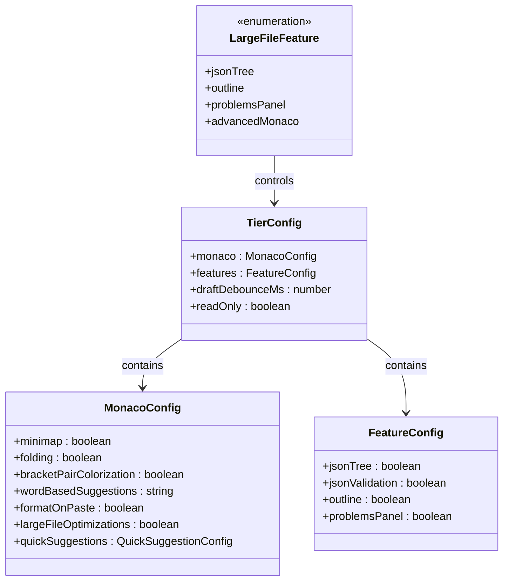

**图表来源**
- [large-file-features.ts:4-19](file://src/core/document/large-file-features.ts#L4-L19)
- [file-tier.ts:14-32](file://src/core/document/file-tier.ts#L14-L32)

**章节来源**
- [large-file-features.ts:1-68](file://src/core/document/large-file-features.ts#L1-L68)
- [file-tier.ts:1-96](file://src/core/document/file-tier.ts#L1-L96)

## 架构概览

### 整体架构设计

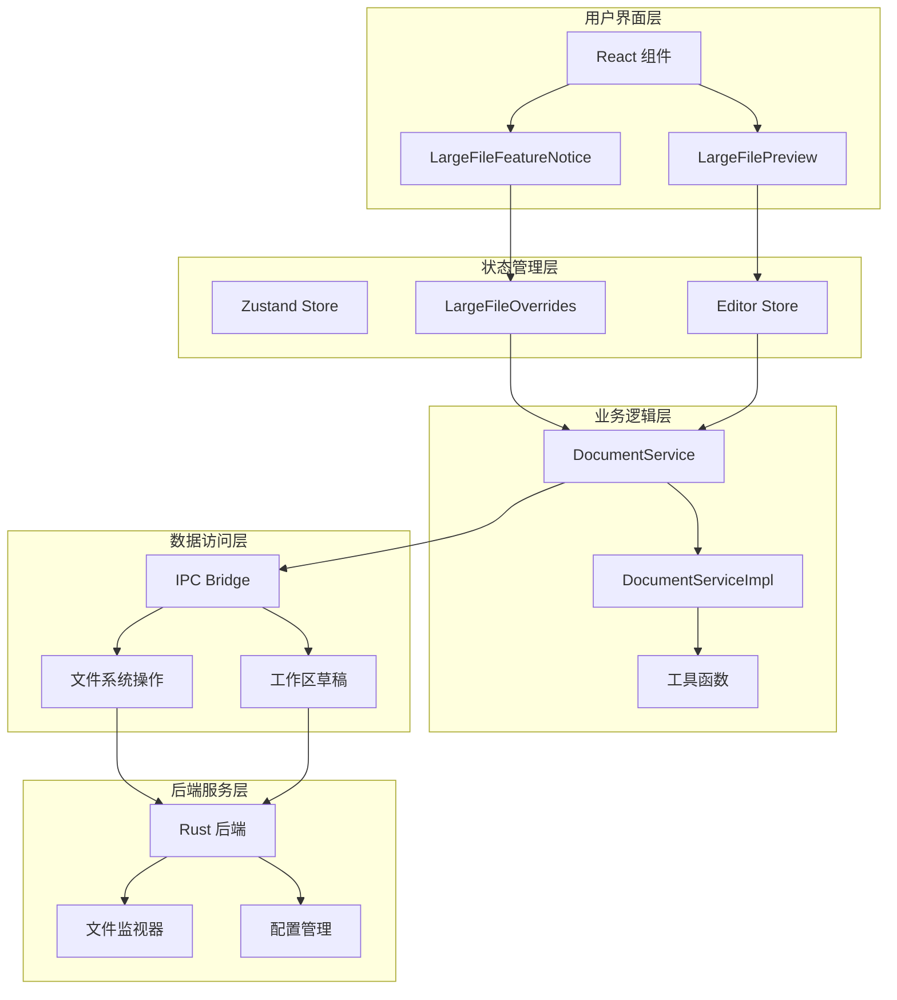

**图表来源**
- [LargeFileFeatureNotice.tsx:1-59](file://src/components/editor/LargeFileFeatureNotice.tsx#L1-L59)
- [LargeFilePreview.tsx:1-188](file://src/components/editor/LargeFilePreview.tsx#L1-L188)
- [large-file-overrides.ts:1-62](file://src/store/large-file-overrides.ts#L1-L62)
- [document-service.impl.ts:50-713](file://src/core/document/document-service.impl.ts#L50-L713)

### 文件处理流程

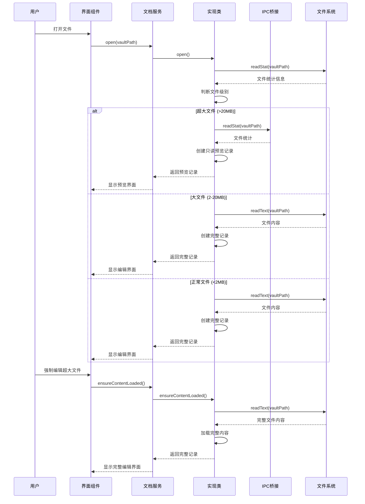

**图表来源**
- [document-service.impl.ts:380-405](file://src/core/document/document-service.impl.ts#L380-L405)
- [LargeFilePreview.tsx:100-108](file://src/components/editor/LargeFilePreview.tsx#L100-L108)

**章节来源**
- [document-service.impl.ts:1-713](file://src/core/document/document-service.impl.ts#L1-L713)

## 详细组件分析

### 大型文件特性控制系统

#### 功能特性枚举

系统定义了四种可降级的功能特性，每种特性都有明确的性能影响和用户价值：

| 特性名称 | 功能描述 | 性能影响 | 默认状态 |
|----------|----------|----------|----------|
| jsonTree | JSON/YAML树形视图解析 | 高内存占用 | 大文件禁用 |
| outline | Markdown大纲扫描 | 中等CPU消耗 | 大文件禁用 |
| problemsPanel | Schema语法校验 | 中等CPU消耗 | 大文件禁用 |
| advancedMonaco | 高级编辑特性（括号匹配等） | 低到中等 | 永远禁用 |

#### 特性决策算法

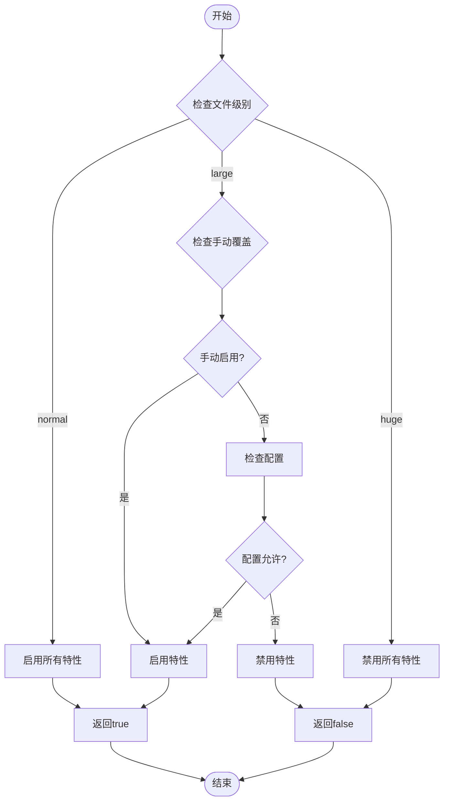

**图表来源**
- [large-file-features.ts:43-51](file://src/core/document/large-file-features.ts#L43-L51)

**章节来源**
- [large-file-features.ts:1-68](file://src/core/document/large-file-features.ts#L1-L68)

### 大型文件预览组件

#### 预览机制设计

LargeFilePreview 组件实现了智能的文件预览功能，特别针对超大文件进行了优化：

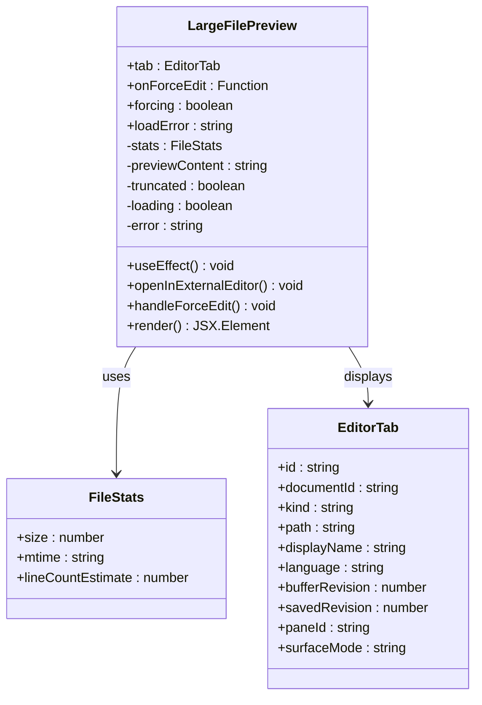

**图表来源**
- [LargeFilePreview.tsx:7-18](file://src/components/editor/LargeFilePreview.tsx#L7-L18)
- [LargeFilePreview.tsx:27-88](file://src/components/editor/LargeFilePreview.tsx#L27-L88)

#### 预览加载流程

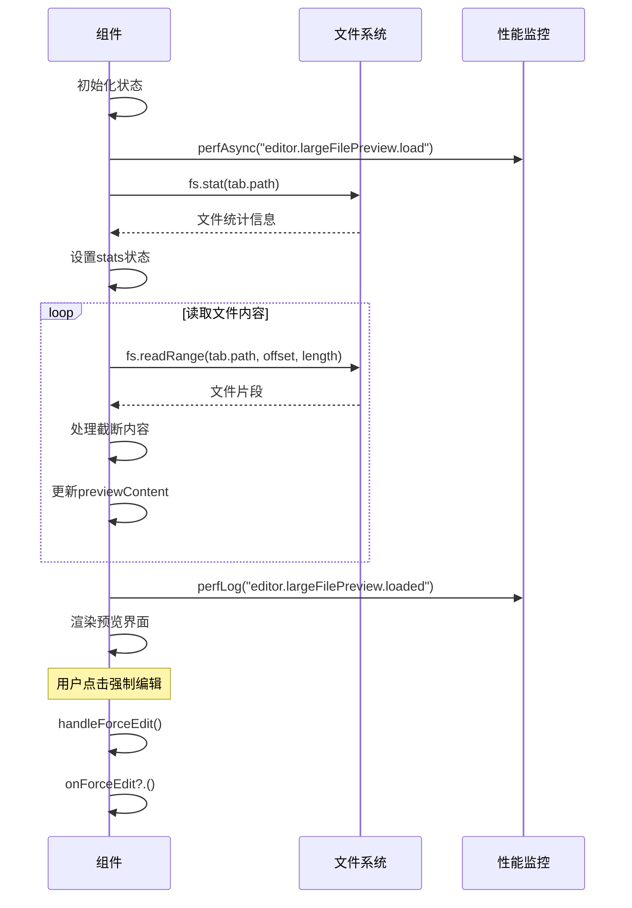

**图表来源**
- [LargeFilePreview.tsx:40-88](file://src/components/editor/LargeFilePreview.tsx#L40-L88)

**章节来源**
- [LargeFilePreview.tsx:1-188](file://src/components/editor/LargeFilePreview.tsx#L1-L188)

### 大型文件覆盖机制

#### 状态管理设计

LargeFileOverrides 使用 zustand 实现轻量级的状态管理，专门处理用户的特性覆盖选择：

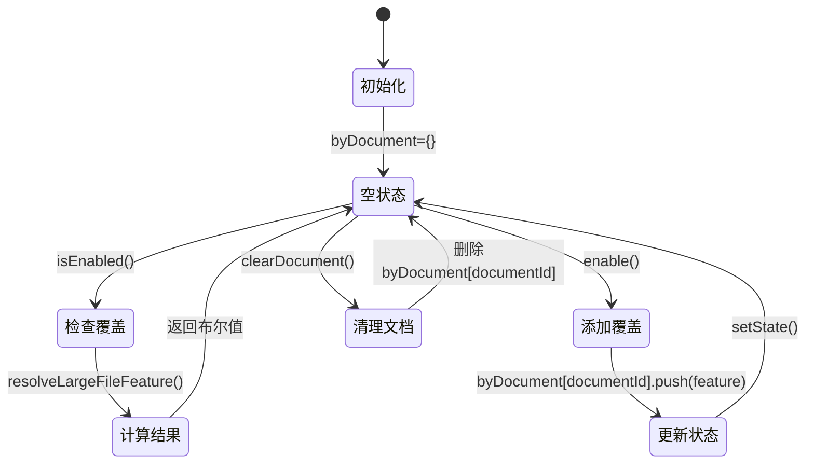

**图表来源**
- [large-file-overrides.ts:32-61](file://src/store/large-file-overrides.ts#L32-L61)

#### 覆盖机制工作原理

```mermaid
flowchart LR
A[用户选择启用特性] --> B[enable(documentId, feature)]
B --> C[获取当前覆盖列表]
C --> D{是否已存在?}
D --> |是| E[保持不变]
D --> |否| F[添加到覆盖列表]
F --> G[更新状态]
G --> H[后续检查isEnabled()]
H --> I[overrideSet(byDocument, documentId)]
I --> J[new Set(覆盖列表)]
J --> K[resolveLargeFileFeature(tier, feature, overrides)]
K --> L[返回true强制启用]
```

**图表来源**
- [large-file-overrides.ts:40-51](file://src/store/large-file-overrides.ts#L40-L51)

**章节来源**
- [large-file-overrides.ts:1-62](file://src/store/large-file-overrides.ts#L1-L62)

### 文档服务实现

#### 核心服务接口

DocumentService 定义了完整的文档生命周期管理接口：

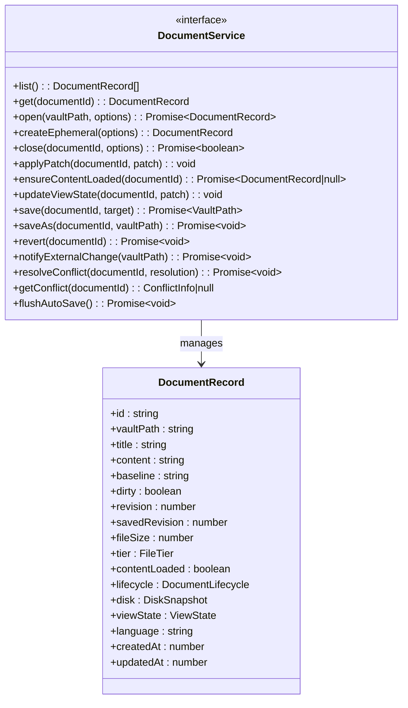

**图表来源**
- [service.ts:17-54](file://src/core/document/service.ts#L17-L54)
- [types.ts:51-76](file://src/core/document/types.ts#L51-L76)

#### 文件打开策略

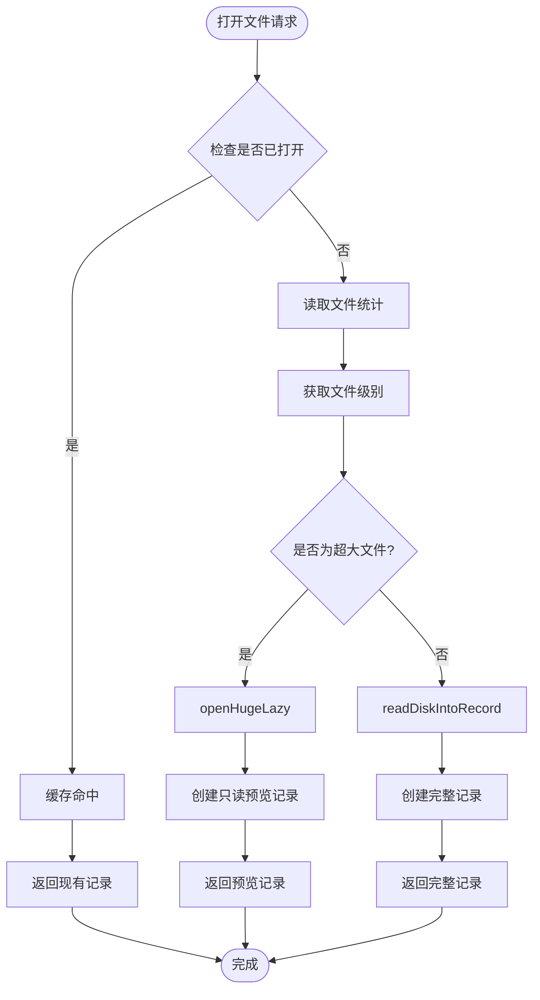

**图表来源**
- [document-service.impl.ts:380-405](file://src/core/document/document-service.impl.ts#L380-L405)
- [document-service.impl.ts:223-320](file://src/core/document/document-service.impl.ts#L223-L320)

**章节来源**
- [service.ts:1-55](file://src/core/document/service.ts#L1-L55)
- [document-service.impl.ts:1-713](file://src/core/document/document-service.impl.ts#L1-L713)

## 依赖关系分析

### 核心依赖图

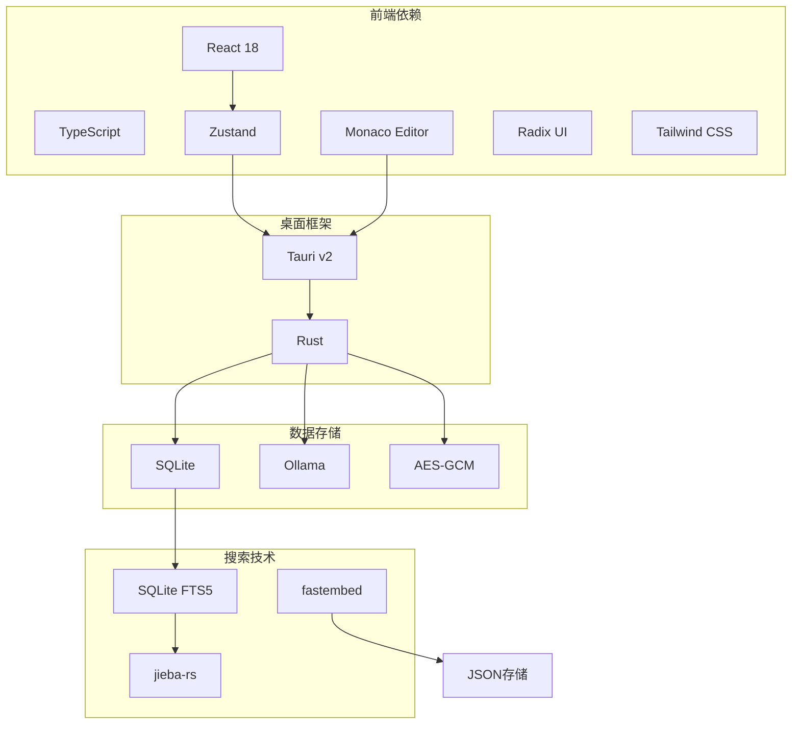

**图表来源**
- [README.md:5-23](file://README.md#L5-L23)

### 文件处理依赖链

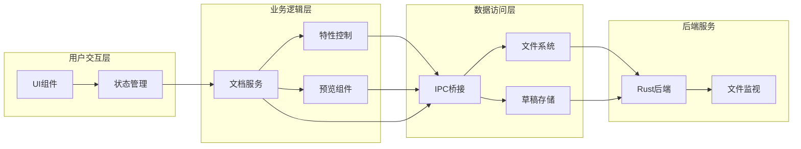

**图表来源**
- [LargeFileFeatureNotice.tsx:1-59](file://src/components/editor/LargeFileFeatureNotice.tsx#L1-L59)
- [large-file-overrides.ts:1-62](file://src/store/large-file-overrides.ts#L1-L62)
- [document-service.impl.ts:50-713](file://src/core/document/document-service.impl.ts#L50-L713)

**章节来源**
- [README.md:75-112](file://README.md#L75-L112)

## 性能考虑

### 性能监控系统

系统内置了完善的性能监控机制，支持开发环境和生产环境的性能追踪：

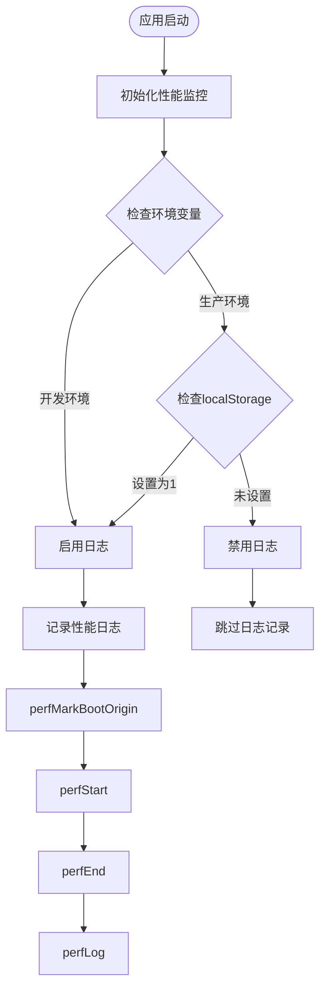

**图表来源**
- [startup-perf.ts:18-94](file://src/lib/startup-perf.ts#L18-L94)

### 内存优化策略

系统采用了多种内存优化策略来处理大型文件：

1. **延迟加载**: 超大文件只加载文件头信息，完整内容按需加载
2. **智能降级**: 大文件自动禁用资源密集型功能
3. **增量处理**: 文件预览采用增量方式，避免一次性加载全部内容
4. **缓存机制**: 工作区草稿采用异步写入，减少内存占用

**章节来源**
- [startup-perf.ts:1-135](file://src/lib/startup-perf.ts#L1-L135)
- [workspace-draft-autosave.ts:1-85](file://src/core/session/workspace-draft-autosave.ts#L1-L85)

## 故障排除指南

### 常见问题及解决方案

#### 超大文件无法编辑

**问题症状**: 打开超大文件时只能看到只读预览，无法直接编辑

**解决方案**:
1. 点击"强制编辑"按钮确认继续
2. 系统会弹出性能警告对话框
3. 确认后系统会加载完整文件内容

#### 功能特性被禁用

**问题症状**: JSON树形视图、大纲扫描等功能不可用

**解决方案**:
1. 查看右上角的特性通知组件
2. 点击"启用[功能名称]"按钮
3. 系统会在当前会话中记住用户的偏好设置

#### 性能问题

**问题症状**: 应用响应缓慢或内存占用过高

**解决方案**:
1. 检查是否同时打开了多个超大文件
2. 关闭不必要的标签页
3. 等待草稿自动保存完成
4. 重启应用清理内存

**章节来源**
- [LargeFileFeatureNotice.tsx:1-59](file://src/components/editor/LargeFileFeatureNotice.tsx#L1-L59)
- [LargeFilePreview.tsx:100-108](file://src/components/editor/LargeFilePreview.tsx#L100-L108)

## 结论

NoteForge 的大型文件处理系统通过精心设计的分层架构和智能的性能优化策略，成功解决了超大文件处理的技术难题。系统的主要优势包括：

1. **智能分级**: 自动识别文件大小并采取相应的处理策略
2. **用户可控**: 允许用户在性能和功能之间做出明智的选择
3. **性能优化**: 采用多种技术手段确保应用的稳定性和响应性
4. **扩展性强**: 模块化的架构设计便于未来功能的扩展和维护

该系统不仅满足了技术知识工作站对大型文件处理的需求，还为用户提供了良好的使用体验。通过合理的性能权衡和用户体验设计，系统在保证功能完整性的同时，最大程度地保护了应用的稳定性和响应速度。