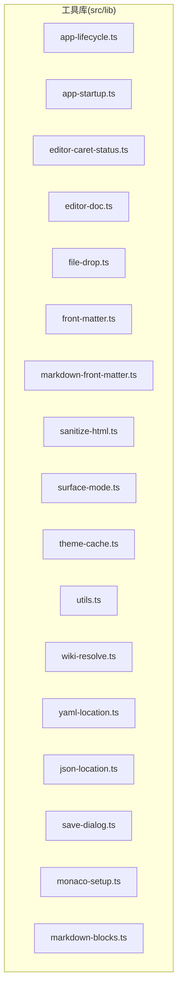
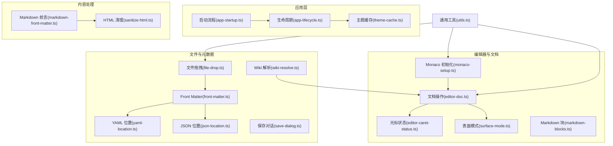
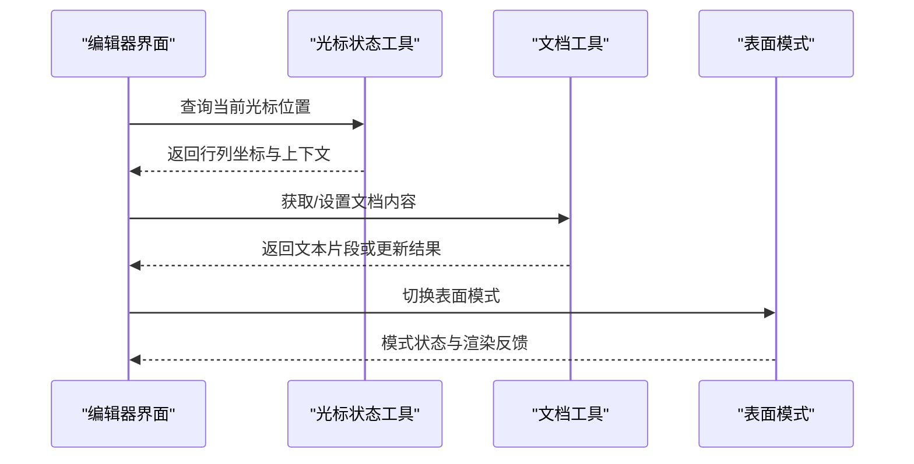
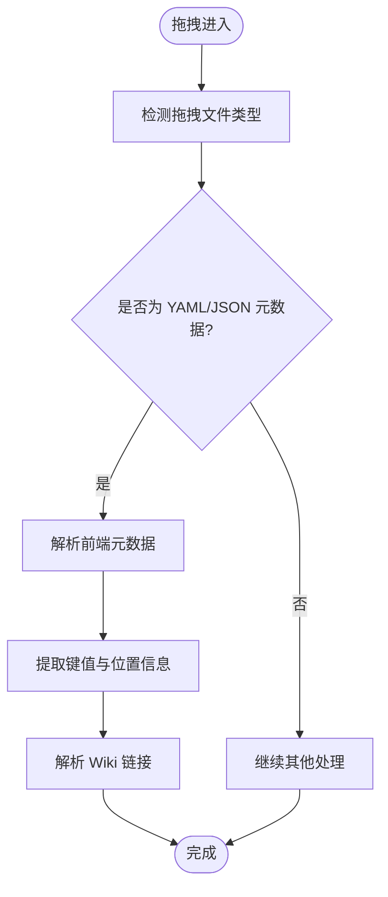
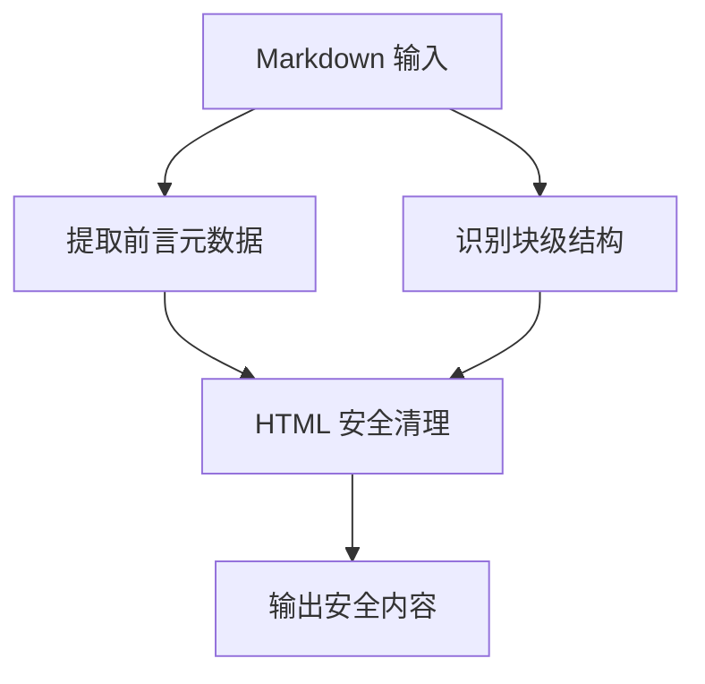
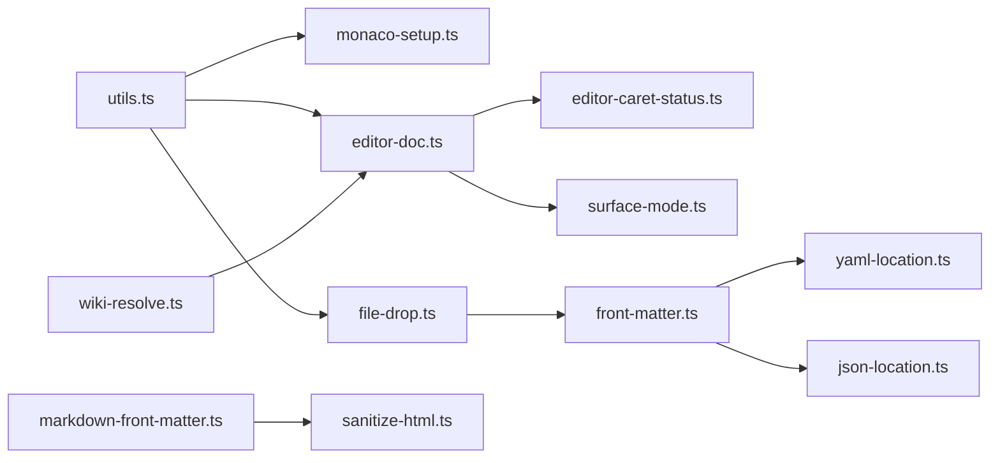

# 工具库

<cite>
**本文引用的文件**
- [app-lifecycle.ts](file://src/lib/app-lifecycle.ts)
- [app-startup.ts](file://src/lib/app-startup.ts)
- [editor-caret-status.ts](file://src/lib/editor-caret-status.ts)
- [editor-doc.ts](file://src/lib/editor-doc.ts)
- [file-drop.ts](file://src/lib/file-drop.ts)
- [front-matter.ts](file://src/lib/front-matter.ts)
- [markdown-front-matter.ts](file://src/lib/markdown-front-matter.ts)
- [sanitize-html.ts](file://src/lib/sanitize-html.ts)
- [surface-mode.ts](file://src/lib/surface-mode.ts)
- [theme-cache.ts](file://src/lib/theme-cache.ts)
- [utils.ts](file://src/lib/utils.ts)
- [wiki-resolve.ts](file://src/lib/wiki-resolve.ts)
- [yaml-location.ts](file://src/lib/yaml-location.ts)
- [json-location.ts](file://src/lib/json-location.ts)
- [save-dialog.ts](file://src/lib/save-dialog.ts)
- [monaco-setup.ts](file://src/lib/monaco-setup.ts)
- [markdown-blocks.ts](file://src/lib/markdown-blocks.ts)
</cite>

## 目录
1. [简介](#简介)
2. [项目结构](#项目结构)
3. [核心组件](#核心组件)
4. [架构总览](#架构总览)
5. [详细组件分析](#详细组件分析)
6. [依赖分析](#依赖分析)
7. [性能考量](#性能考量)
8. [故障排查指南](#故障排查指南)
9. [结论](#结论)
10. [附录：API 参考与使用示例](#附录api-参考与使用示例)

## 简介
本文件系统化梳理 NoteForge 工具库的设计理念与实现细节，覆盖应用生命周期管理、启动流程控制、编辑器状态与文档操作、文件拖拽与前端元数据提取、Markdown 解析与 HTML 清理、主题缓存与通用工具函数等模块。文档以“从上到下”的方式逐步展开：先给出整体架构与模块关系，再逐个深入工具函数的职责、输入输出、错误处理与最佳实践，并辅以可视化图示帮助读者快速建立对代码结构与数据流的理解。

## 项目结构
工具库位于 src/lib 目录，采用按功能域划分的组织方式，每个文件聚焦一类工具能力（如应用生命周期、编辑器状态、文件处理、Markdown 解析、HTML 清理、主题缓存、通用工具等）。该布局有利于高内聚、低耦合，便于扩展与维护。

图表来源
- [app-lifecycle.ts](file://src/lib/app-lifecycle.ts)
- [app-startup.ts](file://src/lib/app-startup.ts)
- [editor-caret-status.ts](file://src/lib/editor-caret-status.ts)
- [editor-doc.ts](file://src/lib/editor-doc.ts)
- [file-drop.ts](file://src/lib/file-drop.ts)
- [front-matter.ts](file://src/lib/front-matter.ts)
- [markdown-front-matter.ts](file://src/lib/markdown-front-matter.ts)
- [sanitize-html.ts](file://src/lib/sanitize-html.ts)
- [surface-mode.ts](file://src/lib/surface-mode.ts)
- [theme-cache.ts](file://src/lib/theme-cache.ts)
- [utils.ts](file://src/lib/utils.ts)
- [wiki-resolve.ts](file://src/lib/wiki-resolve.ts)
- [yaml-location.ts](file://src/lib/yaml-location.ts)
- [json-location.ts](file://src/lib/json-location.ts)
- [save-dialog.ts](file://src/lib/save-dialog.ts)
- [monaco-setup.ts](file://src/lib/monaco-setup.ts)
- [markdown-blocks.ts](file://src/lib/markdown-blocks.ts)

章节来源
- [app-lifecycle.ts](file://src/lib/app-lifecycle.ts)
- [app-startup.ts](file://src/lib/app-startup.ts)
- [utils.ts](file://src/lib/utils.ts)

## 核心组件
- 应用生命周期管理：负责应用启动、窗口事件、会话持久化与退出流程控制。
- 启动流程控制：协调应用初始化顺序、资源加载与前置检查。
- 编辑器状态与文档：提供光标状态查询、文档内容与位置信息处理、表面模式切换。
- 文件处理与拖拽：封装拖拽事件、前端元数据提取（YAML/JSON）、Wiki 链接解析。
- Markdown 与 HTML：提供 Markdown 前言元数据解析、块级结构识别、HTML 安全清理。
- 主题与缓存：主题缓存策略与本地存储交互。
- 通用工具：常用类型、断言、字符串与集合操作等。

章节来源
- [app-lifecycle.ts](file://src/lib/app-lifecycle.ts)
- [app-startup.ts](file://src/lib/app-startup.ts)
- [editor-caret-status.ts](file://src/lib/editor-caret-status.ts)
- [editor-doc.ts](file://src/lib/editor-doc.ts)
- [file-drop.ts](file://src/lib/file-drop.ts)
- [front-matter.ts](file://src/lib/front-matter.ts)
- [markdown-front-matter.ts](file://src/lib/markdown-front-matter.ts)
- [sanitize-html.ts](file://src/lib/sanitize-html.ts)
- [surface-mode.ts](file://src/lib/surface-mode.ts)
- [theme-cache.ts](file://src/lib/theme-cache.ts)
- [utils.ts](file://src/lib/utils.ts)
- [wiki-resolve.ts](file://src/lib/wiki-resolve.ts)
- [yaml-location.ts](file://src/lib/yaml-location.ts)
- [json-location.ts](file://src/lib/json-location.ts)
- [save-dialog.ts](file://src/lib/save-dialog.ts)
- [monaco-setup.ts](file://src/lib/monaco-setup.ts)
- [markdown-blocks.ts](file://src/lib/markdown-blocks.ts)

## 架构总览
NoteForge 工具库通过“功能域分层 + 轻量依赖”设计，将复杂逻辑拆分为可独立演进的小型模块。编辑器相关工具与文档处理工具紧密协作；文件处理工具为知识图谱与链接解析提供基础；主题与缓存工具保障 UI 一致性与性能；通用工具提供跨模块复用的基础能力。

图表来源
- [app-startup.ts](file://src/lib/app-startup.ts)
- [app-lifecycle.ts](file://src/lib/app-lifecycle.ts)
- [theme-cache.ts](file://src/lib/theme-cache.ts)
- [editor-caret-status.ts](file://src/lib/editor-caret-status.ts)
- [editor-doc.ts](file://src/lib/editor-doc.ts)
- [surface-mode.ts](file://src/lib/surface-mode.ts)
- [monaco-setup.ts](file://src/lib/monaco-setup.ts)
- [markdown-blocks.ts](file://src/lib/markdown-blocks.ts)
- [file-drop.ts](file://src/lib/file-drop.ts)
- [front-matter.ts](file://src/lib/front-matter.ts)
- [yaml-location.ts](file://src/lib/yaml-location.ts)
- [json-location.ts](file://src/lib/json-location.ts)
- [wiki-resolve.ts](file://src/lib/wiki-resolve.ts)
- [markdown-front-matter.ts](file://src/lib/markdown-front-matter.ts)
- [sanitize-html.ts](file://src/lib/sanitize-html.ts)
- [utils.ts](file://src/lib/utils.ts)

## 详细组件分析

### 应用生命周期管理
职责
- 管理应用窗口事件、会话状态与退出流程。
- 协调工作区草稿自动保存、标签页生命周期与主题缓存更新。

关键点
- 生命周期钩子与事件总线结合，确保在关键节点执行清理或持久化。
- 与工作台与会话模块协作，避免数据丢失。

章节来源
- [app-lifecycle.ts](file://src/lib/app-lifecycle.ts)

### 启动流程控制
职责
- 控制应用启动阶段的初始化顺序与前置条件校验。
- 与平台配置、事件总线协同，保证启动一致性。

关键点
- 启动阶段的幂等性与失败回滚策略。
- 与主题缓存、Monaco 初始化的时序配合。

章节来源
- [app-startup.ts](file://src/lib/app-startup.ts)

### 编辑器状态与文档工具
职责
- 光标状态查询与上下文推断。
- 文档内容与位置信息处理（行、列、偏移）。
- 表面模式切换（如预览/编辑）。

图表来源
- [editor-caret-status.ts](file://src/lib/editor-caret-status.ts)
- [editor-doc.ts](file://src/lib/editor-doc.ts)
- [surface-mode.ts](file://src/lib/surface-mode.ts)

章节来源
- [editor-caret-status.ts](file://src/lib/editor-caret-status.ts)
- [editor-doc.ts](file://src/lib/editor-doc.ts)
- [surface-mode.ts](file://src/lib/surface-mode.ts)

### 文件拖拽与前端元数据提取
职责
- 处理文件拖拽事件，提取 YAML/JSON 前端元数据。
- 提供 Wiki 链接解析与定位能力。

图表来源
- [file-drop.ts](file://src/lib/file-drop.ts)
- [front-matter.ts](file://src/lib/front-matter.ts)
- [yaml-location.ts](file://src/lib/yaml-location.ts)
- [json-location.ts](file://src/lib/json-location.ts)
- [wiki-resolve.ts](file://src/lib/wiki-resolve.ts)

章节来源
- [file-drop.ts](file://src/lib/file-drop.ts)
- [front-matter.ts](file://src/lib/front-matter.ts)
- [yaml-location.ts](file://src/lib/yaml-location.ts)
- [json-location.ts](file://src/lib/json-location.ts)
- [wiki-resolve.ts](file://src/lib/wiki-resolve.ts)

### Markdown 与 HTML 处理
职责
- 解析 Markdown 前言元数据与块级结构。
- 清理 HTML 内容，确保安全与一致性。

图表来源
- [markdown-front-matter.ts](file://src/lib/markdown-front-matter.ts)
- [markdown-blocks.ts](file://src/lib/markdown-blocks.ts)
- [sanitize-html.ts](file://src/lib/sanitize-html.ts)

章节来源
- [markdown-front-matter.ts](file://src/lib/markdown-front-matter.ts)
- [markdown-blocks.ts](file://src/lib/markdown-blocks.ts)
- [sanitize-html.ts](file://src/lib/sanitize-html.ts)

### 主题缓存与通用工具
职责
- 主题缓存策略与本地存储交互。
- 通用工具函数（类型判断、断言、字符串/集合操作等）。

章节来源
- [theme-cache.ts](file://src/lib/theme-cache.ts)
- [utils.ts](file://src/lib/utils.ts)

### 保存对话与 Monaco 初始化
职责
- 保存对话框的通用逻辑与交互。
- Monaco 编辑器初始化与默认配置。

章节来源
- [save-dialog.ts](file://src/lib/save-dialog.ts)
- [monaco-setup.ts](file://src/lib/monaco-setup.ts)

## 依赖分析
- 模块内聚：各工具文件职责单一，内部方法与变量作用域清晰。
- 模块间耦合：编辑器工具与文档工具耦合度较高；文件处理工具与前端元数据解析存在直接依赖；Markdown 与 HTML 清理形成链式处理。
- 扩展性：通过统一的工具函数与接口抽象，新增功能可在现有框架内平滑接入。

图表来源
- [utils.ts](file://src/lib/utils.ts)
- [monaco-setup.ts](file://src/lib/monaco-setup.ts)
- [editor-doc.ts](file://src/lib/editor-doc.ts)
- [editor-caret-status.ts](file://src/lib/editor-caret-status.ts)
- [surface-mode.ts](file://src/lib/surface-mode.ts)
- [file-drop.ts](file://src/lib/file-drop.ts)
- [front-matter.ts](file://src/lib/front-matter.ts)
- [yaml-location.ts](file://src/lib/yaml-location.ts)
- [json-location.ts](file://src/lib/json-location.ts)
- [wiki-resolve.ts](file://src/lib/wiki-resolve.ts)
- [markdown-front-matter.ts](file://src/lib/markdown-front-matter.ts)
- [sanitize-html.ts](file://src/lib/sanitize-html.ts)

## 性能考量
- 缓存策略：主题缓存与前端元数据位置缓存减少重复解析成本。
- 懒加载：编辑器初始化与 Markdown 解析按需触发，避免不必要的计算。
- 事件节流：拖拽与滚动等高频事件应结合节流/防抖策略，降低重绘压力。
- 数据结构选择：优先使用不可变数据结构与索引映射，提升查找与更新效率。

## 故障排查指南
- 启动失败：检查启动流程中的前置条件与事件总线注册顺序。
- 编辑器异常：确认 Monaco 初始化是否完成，文档对象是否存在，光标状态查询是否在正确时机调用。
- 拖拽失效：验证拖拽事件监听与文件类型判定逻辑，确保前端元数据解析分支正确。
- Markdown 渲染问题：检查前言元数据格式与块级结构识别规则，必要时进行 HTML 清理。
- 主题不生效：核对主题缓存键与存储写入流程，确认 UI 组件订阅了主题变更事件。

章节来源
- [app-startup.ts](file://src/lib/app-startup.ts)
- [app-lifecycle.ts](file://src/lib/app-lifecycle.ts)
- [monaco-setup.ts](file://src/lib/monaco-setup.ts)
- [editor-doc.ts](file://src/lib/editor-doc.ts)
- [file-drop.ts](file://src/lib/file-drop.ts)
- [markdown-front-matter.ts](file://src/lib/markdown-front-matter.ts)
- [sanitize-html.ts](file://src/lib/sanitize-html.ts)
- [theme-cache.ts](file://src/lib/theme-cache.ts)

## 结论
NoteForge 工具库以“小而美”的模块化设计支撑起编辑器、文档与文件处理的核心能力。通过清晰的职责边界与稳健的依赖关系，既满足当前功能需求，又为后续扩展预留空间。建议在新增功能时遵循现有命名规范、错误处理模式与缓存策略，保持整体一致性。

## 附录：API 参考与使用示例

### 应用生命周期管理
- 功能概述：管理窗口事件、会话持久化与退出流程。
- 关键入口：应用生命周期钩子与事件总线集成。
- 使用要点：确保在关键生命周期回调中执行清理或保存；与工作台草稿保存协同。

章节来源
- [app-lifecycle.ts](file://src/lib/app-lifecycle.ts)

### 启动流程控制
- 功能概述：控制启动阶段初始化顺序与前置条件。
- 关键入口：启动流程协调器与平台配置。
- 使用要点：保证幂等性与失败回滚；与主题缓存、Monaco 初始化时序一致。

章节来源
- [app-startup.ts](file://src/lib/app-startup.ts)

### 编辑器状态与文档
- 光标状态
  - 功能概述：查询当前光标行列位置与上下文信息。
  - 参数：无
  - 返回：行列坐标与上下文对象
  - 异常：无
  章节来源
  - [editor-caret-status.ts](file://src/lib/editor-caret-status.ts)
- 文档操作
  - 功能概述：获取/设置文档内容与位置信息。
  - 参数：文档标识、内容或范围
  - 返回：文本片段或更新结果
  - 异常：文档不存在或越界
  章节来源
  - [editor-doc.ts](file://src/lib/editor-doc.ts)
- 表面模式
  - 功能概述：切换编辑/预览等表面模式。
  - 参数：目标模式枚举
  - 返回：模式切换结果
  - 异常：模式无效
  章节来源
  - [surface-mode.ts](file://src/lib/surface-mode.ts)

### 文件处理与前端元数据
- 文件拖拽
  - 功能概述：处理拖拽事件并提取元数据。
  - 参数：拖拽事件对象
  - 返回：文件列表与元数据映射
  - 异常：类型不支持或解析失败
  章节来源
  - [file-drop.ts](file://src/lib/file-drop.ts)
- 前端元数据解析
  - 功能概述：解析 YAML/JSON 前端元数据。
  - 参数：源文本
  - 返回：键值对与位置信息
  - 异常：格式不合法
  章节来源
  - [front-matter.ts](file://src/lib/front-matter.ts)
- YAML/JSON 位置解析
  - 功能概述：定位元数据在源文本中的行/列范围。
  - 参数：源文本、键名
  - 返回：位置范围
  - 异常：键不存在
  章节来源
  - [yaml-location.ts](file://src/lib/yaml-location.ts)
  - [json-location.ts](file://src/lib/json-location.ts)
- Wiki 链接解析
  - 功能概述：解析并定位 Wiki 链接目标。
  - 参数：链接文本
  - 返回：目标路径或标识
  - 异常：链接无效
  章节来源
  - [wiki-resolve.ts](file://src/lib/wiki-resolve.ts)

### Markdown 与 HTML
- Markdown 前言元数据
  - 功能概述：提取前言元数据并转换为结构化对象。
  - 参数：Markdown 文本
  - 返回：元数据对象
  - 异常：前言格式不合法
  章节来源
  - [markdown-front-matter.ts](file://src/lib/markdown-front-matter.ts)
- Markdown 块级结构
  - 功能概述：识别标题、段落、列表等块级元素。
  - 参数：Markdown 文本
  - 返回：块级结构数组
  - 异常：无
  章节来源
  - [markdown-blocks.ts](file://src/lib/markdown-blocks.ts)
- HTML 清理
  - 功能概述：清理不受信任的 HTML 标签与属性。
  - 参数：HTML 字符串
  - 返回：安全 HTML 字符串
  - 异常：无
  章节来源
  - [sanitize-html.ts](file://src/lib/sanitize-html.ts)

### 主题与缓存
- 主题缓存
  - 功能概述：缓存主题配置并持久化到本地存储。
  - 参数：主题键、主题值
  - 返回：写入结果
  - 异常：序列化失败或存储不可用
  章节来源
  - [theme-cache.ts](file://src/lib/theme-cache.ts)

### 通用工具
- 功能概述：提供类型判断、断言、字符串与集合操作等通用能力。
- 使用要点：作为其他工具函数的基础设施，保持纯函数与不可变性。
- 章节来源
  - [utils.ts](file://src/lib/utils.ts)

### 保存对话与 Monaco 初始化
- 保存对话
  - 功能概述：弹出保存对话框并返回用户选择。
  - 参数：文件信息、选项
  - 返回：用户选择结果
  - 异常：无
  章节来源
  - [save-dialog.ts](file://src/lib/save-dialog.ts)
- Monaco 初始化
  - 功能概述：初始化编辑器实例与默认配置。
  - 参数：容器、配置
  - 返回：编辑器实例
  - 异常：初始化失败
  章节来源
  - [monaco-setup.ts](file://src/lib/monaco-setup.ts)

### 最佳实践与组合模式
- 启动阶段：先初始化启动流程，再加载主题缓存，最后进行 Monaco 与编辑器文档准备。
- 编辑器阶段：先查询光标状态，再根据上下文决定文档操作，最后切换表面模式。
- 文件处理：拖拽后优先解析前端元数据，再进行 Wiki 链接解析与定位。
- 内容处理：Markdown 前言元数据解析完成后，统一进行 HTML 清理，确保输出安全。
- 错误处理：在每个工具函数中明确异常类型与恢复策略，避免静默失败。