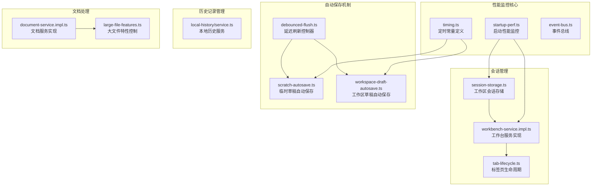
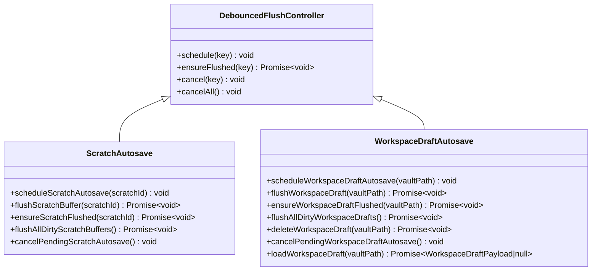
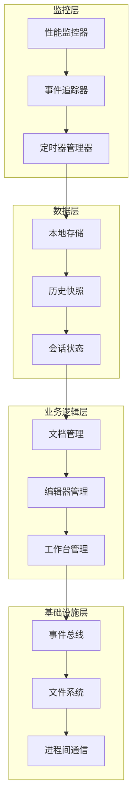
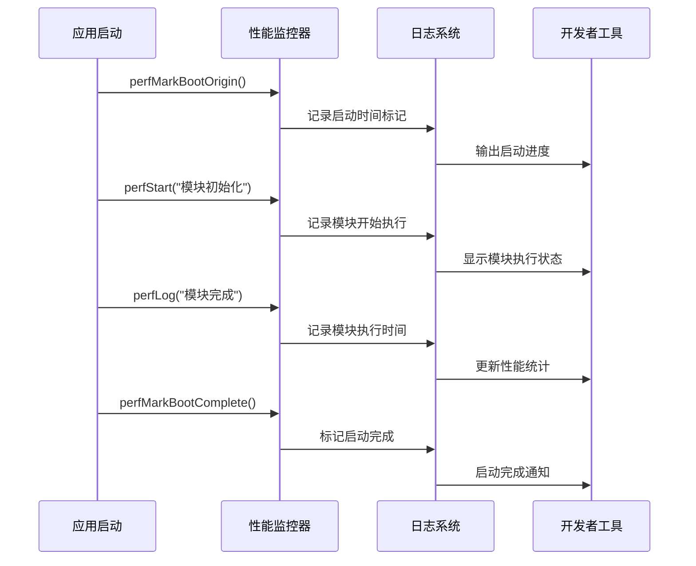
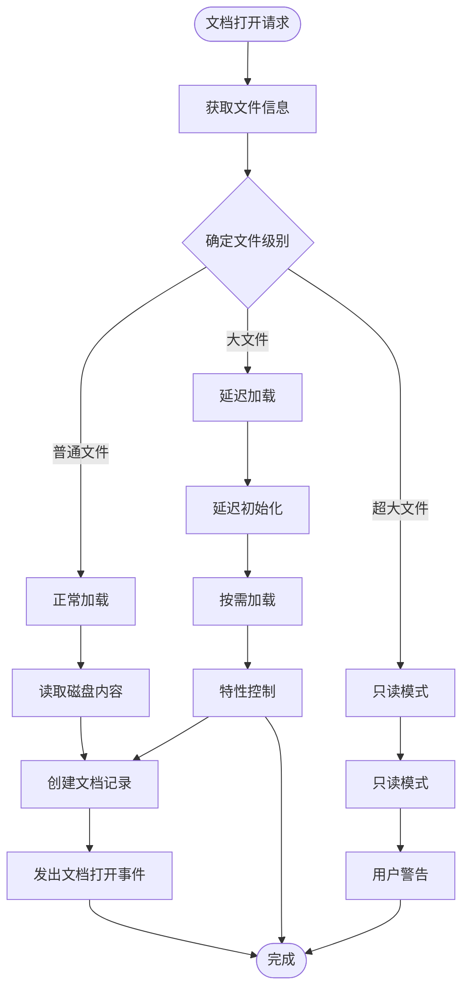
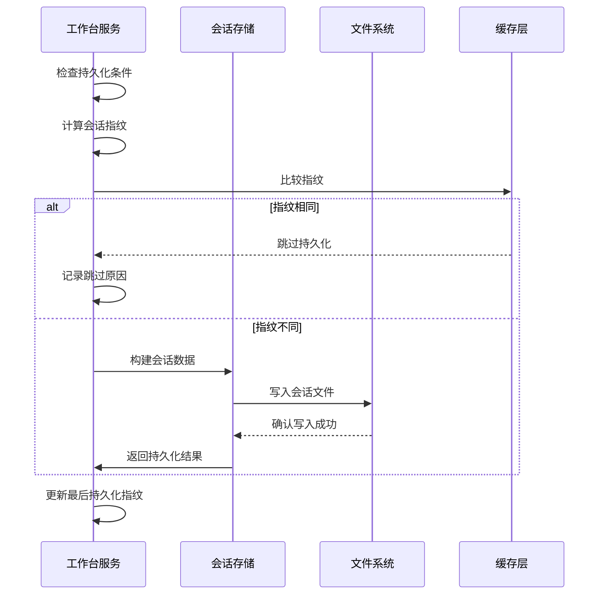
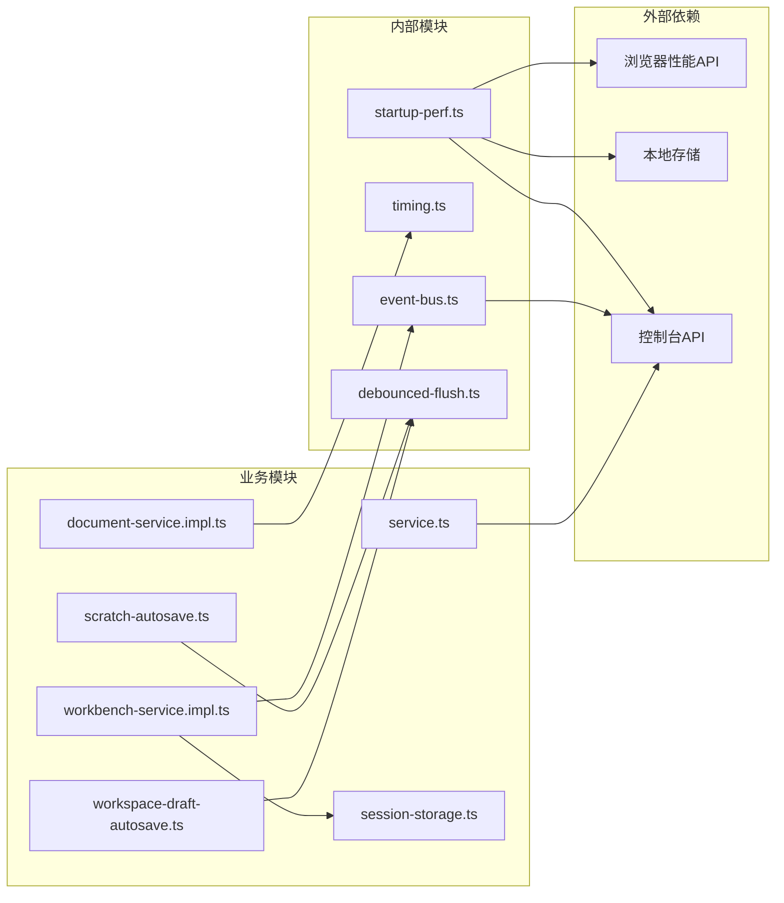

# 性能监控系统

<cite>
**本文档中引用的文件**
- [startup-perf.ts](file://src/lib/startup-perf.ts)
- [timing.ts](file://src/core/platform/timing.ts)
- [debounced-flush.ts](file://src/core/session/debounced-flush.ts)
- [scratch-autosave.ts](file://src/core/session/scratch-autosave.ts)
- [workspace-draft-autosave.ts](file://src/core/session/workspace-draft-autosave.ts)
- [service.ts](file://src/core/local-history/service.ts)
- [session-storage.ts](file://src/core/workbench/session-storage.ts)
- [workbench-service.impl.ts](file://src/core/workbench/workbench-service.impl.ts)
- [document-service.impl.ts](file://src/core/document/document-service.impl.ts)
- [event-bus.ts](file://src/core/platform/event-bus.ts)
- [tab-lifecycle.ts](file://src/core/session/tab-lifecycle.ts)
- [large-file-features.ts](file://src/core/document/large-file-features.ts)
</cite>

## 目录
1. [简介](#简介)
2. [项目结构](#项目结构)
3. [核心组件](#核心组件)
4. [架构概览](#架构概览)
5. [详细组件分析](#详细组件分析)
6. [依赖关系分析](#依赖关系分析)
7. [性能考虑](#性能考虑)
8. [故障排除指南](#故障排除指南)
9. [结论](#结论)

## 简介

NoteForge 性能监控系统是一个全面的性能观测和分析框架，旨在提供细粒度的应用启动时间跟踪、异步操作监控、内存使用分析和用户体验指标收集。该系统通过多种监控机制确保应用在不同场景下的性能表现，并为开发者提供深入的性能洞察。

系统的核心特性包括：
- 启动阶段的精确时间测量
- 异步操作的自动性能追踪
- 延迟刷新机制的性能优化
- 大文件处理的智能降级策略
- 本地历史记录的自动快照管理

## 项目结构

性能监控系统在项目中的组织结构如下：

**图表来源**
- [startup-perf.ts:1-134](file://src/lib/startup-perf.ts#L1-L134)
- [timing.ts:1-24](file://src/core/platform/timing.ts#L1-L24)
- [session-storage.ts:59-101](file://src/core/workbench/session-storage.ts#L59-L101)

## 核心组件

### 启动性能监控器

启动性能监控器提供了应用启动过程的精细时间跟踪能力，支持开发环境和生产环境的动态启用。

**关键特性：**
- 支持开发模式自动启用和生产模式手动控制
- 提供层次化的性能日志输出
- 包含启动阶段的精确时间标记
- 支持额外参数的性能数据记录

**启用机制：**
- 开发环境：自动启用，无需额外配置
- 生产环境：通过本地存储键值对进行控制

**章节来源**
- [startup-perf.ts:1-134](file://src/lib/startup-perf.ts#L1-L134)

### 延迟刷新控制器

延迟刷新控制器是性能监控系统的核心组件，用于管理各种异步操作的批量处理和去抖动机制。

**图表来源**
- [debounced-flush.ts:1-63](file://src/core/session/debounced-flush.ts#L1-L63)
- [scratch-autosave.ts:1-64](file://src/core/session/scratch-autosave.ts#L1-L64)
- [workspace-draft-autosave.ts:1-85](file://src/core/session/workspace-draft-autosave.ts#L1-L85)

**章节来源**
- [debounced-flush.ts:1-63](file://src/core/session/debounced-flush.ts#L1-L63)
- [scratch-autosave.ts:1-64](file://src/core/session/scratch-autosave.ts#L1-L64)
- [workspace-draft-autosave.ts:1-85](file://src/core/session/workspace-draft-autosave.ts#L1-L85)

### 本地历史服务

本地历史服务负责管理跨重启的版本快照，提供自动和手动的历史记录保存机制。

**核心功能：**
- 自动快照间隔（5分钟）
- 手动保存触发
- 历史记录查询和恢复
- 内存优化的快照管理

**章节来源**
- [service.ts:1-105](file://src/core/local-history/service.ts#L1-L105)

## 架构概览

性能监控系统的整体架构采用分层设计，确保各个组件之间的松耦合和高内聚。

**图表来源**
- [startup-perf.ts:1-134](file://src/lib/startup-perf.ts#L1-L134)
- [event-bus.ts:1-36](file://src/core/platform/event-bus.ts#L1-L36)
- [timing.ts:1-24](file://src/core/platform/timing.ts#L1-L24)

## 详细组件分析

### 启动性能监控流程

启动性能监控系统通过精确的时间标记和层次化日志输出，为应用启动过程提供全面的性能分析。

**图表来源**
- [startup-perf.ts:40-51](file://src/lib/startup-perf.ts#L40-L51)
- [startup-perf.ts:72-76](file://src/lib/startup-perf.ts#L72-L76)

**章节来源**
- [startup-perf.ts:40-51](file://src/lib/startup-perf.ts#L40-L51)
- [startup-perf.ts:72-76](file://src/lib/startup-perf.ts#L72-L76)

### 文档加载性能优化

文档服务实现了智能的大文件处理策略，根据文件大小自动选择最优的加载和渲染方案。

**图表来源**
- [document-service.impl.ts:380-405](file://src/core/document/document-service.impl.ts#L380-L405)
- [large-file-features.ts:43-67](file://src/core/document/large-file-features.ts#L43-L67)

**章节来源**
- [document-service.impl.ts:380-405](file://src/core/document/document-service.impl.ts#L380-L405)
- [large-file-features.ts:43-67](file://src/core/document/large-file-features.ts#L43-L67)

### 会话持久化性能监控

工作台服务实现了高效的会话持久化机制，通过去抖动和指纹检查避免不必要的写操作。

**图表来源**
- [workbench-service.impl.ts:436-474](file://src/core/workbench/workbench-service.impl.ts#L436-L474)
- [session-storage.ts:59-101](file://src/core/workbench/session-storage.ts#L59-L101)

**章节来源**
- [workbench-service.impl.ts:436-474](file://src/core/workbench/workbench-service.impl.ts#L436-L474)
- [session-storage.ts:59-101](file://src/core/workbench/session-storage.ts#L59-L101)

## 依赖关系分析

性能监控系统的依赖关系体现了清晰的分层架构和职责分离。

**图表来源**
- [startup-perf.ts:18-38](file://src/lib/startup-perf.ts#L18-L38)
- [debounced-flush.ts:8-12](file://src/core/session/debounced-flush.ts#L8-L12)
- [event-bus.ts:1-36](file://src/core/platform/event-bus.ts#L1-L36)

**章节来源**
- [startup-perf.ts:18-38](file://src/lib/startup-perf.ts#L18-L38)
- [debounced-flush.ts:8-12](file://src/core/session/debounced-flush.ts#L8-L12)
- [event-bus.ts:1-36](file://src/core/platform/event-bus.ts#L1-L36)

## 性能考虑

### 时间复杂度分析

性能监控系统的关键算法具有以下时间复杂度特征：

**延迟刷新机制：**
- 调度操作：O(1) - 使用Map存储定时器
- 确保刷新：O(1) - 并发控制通过Promise集合
- 取消操作：O(1) - 直接清除定时器映射

**会话持久化：**
- 指纹计算：O(n) - n为会话数据大小
- 条件检查：O(1) - 布尔比较
- 文件写入：O(n) - n为序列化后的数据大小

### 内存使用优化

系统采用了多种内存优化策略：

**事件驱动架构：**
- 使用事件总线减少直接依赖
- 按需加载模块避免内存占用
- 弱引用防止循环引用

**缓存策略：**
- 会话指纹缓存避免重复计算
- 文档内容懒加载减少内存占用
- 自动清理机制释放不再使用的资源

### 性能监控指标

系统收集的关键性能指标包括：

**启动阶段指标：**
- 应用入口到引导完成时间
- 各模块初始化耗时
- 资源加载延迟

**运行时指标：**
- 文档打开响应时间
- 会话持久化频率
- 自动保存触发间隔
- 历史快照创建开销

## 故障排除指南

### 常见性能问题诊断

**启动缓慢问题：**
1. 检查启动性能日志中的模块执行时间
2. 分析是否存在阻塞的同步操作
3. 验证第三方库的加载顺序

**内存泄漏排查：**
1. 监控事件监听器的注册和注销
2. 检查定时器和Interval的正确清理
3. 验证Promise链的异常处理

**I/O性能问题：**
1. 分析文件读写的批处理策略
2. 检查磁盘访问的并发限制
3. 验证缓存命中率

### 调试工具使用

**性能监控开关：**
- 开发环境：自动启用，无需配置
- 生产环境：通过localStorage键值控制

**日志过滤：**
- 控制台过滤器：`NoteForge:perf`
- 详细程度：可配置的性能日志级别

**章节来源**
- [startup-perf.ts:22-29](file://src/lib/startup-perf.ts#L22-L29)
- [startup-perf.ts:57-70](file://src/lib/startup-perf.ts#L57-L70)

## 结论

NoteForge 性能监控系统通过多层次的设计和精心的实现，为现代富文本编辑器提供了全面的性能保障。系统的核心优势包括：

**技术优势：**
- 精细的启动时间跟踪机制
- 智能的延迟刷新和去抖动策略
- 高效的会话持久化和恢复
- 自适应的大文件处理方案

**架构优势：**
- 清晰的分层设计和职责分离
- 灵活的插件式扩展机制
- 强大的事件驱动架构
- 完善的错误处理和恢复机制

**实践价值：**
- 为开发者提供深入的性能洞察
- 支持生产环境的持续性能监控
- 提供可量化的性能改进指导
- 建立完善的性能基准测试体系

该系统不仅满足了当前的功能需求，还为未来的性能优化和扩展奠定了坚实的基础，是构建高性能应用的重要基础设施。