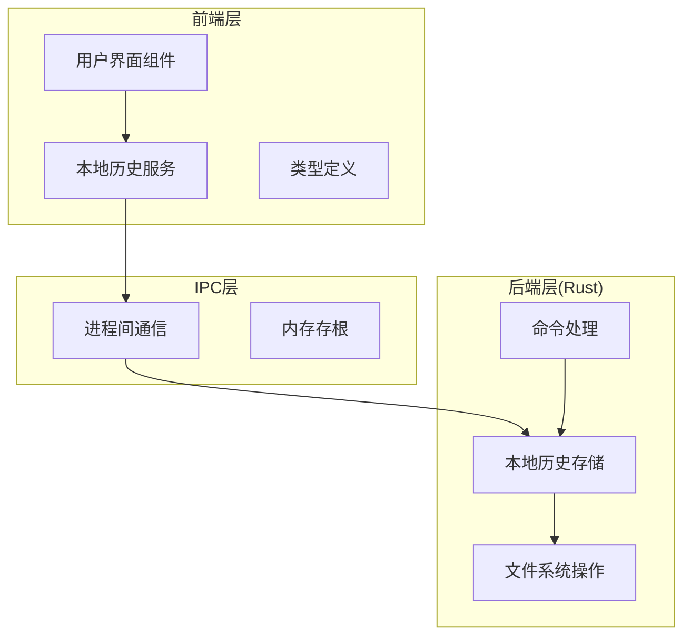
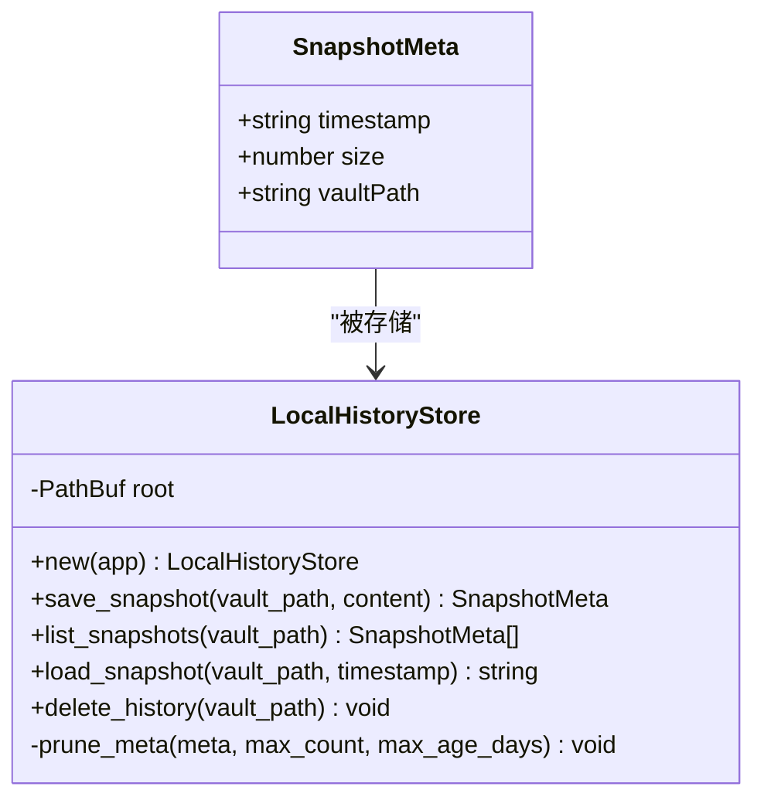
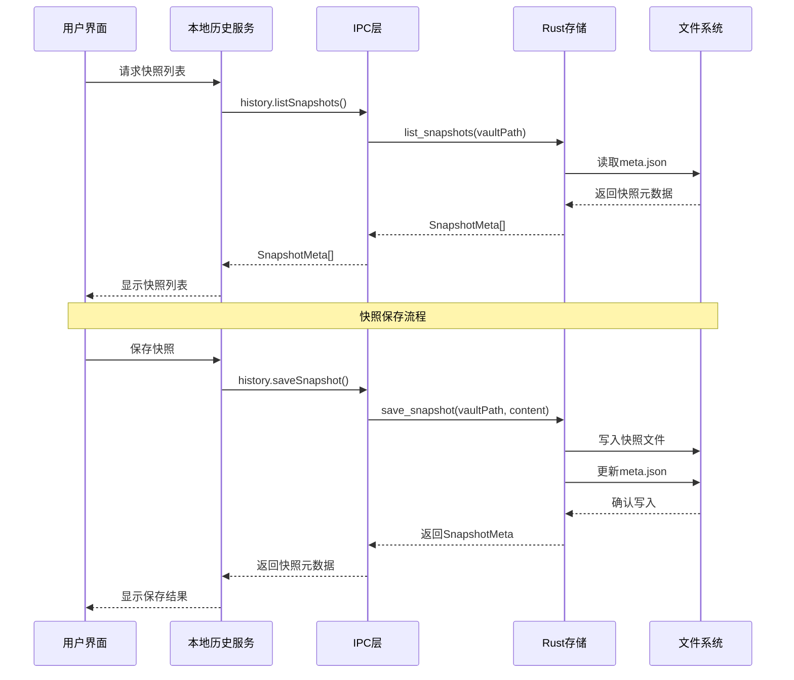
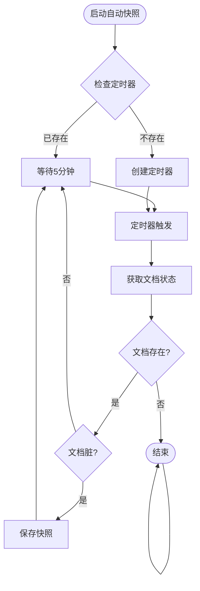
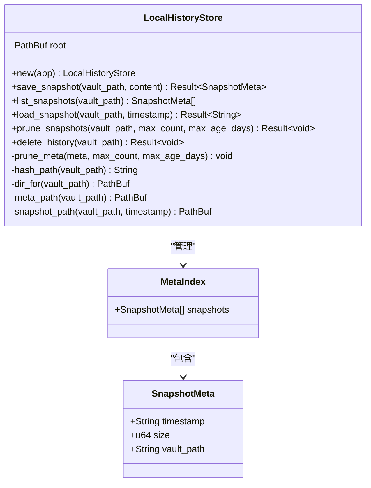
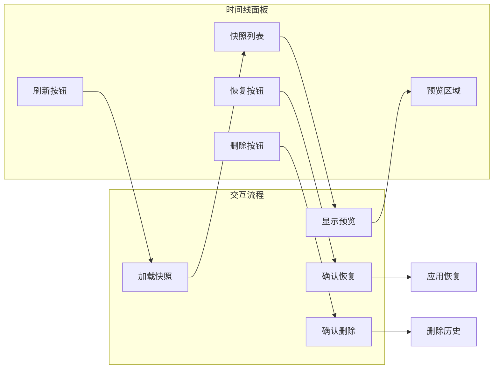
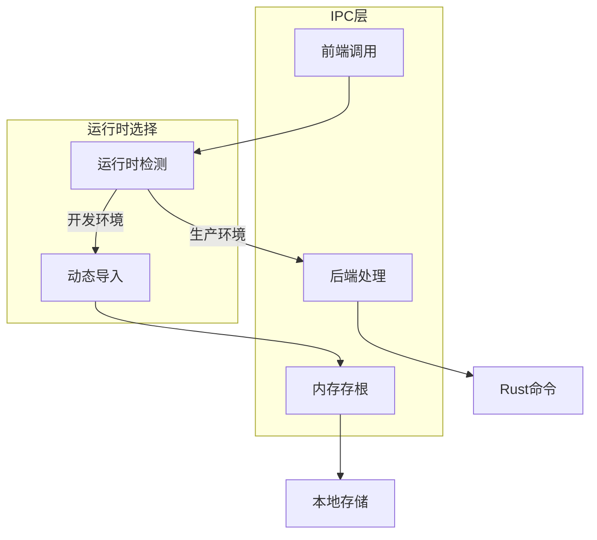
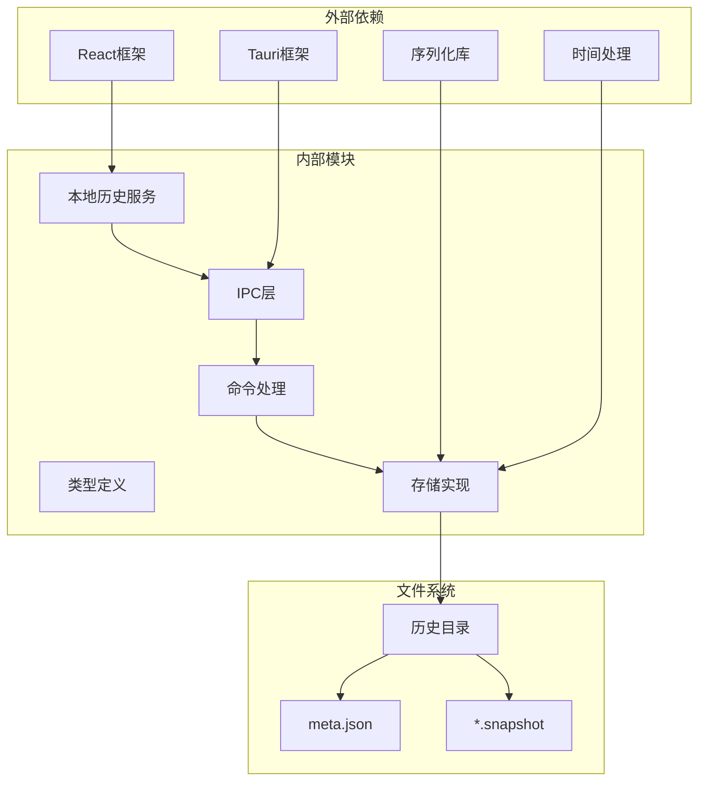
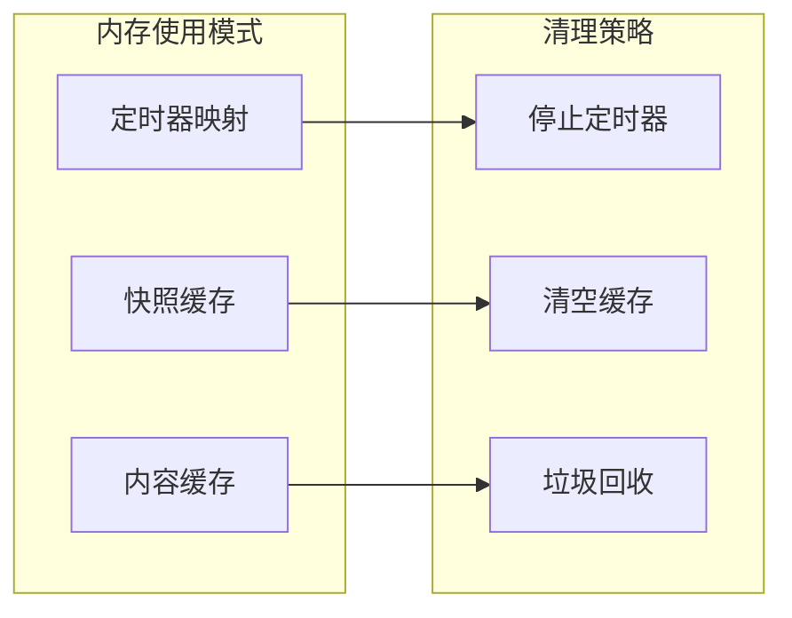

# 本地历史系统

<cite>
**本文档引用的文件**
- [service.ts](file://src/core/local-history/service.ts)
- [types.ts](file://src/core/local-history/types.ts)
- [local_history.rs](file://src-tauri/src/local_history.rs)
- [local_history.rs](file://src-tauri/src/commands/local_history.rs)
- [TimelinePanel.tsx](file://src/components/right/TimelinePanel.tsx)
- [stub.ts](file://src/ipc/stub.ts)
</cite>

## 目录
1. [简介](#简介)
2. [项目结构](#项目结构)
3. [核心组件](#核心组件)
4. [架构概览](#架构概览)
5. [详细组件分析](#详细组件分析)
6. [依赖关系分析](#依赖关系分析)
7. [性能考虑](#性能考虑)
8. [故障排除指南](#故障排除指南)
9. [结论](#结论)

## 简介

本地历史系统是 NoteForge 应用程序中的一个关键功能模块，它提供了跨重启的版本快照功能。该系统允许用户在不保存到持久存储的情况下，保留文档的历史版本，从而提供更好的数据保护和恢复能力。

系统支持多种快照触发机制：
- 手动保存后自动创建快照
- 每5分钟对脏文档进行自动间隔快照
- 草稿缓冲区刷新成功后的快照

## 项目结构

本地历史系统的实现采用分层架构设计，主要包含以下层次：

**图表来源**
- [service.ts:1-105](file://src/core/local-history/service.ts#L1-L105)
- [local_history.rs:1-205](file://src-tauri/src/local_history.rs#L1-L205)

**章节来源**
- [service.ts:1-105](file://src/core/local-history/service.ts#L1-L105)
- [types.ts:1-6](file://src/core/local-history/types.ts#L1-L6)

## 核心组件

### 服务层 (Service Layer)

服务层提供了统一的JavaScript API接口，封装了底层的IPC通信细节。主要功能包括：

- 快照保存：`saveHistorySnapshot()`
- 快照列表：`listHistorySnapshots()`
- 快照加载：`loadHistorySnapshot()`
- 自动快照管理：`startAutoSnapshot()`, `stopAutoSnapshot()`
- 历史清理：`deleteHistory()`

### 数据模型 (Data Model)

系统使用标准化的数据结构来表示快照元数据：

**图表来源**
- [types.ts:1-6](file://src/core/local-history/types.ts#L1-L6)
- [local_history.rs:17-32](file://src-tauri/src/local_history.rs#L17-L32)

**章节来源**
- [types.ts:1-6](file://src/core/local-history/types.ts#L1-L6)
- [service.ts:24-104](file://src/core/local-history/service.ts#L24-L104)

## 架构概览

本地历史系统采用客户端-服务器架构，通过IPC机制实现前后端通信：

**图表来源**
- [service.ts:24-61](file://src/core/local-history/service.ts#L24-L61)
- [local_history.rs:6-30](file://src-tauri/src/commands/local_history.rs#L6-L30)

## 详细组件分析

### 自动快照机制

系统实现了智能的自动快照机制，通过定时器每5分钟检查一次脏文档的状态：

**图表来源**
- [service.ts:63-77](file://src/core/local-history/service.ts#L63-L77)

自动快照的关键特性：
- **触发条件**：仅当文档处于脏状态时才执行
- **频率控制**：固定5分钟间隔
- **内存管理**：使用Map结构跟踪每个路径的定时器
- **资源清理**：应用退出时停止所有定时器

**章节来源**
- [service.ts:63-94](file://src/core/local-history/service.ts#L63-L94)

### 快照存储策略

Rust后端实现了高效的快照存储和管理策略：

**图表来源**
- [local_history.rs:30-32](file://src-tauri/src/local_history.rs#L30-L32)
- [local_history.rs:25-28](file://src-tauri/src/local_history.rs#L25-L28)

存储策略的关键参数：
- **最大快照数量**：默认50个快照
- **最大存储期限**：默认30天
- **目录结构**：基于哈希的路径组织
- **元数据管理**：JSON格式的索引文件

**章节来源**
- [local_history.rs:12-15](file://src-tauri/src/local_history.rs#L12-L15)
- [local_history.rs:45-53](file://src-tauri/src/local_history.rs#L45-L53)

### 用户界面集成

时间线面板提供了直观的快照浏览和恢复功能：

**图表来源**
- [TimelinePanel.tsx:16-35](file://src/components/right/TimelinePanel.tsx#L16-L35)

界面组件的主要功能：
- **实时加载**：启动时自动加载快照列表
- **预览支持**：点击快照查看内容预览
- **批量操作**：支持删除特定历史记录
- **状态管理**：处理加载和错误状态

**章节来源**
- [TimelinePanel.tsx:1-35](file://src/components/right/TimelinePanel.tsx#L1-L35)

### IPC通信机制

系统实现了灵活的IPC通信层，支持开发环境下的内存存根：

**图表来源**
- [service.ts:14-19](file://src/core/local-history/service.ts#L14-L19)
- [stub.ts:1081-1126](file://src/ipc/stub.ts#L1081-L1126)

IPC层的设计优势：
- **环境适配**：根据运行环境选择合适的实现
- **类型安全**：完整的TypeScript类型定义
- **错误处理**：统一的异常处理机制
- **性能优化**：动态导入避免不必要的开销

**章节来源**
- [service.ts:14-19](file://src/core/local-history/service.ts#L14-L19)
- [stub.ts:1081-1126](file://src/ipc/stub.ts#L1081-L1126)

## 依赖关系分析

本地历史系统的依赖关系呈现清晰的分层结构：

**图表来源**
- [service.ts:1-105](file://src/core/local-history/service.ts#L1-L105)
- [local_history.rs:1-205](file://src-tauri/src/local_history.rs#L1-L205)

依赖关系特点：
- **低耦合高内聚**：各层职责明确，相互独立
- **渐进式加载**：IPC层支持动态导入
- **类型安全保障**：完整的TypeScript类型系统
- **平台兼容性**：支持不同运行环境

**章节来源**
- [local_history.rs:1-205](file://src-tauri/src/local_history.rs#L1-L205)

## 性能考虑

### 存储优化

系统采用了多项性能优化策略：

1. **智能清理机制**：自动删除过期和过多的快照
2. **增量更新**：仅在必要时更新元数据文件
3. **内存缓存**：定时器状态和最近访问的快照
4. **异步操作**：所有文件操作都是非阻塞的

### 内存管理

**图表来源**
- [service.ts:88-94](file://src/core/local-history/service.ts#L88-L94)

### 并发处理

系统支持多文档并发快照，通过以下机制保证数据一致性：
- **路径隔离**：每个文档路径有独立的存储空间
- **原子操作**：快照创建和元数据更新的原子性
- **冲突避免**：自动快照仅在文档脏状态下触发

## 故障排除指南

### 常见问题及解决方案

| 问题类型 | 症状描述 | 可能原因 | 解决方案 |
|---------|---------|---------|---------|
| 快照无法保存 | `saveSnapshot`返回null | IPC通信失败或磁盘空间不足 | 检查应用数据目录权限，清理磁盘空间 |
| 快照列表为空 | `listSnapshots`返回空数组 | 文档路径错误或历史已被清理 | 验证文档路径，检查快照保留策略 |
| 快照加载失败 | `loadSnapshot`抛出异常 | 快照文件损坏或不存在 | 删除损坏的快照，重新创建 |
| 自动快照不工作 | 定时器未触发 | 文档未标记为脏状态 | 检查文档编辑状态，验证定时器逻辑 |

### 调试技巧

1. **启用详细日志**：检查控制台输出的错误信息
2. **验证文件权限**：确保应用有读写历史目录的权限
3. **监控磁盘空间**：定期清理过期快照释放空间
4. **测试IPC连接**：验证前端与后端的通信状态

**章节来源**
- [service.ts:29-35](file://src/core/local-history/service.ts#L29-L35)
- [local_history.rs:134-144](file://src-tauri/src/local_history.rs#L134-L144)

## 结论

本地历史系统通过精心设计的分层架构和智能的存储策略，为NoteForge应用提供了可靠的文档版本管理功能。系统的主要优势包括：

1. **可靠性**：跨重启的快照持久化，确保数据安全
2. **易用性**：直观的时间线界面，支持快速浏览和恢复
3. **性能**：智能清理和缓存机制，保持系统响应速度
4. **可维护性**：清晰的代码结构和完善的错误处理

该系统为开发者提供了扩展的基础，可以进一步增强功能如快照比较、批量操作等高级特性。通过持续的优化和改进，本地历史系统将继续为用户提供可靠的数据保护服务。