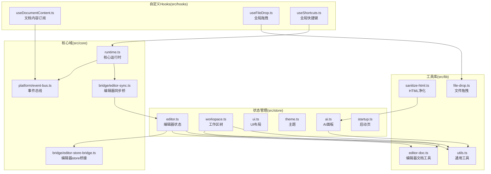
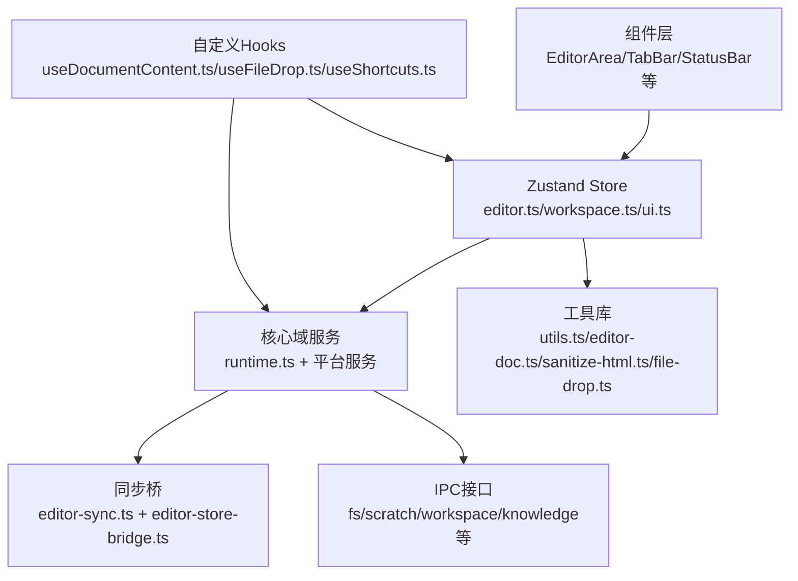
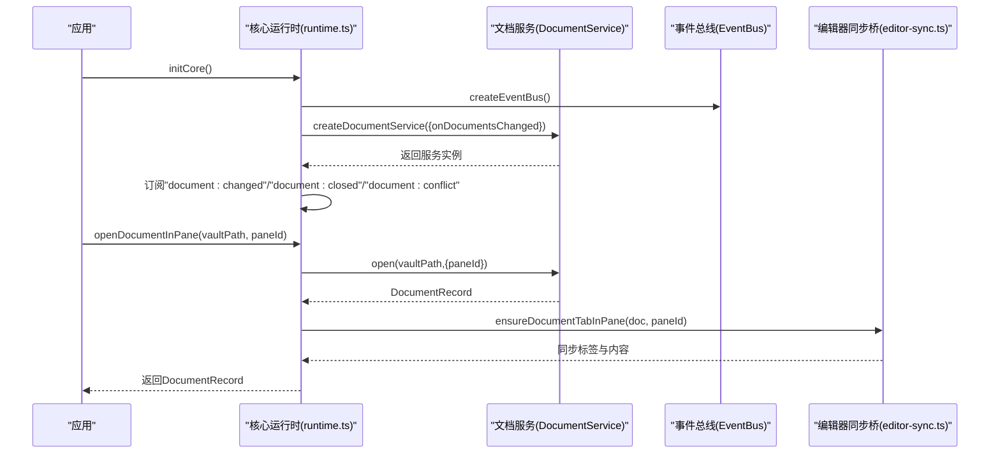
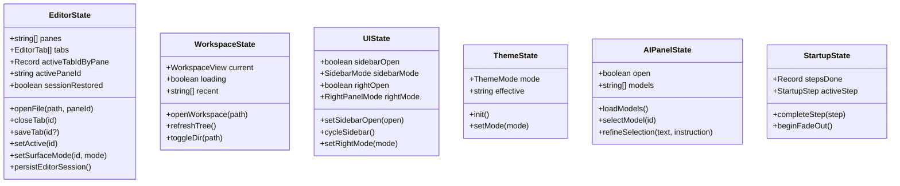
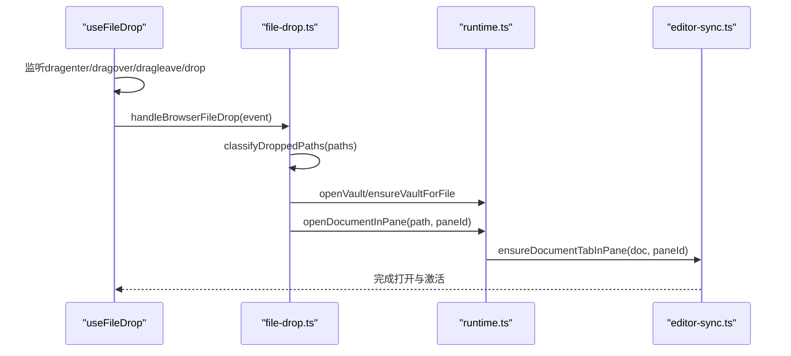
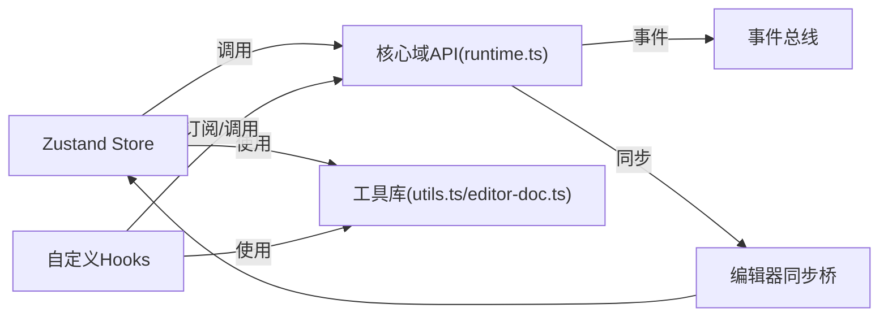

# 核心模块

<cite>
**本文引用的文件**
- [src/core/runtime.ts](file://src/core/runtime.ts)
- [src/core/index.ts](file://src/core/index.ts)
- [src/store/editor.ts](file://src/store/editor.ts)
- [src/store/workspace.ts](file://src/store/workspace.ts)
- [src/store/ui.ts](file://src/store/ui.ts)
- [src/store/theme.ts](file://src/store/theme.ts)
- [src/store/ai.ts](file://src/store/ai.ts)
- [src/store/startup.ts](file://src/store/startup.ts)
- [src/hooks/useDocumentContent.ts](file://src/hooks/useDocumentContent.ts)
- [src/hooks/useFileDrop.ts](file://src/hooks/useFileDrop.ts)
- [src/hooks/useShortcuts.ts](file://src/hooks/useShortcuts.ts)
- [src/core/platform/event-bus.ts](file://src/core/platform/event-bus.ts)
- [src/core/bridge/editor-sync.ts](file://src/core/bridge/editor-sync.ts)
- [src/core/bridge/editor-store-bridge.ts](file://src/core/bridge/editor-store-bridge.ts)
- [src/lib/utils.ts](file://src/lib/utils.ts)
- [src/lib/editor-doc.ts](file://src/lib/editor-doc.ts)
- [src/lib/sanitize-html.ts](file://src/lib/sanitize-html.ts)
- [src/lib/file-drop.ts](file://src/lib/file-drop.ts)
</cite>

## 目录
1. [引言](#引言)
2. [项目结构](#项目结构)
3. [核心组件](#核心组件)
4. [架构总览](#架构总览)
5. [详细组件分析](#详细组件分析)
6. [依赖分析](#依赖分析)
7. [性能考量](#性能考量)
8. [故障排查指南](#故障排查指南)
9. [结论](#结论)
10. [附录](#附录)

## 引言
本文件面向NoteForge核心模块，系统性梳理其运行时系统设计与实现，涵盖依赖注入机制、模块初始化流程与生命周期管理；深入解析状态管理（Zustand stores）的架构与职责边界；阐述自定义Hooks在文档内容订阅、文件拖拽处理、快捷键绑定中的设计模式与使用场景；总结工具库在编辑器状态管理、文件操作、HTML清理等方面的实现要点；最后给出模块间依赖关系、交互模式、使用示例与最佳实践，并提供性能优化建议与扩展点说明。

## 项目结构
NoteForge采用“核心域服务 + 前端状态 + 工具库 + 自定义Hooks”的分层组织方式：
- 核心域服务位于src/core，负责事件总线、文档服务、工作台、命令注册表、对话框、知识查询、编辑器宿主等；
- 状态管理位于src/store，以Zustand实现多套store（编辑器、工作区、UI、主题、AI、启动页），承担视图状态与会话持久化；
- 工具库位于src/lib，提供通用工具函数（路径、语言识别、HTML净化、文件拖拽等）；
- 自定义Hooks位于src/hooks，封装跨组件复用逻辑（文档内容订阅、全局快捷键、文件拖拽）。

图表来源
- [src/core/runtime.ts:1-191](file://src/core/runtime.ts#L1-L191)
- [src/core/platform/event-bus.ts:1-37](file://src/core/platform/event-bus.ts#L1-L37)
- [src/core/bridge/editor-sync.ts:1-153](file://src/core/bridge/editor-sync.ts#L1-L153)
- [src/core/bridge/editor-store-bridge.ts:1-28](file://src/core/bridge/editor-store-bridge.ts#L1-L28)
- [src/store/editor.ts:1-833](file://src/store/editor.ts#L1-L833)
- [src/store/workspace.ts:1-158](file://src/store/workspace.ts#L1-L158)
- [src/store/ui.ts:1-86](file://src/store/ui.ts#L1-L86)
- [src/store/theme.ts:1-62](file://src/store/theme.ts#L1-L62)
- [src/store/ai.ts:1-111](file://src/store/ai.ts#L1-L111)
- [src/store/startup.ts:1-56](file://src/store/startup.ts#L1-L56)
- [src/hooks/useDocumentContent.ts:1-48](file://src/hooks/useDocumentContent.ts#L1-L48)
- [src/hooks/useFileDrop.ts:1-149](file://src/hooks/useFileDrop.ts#L1-L149)
- [src/hooks/useShortcuts.ts:1-25](file://src/hooks/useShortcuts.ts#L1-L25)
- [src/lib/utils.ts:1-100](file://src/lib/utils.ts#L1-L100)
- [src/lib/editor-doc.ts:1-208](file://src/lib/editor-doc.ts#L1-L208)
- [src/lib/sanitize-html.ts:1-12](file://src/lib/sanitize-html.ts#L1-L12)
- [src/lib/file-drop.ts:1-192](file://src/lib/file-drop.ts#L1-L192)

章节来源
- [src/core/runtime.ts:1-191](file://src/core/runtime.ts#L1-L191)
- [src/core/index.ts:1-62](file://src/core/index.ts#L1-L62)

## 核心组件
- 依赖注入与运行时
  - 运行时通过initCore集中创建并装配事件总线、文档服务、工作台、命令注册表、对话框、知识查询、编辑器宿主等核心服务，形成单例运行时实例，供全局按需访问。
  - 提供getCore/isCoreInitialized等访问器，确保延迟初始化与幂等。
- 事件总线
  - 事件总线支持类型化订阅与广播，是跨模块解耦的关键枢纽，用于驱动文档变更、冲突提示、会话持久化等。
- 编辑器宿主与同步桥
  - 编辑器宿主负责表面模式切换与内容应用；同步桥负责将DocumentService的状态与内容映射到编辑器store的标签页与视图状态。
- 知识查询与索引
  - 知识查询服务与索引器通过事件总线联动，实现工作区内容的增量索引与查询能力。
- 对话框与命令系统
  - 对话框服务提供统一的模态交互入口；命令注册表提供全局快捷键路由与命令执行。

章节来源
- [src/core/runtime.ts:43-107](file://src/core/runtime.ts#L43-L107)
- [src/core/platform/event-bus.ts:1-37](file://src/core/platform/event-bus.ts#L1-L37)
- [src/core/bridge/editor-sync.ts:108-153](file://src/core/bridge/editor-sync.ts#L108-L153)
- [src/core/bridge/editor-store-bridge.ts:1-28](file://src/core/bridge/editor-store-bridge.ts#L1-L28)

## 架构总览
NoteForge采用“服务导向 + 状态驱动 + 事件驱动”的混合架构：
- 服务层：核心域服务提供业务能力（文档、工作台、命令、对话框、知识、编辑器宿主）。
- 状态层：Zustand store承载UI状态、会话状态、主题、AI面板、启动页等。
- 工具层：通用工具函数与IPC封装，支撑编辑器、文件系统、HTML净化等。
- Hooks层：封装跨组件共享逻辑，降低组件复杂度。

图表来源
- [src/core/runtime.ts:1-191](file://src/core/runtime.ts#L1-L191)
- [src/store/editor.ts:1-833](file://src/store/editor.ts#L1-L833)
- [src/store/workspace.ts:1-158](file://src/store/workspace.ts#L1-L158)
- [src/hooks/useDocumentContent.ts:1-48](file://src/hooks/useDocumentContent.ts#L1-L48)
- [src/hooks/useFileDrop.ts:1-149](file://src/hooks/useFileDrop.ts#L1-L149)
- [src/hooks/useShortcuts.ts:1-25](file://src/hooks/useShortcuts.ts#L1-L25)
- [src/lib/utils.ts:1-100](file://src/lib/utils.ts#L1-L100)
- [src/lib/editor-doc.ts:1-208](file://src/lib/editor-doc.ts#L1-L208)
- [src/lib/sanitize-html.ts:1-12](file://src/lib/sanitize-html.ts#L1-L12)
- [src/lib/file-drop.ts:1-192](file://src/lib/file-drop.ts#L1-L192)

## 详细组件分析

### 依赖注入与运行时系统
- 初始化流程
  - 创建事件总线；
  - 创建并装配VaultService、DocumentService、WorkbenchService、CommandRegistry、DialogService、KnowledgeQueryService、EditorHostServiceImpl；
  - 订阅文档事件（冲突、关闭、变更）并触发对话框与会话持久化；
  - 注册核心命令。
- 生命周期管理
  - 提供flushCoreBeforeExit在退出前清理自动保存、刷新文档与持久化会话；
  - 提供restoreWorkspaceSession与scheduleWorkspacePersist进行会话恢复与调度持久化。
- 全局API
  - openVault/pickAndOpenVault/openDocumentInPane/createUntitledInPane/saveDocument等便捷方法统一封装核心域调用。

图表来源
- [src/core/runtime.ts:43-136](file://src/core/runtime.ts#L43-L136)
- [src/core/bridge/editor-sync.ts:108-131](file://src/core/bridge/editor-sync.ts#L108-L131)

章节来源
- [src/core/runtime.ts:43-191](file://src/core/runtime.ts#L43-L191)

### 状态管理系统（Zustand Stores）
- 编辑器状态（useEditorStore）
  - 职责：管理多窗格、多标签、活动标签与窗格、草稿/工作区标签、表面模式、树同步联动、关闭队列与应用退出流程、会话持久化。
  - 数据结构：panes、tabs、activeTabIdByPane、activePaneId、revealLineRequest、caretStatusByTab等。
  - 同步机制：通过editor-sync桥将DocumentService的元数据与内容同步至编辑器标签与表面；通过editor-store-bridge向编辑器宿主推送表面模式变更。
  - 持久化策略：通过工作台服务调度持久化；在应用退出前统一flush与持久化。
- 工作区状态（useWorkspaceStore）
  - 职责：工作区列表、当前工作区、目录树、展开状态、最近工作区；提供打开工作区、刷新树、增删改查等操作。
  - 持久化策略：基于IPC读写文件系统，树结构按需懒加载。
- UI状态（useUIStore）
  - 职责：侧边栏/右侧面板开关与模式、宽度、问题面板、命令面板、全局搜索、导入向导、新建记忆、设置、引导标记。
  - 持久化策略：本地存储onboarded标记。
- 主题状态（useThemeStore）
  - 职责：主题模式（跟随系统/浅色/深色）、有效主题、系统主题监听、缓存读写。
  - 持久化策略：本地缓存与DOM类名切换。
- AI状态（useAIStore）
  - 职责：模型列表、指令、结果、历史、状态（就绪/离线/无可用模型）。
  - 持久化策略：本地内存，随会话重置。
- 启动页状态（useStartupStore）
  - 职责：启动步骤跟踪、进度计算、淡出与隐藏。
  - 持久化策略：本地内存。

图表来源
- [src/store/editor.ts:65-115](file://src/store/editor.ts#L65-L115)
- [src/store/workspace.ts:5-22](file://src/store/workspace.ts#L5-L22)
- [src/store/ui.ts:6-35](file://src/store/ui.ts#L6-L35)
- [src/store/theme.ts:11-16](file://src/store/theme.ts#L11-L16)
- [src/store/ai.ts:5-26](file://src/store/ai.ts#L5-L26)
- [src/store/startup.ts:13-22](file://src/store/startup.ts#L13-L22)

章节来源
- [src/store/editor.ts:1-833](file://src/store/editor.ts#L1-L833)
- [src/store/workspace.ts:1-158](file://src/store/workspace.ts#L1-L158)
- [src/store/ui.ts:1-86](file://src/store/ui.ts#L1-L86)
- [src/store/theme.ts:1-62](file://src/store/theme.ts#L1-L62)
- [src/store/ai.ts:1-111](file://src/store/ai.ts#L1-L111)
- [src/store/startup.ts:1-56](file://src/store/startup.ts#L1-L56)

### 自定义Hooks设计模式与使用场景
- 文档内容订阅（useDocumentContent）
  - 设计模式：基于React useSyncExternalStore订阅事件总线，仅在目标文档变更时触发重渲染。
  - 使用场景：在组件中以最小粒度订阅特定文档内容或完整记录，避免全局状态风暴。
- 文件拖拽处理（useFileDrop）
  - 设计模式：全局监听dragenter/dragover/dragleave/drop，结合平台差异（浏览器/Tauri）处理OS级拖拽事件；防抖与去重，支持目录与文件分类打开。
  - 使用场景：在应用根部启用全局拖拽打开，自动识别可打开文件类型并打开对应文档或工作区。
- 全局快捷键（useGlobalShortcuts）
  - 设计模式：监听keydown，匹配命令注册表上下文，执行命令；支持修饰键与F1特殊键。
  - 使用场景：为命令系统提供统一的键盘入口，减少重复绑定代码。

图表来源
- [src/hooks/useFileDrop.ts:1-149](file://src/hooks/useFileDrop.ts#L1-L149)
- [src/lib/file-drop.ts:72-133](file://src/lib/file-drop.ts#L72-L133)
- [src/core/runtime.ts:124-129](file://src/core/runtime.ts#L124-L129)
- [src/core/bridge/editor-sync.ts:108-131](file://src/core/bridge/editor-sync.ts#L108-L131)

章节来源
- [src/hooks/useDocumentContent.ts:1-48](file://src/hooks/useDocumentContent.ts#L1-L48)
- [src/hooks/useFileDrop.ts:1-149](file://src/hooks/useFileDrop.ts#L1-L149)
- [src/hooks/useShortcuts.ts:1-25](file://src/hooks/useShortcuts.ts#L1-L25)

### 工具库功能与实现
- 通用工具（utils.ts）
  - 提供类名合并、路径处理、语言检测、格式化等基础能力，支撑UI与文档处理。
- 编辑器文档工具（editor-doc.ts）
  - 提供草稿命名规范、语言推断、扩展名推断、Markdown判定、保存文件名建议等。
- HTML净化（sanitize-html.ts）
  - 基于DOMPurify配置白名单属性与禁用标签，保障预览安全。
- 文件拖拽（file-drop.ts）
  - 实现拖拽路径分类、目录/文件打开、二进制文件过滤、浏览器回退方案、Vault自动关联等。

章节来源
- [src/lib/utils.ts:1-100](file://src/lib/utils.ts#L1-L100)
- [src/lib/editor-doc.ts:1-208](file://src/lib/editor-doc.ts#L1-L208)
- [src/lib/sanitize-html.ts:1-12](file://src/lib/sanitize-html.ts#L1-L12)
- [src/lib/file-drop.ts:1-192](file://src/lib/file-drop.ts#L1-L192)

## 依赖分析
- 组件耦合与内聚
  - 核心运行时作为装配中心，高内聚地组合各服务；通过事件总线与同步桥实现低耦合交互。
  - Zustand store之间保持弱耦合，通过核心域API与事件总线间接通信。
- 直接与间接依赖
  - store依赖工具库与核心域API；hooks依赖store与核心域API；工具库独立且被广泛复用。
- 外部依赖与集成点
  - IPC接口（fs/scratch/workspace/knowledge等）由工具库封装；DOMPurify用于HTML净化；Monaco编辑器通过编辑器宿主接入。
- 接口契约
  - 编辑器同步桥约定最小store切片，避免循环依赖；事件总线提供统一发布/订阅契约。

图表来源
- [src/core/runtime.ts:1-191](file://src/core/runtime.ts#L1-L191)
- [src/core/bridge/editor-sync.ts:1-153](file://src/core/bridge/editor-sync.ts#L1-L153)
- [src/lib/utils.ts:1-100](file://src/lib/utils.ts#L1-L100)
- [src/lib/editor-doc.ts:1-208](file://src/lib/editor-doc.ts#L1-L208)

章节来源
- [src/core/platform/event-bus.ts:1-37](file://src/core/platform/event-bus.ts#L1-L37)
- [src/core/bridge/editor-store-bridge.ts:1-28](file://src/core/bridge/editor-store-bridge.ts#L1-L28)

## 性能考量
- 状态更新粒度
  - 使用Zustand细粒度状态拆分，避免大对象全量替换；编辑器store通过事件总线定向更新，减少不必要重渲染。
- 事件驱动与批处理
  - 通过事件总线聚合文档变更，配合工作台的调度持久化，避免频繁IO。
- 懒加载与按需导入
  - 关键流程（如保存、自动保存）采用动态导入，降低首屏负载。
- 渲染与计算优化
  - 工具库语言/扩展名推断尽量基于内容与路径快速判断，避免昂贵解析。
- 存储与缓存
  - 主题与引导状态使用本地缓存，减少IPC与DOM操作。

## 故障排查指南
- 文档冲突
  - 当检测到外部修改冲突时，运行时订阅事件总线并弹出冲突对话框，确认后可回滚或覆盖。
- 应用退出流程
  - flushCoreBeforeExit会取消待定自动保存、刷新文档并持久化会话；编辑器store在退出前捕获视图状态并持久化。
- 文件拖拽失败
  - 检查拖拽事件是否携带Files类型；确认文件扩展名未被归类为二进制；在浏览器环境检查blob回退路径。
- 快捷键无效
  - 确认已启用全局快捷键监听；检查命令注册表是否正确匹配键位与上下文。

章节来源
- [src/core/runtime.ts:66-96](file://src/core/runtime.ts#L66-L96)
- [src/store/editor.ts:412-440](file://src/store/editor.ts#L412-L440)
- [src/hooks/useFileDrop.ts:19-58](file://src/hooks/useFileDrop.ts#L19-L58)
- [src/hooks/useShortcuts.ts:8-24](file://src/hooks/useShortcuts.ts#L8-L24)

## 结论
NoteForge核心模块通过清晰的服务装配、事件驱动与状态管理，实现了文档、编辑器、工作区与UI的解耦协作。Zustand store提供了高效、可维护的状态层，自定义Hooks提升了跨组件复用与开发效率。工具库与IPC封装保证了平台一致性与安全性。整体架构具备良好的扩展性与可维护性，适合进一步引入更多域服务与特性。

## 附录
- 模块使用示例与最佳实践
  - 在组件中使用useDocumentContent订阅特定文档内容，避免全局状态风暴。
  - 在应用根部启用useFileDrop，统一处理拖拽打开；对二进制文件进行过滤。
  - 使用useGlobalShortcuts绑定命令，确保快捷键与命令注册表一致。
  - 通过runtime提供的API进行文档打开、保存与会话管理，避免直接操作底层状态。
- 扩展点说明
  - 新增域服务：在runtime.ts中注册并注入，通过事件总线与其他模块解耦。
  - 新增store：遵循单一职责，尽量通过核心域API与事件总线交互。
  - 新增工具函数：优先放入lib目录，确保跨模块复用与测试友好。