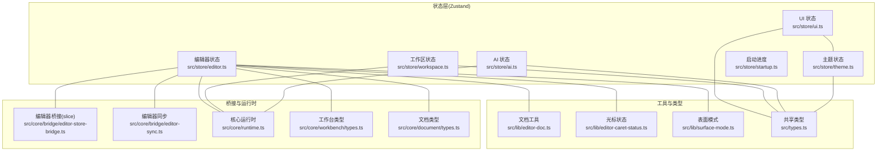
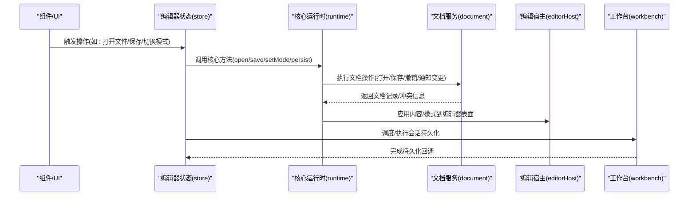
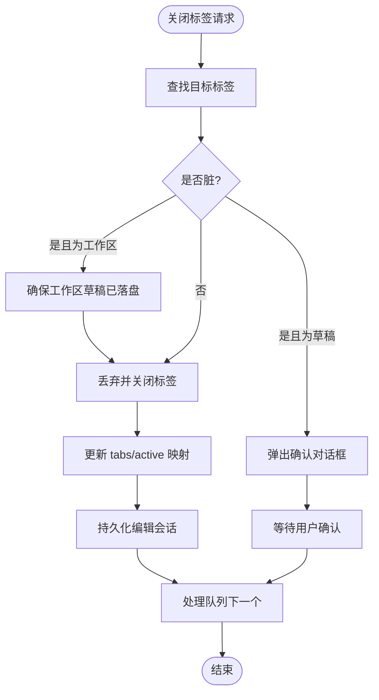
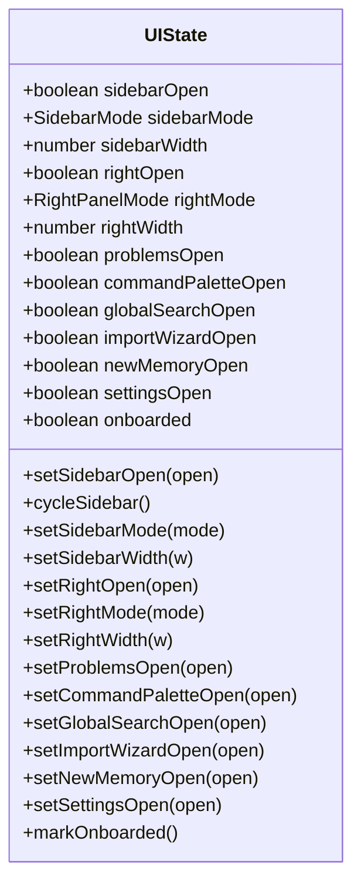
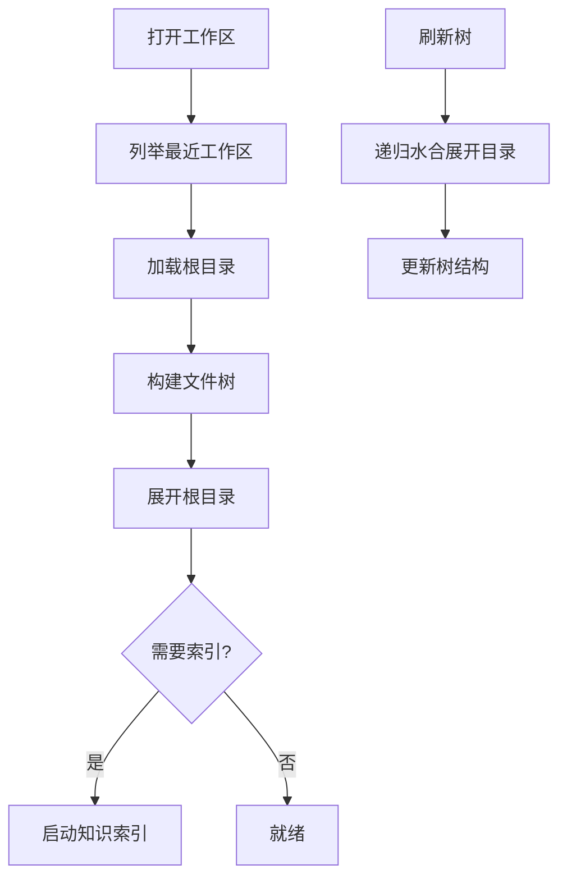
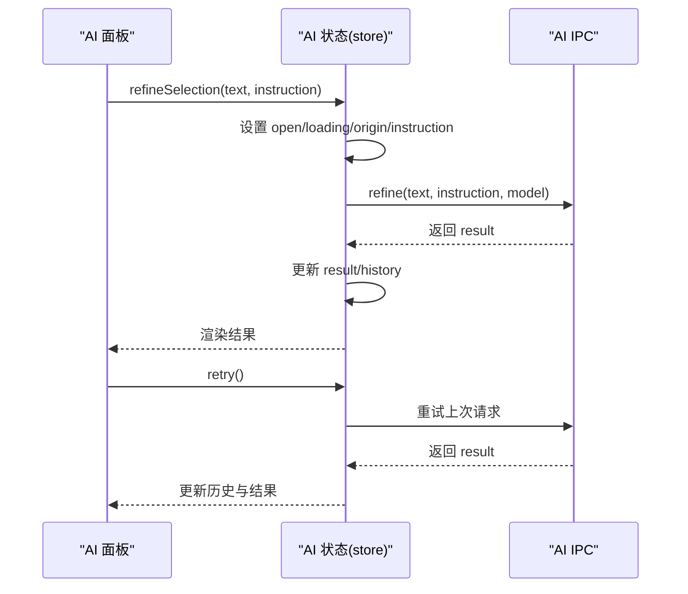
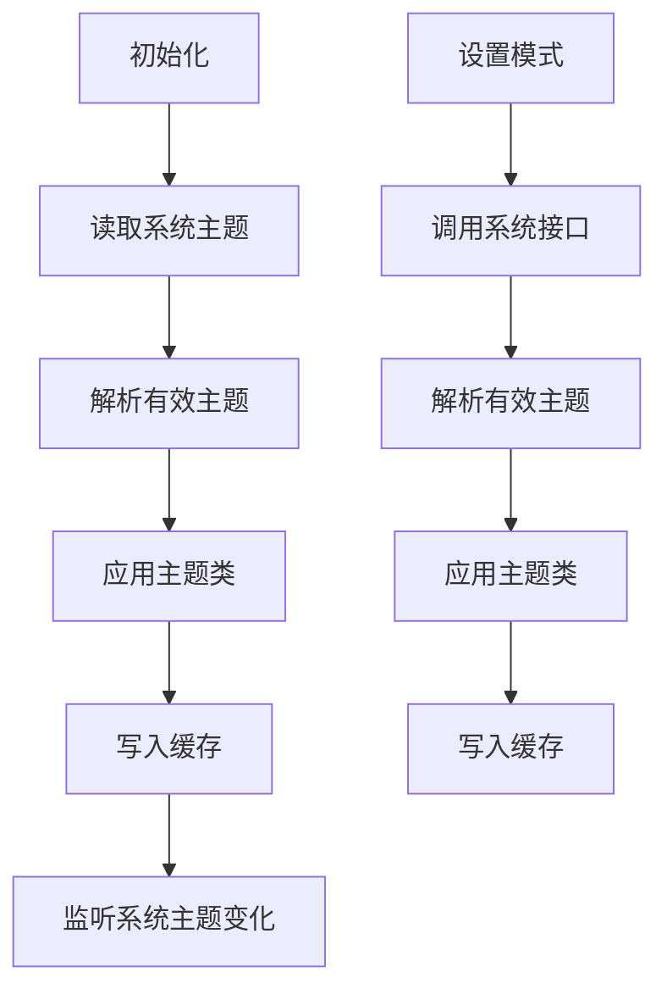
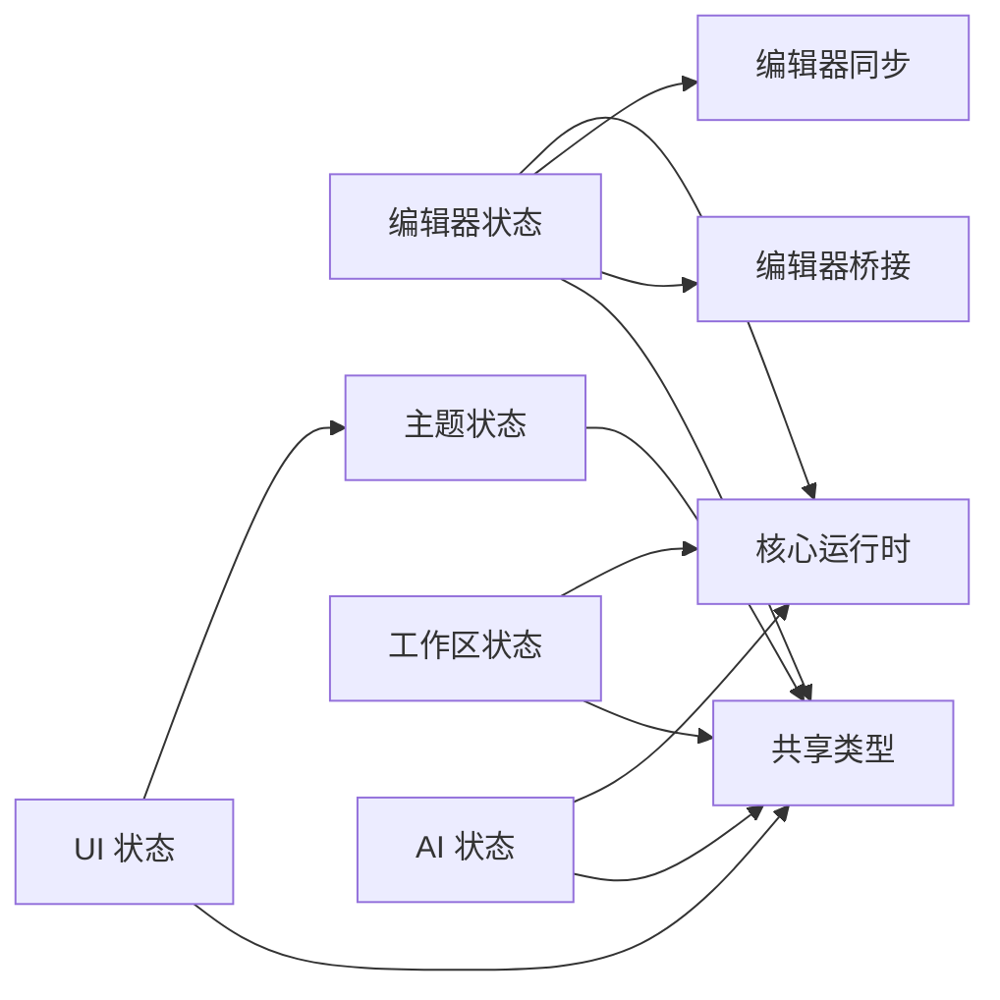

# 状态管理系统

<cite>
**本文引用的文件**
- [src/store/editor.ts](file://src/store/editor.ts)
- [src/store/ui.ts](file://src/store/ui.ts)
- [src/store/workspace.ts](file://src/store/workspace.ts)
- [src/store/ai.ts](file://src/store/ai.ts)
- [src/store/theme.ts](file://src/store/theme.ts)
- [src/store/startup.ts](file://src/store/startup.ts)
- [src/core/bridge/editor-store-bridge.ts](file://src/core/bridge/editor-store-bridge.ts)
- [src/core/bridge/editor-sync.ts](file://src/core/bridge/editor-sync.ts)
- [src/core/session/scratch-autosave.ts](file://src/core/session/scratch-autosave.ts)
- [src/core/runtime.ts](file://src/core/runtime.ts)
- [src/core/workbench/types.ts](file://src/core/workbench/types.ts)
- [src/core/document/types.ts](file://src/core/document/types.ts)
- [src/lib/editor-doc.ts](file://src/lib/editor-doc.ts)
- [src/lib/editor-caret-status.ts](file://src/lib/editor-caret-status.ts)
- [src/lib/surface-mode.ts](file://src/lib/surface-mode.ts)
- [src/types.ts](file://src/types.ts)
</cite>

## 目录
1. [简介](#简介)
2. [项目结构](#项目结构)
3. [核心组件](#核心组件)
4. [架构总览](#架构总览)
5. [详细组件分析](#详细组件分析)
6. [依赖关系分析](#依赖关系分析)
7. [性能考量](#性能考量)
8. [故障排查指南](#故障排查指南)
9. [结论](#结论)
10. [附录](#附录)

## 简介
本文件系统性梳理 NoteForge 的状态管理系统，基于 Zustand 实现的多 store 架构，覆盖编辑器状态、UI 状态、工作区状态与 AI 状态四大领域。文档重点阐述：
- 各 store 的职责边界与协作方式
- 编辑器状态 store 的文档内容管理、编辑器模式切换、光标位置跟踪
- UI 状态 store 的面板显示控制、对话框状态、主题切换
- 工作区状态 store 的配置、文件树状态、当前选中项管理
- AI 状态 store 的聊天历史、生成内容缓存、API 调用状态
- 状态同步机制与数据持久化策略，以及最佳实践与性能优化建议

## 项目结构
NoteForge 的状态层位于 src/store 下，围绕核心运行时（Core Runtime）通过桥接模块与 IPC 层协同，实现跨进程的数据一致性与持久化。

图表来源
- [src/store/editor.ts:1-842](file://src/store/editor.ts#L1-L842)
- [src/store/ui.ts:1-86](file://src/store/ui.ts#L1-L86)
- [src/store/workspace.ts:1-158](file://src/store/workspace.ts#L1-L158)
- [src/store/ai.ts:1-111](file://src/store/ai.ts#L1-L111)
- [src/store/theme.ts:1-62](file://src/store/theme.ts#L1-L62)
- [src/store/startup.ts:1-56](file://src/store/startup.ts#L1-L56)
- [src/core/bridge/editor-store-bridge.ts:1-28](file://src/core/bridge/editor-store-bridge.ts#L1-L28)
- [src/core/bridge/editor-sync.ts:1-153](file://src/core/bridge/editor-sync.ts#L1-L153)
- [src/core/runtime.ts:1-191](file://src/core/runtime.ts#L1-L191)
- [src/core/workbench/types.ts:1-77](file://src/core/workbench/types.ts#L1-L77)
- [src/core/document/types.ts:1-111](file://src/core/document/types.ts#L1-L111)
- [src/lib/editor-doc.ts:1-208](file://src/lib/editor-doc.ts#L1-L208)
- [src/lib/editor-caret-status.ts:1-32](file://src/lib/editor-caret-status.ts#L1-L32)
- [src/lib/surface-mode.ts:1-27](file://src/lib/surface-mode.ts#L1-L27)
- [src/types.ts:1-389](file://src/types.ts#L1-L389)

章节来源
- [src/store/editor.ts:1-842](file://src/store/editor.ts#L1-L842)
- [src/store/ui.ts:1-86](file://src/store/ui.ts#L1-L86)
- [src/store/workspace.ts:1-158](file://src/store/workspace.ts#L1-L158)
- [src/store/ai.ts:1-111](file://src/store/ai.ts#L1-L111)
- [src/store/theme.ts:1-62](file://src/store/theme.ts#L1-L62)
- [src/store/startup.ts:1-56](file://src/store/startup.ts#L1-L56)
- [src/core/bridge/editor-store-bridge.ts:1-28](file://src/core/bridge/editor-store-bridge.ts#L1-L28)
- [src/core/bridge/editor-sync.ts:1-153](file://src/core/bridge/editor-sync.ts#L1-L153)
- [src/core/runtime.ts:1-191](file://src/core/runtime.ts#L1-L191)
- [src/core/workbench/types.ts:1-77](file://src/core/workbench/types.ts#L1-L77)
- [src/core/document/types.ts:1-111](file://src/core/document/types.ts#L1-L111)
- [src/lib/editor-doc.ts:1-208](file://src/lib/editor-doc.ts#L1-L208)
- [src/lib/editor-caret-status.ts:1-32](file://src/lib/editor-caret-status.ts#L1-L32)
- [src/lib/surface-mode.ts:1-27](file://src/lib/surface-mode.ts#L1-L27)
- [src/types.ts:1-389](file://src/types.ts#L1-L389)

## 核心组件
- 编辑器状态 store（useEditorStore）
  - 职责：管理多窗格、多标签页、活动标签与窗格、脏检查、保存/另存为、撤销、表面模式切换、光标状态上报、会话持久化与恢复、关闭队列与应用退出流程。
  - 关键能力：文档内容同步、外部变更推送、表面模式持久化到视图状态、分屏与标签移动、草稿自动保存调度。
- UI 状态 store（useUIStore）
  - 职责：侧边栏/右侧面板开关与模式、宽度、问题面板、命令面板、全局搜索、导入向导、新建记忆、设置面板、引导完成标记。
  - 关键能力：本地存储引导状态、模式循环切换、宽度范围约束。
- 工作区状态 store（useWorkspaceStore）
  - 职责：当前工作区、最近工作区列表、文件树展开状态、目录增删改查、树刷新。
  - 关键能力：懒加载子节点、自动索引触发。
- AI 状态 store（useAIStore）
  - 职责：AI 面板开关、加载模型、选择模型、指令输入、生成/精炼、摘要、历史记录、错误处理、重试与结果应用。
  - 关键能力：并发模型查询、历史截断、错误提示。
- 主题状态 store（useThemeStore）
  - 职责：主题模式设置与生效、系统主题监听、缓存写入与读取。
  - 关键能力：事件驱动的主题切换、缓存一致性。
- 启动进度 store（useStartupStore）
  - 职责：启动步骤推进、闪屏淡出与隐藏、进度计算。
  - 关键能力：步骤顺序与标签映射。

章节来源
- [src/store/editor.ts:65-115](file://src/store/editor.ts#L65-L115)
- [src/store/ui.ts:6-35](file://src/store/ui.ts#L6-L35)
- [src/store/workspace.ts:5-22](file://src/store/workspace.ts#L5-L22)
- [src/store/ai.ts:5-26](file://src/store/ai.ts#L5-L26)
- [src/store/theme.ts:11-16](file://src/store/theme.ts#L11-L16)
- [src/store/startup.ts:13-22](file://src/store/startup.ts#L13-L22)

## 架构总览
NoteForge 的状态管理采用“Zustand store + 核心运行时 + 桥接层”的分层设计：
- Zustand store 提供应用级状态与行为
- 核心运行时（Core Runtime）负责文档服务、工作台、命令注册、对话框、知识检索与编辑宿主
- 桥接层（editor-store-bridge、editor-sync）在 store 与运行时之间建立最小 slice 接口，避免循环依赖
- IPC 类型与共享类型确保前后端契约一致

图表来源
- [src/store/editor.ts:306-527](file://src/store/editor.ts#L306-L527)
- [src/core/runtime.ts:124-172](file://src/core/runtime.ts#L124-L172)
- [src/core/bridge/editor-sync.ts:104-131](file://src/core/bridge/editor-sync.ts#L104-L131)
- [src/core/workbench/types.ts:52-61](file://src/core/workbench/types.ts#L52-L61)

## 详细组件分析

### 编辑器状态 store（useEditorStore）
- 数据结构与职责
  - 多窗格与标签页：panes、tabs、activeTabIdByPane、activePaneId
  - 会话与视图：sessionRestored、revealLineRequest、caretStatusByTab
  - 行为接口：打开/关闭标签、批量关闭队列、保存/另存为、撤销、设置/切换表面模式、分屏与移动、新建无标题、刷新磁盘、持久化与恢复会话、请求跳转行、报告光标状态
- 关键算法与流程
  - 关闭队列处理：异步串行处理，按需弹出确认对话框；支持应用退出时的强制清理与会话持久化
  - 分屏合并与去重：将非主窗格标签合并至主窗格，避免重复项，维持插入顺序
  - 表面模式切换：循环 write/read/source；持久化到文档视图状态
  - 光标状态去抖：仅在实际变化时更新，避免冗余渲染
- 与运行时/桥接的交互
  - 通过 runtime 的 document 与 editorHost 协同，确保内容与模式同步
  - 使用 editor-sync 将文档元数据与内容同步到标签页与编辑器表面
  - 使用 editor-store-bridge 提供最小 host slice，避免 store 与宿主循环依赖
- 性能与可靠性
  - 草稿自动保存与工作区草稿自动保存的双层调度，降低丢失风险
  - 保存过程防抖（saveTabInFlight），避免并发保存
  - 外部变更检测与内容回推，保证多源一致性

图表来源
- [src/store/editor.ts:129-183](file://src/store/editor.ts#L129-L183)
- [src/store/editor.ts:316-410](file://src/store/editor.ts#L316-L410)

章节来源
- [src/store/editor.ts:65-115](file://src/store/editor.ts#L65-L115)
- [src/store/editor.ts:281-830](file://src/store/editor.ts#L281-L830)
- [src/core/bridge/editor-store-bridge.ts:4-27](file://src/core/bridge/editor-store-bridge.ts#L4-L27)
- [src/core/bridge/editor-sync.ts:65-131](file://src/core/bridge/editor-sync.ts#L65-L131)
- [src/core/session/scratch-autosave.ts:15-77](file://src/core/session/scratch-autosave.ts#L15-L77)
- [src/lib/editor-doc.ts:194-201](file://src/lib/editor-doc.ts#L194-L201)
- [src/lib/surface-mode.ts:9-26](file://src/lib/surface-mode.ts#L9-L26)

### UI 状态 store（useUIStore）
- 数据结构与职责
  - 侧边栏：开关、模式(files/memory/graph)、宽度
  - 右侧面板：开关、模式(backlinks/outline/properties/tree/ai)、宽度
  - 对话框与面板：问题、命令面板、全局搜索、导入向导、新建记忆、设置
  - 引导状态：onboarded，本地存储标记
- 关键能力
  - 模式循环切换（侧边栏）与自动开启面板
  - 宽度范围约束，防止过小或过大
  - 引导完成标记写入本地存储

图表来源
- [src/store/ui.ts:6-35](file://src/store/ui.ts#L6-L35)

章节来源
- [src/store/ui.ts:6-35](file://src/store/ui.ts#L6-L35)

### 工作区状态 store（useWorkspaceStore）
- 数据结构与职责
  - 当前工作区、加载状态、错误信息、文件树、展开目录集合、最近工作区列表
- 关键能力
  - 打开工作区：列出最近工作区，加载根目录并展开根节点
  - 刷新树：懒加载子节点，递归水合目录
  - 目录操作：展开/折叠、确保子项存在、创建文件/目录、重命名、删除
- 与 IPC 的集成
  - 通过 fs 与 workspace 等 IPC 接口进行文件系统与工作区管理

图表来源
- [src/store/workspace.ts:46-108](file://src/store/workspace.ts#L46-L108)
- [src/store/workspace.ts:110-156](file://src/store/workspace.ts#L110-L156)

章节来源
- [src/store/workspace.ts:5-22](file://src/store/workspace.ts#L5-L22)
- [src/store/workspace.ts:38-157](file://src/store/workspace.ts#L38-L157)

### AI 状态 store（useAIStore）
- 数据结构与职责
  - 面板开关、加载状态、错误消息、原始文本、生成结果、指令、历史、可用模型、选中模型、状态(就绪/离线/无模型)
- 关键能力
  - 并发加载本地与云端模型，选择可用模型
  - 精炼/摘要生成，历史记录最多保留 10 条
  - 错误处理与重试
  - 结果应用接口返回最新结果

图表来源
- [src/store/ai.ts:67-105](file://src/store/ai.ts#L67-L105)

章节来源
- [src/store/ai.ts:5-26](file://src/store/ai.ts#L5-L26)
- [src/store/ai.ts:28-110](file://src/store/ai.ts#L28-L110)

### 主题状态 store（useThemeStore）
- 数据结构与职责
  - 模式（light/dark/system）、有效主题（light/dark）、设置模式、初始化
- 关键能力
  - 初始化：读取系统主题，解析有效主题，应用样式类，写入缓存
  - 监听系统主题变化：当模式为 system 时动态更新
  - 设置模式：调用系统接口、解析有效主题、应用样式类、写入缓存

图表来源
- [src/store/theme.ts:24-60](file://src/store/theme.ts#L24-L60)

章节来源
- [src/store/theme.ts:11-16](file://src/store/theme.ts#L11-L16)
- [src/store/theme.ts:20-61](file://src/store/theme.ts#L20-L61)

### 启动进度 store（useStartupStore）
- 数据结构与职责
  - 步骤完成状态、当前步骤、闪屏可见与淡出状态
- 关键能力
  - 步骤推进：按顺序完成 theme → session → workspace
  - 进度计算：done/total

章节来源
- [src/store/startup.ts:13-22](file://src/store/startup.ts#L13-L22)
- [src/store/startup.ts:24-50](file://src/store/startup.ts#L24-L50)
- [src/store/startup.ts:52-56](file://src/store/startup.ts#L52-L56)

## 依赖关系分析
- 组件耦合与内聚
  - useEditorStore 与 Core Runtime 高内聚：直接依赖 runtime 的 document、workbench、editorHost
  - useEditorStore 与 editor-sync、editor-store-bridge 低耦合：通过桥接 slice 与同步函数解耦
  - UI、工作区、AI、主题、启动 store 相对独立，通过 IPC 与运行时间接耦合
- 外部依赖与集成点
  - IPC 接口：fs、workspace、ai、system、scratch 等
  - 共享类型：src/types.ts 中的 WorkspaceConfig、FileEntry、ModelInfo、ThemeMode 等
- 循环依赖规避
  - editor-store-bridge 提供只读 slice，避免 store 与 editorHost 的循环依赖

图表来源
- [src/store/editor.ts:1-842](file://src/store/editor.ts#L1-L842)
- [src/core/bridge/editor-store-bridge.ts:1-28](file://src/core/bridge/editor-store-bridge.ts#L1-L28)
- [src/core/bridge/editor-sync.ts:1-153](file://src/core/bridge/editor-sync.ts#L1-L153)
- [src/core/runtime.ts:1-191](file://src/core/runtime.ts#L1-L191)
- [src/types.ts:1-389](file://src/types.ts#L1-L389)

章节来源
- [src/store/editor.ts:1-842](file://src/store/editor.ts#L1-L842)
- [src/core/bridge/editor-store-bridge.ts:1-28](file://src/core/bridge/editor-store-bridge.ts#L1-L28)
- [src/core/bridge/editor-sync.ts:1-153](file://src/core/bridge/editor-sync.ts#L1-L153)
- [src/core/runtime.ts:1-191](file://src/core/runtime.ts#L1-L191)
- [src/types.ts:1-389](file://src/types.ts#L1-L389)

## 性能考量
- 状态更新批量化
  - 使用 setState 的对象合并，减少不必要的重渲染
  - 光标状态仅在实际变化时更新（去抖）
- 异步与并发
  - 关闭队列串行处理，避免竞态
  - 并发模型查询（本地/云端），缩短首开等待
- 自动保存与持久化
  - 草稿缓冲与工作区草稿双层自动保存，延迟与去抖结合
  - 会话持久化按需调度，避免频繁 IO
- 渲染与内存
  - 文件树懒加载，仅展开目录水合
  - 历史记录截断，限制内存占用

## 故障排查指南
- 编辑器相关
  - 外部变更未同步：检查 editor-sync 是否正确推送内容与元数据
  - 表面模式不一致：确认 surfaceMode 是否持久化到文档视图状态
  - 关闭标签卡顿：检查关闭队列是否阻塞，确认 confirm 对话框逻辑
- UI 相关
  - 宽度过小/过大：确认 UI store 的宽度约束逻辑
  - 引导状态未生效：检查本地存储写入与读取
- 工作区相关
  - 目录展开异常：检查 expandedDirs 与 ensureChildren 逻辑
  - 树刷新不完整：确认懒加载与递归水合流程
- AI 相关
  - 模型加载失败：检查并发查询与错误分支
  - 历史记录异常：确认截断逻辑与时间戳
- 主题相关
  - 系统主题切换无效：检查 system 监听与缓存写入
- 启动相关
  - 启动步骤卡住：检查 stepsDone 与 activeStep 推进逻辑

章节来源
- [src/core/bridge/editor-sync.ts:65-131](file://src/core/bridge/editor-sync.ts#L65-L131)
- [src/store/editor.ts:129-183](file://src/store/editor.ts#L129-L183)
- [src/store/ui.ts:60-84](file://src/store/ui.ts#L60-L84)
- [src/store/workspace.ts:110-156](file://src/store/workspace.ts#L110-L156)
- [src/store/ai.ts:36-49](file://src/store/ai.ts#L36-L49)
- [src/store/theme.ts:38-47](file://src/store/theme.ts#L38-L47)
- [src/store/startup.ts:30-49](file://src/store/startup.ts#L30-L49)

## 结论
NoteForge 的状态管理系统以 Zustand 为核心，通过清晰的 store 边界与桥接层，实现了编辑器、UI、工作区、AI、主题与启动进度的模块化管理。配合核心运行时与 IPC，系统在复杂编辑场景下保持了良好的一致性、可维护性与性能表现。建议在后续迭代中持续关注：
- 更细粒度的订阅与选择器，减少无关重渲染
- 对关键路径增加超时与降级策略
- 对历史与缓存引入 TTL 与容量上限

## 附录
- 关键类型与工具
  - 文档类型与视图状态：用于统一文档生命周期与视图状态
  - 表面模式解析：兼容多种 legacy 字符串，统一到 write/read/source
  - 文档工具：语言检测、无标题命名、扩展名推断
  - 共享类型：工作区、文件条目、模型信息、主题模式等

章节来源
- [src/core/document/types.ts:29-72](file://src/core/document/types.ts#L29-L72)
- [src/core/workbench/types.ts:70-75](file://src/core/workbench/types.ts#L70-L75)
- [src/lib/editor-doc.ts:89-170](file://src/lib/editor-doc.ts#L89-L170)
- [src/lib/surface-mode.ts:9-26](file://src/lib/surface-mode.ts#L9-L26)
- [src/types.ts:39-46](file://src/types.ts#L39-L46)
- [src/types.ts:50-58](file://src/types.ts#L50-L58)
- [src/types.ts:296-303](file://src/types.ts#L296-L303)
- [src/types.ts:307](file://src/types.ts#L307)